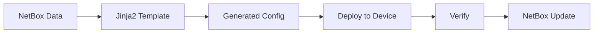

# Templates de Configuração: Automação Total

> **"Templates transformam dados em configurações. NetBox deixa de ser um CMDB e vira uma fonte de verdade para automação."**

---

## 🎯 **O que são Templates de Configuração?**

Templates de configuração são **documentos Jinja2** que geram configurações automaticamente baseadas nos dados do NetBox:

```jinja2
{# switch-config.j2 #}
hostname {{ device.name }}



interface {{ iface.name }}
 description {{ iface.description or 'Configured via NetBox' }}

 switchport access vlan {{ iface.untagged_vlan.vid }}


 switchport trunk allowed vlan {{ iface.tagged_vlans|join(',') }}

 no shutdown


```

**Resultado:**
```cisco
hostname switch-core-01

interface GigabitEthernet1/0/1
 description Server-01
 switchport access vlan 100
 no shutdown

interface GigabitEthernet1/0/2
 description Server-02
 switchport access vlan 100
 no shutdown
```

### **Benefícios:**
- ✅ **Zero erros** de digitação
- ✅ **Padronização** automática
- ✅ **Tempo** economizado
- ✅ **Auditoria** completa
- ✅ **Deploy** automatizado

---

## 🏗️ **Como Funciona**

### **Fluxo Completo:**



### **Componentes:**

| Componente | Função | Onde |
|------------|--------|------|
| **Template** | Documento Jinja2 com lógica | NetBox → Config Templates |
| **Data Source** | Dados do NetBox (interfaces, IPs, etc.) | Automático |
| **Generator** | Engine que renderiza | NetBox Built-in |
| **Config Output** | Configuração final | Copiar/Deploy |

---

## 📝 **Estrutura de Templates**

### **Localização no NetBox:**
```
NetBox Admin → Configuration → Config Templates
```

### **Campos do Template:**

```yaml
name: "Cisco Switch Standard"
template_language: "jinja2"
description: "Template padrão para switches Cisco"

# Código do template
template: |
  hostname {{ device.name }}
  !
  
  
  interface {{ iface.name }}
   description {{ iface.description or 'Configured via NetBox' }}
   
   switchport access vlan {{ iface.untagged_vlan.vid }}
   
   no shutdown
  
  
```

---

## 🔧 **Guia Jinja2 para NetBox**

### **1. Variables (Variáveis)**

#### **Objeto Device:**
```jinja2
{{ device.name }}                    # Nome do dispositivo
{{ device.serial }}                  # Número de série
{{ device.asset_tag }}               # Tag do ativo
{{ device.rack.name }}               # Nome do rack
{{ device.rack.u_height }}           # Altura do rack
{{ device.site.name }}               # Nome do site
{{ device.device_type.model }}       # Modelo do device
{{ device.device_type.manufacturer.name }}  # Fabricante
```

#### **Objeto Interface:**
```jinja2
{{ interface.name }}                 # Nome (ex: eth0)
{{ interface.description }}          # Descrição
{{ interface.enabled }}              # Status (true/false)
{{ interface.mtu }}                  # MTU
{{ interface.mac_address }}          # MAC Address
{{ interface.speed }}                # Velocidade
```

#### **Objeto IP Address:**
```jinja2
{{ ip.address }}                     # IP com máscara (ex: 192.168.1.10/24)
{{ ip.family.label }}                # IPv4 ou IPv6
{{ ip.role.label }}                  # Loopback, Interface, etc.
```

### **2. Filters (Filtros)**

#### **Filtros Comuns:**
```jinja2
{{ device.name | upper }}            # Transformar para maiúscula
{{ device.name | lower }}            # Transformar para minúscula
{{ device.name | replace(' ', '_') }}  # Substituir espaços
{{ ip.address | ipaddr('address') }}   # Extrair apenas o IP
{{ ip.address | ipaddr('network') }}   # Extrair a rede
{{ iface.description | default('No description') }}  # Valor padrão
```

#### **Filtro de VLAN:**
```jinja2

  switchport trunk allowed vlan {{ interface.tagged_vlans | map(attribute='vid') | join(',') }}

```

#### **Filtro de Loop:**
```jinja2

vlan {{ vlan.vid }}
 name {{ vlan.name }}

```

### **3. Conditionals (Condicionais)**

#### **If/Else:**
```jinja2

  ip routing
  vtp domain NETBOX

  spanning-tree portfast

  ! Standard configuration

```

#### **Verificar se existe:**
```jinja2

  description {{ interface.description }}

  ! No description set

```

### **4. Loops (Laços)**

#### **Loop em Interfaces:**
```jinja2


interface {{ interface.name }}
  description {{ interface.description or 'Configured via NetBox' }}
  no shutdown


```

#### **Loop com Índice:**
```jinja2

vlan {{ vlan.vid }}
  {# Primeira iteração #}
 name {{ vlan.name }} (Management)

 name {{ vlan.name }}


```

#### **Loop Condicional:**
```jinja2


interface {{ interface.name }}
 description {{ interface.description or 'Connected to ' ~ interface.connected_endpoint.device.name }}


```

---

## 💻 **Exemplos Práticos**

### **Exemplo 1: Switch Cisco Completo**

```jinja2
{# cisco-switch-full.j2 #}
!
version 15.2
service timestamps debug datetime msec
service timestamps log datetime msec
no service password-encryption
!
hostname {{ device.name }}
!
! Login banner
banner motd ^C
--------------------------------------------------
Device: {{ device.name }}
Location: {{ device.site.name }} - {{ device.rack.name }}
Serial: {{ device.serial }}
--------------------------------------------------
^
!
! Management VLAN
ip domain-name {{ device.site.name | lower | replace(' ', '-') }}.local
!
! SNMP
snmp-server community {{ device.site.name | lower }}-ro RO
snmp-server community {{ device.site.name | lower }}-rw RW
!
! VLANs

vlan {{ vlan.vid }}
 name {{ vlan.name }}

!
! Interface Configuration


interface {{ interface.name }}

 description {{ interface.description | truncate(50, True) }}


 switchport access vlan {{ interface.untagged_vlan.vid }}


 switchport trunk allowed vlan {{ interface.tagged_vlans | map(attribute='vid') | join(',') }}


 speed 1000
 duplex full

 no shutdown


!
! Default Gateway

ip default-gateway {{ gw }}
!
end
```

### **Exemplo 2: Router Cisco**

```jinja2
{# cisco-router.j2 #}
!
version 15.4
service timestamps debug datetime msec
service timestamps log datetime msec
no service password-encryption
!
hostname {{ device.name }}
!
! Interfaces


interface {{ interface.name }}

 description {{ interface.description | truncate(50, True) }}


 no ip address

 ip address {{ interface.ip_addresses.first().address | ipaddr('address') }} {{ interface.ip_addresses.first().address | ipaddr('netmask') }}

 no shutdown


!
! Default Route


ip route 0.0.0.0 0.0.0.0 {{ gw }}

!
! Loopback


interface {{ interface.name }}
 ip address {{ interface.ip_addresses.first().address }}
 no shutdown

!
end
```

### **Exemplo 3: Servidor Linux**

```jinja2
{# linux-server.j2 #}
#!/bin/bash
# Generated from NetBox - {{ device.name }}
# {{ device.serial }}

# Hostname
hostnamectl set-hostname {{ device.name }}.{{ device.site.name | lower }}.local

# Network Interfaces


cat > /etc/netplan/50-{{ interface.name }}.yaml << EOF
network:
  version: 2
  ethernets:
    {{ interface.name }}:


      addresses:
        - {{ ip.address | ipaddr('address') }}/{{ ip.address | ipaddr('prefix') }}


      dhcp4: false
EOF
netplan apply



# Firewall (UFW)
ufw --force reset
ufw default deny incoming
ufw default allow outgoing
ufw allow ssh
ufw --force enable

# Services
systemctl enable --now ssh

# Done
echo "Configuration applied successfully"
```

---

## 🚀 **Gerando Configurações via API**

### **Python Script Completo:**

```python
#!/usr/bin/env python3
"""
Script para gerar e aplicar configurações baseadas em templates do NetBox
"""

import os
import pynetbox
from jinja2 import Template

# Configuração
NETBOX_URL = 'http://localhost:8080'
NETBOX_TOKEN = 'SEU_TOKEN'

# Conectar ao NetBox
nb = pynetbox.api(NETBOX_URL, token=NETBOX_TOKEN)

def get_template(template_name):
    """Busca template pelo nome"""
    try:
        template = nb.extras.config_templates.get(name=template_name)
        return template
    except Exception as e:
        print(f"❌ Template não encontrado: {template_name}")
        return None

def generate_config(device_id, template_name):
    """Gera configuração para um dispositivo"""
    # Buscar dispositivo
    device = nb.dcim.devices.get(id=device_id)
    if not device:
        print(f"❌ Dispositivo {device_id} não encontrado")
        return None

    # Buscar template
    template = get_template(template_name)
    if not template:
        return None

    # Preparar dados
    context = {
        'device': device,
        'interfaces': device.interfaces.all(),
        'vlans': nb.ipam.vlans.all() if hasattr(nb.ipam, 'vlans') else [],
        'primary_ip': device.primary_ip,
    }

    # Renderizar template
    jinja_template = Template(template.template)
    config = jinja_template.render(context)

    return config

def save_config_to_file(device_name, config, output_dir='./generated-configs'):
    """Salva configuração em arquivo"""
    os.makedirs(output_dir, exist_ok=True)

    filename = f"{output_dir}/{device_name}.conf"
    with open(filename, 'w') as f:
        f.write(config)

    print(f"✅ Configuração salva: {filename}")
    return filename

def apply_config_via_ansible(device_name, config):
    """Aplica configuração via Ansible (exemplo)"""
    # Salvar configuração em arquivo temporário
    config_file = f"/tmp/{device_name}.conf"

    with open(config_file, 'w') as f:
        f.write(config)

    # Playbook Ansible simples
    playbook = f"""
- hosts: {device_name}
  tasks:
    - name: Apply configuration
      ios_config:
        src: {config_file}
      when: ansible_network_os == 'ios'
"""

    # Executar Ansible
    os.system(f"ansible-playbook -i {device_name}, -c local {playbook}")
    print(f"✅ Configuração aplicada via Ansible para {device_name}")

def batch_generate(template_name, device_filter=None):
    """Gera configurações para múltiplos dispositivos"""
    # Buscar dispositivos
    if device_filter:
        devices = nb.dcim.devices.filter(**device_filter)
    else:
        devices = nb.dcim.devices.all()

    results = []

    for device in devices:
        print(f"\n🔄 Gerando config para {device.name}...")

        config = generate_config(device.id, template_name)

        if config:
            filename = save_config_to_file(device.name, config)
            results.append({
                'device': device.name,
                'template': template_name,
                'file': filename,
                'status': 'success'
            })

            # Opcional: aplicar automaticamente
            # apply_config_via_ansible(device.name, config)
        else:
            results.append({
                'device': device.name,
                'template': template_name,
                'status': 'failed'
            })

    # Resumo
    print("\n" + "="*60)
    print(f"📊 RESUMO:")
    print(f"   Total processados: {len(results)}")
    print(f"   Sucessos: {len([r for r in results if r['status'] == 'success'])}")
    print(f"   Falhas: {len([r for r in results if r['status'] == 'failed'])}")

    return results

def main():
    """Função principal"""
    print("="*60)
    print("🚀 NetBox Config Generator")
    print("="*60)

    # Exemplo 1: Gerar para um dispositivo
    print("\n1️⃣ Gerar para um dispositivo específico:")
    config = generate_config(device_id=123, template_name="Cisco Switch Standard")
    if config:
        print("\n--- Configuração Gerada ---")
        print(config[:500] + "..." if len(config) > 500 else config)

    # Exemplo 2: Batch para todos os switches
    print("\n2️⃣ Batch para todos os switches:")
    results = batch_generate(
        template_name="Cisco Switch Standard",
        device_filter={'role': 'switch'}
    )

    print("\n✅ Concluído!")

if __name__ == '__main__':
    main()
```

**Uso:**
```bash
# Executar script
python3 config-generator.py

# Saída esperada:
# ============================================================
# 🚀 NetBox Config Generator
# ============================================================
#
# 1️⃣ Gerar para um dispositivo específico:
# 🔄 Gerando config para switch-core-01...
# ✅ Configuração salva: ./generated-configs/switch-core-01.conf
#
# 2️⃣ Batch para todos os switches:
# 🔄 Gerando config para switch-core-01...
# ✅ Configuração salva: ./generated-configs/switch-core-01.conf
# 🔄 Gerando config para switch-access-01...
# ✅ Configuração salva: ./generated-configs/switch-access-01.conf
# ...
# ============================================================
# 📊 RESUMO:
#    Total processados: 15
#    Sucessos: 15
#    Falhas: 0
#
# ✅ Concluído!
```

---

## 🔄 **Integração com Ansible**

### **Playbook para Deploy Automático:**

```yaml
---
# deploy-from-netbox.yaml
- name: Deploy configurations from NetBox templates
  hosts: all
  gather_facts: no
  vars:
    netbox_url: "http://localhost:8080"
    netbox_token: "YOUR_TOKEN"

  tasks:
    - name: Generate config from NetBox template
      uri:
        url: "{{ netbox_url }}/api/extras/config-templates/{{ config_template_id }}/render/"
        method: POST
        headers:
          Authorization: "Token {{ netbox_token }}"
        body_format: json
        body:
          device: "{{ inventory_hostname }}"
      register: config_result

    - name: Display generated config
      debug:
        msg: "{{ config_result.json.content }}"

    - name: Apply configuration (IOS)
      when: ansible_network_os == 'ios'
      ios_config:
        src: "{{ config_result.json.content }}"

    - name: Apply configuration (Juniper)
      when: ansible_network_os == 'junos'
      junos_config:
        src: "{{ config_result.json.content }}"
```

---

## 🔍 **Templates por Tipo de Dispositivo**

### **Switch (Layer 2):**
```jinja2
{# Template específico para switches layer 2 #}
hostname {{ device.name }}
!
spanning-tree mode rapid-pvst
spanning-tree portfast default
spanning-tree bpduguard enable
!

vlan {{ vlan.vid }}
 name {{ vlan.name }}

!


interface {{ interface.name }}
 switchport mode access
 switchport access vlan {{ interface.untagged_vlan.vid }}
 switchport port-security maximum 2
 switchport port-security violation restrict
 no shutdown


```

### **Router:**
```jinja2
{# Template específico para routers #}
hostname {{ device.name }}
!


interface {{ interface.name }}

 description {{ interface.description }}



 ip address {{ ip.address | ipaddr('address') }} {{ ip.address | ipaddr('netmask') }}

 no shutdown


!


ip route 0.0.0.0 0.0.0.0 {{ gw }}

```

### **Firewall:**
```jinja2
{# Template específico para firewalls #}
hostname {{ device.name }}
!
! Time zone
clock timezone {{ device.site.timezone | default('UTC') }} 0
!
! Interfaces


interface {{ interface.name }}

 description {{ interface.description }}


 vlan {{ interface.untagged_vlan.vid }}

 no shutdown


!
! Security Zones
set security zones security-zone trust interfaces {{ device.name }}-inside
set security zones security-zone untrust interfaces {{ device.name }}-outside
!
! Policies (basic)
set security policies from-zone trust to-zone untrust policy default-permit match source-address any
set security policies from-zone trust to-zone untrust policy default-permit match destination-address any
set security policies from-zone trust to-zone untrust policy default-permit then permit
```

---

## 📊 **Boas Práticas**

### **1. Organize Templates:**
```
Config Templates/
├── Cisco/
│   ├── Switch/
│   │   ├── Layer2-Basic.j2
│   │   ├── Layer3-Core.j2
│   │   └── Access-Port.j2
│   ├── Router/
│   │   ├── WAN-Edge.j2
│   │   └── Branch.j2
│   └── Firewall/
│       ├── ASA-Standard.j2
│       └── PaloAlto-Basic.j2
├── Linux/
│   ├── Ubuntu-Server.j2
│   ├── CentOS-Server.j2
│   └── Network-Interfaces.j2
└── Device-Specific/
    ├── Custom-Device-1.j2
    └── Custom-Device-2.j2
```

### **2. Use Variables:**
```jinja2
{# Definir variáveis no topo do template #}




hostname {{ device.name }}.{{ domain }}

! NTP

ntp server {{ ntp }}


! DNS

ip name-server {{ dns }}

```

### **3. Valide Configurações:**
```python
def validate_config(device_id, template_name):
    """Valida se a configuração gerada está correta"""
    config = generate_config(device_id, template_name)

    checks = {
        'has_hostname': 'hostname' in config,
        'has_description': 'description' in config,
        'proper_format': config.startswith('!'),
    }

    all_passed = all(checks.values())

    if all_passed:
        print(f"✅ Configuração válida")
    else:
        print(f"❌ Problemas encontrados:")
        for check, passed in checks.items():
            if not passed:
                print(f"   - {check}")

    return all_passed
```

---

## 📚 **Recursos**

### **Documentação Oficial**
👉 **[NetBox Config Templates](https://docs.netbox.dev/en/stable/models/extras/configtemplate/)**

👉 **[Jinja2 Documentation](https://jinja.palletsprojects.com/)**

### **Exemplos**
👉 **[NetBox Config Templates Examples](https://github.com/netbox-community/netbox/tree/develop/netbox/templates)**

---

## 🎯 **Próximos Passos**

1. 👉 **[Crie seus Primeiros Templates](templates/create-first-template.md)**
2. 👉 **[Integre com Ansible](templates/ansible-integration.md)**
3. 👉 **[Implemente Automação](templates/automation-workflow.md)**
4. 👉 **[Use com neo_stack](templates/neo-stack-integration.md)**

---

> **"Templates são a ponte entre dados e ação. Domine-os e domine a automação."**