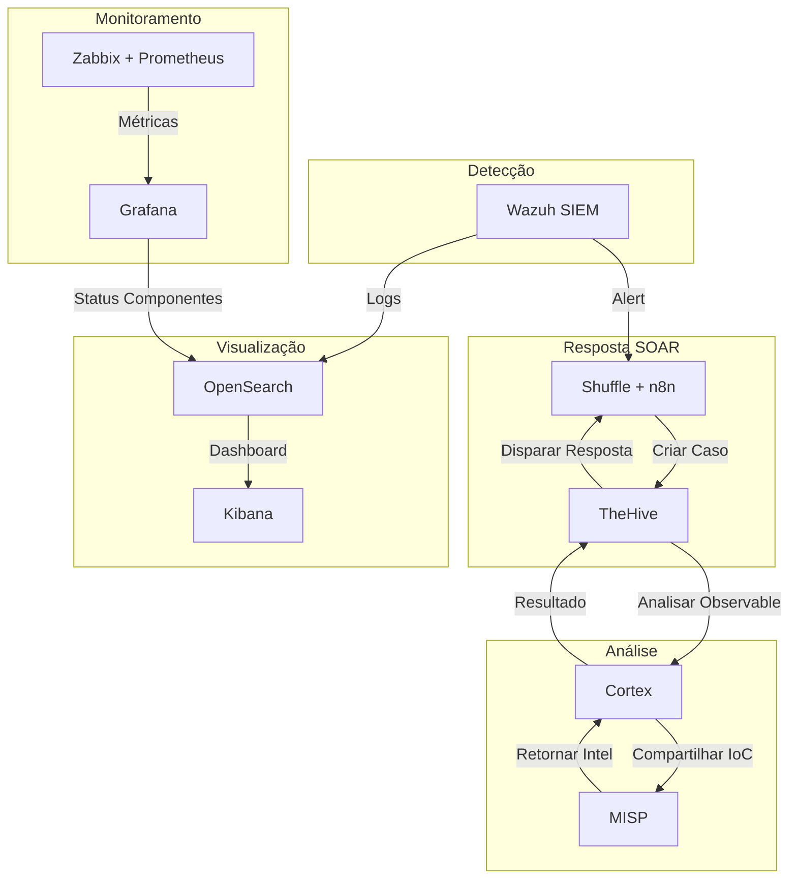

# Expansão Avançada - Stack NEO_NETBOX_ODOO

> **Bem-vindo à seção de Expansão Avançada**
> 
> Após implementar a stack básica (Odoo, NetBox, Wazuh, Shuffle, n8n), o próximo passo é elevar a sofisticação das operações de segurança com ferramentas enterprise-grade de Threat Intelligence, Incident Response, Análise de Observables e Monitoramento.

## 📋 Ferramentas de Expansão

### 🔴 **TheHive** - Incident Response Platform (SIRP)
Plataforma de gestão e resposta a incidentes com integração profunda com Cortex e MISP.

- **Propósito**: Centralizar, investigar e colaborar em incidentes de segurança
- **Componentes**: Cases, Tasks, Observables, TTPs (MITRE ATT&CK)
- **Integração**: Wazuh → Shuffle → TheHive (automático)
- **Documentação**: [TheHive](thehive/index.md)

### 🟠 **MISP** - Malware Information Sharing Platform
Plataforma de compartilhamento de inteligência de ameaças e IoCs.

- **Propósito**: Centralizar, compartilhar e correlacionar IoCs
- **Componentes**: Events, Attributes, Objects, Galaxies (MITRE ATT&CK), Taxonomies
- **Integração**: Wazuh, TheHive, Cortex, Shuffle
- **Documentação**: [MISP](misp/index.md)

### 🟡 **Cortex** - Observable Analysis & Automation
Motor de análise e resposta automatizada com 200+ analyzers integrados.

- **Propósito**: Análise massiva de IoCs com múltiplos serviços de inteligência
- **Componentes**: Analyzers (análise), Responders (resposta automática), Jobs
- **Integração**: TheHive, Wazuh, Shuffle, MISP
- **Documentação**: [Cortex](cortex/index.md)

### 🟢 **Monitoramento** - Zabbix + Prometheus + Grafana
Stack completo de monitoramento, alertas e visualização.

- **Propósito**: Monitorar infraestrutura e componentes da stack
- **Componentes**: Zabbix (agentes), Prometheus (métricas), Grafana (dashboards)
- **Integração**: Alertmanager → Wazuh/Shuffle para resposta
- **Documentação**: [Monitoramento](monitoring/index.md)

### 🔵 **Elastic/OpenSearch** - Visualização Avançada de Logs
Plataforma de busca, análise e visualização de logs em tempo real.

- **Propósito**: Centralizar, buscar e visualizar logs de toda a stack
- **Componentes**: OpenSearch (busca), Kibana (dashboards), Beats (coleta)
- **Integração**: Coleta de logs de Wazuh, Odoo, NetBox, etc
- **Documentação**: [Elastic/OpenSearch](elastic/index.md)

## 🎯 Roadmap de Implementação

### Fase 1: Detecção Base (Já Implementado)
```
Wazuh SIEM → Detecta ameaças → Alertas
```

### Fase 2: Resposta Básica (Já Implementado)
```
Wazuh → Shuffle/n8n → Ações automáticas
```

### Fase 3: Resposta Avançada (Esta seção)
```
Wazuh → Shuffle → TheHive → Cortex → Análise profunda
       ↓
     MISP → Inteligência compartilhada
       ↓
   Responders → Bloqueios automáticos
```

### Fase 4: Observabilidade Completa
```
Stack completa → Prometheus → Grafana → Dashboards
              → OpenSearch → Kibana → Busca de logs
```

## 📊 Matriz de Decisão

Qual ferramenta implementar primeiro?

| Cenário | Ferramenta | Motivo |
|---------|-----------|--------|
| **Stack pequena (<10 IPs)** | TheHive | Simples, colaborativo |
| **Muitos IoCs (>1000/dia)** | Cortex + MISP | Automação essencial |
| **Compliance obrigatório** | Elastic + Monitoramento | Auditoria completa |
| **APT suspected** | TheHive + MISP + Cortex | Investigação profunda |
| **Stakeholders técnicos** | Todos | Implementar stack completa |

## 🔗 Fluxo de Integração Completo



## 📚 Documentação por Ferramenta

### TheHive
- [Introdução](thehive/index.md) - O que é e por que usar
- [Instalação](thehive/setup.md) - Docker Compose + configuração
- [Gestão de Casos](thehive/cases-management.md) - Anatomia e workflows
- [Integração Shuffle](thehive/integration-shuffle.md) - Automação SOAR
- [Integração Stack](thehive/integration-stack.md) - Toda a pilha
- [Casos de Uso](thehive/use-cases.md) - 5 cenários reais
- [API Reference](thehive/api-reference.md) - REST API completa

### MISP
- [Introdução](misp/index.md) - Fundamentos de TI
- [Instalação](misp/setup.md) - Docker Compose + bancos
- [Threat Intelligence](misp/threat-intelligence.md) - Gestão de IoCs
- [Compartilhamento](misp/sharing.md) - Comunidades e sincronização
- [Integração Stack](misp/integration-stack.md) - Wazuh, TheHive, Cortex
- [Casos de Uso](misp/use-cases.md) - 5 cenários detalhados
- [API Reference](misp/api-reference.md) - PyMISP e REST API

### Cortex
- [Introdução](cortex/index.md) - Análise de observables
- [Instalação](cortex/setup.md) - Docker Compose
- [Analyzers](cortex/analyzers.md) - 200+ serviços de análise
- [Responders](cortex/responders.md) - Ações automatizadas
- [Integração TheHive](cortex/integration-thehive.md) - Sinergia perfeita
- [Integração Stack](cortex/integration-stack.md) - Com tudo
- [Casos de Uso](cortex/use-cases.md) - Análise automática
- [API Reference](cortex/api-reference.md) - cortex4py

### Monitoramento
- [Visão Geral](monitoring/index.md) - Observabilidade completa
- [Zabbix](monitoring/zabbix-setup.md) - Instalação e agentes
- [Prometheus](monitoring/prometheus-setup.md) - Métricas e scraping
- [Grafana](monitoring/grafana-dashboards.md) - Dashboards prontos
- [Alertas](monitoring/alerting.md) - Gerenciamento inteligente
- [Monitorando Stack](monitoring/monitoring-stack.md) - Cada componente
- [Casos de Uso](monitoring/use-cases.md) - 5 cenários de alertas

### Elastic/OpenSearch
- [Introdução](elastic/index.md) - Visualização de logs
- [Setup](elastic/setup.md) - OpenSearch + Kibana
- [Integração Wazuh](elastic/wazuh-integration.md) - Logs de SIEM
- [Dashboards](elastic/dashboards.md) - Visualizações prontas
- [Alertas](elastic/alerting.md) - Detecção em logs históricos

## 🚀 Começar Implementação

Escolha seu caminho:

### Path 1: Incident Response (TheHive + Cortex + MISP)
Para times que querem investigação profunda e compartilhamento de IoCs.

```
Dia 1: TheHive install
Dia 2: Cortex install + configurar Analyzers
Dia 3: MISP install + feeds
Dia 4-7: Integrar tudo
```

### Path 2: Observabilidade (Zabbix + Prometheus + Grafana + OpenSearch)
Para times que querem monitoramento completo e compliance.

```
Dia 1: Prometheus + Grafana
Dia 2: Zabbix + agentes
Dia 3: Alertmanager + notificações
Dia 4-7: OpenSearch + Kibana
```

### Path 3: Stack Completa
Implementar tudo em paralelo (recomendado para empresas).

```
Semana 1: Monitoramento (base para tudo)
Semana 2: TheHive + Cortex
Semana 3: MISP + Elastic
Semana 4: Integração completa
```

## 💡 Boas Práticas

1. **Sempre começa com Monitoramento**: Precisa saber se os serviços estão em pé
2. **TheHive antes de MISP**: Gerenciar casos antes de compartilhar IoCs
3. **Cortex durante TheHive**: Instalar juntos para sinergia
4. **Elastic por último**: Depois que o resto está estável
5. **Teste antes de Produção**: Use lab/sandbox para validar

## ❓ FAQ

**P: Posso usar apenas TheHive sem Cortex?**
R: Sim, mas perde automação de análise. Recomenda-se instalar juntos.

**P: Preciso usar OpenSearch ou posso usar Elasticsearch?**
R: OpenSearch é recomendado (100% open-source). Elasticsearch também funciona.

**P: Qual é o custo de infraestrutura?**
R: Todas as ferramentas são open-source. Custo é mainly hardware + pessoal.

**P: Posso implementar tudo com recursos limitados?**
R: Sim, mas com menos capacidade. Comece com o essencial (TheHive + Cortex).

## 📞 Suporte

Todas as ferramentas têm comunidades ativas:

- [StrangeBee Community](https://community.strangebee.com/) - TheHive/Cortex
- [MISP Project](https://www.misp-project.org/) - MISP
- [Prometheus Community](https://prometheus.io/community/) - Prometheus
- [Wazuh Community](https://wazuh.com/community/) - Integração Wazuh

---

**Versão**: 1.0 | **Última atualização**: Dezembro 2024 | **Manutentor**: Tim NEO Security
