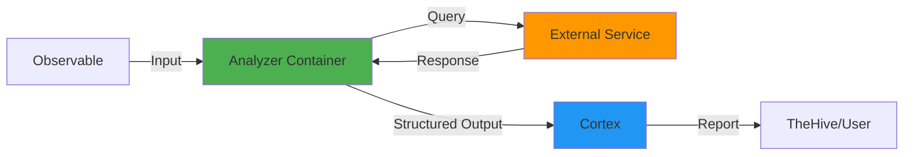
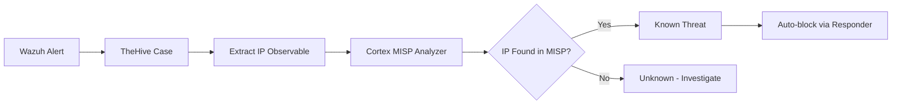

# Guia de Analyzers do Cortex

Os **Analyzers** são o componente central do Cortex, responsáveis por analisar observáveis (IOCs) e retornar informações estruturadas sobre eles.

## O que são Analyzers?

Analyzers são **programas containerizados** que:

- Recebem um observable (IP, domain, hash, URL, etc)
- Consultam fontes de dados externas (APIs, databases, sandboxes)
- Processam e normalizam os resultados
- Retornam dados estruturados com taxonomias padronizadas

### Anatomia de um Analyzer



### Tipos de Observable Suportados

| Tipo | Descrição | Exemplos |
|------|-----------|----------|
| **ip** | IPv4 ou IPv6 | `8.8.8.8`, `2001:4860:4860::8888` |
| **domain** | Nome de domínio | `example.com`, `google.com` |
| **url** | URL completa | `https://example.com/path` |
| **fqdn** | Fully Qualified Domain Name | `mail.example.com` |
| **mail** | Endereço de email | `user@example.com` |
| **hash** | MD5, SHA1, SHA256, SHA512 | `5d41402abc4b2a76b9719d911017c592` |
| **file** | Arquivo binário | Upload de arquivo |
| **filename** | Nome de arquivo | `malware.exe` |
| **registry** | Chave de registro Windows | `HKLM\Software\...` |
| **user-agent** | User Agent HTTP | `Mozilla/5.0 ...` |

## Categorias de Analyzers

### 1. Reputação e Threat Intelligence

Verificam a reputação de observables em bases de dados de ameaças.

#### VirusTotal

**VirusTotal_GetReport_3_0**

Consulta relatório existente no VirusTotal (70+ antivírus).

```yaml
Tipos suportados: ip, domain, url, hash
Requer API Key: Sim
Rate Limit (free): 4 requisições/minuto
Rate Limit (paid): 1000 requisições/minuto
```

**Configuração:**

```json
{
  "name": "VirusTotal_GetReport_3_0",
  "configuration": {
    "key": "SUA_API_KEY_VIRUSTOTAL",
    "polling_interval": 60,
    "auto_extract_artifacts": true
  }
}
```

**Obter API Key:**
1. Criar conta em https://www.virustotal.com
2. Acessar https://www.virustotal.com/gui/my-apikey
3. Copiar API key

**Exemplo de Resultado:**

```json
{
  "success": true,
  "summary": {
    "taxonomies": [
      {
        "level": "malicious",
        "namespace": "VirusTotal",
        "predicate": "Score",
        "value": "15/70"
      }
    ]
  },
  "full": {
    "positives": 15,
    "total": 70,
    "scans": {
      "Kaspersky": {
        "detected": true,
        "result": "Trojan.Generic.12345678"
      },
      "Microsoft": {
        "detected": true,
        "result": "Trojan:Win32/Agent.A"
      }
    },
    "permalink": "https://www.virustotal.com/file/abc123..."
  }
}
```

**VirusTotal_Scan_3_0**

Submete arquivo para análise (quando não existe relatório).

```yaml
Tipos suportados: file, hash
Requer API Key: Sim
Tempo de execução: 2-10 minutos
```

!!! warning "Rate Limits"
    Contas gratuitas do VirusTotal têm limite de 4 req/min. Para produção, considere conta paga ou use `GetReport` que consulta cache.

---

#### AbuseIPDB

**AbuseIPDB_1_0**

Verifica IPs em base de dados de abuso com milhões de reports.

```yaml
Tipos suportados: ip
Requer API Key: Sim
Rate Limit (free): 1000 requisições/dia
Rate Limit (paid): 100.000+ requisições/dia
```

**Configuração:**

```json
{
  "name": "AbuseIPDB_1_0",
  "configuration": {
    "key": "SUA_API_KEY_ABUSEIPDB",
    "days": 90
  }
}
```

**Obter API Key:**
1. Criar conta em https://www.abuseipdb.com/register
2. Acessar https://www.abuseipdb.com/account/api
3. Criar API key

**Interpretação de Resultados:**

| Score | Nível | Ação Recomendada |
|-------|-------|------------------|
| 0-25 | Baixo | Monitorar |
| 26-75 | Médio | Investigar |
| 76-100 | Alto | Bloquear |

**Exemplo:**

```json
{
  "summary": {
    "taxonomies": [{
      "level": "malicious",
      "namespace": "AbuseIPDB",
      "predicate": "Score",
      "value": "92"
    }]
  },
  "full": {
    "abuseConfidenceScore": 92,
    "totalReports": 156,
    "numDistinctUsers": 45,
    "lastReportedAt": "2025-12-01T10:30:00+00:00"
  }
}
```

---

#### Shodan

**Shodan_Info_1_0 / Shodan_Host_1_1**

Busca informações sobre serviços expostos na internet.

```yaml
Tipos suportados: ip
Requer API Key: Sim
Rate Limit (free): 100 requisições/mês
Rate Limit (paid): Ilimitado
```

**Configuração:**

```json
{
  "name": "Shodan_Host_1_1",
  "configuration": {
    "key": "SUA_API_KEY_SHODAN"
  }
}
```

**Obter API Key:**
1. Criar conta em https://account.shodan.io/register
2. Acessar https://account.shodan.io/
3. Copiar API key (seção "API Key")

**Informações Retornadas:**

- Portas abertas
- Serviços expostos (HTTP, SSH, FTP, etc)
- Banners de serviço
- Vulnerabilidades conhecidas (CVEs)
- Geolocalização
- ISP e ASN
- Histórico de scans

**Exemplo:**

```json
{
  "full": {
    "ip": "192.0.2.1",
    "ports": [22, 80, 443, 3306],
    "services": {
      "22": {"product": "OpenSSH", "version": "7.4"},
      "80": {"product": "nginx", "version": "1.18.0"},
      "443": {"product": "nginx", "version": "1.18.0"},
      "3306": {"product": "MySQL", "version": "5.7.36"}
    },
    "vulns": ["CVE-2021-3156", "CVE-2021-44228"],
    "country": "US",
    "city": "New York",
    "isp": "Digital Ocean"
  }
}
```

!!! danger "MySQL Exposto"
    No exemplo acima, MySQL na porta 3306 exposto publicamente é sinal de configuração insegura!

---

#### OTXQuery (AlienVault)

**OTXQuery_2_0**

Consulta AlienVault Open Threat Exchange.

```yaml
Tipos suportados: ip, domain, hash, url
Requer API Key: Sim
Rate Limit: Generoso (gratuito)
```

**Configuração:**

```json
{
  "name": "OTXQuery_2_0",
  "configuration": {
    "key": "SUA_API_KEY_OTX"
  }
}
```

**Obter API Key:**
1. Criar conta em https://otx.alienvault.com/
2. Acessar Settings > API Integration
3. Copiar OTX Key

---

#### URLhaus / PhishTank / ThreatCrowd

Analyzers gratuitos sem necessidade de API key:

**URLhaus_2_0**
```yaml
Tipos: url, domain
Base: Malware URLs
API Key: Não requerida
```

**PhishTank_2_1**
```yaml
Tipos: url
Base: Phishing URLs
API Key: Não requerida
```

**ThreatCrowd_2_0**
```yaml
Tipos: ip, domain, email
Base: Threat correlation
API Key: Não requerida
```

### 2. Malware Analysis

Analyzers que submetem arquivos para análise em sandboxes.

#### Hybrid Analysis

**HybridAnalysis_GetReport_1_0**

Consulta relatório de malware no Hybrid Analysis.

```yaml
Tipos suportados: hash, file
Requer API Key: Sim
Rate Limit (free): 200 requisições/dia
Rate Limit (paid): Ilimitado
Tempo análise: 3-10 minutos
```

**Configuração:**

```json
{
  "name": "HybridAnalysis_GetReport_1_0",
  "configuration": {
    "key": "SUA_API_KEY_HYBRID",
    "environment": "Windows 10 64-bit"
  }
}
```

**Obter API Key:**
1. Criar conta em https://www.hybrid-analysis.com/
2. Profile > API Key
3. Generate API Key

**Informações Retornadas:**

- Comportamento do malware
- Network activity (IPs, domains contatados)
- Registry modifications
- Files created/modified/deleted
- Processos criados
- Mitre ATT&CK techniques
- Screenshots da execução

---

#### Joe Sandbox

**JoeSandbox_File_Analysis_2_0**

Sandbox avançado para análise profunda de malware.

```yaml
Tipos suportados: file
Requer API Key: Sim
Custo: Pago (sem tier gratuito)
Tempo análise: 5-15 minutos
```

**Configuração:**

```json
{
  "name": "JoeSandbox_File_Analysis_2_0",
  "configuration": {
    "url": "https://jbxcloud.joesecurity.org",
    "key": "SUA_API_KEY_JOESANDBOX",
    "analysis_time": "auto",
    "internet_access": true,
    "report_cache": true
  }
}
```

**Features Avançadas:**

- Detecção de evasão de sandbox
- Análise de documentos (Office, PDF)
- Análise de APKs Android
- Anti-VM detection bypass
- Relatórios extremamente detalhados

---

#### Cuckoo Sandbox

**Cuckoo_Sandbox_File_Analysis_1_2**

Sandbox open-source que pode ser instalado localmente.

```yaml
Tipos suportados: file, url
Requer API Key: Depende da instalação
Self-hosted: Sim (vantagem)
```

**Configuração:**

```json
{
  "name": "Cuckoo_Sandbox_File_Analysis_1_2",
  "configuration": {
    "url": "http://cuckoo.internal:8090",
    "verify_ssl": false
  }
}
```

**Vantagens Self-Hosted:**
- Sem custos por análise
- Dados sensíveis não saem da rede
- Customização completa
- Integração com análise forense

!!! tip "Instalação Local"
    Para SOC com alta demanda de análise de malware, considere instalar Cuckoo Sandbox localmente. Guia de instalação disponível em: https://cuckoosandbox.org/

### 3. Geolocalização e Network

#### MaxMind GeoIP

**MaxMind_GeoIP_4_0**

Geolocalização precisa de IPs usando database MaxMind.

```yaml
Tipos suportados: ip
Requer Licença: Sim (GeoLite2 gratuita)
Performance: Muito rápida (local database)
```

**Configuração:**

```json
{
  "name": "MaxMind_GeoIP_4_0",
  "configuration": {
    "account_id": "SEU_ACCOUNT_ID",
    "license_key": "SUA_LICENSE_KEY",
    "db_path": "/opt/cortex/maxmind"
  }
}
```

**Obter Licença GeoLite2 (Gratuita):**

1. Criar conta em https://www.maxmind.com/en/geolite2/signup
2. Gerar License Key
3. Baixar GeoLite2 City database

```bash
# Baixar e configurar
cd /opt/cortex
mkdir maxmind
cd maxmind

# Baixar database (requer licença)
wget "https://download.maxmind.com/app/geoip_download?edition_id=GeoLite2-City&license_key=SUA_LICENSE&suffix=tar.gz" -O GeoLite2-City.tar.gz

tar -xzf GeoLite2-City.tar.gz
mv GeoLite2-City_*/GeoLite2-City.mmdb .
```

**Informações Retornadas:**

```json
{
  "full": {
    "ip": "8.8.8.8",
    "country": "United States",
    "country_code": "US",
    "city": "Mountain View",
    "region": "California",
    "postal_code": "94035",
    "latitude": 37.386,
    "longitude": -122.0838,
    "timezone": "America/Los_Angeles",
    "asn": "AS15169",
    "as_org": "Google LLC"
  }
}
```

---

#### IPinfo

**IPinfo_1_0**

Alternativa ao MaxMind com API simples.

```yaml
Tipos suportados: ip
Requer API Key: Sim
Rate Limit (free): 50.000 req/mês
```

---

#### DNSDB / PassiveDNS

**CIRCL_PassiveDNS_2_0**

Consulta histórico DNS passivo.

```yaml
Tipos suportados: domain, ip
Requer API Key: Sim
Fonte: CIRCL.lu
```

**Utilidade:**

- Ver histórico de resoluções DNS
- Identificar domínios associados a IP
- Rastrear mudanças de infraestrutura C2

### 4. Email Analysis

#### EmailRep

**EmailRep_1_0**

Verifica reputação de endereços de email.

```yaml
Tipos suportados: mail
Requer API Key: Sim
Rate Limit (free): 300 req/dia
```

**Configuração:**

```json
{
  "name": "EmailRep_1_0",
  "configuration": {
    "key": "SUA_API_KEY_EMAILREP"
  }
}
```

**Obter API Key:**
https://emailrep.io/

**Informações Retornadas:**

```json
{
  "full": {
    "email": "attacker@evil.com",
    "reputation": "low",
    "suspicious": true,
    "references": 15,
    "details": {
      "blacklisted": true,
      "malicious_activity": true,
      "credentials_leaked": true,
      "data_breach": true,
      "spam": true,
      "profiles": ["twitter", "github"]
    }
  }
}
```

---

#### Hunter.io

**Hunter_1_0**

Verifica e encontra emails corporativos.

```yaml
Tipos suportados: mail, domain
Requer API Key: Sim
Rate Limit (free): 50 req/mês
```

### 5. Threat Intelligence Platforms

#### MISP

**MISP_2_1**

Consulta eventos em instância MISP.

```yaml
Tipos suportados: ip, domain, hash, url, email, etc
Requer API Key: Sim
Self-hosted: Sim
```

**Configuração:**

```json
{
  "name": "MISP_2_1",
  "configuration": {
    "url": "https://misp.example.com",
    "key": "SUA_API_KEY_MISP",
    "cert_check": true,
    "cert_path": "/path/to/ca.pem"
  }
}
```

**Informações Retornadas:**

- Eventos MISP que contêm o observable
- Tags e galaxies associados
- TLP (Traffic Light Protocol)
- Timestamps de criação/modificação
- Organizações que compartilharam

**Uso Típico:**



---

#### OpenCTI

**OpenCTI_SearchObservables_1_0**

Consulta observables no OpenCTI.

```yaml
Tipos suportados: ip, domain, hash, url
Requer API Key: Sim
Self-hosted: Sim
Padrão: STIX 2.1
```

---

#### RecordedFuture / ThreatConnect

Plataformas comerciais de threat intelligence:

**RecordedFuture_2_1**
```yaml
Custo: Enterprise (caro)
Cobertura: Excelente
Features: Risk score, context, threat actors
```

**ThreatConnect_1_0**
```yaml
Custo: Enterprise
Cobertura: Boa
Features: Diamond model, campaigns
```

### 6. File Analysis

#### FileInfo

**FileInfo_8_0**

Extrai metadata de arquivos (sem necessidade de API).

```yaml
Tipos suportados: file
Requer API Key: Não
Performance: Muito rápida (local)
```

**Informações Extraídas:**

- Tipo de arquivo (magic bytes)
- Tamanho
- Hashes (MD5, SHA1, SHA256, SHA512, SSDEEP)
- Metadata EXIF (imagens)
- PE info (executáveis Windows)
- Entropia (indicador de packing/encryption)

**Exemplo:**

```json
{
  "full": {
    "filename": "suspicious.exe",
    "size": 524288,
    "mimetype": "application/x-dosexec",
    "md5": "5d41402abc4b2a76b9719d911017c592",
    "sha1": "aaf4c61ddcc5e8a2dabede0f3b482cd9aea9434d",
    "sha256": "2c26b46b68ffc68ff99b453c1d30413413422d706483bfa0f98a5e886266e7ae",
    "entropy": 7.2,
    "pe_info": {
      "compilation_timestamp": "2025-01-15 10:30:00",
      "imphash": "abc123def456",
      "sections": [
        {"name": ".text", "entropy": 6.5},
        {"name": ".data", "entropy": 4.2},
        {"name": ".rsrc", "entropy": 7.8}
      ]
    }
  }
}
```

!!! info "Entropia"
    **Entropia > 7.0** indica possível packing/encryption de malware.

---

#### Yara

**Yara_2_0**

Executa regras Yara em arquivos.

```yaml
Tipos suportados: file
Requer API Key: Não
Customização: Alta (rules customizadas)
```

**Configuração:**

```json
{
  "name": "Yara_2_0",
  "configuration": {
    "rules_paths": [
      "/opt/cortex/yara-rules/malware",
      "/opt/cortex/yara-rules/custom"
    ]
  }
}
```

**Instalar Rules:**

```bash
# Clonar repositório de rules populares
cd /opt/cortex
git clone https://github.com/Yara-Rules/rules.git yara-rules
```

**Exemplo de Rule Customizada:**

```yara
rule Ransomware_Generic {
    meta:
        description = "Detecta padrões comuns de ransomware"
        author = "SOC Team"
        date = "2025-12-01"

    strings:
        $s1 = "encrypted" nocase
        $s2 = "bitcoin" nocase
        $s3 = "decrypt"
        $crypto1 = { 6A 40 68 00 30 00 00 }  // CryptAcquireContext

    condition:
        uint16(0) == 0x5A4D and  // MZ header
        filesize < 5MB and
        ($s1 and $s2) or $crypto1
}
```

### 7. Certificate Analysis

#### CERTatPassive

**CERTatPassive_2_0**

Busca histórico de certificados SSL/TLS.

```yaml
Tipos suportados: domain, ip
Requer API Key: Não
Fonte: Censys, crt.sh
```

**Utilidade:**

- Encontrar domínios relacionados (mesmo certificado)
- Identificar infraestrutura de atacantes
- Timeline de certificados

### 8. Special Purpose

#### CyberChef

**CyberChef_1_0**

Decodifica/desobfusca strings automaticamente.

```yaml
Tipos suportados: any (string)
Requer API Key: Não
Features: Base64, URL decode, XOR, etc
```

---

#### Tor

**Tor_Project_1_0 / TorBlutmagie_1_0**

Verifica se IP é exit node Tor.

```yaml
Tipos suportados: ip
Requer API Key: Não
```

## Interpretação de Resultados

### Taxonomies

Todas os analyzers retornam **taxonomies** que padronizam resultados:

```json
{
  "taxonomies": [
    {
      "level": "malicious",      // safe, info, suspicious, malicious
      "namespace": "VirusTotal",  // Fonte
      "predicate": "Score",       // Tipo de informação
      "value": "15/70"            // Valor
    }
  ]
}
```

#### Níveis de Severidade

| Nível | Cor | Significado | Ação |
|-------|-----|-------------|------|
| **safe** | Verde | Sem problemas detectados | Nenhuma |
| **info** | Azul | Informação contextual | Registrar |
| **suspicious** | Laranja | Comportamento suspeito | Investigar |
| **malicious** | Vermelho | Confirmado malicioso | Responder |

### Artifacts Extraídos

Analyzers podem extrair novos observables:

```json
{
  "artifacts": [
    {
      "type": "domain",
      "value": "c2server.evil.com",
      "tags": ["c2", "extracted", "malicious"]
    },
    {
      "type": "ip",
      "value": "192.0.2.1",
      "tags": ["c2-ip"]
    }
  ]
}
```

**No TheHive**, esses artifacts são automaticamente adicionados ao caso para análise recursiva.

## Criação de Analyzers Customizados

Você pode criar analyzers próprios para fontes internas ou análises específicas.

### Estrutura de um Analyzer

```
MyCustomAnalyzer/
├── MyCustomAnalyzer.json       # Metadata
├── myanalyzer.py               # Código principal
├── requirements.txt            # Dependências Python
└── Dockerfile                  # Container
```

### Exemplo: Analyzer de Lista Interna

**MyCustomAnalyzer.json:**

```json
{
  "name": "InternalBlacklist",
  "version": "1.0",
  "author": "SOC Team",
  "url": "https://github.com/myorg/cortex-analyzers",
  "license": "AGPL-V3",
  "description": "Verifica IP em blacklist interna",
  "dataTypeList": ["ip"],
  "command": "InternalBlacklist/myanalyzer.py",
  "baseConfig": "InternalBlacklist",
  "config": {
    "check_tlp": true,
    "max_tlp": 2
  },
  "configurationItems": [
    {
      "name": "blacklist_url",
      "description": "URL da blacklist interna",
      "type": "string",
      "multi": false,
      "required": true
    }
  ]
}
```

**myanalyzer.py:**

```python
#!/usr/bin/env python3
from cortexutils.analyzer import Analyzer
import requests

class InternalBlacklistAnalyzer(Analyzer):
    def __init__(self):
        Analyzer.__init__(self)
        self.blacklist_url = self.get_param('config.blacklist_url', None, 'Blacklist URL missing')

    def summary(self, raw):
        taxonomies = []
        namespace = "InternalBlacklist"

        if raw.get('found'):
            level = "malicious"
            value = "Blacklisted"
        else:
            level = "safe"
            value = "Clean"

        taxonomies.append(self.build_taxonomy(level, namespace, "Status", value))
        return {"taxonomies": taxonomies}

    def run(self):
        if self.data_type == 'ip':
            try:
                ip = self.get_data()

                # Consultar blacklist interna
                response = requests.get(
                    f"{self.blacklist_url}/check/{ip}",
                    timeout=30
                )

                result = response.json()

                self.report({
                    'ip': ip,
                    'found': result.get('blacklisted', False),
                    'reason': result.get('reason', ''),
                    'added_date': result.get('added_date', ''),
                    'added_by': result.get('added_by', '')
                })

            except Exception as e:
                self.error(f"Error checking blacklist: {str(e)}")
        else:
            self.error('Invalid data type')

if __name__ == '__main__':
    InternalBlacklistAnalyzer().run()
```

**requirements.txt:**

```
cortexutils
requests
```

**Dockerfile:**

```dockerfile
FROM python:3.9-alpine

RUN apk add --no-cache --virtual build-deps gcc musl-dev
RUN pip install --no-cache-dir cortexutils requests

WORKDIR /worker
COPY . /worker

RUN addgroup -g 1000 worker && \
    adduser -D -u 1000 -G worker worker && \
    chown -R worker:worker /worker

USER worker

ENTRYPOINT ["python3", "myanalyzer.py"]
```

### Construir e Registrar

```bash
# Construir imagem
docker build -t myorg/cortex-internalblacklist:1.0 .

# Push para registry (se necessário)
docker push myorg/cortex-internalblacklist:1.0

# Adicionar ao Cortex
# Via web interface: Organization > Analyzers > Custom > Add
```

## Performance e Rate Limiting

### Configurar Rate Limits

Evite banimento de APIs externas:

```hocon
# application.conf
analyzer {
  config {
    VirusTotal_GetReport_3_0 {
      rate_limit {
        max_requests = 4
        per_seconds = 60
      }
    }

    Shodan_Host_1_1 {
      rate_limit {
        max_requests = 1
        per_seconds = 1
      }
    }

    AbuseIPDB_1_0 {
      rate_limit {
        max_requests = 20
        per_seconds = 60
      }
    }
  }
}
```

### Caching de Resultados

Cortex cacheia resultados automaticamente:

```hocon
cache {
  job = 10 minutes      # Cache de jobs
  analyzer = 24 hours   # Cache de analyzers
}
```

### Paralelização

Configure workers paralelos:

```hocon
analyzer {
  fork-join-executor {
    parallelism-min = 4
    parallelism-factor = 2.0
    parallelism-max = 16
  }
}
```

**Cálculo de workers:**
```
workers = min(max, parallelism-factor * cores)
```

## Melhores Práticas

### 1. Seleção de Analyzers

**Não habilite todos os analyzers!**

Critérios:

- **Custo**: API keys pagas valem a pena?
- **Rate limits**: Vai bater o limite?
- **Relevância**: É útil para seu SOC?
- **Performance**: Quanto tempo demora?

**Sugestão para começar:**

```yaml
Gratuitos essenciais:
  - FileInfo_8_0
  - MaxMind_GeoIP_4_0
  - URLhaus_2_0
  - PhishTank_2_1

Com API key (gratuitos):
  - VirusTotal_GetReport_3_0
  - AbuseIPDB_1_0
  - Shodan_Info_1_0
  - OTXQuery_2_0

Self-hosted:
  - MISP_2_1
  - Yara_2_0
```

### 2. Gestão de API Keys

```bash
# Usar variáveis de ambiente
export VT_API_KEY="abc123..."
export SHODAN_API_KEY="def456..."

# Ou secrets manager
docker secret create vt_api_key vt_key.txt
```

### 3. Monitoramento de Uso

```bash
# Verificar rate limit status
curl -H "Authorization: Bearer $API_KEY" \
  http://localhost:9001/api/analyzer/VirusTotal_GetReport_3_0/quota
```

### 4. Troubleshooting

**Analyzer falha constantemente:**

```bash
# Ver logs do analyzer
docker logs $(docker ps -q --filter "name=virustotal")

# Testar manualmente
docker run --rm -it \
  -e API_KEY="sua_key" \
  cortexneurons/virustotal:3.0 \
  python virustotal.py <<EOF
{
  "data": "8.8.8.8",
  "dataType": "ip",
  "config": {"key": "sua_key"}
}
EOF
```

## Recursos

- **Neuron Catalog:** https://github.com/TheHive-Project/Cortex-Analyzers
- **Criar Analyzers:** https://docs.strangebee.com/cortex/development/
- **API Reference:** [api-reference.md](api-reference.md)

---

**Próximo:** [Guia de Responders](responders.md)
