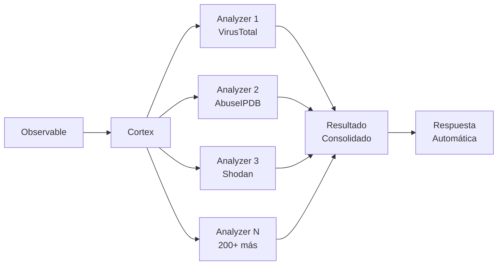
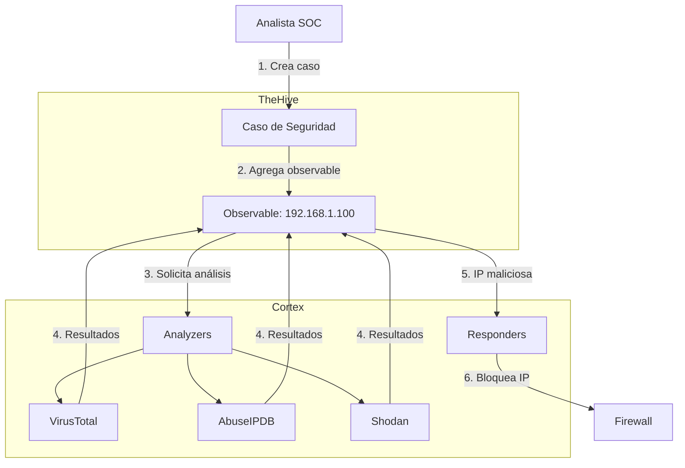
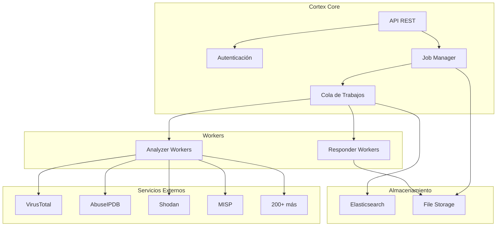
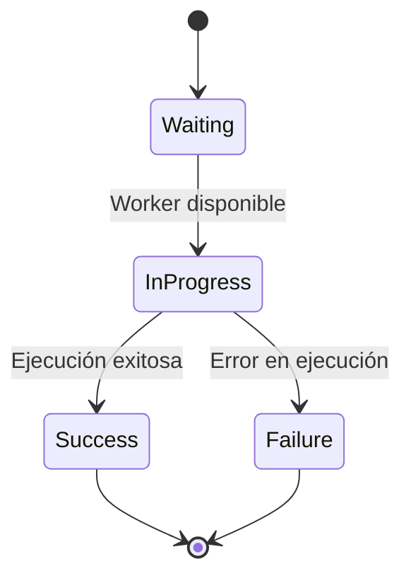
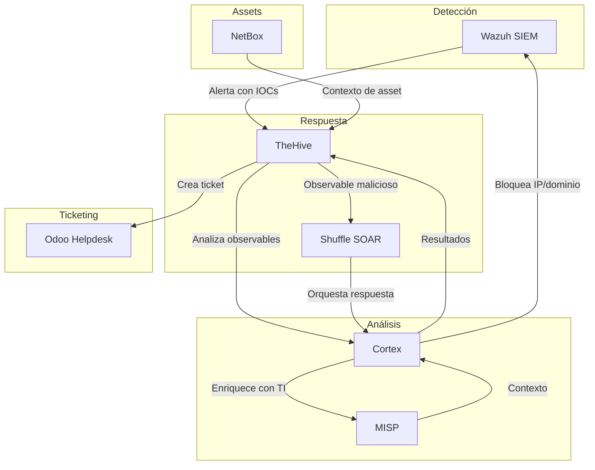
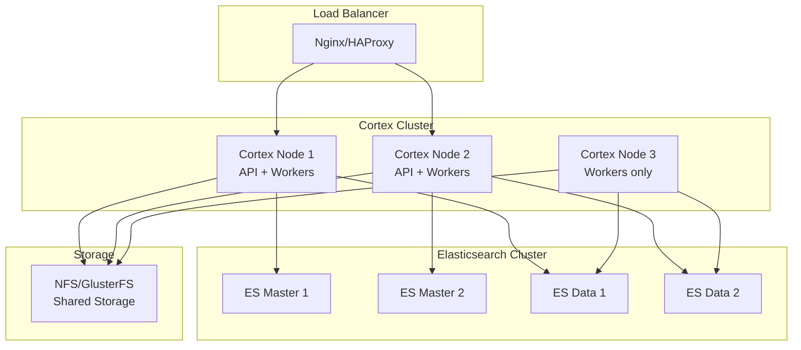
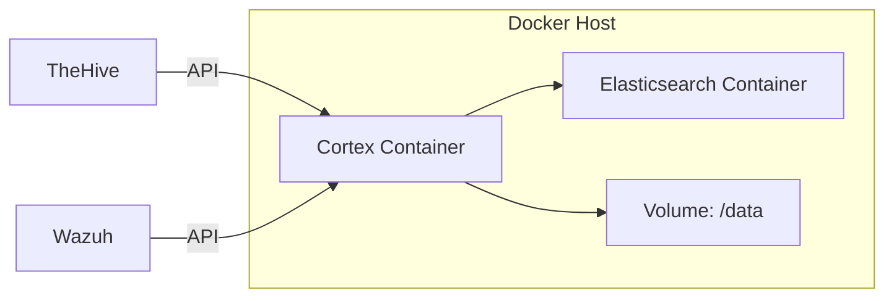

# Introducción a Cortex

## Bienvenido a Cortex

Cortex es una **plataforma de análisis y respuesta de observables** desarrollada por **StrangeBee** (anteriormente THEHIVE Project), diseñada para automatizar y escalar las capacidades de análisis en operaciones de seguridad. Es el motor de inteligencia que permite analizar grandes volúmenes de indicadores de compromiso (IOCs) de forma automática y ejecutar respuestas coordinadas.

!!! info "¿Qué es Cortex?"
    Cortex es una herramienta de orquestación que centraliza y automatiza el análisis de observables (IPs, dominios, URLs, hashes, emails) utilizando más de **200 servicios especializados**, proporcionando resultados estructurados y accionables para equipos SOC, CSIRT y analistas de seguridad.

---

## ¿Por qué Cortex?

En operaciones de seguridad modernas, los analistas enfrentan desafíos críticos:

### Problemas Comunes

- **Volumen Masivo**: Miles de alertas y observables diarios que requieren análisis
- **Múltiples Fuentes**: Integraciones dispersas con VirusTotal, Shodan, AbuseIPDB, MISP, etc.
- **Trabajo Manual**: Copiar/pegar observables entre herramientas consume tiempo valioso
- **Falta de Contexto**: Resultados fragmentados dificultan la toma de decisiones
- **Respuestas Lentas**: Tiempo crítico perdido en tareas repetitivas

### Solución Cortex

Cortex resuelve estos problemas mediante:



✅ **Análisis Automatizado**: Un solo clic analiza el observable en decenas de servicios
✅ **Resultados Unificados**: Todos los resultados en un formato consistente
✅ **Escalabilidad**: Procesa miles de observables en paralelo
✅ **Respuesta Coordinada**: Ejecuta acciones automáticas basadas en resultados
✅ **API First**: Integración completa con ecosistemas de seguridad

---

## Relación con TheHive

Cortex y TheHive son productos **complementarios** desarrollados por el mismo equipo (StrangeBee):

| Aspecto | TheHive | Cortex |
|---------|---------|--------|
| **Propósito** | Gestión de casos e incidentes | Análisis y respuesta de observables |
| **Función** | Plataforma SIRP (Security Incident Response Platform) | Motor de análisis y orquestación |
| **Usuario Típico** | Analistas SOC, Managers | Sistemas automatizados, analistas |
| **Interacción** | Interface web, gestión colaborativa | API, procesamiento background |
| **Dependencia** | Puede usar Cortex (opcional) | Independiente de TheHive |

### Arquitectura Integrada



!!! tip "Integración Opcional"
    Aunque Cortex fue diseñado para TheHive, puede usarse **independientemente** con cualquier sistema que necesite análisis de observables (SIEM, SOAR, scripts personalizados).

---

## Arquitectura de Cortex

### Componentes Principales



### Flujo de Procesamiento

1. **Recepción**: Cliente envía observable vía API REST
2. **Validación**: Cortex valida el tipo de observable (IP, dominio, hash, etc.)
3. **Encolamiento**: Job se agrega a la cola de Elasticsearch
4. **Ejecución**: Workers toman jobs y ejecutan analyzers/responders
5. **Almacenamiento**: Resultados se guardan en Elasticsearch
6. **Notificación**: Cliente recibe webhook o consulta resultados vía API

---

## Conceptos Fundamentales

### 1. Analyzers (Analizadores)

!!! abstract "Definición"
    Los **Analyzers** son módulos especializados que analizan observables contra servicios externos o bases de datos, retornando información de inteligencia estructurada.

**Características:**

- **Entrada**: Observable (IP, dominio, URL, hash, email, etc.)
- **Proceso**: Consulta a servicio externo o análisis local
- **Salida**: Report con nivel de riesgo, taxonomías y datos enriquecidos
- **Tipos de datos**: Solo lectura, no modifica sistemas

**Ejemplo conceptual:**

```python
# Analyzer: AbuseIPDB_1
Input: {
    "dataType": "ip",
    "data": "192.168.1.100"
}

Output: {
    "success": true,
    "artifacts": [],
    "operations": [],
    "full": {
        "abuseConfidenceScore": 85,
        "totalReports": 47,
        "lastReportedAt": "2024-12-01",
        "usageType": "Data Center"
    },
    "summary": {
        "taxonomies": [
            {
                "level": "malicious",
                "namespace": "AbuseIPDB",
                "predicate": "Score",
                "value": "85/100"
            }
        ]
    }
}
```

### 2. Responders (Respondedores)

!!! abstract "Definición"
    Los **Responders** son módulos que ejecutan **acciones** basadas en observables o casos, permitiendo respuesta automatizada a incidentes.

**Características:**

- **Entrada**: Observable o caso completo
- **Proceso**: Ejecución de acción (bloquear IP, enviar email, crear ticket)
- **Salida**: Confirmación de ejecución y resultados
- **Tipos de datos**: Escritura, modifica sistemas externos

**Ejemplo conceptual:**

```python
# Responder: Firewall_Block_IP
Input: {
    "dataType": "ip",
    "data": "192.168.1.100",
    "parameters": {
        "firewall": "pfsense-01",
        "duration": "24h"
    }
}

Output: {
    "success": true,
    "operations": [
        {
            "type": "AddOperationLog",
            "message": "IP 192.168.1.100 bloqueada en pfsense-01"
        }
    ],
    "full": {
        "rule_id": "auto_block_12345",
        "expires_at": "2024-12-06T10:30:00Z"
    }
}
```

### 3. Jobs (Trabajos)

!!! abstract "Definición"
    Un **Job** es la instancia de ejecución de un analyzer o responder sobre un observable específico.

**Estados del Job:**



- `Waiting`: Job en cola esperando worker disponible
- `InProgress`: Worker ejecutando el análisis
- `Success`: Completado exitosamente
- `Failure`: Error durante la ejecución

**Metadatos del Job:**

```json
{
    "id": "~123456789",
    "analyzerId": "AbuseIPDB_1",
    "status": "Success",
    "date": 1701432000000,
    "startDate": 1701432005000,
    "endDate": 1701432012000,
    "dataType": "ip",
    "data": "192.168.1.100",
    "workerName": "cortex-worker-01",
    "workerDefinition": "AbuseIPDB_1_0"
}
```

### 4. Reports (Reportes)

!!! abstract "Definición"
    El **Report** es el resultado estructurado de un job, conteniendo todos los datos retornados por el analyzer/responder.

**Estructura del Report:**

=== "Resumen (Summary)"
    ```json
    {
        "taxonomies": [
            {
                "level": "malicious",
                "namespace": "VirusTotal",
                "predicate": "Score",
                "value": "45/89"
            }
        ]
    }
    ```

=== "Completo (Full)"
    ```json
    {
        "scans": {
            "Kaspersky": {"detected": true, "result": "Trojan.Generic"},
            "McAfee": {"detected": true, "result": "RDN/Generic"},
            "...": "87 más"
        },
        "scan_date": "2024-12-01 10:30:45",
        "positives": 45,
        "total": 89
    }
    ```

=== "Artefactos (Artifacts)"
    ```json
    {
        "artifacts": [
            {
                "dataType": "domain",
                "data": "malware-c2.example.com",
                "tags": ["c2", "malware"]
            }
        ]
    }
    ```

**Niveles de Taxonomía:**

| Nivel | Color | Significado | Ejemplo |
|-------|-------|-------------|---------|
| `safe` | 🟢 Verde | Seguro, sin riesgo | IP limpia |
| `info` | 🔵 Azul | Informativo, neutral | Geolocalización |
| `suspicious` | 🟡 Amarillo | Sospechoso, requiere atención | Dominio joven |
| `malicious` | 🔴 Rojo | Malicioso, alta confianza | Hash conocido |

---

## Analyzers Disponibles (200+)

Cortex incluye un ecosistema extenso de analyzers organizados por categorías:

### Reputación de IP

| Analyzer | Descripción | API Key | Gratuito |
|----------|-------------|---------|----------|
| **AbuseIPDB** | Base de datos de IPs maliciosas reportadas | ✅ | ✅ Limitado |
| **GreyNoise** | Contexto de IPs de internet (ruido vs amenaza) | ✅ | ✅ Limitado |
| **IPVoid** | Agregador de 40+ blacklists | ✅ | ✅ Limitado |
| **OTX AlienVault** | Inteligencia colaborativa de amenazas | ✅ | ✅ Completo |
| **Shodan** | Información de servicios expuestos | ✅ | ❌ |
| **Censys** | Base de datos de hosts y certificados | ✅ | ✅ Limitado |

### Malware y Hash

| Analyzer | Descripción | API Key | Gratuito |
|----------|-------------|---------|----------|
| **VirusTotal** | 70+ motores antivirus | ✅ | ✅ Limitado |
| **Hybrid Analysis** | Sandbox de análisis dinámico | ✅ | ✅ Limitado |
| **Joe Sandbox** | Sandbox avanzado multi-OS | ✅ | ❌ |
| **ANY.RUN** | Sandbox interactivo | ✅ | ✅ Limitado |
| **MalwareBazaar** | Base de datos de malware (abuse.ch) | ❌ | ✅ Completo |
| **CIRCL** | Hash lookup de malware conocido | ❌ | ✅ Completo |

### URLs y Dominios

| Analyzer | Descripción | API Key | Gratuito |
|----------|-------------|---------|----------|
| **URLhaus** | Base de datos de URLs de malware | ❌ | ✅ Completo |
| **PhishTank** | URLs de phishing verificadas | ✅ | ✅ Completo |
| **Google SafeBrowsing** | Protección de navegación de Google | ✅ | ✅ Limitado |
| **URLscan.io** | Sandbox de URLs con screenshots | ✅ | ✅ Limitado |
| **Fortiguard** | Categorización de URLs | ❌ | ✅ Completo |

### Email

| Analyzer | Descripción | API Key | Gratuito |
|----------|-------------|---------|----------|
| **EmailRep** | Reputación de direcciones de email | ✅ | ✅ Limitado |
| **Hunter.io** | Verificación de emails corporativos | ✅ | ✅ Limitado |
| **HaveIBeenPwned** | Verificación de brechas de datos | ✅ | ✅ Limitado |

### Inteligencia de Amenazas

| Analyzer | Descripción | API Key | Gratuito |
|----------|-------------|---------|----------|
| **MISP** | Query a instancias MISP locales/remotas | ✅ | ✅ Completo |
| **OpenCTI** | Query a instancias OpenCTI | ✅ | ✅ Completo |
| **ThreatCrowd** | Motor de búsqueda de amenazas | ❌ | ✅ Completo |
| **PassiveTotal** | Datos pasivos de DNS/WHOIS | ✅ | ❌ |

### Geolocalización

| Analyzer | Descripción | API Key | Gratuito |
|----------|-------------|---------|----------|
| **MaxMind** | Base de datos GeoIP2 | ✅ | ✅ Limitado |
| **IPinfo** | Geolocalización y ASN | ✅ | ✅ Limitado |

### Utilidades

| Analyzer | Descripción | API Key | Gratuito |
|----------|-------------|---------|----------|
| **Yara** | Escaneo con reglas Yara personalizadas | ❌ | ✅ Completo |
| **FileInfo** | Extrae metadatos de archivos | ❌ | ✅ Completo |
| **CuckooSandbox** | Integración con Cuckoo local | ❌ | ✅ Completo |
| **DNSDB** | Historial DNS pasivo (Farsight) | ✅ | ❌ |

!!! warning "API Keys Requeridas"
    La mayoría de analyzers requieren registrarse en servicios externos para obtener API keys. Algunos servicios comerciales (Shodan, Joe Sandbox) requieren suscripción de pago.

---

## Responders Disponibles

Los responders permiten automatizar respuestas a incidentes:

### Firewall y Red

| Responder | Descripción | Configuración |
|-----------|-------------|---------------|
| **Firewall Block** | Bloquea IP en firewall | Credenciales firewall |
| **DNS RPZ** | Agrega dominio a Response Policy Zone | Acceso servidor DNS |
| **Wazuh Active Response** | Ejecuta respuesta activa en Wazuh | API Wazuh |

### Comunicación

| Responder | Descripción | Configuración |
|-----------|-------------|---------------|
| **Mailer** | Envía email de notificación | SMTP |
| **Slack** | Notificación en canal Slack | Webhook |
| **Mattermost** | Notificación en Mattermost | Webhook |
| **Microsoft Teams** | Notificación en Teams | Webhook |

### Inteligencia de Amenazas

| Responder | Descripción | Configuración |
|-----------|-------------|---------------|
| **MISP** | Agrega IOC a evento MISP | API MISP |
| **TheHive** | Crea/actualiza caso en TheHive | API TheHive |

### Ticketing

| Responder | Descripción | Configuración |
|-----------|-------------|---------------|
| **Odoo** | Crea ticket en Odoo Helpdesk | API Odoo |
| **ServiceNow** | Crea incident en ServiceNow | API ServiceNow |

---

## Por qué usar Cortex en la Stack NEO_NETBOX_ODOO

Cortex es un componente **estratégico** en nuestra stack, actuando como motor de inteligencia:



### Casos de Uso en la Stack

1. **Enriquecimiento Automático de Alertas Wazuh**
   - Wazuh genera alerta con IP sospechosa
   - TheHive recibe alerta y extrae observable
   - Cortex analiza IP en AbuseIPDB, GreyNoise, Shodan
   - Resultados determinan severidad real del incidente

2. **Validación de Phishing**
   - Usuario reporta email sospechoso
   - Analista extrae URL y remitente en TheHive
   - Cortex analiza URL (VirusTotal, URLscan) y email (EmailRep)
   - Si es malicioso, Cortex bloquea dominio en firewall

3. **Respuesta Automatizada a Malware**
   - Wazuh detecta hash de archivo malicioso
   - Cortex verifica hash en VirusTotal, MalwareBazaar
   - Si es malware confirmado, responder ejecuta:
     - Aislamiento del host en Wazuh
     - Bloqueo de C2 en firewall
     - Creación de ticket en Odoo

4. **Análisis Masivo de IOCs**
   - MISP recibe feed con 1000 IOCs
   - Cortex procesa todos en paralelo
   - Resultados actualizan eventos MISP
   - Shuffle orquesta respuestas basadas en criticidad

---

## Comparación con Otras Herramientas

### Cortex vs SOAR Analyzers

| Aspecto | Cortex | Shuffle | n8n | Splunk SOAR |
|---------|--------|---------|-----|-------------|
| **Enfoque** | Análisis especializado | Orquestación general | Automatización workflow | SOAR empresarial |
| **Analyzers** | 200+ nativos | Via API (manual) | Via nodos (manual) | Playbooks integrados |
| **Formato salida** | Estandarizado | Variable | Variable | Estandarizado |
| **Taxonomías** | Nativo (niveles) | No | No | Sí |
| **Artefactos** | Extracción automática | Manual | Manual | Automático |
| **Costo** | Open Source | Open Source | Open Source | Comercial ($$$) |
| **Complejidad** | Baja (especializado) | Media | Media | Alta |

!!! tip "Uso Complementario"
    En la stack NEO, Cortex y Shuffle trabajan **juntos**:

    - **Cortex**: Análisis profundo y especializado de observables
    - **Shuffle**: Orquestación de workflows complejos que incluyen Cortex

### Ventajas de Cortex

✅ **Especialización**: Diseñado específicamente para análisis de observables
✅ **Estandarización**: Todos los resultados en formato consistente
✅ **Taxonomías**: Clasificación automática de riesgo
✅ **Escalabilidad**: Arquitectura distribuida con workers
✅ **Integración TheHive**: Sinergia perfecta con SIRP
✅ **Community**: Gran ecosistema de analyzers contribuidos

### Limitaciones

❌ **Especialización**: No es SOAR general (solo análisis/respuesta)
❌ **UI Básica**: Interface minimalista, no es herramienta para usuarios finales
❌ **Dependencias**: Requiere Elasticsearch
❌ **API Keys**: Muchos analyzers requieren servicios externos

---

## Licenciamiento

### Ediciones Disponibles

!!! info "Cortex Community Edition"
    **Licencia**: AGPLv3 (Open Source)
    **Costo**: Gratuito
    **Limitaciones**: Ninguna
    **Soporte**: Comunidad (GitHub, Discord)

    ✅ Todas las funcionalidades
    ✅ Todos los analyzers/responders
    ✅ Sin límite de jobs
    ✅ Sin límite de usuarios

!!! success "Cortex Enterprise"
    **Licencia**: Comercial
    **Costo**: Contacto con StrangeBee
    **Extras**:

    - Soporte técnico dedicado (SLA)
    - Formación oficial
    - Analyzers/responders exclusivos
    - Consultoría de implementación

### Nuestra Elección: Community Edition

Para la stack NEO_NETBOX_ODOO utilizamos **Cortex Community**, que es suficiente para:

- Equipos hasta 50 analistas
- Procesamiento de millones de observables
- Todas las integraciones necesarias
- Desarrollo de analyzers personalizados

---

## Requisitos del Sistema

### Hardware Mínimo

| Componente | Mínimo | Recomendado | Producción |
|------------|--------|-------------|------------|
| **CPU** | 4 cores | 8 cores | 16+ cores |
| **RAM** | 8 GB | 16 GB | 32+ GB |
| **Disco** | 50 GB SSD | 100 GB SSD | 500+ GB SSD |
| **Red** | 100 Mbps | 1 Gbps | 1+ Gbps |

!!! warning "Elasticsearch"
    Cortex requiere Elasticsearch, que es el componente más demandante en recursos. Considerar 4+ GB de RAM solo para ES.

### Software

| Componente | Versión | Notas |
|------------|---------|-------|
| **Sistema Operativo** | Ubuntu 22.04+ / Debian 12+ | RHEL/CentOS también soportado |
| **Docker** | 24.0+ | Para deployment containerizado |
| **Docker Compose** | 2.20+ | Orquestación de servicios |
| **Elasticsearch** | 7.x | Versión 8.x experimental |
| **Java** | OpenJDK 11+ | Para Cortex y Elasticsearch |

### Servicios Externos

| Servicio | Obligatorio | Propósito |
|----------|-------------|-----------|
| **Elasticsearch** | ✅ | Base de datos principal |
| **File Storage** | ✅ | Almacenamiento de archivos analizados |
| **Redis** (opcional) | ❌ | Cache de resultados |

---

## Arquitectura de Deployment

### Arquitectura Recomendada (Producción)



### Arquitectura Simplificada (Stack NEO)

Para nuestra implementación usamos arquitectura containerizada:



---

## Próximos Pasos

Ahora que comprendes qué es Cortex y su rol en la stack, continúa con:

1. **[Setup](setup.md)**: Instalación paso a paso con Docker Compose
2. **[Analyzers](analyzers.md)**: Configuración de analyzers principales
3. **[Responders](responders.md)**: Configuración de respuestas automatizadas
4. **[Integración TheHive](integration-thehive.md)**: Conectar con TheHive
5. **[Integración Stack](integration-stack.md)**: Integración completa NEO

---

## Recursos Adicionales

### Documentación Oficial

- [Cortex Documentation](https://docs.strangebee.com/cortex/)
- [Cortex GitHub](https://github.com/TheHive-Project/Cortex)
- [Cortex Analyzers Repository](https://github.com/TheHive-Project/Cortex-Analyzers)
- [StrangeBee Blog](https://www.strangebee.com/blog/)

### Comunidad

- [Discord StrangeBee](https://discord.gg/strangebee)
- [TheHive Project Forum](https://community.strangebee.com/)
- [GitHub Discussions](https://github.com/TheHive-Project/Cortex/discussions)

### Training

- [StrangeBee Academy](https://www.strangebee.com/training/)
- [Cortex Workshop (YouTube)](https://www.youtube.com/c/TheHiveProject)

---

## Glosario

| Término | Definición |
|---------|------------|
| **Observable** | Artefacto técnico extraído de un incidente (IP, dominio, hash, email, URL, etc.) |
| **IOC** | Indicator of Compromise - Indicador técnico de actividad maliciosa |
| **Analyzer** | Módulo que analiza observables contra servicios de inteligencia |
| **Responder** | Módulo que ejecuta acciones de respuesta automatizadas |
| **Job** | Instancia de ejecución de un analyzer/responder |
| **Report** | Resultado estructurado de un job |
| **Taxonomy** | Clasificación estandarizada del nivel de riesgo de un resultado |
| **Artifact** | Nuevo observable descubierto durante un análisis |
| **Worker** | Proceso que ejecuta jobs en background |
| **TLP** | Traffic Light Protocol - Protocolo de compartición de información |

---

**Documentación**: Stack NEO_NETBOX_ODOO | **Versión**: 1.0 | **Fecha**: Diciembre 2024
