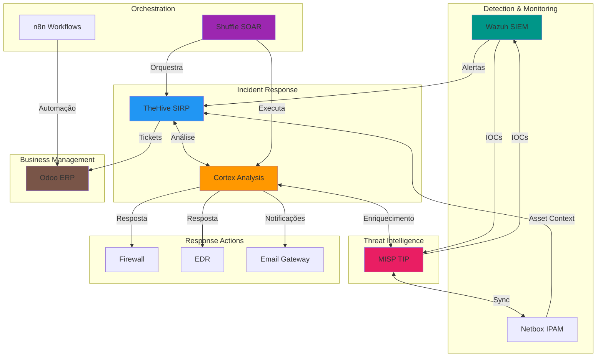
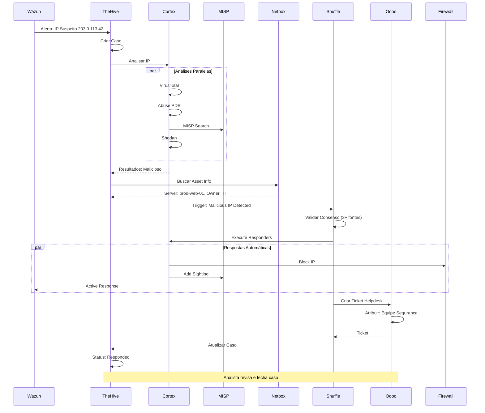
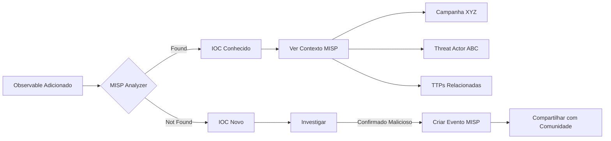
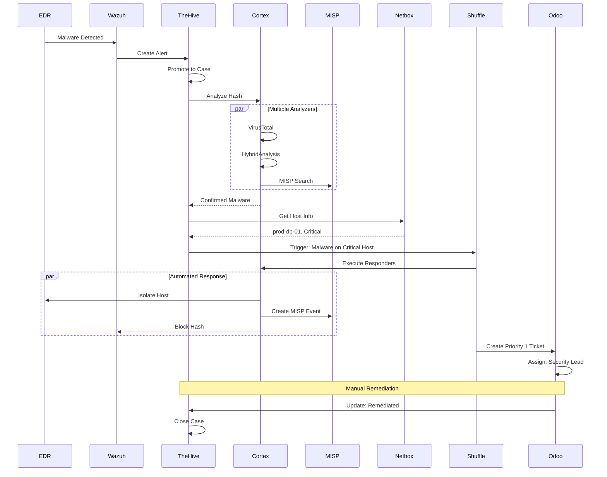

# Integração Cortex com Stack NEO_NETBOX_ODOO

Este guia detalha como integrar Cortex com todos os componentes da stack **NEO_NETBOX_ODOO**, criando um ecossistema completo de segurança automatizado.

## Diagrama de Arquitetura Completa



## Fluxo de Dados End-to-End

### Cenário Completo: Detecção até Resolução



## Integração Cortex ↔ Wazuh

### Objetivo

- Analisar IPs/hashes de alertas Wazuh automaticamente
- Executar active response baseado em análises Cortex
- Enriquecer alertas com contexto de threat intelligence

### Configuração

#### 1. Webhook Wazuh → TheHive

Configurar integração Wazuh-TheHive (ver documentação Wazuh):

```python
# /var/ossec/integrations/custom-thehive.py
#!/usr/bin/env python3
import json
import requests
from datetime import datetime

THEHIVE_URL = "http://thehive:9000"
THEHIVE_KEY = "API_KEY_AQUI"

def create_alert(alert_data):
    """Cria alerta no TheHive a partir de alerta Wazuh"""

    # Extrair IOCs do alerta
    observables = []

    if 'data' in alert_data and 'srcip' in alert_data['data']:
        observables.append({
            "dataType": "ip",
            "data": alert_data['data']['srcip'],
            "tags": ["wazuh", "source-ip"]
        })

    if 'data' in alert_data and 'hash' in alert_data['data']:
        observables.append({
            "dataType": "hash",
            "data": alert_data['data']['hash'],
            "tags": ["wazuh", "file-hash"]
        })

    # Criar alerta TheHive
    alert = {
        "title": f"Wazuh: {alert_data['rule']['description']}",
        "description": json.dumps(alert_data, indent=2),
        "severity": map_severity(alert_data['rule']['level']),
        "tlp": 2,
        "tags": ["wazuh", f"rule-{alert_data['rule']['id']}"],
        "type": "wazuh-alert",
        "source": "Wazuh",
        "sourceRef": alert_data['id'],
        "artifacts": observables
    }

    response = requests.post(
        f"{THEHIVE_URL}/api/alert",
        headers={
            "Authorization": f"Bearer {THEHIVE_KEY}",
            "Content-Type": "application/json"
        },
        json=alert,
        verify=False
    )

    return response.json()

def map_severity(wazuh_level):
    """Mapeia nível Wazuh para severidade TheHive"""
    if wazuh_level >= 12:
        return 3  # Critical
    elif wazuh_level >= 7:
        return 2  # High
    elif wazuh_level >= 3:
        return 1  # Medium
    else:
        return 0  # Low

if __name__ == "__main__":
    import sys
    alert_file = open(sys.argv[1])
    alert_json = json.loads(alert_file.read())
    alert_file.close()

    create_alert(alert_json)
```

#### 2. Active Response baseado em Cortex

Criar responder customizado:

**Wazuh_BlockIP_1_0** (já existe, configurar):

```json
{
  "name": "Wazuh_ActiveResponse_1_0",
  "configuration": {
    "wazuh_manager": "wazuh-manager.local",
    "wazuh_api_port": 55000,
    "wazuh_api_user": "cortex",
    "wazuh_api_password": "SENHA_WAZUH",
    "use_https": true,
    "verify_ssl": true
  }
}
```

**Workflow:**

1. Wazuh detecta atividade maliciosa
2. Cria alerta no TheHive com IP
3. TheHive analisa IP via Cortex
4. Se malicioso: executa `Wazuh_ActiveResponse`
5. Wazuh bloqueia IP em todos agentes

### Exemplo Prático

**Wazuh Alert:**
```json
{
  "rule": {
    "id": "5710",
    "description": "Multiple SSH authentication failures",
    "level": 10
  },
  "data": {
    "srcip": "203.0.113.42",
    "srcuser": "admin"
  }
}
```

**TheHive Case criado automaticamente:**
```
Title: Wazuh: Multiple SSH authentication failures
Severity: High
Observables:
  - IP: 203.0.113.42 (auto-analyzing...)

Cortex Analysis Results:
  ✅ AbuseIPDB: 95/100 (Malicious)
  ✅ VirusTotal: 12/70 (Malicious)
  ✅ MISP: Found in Botnet Campaign

Action: Execute Wazuh_ActiveResponse
Result: IP blocked on 247 agents
```

## Integração Cortex ↔ MISP

### Objetivo

- Buscar IOCs em MISP durante análise
- Adicionar sightings de IOCs observados
- Criar eventos MISP a partir de casos TheHive
- Sincronizar threat intelligence

### Configuração

#### Analyzer: MISP_2_1

```json
{
  "name": "MISP_2_1",
  "configuration": {
    "url": "https://misp.example.com",
    "key": "MISP_API_KEY",
    "cert_check": true,
    "max_attributes": 1000,
    "max_events": 10
  }
}
```

#### Responder: MISP_Add_Sighting_2_0

```json
{
  "name": "MISP_Add_Sighting_2_0",
  "configuration": {
    "url": "https://misp.example.com",
    "key": "MISP_API_KEY",
    "organisation_id": 1,
    "sighting_type": "0"
  }
}
```

#### Responder: MISP_Create_Event_2_0

```json
{
  "name": "MISP_Create_Event_2_0",
  "configuration": {
    "url": "https://misp.example.com",
    "key": "MISP_API_KEY",
    "distribution": 1,
    "threat_level_id": 2,
    "analysis": 1,
    "publish": false
  }
}
```

### Workflow de Enriquecimento



### Sincronização Bidirecional

**MISP → Cortex:**
- Observables buscados em eventos MISP
- Contexto de campanhas retornado
- Indicadores relacionados extraídos

**Cortex → MISP:**
- Sightings adicionados quando IOC observado
- Novos eventos criados de investigações
- Atributos enriquecidos com análises

## Integração Cortex ↔ Netbox

### Objetivo

- Enriquecer análises com contexto de asset
- Verificar se IP pertence à organização
- Obter informações de proprietário/localização
- Atualizar status de segurança em Netbox

### Implementação

Criar analyzer customizado:

**Netbox_IPLookup_1_0**

```python
#!/usr/bin/env python3
from cortexutils.analyzer import Analyzer
import pynetbox

class NetboxAnalyzer(Analyzer):
    def __init__(self):
        Analyzer.__init__(self)
        self.netbox_url = self.get_param('config.netbox_url')
        self.netbox_token = self.get_param('config.netbox_token')
        self.nb = pynetbox.api(self.netbox_url, token=self.netbox_token)

    def summary(self, raw):
        taxonomies = []
        namespace = "Netbox"

        if raw.get('is_internal'):
            level = "info"
            value = f"Internal - {raw.get('tenant', 'Unknown')}"
        else:
            level = "safe"
            value = "External"

        taxonomies.append(self.build_taxonomy(level, namespace, "Location", value))
        return {"taxonomies": taxonomies}

    def run(self):
        if self.data_type == 'ip':
            ip = self.get_data()

            try:
                # Buscar IP em Netbox
                ip_obj = self.nb.ipam.ip_addresses.get(address=ip)

                if ip_obj:
                    # IP encontrado - é interno
                    device = ip_obj.assigned_object.device if ip_obj.assigned_object else None

                    result = {
                        'is_internal': True,
                        'ip': ip,
                        'vrf': ip_obj.vrf.name if ip_obj.vrf else None,
                        'tenant': ip_obj.tenant.name if ip_obj.tenant else None,
                        'status': ip_obj.status.value,
                        'description': ip_obj.description,
                        'device': {
                            'name': device.name if device else None,
                            'role': device.device_role.name if device else None,
                            'site': device.site.name if device else None,
                            'rack': device.rack.name if device else None
                        } if device else None,
                        'dns_name': ip_obj.dns_name,
                        'tags': [tag.name for tag in ip_obj.tags]
                    }
                else:
                    # IP não encontrado - externo
                    result = {
                        'is_internal': False,
                        'ip': ip
                    }

                self.report(result)

            except Exception as e:
                self.error(f"Netbox lookup error: {str(e)}")
        else:
            self.error('Invalid data type')

if __name__ == '__main__':
    NetboxAnalyzer().run()
```

**Uso:**

Quando IP é analisado, Netbox retorna:

```json
{
  "is_internal": true,
  "ip": "10.0.1.100",
  "tenant": "IT Department",
  "device": {
    "name": "prod-web-01",
    "role": "Web Server",
    "site": "Datacenter SP",
    "rack": "A-01"
  },
  "dns_name": "web01.internal.com",
  "tags": ["production", "critical"]
}
```

**Ação:** Se IP interno está malicioso, prioridade crítica!

### Responder: Atualizar Status Netbox

**Netbox_UpdateIPStatus_1_0**

```python
def run(self):
    ip = self.get_param('data.data')
    status = 'quarantine'  # Novo status

    ip_obj = self.nb.ipam.ip_addresses.get(address=ip)
    if ip_obj:
        ip_obj.status = status
        ip_obj.description = f"Quarantined by Cortex - {datetime.now()}"
        ip_obj.save()

        self.report({
            'success': True,
            'message': f'IP {ip} status updated to {status}'
        })
```

## Integração Cortex ↔ Shuffle/n8n

### Objetivo

- Orquestrar workflows complexos com Cortex
- Automatizar decisões baseadas em análises
- Executar ações em múltiplos sistemas

### Shuffle Integration

#### Cortex Actions em Shuffle

**1. Trigger Cortex Analysis**

```yaml
Action: Cortex - Run Analyzer
Inputs:
  - cortex_url: http://cortex:9001
  - api_key: $cortex_api_key
  - observable_type: ip
  - observable_value: $ip_address
  - analyzers:
      - VirusTotal_GetReport_3_0
      - AbuseIPDB_1_0
      - MISP_2_1
Output:
  - job_ids: [job1, job2, job3]
```

**2. Wait for Analysis**

```yaml
Action: Cortex - Wait for Jobs
Inputs:
  - job_ids: $previous.job_ids
  - timeout: 300
Output:
  - reports: [report1, report2, report3]
```

**3. Process Results**

```yaml
Action: Python - Process Cortex Results
Code: |
  def process(reports):
      malicious_count = 0

      for report in reports:
          for taxonomy in report['summary']['taxonomies']:
              if taxonomy['level'] == 'malicious':
                  malicious_count += 1

      return {
          'is_malicious': malicious_count >= 2,
          'confidence': malicious_count / len(reports)
      }
```

**4. Execute Responder**

```yaml
Action: Cortex - Run Responder
Condition: $previous.is_malicious == true
Inputs:
  - responder_id: pfSense_BlockIP
  - object_type: case_artifact
  - object_id: $artifact_id
```

#### Workflow Completo: Automated Response

```yaml
name: Malicious IP Auto Response
trigger: TheHive Webhook (case created)

steps:
  1. Extract Observables:
     - Filter: dataType == 'ip'
     - Output: ip_list

  2. Analyze IPs (Parallel):
     For each IP:
       - Cortex Analyzers: [VT, AbuseIPDB, MISP, Shodan]
       - Netbox Lookup

  3. Check if Internal:
     If Netbox.is_internal:
       - Severity: CRITICAL
       - Notify: Security Team + Management
     Else:
       - Severity: HIGH
       - Notify: Security Team

  4. Consensus Check:
     If 3+ analyzers confirm malicious:
       - Execute: Auto Response
     Else:
       - Create: Manual Review Task

  5. Auto Response:
     - Firewall: Block IP
     - Wazuh: Active Response
     - MISP: Add Sighting
     - Odoo: Create Ticket
     - Slack: Notify Team

  6. Update Case:
     - Add: Timeline entries
     - Set: Status = Responded
     - Assign: Analyst for verification
```

### n8n Integration

**n8n Nodes:**

```json
{
  "nodes": [
    {
      "name": "TheHive Trigger",
      "type": "n8n-nodes-base.webhook",
      "webhookId": "thehive-alert"
    },
    {
      "name": "Cortex Analysis",
      "type": "n8n-nodes-base.httpRequest",
      "method": "POST",
      "url": "http://cortex:9001/api/analyzer/{{ $json.analyzer }}/run",
      "authentication": "headerAuth",
      "headers": {
        "Authorization": "Bearer {{ $credentials.cortex.apiKey }}"
      }
    },
    {
      "name": "Wait 2 Minutes",
      "type": "n8n-nodes-base.wait",
      "resume": "webhook",
      "time": 120
    },
    {
      "name": "Get Results",
      "type": "n8n-nodes-base.httpRequest",
      "method": "GET",
      "url": "http://cortex:9001/api/job/{{ $json.job_id }}/report"
    },
    {
      "name": "Create Odoo Ticket",
      "type": "n8n-nodes-base.odoo",
      "operation": "create",
      "model": "helpdesk.ticket",
      "fields": {
        "name": "Security Incident - {{ $json.case_title }}",
        "description": "{{ $json.analysis_summary }}",
        "team_id": 1,
        "priority": "3"
      }
    }
  ],
  "connections": {
    "TheHive Trigger": { "main": [[{ "node": "Cortex Analysis" }]] },
    "Cortex Analysis": { "main": [[{ "node": "Wait 2 Minutes" }]] },
    "Wait 2 Minutes": { "main": [[{ "node": "Get Results" }]] },
    "Get Results": { "main": [[{ "node": "Create Odoo Ticket" }]] }
  }
}
```

## Integração Cortex ↔ Odoo

### Objetivo

- Criar tickets no Odoo Helpdesk a partir de casos TheHive
- Sincronizar status entre TheHive e Odoo
- Notificar equipe através do Odoo

### Implementação

#### Responder Customizado: Odoo_CreateTicket_1_0

```python
#!/usr/bin/env python3
from cortexutils.responder import Responder
import xmlrpc.client

class OdooCreateTicketResponder(Responder):
    def __init__(self):
        Responder.__init__(self)
        self.odoo_url = self.get_param('config.odoo_url')
        self.odoo_db = self.get_param('config.odoo_db')
        self.odoo_user = self.get_param('config.odoo_username')
        self.odoo_pass = self.get_param('config.odoo_password')
        self.team_id = self.get_param('config.helpdesk_team_id', 1)

    def run(self):
        # Autenticar
        common = xmlrpc.client.ServerProxy(f'{self.odoo_url}/xmlrpc/2/common')
        uid = common.authenticate(self.odoo_db, self.odoo_user, self.odoo_pass, {})

        models = xmlrpc.client.ServerProxy(f'{self.odoo_url}/xmlrpc/2/object')

        # Obter dados do caso
        case_title = self.get_param('data.title', None, 'Case title required')
        case_description = self.get_param('data.description', '')
        case_severity = self.get_param('data.severity', 2)
        case_observables = self.get_param('data.observables', [])

        # Mapear severidade TheHive → Odoo priority
        priority_map = {0: '0', 1: '1', 2: '2', 3: '3'}
        priority = priority_map.get(case_severity, '2')

        # Montar descrição enriquecida
        enriched_desc = f"""
## Caso TheHive: {case_title}

**Severidade:** {case_severity}
**Descrição Original:**
{case_description}

**Observables:**
"""
        for obs in case_observables:
            enriched_desc += f"\n- {obs.get('dataType')}: {obs.get('data')}"
            if 'reports' in obs:
                enriched_desc += f" (Analisado: {len(obs['reports'])} analyzers)"

        # Criar ticket
        ticket_id = models.execute_kw(
            self.odoo_db, uid, self.odoo_pass,
            'helpdesk.ticket', 'create',
            [{
                'name': f'[SECURITY] {case_title}',
                'description': enriched_desc,
                'team_id': self.team_id,
                'priority': priority,
                'tag_ids': [(6, 0, [1, 2])],  # Tags: Security, Urgent
                'user_id': False,  # Não atribuído
                'stage_id': 1  # Stage: New
            }]
        )

        # Obter URL do ticket
        ticket_url = f"{self.odoo_url}/web#id={ticket_id}&model=helpdesk.ticket&view_type=form"

        self.report({
            'success': True,
            'ticket_id': ticket_id,
            'ticket_url': ticket_url,
            'message': f'Ticket #{ticket_id} created successfully'
        })

    def operations(self, raw):
        """Adicionar tag ao caso TheHive"""
        return [
            self.build_operation('AddTagToCase', tag=f'odoo-ticket-{raw["ticket_id"]}'),
            self.build_operation('AddCustomFields', customFields={
                'odoo-ticket-id': raw['ticket_id'],
                'odoo-ticket-url': raw['ticket_url']
            })
        ]

if __name__ == '__main__':
    OdooCreateTicketResponder().run()
```

#### Configuração

```json
{
  "name": "Odoo_CreateTicket_1_0",
  "configuration": {
    "odoo_url": "https://odoo.example.com",
    "odoo_db": "production",
    "odoo_username": "cortex_integration",
    "odoo_password": "SENHA_SEGURA",
    "helpdesk_team_id": 1
  }
}
```

#### Workflow Bidirecional

**TheHive → Odoo:**
```yaml
Evento: Caso criado/atualizado no TheHive
Ação: Criar/atualizar ticket Odoo
Sync: Status, Prioridade, Comentários
```

**Odoo → TheHive:**
```yaml
Evento: Ticket fechado no Odoo
Ação: Fechar caso TheHive (via webhook)
Sync: Resolução, Tempo gasto
```

### Webhook Odoo → TheHive

```python
# Odoo automation action
@api.model
def _webhook_thehive_close_case(self):
    """Fechar caso TheHive quando ticket Odoo é fechado"""
    for ticket in self:
        if ticket.stage_id.is_close:
            # Extrair case ID das tags
            case_id = None
            for tag in ticket.tag_ids:
                if tag.name.startswith('thehive-case-'):
                    case_id = tag.name.replace('thehive-case-', '')
                    break

            if case_id:
                # Chamar API TheHive
                requests.patch(
                    f"{THEHIVE_URL}/api/case/{case_id}",
                    headers={"Authorization": f"Bearer {THEHIVE_KEY}"},
                    json={
                        "status": "Resolved",
                        "resolutionStatus": "TruePositive",
                        "summary": ticket.description
                    }
                )
```

## Casos de Uso End-to-End

### Caso 1: Malware em Endpoint



**Tempo Total:** 5 minutos (vs 30-60 minutos manual)

### Caso 2: Phishing Campaign

**Detecção:**
- Múltiplos usuários reportam email suspeito
- Odoo recebe tickets de Helpdesk

**Investigação Automatizada:**

```yaml
1. n8n detecta padrão (múltiplos tickets similares)
2. Cria caso TheHive: "Potential Phishing Campaign"
3. Extrai observables: URLs, sender email, attachments
4. Cortex analisa:
   - URLs: PhishTank, URLhaus, VirusTotal
   - Email: EmailRep
   - Anexos: VirusTotal, HybridAnalysis
5. Resultados confirmam phishing
```

**Resposta Automatizada:**

```yaml
6. Shuffle executa playbook:
   - Bloquear sender no email gateway
   - Adicionar URLs a blocklist corporativa
   - Criar evento MISP
   - Notificar usuários via Odoo mass mailing
   - Atualizar todos tickets Odoo
7. TheHive documenta timeline completa
8. Analista revisa e fecha
```

**Métricas:**
- Tempo de resposta: 10 minutos
- Usuários protegidos: 500+
- Tickets resolvidos: 15

### Caso 3: Botnet C2 Detection

**Fluxo:**

1. Wazuh detecta beacon suspeito para IP externo
2. TheHive cria caso automaticamente
3. Cortex analisa IP:
   - AbuseIPDB: Score 98 (conhecido C2)
   - MISP: Encontrado em campanha Emotet
   - Shodan: Múltiplos serviços maliciosos
4. Netbox identifica host origem: prod-app-03
5. Shuffle decide: **Resposta Crítica**
6. Cortex executa:
   - Isolar host (EDR)
   - Bloquear C2 em firewall
   - Active response Wazuh (bloquear em toda rede)
   - Adicionar sighting MISP
7. Odoo cria ticket P1 para incident response
8. Analista inicia forensics

## Monitoramento da Integração

### Dashboards Unificados

**Grafana Dashboard: Security Operations**

```yaml
Panels:
  - Wazuh Alerts (last 24h): Counter
  - TheHive Cases by Severity: Pie Chart
  - Cortex Jobs Success Rate: Gauge
  - MISP Sightings Added: Counter
  - Average Response Time: Time Series
  - Odoo Security Tickets: Table
  - Automated vs Manual Actions: Bar Chart
```

### Métricas Importantes

| Métrica | Fonte | Objetivo | Alert |
|---------|-------|----------|-------|
| **MTTD** (Mean Time to Detect) | Wazuh → TheHive | < 5 min | > 10 min |
| **MTTA** (Mean Time to Analyze) | TheHive → Cortex | < 2 min | > 5 min |
| **MTTR** (Mean Time to Respond) | Cortex → Responders | < 10 min | > 30 min |
| **Automation Rate** | Shuffle | > 70% | < 50% |
| **False Positive Rate** | TheHive | < 10% | > 20% |

### Alertas de Integração

```yaml
Cortex Unavailable:
  Trigger: No jobs in 1 hour
  Action: Alert on-call engineer
  Impact: Análise manual necessária

MISP Sync Failed:
  Trigger: Sighting responder failures > 5
  Action: Check MISP connectivity
  Impact: IOCs não compartilhados

Odoo Ticket Creation Failed:
  Trigger: Responder failures > 3
  Action: Check Odoo API
  Impact: Tickets não criados

High Job Failure Rate:
  Trigger: Cortex job failures > 20%
  Action: Investigate analyzer issues
  Impact: Análises incompletas
```

## Melhores Práticas

### 1. Evitar Loops Infinitos

```python
# Adicionar proteção contra loops
def should_trigger_automation(case_id):
    # Verificar se já automatizado
    if redis.exists(f'automated:{case_id}'):
        return False

    # Marcar como processado (expire em 24h)
    redis.setex(f'automated:{case_id}', 86400, '1')
    return True
```

### 2. Graceful Degradation

```yaml
Se Cortex offline:
  - TheHive continua funcionando
  - Análise manual possível
  - Fila de jobs aguarda Cortex voltar

Se MISP offline:
  - Outros analyzers continuam
  - Sightings enfileirados para retry
  - Analista notificado de falta de contexto

Se Odoo offline:
  - Casos TheHive não bloqueados
  - Tickets criados quando voltar
  - Notificações via email alternativo
```

### 3. Idempotência

Todas integrações devem ser idempotentes:

```python
# Exemplo: Criar ticket Odoo apenas se não existe
def create_ticket_idempotent(case_id):
    # Verificar se ticket já criado
    existing = search_odoo_ticket(f'thehive-case-{case_id}')
    if existing:
        return existing

    # Criar novo
    return create_odoo_ticket(case_id)
```

### 4. Auditoria Completa

Log todas ações em formato estruturado:

```json
{
  "timestamp": "2025-12-05T15:30:00Z",
  "event": "automated_response",
  "case_id": "~123456",
  "trigger": "cortex_analysis_complete",
  "actions": [
    {"type": "block_ip", "target": "203.0.113.42", "system": "firewall", "status": "success"},
    {"type": "create_ticket", "target": "odoo", "ticket_id": "SEC-001", "status": "success"},
    {"type": "add_sighting", "target": "misp", "event_id": "12345", "status": "success"}
  ],
  "user": "automation",
  "decision_factors": {
    "virustotal_score": 15,
    "abuseipdb_score": 95,
    "misp_found": true,
    "consensus": "malicious"
  }
}
```

## Troubleshooting

### Problema: Integrações lentas

**Sintoma:** Análises demoram > 10 minutos

**Diagnóstico:**

```bash
# Verificar performance de cada componente
time curl http://cortex:9001/api/status
time curl http://misp:443/servers/getVersion
time curl http://netbox:8000/api/status/

# Verificar fila Cortex
curl http://cortex:9001/api/job | jq '.[] | select(.status=="Waiting")'
```

**Solução:** Aumentar workers, otimizar analyzers

### Problema: Dados inconsistentes

**Sintoma:** Status diferente entre TheHive e Odoo

**Causa:** Webhooks perdidos ou falhas de sincronização

**Solução:**

```python
# Implementar reconciliation job
def sync_thehive_odoo():
    # Buscar casos TheHive fechados
    closed_cases = get_thehive_cases(status='Resolved')

    for case in closed_cases:
        # Verificar ticket Odoo correspondente
        ticket = get_odoo_ticket(case['id'])

        if ticket and ticket.stage != 'closed':
            # Sincronizar status
            close_odoo_ticket(ticket.id, case['resolution'])
```

## Recursos

- **Documentação Wazuh:** [/docs/pt/wazuh](../../05-wazuh)
- **Documentação MISP:** [/docs/pt/misp](../../misp)
- **Documentação Shuffle:** [/docs/pt/soar/shuffle](../../soar/shuffle)
- **Documentação Odoo:** [/docs/pt/odoo](../../03-odoo-oca)

---

**Próximo:** [Casos de Uso Detalhados](use-cases.md)
