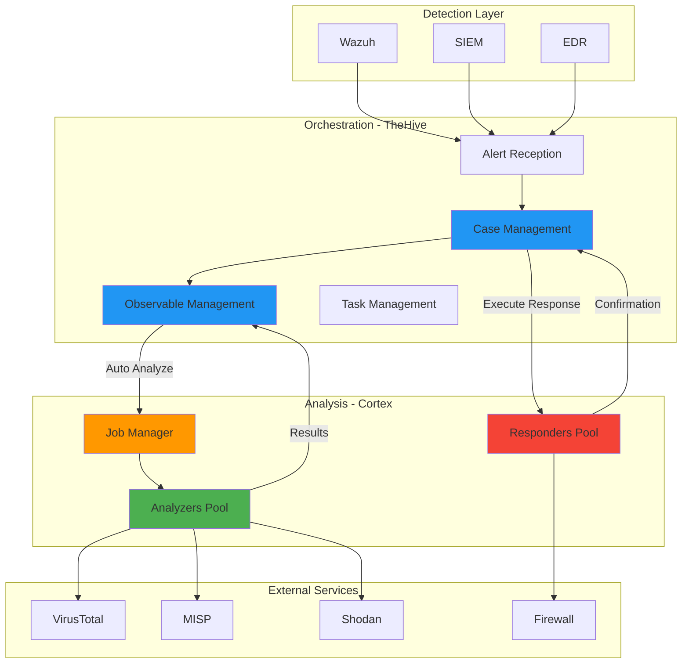
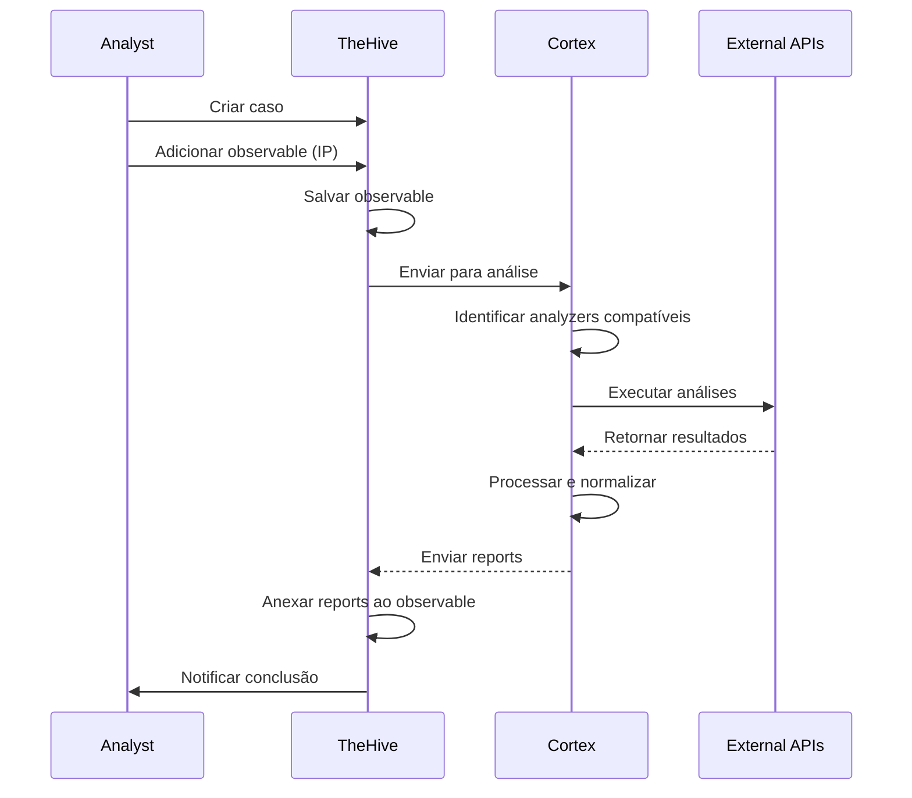
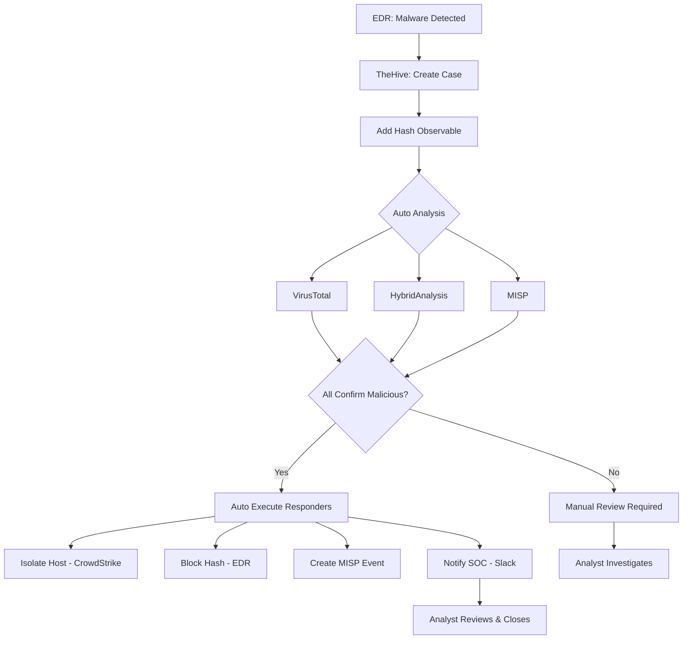

# Integração Cortex + TheHive

A integração entre **Cortex** e **TheHive** é nativa e essencial para automatizar análise de observables e resposta a incidentes. Ambas ferramentas foram desenvolvidas pela mesma empresa (StrangeBee) para trabalhar em conjunto.

## Arquitetura da Integração



## Conceitos da Integração

### 1. Observable Flow

**Observable** é qualquer indicador de comprometimento (IOC) adicionado a um caso:



### 2. Análise Automática vs Manual

**Análise Automática:**
- Configurada no TheHive
- Executada automaticamente quando observable é adicionado
- Usa analyzers pré-configurados

**Análise Manual:**
- Analista escolhe analyzers específicos
- Executado sob demanda
- Útil para analyzers caros ou demorados

### 3. TLP (Traffic Light Protocol)

Controla quais analyzers podem processar observables baseado em sensibilidade:

| TLP | Cor | Nível | Compartilhamento |
|-----|-----|-------|------------------|
| **TLP:CLEAR** | Branco | Público | Sem restrições |
| **TLP:GREEN** | Verde | Comunidade | Pode compartilhar com comunidade |
| **TLP:AMBER** | Âmbar | Limitado | Apenas organizações autorizadas |
| **TLP:RED** | Vermelho | Restrito | Apenas destinatários específicos |

**Configuração em Analyzer:**

```json
{
  "name": "VirusTotal_GetReport_3_0",
  "configuration": {
    "max_tlp": 2
  }
}
```

Isso significa: analyzer só processa observables com TLP ≤ 2 (AMBER ou inferior).

!!! warning "TLP em APIs Externas"
    Observables TLP:RED **nunca** devem ser enviados para APIs externas! Configure `max_tlp` adequadamente.

## Configuração da Integração

### Passo 1: Configurar Cortex

Já deve estar instalado. Verificar:

```bash
curl http://localhost:9001/api/status
# Resposta: {"status":"OK"}
```

### Passo 2: Obter API Key do Cortex

1. Login no Cortex (http://cortex-server:9001)
2. Criar usuário para TheHive (ou usar existente)
3. **Organization Settings** > **Users** > Selecionar usuário
4. **Create API Key**
5. Copiar API key

```bash
# Exemplo via API
CORTEX_ADMIN_KEY="sua_admin_key"

# Criar organização para TheHive
curl -X POST http://localhost:9001/api/organization \
  -H "Authorization: Bearer $CORTEX_ADMIN_KEY" \
  -H "Content-Type: application/json" \
  -d '{
    "name": "thehive",
    "description": "TheHive Integration"
  }'

# Criar usuário
curl -X POST http://localhost:9001/api/user \
  -H "Authorization: Bearer $CORTEX_ADMIN_KEY" \
  -H "Content-Type: application/json" \
  -d '{
    "login": "thehive@thehive",
    "name": "TheHive Integration User",
    "roles": ["read", "analyze", "orgadmin"],
    "organization": "thehive",
    "password": "SENHA_FORTE_AQUI"
  }'

# Gerar API key
curl -X POST http://localhost:9001/api/user/thehive@thehive/key/renew \
  -H "Authorization: Bearer $CORTEX_ADMIN_KEY"
# Retorna: {"apiKey": "abc123..."}
```

### Passo 3: Configurar TheHive

Editar `/opt/thehive/application.conf`:

```hocon
# Cortex Integration
play.modules.enabled += org.thp.thehive.connector.cortex.CortexModule

cortex {
  servers = [
    {
      name = "Cortex-Primary"
      url = "http://cortex:9001"
      auth {
        type = "bearer"
        key = "SUA_API_KEY_CORTEX_AQUI"
      }

      # Análise automática
      wsConfig {
        requestTimeout = 5 minutes
        idleTimeout = 5 minutes
      }

      # Configurações de job
      includedTheHiveOrganisations = ["*"]
      excludedTheHiveOrganisations = []

      # Refresh de analyzers/responders
      refreshDelay = 5 minutes
      maxRetries = 3
      statusCheckInterval = 1 minute
    }
  ]
}
```

**Reiniciar TheHive:**

```bash
docker compose restart thehive
```

### Passo 4: Verificar Conexão

No TheHive:

1. Login como admin
2. **Admin** > **Cortex Servers**
3. Deve aparecer "Cortex-Primary" com status "✅ Connected"
4. Ver lista de analyzers disponíveis

**Via CLI:**

```bash
# Logs TheHive
docker logs thehive | grep -i cortex

# Deve ver:
# [info] o.t.t.c.c.CortexConnector - Cortex server Cortex-Primary is available
# [info] o.t.t.c.c.CortexConnector - Found 150 analyzers
# [info] o.t.t.c.c.CortexConnector - Found 25 responders
```

## Configurar Análise Automática

### Habilitar por Tipo de Observable

**Admin** > **Observable Types**

Para cada tipo (ip, domain, hash, etc):

1. Selecionar tipo
2. **Enable Auto Analysis**: ✅
3. Selecionar analyzers que devem executar automaticamente
4. **Save**

**Exemplo para IP:**

```yaml
Observable Type: ip
Auto Analysis: Enabled
Analyzers:
  - AbuseIPDB_1_0
  - VirusTotal_GetReport_3_0
  - Shodan_Host_1_1
  - MaxMind_GeoIP_4_0
  - MISP_2_1
```

Agora, sempre que um IP for adicionado a um caso, esses 5 analyzers executam automaticamente!

### Configuração Granular

Pode configurar por organização TheHive:

```hocon
# application.conf
cortex.servers.0.jobs {
  # Análise automática apenas para TLP ≤ AMBER
  autoAnalysis {
    maxTlp = 2
  }

  # Limitar analyzers automáticos
  includeAnalyzers = [
    "VirusTotal_GetReport_3_0",
    "AbuseIPDB_1_0",
    "MaxMind_GeoIP_4_0"
  ]

  excludeAnalyzers = [
    "JoeSandbox_File_Analysis_2_0",  # Caro
    "HybridAnalysis_GetReport_1_0"   # Lento
  ]
}
```

## Workflows de Uso

### Workflow 1: Investigação Manual

**Cenário:** Analista investiga alerta de Wazuh

1. **Wazuh** gera alerta: "Possible SSH Brute Force from 203.0.113.42"

2. **TheHive** recebe alerta via webhook

3. **Analista** revisa alerta e promove para caso:
   ```
   Title: SSH Brute Force Investigation
   Severity: Medium
   TLP: AMBER
   ```

4. **Analista** adiciona observables:
   - IP: `203.0.113.42`
   - Username: `admin`

5. **TheHive** detecta IP e executa análise automática:
   - ✅ AbuseIPDB (Score: 95/100)
   - ✅ VirusTotal (Malicious: 8/70)
   - ✅ Shodan (22 portas abertas, múltiplos serviços)
   - ✅ MaxMind (País: RU, ISP: Suspicious Hosting)
   - ❌ MISP (Not found)

6. **Analista** revisa resultados (30 segundos após adicionar):
   ```
   Conclusão: IP confirmado malicioso
   Ação: Bloquear
   ```

7. **Analista** executa responders:
   - pfSense_BlockIP (duration: 30 days)
   - MISP_Add_Sighting (para compartilhar com comunidade)
   - Slack_Notify (notificar equipe)

8. **Analista** fecha caso:
   ```
   Resolution: IP bloqueado, sem comprometimento detectado
   ```

### Workflow 2: Resposta Automatizada

**Cenário:** Malware detectado em endpoint



**Implementação com Shuffle:**

```python
# Shuffle Workflow
{
  "name": "Malware Auto Response",
  "trigger": "thehive_webhook",
  "conditions": [
    {
      "field": "case.tags",
      "contains": "malware"
    }
  ],
  "actions": [
    {
      "name": "Wait for Cortex Analysis",
      "type": "wait",
      "duration": "2m"
    },
    {
      "name": "Get Analysis Results",
      "type": "thehive_api",
      "endpoint": "/api/case/{{case_id}}/observable"
    },
    {
      "name": "Check Consensus",
      "type": "condition",
      "logic": "AND",
      "rules": [
        "virustotal.positives > 10",
        "hybridanalysis.threat_level == 'malicious'",
        "misp.found == true"
      ]
    },
    {
      "name": "Execute Automated Response",
      "type": "cortex_responder",
      "responders": [
        "CrowdStrike_ContainHost",
        "MISP_Create_Event",
        "Slack_Notify"
      ]
    }
  ]
}
```

### Workflow 3: Enriquecimento de Alertas

**Antes da integração:**
```
Wazuh Alert:
  Rule: 5710 - Possible SSH Brute Force
  Source IP: 203.0.113.42
  Attempts: 50
```

**Depois da integração:**
```
TheHive Case: SSH Brute Force Attack
  Source IP: 203.0.113.42
    ├─ AbuseIPDB: Score 95/100 ⚠️
    │  └─ 156 reports from 45 users
    │  └─ Categories: SSH, Brute Force, Port Scan
    │
    ├─ VirusTotal: 8/70 Malicious ⚠️
    │  └─ Detected by: Kaspersky, BitDefender, ESET
    │
    ├─ Shodan: 22 open ports ⚠️
    │  └─ Services: SSH, Telnet, HTTP, FTP, SMB
    │  └─ Vulnerabilities: CVE-2021-3156, CVE-2019-15666
    │
    ├─ MaxMind GeoIP: 🇷🇺
    │  └─ Country: Russia
    │  └─ City: Moscow
    │  └─ ISP: VPS-Provider-Suspicious
    │
    └─ MISP: Found in Event #12345 ✅
       └─ Campaign: SSH Botnet 2025
       └─ Threat Actor: APT-Unknown
       └─ First Seen: 2025-11-15

  Recommendation: BLOCK IMMEDIATELY
  Automated Actions Available:
    - [Execute] pfSense_BlockIP
    - [Execute] Wazuh_ActiveResponse
    - [Execute] MISP_Add_Sighting
```

## Análise de Observables

### Via Web Interface

1. Abrir caso no TheHive
2. Tab **Observables**
3. Selecionar observable
4. **Actions** > **Run analyzers**
5. Escolher analyzers (ou "Run all")
6. Aguardar execução (barra de progresso)
7. Resultados aparecem em **Reports**

### Via API

```bash
THEHIVE_URL="http://thehive:9000"
THEHIVE_KEY="sua_api_key_thehive"

# Adicionar observable a caso
CASE_ID="~123456"

curl -X POST "$THEHIVE_URL/api/case/$CASE_ID/artifact" \
  -H "Authorization: Bearer $THEHIVE_KEY" \
  -H "Content-Type: application/json" \
  -d '{
    "dataType": "ip",
    "data": "203.0.113.42",
    "tlp": 2,
    "tags": ["suspicious", "ssh-bruteforce"],
    "message": "Source IP from Wazuh alert"
  }'

# Resposta inclui artifact ID
ARTIFACT_ID="~artifact123"

# Executar analyzer específico
curl -X POST "$THEHIVE_URL/api/connector/cortex/job" \
  -H "Authorization: Bearer $THEHIVE_KEY" \
  -H "Content-Type: application/json" \
  -d '{
    "cortexId": "Cortex-Primary",
    "artifactId": "'$ARTIFACT_ID'",
    "analyzerId": "VirusTotal_GetReport_3_0"
  }'

# Listar jobs do observable
curl "$THEHIVE_URL/api/connector/cortex/job?filter=artifact:$ARTIFACT_ID" \
  -H "Authorization: Bearer $THEHIVE_KEY"

# Ver report específico
JOB_ID="~job789"
curl "$THEHIVE_URL/api/connector/cortex/job/$JOB_ID/report" \
  -H "Authorization: Bearer $THEHIVE_KEY"
```

## Execução de Responders

### Via Web Interface

1. Abrir caso
2. **Actions** > **Run responder**
3. Escolher responder
4. Preencher parâmetros (se necessário)
5. **Run**
6. Confirmação aparece em **Case Timeline**

### Via API

```bash
# Executar responder em observable
curl -X POST "$THEHIVE_URL/api/connector/cortex/action" \
  -H "Authorization: Bearer $THEHIVE_KEY" \
  -H "Content-Type: application/json" \
  -d '{
    "cortexId": "Cortex-Primary",
    "artifactId": "'$ARTIFACT_ID'",
    "responderId": "pfSense_BlockIP"
  }'

# Executar responder em caso inteiro
curl -X POST "$THEHIVE_URL/api/connector/cortex/action" \
  -H "Authorization: Bearer $THEHIVE_KEY" \
  -H "Content-Type: application/json" \
  -d '{
    "cortexId": "Cortex-Primary",
    "objectType": "case",
    "objectId": "'$CASE_ID'",
    "responderId": "Mailer_1_0",
    "parameters": {
      "recipients": ["soc@example.com"],
      "subject": "Critical Incident"
    }
  }'
```

## Dashboards e Métricas

### Métricas Importantes

**No TheHive:**

1. **Organizations** > **Cortex Servers** > **Statistics**
   - Total de jobs executados
   - Taxa de sucesso/falha
   - Tempo médio de execução
   - Analyzers mais usados

2. **Dashboard Customizado:**

```json
{
  "title": "Cortex Analysis Dashboard",
  "widgets": [
    {
      "type": "counter",
      "title": "Jobs Today",
      "query": "cortexJobs AND status:Success"
    },
    {
      "type": "line-chart",
      "title": "Analysis Over Time",
      "query": "cortexJobs",
      "dateField": "startDate",
      "interval": "1h"
    },
    {
      "type": "pie-chart",
      "title": "Top Analyzers",
      "query": "cortexJobs",
      "field": "analyzerName"
    },
    {
      "type": "table",
      "title": "Failed Jobs",
      "query": "cortexJobs AND status:Failure",
      "fields": ["analyzerName", "startDate", "errorMessage"]
    }
  ]
}
```

### Alertas de Performance

Configure alertas para:

```yaml
Job Failure Rate > 10%:
  Action: Investigar analyzer problemático
  Possível causa: API key inválida, rate limit

Average Job Duration > 5 min:
  Action: Otimizar timeout ou workers
  Possível causa: Analyzer lento, timeout baixo

No Jobs Last 1h:
  Action: Verificar conectividade
  Possível causa: Cortex offline, rede
```

## Templates de Casos

Crie templates com analyzers pré-configurados:

### Template: Phishing Investigation

```json
{
  "name": "Phishing Email Investigation",
  "titlePrefix": "PHISHING",
  "severity": 2,
  "tlp": 2,
  "tags": ["phishing", "email"],
  "tasks": [
    {
      "title": "Analyze Email Headers",
      "description": "Extract and analyze email headers"
    },
    {
      "title": "Analyze URLs",
      "description": "Run URL analyzers",
      "analyzers": ["VirusTotal_GetReport", "PhishTank", "URLhaus"]
    },
    {
      "title": "Analyze Sender Domain",
      "description": "Check sender reputation",
      "analyzers": ["EmailRep", "MISP_Search"]
    },
    {
      "title": "Check Attachments",
      "description": "Analyze file attachments if present",
      "analyzers": ["VirusTotal_Scan", "HybridAnalysis"]
    }
  ],
  "customFields": {
    "email-from": "",
    "email-subject": "",
    "reported-by": ""
  }
}
```

Uso:

1. **Cases** > **Templates** > Selecionar "Phishing Email Investigation"
2. Preencher campos
3. Adicionar observables (URLs, emails, attachments)
4. Analyzers executam automaticamente conforme configurado nas tasks

## Troubleshooting

### TheHive não conecta ao Cortex

**Sintoma:** "Cortex server unavailable"

**Verificações:**

```bash
# 1. Cortex está rodando?
curl http://cortex:9001/api/status

# 2. API key válida?
curl -H "Authorization: Bearer $CORTEX_KEY" \
  http://cortex:9001/api/analyzer

# 3. Network connectivity?
docker exec thehive ping cortex

# 4. Verificar logs TheHive
docker logs thehive | grep -i cortex
```

**Solução:** Verificar `application.conf` do TheHive, URL e API key.

### Análise Automática não funciona

**Sintoma:** Observables adicionados mas analyzers não executam

**Verificações:**

1. **Admin** > **Observable Types** > Verificar "Auto Analysis" habilitado
2. TLP do observable compatível com analyzers?
3. Analyzers habilitados no Cortex?

```bash
# Verificar configuração
curl "$THEHIVE_URL/api/connector/cortex/analyzer" \
  -H "Authorization: Bearer $THEHIVE_KEY"
```

### Jobs ficam em "Waiting"

**Sintoma:** Jobs não progridem

**Causas:**

1. Cortex sem workers disponíveis
2. Docker socket inacessível
3. Imagem do analyzer não disponível

**Solução:**

```bash
# Verificar workers Cortex
docker ps | grep cortexneurons

# Verificar logs Cortex
docker logs cortex | grep -i "worker"

# Aumentar workers em application.conf
analyzer.fork-join-executor.parallelism-max = 16
```

### Resultados Não Aparecem no TheHive

**Sintoma:** Job completado mas report não visível

**Causa:** Sincronização entre TheHive e Cortex

**Solução:**

```bash
# Forçar refresh
curl -X POST "$THEHIVE_URL/api/connector/cortex/job/$JOB_ID/sync" \
  -H "Authorization: Bearer $THEHIVE_KEY"

# Ou reiniciar TheHive
docker compose restart thehive
```

## Melhores Práticas

### 1. Organize por Severidade

```yaml
Observables TLP:RED (internos sensíveis):
  - MaxMind_GeoIP (local)
  - MISP_Search (self-hosted)
  - FileInfo (local)
  - Yara (local)
  ❌ Sem APIs externas!

Observables TLP:AMBER (investigação normal):
  - VirusTotal
  - AbuseIPDB
  - Shodan
  - MISP

Observables TLP:GREEN (compartilhável):
  - Todos analyzers
```

### 2. Templates por Tipo de Incidente

- **Malware**: FileInfo, VirusTotal, HybridAnalysis, MISP
- **Phishing**: EmailRep, PhishTank, URLhaus, VirusTotal
- **Network**: AbuseIPDB, Shodan, MaxMind, MISP
- **APT**: MISP, RecordedFuture, ThreatConnect, OpenCTI

### 3. SLA de Análise

Configure timeouts apropriados:

```hocon
cortex.servers.0.wsConfig {
  requestTimeout = 10 minutes  # Tempo máximo para analyzer
  idleTimeout = 10 minutes
}

# No Cortex
job.timeout = 10 minutes
```

### 4. Backup de Resultados

Reports são armazenados no Elasticsearch do Cortex:

```bash
# Backup Elasticsearch
docker exec cortex-elasticsearch \
  curl -X PUT "localhost:9200/_snapshot/backup" \
  -H "Content-Type: application/json" \
  -d '{
    "type": "fs",
    "settings": {
      "location": "/backup",
      "compress": true
    }
  }'
```

## Recursos

- **TheHive Docs:** https://docs.strangebee.com/thehive/
- **Cortex Docs:** https://docs.strangebee.com/cortex/
- **Integration Guide:** https://docs.strangebee.com/thehive/setup/installation/cortex/

---

**Próximo:** [Integração com Stack NEO_NETBOX_ODOO](integration-stack.md)
