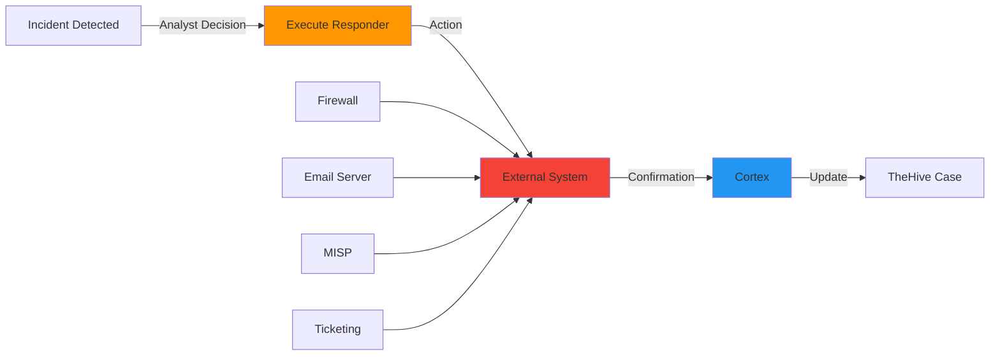
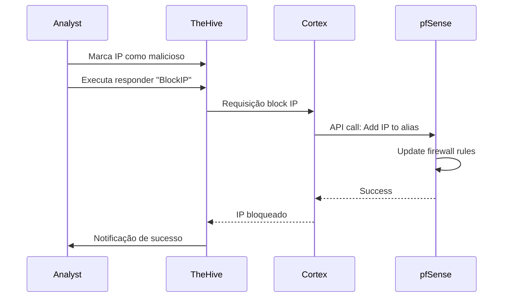
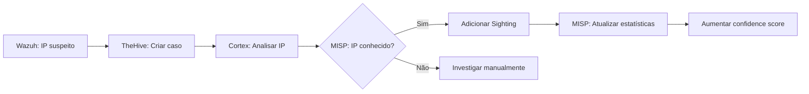
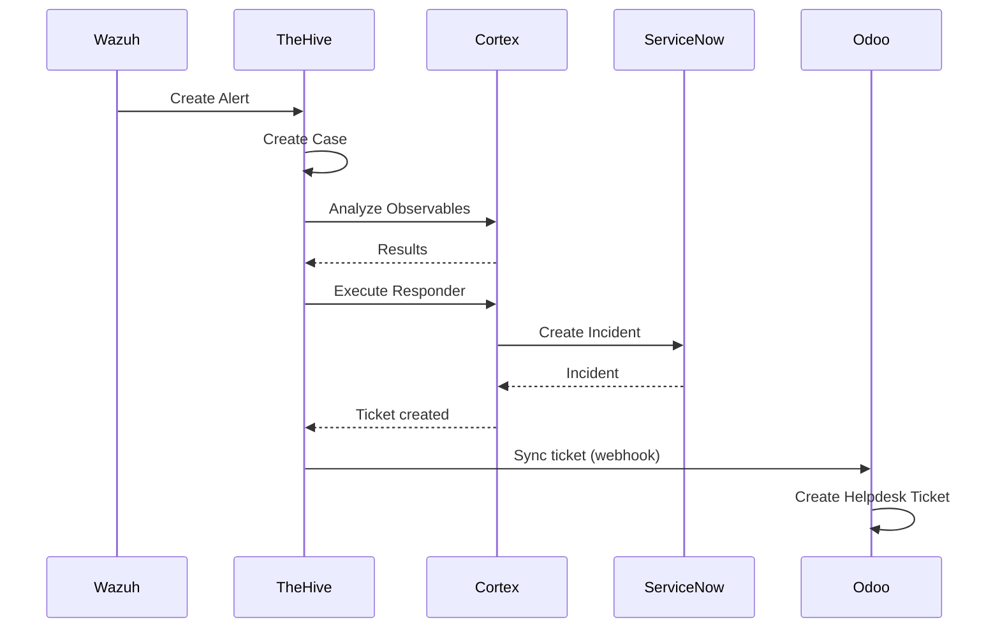

# Guia de Responders do Cortex

**Responders** são componentes do Cortex que executam **ações automatizadas** em resposta a incidentes de segurança. Enquanto analyzers **analisam**, responders **agem**.

## O que são Responders?

Responders são programas containerizados que:

- Recebem contexto de um caso/alerta/observable
- Executam ações específicas (bloquear IP, enviar email, criar ticket)
- Retornam confirmação de execução
- Podem ser reversíveis ou irreversíveis



## Diferença entre Analyzers e Responders

| Aspecto | Analyzer | Responder |
|---------|----------|-----------|
| **Propósito** | Analisar e coletar informações | Executar ações de resposta |
| **Efeito** | Somente leitura | **Modifica sistemas externos** |
| **Input** | Observable (IP, hash, etc) | Case, Alert ou Observable |
| **Output** | Report estruturado | Confirmação de ação |
| **Exemplo** | Consultar IP no VirusTotal | Bloquear IP no firewall |
| **Reversível** | N/A | Pode ser ou não |
| **Risco** | Baixo | **Médio a Alto** |

!!! danger "Atenção"
    Responders executam **ações reais** em sistemas de produção. Um responder mal configurado pode causar indisponibilidade de serviços!

## Tipos de Responders

### 1. Firewall e Network

Responders que bloqueiam/desbloqueiam IPs em firewalls.

#### pfSense

**pfSense_BlockIP / pfSense_UnblockIP**

Bloqueia IPs no firewall pfSense.

```yaml
Tipo: ip
Reversível: Sim (UnblockIP)
Risco: Alto
Requer: API pfSense configurada
```

**Configuração:**

```json
{
  "name": "pfSense_BlockIP",
  "configuration": {
    "pfsense_url": "https://firewall.example.com",
    "pfsense_key": "API_KEY_PFSENSE",
    "pfsense_secret": "API_SECRET_PFSENSE",
    "alias_name": "cortex_blocklist",
    "verify_ssl": true
  }
}
```

**Configurar API no pfSense:**

1. Login no pfSense
2. **System > API > Settings**
3. Enable REST API
4. **System > API > Keys** > Add
5. Copiar Key e Secret

**Workflow Típico:**



**Exemplo de Execução:**

```bash
# Via API Cortex
curl -X POST http://localhost:9001/api/responder/pfSense_BlockIP/run \
  -H "Authorization: Bearer $API_KEY" \
  -H "Content-Type: application/json" \
  -d '{
    "responderId": "pfSense_BlockIP",
    "objectType": "case_artifact",
    "objectId": "~123456",
    "tlp": 2,
    "parameters": {
      "duration": "24h",
      "reason": "C2 server detected by VirusTotal"
    }
  }'
```

!!! warning "Falsos Positivos"
    **Sempre valide** antes de bloquear! Um falso positivo pode bloquear serviços críticos.

---

#### FortiGate

**FortiGate_BlockIP / FortiGate_UnblockIP**

```yaml
Tipo: ip
Reversível: Sim
Risco: Alto
Requer: FortiGate API Token
```

**Configuração:**

```json
{
  "name": "FortiGate_BlockIP",
  "configuration": {
    "fortigate_url": "https://fortigate.example.com",
    "api_token": "FORTIGATE_API_TOKEN",
    "vdom": "root",
    "address_group": "Cortex_Blocklist"
  }
}
```

---

#### Cisco ASA

**Cisco_ASA_BlockIP**

```yaml
Tipo: ip
Reversível: Sim
Risco: Alto
Requer: SSH access ou REST API
```

---

#### Generic Firewall Script

Para firewalls não suportados nativamente:

**CustomFirewall_BlockIP**

```yaml
Tipo: ip
Reversível: Depende do script
Risco: Alto
Requer: Script customizado
```

### 2. Notification

Responders que enviam notificações.

#### Mailer

**Mailer_1_0**

Envia emails sobre incidentes.

```yaml
Tipo: case, alert, log
Reversível: Não
Risco: Baixo
Requer: SMTP configurado
```

**Configuração:**

```json
{
  "name": "Mailer_1_0",
  "configuration": {
    "from": "SOC Team <soc@example.com>",
    "smtp_host": "smtp.gmail.com",
    "smtp_port": 587,
    "smtp_user": "alerts@example.com",
    "smtp_password": "APP_PASSWORD",
    "smtp_use_tls": true
  }
}
```

**Gmail App Password:**

1. Habilitar 2FA na conta Google
2. https://myaccount.google.com/apppasswords
3. Criar app password para "Mail"
4. Usar essa senha (não a senha da conta)

**Template de Email:**

Emails incluem automaticamente:

- Título do caso/alerta
- Severidade
- Observables relacionados
- TLP
- Link para TheHive
- Resultados de analyzers

**Exemplo de uso:**

```python
# Notificar equipe sobre incidente crítico
{
  "responderId": "Mailer_1_0",
  "objectType": "case",
  "objectId": "~case123",
  "parameters": {
    "recipients": ["soc@example.com", "manager@example.com"],
    "subject": "[CRITICAL] Ransomware Detected",
    "body_prefix": "Immediate action required!"
  }
}
```

---

#### Slack

**Slack_1_0**

Envia notificações para canal Slack.

```yaml
Tipo: case, alert
Reversível: Não
Risco: Baixo
Requer: Slack Webhook URL
```

**Configuração:**

```json
{
  "name": "Slack_1_0",
  "configuration": {
    "webhook_url": "https://hooks.slack.com/services/T00/B00/XXX",
    "username": "Cortex Alert Bot",
    "icon_emoji": ":rotating_light:"
  }
}
```

**Criar Slack Webhook:**

1. https://api.slack.com/messaging/webhooks
2. Create New App > Incoming Webhooks
3. Activate Webhooks
4. Add New Webhook to Workspace
5. Select channel (#soc-alerts)
6. Copiar Webhook URL

**Exemplo de mensagem Slack:**

```
🚨 **Critical Alert**

**Case:** #2024-001 - Ransomware Detected
**Severity:** High
**TLP:** AMBER

**Observables:**
• IP: 192.0.2.1 (Malicious - VirusTotal: 15/70)
• Hash: abc123... (Known ransomware)

**Actions Taken:**
✅ IP blocked on firewall
✅ Host isolated from network

**View Case:** https://thehive.example.com/case/2024-001
```

---

#### Microsoft Teams

**MSTeams_1_0**

```yaml
Tipo: case, alert
Reversível: Não
Risco: Baixo
Requer: Teams Webhook URL
```

---

#### Telegram

**Telegram_1_0**

```yaml
Tipo: case, alert, log
Reversível: Não
Risco: Baixo
Requer: Bot Token + Chat ID
```

**Configuração:**

```json
{
  "name": "Telegram_1_0",
  "configuration": {
    "bot_token": "123456:ABC-DEF1234ghIkl-zyx57W2v1u123ew11",
    "chat_id": "-100123456789"
  }
}
```

**Criar Bot Telegram:**

1. Falar com @BotFather no Telegram
2. `/newbot`
3. Seguir instruções
4. Copiar token
5. Adicionar bot ao grupo
6. Obter chat_id: https://api.telegram.org/bot<TOKEN>/getUpdates

### 3. Threat Intelligence

Responders que interagem com plataformas de TI.

#### MISP

**MISP_Add_Sighting_2_0**

Adiciona sighting de IOC no MISP.

```yaml
Tipo: ip, domain, hash, url, mail, etc
Reversível: Não (mas pode remover sighting)
Risco: Baixo
Requer: MISP API Key
```

**Configuração:**

```json
{
  "name": "MISP_Add_Sighting_2_0",
  "configuration": {
    "url": "https://misp.example.com",
    "key": "MISP_API_KEY",
    "cert_check": true,
    "organisation_id": 1,
    "sighting_type": "0"
  }
}
```

**Tipos de Sighting:**

| Tipo | Valor | Significado |
|------|-------|-------------|
| **Sighting** | 0 | IOC observado na rede |
| **False Positive** | 1 | Falso positivo confirmado |
| **Expiration** | 2 | IOC não é mais relevante |

**Workflow:**



**Utilidade:**

- Confirmar que IOCs compartilhados estão sendo observados
- Contribuir para inteligência coletiva
- Rastrear prevalência de campanhas

---

**MISP_Create_Event_2_0**

Cria evento MISP a partir de caso TheHive.

```yaml
Tipo: case
Reversível: Não (mas pode deletar evento)
Risco: Baixo
```

**Configuração:**

```json
{
  "name": "MISP_Create_Event_2_0",
  "configuration": {
    "url": "https://misp.example.com",
    "key": "MISP_API_KEY",
    "cert_check": true,
    "distribution": 1,
    "threat_level_id": 2,
    "analysis": 1,
    "publish": false
  }
}
```

**Distribuição MISP:**

| ID | Nome | Descrição |
|----|------|-----------|
| 0 | Your organisation only | Não compartilhar |
| 1 | This community only | Compartilhar com comunidade |
| 2 | Connected communities | Comunidades conectadas |
| 3 | All communities | Todas as organizações |

**Exemplo:**

Quando concluir investigação de ransomware:

1. Analista marca caso como "Closed"
2. Executa responder "MISP_Create_Event"
3. Evento MISP criado com todos IOCs
4. Pode revisar e publicar no MISP

---

#### OpenCTI

**OpenCTI_Export_Case_1_0**

Exporta caso para OpenCTI.

```yaml
Tipo: case
Reversível: Não
Risco: Baixo
Formato: STIX 2.1
```

### 4. Ticketing

Responders que criam tickets em sistemas externos.

#### ServiceNow

**ServiceNow_Create_Incident_1_0**

Cria incident no ServiceNow.

```yaml
Tipo: case, alert
Reversível: Não (mas pode fechar ticket)
Risco: Baixo
Requer: ServiceNow API credentials
```

**Configuração:**

```json
{
  "name": "ServiceNow_Create_Incident_1_0",
  "configuration": {
    "instance_url": "https://mycompany.service-now.com",
    "username": "cortex_integration",
    "password": "SENHA_SERVICENOW",
    "assignment_group": "SOC_Team",
    "category": "Security",
    "subcategory": "Malware",
    "urgency": 2,
    "impact": 2
  }
}
```

**Campos criados:**

- **Short description**: Título do caso TheHive
- **Description**: Detalhes do incidente + observables
- **Caller**: Usuário que criou caso
- **Assignment group**: Configurado
- **Priority**: Calculado (urgency × impact)
- **Work notes**: Histórico de ações

**Workflow Integrado:**



---

#### Jira

**Jira_Create_Issue_1_0**

```yaml
Tipo: case, alert
Reversível: Não
Risco: Baixo
Requer: Jira API Token
```

---

#### Request Tracker (RT)

**RT4_CreateTicket_1_0**

```yaml
Tipo: case, alert
Reversível: Não
Risco: Baixo
```

---

#### Odoo (Custom)

Para criar responder customizado para Odoo:

**Odoo_CreateTicket_1_0** (exemplo customizado)

```python
#!/usr/bin/env python3
from cortexutils.responder import Responder
import xmlrpc.client

class OdooResponder(Responder):
    def __init__(self):
        Responder.__init__(self)
        self.url = self.get_param('config.odoo_url')
        self.db = self.get_param('config.odoo_db')
        self.username = self.get_param('config.odoo_username')
        self.password = self.get_param('config.odoo_password')

    def run(self):
        # Conectar ao Odoo
        common = xmlrpc.client.ServerProxy(f'{self.url}/xmlrpc/2/common')
        uid = common.authenticate(self.db, self.username, self.password, {})

        models = xmlrpc.client.ServerProxy(f'{self.url}/xmlrpc/2/object')

        # Criar ticket
        case_title = self.get_param('data.title', None, 'Case title missing')
        case_description = self.get_param('data.description', '')

        ticket_id = models.execute_kw(
            self.db, uid, self.password,
            'helpdesk.ticket', 'create',
            [{
                'name': case_title,
                'description': case_description,
                'team_id': 1,  # Security team
                'priority': '2',  # High
                'tag_ids': [(6, 0, [1])]  # Tag: Security Incident
            }]
        )

        self.report({
            'message': f'Ticket created: {ticket_id}',
            'ticket_id': ticket_id,
            'ticket_url': f'{self.url}/web#id={ticket_id}&model=helpdesk.ticket'
        })

    def operations(self, raw):
        return [self.build_operation('AddTagToCase', tag='ticket-created')]

if __name__ == '__main__':
    OdooResponder().run()
```

### 5. EDR e Host Response

#### Wazuh Active Response

**Wazuh_ActiveResponse_1_0**

Executa active response no Wazuh (bloquear IP, isolar host).

```yaml
Tipo: ip, hostname
Reversível: Sim (depende do comando)
Risco: Alto
Requer: Wazuh API
```

**Configuração:**

```json
{
  "name": "Wazuh_ActiveResponse_1_0",
  "configuration": {
    "wazuh_manager": "wazuh-manager.example.com",
    "wazuh_api_port": 55000,
    "wazuh_api_user": "cortex",
    "wazuh_api_password": "SENHA_WAZUH",
    "use_https": true,
    "verify_ssl": true
  }
}
```

**Comandos Disponíveis:**

| Comando | Descrição | Reversível |
|---------|-----------|------------|
| `firewall-drop` | Bloqueia IP no host via iptables | Sim |
| `host-deny` | Adiciona IP ao /etc/hosts.deny | Sim |
| `disable-account` | Desabilita conta de usuário | Sim |
| `restart-wazuh` | Reinicia agente Wazuh | Não |

**Exemplo:**

```bash
# Bloquear IP em todos agentes Windows
{
  "responderId": "Wazuh_ActiveResponse_1_0",
  "objectType": "case_artifact",
  "objectId": "~123",
  "parameters": {
    "command": "firewall-drop",
    "agent_group": "windows",
    "duration": "3600"
  }
}
```

---

#### CrowdStrike

**CrowdStrike_ContainHost_1_0**

Isola host na rede via CrowdStrike Falcon.

```yaml
Tipo: hostname, ip
Reversível: Sim (LiftContainment)
Risco: Muito Alto
Requer: CrowdStrike API
```

!!! danger "Contenção de Host"
    Isolar host desconecta totalmente da rede (exceto CrowdStrike cloud). Use apenas em situações críticas!

---

#### Microsoft Defender

**MDE_IsolateHost_1_0**

Isola host via Microsoft Defender for Endpoint.

```yaml
Tipo: hostname, ip
Reversível: Sim
Risco: Muito Alto
```

### 6. Custom Actions

#### Custom Script Responder

Para ações específicas da sua organização.

**CustomScript_1_0**

```yaml
Tipo: Configurável
Reversível: Depende do script
Risco: Variável
```

**Exemplo: Atualizar CMDB:**

```bash
#!/bin/bash
# custom_cmdb_update.sh

IP=$1
STATUS=$2

# Atualizar CMDB interno
curl -X PUT "http://cmdb.internal/api/assets" \
  -H "Content-Type: application/json" \
  -d "{
    \"ip\": \"$IP\",
    \"security_status\": \"$STATUS\",
    \"last_incident\": \"$(date -Iseconds)\"
  }"

echo "CMDB updated for $IP"
```

## Workflows de Resposta Automatizada

### Workflow 1: Bloqueio Automático de IP Malicioso

**Cenário:** IP detectado como malicioso por múltiplas fontes.

```yaml
Trigger: Wazuh alert de conexão suspeita
Condição: VirusTotal + AbuseIPDB + MISP confirmam malicioso
Ações:
  1. Bloquear IP no firewall (pfSense)
  2. Adicionar sighting no MISP
  3. Criar ticket no Odoo
  4. Notificar equipe via Slack
  5. Executar active response Wazuh (bloquear em hosts)
```

**Implementação (Shuffle Workflow):**

```yaml
nodes:
  - name: TheHive Webhook
    type: webhook
    output: case_data

  - name: Cortex Analyzers
    type: cortex
    analyzers:
      - VirusTotal_GetReport
      - AbuseIPDB
      - MISP_Search
    input: "{{case_data.observables}}"

  - name: Decision
    type: condition
    condition: |
      vt_score > 5 AND
      abuseipdb_score > 75 AND
      misp_found == true

  - name: Execute Responders
    type: cortex_responders
    if: decision == true
    responders:
      - pfSense_BlockIP
      - MISP_Add_Sighting
      - Slack_Notify
      - Wazuh_ActiveResponse
```

### Workflow 2: Resposta a Phishing

**Cenário:** Email de phishing reportado.

```yaml
Trigger: Ticket de phishing criado no Odoo
Ações:
  1. Analisar URLs (VirusTotal, PhishTank, URLhaus)
  2. Analisar sender email (EmailRep)
  3. Se confirmado:
     - Adicionar domínio/URL ao blocklist
     - Atualizar regras de email filter
     - Notificar usuários via email
     - Criar evento MISP
  4. Atualizar ticket Odoo com resultados
```

### Workflow 3: Resposta a Ransomware

**Cenário:** Ransomware detectado em host.

```yaml
Trigger: Wazuh alert de ransomware
Ações Imediatas (automáticas):
  1. Isolar host (CrowdStrike/Wazuh)
  2. Bloquear C2 IPs no firewall
  3. Criar caso crítico no TheHive
  4. Notificar SOC via múltiplos canais

Ações Investigação (manual):
  5. Analisar hash em sandboxes
  6. Buscar IOCs em MISP/OpenCTI
  7. Verificar outros hosts comprometidos

Ações Remediação (semi-automática):
  8. Criar playbook de recuperação
  9. Documentar lições aprendidas
  10. Atualizar detecções
```

## Exemplo Prático Completo

### Cenário: IP Suspeito em Log de Firewall

**Passo 1: Detecção**

```yaml
Wazuh Rule: Conexão de IP com má reputação
Alerta: "Suspicious connection from 203.0.113.42"
```

**Passo 2: Investigação (TheHive + Cortex)**

Analista cria caso no TheHive:

```json
{
  "title": "Suspicious IP Connection",
  "description": "IP 203.0.113.42 attempting multiple connections",
  "severity": 2,
  "tlp": 2,
  "observables": [
    {"dataType": "ip", "data": "203.0.113.42"}
  ]
}
```

TheHive automaticamente envia IP para Cortex. Analyzers executados:

- ✅ AbuseIPDB: Score 95/100 (malicioso)
- ✅ VirusTotal: 12/70 AVs detectaram
- ✅ Shodan: Múltiplos serviços suspeitos expostos
- ✅ MISP: Encontrado em campanha de botnet
- ✅ MaxMind: Localizado em país de alto risco

**Passo 3: Decisão**

Analista revisa resultados e decide bloquear.

**Passo 4: Resposta (Cortex Responders)**

No TheHive, analista executa responders:

```yaml
1. pfSense_BlockIP
   Parâmetros:
     - duration: 7 days
     - reason: "Botnet C2 server"
   Resultado: ✅ IP bloqueado em firewall rule #42

2. MISP_Add_Sighting
   Resultado: ✅ Sighting adicionado ao evento #12345

3. Wazuh_ActiveResponse
   Parâmetros:
     - command: firewall-drop
     - agent_group: all
     - duration: 604800  # 7 days
   Resultado: ✅ Active response enviado para 150 agentes

4. Slack_Notify
   Canal: #soc-alerts
   Resultado: ✅ Equipe notificada

5. ServiceNow_Create_Incident
   Resultado: ✅ Ticket INC0010234 criado
```

**Passo 5: Documentação**

TheHive atualizado automaticamente com:
- Timeline de todas ações
- Confirmações de responders
- Links para tickets externos
- Métricas (tempo de resposta, etc)

## Melhores Práticas

### 1. Validação Antes de Agir

```python
# Sempre validar múltiplas fontes
def should_block_ip(ip_results):
    malicious_count = 0

    if ip_results['virustotal']['positives'] > 5:
        malicious_count += 1

    if ip_results['abuseipdb']['score'] > 80:
        malicious_count += 1

    if ip_results['misp']['found']:
        malicious_count += 1

    # Requer 2+ fontes confirmando
    return malicious_count >= 2
```

### 2. Testes em Staging

**Nunca teste responders em produção primeiro!**

```yaml
Ambiente de teste:
  - Firewall de teste com mesma configuração
  - MISP de desenvolvimento
  - Endpoints de teste

Validar:
  - Conectividade
  - Credenciais
  - Impacto de ações
  - Reversibilidade
```

### 3. Logging e Auditoria

Todos responders devem logar:

```json
{
  "timestamp": "2025-12-05T14:30:00Z",
  "responder": "pfSense_BlockIP",
  "user": "analyst@example.com",
  "action": "block_ip",
  "target": "203.0.113.42",
  "reason": "Botnet C2",
  "duration": "7d",
  "success": true,
  "firewall_rule_id": 42
}
```

### 4. Plano de Rollback

Para cada responder, documentar rollback:

| Responder | Rollback Procedure |
|-----------|-------------------|
| pfSense_BlockIP | Executar pfSense_UnblockIP OU remover manualmente alias |
| Wazuh_ActiveResponse | Active response expira automaticamente OU comando undo |
| MISP_Add_Sighting | Não necessário (informativo) |
| Mailer | Não reversível (enviar correção) |

### 5. Aprovações

Configure responders críticos para requerer aprovação:

```yaml
Responders críticos (requerem aprovação):
  - CrowdStrike_ContainHost
  - MDE_IsolateHost
  - pfSense_BlockIP (se duration > 24h)

Responders automáticos (sem aprovação):
  - MISP_Add_Sighting
  - Slack_Notify
  - Mailer
```

### 6. Rate Limiting

Evite responder em massa acidentalmente:

```python
# Limitar bloqueios por hora
max_blocks_per_hour = 50

if redis.get('blocks_last_hour') > max_blocks_per_hour:
    raise Exception("Rate limit exceeded - possible automation loop!")
```

## Troubleshooting

### Responder Falha: "Connection Timeout"

**Causa:** Firewall/sistema destino inacessível

**Solução:**

```bash
# Testar conectividade
curl -v https://firewall.example.com

# Verificar certificado SSL
openssl s_client -connect firewall.example.com:443

# Testar de dentro do container
docker exec -it cortex curl https://firewall.example.com
```

### Responder Falha: "Unauthorized"

**Causa:** Credenciais incorretas ou expiradas

**Solução:**

```bash
# Verificar configuração
curl -H "Authorization: Bearer $API_KEY" \
  http://localhost:9001/api/responder/pfSense_BlockIP

# Testar credenciais manualmente
curl -u cortex:password https://firewall.example.com/api/test
```

### Responder Executado Mas Sem Efeito

**Causa:** Permissões insuficientes

**Verificar:**

- Usuário API tem permissões corretas?
- Regra de firewall aplicada ao policy correto?
- Active response habilitado no Wazuh?

### Responders Duplicados

**Causa:** Webhook executado múltiplas vezes

**Solução:**

```python
# Implementar idempotência
def execute_responder(ip, action_id):
    # Verificar se já executado
    if redis.exists(f'action:{action_id}'):
        return {'status': 'already_executed'}

    # Executar ação
    result = firewall.block_ip(ip)

    # Marcar como executado
    redis.setex(f'action:{action_id}', 3600, '1')

    return result
```

## Criação de Responders Customizados

### Estrutura

```
MyResponder/
├── MyResponder.json       # Metadata
├── myresponder.py         # Código
├── requirements.txt
└── Dockerfile
```

### Exemplo Completo

Ver seção "Criação de Analyzers Customizados" em [analyzers.md](analyzers.md) - estrutura é similar.

## Recursos

- **Responder Catalog:** https://github.com/TheHive-Project/Cortex-Analyzers/tree/master/responders
- **Development Guide:** https://docs.strangebee.com/cortex/development/
- **API Reference:** [api-reference.md](api-reference.md)

---

**Próximo:** [Integração com TheHive](integration-thehive.md)
