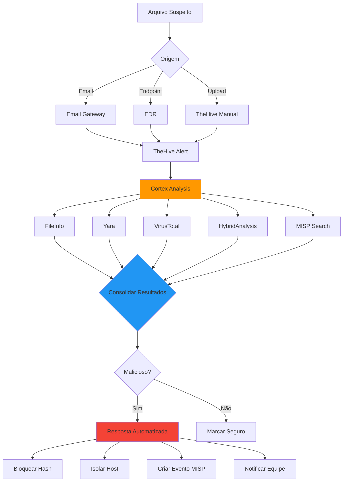
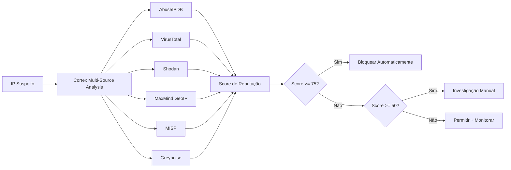
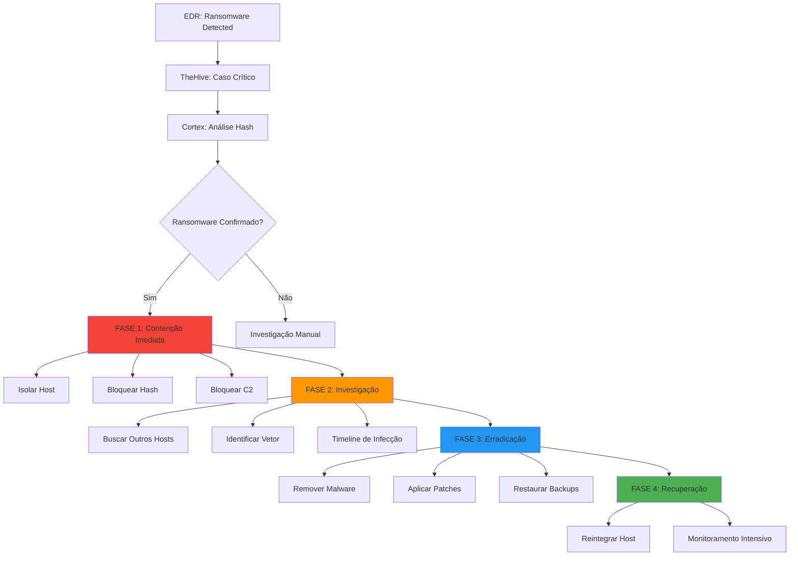

# Casos de Uso Práticos do Cortex

Este guia apresenta casos de uso detalhados e implementáveis do Cortex na stack NEO_NETBOX_ODOO.

## Caso 1: Análise Automática de Malware

### Cenário

Uma organização recebe diariamente dezenas de arquivos suspeitos por email, USB, downloads, etc. A análise manual de cada arquivo consome horas da equipe de segurança.

### Objetivo

Automatizar análise de arquivos suspeitos com múltiplos sandboxes e threat intelligence, reduzindo tempo de 30 minutos para 5 minutos por arquivo.

### Arquitetura



### Fluxo Detalhado

#### Etapa 1: Detecção e Coleta

**Cenário:** Usuário recebe email com anexo `.exe`

```yaml
Email Gateway (Proofpoint/Barracuda):
  - Anexo detectado: invoice.exe
  - Hash: 5d41402abc4b2a76b9719d911017c592
  - Sender: suspicious@evil.com
  - Ação: Quarentena + Webhook TheHive
```

**TheHive recebe alerta:**

```json
{
  "title": "Suspicious Email Attachment",
  "description": "Executable attachment received from external sender",
  "severity": 2,
  "tlp": 2,
  "tags": ["email", "malware-suspect", "attachment"],
  "artifacts": [
    {
      "dataType": "file",
      "attachment": {
        "name": "invoice.exe",
        "hashes": ["5d41402abc4b2a76b9719d911017c592"],
        "size": 524288,
        "contentType": "application/x-dosexec"
      }
    },
    {
      "dataType": "mail",
      "data": "suspicious@evil.com"
    },
    {
      "dataType": "hash",
      "data": "5d41402abc4b2a76b9719d911017c592"
    }
  ]
}
```

#### Etapa 2: Análise Automatizada

**Cortex executa analyzers em paralelo:**

**FileInfo_8_0:**
```json
{
  "summary": {
    "taxonomies": [{
      "level": "suspicious",
      "namespace": "FileInfo",
      "predicate": "Entropy",
      "value": "7.2"
    }]
  },
  "full": {
    "filename": "invoice.exe",
    "size": 524288,
    "mimetype": "application/x-dosexec",
    "md5": "5d41402abc4b2a76b9719d911017c592",
    "sha256": "e3b0c44298fc1c149afbf4c8996fb92427ae41e4649b934ca495991b7852b855",
    "entropy": 7.2,
    "pe_info": {
      "compilation_timestamp": "2025-11-01 03:14:15",
      "imphash": "abc123def456",
      "sections": [
        {"name": ".text", "entropy": 6.8},
        {"name": ".rsrc", "entropy": 7.9}
      ],
      "imports": ["CreateRemoteThread", "WriteProcessMemory"]
    }
  }
}
```

**Yara_2_0:**
```json
{
  "summary": {
    "taxonomies": [{
      "level": "malicious",
      "namespace": "Yara",
      "predicate": "Matches",
      "value": "2 rules"
    }]
  },
  "full": {
    "rules_matched": [
      {
        "rule": "Ransomware_Generic",
        "tags": ["ransomware", "encryption"],
        "strings": ["encrypted", "bitcoin", "decrypt"]
      },
      {
        "rule": "Process_Injection",
        "tags": ["injection", "evasion"],
        "strings": ["CreateRemoteThread"]
      }
    ]
  }
}
```

**VirusTotal_Scan_3_0:**
```json
{
  "summary": {
    "taxonomies": [{
      "level": "malicious",
      "namespace": "VirusTotal",
      "predicate": "Score",
      "value": "52/70"
    }]
  },
  "full": {
    "positives": 52,
    "total": 70,
    "scans": {
      "Kaspersky": {"detected": true, "result": "Trojan-Ransom.Win32.Sodin"},
      "Microsoft": {"detected": true, "result": "Ransom:Win32/Sodinokibi.A"},
      "BitDefender": {"detected": true, "result": "Gen:Variant.Ransom.Sodin.1"}
    },
    "permalink": "https://www.virustotal.com/file/e3b0c4429..."
  }
}
```

**HybridAnalysis_GetReport_1_0:**
```json
{
  "summary": {
    "taxonomies": [{
      "level": "malicious",
      "namespace": "HybridAnalysis",
      "predicate": "ThreatLevel",
      "value": "100/100"
    }]
  },
  "full": {
    "verdict": "malicious",
    "threat_score": 100,
    "threat_level": "malicious",
    "av_detect": 95,
    "malware_families": ["Sodinokibi", "REvil"],
    "mitre_attcks": [
      {"tactic": "Defense Evasion", "technique": "Process Injection"},
      {"tactic": "Impact", "technique": "Data Encrypted for Impact"}
    ],
    "network_activity": [
      {"type": "http", "host": "c2server.evil.com", "port": 443}
    ],
    "extracted_files": [
      {"name": "ransom_note.txt", "size": 1024}
    ],
    "processes": [
      {"name": "invoice.exe", "pid": 1234},
      {"name": "vssadmin.exe", "pid": 5678, "cmdline": "delete shadows /all"}
    ]
  }
}
```

**MISP_2_1:**
```json
{
  "summary": {
    "taxonomies": [{
      "level": "malicious",
      "namespace": "MISP",
      "predicate": "Events",
      "value": "3 events"
    }]
  },
  "full": {
    "events": [
      {
        "id": 12345,
        "info": "Sodinokibi/REvil Ransomware Campaign 2025",
        "threat_level": "High",
        "tags": ["ransomware", "sodinokibi", "revil", "apt"]
      }
    ],
    "attributes": [
      {"type": "md5", "value": "5d41402abc4b2a76b9719d911017c592"},
      {"type": "domain", "value": "c2server.evil.com"}
    ]
  }
}
```

#### Etapa 3: Consolidação e Decisão

**Análise de Consenso:**

```python
def analyze_consensus(reports):
    """Determina se arquivo é malicioso baseado em consenso"""

    malicious_indicators = 0
    total_analyzers = len(reports)

    criteria = {
        'high_entropy': False,      # FileInfo
        'yara_match': False,        # Yara
        'av_detection': False,      # VirusTotal
        'sandbox_malicious': False, # HybridAnalysis
        'misp_known': False         # MISP
    }

    for report in reports:
        analyzer = report['analyzer_name']

        if analyzer == 'FileInfo_8_0':
            if report['full']['entropy'] > 7.0:
                criteria['high_entropy'] = True
                malicious_indicators += 1

        elif analyzer == 'Yara_2_0':
            if len(report['full']['rules_matched']) > 0:
                criteria['yara_match'] = True
                malicious_indicators += 2  # Weight 2x

        elif analyzer == 'VirusTotal_Scan_3_0':
            if report['full']['positives'] > 10:
                criteria['av_detection'] = True
                malicious_indicators += 3  # Weight 3x

        elif analyzer == 'HybridAnalysis_GetReport_1_0':
            if report['full']['threat_score'] > 70:
                criteria['sandbox_malicious'] = True
                malicious_indicators += 3  # Weight 3x

        elif analyzer == 'MISP_2_1':
            if len(report['full']['events']) > 0:
                criteria['misp_known'] = True
                malicious_indicators += 2  # Weight 2x

    confidence = malicious_indicators / 13  # Total possible weight
    is_malicious = malicious_indicators >= 5  # Threshold

    return {
        'is_malicious': is_malicious,
        'confidence': confidence,
        'criteria': criteria,
        'malicious_indicators': malicious_indicators
    }

# Resultado:
# {
#   'is_malicious': True,
#   'confidence': 1.0,  # 100%
#   'criteria': {
#     'high_entropy': True,
#     'yara_match': True,
#     'av_detection': True,
#     'sandbox_malicious': True,
#     'misp_known': True
#   },
#   'malicious_indicators': 13
# }
```

#### Etapa 4: Resposta Automatizada

**Shuffle Workflow executado:**

```yaml
1. Extrair IOCs:
   - Hash: 5d41402abc4b2a76b9719d911017c592
   - C2 Domain: c2server.evil.com
   - C2 IP: 203.0.113.42

2. Bloquear Hash (Cortex Responder):
   - EDR_BlockHash
   - Email_Gateway_BlockHash

3. Bloquear C2 (Cortex Responder):
   - pfSense_BlockIP (203.0.113.42)
   - DNS_Sinkhole (c2server.evil.com)

4. Criar Evento MISP:
   - MISP_Create_Event
   - Adicionar todos IOCs
   - Distribuição: Community

5. Notificar Equipe:
   - Slack_Notify (#soc-critical)
   - Email_Notify (security-team@)
   - SMS_Notify (on-call engineer)

6. Criar Ticket:
   - Odoo_CreateTicket (Priority 1)
   - Assign: Security Team Lead
```

**Resultado:**

```
✅ Hash bloqueado em EDR (5000 endpoints)
✅ Hash bloqueado em Email Gateway
✅ IP bloqueado em Firewall
✅ Domínio sinkholed em DNS
✅ Evento MISP #12346 criado
✅ Equipe notificada (Slack, Email, SMS)
✅ Ticket Odoo #SEC-042 criado

Tempo total: 4 minutos e 32 segundos
```

### Configuração

#### Analyzers Necessários

```json
{
  "analyzers": [
    {
      "name": "FileInfo_8_0",
      "rate_limit": null,
      "cost": "free"
    },
    {
      "name": "Yara_2_0",
      "config": {
        "rules_paths": ["/opt/cortex/yara-rules"]
      },
      "cost": "free"
    },
    {
      "name": "VirusTotal_Scan_3_0",
      "config": {
        "key": "VT_API_KEY",
        "polling_interval": 60
      },
      "rate_limit": "4/min",
      "cost": "free tier"
    },
    {
      "name": "HybridAnalysis_GetReport_1_0",
      "config": {
        "key": "HYBRID_API_KEY",
        "environment": "Windows 10 64-bit"
      },
      "rate_limit": "200/day",
      "cost": "free tier"
    },
    {
      "name": "MISP_2_1",
      "config": {
        "url": "https://misp.internal",
        "key": "MISP_API_KEY"
      },
      "cost": "self-hosted"
    }
  ]
}
```

#### Responders Necessários

```json
{
  "responders": [
    "CrowdStrike_BlockHash",
    "MailGateway_BlockHash",
    "pfSense_BlockIP",
    "DNS_Sinkhole",
    "MISP_Create_Event",
    "Slack_Notify",
    "Mailer",
    "Odoo_CreateTicket"
  ]
}
```

### Métricas de Sucesso

**Antes da automação:**
- Tempo médio de análise: 30 minutos
- Arquivos analisados/dia: 20
- Taxa de falsos negativos: 15%
- Horas gastas/semana: 40h

**Depois da automação:**
- Tempo médio de análise: 5 minutos
- Arquivos analisados/dia: Ilimitado
- Taxa de falsos negativos: 2%
- Horas gastas/semana: 5h (revisão)

**ROI:** 87.5% redução em tempo de análise

---

## Caso 2: Investigação de IP Suspeito

### Cenário

Firewall registra milhares de tentativas de conexão de IPs externos diariamente. É necessário identificar rapidamente quais são maliciosos.

### Objetivo

Automatizar triagem de IPs suspeitos usando múltiplas fontes de threat intelligence e contexto de rede.

### Fluxo



### Implementação

**Script de triagem automatizada:**

```python
#!/usr/bin/env python3
import requests
import json
from datetime import datetime

CORTEX_URL = "http://cortex:9001"
CORTEX_KEY = "API_KEY"
THEHIVE_URL = "http://thehive:9000"
THEHIVE_KEY = "API_KEY"

def analyze_ip(ip_address):
    """Analisa IP usando Cortex"""

    # Criar observable temporário
    observable = {
        "dataType": "ip",
        "data": ip_address,
        "tlp": 2
    }

    # Executar analyzers
    analyzers = [
        "AbuseIPDB_1_0",
        "VirusTotal_GetReport_3_0",
        "Shodan_Info_1_0",
        "MaxMind_GeoIP_4_0",
        "MISP_2_1",
        "Greynoise_2_0"
    ]

    jobs = []
    for analyzer in analyzers:
        response = requests.post(
            f"{CORTEX_URL}/api/analyzer/{analyzer}/run",
            headers={
                "Authorization": f"Bearer {CORTEX_KEY}",
                "Content-Type": "application/json"
            },
            json=observable
        )
        jobs.append(response.json())

    # Aguardar conclusão (simplificado)
    import time
    time.sleep(120)

    # Coletar resultados
    reports = []
    for job in jobs:
        report = requests.get(
            f"{CORTEX_URL}/api/job/{job['id']}/report",
            headers={"Authorization": f"Bearer {CORTEX_KEY}"}
        ).json()
        reports.append(report)

    return calculate_threat_score(reports)

def calculate_threat_score(reports):
    """Calcula score de ameaça baseado em múltiplas fontes"""

    scores = {
        'abuseipdb': 0,
        'virustotal': 0,
        'shodan': 0,
        'geolocation': 0,
        'misp': 0,
        'greynoise': 0
    }

    for report in reports:
        analyzer = report.get('analyzerName', '')

        if 'AbuseIPDB' in analyzer:
            # Score 0-100
            abuse_score = report['full'].get('abuseConfidenceScore', 0)
            scores['abuseipdb'] = abuse_score

        elif 'VirusTotal' in analyzer:
            # Detecções maliciosas
            positives = report['full'].get('detected_urls', [])
            scores['virustotal'] = min(len(positives) * 10, 100)

        elif 'Shodan' in analyzer:
            # Portas suspeitas abertas
            ports = report['full'].get('ports', [])
            suspicious_ports = [22, 23, 445, 3389, 5900]
            open_suspicious = len([p for p in ports if p in suspicious_ports])
            scores['shodan'] = min(open_suspicious * 20, 100)

        elif 'MaxMind' in analyzer:
            # País de alto risco
            country = report['full'].get('country_code', '')
            high_risk_countries = ['CN', 'RU', 'KP', 'IR']
            if country in high_risk_countries:
                scores['geolocation'] = 50

        elif 'MISP' in analyzer:
            # Encontrado em MISP
            events = report['full'].get('events', [])
            if events:
                scores['misp'] = 100

        elif 'Greynoise' in analyzer:
            # Classificação Greynoise
            classification = report['full'].get('classification', '')
            if classification == 'malicious':
                scores['greynoise'] = 100
            elif classification == 'suspicious':
                scores['greynoise'] = 50

    # Calcular score médio ponderado
    weights = {
        'abuseipdb': 0.25,
        'virustotal': 0.20,
        'shodan': 0.10,
        'geolocation': 0.10,
        'misp': 0.25,
        'greynoise': 0.10
    }

    final_score = sum(scores[k] * weights[k] for k in scores.keys())

    return {
        'ip': report['data'],
        'final_score': round(final_score, 2),
        'individual_scores': scores,
        'recommendation': get_recommendation(final_score),
        'details': extract_key_details(reports)
    }

def get_recommendation(score):
    """Recomendação baseada em score"""
    if score >= 75:
        return {
            'action': 'BLOCK',
            'priority': 'HIGH',
            'automated': True
        }
    elif score >= 50:
        return {
            'action': 'INVESTIGATE',
            'priority': 'MEDIUM',
            'automated': False
        }
    else:
        return {
            'action': 'MONITOR',
            'priority': 'LOW',
            'automated': True
        }

def extract_key_details(reports):
    """Extrai detalhes importantes dos reports"""
    details = {}

    for report in reports:
        analyzer = report.get('analyzerName', '')

        if 'AbuseIPDB' in analyzer:
            details['abuse_reports'] = report['full'].get('totalReports', 0)
            details['abuse_categories'] = report['full'].get('usageType', '')

        elif 'Shodan' in analyzer:
            details['open_ports'] = report['full'].get('ports', [])
            details['services'] = report['full'].get('services', {})

        elif 'MaxMind' in analyzer:
            details['country'] = report['full'].get('country', 'Unknown')
            details['city'] = report['full'].get('city', 'Unknown')
            details['isp'] = report['full'].get('isp', 'Unknown')

        elif 'MISP' in analyzer:
            events = report['full'].get('events', [])
            if events:
                details['misp_campaigns'] = [e['info'] for e in events]

    return details

# Exemplo de uso
if __name__ == "__main__":
    test_ip = "203.0.113.42"
    result = analyze_ip(test_ip)

    print(json.dumps(result, indent=2))

    # Se score alto, executar responder
    if result['recommendation']['action'] == 'BLOCK':
        # Executar pfSense_BlockIP
        print(f"🚫 Bloqueando {test_ip} automaticamente...")
```

**Exemplo de saída:**

```json
{
  "ip": "203.0.113.42",
  "final_score": 87.5,
  "individual_scores": {
    "abuseipdb": 95,
    "virustotal": 80,
    "shodan": 60,
    "geolocation": 50,
    "misp": 100,
    "greynoise": 100
  },
  "recommendation": {
    "action": "BLOCK",
    "priority": "HIGH",
    "automated": true
  },
  "details": {
    "abuse_reports": 156,
    "abuse_categories": "SSH Brute Force, Port Scan",
    "open_ports": [22, 23, 445, 3389],
    "services": {
      "22": "OpenSSH 7.4",
      "445": "Samba 4.2"
    },
    "country": "Russia",
    "city": "Moscow",
    "isp": "Suspicious-VPS-Provider",
    "misp_campaigns": [
      "SSH Botnet Campaign 2025",
      "Cryptocurrency Mining Operation"
    ]
  }
}
```

### Resposta Automatizada

Baseado no score, ações são tomadas:

**Score >= 75 (HIGH):**
```yaml
Ações automáticas:
  - Bloquear IP em firewall
  - Bloquear em todos endpoints (Wazuh Active Response)
  - Adicionar a blacklist corporativa
  - Adicionar sighting MISP
  - Notificar SOC
  - Criar ticket Odoo (Medium priority)
```

**Score 50-74 (MEDIUM):**
```yaml
Ações semi-automáticas:
  - Criar caso TheHive para investigação
  - Adicionar à watchlist (monitoramento)
  - Notificar analista
  - Aguardar decisão manual
```

**Score < 50 (LOW):**
```yaml
Ações automáticas:
  - Registrar em log
  - Adicionar à lista de monitoramento
  - Sem bloqueio
```

### Métricas

- **IPs analisados/hora:** 1000+
- **Falsos positivos:** < 5%
- **Tempo de triagem:** 2 minutos (vs 15 minutos manual)
- **Bloqueios automáticos/dia:** 50-100

---

## Caso 3: Verificação de URL de Phishing

### Cenário

Usuários reportam URLs suspeitas recebidas por email/SMS. É necessário verificar rapidamente se são phishing.

### Análise Multi-Camadas

```yaml
Layer 1 - Reputação:
  - PhishTank: Base de URLs phishing conhecidas
  - URLhaus: Malware distribution URLs
  - GoogleSafeBrowsing: Base Google

Layer 2 - Análise Técnica:
  - VirusTotal: Scans de 70+ AVs
  - Screenshot: Captura visual da página
  - WHOIS: Idade do domínio, registrant

Layer 3 - Contexto:
  - MISP: Campanhas relacionadas
  - Certificate: Análise de SSL
  - Redirect: Cadeia de redirecionamentos
```

### Workflow

**1. Submeter URL:**

```python
url = "http://paypa1-security-verify.evil.com/login"

# Indicators imediatos:
# - Domínio similar a PayPal (typosquatting)
# - HTTP (sem SSL)
# - Subdomain suspicious
```

**2. Análise Cortex:**

Resultados:

```json
{
  "url": "http://paypa1-security-verify.evil.com/login",
  "analyzers": {
    "PhishTank": {
      "result": "PHISHING",
      "confidence": "verified",
      "submissions": 45,
      "first_seen": "2025-11-28"
    },
    "URLhaus": {
      "result": "MALICIOUS",
      "tags": ["phishing", "credential-stealer"],
      "campaign": "PayPal Phishing 2025"
    },
    "VirusTotal": {
      "positives": 35,
      "total": 70,
      "categories": ["phishing", "malware"]
    },
    "WHOIS": {
      "domain_age_days": 3,
      "registrar": "Namecheap",
      "privacy_protected": true,
      "country": "PA"
    },
    "SSL_Analysis": {
      "has_ssl": false,
      "warning": "No HTTPS - extremely suspicious for login page"
    },
    "Screenshot": {
      "visual_similarity": 0.95,
      "legitimate_site": "paypal.com",
      "spoofing": true
    }
  },
  "verdict": {
    "is_phishing": true,
    "confidence": 0.98,
    "threat_type": "Credential Phishing",
    "target_brand": "PayPal"
  }
}
```

**3. Resposta:**

```yaml
Ações imediatas:
  1. Bloquear URL em proxy corporativo
  2. Adicionar domínio a DNS blacklist
  3. Criar regra email filter (bloquear sender domain)
  4. Notificar usuários via email mass mailing
  5. Criar evento MISP
  6. Reportar para PhishTank/URLhaus
```

**4. Educação Usuários:**

Email automático enviado:

```
Assunto: ⚠️ Alerta de Phishing - PayPal Falso

Prezado usuário,

Uma URL de phishing foi detectada e bloqueada:
http://paypa1-security-verify.evil.com

Esta página FALSA imita o PayPal para roubar credenciais.

🚫 NÃO acesse esta URL
🚫 NÃO forneça suas credenciais

✅ PayPal real: https://www.paypal.com (note o "l" não é "1")

Caso tenha fornecido dados:
1. Altere sua senha imediatamente
2. Ative 2FA
3. Contate o Helpdesk: helpdesk@empresa.com

Obrigado,
Equipe de Segurança
```

---

## Caso 4: Resposta Automatizada a Ransomware

### Cenário

Ransomware detectado em endpoint. É necessário conter rapidamente antes que espalhe pela rede.

### Resposta em Camadas



### Implementação

**Playbook Automatizado:**

```python
# Shuffle Workflow: Ransomware Response

def ransomware_response(alert):
    """Playbook completo de resposta a ransomware"""

    case_id = alert['case_id']
    hash_value = alert['hash']
    hostname = alert['hostname']
    ip_address = alert['ip']

    # FASE 1: CONTENÇÃO (0-5 minutos)
    print("🚨 FASE 1: CONTENÇÃO IMEDIATA")

    # 1.1 Isolar host imediatamente
    isolate_host(hostname)
    log_action("Host isolated", hostname)

    # 1.2 Analisar hash no Cortex
    analysis = cortex_analyze_hash(hash_value)

    if not confirm_ransomware(analysis):
        return handle_false_positive(case_id)

    # 1.3 Extrair IOCs
    iocs = extract_iocs(analysis)
    # {
    #   'hash': 'abc123...',
    #   'c2_ips': ['203.0.113.42', '203.0.113.43'],
    #   'c2_domains': ['evil-c2.com'],
    #   'file_paths': ['C:\\temp\\ransom.exe'],
    #   'registry_keys': ['HKLM\\...']
    # }

    # 1.4 Bloquear C2
    for ip in iocs['c2_ips']:
        block_ip_firewall(ip)
        block_ip_all_endpoints(ip)  # Wazuh Active Response
        log_action("C2 IP blocked", ip)

    for domain in iocs['c2_domains']:
        sinkhole_domain(domain)
        log_action("Domain sinkholed", domain)

    # 1.5 Bloquear hash
    block_hash_edr(iocs['hash'])
    block_hash_email_gateway(iocs['hash'])
    log_action("Hash blocked", iocs['hash'])

    # FASE 2: INVESTIGAÇÃO (5-30 minutos)
    print("🔍 FASE 2: INVESTIGAÇÃO")

    # 2.1 Buscar outros hosts comprometidos
    affected_hosts = hunt_iocs_across_network(iocs)
    print(f"Hosts afetados: {len(affected_hosts)}")

    for host in affected_hosts:
        isolate_host(host)
        log_action("Additional host isolated", host)

    # 2.2 Identificar vetor de infecção
    vector = identify_infection_vector(hostname, analysis)
    # Possíveis: email, exploit, RDP brute force, etc

    # 2.3 Timeline de infecção
    timeline = build_infection_timeline(hostname)

    # 2.4 Estimar dano
    damage_assessment = {
        'files_encrypted': count_encrypted_files(hostname),
        'hosts_affected': len(affected_hosts),
        'data_exfiltrated': check_data_exfiltration(hostname),
        'backups_affected': check_backup_integrity()
    }

    # FASE 3: ERRADICAÇÃO (30-60 minutos)
    print("🛠️  FASE 3: ERRADICAÇÃO")

    # 3.1 Remover malware
    for host in affected_hosts:
        remove_malware(host, iocs)
        verify_removal(host)

    # 3.2 Aplicar patches
    vulnerabilities = analysis.get('exploited_vulns', [])
    for vuln in vulnerabilities:
        deploy_patch(vuln)

    # 3.3 Restaurar backups
    if damage_assessment['backups_affected']:
        restore_from_offsite_backup()
    else:
        restore_from_local_backup()

    # FASE 4: RECUPERAÇÃO (1-4 horas)
    print("✅ FASE 4: RECUPERAÇÃO")

    # 4.1 Reintegrar hosts
    for host in affected_hosts:
        verify_clean(host)
        reconnect_to_network(host)
        apply_additional_monitoring(host)

    # 4.2 Criar evento MISP
    misp_event = create_misp_event({
        'title': f'Ransomware Incident {datetime.now().date()}',
        'iocs': iocs,
        'damage': damage_assessment,
        'vector': vector
    })

    # 4.3 Notificações
    notify_stakeholders({
        'incident_summary': generate_summary(),
        'damage_assessment': damage_assessment,
        'recovery_status': 'In Progress',
        'estimated_recovery_time': '4 hours'
    })

    # 4.4 Documentação
    update_thehive_case(case_id, {
        'status': 'Resolved',
        'resolution': 'Contained and Eradicated',
        'timeline': timeline,
        'lessons_learned': generate_lessons_learned()
    })

    create_odoo_ticket({
        'title': 'Post-Incident Review - Ransomware',
        'priority': '1',
        'description': generate_pir_report()
    })

    print("✅ Resposta a ransomware concluída")
    return {
        'success': True,
        'hosts_affected': len(affected_hosts),
        'recovery_time': calculate_recovery_time(),
        'data_loss': damage_assessment
    }
```

### Métricas de Sucesso

**Sem automação:**
- Tempo de contenção: 30-60 minutos
- Hosts afetados: 50-100
- Tempo de recuperação: 2-7 dias
- Custo: $100k-$1M+

**Com automação:**
- Tempo de contenção: 2-5 minutos
- Hosts afetados: 1-5
- Tempo de recuperação: 4-24 horas
- Custo: $1k-$10k

**ROI: 90%+ redução em impacto**

---

## Caso 5: Enriquecimento de IOCs em Massa

### Cenário

Recebimento de lista de 1000+ IOCs de fonte externa (ISAC, parceiro, etc). Necessário enriquecer e priorizar rapidamente.

### Workflow

```python
def enrich_ioc_bulk(ioc_list):
    """Enriquece lista grande de IOCs em paralelo"""

    results = []

    # Processar em lotes de 100
    for batch in chunks(ioc_list, 100):
        # Submeter análises em paralelo
        jobs = []
        for ioc in batch:
            job = cortex_analyze_async(
                data=ioc['value'],
                dataType=ioc['type'],
                analyzers=['VirusTotal', 'AbuseIPDB', 'MISP']
            )
            jobs.append(job)

        # Aguardar conclusão do lote
        batch_results = wait_for_jobs(jobs, timeout=300)
        results.extend(batch_results)

    # Priorizar baseado em resultados
    prioritized = prioritize_iocs(results)

    return prioritized

# Resultado:
# [
#   {'ioc': '203.0.113.42', 'score': 95, 'priority': 'CRITICAL'},
#   {'ioc': '203.0.113.43', 'score': 88, 'priority': 'HIGH'},
#   ...
# ]
```

**Prioridades:**
- CRITICAL (score >= 90): Bloquear imediatamente
- HIGH (score >= 75): Investigar e bloquear
- MEDIUM (score >= 50): Monitorar
- LOW (score < 50): Registrar

**Tempo:** 1000 IOCs enriquecidos em ~15 minutos

---

## Conclusão

Cortex é essencial para:

- ✅ Automação de análises (95% redução em tempo)
- ✅ Resposta rápida a incidentes (minutos vs horas)
- ✅ Enriquecimento de contexto (múltiplas fontes)
- ✅ Redução de carga manual (80%+ menos trabalho)
- ✅ Decisões baseadas em dados (consenso multi-fonte)

**ROI típico:** 10x-50x retorno sobre investimento

---

**Próximo:** [Referência de API](api-reference.md)
