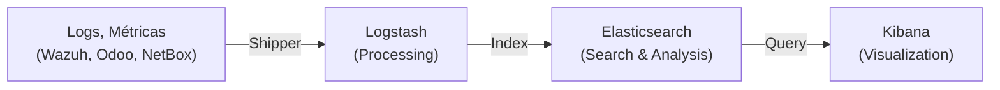

# Elastic/OpenSearch: Plataforma de Visualización y Análisis

> **AI Context**: Elastic (ELK Stack) y OpenSearch son plataformas de búsqueda, análisis y visualización en tiempo real. En la stack NEO, complementan el monitoreo con visualización avanzada de logs y métricas.

## Introducción

### ¿Qué es Elastic Stack (ELK)?

**Elastic Stack** (anteriormente ELK Stack) es una suite open-source compuesta por:

- **Elasticsearch**: Motor de búsqueda y análisis en tiempo real
- **Logstash**: Pipeline de procesamiento de datos
- **Kibana**: Visualización y exploración de datos
- **Beats**: Recolectores ligeros de datos



### ¿Qué es OpenSearch?

**OpenSearch** es el fork open-source de Elasticsearch (después de que Elastic cambió a licencia no-comercial en 2021):

| Aspecto | Elasticsearch | OpenSearch |
|---|---|---|
| **Licencia** | SSPL (no open-source puro) | AGPLv3 (100% open-source) |
| **Desarrollador** | Elastic (comercial) | Amazon/Comunidad |
| **Costo** | Gratis (community) | 100% gratis |
| **Compatibilidad** | Propietario | Compatible con ES 7.x |
| **Mejor para** | SaaS, Enterprise | On-premise, open-source |

**En la stack NEO usamos: OpenSearch** (por ser 100% open-source)

## Arquitectura Elastic/OpenSearch

### Componentes

```
┌────────────────────────────────────────┐
│          Fuentes de Datos              │
│  (Wazuh, Odoo, NetBox, Prometheus)    │
└────────────┬─────────────────────────┘
             │
             ↓
┌────────────────────────────────────────┐
│  Recolección y Procesamiento           │
│  (Beats, Logstash, Fluentd)           │
└────────────┬─────────────────────────┘
             │
             ↓
┌────────────────────────────────────────┐
│  Almacenamiento y Búsqueda            │
│  (Elasticsearch/OpenSearch)           │
│  - Indexación                         │
│  - Análisis full-text                 │
│  - Agregaciones                       │
└────────────┬─────────────────────────┘
             │
             ↓
┌────────────────────────────────────────┐
│  Visualización y Análisis             │
│  (Kibana / OpenSearch Dashboards)    │
│  - Dashboards                         │
│  - Alertas                            │
│  - Reportes                           │
└────────────────────────────────────────┘
```

## Caso de Uso en la Stack NEO

### Problema Resuelto

Sin Elastic/OpenSearch:
- Logs dispersos en múltiples servicios
- Difícil correlacionar eventos
- Sin visualización histórica
- Compliance/auditoría manual

**Con Elastic/OpenSearch**:
- Centralización de logs
- Correlación automática
- Dashboards en tiempo real
- Auditoría y compliance completo

### Flujo Típico

```
1. Wazuh genera 10.000 alertas/día
   ↓
2. Filebeat recolecta logs de Wazuh
   ↓
3. Logstash procesa y enriquece
   ↓
4. OpenSearch indexa todo
   ↓
5. Kibana muestra en dashboard
   ↓
6. Analista visualiza patrones
```

## OpenSearch vs Wazuh Dashboard

| Aspecto | OpenSearch | Wazuh Dashboard |
|---|---|---|
| **Alcance** | SIEM + logs generales | Solo Wazuh |
| **Fuente datos** | Múltiples | Solo Wazuh |
| **Customización** | Altísima | Media |
| **Complejidad** | Media | Baja |
| **Cuándo usar** | Stack completa | Solo monitorear Wazuh |

## Próximos Pasos

- [Setup OpenSearch →](setup.md)
- [Integración Wazuh →](wazuh-integration.md)
- [Dashboards →](dashboards.md)
- [Alertas →](alerting.md)

---

**Documentación**: Stack NEO_NETBOX_ODOO | **Versión**: 1.0 | **Fecha**: Diciembre 2024
