# Introducción a MISP

## ¿Qué es MISP?

**MISP** (Malware Information Sharing Platform) es una plataforma de código abierto diseñada para mejorar el intercambio de información sobre amenazas (Threat Intelligence) entre organizaciones, equipos de respuesta a incidentes, analistas de seguridad y comunidades de ciberseguridad.

!!! info "Definición"
    MISP es más que una simple base de datos de indicadores de compromiso (IOCs). Es un ecosistema completo que permite recopilar, almacenar, correlacionar, compartir y actuar sobre información de amenazas cibernéticas de manera estructurada y estandarizada.

### Características Principales

- **Almacenamiento Estructurado**: Gestión de IOCs, malware, campañas de amenazas y actores
- **Correlación Automática**: Identifica relaciones entre amenazas y eventos
- **Compartir Inteligente**: Control granular sobre qué información se comparte y con quién
- **Integración Extensiva**: APIs, feeds, formatos estándar (STIX, MITRE ATT&CK)
- **Colaboración**: Propuestas, comentarios, taxonomías y galaxias compartidas
- **Código Abierto**: Desarrollo activo, comunidad global, sin costos de licencia

## Historia y Desarrollo

MISP fue desarrollado originalmente en **2012** por el **CIRCL** (Computer Incident Response Center Luxembourg) en colaboración con el programa de ciberseguridad de la Comisión Europea (CERT-EU).

### Cronología

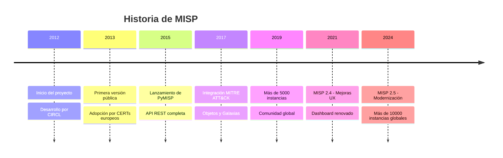

### Por Qué MISP es Importante

!!! success "Casos de Éxito"
    - **NATO**: Uso interno para compartir TI entre países miembros
    - **Interpol**: Coordina amenazas cibernéticas globales
    - **Bancos Centrales**: Comparten información sobre fraudes financieros
    - **ISACs**: Sectores industriales usan MISP para protección colectiva

## ¿Por Qué Threat Intelligence es Crítica?

### El Problema: Amenazas Cada Vez Más Sofisticadas

Los atacantes modernos operan de manera organizada, con recursos significativos y ataques persistentes. Una organización actuando sola tiene visibilidad limitada.

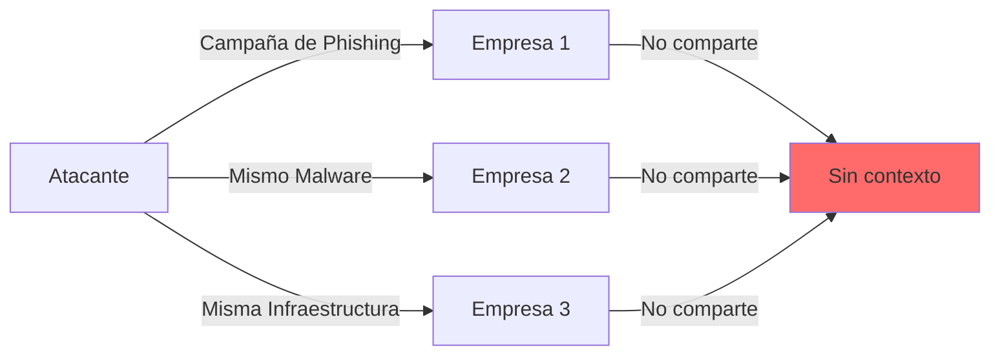

### La Solución: Inteligencia Compartida

Cuando las organizaciones comparten información sobre amenazas, todas se benefician de una defensa colectiva.

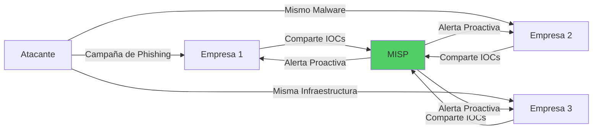

### Beneficios de Threat Intelligence

| Beneficio | Descripción |
|-----------|-------------|
| **Detección Temprana** | Identificar amenazas antes de que afecten la organización |
| **Contexto Enriquecido** | Comprender el quién, qué, cuándo, dónde y por qué de un ataque |
| **Respuesta Acelerada** | Actuar rápidamente con información precisa |
| **Defensa Proactiva** | Bloquear amenazas conocidas automáticamente |
| **Reducción de Costos** | Menos incidentes = menos costos de recuperación |
| **Colaboración** | Aprender de las experiencias de otros |

## Conceptos Fundamentales de MISP

### 1. Events (Eventos)

Un **Event** es el contenedor principal en MISP. Representa un incidente, campaña, malware o conjunto relacionado de información de amenazas.

!!! example "Ejemplos de Events"
    - Campaña de phishing dirigida a sector financiero
    - Análisis de muestra de ransomware
    - Ataque APT con múltiples vectores
    - Campaña de malvertising

#### Estructura de un Event

```yaml
Event:
  id: 12345
  info: "Campaña Emotet - Diciembre 2024"
  date: "2024-12-05"
  threat_level_id: 1  # High
  analysis: 2         # Completed
  distribution: 3     # All communities
  org_id: 1
  orgc_id: 1
  attributes: [...]   # Lista de IOCs
  objects: [...]      # Estructuras complejas
  tags: [...]         # Clasificaciones
```

#### Niveles de Análisis

| Nivel | Nombre | Descripción |
|-------|--------|-------------|
| 0 | Initial | Evento recién creado, análisis pendiente |
| 1 | Ongoing | Análisis en progreso |
| 2 | Completed | Análisis completado |

#### Niveles de Amenaza

| Nivel | Color | Significado |
|-------|-------|-------------|
| 1 | 🔴 High | Amenaza crítica, acción inmediata |
| 2 | 🟠 Medium | Amenaza moderada, atención requerida |
| 3 | 🟡 Low | Amenaza baja, monitoreo |
| 4 | ⚪ Undefined | Sin clasificar |

### 2. Attributes (Atributos)

Los **Attributes** son los indicadores individuales de compromiso (IOCs) dentro de un Event.

#### Tipos de Attributes

=== "Network"
    - `ip-src` / `ip-dst`: Direcciones IP
    - `domain`: Nombres de dominio
    - `hostname`: Nombres de host
    - `url`: URLs completas
    - `email-src` / `email-dst`: Direcciones de correo
    - `AS`: Números de sistema autónomo

=== "File"
    - `md5` / `sha1` / `sha256`: Hashes de archivos
    - `filename`: Nombres de archivo
    - `size-in-bytes`: Tamaño de archivo
    - `ssdeep`: Fuzzy hash

=== "Malware"
    - `malware-sample`: Muestra de malware
    - `mutex`: Mutex utilizado por malware
    - `yara`: Regla YARA
    - `pattern-in-file`: Patrón encontrado

=== "Other"
    - `comment`: Comentario o nota
    - `text`: Texto libre
    - `vulnerability`: CVE o vulnerabilidad
    - `campaign-name`: Nombre de campaña

#### Ejemplo de Attributes

```json
{
  "type": "ip-dst",
  "category": "Network activity",
  "value": "192.0.2.100",
  "to_ids": true,
  "comment": "C2 server for Emotet campaign",
  "distribution": 3,
  "tags": ["tlp:white", "malware:emotet"]
}
```

#### Flags Importantes

- **to_ids**: ¿Este atributo debe usarse para detección automática? (IDS rules)
- **distribution**: Nivel de compartir del atributo
- **disable_correlation**: Deshabilitar correlación automática

### 3. Objects (Objetos)

Los **Objects** son estructuras complejas que agrupan múltiples attributes relacionados de manera lógica.

#### Tipos de Objects Comunes

=== "file"
    Representa un archivo con todos sus metadatos
    ```yaml
    Object: file
      - filename: "invoice.doc"
      - md5: "5d41402abc4b2a76b9719d911017c592"
      - sha1: "aaf4c61ddcc5e8a2dabede0f3b482cd9aea9434d"
      - sha256: "2c26b46b68ffc68ff99b453c1d30413413422d70..."
      - size-in-bytes: 245760
    ```

=== "network-connection"
    Representa una conexión de red
    ```yaml
    Object: network-connection
      - ip-src: "10.0.0.50"
      - ip-dst: "192.0.2.100"
      - dst-port: 443
      - protocol: "tcp"
      - first-packet-seen: "2024-12-05T10:30:00Z"
    ```

=== "email"
    Representa un correo electrónico
    ```yaml
    Object: email
      - from: "attacker@evil.com"
      - to: "victim@company.com"
      - subject: "Urgent: Invoice Payment Required"
      - attachment: "invoice.zip"
      - reply-to: "payment@phishing.com"
    ```

=== "person"
    Representa un individuo (actor de amenaza)
    ```yaml
    Object: person
      - first-name: "John"
      - last-name: "Hacker"
      - alias: "DarkCoder"
      - nationality: "Unknown"
    ```

#### Ventajas de Objects

!!! success "Beneficios"
    - **Contexto**: Información relacionada agrupada lógicamente
    - **Reutilización**: Templates estandarizados
    - **Correlación**: Relaciones entre objects
    - **Claridad**: Estructura de datos clara

### 4. Galaxies (Galaxias)

Las **Galaxies** son colecciones de conocimiento estructurado sobre amenazas. Proporcionan contexto adicional mediante frameworks y taxonomías establecidas.

#### MITRE ATT&CK

La integración más importante es con **MITRE ATT&CK**, el framework global de tácticas y técnicas de adversarios.

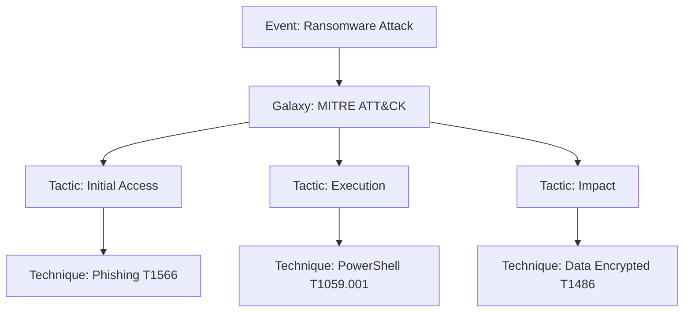

#### Otras Galaxies Importantes

=== "Threat Actors"
    Grupos conocidos de amenazas
    ```
    - APT1, APT28, APT29
    - Lazarus Group
    - FIN7, FIN8
    - DarkSide, REvil
    ```

=== "Malware Families"
    Familias de malware conocidas
    ```
    - Emotet
    - TrickBot
    - Cobalt Strike
    - Mimikatz
    ```

=== "Tools"
    Herramientas utilizadas por atacantes
    ```
    - Metasploit
    - Empire
    - BloodHound
    - Nmap
    ```

=== "Sectors"
    Sectores objetivo
    ```
    - Financial
    - Healthcare
    - Government
    - Energy
    ```

#### Ejemplo de Uso

```json
{
  "event_id": 12345,
  "galaxy": "mitre-attack-pattern",
  "cluster": {
    "value": "Spearphishing Attachment - T1566.001",
    "description": "Adversaries may send spearphishing emails with a malicious attachment...",
    "meta": {
      "kill_chain": ["initial-access"],
      "mitre_platforms": ["Linux", "macOS", "Windows"]
    }
  }
}
```

### 5. Taxonomies (Taxonomías)

Las **Taxonomies** son esquemas de clasificación estandarizados que permiten etiquetar y categorizar información de manera consistente.

#### Taxonomías Principales

=== "TLP (Traffic Light Protocol)"
    Control de compartir información

    | Tag | Significado | Uso |
    |-----|-------------|-----|
    | `tlp:red` | No compartir | Uso interno exclusivo |
    | `tlp:amber` | Compartir limitado | Solo comunidad específica |
    | `tlp:green` | Compartir comunidad | Sector o grupo cerrado |
    | `tlp:white` | Compartir público | Sin restricciones |

=== "PAP (Permissible Actions Protocol)"
    Qué acciones se pueden tomar

    | Tag | Significado |
    |-----|-------------|
    | `pap:red` | No usar en sistemas automáticos |
    | `pap:amber` | Usar con precaución |
    | `pap:green` | Usar con sistemas automáticos |
    | `pap:white` | Usar sin restricciones |

=== "Confidence Level"
    Nivel de confianza en la información
    ```
    - admiralty-scale:a (Confirmed)
    - admiralty-scale:b (Probably True)
    - admiralty-scale:c (Possibly True)
    - admiralty-scale:d (Doubtful)
    ```

=== "Adversary"
    Clasificación de adversarios
    ```
    - adversary:infrastructure-state
    - adversary:infrastructure-financial
    - adversary:infrastructure-criminal
    - adversary:infrastructure-hacker
    ```

#### Aplicación de Tags

```python
# Ejemplo de event bien etiquetado
Event: "Phishing Campaign Q4 2024"
Tags:
  - tlp:amber                    # Compartir con comunidad
  - pap:green                    # Puede usarse en automatización
  - admiralty-scale:b            # Probablemente cierto
  - type:OSINT                   # Fuente abierta
  - workflow:complete            # Análisis completado
  - misp-galaxy:threat-actor="FIN7"  # Actor conocido
```

### 6. Warninglists (Listas de Advertencia)

Las **Warninglists** son listas de valores que deben tratarse con precaución porque pueden generar falsos positivos.

#### Tipos de Warninglists

!!! warning "Ejemplos de Warninglists"

    === "IPs Legítimas"
        - Servidores de Google, Microsoft, Amazon
        - Servicios de CDN (Cloudflare, Akamai)
        - Servicios públicos de DNS

    === "Dominios Comunes"
        - Alexa Top 1000
        - Servicios populares (facebook.com, twitter.com)
        - Proveedores de email (gmail.com, outlook.com)

    === "Hashes Conocidos"
        - Archivos del sistema Windows
        - Aplicaciones legítimas comunes
        - Bibliotecas estándar

    === "Rangos de IP"
        - RFC1918 (redes privadas)
        - Multicast
        - Documentación y ejemplos

#### Funcionamiento

Cuando un attribute coincide con una warninglist, MISP:

1. **Advierte** al usuario que podría ser un falso positivo
2. **No bloquea** la adición del atributo
3. **Marca visualmente** el atributo en la interfaz
4. **Registra** la coincidencia para análisis

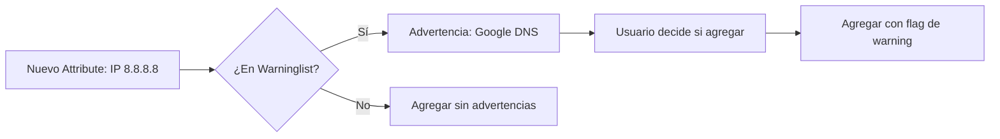

## Arquitectura de MISP

### Componentes Principales

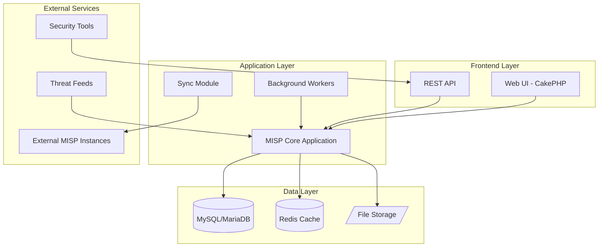

### Descripción de Componentes

#### 1. Frontend Layer

=== "Web UI"
    - Framework: **CakePHP**
    - Interface intuitiva para gestión de eventos
    - Dashboard con métricas y visualizaciones
    - Gestión de usuarios y organizaciones

=== "REST API"
    - API RESTful completa
    - Autenticación por API Key
    - Soporte para PyMISP (biblioteca Python)
    - Documentación interactiva

#### 2. Application Layer

=== "MISP Core"
    - Lógica de negocio principal
    - Gestión de events, attributes, objects
    - Motor de correlación
    - Control de acceso y permisos

=== "Background Workers"
    - Procesamiento asíncrono de tareas
    - Importación de feeds
    - Exportaciones pesadas
    - Envío de emails y notificaciones

=== "Sync Module"
    - Sincronización con otras instancias MISP
    - Push/Pull de eventos
    - Filtrado inteligente
    - Manejo de conflictos

#### 3. Data Layer

=== "MySQL/MariaDB"
    - Base de datos principal
    - Almacena events, attributes, users
    - Índices optimizados para correlación

=== "Redis"
    - Cache de sesiones
    - Cola de trabajos (job queue)
    - Cache de resultados de búsqueda

=== "File Storage"
    - Almacenamiento de attachments
    - Muestras de malware (encriptadas)
    - Exportaciones generadas

### Flujo de Datos

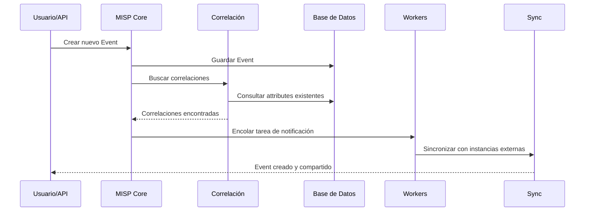

## Comunidad y Sharing Groups

### Filosofía de Compartir

MISP se basa en el principio de **"compartir es cuidar"** (sharing is caring), pero con controles granulares sobre quién ve qué.

!!! quote "Principios de Compartir"
    1. **Trust but Verify**: Confiar en la comunidad pero verificar la calidad
    2. **Give and Take**: Contribuir tanto como se consume
    3. **Privacy First**: Respetar la privacidad y sensibilidad de los datos
    4. **Quality over Quantity**: Mejor información precisa que volumen

### Niveles de Distribución

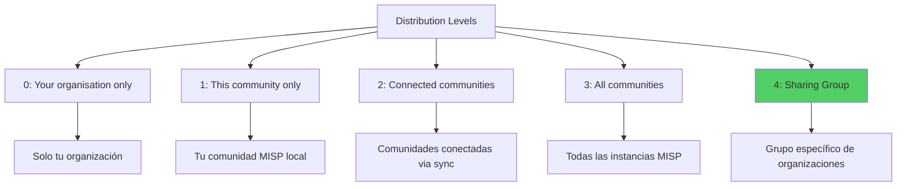

### Sharing Groups

Los **Sharing Groups** permiten crear grupos específicos de organizaciones con las que compartir información selectivamente.

#### Ejemplo: ISAC Financiero

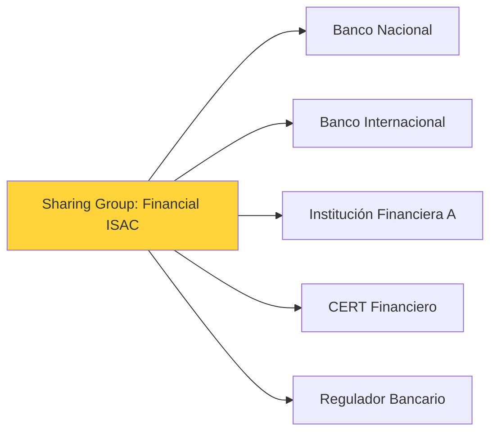

#### Caso de Uso

```yaml
Event: "Ataque dirigido a cajeros automáticos"
Distribution: Sharing Group
Sharing Group: "Financial ISAC Mexico"
Organizations:
  - Banco Santander Mexico
  - BBVA Mexico
  - Banorte
  - Citibanamex
  - CNBV (Regulador)
```

### Comunidades MISP Globales

=== "Geografías"
    - **MISP Project**: Comunidad global
    - **EU MISP Community**: Unión Europea
    - **US-CERT MISP**: Estados Unidos
    - **LATAM ISAC**: Latinoamérica

=== "Sectores"
    - **Financial ISAC**: Sector financiero
    - **Health ISAC**: Sector salud
    - **Energy ISAC**: Sector energético
    - **Telecom ISAC**: Telecomunicaciones

=== "Especializadas"
    - **Ransomware Tracking**: Seguimiento de ransomware
    - **APT Campaigns**: Amenazas persistentes avanzadas
    - **Botnet C2**: Servidores de comando y control
    - **Phishing Campaigns**: Campañas de phishing

## Por Qué Usar MISP en la Stack NEO_NETBOX_ODOO

### Integración con el Stack

MISP se integra perfectamente con el stack NEO_NETBOX_ODOO, proporcionando la capa de **Threat Intelligence** necesaria para una defensa completa.

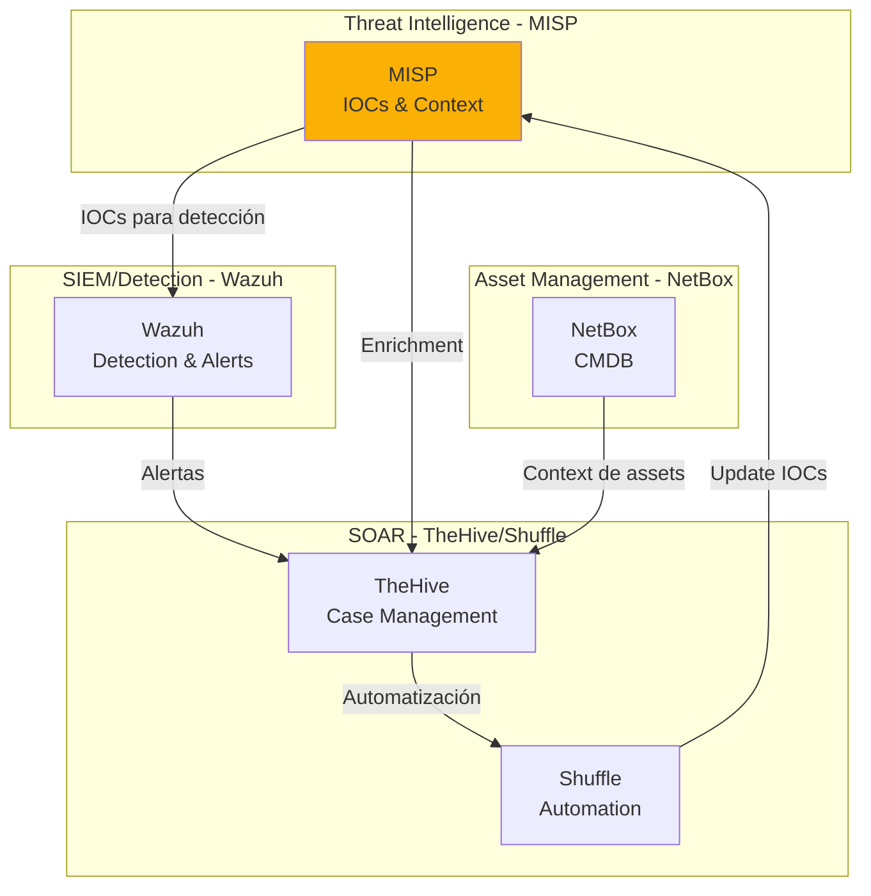

### Casos de Uso en el Stack

#### 1. Detección Proactiva con Wazuh

```yaml
Flujo:
  1. MISP recibe IOCs de campaña de phishing
  2. Exporta IOCs a Wazuh CDB lists automáticamente
  3. Wazuh crea reglas de detección dinámicas
  4. Tráfico bloqueado proactivamente

Beneficio:
  - Detección de amenazas antes del impacto
  - Actualización continua de reglas
```

#### 2. Enriquecimiento de Casos en TheHive

```yaml
Flujo:
  1. Wazuh genera alerta de IP sospechosa
  2. TheHive crea caso automáticamente
  3. Cortex consulta MISP por contexto de la IP
  4. Caso enriquecido con información de campañas relacionadas

Beneficio:
  - Analistas tienen contexto inmediato
  - Decisiones más informadas
```

#### 3. Automatización con Shuffle

```yaml
Flujo:
  1. MISP recibe event de nueva campaña de ransomware
  2. Webhook dispara playbook en Shuffle
  3. Shuffle actualiza firewalls, EDR, proxies
  4. Shuffle notifica a equipos relevantes
  5. Shuffle crea caso en TheHive si hay coincidencias

Beneficio:
  - Respuesta en segundos, no horas
  - Consistencia en la respuesta
```

### Ventajas Específicas

| Componente | Beneficio de Integrar MISP |
|------------|----------------------------|
| **Wazuh** | Detección basada en threat intelligence actualizada |
| **TheHive** | Casos con contexto rico desde el principio |
| **Cortex** | Analyzers de MISP para enrichment automático |
| **Shuffle** | Automatización guiada por inteligencia de amenazas |
| **NetBox** | Correlación de amenazas con assets específicos |

## Comparación con Otras Plataformas de TI

### MISP vs Alternativas

=== "MISP vs OpenCTI"

    | Aspecto | MISP | OpenCTI |
    |---------|------|---------|
    | **Enfoque** | Compartir IOCs | Knowledge graphs |
    | **Complejidad** | Media | Alta |
    | **Curva de aprendizaje** | Moderada | Empinada |
    | **Comunidad** | Muy grande | Creciente |
    | **Integración** | Excelente | Buena |
    | **STIX 2.x** | Soporte | Nativo |
    | **Mejor para** | Equipos SOC, ISACs | Threat analysts, CTI teams |

=== "MISP vs ThreatConnect"

    | Aspecto | MISP | ThreatConnect |
    |---------|------|---------------|
    | **Licencia** | Open Source | Commercial |
    | **Costo** | Gratis | $$$$ |
    | **Deployment** | Self-hosted | Cloud/On-prem |
    | **Personalización** | Total | Limitada |
    | **Soporte** | Comunidad | Empresarial |
    | **Mejor para** | Presupuesto limitado | Empresas grandes |

=== "MISP vs Anomali"

    | Aspecto | MISP | Anomali |
    |---------|------|---------|
    | **Modelo** | Auto-gestionado | Managed service |
    | **Control** | Total | Limitado |
    | **Feeds** | Configurables | Integrados |
    | **Análisis** | Manual + Scripts | Machine learning |
    | **Escalabilidad** | DIY | Enterprise-grade |
    | **Mejor para** | Control y flexibilidad | Facilidad de uso |

### ¿Cuándo Elegir MISP?

!!! success "MISP es Ideal Para:"
    - ✅ Organizaciones que quieren control total sobre sus datos
    - ✅ Equipos con experiencia técnica para gestionar la plataforma
    - ✅ Comunidades que necesitan compartir información entre miembros
    - ✅ Presupuestos limitados (open source)
    - ✅ Necesidad de personalización extrema
    - ✅ Integración con múltiples herramientas de seguridad
    - ✅ Participación en comunidades ISAC/CERT

!!! warning "MISP Puede No Ser Ideal Para:"
    - ❌ Organizaciones sin recursos técnicos para mantenerlo
    - ❌ Equipos que prefieren soluciones totalmente gestionadas
    - ❌ Necesidad de soporte 24/7 garantizado
    - ❌ Análisis avanzado de TI sin programación

## Arquitectura Técnica Detallada

### Stack Tecnológico

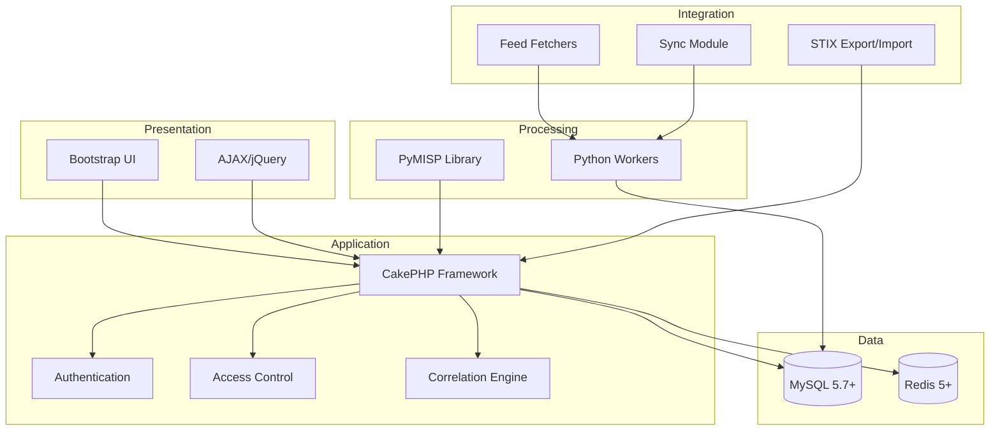

### Requisitos de Sistema

#### Mínimos

```yaml
CPU: 2 cores
RAM: 4 GB
Disco: 50 GB
OS: Ubuntu 20.04+ / Debian 11+ / RHEL 8+
```

#### Recomendados

```yaml
CPU: 4+ cores
RAM: 8+ GB
Disco: 100+ GB SSD
OS: Ubuntu 22.04 LTS
Load Balancer: Nginx/Apache
```

#### Producción (Alta Disponibilidad)

```yaml
Frontend: 2+ servidores con Load Balancer
Workers: 3+ servidores dedicados
Database: MySQL cluster con replicación
Cache: Redis cluster
Disco: 500+ GB SSD con backup automático
```

### Modelo de Datos

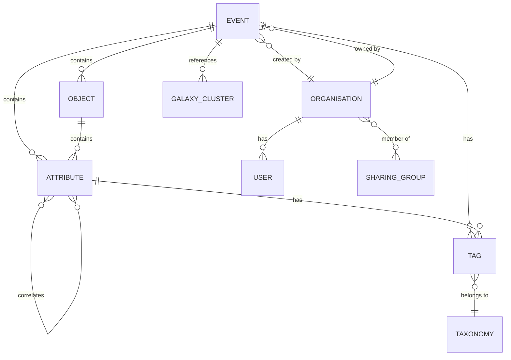

### Flujos de Correlación

La correlación automática es una de las características más poderosas de MISP.

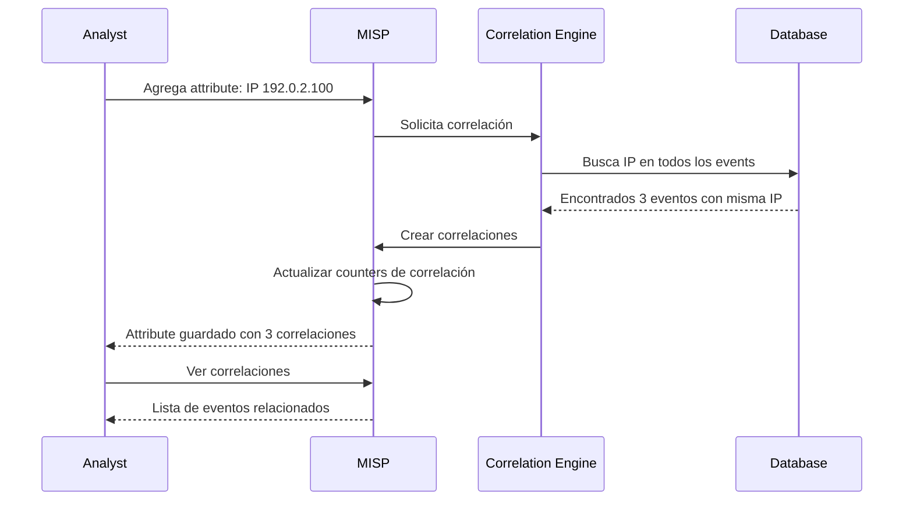

#### Tipos de Correlación

| Tipo | Descripción | Ejemplo |
|------|-------------|---------|
| **Exact Match** | Valor idéntico | IP 192.0.2.100 en múltiples events |
| **Fuzzy Hash** | ssdeep similarity | Archivos similares pero no idénticos |
| **CIDR Block** | Rango de IPs | 192.0.2.0/24 correlaciona con IPs individuales |

## Seguridad y Privacidad en MISP

### Controles de Acceso

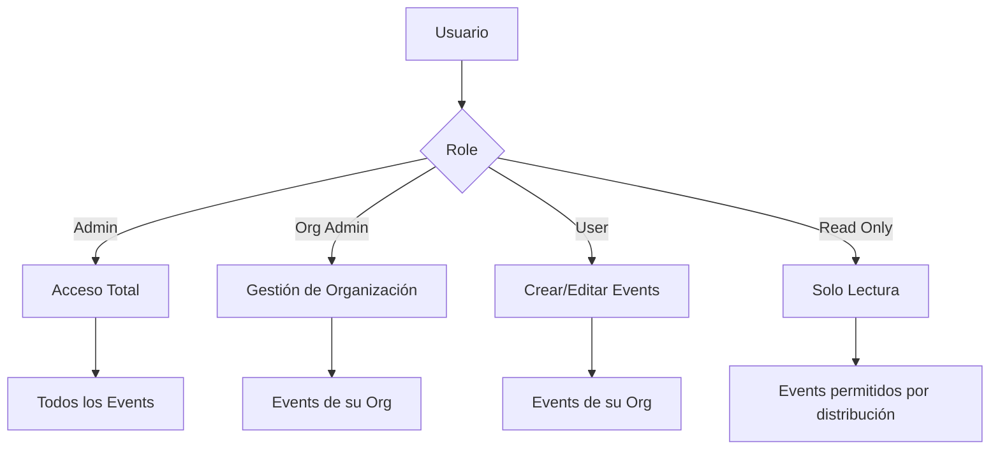

### Encriptación

- **In Transit**: TLS 1.2+ obligatorio para todas las comunicaciones
- **At Rest**: Attachments y malware samples encriptados con GPG
- **API Keys**: Hashed con bcrypt en base de datos

### Auditoría

Todos los cambios son registrados:

```yaml
Audit Log:
  - Quién hizo el cambio
  - Qué cambió (antes/después)
  - Cuándo (timestamp)
  - Desde dónde (IP address)
  - Por qué (si se proporciona comment)
```

### Cumplimiento

MISP ayuda con regulaciones:

- **GDPR**: Anonimización de datos personales
- **NIS2**: Compartir información de incidentes
- **ISO 27001**: Gestión de amenazas
- **NIST CSF**: Threat intelligence framework

## Primeros Pasos

### Instalación Rápida

Para empezar con MISP en el stack NEO_NETBOX_ODOO:

```bash
# Ver documentación completa de instalación
cd docs/es/advanced-expansion/misp/
cat setup.md
```

### Recursos Recomendados

!!! info "Recursos de Aprendizaje"

    === "Documentación Oficial"
        - [MISP Book](https://www.misp-project.org/book/) - Guía completa
        - [MISP GitHub](https://github.com/MISP/MISP) - Código fuente
        - [MISP Galaxy](https://www.misp-project.org/galaxy.html) - Galaxias disponibles

    === "Comunidad"
        - [MISP Gitter](https://gitter.im/MISP/MISP) - Chat de la comunidad
        - [MISP Mailing List](https://www.misp-project.org/community/) - Lista de correo
        - [MISP Twitter](https://twitter.com/MISPProject) - Actualizaciones

    === "Feeds Gratuitos"
        - [CIRCL OSINT Feeds](https://www.circl.lu/doc/misp/feed-osint/)
        - [Abuse.ch](https://abuse.ch/) - URLhaus, Feodo Tracker
        - [AlienVault OTX](https://otx.alienvault.com/)

### Siguiente Lectura

1. **[Setup y Configuración](setup.md)** - Instalar MISP paso a paso
2. **[Gestión de Threat Intelligence](threat-intelligence.md)** - Crear events y trabajar con IOCs
3. **[Compartir y Comunidad](sharing.md)** - Configurar sharing groups y sync
4. **[Integración con Stack](integration-stack.md)** - Conectar con Wazuh, TheHive, etc.

---

!!! tip "Consejo Final"
    MISP es poderoso pero requiere compromiso. Empieza pequeño: instala, familiarízate con la interfaz, crea algunos events de prueba. Luego, integra con Wazuh para ver el valor real. La comunidad MISP es muy activa y siempre dispuesta a ayudar.

**¡Bienvenido al mundo de la Threat Intelligence compartida!** 🎯
