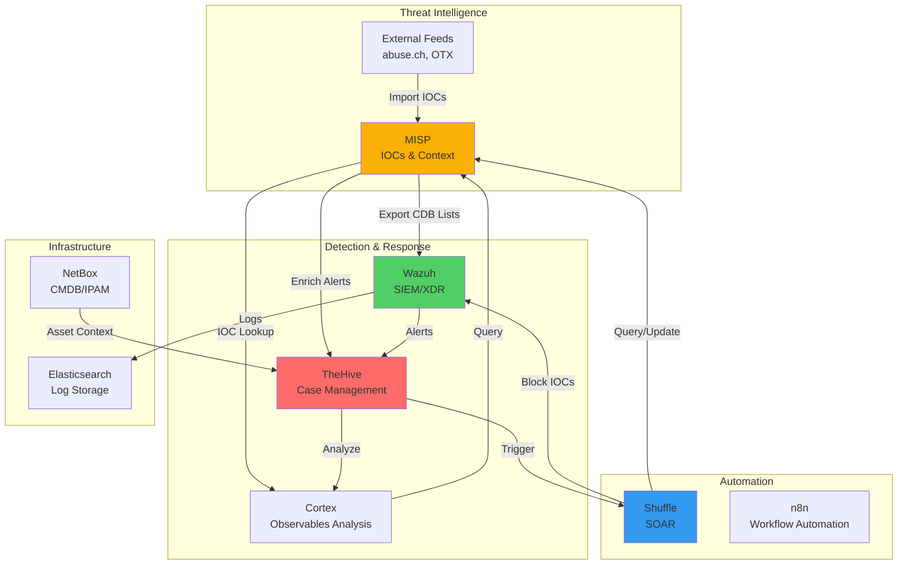
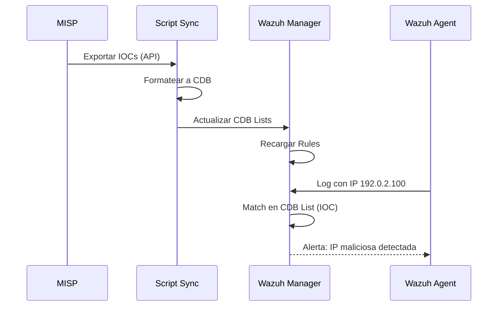
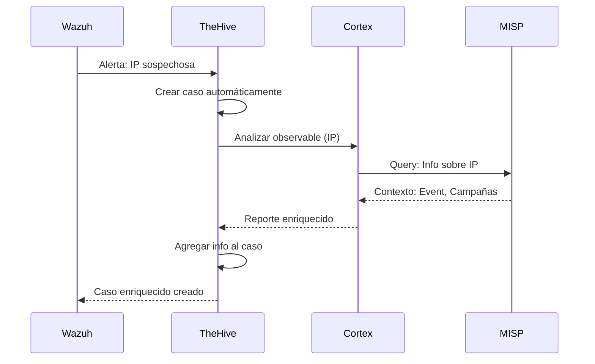
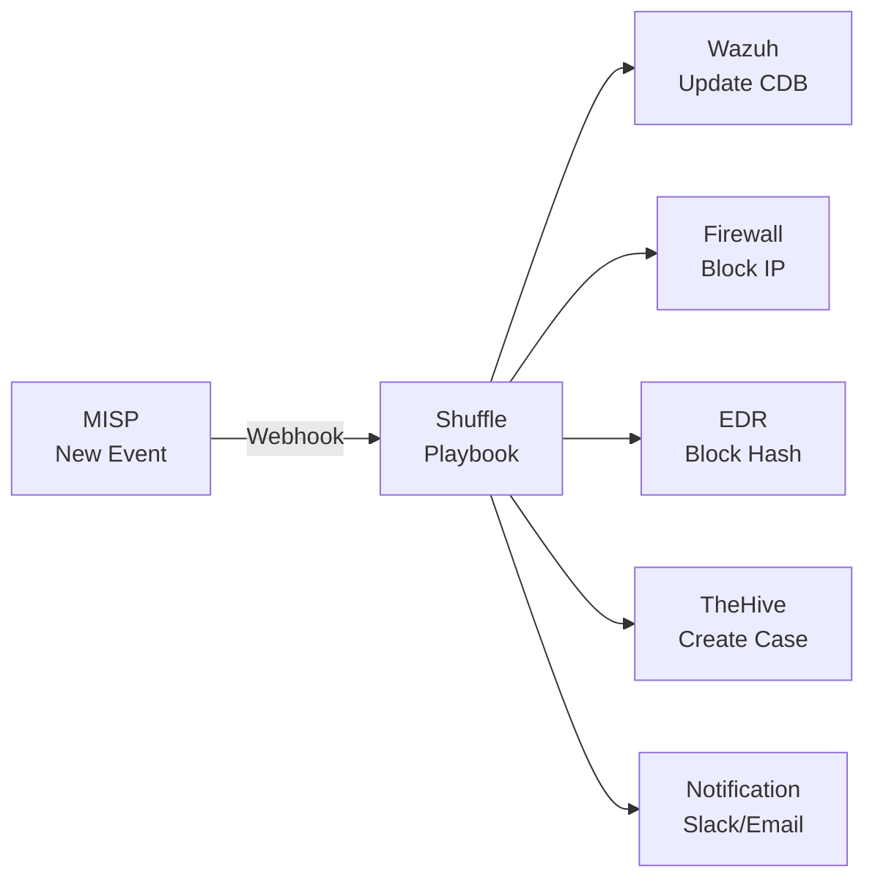
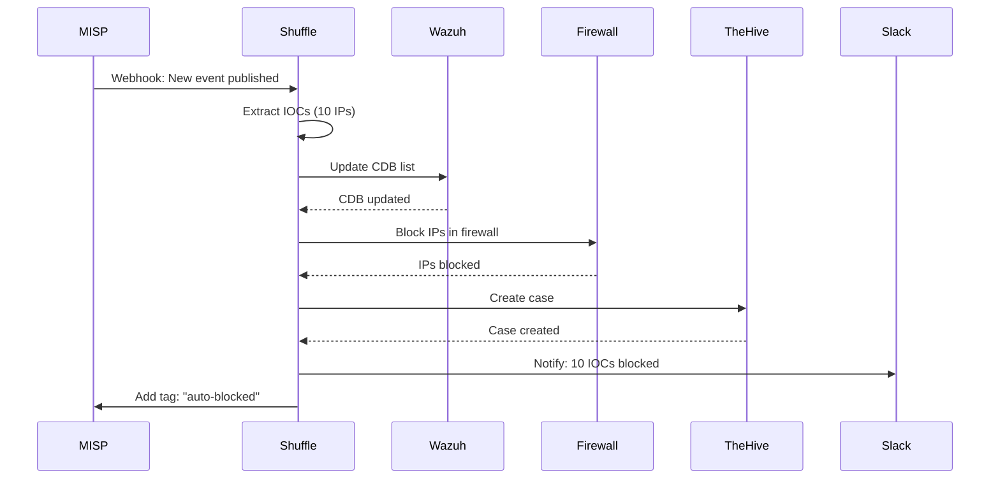
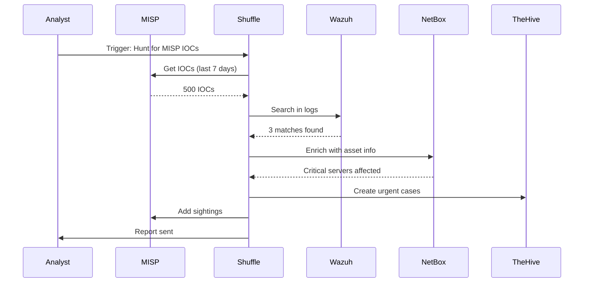
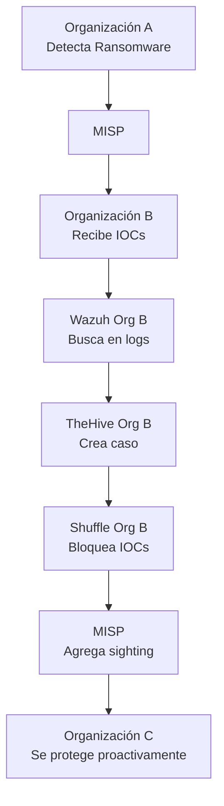

# Integración de MISP con el Stack NEO_NETBOX_ODOO

## Introducción

MISP se integra perfectamente con los demás componentes del stack NEO_NETBOX_ODOO para crear un **ecosistema completo de ciberseguridad**. Esta guía detalla cómo conectar MISP con Wazuh, TheHive, Cortex, Shuffle y otros componentes.

!!! info "Objetivo"
    Crear un flujo automatizado donde:
    - MISP proporciona threat intelligence
    - Wazuh detecta amenazas usando IOCs de MISP
    - TheHive gestiona incidentes enriquecidos con MISP
    - Shuffle automatiza respuestas basadas en MISP
    - NetBox proporciona contexto de assets

## Arquitectura de Integración Completa



## MISP ↔ Wazuh: Detección Basada en Threat Intelligence

### Objetivo

Exportar IOCs de MISP a Wazuh para detección automática en logs, tráfico de red y eventos de seguridad.

### Arquitectura de Integración



### Paso 1: Script de Exportación de IOCs

Crear script que exporta IOCs de MISP a formato Wazuh CDB:

```python
#!/usr/bin/env python3
# Archivo: /opt/scripts/misp_to_wazuh.py

import sys
from pymisp import PyMISP
import json
from datetime import datetime, timedelta

# Configuración MISP
MISP_URL = 'https://misp.tu-empresa.com'
MISP_KEY = 'TU_API_KEY_AQUI'
MISP_VERIFY_CERT = True

# Configuración Wazuh
WAZUH_CDB_DIR = '/var/ossec/etc/lists'
CDB_FILES = {
    'ip-dst': f'{WAZUH_CDB_DIR}/misp-ip-blacklist',
    'domain': f'{WAZUH_CDB_DIR}/misp-domain-blacklist',
    'url': f'{WAZUH_CDB_DIR}/misp-url-blacklist',
    'md5': f'{WAZUH_CDB_DIR}/misp-hash-md5',
    'sha1': f'{WAZUH_CDB_DIR}/misp-hash-sha1',
    'sha256': f'{WAZUH_CDB_DIR}/misp-hash-sha256',
}

def get_misp_iocs(days=7):
    """Obtener IOCs de MISP de los últimos N días"""
    misp = PyMISP(MISP_URL, MISP_KEY, MISP_VERIFY_CERT)

    # Fecha desde
    date_from = (datetime.now() - timedelta(days=days)).strftime('%Y-%m-%d')

    # Buscar attributes con to_ids=True
    result = misp.search(
        controller='attributes',
        type_attribute=['ip-dst', 'domain', 'url', 'md5', 'sha1', 'sha256'],
        to_ids=1,  # Solo IOCs para detección
        date_from=date_from,
        published=True,
        pythonify=True
    )

    return result

def format_cdb(iocs_by_type):
    """Formatear IOCs al formato CDB de Wazuh"""
    cdb_data = {}

    for ioc_type, iocs in iocs_by_type.items():
        lines = []
        for ioc in iocs:
            # Formato CDB: valor:descripción
            value = ioc['value']
            comment = ioc.get('comment', 'MISP IOC')
            event_info = ioc.get('Event', {}).get('info', 'Unknown event')

            # Sanitizar para CDB (sin : ni \n)
            value = value.replace(':', '_').replace('\n', ' ')
            description = f"MISP: {event_info} - {comment}"[:200]
            description = description.replace(':', ' ').replace('\n', ' ')

            lines.append(f"{value}:{description}")

        cdb_data[ioc_type] = '\n'.join(lines)

    return cdb_data

def write_cdb_files(cdb_data):
    """Escribir archivos CDB"""
    for ioc_type, content in cdb_data.items():
        if ioc_type in CDB_FILES:
            filepath = CDB_FILES[ioc_type]
            try:
                with open(filepath, 'w') as f:
                    f.write(content)
                print(f"✅ {ioc_type}: {len(content.splitlines())} IOCs escritos a {filepath}")
            except Exception as e:
                print(f"❌ Error escribiendo {filepath}: {e}", file=sys.stderr)

def main():
    print(f"=== MISP to Wazuh Sync - {datetime.now()} ===")

    # Obtener IOCs
    print("Obteniendo IOCs de MISP...")
    iocs = get_misp_iocs(days=7)

    # Agrupar por tipo
    iocs_by_type = {}
    for ioc in iocs:
        ioc_type = ioc['type']
        if ioc_type not in iocs_by_type:
            iocs_by_type[ioc_type] = []
        iocs_by_type[ioc_type].append(ioc)

    print(f"Total IOCs obtenidos: {len(iocs)}")
    for ioc_type, ioc_list in iocs_by_type.items():
        print(f"  - {ioc_type}: {len(ioc_list)}")

    # Formatear a CDB
    print("\nFormateando a CDB...")
    cdb_data = format_cdb(iocs_by_type)

    # Escribir archivos
    print("\nEscribiendo archivos CDB...")
    write_cdb_files(cdb_data)

    print("\n✅ Sync completado")

if __name__ == '__main__':
    main()
```

### Paso 2: Configurar CDB Lists en Wazuh

Editar `/var/ossec/etc/ossec.conf`:

```xml
<ossec_config>
  <ruleset>
    <!-- CDB Lists de MISP -->
    <list>etc/lists/misp-ip-blacklist</list>
    <list>etc/lists/misp-domain-blacklist</list>
    <list>etc/lists/misp-url-blacklist</list>
    <list>etc/lists/misp-hash-md5</list>
    <list>etc/lists/misp-hash-sha1</list>
    <list>etc/lists/misp-hash-sha256</list>
  </ruleset>
</ossec_config>
```

### Paso 3: Crear Reglas Wazuh para IOCs de MISP

Crear `/var/ossec/etc/rules/misp_ioc_rules.xml`:

```xml
<!-- MISP IOC Detection Rules -->
<group name="misp,threat_intelligence,">

  <!-- IP en blacklist de MISP -->
  <rule id="100100" level="10">
    <if_matched_cdb>etc/lists/misp-ip-blacklist</if_matched_cdb>
    <description>IP maliciosa detectada en blacklist de MISP: $(misp-ip-blacklist)</description>
    <mitre>
      <id>T1071</id>
    </mitre>
  </rule>

  <!-- Dominio en blacklist de MISP -->
  <rule id="100101" level="10">
    <if_matched_cdb>etc/lists/misp-domain-blacklist</if_matched_cdb>
    <description>Dominio malicioso detectado en blacklist de MISP: $(misp-domain-blacklist)</description>
    <mitre>
      <id>T1071</id>
    </mitre>
  </rule>

  <!-- URL en blacklist de MISP -->
  <rule id="100102" level="10">
    <if_matched_cdb>etc/lists/misp-url-blacklist</if_matched_cdb>
    <description>URL maliciosa detectada en blacklist de MISP: $(misp-url-blacklist)</description>
    <mitre>
      <id>T1071</id>
    </mitre>
  </rule>

  <!-- Hash MD5 en blacklist de MISP -->
  <rule id="100103" level="12">
    <if_matched_cdb>etc/lists/misp-hash-md5</if_matched_cdb>
    <description>Archivo malicioso detectado (MD5) en blacklist de MISP: $(misp-hash-md5)</description>
    <mitre>
      <id>T1204</id>
    </mitre>
  </rule>

  <!-- Hash SHA256 en blacklist de MISP -->
  <rule id="100104" level="12">
    <if_matched_cdb>etc/lists/misp-hash-sha256</if_matched_cdb>
    <description>Archivo malicioso detectado (SHA256) en blacklist de MISP: $(misp-hash-sha256)</description>
    <mitre>
      <id>T1204</id>
    </mitre>
  </rule>

</group>
```

### Paso 4: Automatizar Sync

Configurar cron para ejecutar cada 6 horas:

```bash
# Crear wrapper script
cat > /opt/scripts/misp_wazuh_sync.sh << 'EOF'
#!/bin/bash
# Sync MISP IOCs to Wazuh

# Ejecutar sync
/usr/bin/python3 /opt/scripts/misp_to_wazuh.py >> /var/log/misp-wazuh-sync.log 2>&1

# Reiniciar Wazuh para cargar CDB lists
systemctl restart wazuh-manager

# Log
echo "$(date): Wazuh CDB lists actualizadas desde MISP" >> /var/log/misp-wazuh-sync.log
EOF

chmod +x /opt/scripts/misp_wazuh_sync.sh

# Agregar a cron (cada 6 horas)
(crontab -l 2>/dev/null; echo "0 */6 * * * /opt/scripts/misp_wazuh_sync.sh") | crontab -
```

### Paso 5: Test de Detección

```bash
# Generar alerta de prueba con IP de MISP
logger "Connection to malicious IP 192.0.2.100 detected"

# Verificar alerta en Wazuh
tail -f /var/ossec/logs/alerts/alerts.json | grep "192.0.2.100"
```

## MISP ↔ TheHive: Enriquecimiento de Casos

### Objetivo

Enriquecer casos de TheHive con información de contexto de MISP automáticamente.

### Arquitectura



### Paso 1: Configurar Cortex Analyzer para MISP

En Cortex, habilitar analyzer **MISP**:

1. **Organization → Analyzers → MISP_2_1**

2. **Configurar**:
    ```json
    {
      "name": "MISP_2_1",
      "url": "https://misp.tu-empresa.com",
      "key": "TU_API_KEY_AQUI",
      "certpath": "/path/to/cert.pem",
      "certverify": true
    }
    ```

3. **Enable** analyzer

### Paso 2: Configurar Responder de MISP en Cortex

Para crear events en MISP desde TheHive:

1. **Organization → Responders → MISP_2_1**

2. **Configurar**:
    ```json
    {
      "url": "https://misp.tu-empresa.com",
      "key": "TU_API_KEY_AQUI",
      "certverify": true
    }
    ```

### Paso 3: Workflow en TheHive

#### Caso Automático desde Wazuh

Configurar webhook en Wazuh para crear casos en TheHive con observables:

```python
#!/usr/bin/env python3
# Archivo: /var/ossec/integrations/custom-thehive.py

import sys
import json
import requests
from datetime import datetime

# Configuración TheHive
THEHIVE_URL = 'https://thehive.tu-empresa.com'
THEHIVE_API_KEY = 'TU_API_KEY_AQUI'

def create_case(alert_data):
    """Crear caso en TheHive desde alerta Wazuh"""

    # Extraer información
    rule_description = alert_data.get('rule', {}).get('description', 'Unknown')
    agent_name = alert_data.get('agent', {}).get('name', 'Unknown')
    timestamp = alert_data.get('timestamp', datetime.now().isoformat())

    # Extraer observables
    observables = []

    # IP de origen
    if 'data' in alert_data and 'srcip' in alert_data['data']:
        observables.append({
            'dataType': 'ip',
            'data': alert_data['data']['srcip'],
            'tlp': 2,
            'ioc': True,
            'tags': ['wazuh', 'src-ip']
        })

    # IP de destino
    if 'data' in alert_data and 'dstip' in alert_data['data']:
        observables.append({
            'dataType': 'ip',
            'data': alert_data['data']['dstip'],
            'tlp': 2,
            'ioc': True,
            'tags': ['wazuh', 'dst-ip']
        })

    # Crear caso
    case = {
        'title': f"Wazuh Alert: {rule_description}",
        'description': f"Alert from Wazuh agent {agent_name} at {timestamp}",
        'severity': 2,  # Medium
        'tlp': 2,  # AMBER
        'tags': ['wazuh', 'auto-generated'],
        'tasks': [
            {'title': 'Analizar observables en MISP', 'status': 'Waiting'},
            {'title': 'Investigar contexto', 'status': 'Waiting'},
            {'title': 'Determinar respuesta', 'status': 'Waiting'}
        ]
    }

    # Si hay observables, agregarlos
    if observables:
        case['observables'] = observables

    # POST a TheHive
    headers = {
        'Authorization': f'Bearer {THEHIVE_API_KEY}',
        'Content-Type': 'application/json'
    }

    response = requests.post(
        f'{THEHIVE_URL}/api/case',
        headers=headers,
        json=case,
        verify=True
    )

    if response.status_code == 201:
        print(f"✅ Caso creado: {response.json()['id']}")
    else:
        print(f"❌ Error creando caso: {response.status_code}", file=sys.stderr)

def main():
    # Leer alerta de Wazuh
    alert_json = sys.stdin.read()
    alert_data = json.loads(alert_json)

    # Crear caso
    create_case(alert_data)

if __name__ == '__main__':
    main()
```

#### Análisis Manual con Cortex

Desde TheHive:

1. **Case → Observables → IP Address**
2. **Run Analyzers → MISP_2_1**
3. **Cortex** ejecuta query a MISP
4. **Resultado**: Eventos relacionados, campañas, sightings

### Paso 4: Crear Event en MISP desde TheHive

Desde TheHive:

1. **Case → Observables → Select observables**
2. **Run Responders → MISP_Create_Event**
3. **Configurar event**:
    ```json
    {
      "distribution": 1,
      "threat_level": 2,
      "analysis": 1,
      "info": "Event from TheHive case #123"
    }
    ```
4. **Execute**
5. **Event creado** en MISP con observables como attributes

## MISP ↔ Shuffle: Automatización SOAR

### Objetivo

Automatizar respuestas basadas en IOCs de MISP mediante playbooks de Shuffle.

### Arquitectura



### Paso 1: Configurar Webhook en MISP

**Administration → Server Settings → Plugin Settings**

```yaml
Plugin.ZeroMQ_enable: true
Plugin.ZeroMQ_host: 127.0.0.1
Plugin.ZeroMQ_port: 50000
Plugin.ZeroMQ_username: misp
Plugin.ZeroMQ_password: tu_password_zmq
```

Alternativa: Webhook HTTP

```yaml
Plugin.Action_services_enable: true
Plugin.Action_services_url: https://shuffle.tu-empresa.com/api/v1/hooks/misp_webhook
```

### Paso 2: Crear Workflow en Shuffle

#### Workflow: Bloqueo Automático de IOCs

```yaml
Workflow Name: MISP IOC Auto-Block

Triggers:
  - Webhook: https://shuffle.tu-empresa.com/api/v1/hooks/misp_webhook

Steps:
  1. Parse MISP Event
     - Extract IOCs (IPs, domains, hashes)
     - Filter: to_ids=True, distribution>0

  2. Update Wazuh CDB
     - SSH to Wazuh manager
     - Append IOCs to CDB lists
     - Restart Wazuh

  3. Block in Firewall
     - API call to firewall
     - Add IPs to blocklist
     - Apply policy

  4. Block in EDR
     - API call to EDR (CrowdStrike, SentinelOne, etc)
     - Add hashes to blocklist

  5. Create Case in TheHive
     - POST to TheHive API
     - Title: "MISP Event: [event.info]"
     - Observables: IOCs from MISP

  6. Notify Team
     - Send to Slack channel #security
     - Email to SOC team
     - Include event details + actions taken

  7. Update MISP
     - Add tag: "workflow:auto-blocked"
     - Add sighting: confirmed detection
```

#### Ejemplo de Implementación en Shuffle

**App: MISP (Trigger)**

```json
{
  "name": "MISP Event Published",
  "app": "Webhook",
  "action": "webhook_trigger",
  "parameters": {}
}
```

**App: Parse MISP Event**

```json
{
  "name": "Parse Event",
  "app": "Shuffle Tools",
  "action": "parse_json",
  "parameters": {
    "input_data": "$webhook.body"
  }
}
```

**App: Filter IOCs**

```python
# Python code in Shuffle
import json

def filter_iocs(event_data):
    iocs = {
        'ips': [],
        'domains': [],
        'hashes': []
    }

    for attr in event_data.get('Event', {}).get('Attribute', []):
        if attr.get('to_ids') and attr.get('value'):
            type_ = attr['type']
            value = attr['value']

            if type_ in ['ip-dst', 'ip-src']:
                iocs['ips'].append(value)
            elif type_ == 'domain':
                iocs['domains'].append(value)
            elif type_ in ['md5', 'sha1', 'sha256']:
                iocs['hashes'].append(value)

    return iocs

# Ejecutar
result = filter_iocs($parse_event.json)
return result
```

**App: Block in Wazuh**

```bash
# SSH command in Shuffle
for ip in $filter_iocs.ips; do
  echo "$ip:MISP IOC - Auto-blocked" >> /var/ossec/etc/lists/misp-ip-blacklist
done

systemctl restart wazuh-manager
```

### Paso 3: Playbook Avanzado - Threat Hunting

```yaml
Workflow Name: MISP Threat Hunting

Trigger: Manual / Scheduled (daily)

Steps:
  1. Get New IOCs from MISP (last 24h)
     - Query MISP API
     - Filter: to_ids=True, published=True

  2. Search in Wazuh Logs
     - Query Elasticsearch
     - Search for IOCs in logs
     - Time range: last 7 days

  3. Search in NetBox
     - Query NetBox API
     - Check if IOC IPs are in our infrastructure
     - Tag assets if match

  4. If Match Found:
     a. Create Case in TheHive
     b. Add observables
     c. Assign to analyst
     d. Add sighting to MISP

  5. Generate Report
     - Summary of IOCs checked
     - Matches found
     - Cases created
     - Send to Slack + Email
```

## Integración con Feeds Externos

### Configurar Feeds Automáticos

#### Abuse.ch URLhaus

```python
#!/usr/bin/env python3
# Archivo: /opt/scripts/misp_import_urlhaus.py

from pymisp import PyMISP
import requests
import json
from datetime import datetime

MISP_URL = 'https://misp.tu-empresa.com'
MISP_KEY = 'TU_API_KEY_AQUI'

def import_urlhaus():
    misp = PyMISP(MISP_URL, MISP_KEY, True)

    # Obtener feed de URLhaus
    print("Descargando feed de URLhaus...")
    response = requests.get('https://urlhaus.abuse.ch/downloads/json_recent/')
    data = response.json()

    # Crear event
    event = misp.MISPEvent()
    event.info = f"URLhaus Feed - {datetime.now().strftime('%Y-%m-%d')}"
    event.distribution = 3  # All communities
    event.threat_level_id = 2  # Medium
    event.add_tag('feed:urlhaus')
    event.add_tag('tlp:white')
    event.add_tag('type:OSINT')

    count = 0
    for entry in data[:100]:  # Primeras 100 URLs
        url = entry.get('url')
        threat = entry.get('threat', 'malware')

        if url:
            attr = event.add_attribute('url', url, to_ids=True)
            attr.comment = f"URLhaus - Threat: {threat}"
            count += 1

    # Publicar event
    result = misp.add_event(event, pythonify=True)
    print(f"✅ Event creado: {result.id} con {count} URLs")

if __name__ == '__main__':
    import_urlhaus()
```

#### AlienVault OTX

```python
#!/usr/bin/env python3
# Archivo: /opt/scripts/misp_import_otx.py

from pymisp import PyMISP
from OTXv2 import OTXv2
from datetime import datetime, timedelta

MISP_URL = 'https://misp.tu-empresa.com'
MISP_KEY = 'TU_API_KEY_MISP'
OTX_KEY = 'TU_API_KEY_OTX'

def import_otx_pulses():
    misp = PyMISP(MISP_URL, MISP_KEY, True)
    otx = OTXv2(OTX_KEY)

    # Obtener pulses de últimas 24h
    print("Obteniendo pulses de AlienVault OTX...")
    pulses = otx.getsince((datetime.now() - timedelta(days=1)).isoformat())

    for pulse in pulses:
        # Crear event en MISP
        event = misp.MISPEvent()
        event.info = f"OTX: {pulse['name']}"
        event.distribution = 3
        event.threat_level_id = 2
        event.add_tag('feed:otx')
        event.add_tag('tlp:white')

        # Agregar indicators
        for indicator in pulse.get('indicators', []):
            ioc_type = indicator['type']
            ioc_value = indicator['indicator']

            # Mapeo de tipos OTX a MISP
            type_mapping = {
                'IPv4': 'ip-dst',
                'domain': 'domain',
                'hostname': 'hostname',
                'URL': 'url',
                'FileHash-MD5': 'md5',
                'FileHash-SHA256': 'sha256'
            }

            misp_type = type_mapping.get(ioc_type)
            if misp_type:
                event.add_attribute(misp_type, ioc_value, to_ids=True)

        # Publicar
        result = misp.add_event(event, pythonify=True)
        print(f"✅ Event creado: {result.id} - {pulse['name']}")

if __name__ == '__main__':
    import_otx_pulses()
```

### Automatizar Importación de Feeds

```bash
# Cron para importar feeds diariamente
cat > /etc/cron.d/misp-feeds << 'EOF'
# Import URLhaus feed (cada 6 horas)
0 */6 * * * root /usr/bin/python3 /opt/scripts/misp_import_urlhaus.py >> /var/log/misp-feeds.log 2>&1

# Import OTX pulses (diario a las 3 AM)
0 3 * * * root /usr/bin/python3 /opt/scripts/misp_import_otx.py >> /var/log/misp-feeds.log 2>&1
EOF
```

## Casos de Uso End-to-End

### Caso 1: Detección y Respuesta Automatizada



**Beneficio**: IOCs detectados y bloqueados en minutos, no horas.

### Caso 2: Threat Hunting Proactivo



**Beneficio**: Detección proactiva de amenazas que pasaron desapercibidas.

### Caso 3: Incident Response Colaborativo



**Beneficio**: Comunidad protegida colectivamente.

## Dashboard de Integración

### Métricas a Monitorear

```python
#!/usr/bin/env python3
# Dashboard de integración MISP-Stack

from pymisp import PyMISP
import elasticsearch
from datetime import datetime, timedelta

def get_integration_metrics():
    misp = PyMISP('https://misp.tu-empresa.com', 'API_KEY', True)
    es = elasticsearch.Elasticsearch(['http://elasticsearch:9200'])

    # Métricas MISP
    last_week = (datetime.now() - timedelta(days=7)).strftime('%Y-%m-%d')
    events = misp.search(date_from=last_week, pythonify=True)

    # IOCs exportados a Wazuh
    iocs_to_wazuh = sum(1 for e in events for a in e.attributes if a.to_ids)

    # Alertas en Wazuh que matchean MISP IOCs
    wazuh_alerts = es.count(
        index='wazuh-alerts-*',
        body={
            'query': {
                'match': {'rule.groups': 'misp'}
            }
        }
    )['count']

    # Casos en TheHive con enriquecimiento MISP
    # (requiere API de TheHive)

    print(f"""
    === Integration Dashboard ===
    Period: Last 7 days

    MISP:
      - Events published: {len(events)}
      - IOCs (to_ids=True): {iocs_to_wazuh}

    Wazuh:
      - Alerts from MISP IOCs: {wazuh_alerts}
      - Detection rate: {wazuh_alerts/iocs_to_wazuh*100:.1f}%

    TheHive:
      - Cases enriched: [TODO]

    Shuffle:
      - Workflows executed: [TODO]
    """)

if __name__ == '__main__':
    get_integration_metrics()
```

## Troubleshooting

### Problema: IOCs no se detectan en Wazuh

```bash
# Verificar CDB lists cargadas
/var/ossec/bin/wazuh-logtest
> list

# Verificar contenido de CDB
cat /var/ossec/etc/lists/misp-ip-blacklist

# Test manual
echo "Connection to 192.0.2.100" | /var/ossec/bin/wazuh-logtest
```

### Problema: Cortex no puede conectar a MISP

```bash
# Test desde Cortex
curl -H "Authorization: YOUR_MISP_API_KEY" https://misp.tu-empresa.com/events/index

# Verificar certificado SSL
openssl s_client -connect misp.tu-empresa.com:443
```

### Problema: Shuffle webhook no recibe eventos

```bash
# Test webhook desde MISP
curl -X POST https://shuffle.tu-empresa.com/api/v1/hooks/misp_webhook \
  -H "Content-Type: application/json" \
  -d '{"test": "event"}'

# Ver logs de Shuffle
docker logs shuffle-backend | grep webhook
```

## Próximos Pasos

Ahora que MISP está integrado con tu stack:

1. **[Casos de Uso](use-cases.md)** - Ver ejemplos prácticos completos
2. **[API Reference](api-reference.md)** - Profundizar en automatización
3. **Monitoreo Continuo** - Establece dashboards y alertas

---

!!! success "Stack Integrado"
    Tu stack NEO_NETBOX_ODOO ahora tiene:

    - ✅ Threat Intelligence centralizada (MISP)
    - ✅ Detección automatizada (Wazuh + MISP)
    - ✅ Gestión de casos enriquecida (TheHive + MISP)
    - ✅ Respuesta automatizada (Shuffle + MISP)
    - ✅ Flujo end-to-end de TI

**¡Tu SOC ahora opera con inteligencia de amenazas!**
