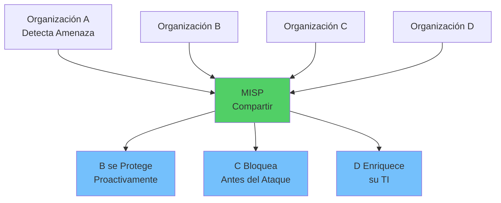
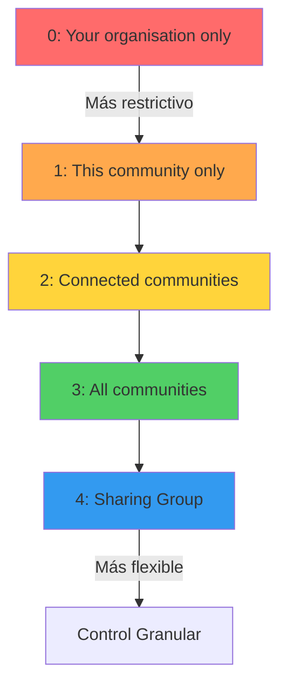
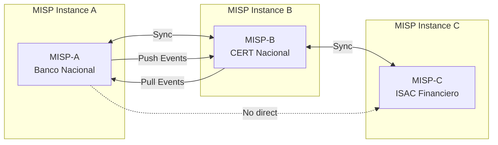
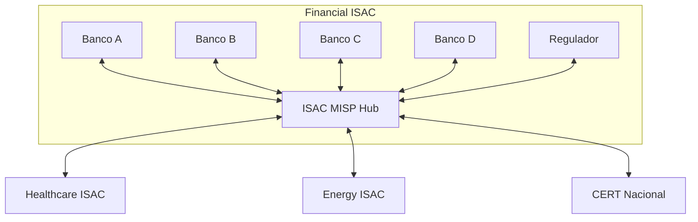
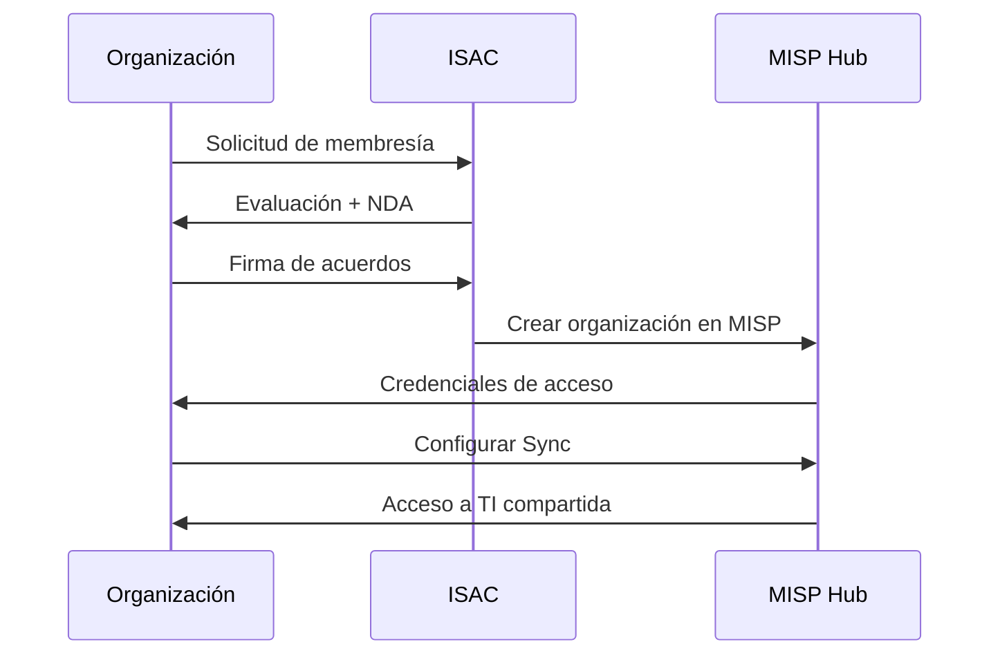

# Compartir y Comunidad en MISP

## Introducción

Una de las características más poderosas de MISP es su capacidad para **compartir información de amenazas de manera controlada y segura** entre organizaciones, comunidades y sectores. Esta guía explica cómo configurar y gestionar el compartir efectivo de threat intelligence.

!!! quote "Filosofía de MISP"
    **"Sharing is Caring"** - Compartir inteligencia de amenazas fortalece la seguridad colectiva, pero debe hacerse de manera responsable y con controles apropiados.

## Filosofía de Compartir

### El Principio de Defensa Colectiva



### Beneficios del Compartir

| Beneficio | Descripción | Ejemplo |
|-----------|-------------|---------|
| **Early Warning** | Alertas tempranas | Banco A detecta phishing, alerta a otros bancos antes de que sean atacados |
| **Contexto Enriquecido** | Información complementaria | Hospital A ve IP sospechosa, Hospital B confirma que es ransomware activo |
| **Validación** | Confirmar IOCs | Múltiples organizaciones reportan mismo C2 → Mayor confianza |
| **Reducción de Costos** | Análisis compartido | Una organización analiza malware, todas se benefician del análisis |
| **Aprendizaje** | Mejores prácticas | Ver cómo otros estructuran y etiquetan sus eventos |

### Principios de Compartir Responsable

!!! warning "Responsabilidades al Compartir"
    1. **Verificar antes de compartir**: Confirma que los IOCs son precisos
    2. **Clasificar apropiadamente**: Usa TLP correcto según sensibilidad
    3. **Anonimizar datos sensibles**: Remueve información identificable de víctimas
    4. **Dar contexto**: Explica el "por qué" no solo el "qué"
    5. **Respetar acuerdos**: No re-compartir información confidencial
    6. **Mantener calidad**: No compartir IOCs sin verificar o de baja calidad

## Distribution Levels (Niveles de Distribución)

MISP tiene 5 niveles de distribución que controlan quién puede ver la información.

### Niveles Disponibles



### Detalles de Cada Nivel

=== "Level 0: Your organisation only"
    **Uso interno exclusivo**

    ```yaml
    Visibilidad:
      - Solo tu organización
      - No se sincroniza con otras instancias
      - No aparece en feeds

    Casos de uso:
      - Análisis interno en progreso
      - Información sensible de tu red
      - IOCs sin confirmar
      - Investigaciones confidenciales

    Ejemplo:
      Event: "Sospecha de insider threat - ID 54321"
      Distribution: 0 (Your organisation only)
    ```

=== "Level 1: This community only"
    **Comunidad local**

    ```yaml
    Visibilidad:
      - Todas las organizaciones en tu instancia MISP
      - No se sincroniza con instancias externas
      - Útil para comunidades cerradas

    Casos de uso:
      - ISAC sectorial (ej: bancos de un país)
      - Comunidad nacional de CERTs
      - Grupo corporativo (matriz + subsidiarias)

    Ejemplo:
      Event: "Phishing dirigido a sector financiero mexicano"
      Distribution: 1 (This community only)
      Organizaciones: Banco A, Banco B, CERT-MX, Regulador
    ```

=== "Level 2: Connected communities"
    **Comunidades conectadas**

    ```yaml
    Visibilidad:
      - Tu comunidad local
      - Instancias MISP conectadas via sync
      - No en feeds públicos

    Casos de uso:
      - Compartir entre CERTs nacionales
      - ISACs de sectores relacionados
      - Partners estratégicos

    Ejemplo:
      Event: "Campaña APT28 - Sector Gubernamental"
      Distribution: 2 (Connected communities)
      Sincroniza: CERT-MX ↔ US-CERT ↔ CERT-EU
    ```

=== "Level 3: All communities"
    **Público (dentro de MISP)**

    ```yaml
    Visibilidad:
      - Todas las instancias MISP globalmente
      - Feeds públicos
      - Máxima distribución

    Casos de uso:
      - IOCs de malware conocido (Emotet, etc)
      - Campañas masivas de phishing
      - Infraestructura de C2 confirmada
      - OSINT verificado

    Ejemplo:
      Event: "Emotet Campaign December 2024 - Global"
      Distribution: 3 (All communities)
      Tags: tlp:white, type:OSINT
    ```

=== "Level 4: Sharing Group"
    **Grupo específico**

    ```yaml
    Visibilidad:
      - Solo organizaciones en el Sharing Group
      - Control granular por grupo
      - Puede cruzar instancias MISP

    Casos de uso:
      - Colaboración entre organizaciones específicas
      - Proyectos conjuntos
      - Sectores altamente regulados

    Ejemplo:
      Event: "Insider threat - Compartido con partners"
      Distribution: 4 (Sharing Group: "Grupo Financiero ABC")
      Organizaciones: Banco Principal, Subsidiarias A, B, C
    ```

### Configurar Distribution

#### Al Crear Event

```python
from pymisp import MISPEvent

event = MISPEvent()
event.info = "Campaña de Ransomware LockBit"
event.distribution = 2  # 0-4

# Opciones:
# event.distribution = 0  # Your organisation only
# event.distribution = 1  # This community only
# event.distribution = 2  # Connected communities
# event.distribution = 3  # All communities
# event.distribution = 4  # Sharing Group (requiere sharing_group_id)

misp.add_event(event)
```

#### Cambiar Distribution de Event Existente

```python
# Obtener event
event = misp.get_event(123, pythonify=True)

# Cambiar distribución
event.distribution = 3  # Ahora público

# Actualizar
misp.update_event(event)
```

#### Distribution por Attribute

Los attributes pueden tener distribución diferente al event:

```python
# Event es "This community only"
event.distribution = 1

# Pero este attribute es "Your organisation only"
attr = event.add_attribute('ip-dst', '192.0.2.100')
attr.distribution = 0  # Más restrictivo

# Este otro attribute hereda del event
attr2 = event.add_attribute('domain', 'evil.com')
attr2.distribution = 5  # "Inherit event" (default)
```

## Sharing Groups

Los **Sharing Groups** permiten compartir selectivamente con organizaciones específicas, incluso si están en diferentes instancias MISP.

### Estructura de Sharing Group

```mermaid
graph TB
    SG[Sharing Group:<br/>"Financial ISAC LATAM"]

    subgraph "MISP Instance: Mexico"
        M1[Banco Nacional MX]
        M2[CERT-MX]
    end

    subgraph "MISP Instance: Colombia"
        C1[Banco Nacional CO]
        C2[CERT-CO]
    end

    subgraph "MISP Instance: Brazil"
        B1[Banco Nacional BR]
        B2[CERT-BR]
    end

    SG --> M1
    SG --> M2
    SG --> C1
    SG --> C2
    SG --> B1
    SG --> B2

    style SG fill:#ffd43b
```

### Crear Sharing Group

#### Via Web UI

1. **Administration** → **Sharing Groups** → **Add Sharing Group**

2. **Configurar**:
    ```yaml
    Name: Financial ISAC Mexico
    Description: Compartir TI entre instituciones financieras mexicanas
    Releasable to: [Seleccionar organizaciones]
    ```

3. **Agregar Organizaciones**:
    - Banco Nacional
    - BBVA Mexico
    - Santander Mexico
    - Banorte
    - CNBV (Regulador)
    - CERT-MX

4. **Permisos**:
    - **Read**: Ver eventos
    - **Write**: Crear/editar eventos en el grupo
    - **Extend**: Agregar más organizaciones al grupo

#### Via API

```python
from pymisp import MISPSharingGroup

# Crear sharing group
sg = MISPSharingGroup()
sg.name = "Financial ISAC Mexico"
sg.description = "TI para sector financiero mexicano"
sg.releasability = "Instituciones financieras mexicanas autorizadas"

# Agregar organizaciones
sg.organisations = [
    {'id': 1, 'name': 'Banco Nacional', 'extend': True},
    {'id': 2, 'name': 'BBVA Mexico', 'extend': False},
    {'id': 3, 'name': 'Santander Mexico', 'extend': False},
    {'id': 4, 'name': 'CERT-MX', 'extend': True}
]

result = misp.add_sharing_group(sg, pythonify=True)
print(f"Sharing Group creado con ID: {result.id}")
```

### Usar Sharing Group

```python
# Crear event con sharing group
event = MISPEvent()
event.info = "Phishing dirigido a bancos mexicanos"
event.distribution = 4  # Sharing Group
event.sharing_group_id = 5  # ID del sharing group

# Los attributes heredan el sharing group
event.add_attribute('domain', 'fake-banamex-login.com', to_ids=True)

misp.add_event(event)
```

### Ventajas de Sharing Groups

!!! success "Beneficios"
    - **Control Granular**: Elige exactamente quién ve qué
    - **Cross-Instance**: Funciona entre diferentes instancias MISP
    - **Flexibilidad**: Diferentes sharing groups para diferentes proyectos
    - **Auditoría**: Saber quién tiene acceso a información sensible

### Casos de Uso

=== "ISAC Sectorial"
    ```yaml
    Sharing Group: Healthcare ISAC LATAM
    Miembros:
      - Hospitales grandes
      - Clínicas privadas
      - Ministerios de Salud
      - CERT nacionales

    Uso: Compartir ransomware y amenazas específicas del sector
    ```

=== "Grupo Corporativo"
    ```yaml
    Sharing Group: Grupo Financiero ABC
    Miembros:
      - Matriz (México)
      - Subsidiaria Colombia
      - Subsidiaria Peru
      - SOC centralizado

    Uso: TI interna del grupo corporativo
    ```

=== "Proyecto de Investigación"
    ```yaml
    Sharing Group: APT28 Research Group
    Miembros:
      - CERT-EU
      - US-CERT
      - CERT-MX
      - Universidades participantes

    Uso: Investigación colaborativa de actor de amenaza específico
    ```

## Sync Servers (Sincronización)

Los **Sync Servers** permiten conectar instancias MISP para intercambiar eventos automáticamente.

### Arquitectura de Sync



### Configurar Sync Server

#### Requisitos Previos

1. **Conectividad de red**: Firewalls deben permitir HTTPS entre instancias
2. **Certificados SSL**: Válidos o mutuamente confiables
3. **API Key**: De usuario con rol "Sync user" en instancia remota

#### Paso 1: Crear Sync User en Instancia Remota

En **MISP Instance B** (remota):

1. **Administration** → **Add User**
2. **Configurar**:
    ```yaml
    Email: sync-from-org-a@misp-b.com
    Organisation: Organisation A
    Role: Sync User
    ```
3. **Guardar** y copiar **Auth Key** generada

#### Paso 2: Agregar Sync Server en Instancia Local

En **MISP Instance A** (local):

1. **Sync Actions** → **List Servers** → **Add Server**

2. **Configurar**:
    ```yaml
    URL: https://misp-b.tu-empresa.com
    Organisation: CERT Nacional
    Authkey: [API Key del sync user]
    Push: Yes
    Pull: Yes
    Self Signed: No (si tiene SSL válido)
    ```

3. **Push Rules**:
    ```yaml
    Push sightings: Yes
    Push galaxy clusters: Yes
    Push rules:
      - Tag: tlp:white (compartir público)
      - Tag: tlp:green (compartir comunidad)
      - Tag: sharing:allowed
    ```

4. **Pull Rules**:
    ```yaml
    Pull rules:
      - Tag: tlp:white
      - Tag: tlp:green
      - Org: CERT Nacional (solo eventos de esta org)
    ```

5. **Submit**

#### Via API

```python
# Agregar sync server
sync_server = {
    'url': 'https://misp-b.tu-empresa.com',
    'name': 'CERT Nacional MISP',
    'authkey': 'API_KEY_AQUI',
    'org_id': 2,
    'push': True,
    'pull': True,
    'self_signed': False,
    'push_sightings': True,
    'push_galaxy_clusters': True,
    'pull_galaxy_clusters': True,
    'push_rules': {
        'tags': ['tlp:white', 'tlp:green']
    },
    'pull_rules': {
        'orgs': ['CERT Nacional']
    }
}

misp.add_server(sync_server)
```

### Push vs Pull

=== "Push"
    **Tu instancia envía eventos a servidor remoto**

    ```yaml
    Cuándo:
      - Evento creado/actualizado en tu instancia
      - Evento cumple con Push Rules
      - Sync está habilitado

    Flujo:
      Local MISP → Evento nuevo → Cumple Push Rules → Push a Remoto

    Control:
      - Push Rules (tags, orgs, distribution)
      - Distribution level del evento
    ```

=== "Pull"
    **Tu instancia obtiene eventos de servidor remoto**

    ```yaml
    Cuándo:
      - Manual: "Pull" button
      - Automático: Cada X horas (configurable)

    Flujo:
      Remoto MISP ← Pull Request ← Local MISP

    Control:
      - Pull Rules (tags, orgs)
      - Solo eventos que tu org puede ver
    ```

### Filtros de Sincronización

#### Push Rules

Controla qué eventos se envían:

```json
{
  "push_rules": {
    "tags": {
      "OR": ["tlp:white", "tlp:green"],
      "NOT": ["tlp:red"]
    },
    "orgs": {
      "OR": ["Mi Organización", "Partner A"]
    },
    "distribution": [2, 3]  # Connected/All communities
  }
}
```

#### Pull Rules

Controla qué eventos se reciben:

```json
{
  "pull_rules": {
    "tags": {
      "OR": ["type:OSINT", "malware:emotet"],
      "NOT": ["internal"]
    },
    "orgs": {
      "OR": ["CERT Nacional", "Partner B"]
    }
  }
}
```

### Sincronización Manual

```bash
# Push a servidor específico
docker exec -it misp-core /var/www/MISP/app/Console/cake Server push [SERVER_ID]

# Pull desde servidor específico
docker exec -it misp-core /var/www/MISP/app/Console/cake Server pull [SERVER_ID]

# Push todos los servidores
docker exec -it misp-core /var/www/MISP/app/Console/cake Server pushAll

# Pull todos los servidores
docker exec -it misp-core /var/www/MISP/app/Console/cake Server pullAll
```

### Sincronización Automática

**Administration → Server Settings → MISP Settings**

```yaml
# Habilitar sync automático
MISP.background_jobs: true

# Intervalo de pull (en horas)
MISP.pull_rules: 6

# Habilitar push automático
MISP.push_on_event_publish: true
```

### Troubleshooting Sync

#### Verificar Estado

```bash
# Ver servidores configurados
docker exec -it misp-core /var/www/MISP/app/Console/cake Server list

# Test conectividad
docker exec -it misp-core /var/www/MISP/app/Console/cake Server test [SERVER_ID]
```

#### Problemas Comunes

=== "SSL Certificate Error"
    ```yaml
    Error: SSL certificate problem: self signed certificate

    Solución:
      1. Instalar certificado válido
      2. O marcar "Self Signed: Yes" en configuración
    ```

=== "Authentication Failed"
    ```yaml
    Error: Authentication failed

    Solución:
      1. Verificar API Key es correcta
      2. Verificar usuario remoto tiene rol "Sync User"
      3. Verificar API key no expiró
    ```

=== "No Events Pushed/Pulled"
    ```yaml
    Error: Sync completo pero 0 eventos transferidos

    Solución:
      1. Verificar Push/Pull Rules
      2. Verificar Distribution levels
      3. Verificar eventos cumplen con filtros
      4. Ver logs: /var/www/MISP/app/tmp/logs/
    ```

## ISACs y Comunidades Sectoriales

### ¿Qué es un ISAC?

**ISAC** (Information Sharing and Analysis Center) es una organización que facilita el intercambio de información sobre amenazas dentro de un sector específico.



### ISACs Principales por Sector

| Sector | ISAC | Enfoque | Website |
|--------|------|---------|---------|
| **Financiero** | FS-ISAC | Bancos, instituciones financieras | fs-isac.com |
| **Salud** | H-ISAC | Hospitales, healthcare | h-isac.org |
| **Energía** | E-ISAC | Utilities, energía | eisac.com |
| **Telecom** | CSRIC | Telecomunicaciones | fcc.gov/csric |
| **Aviación** | A-ISAC | Aerolíneas, aeropuertos | a-isac.com |
| **Multi-sector** | MS-ISAC | Gobiernos estatales/locales | cisecurity.org/ms-isac |

### Participar en un ISAC

#### Requisitos Típicos

1. **Membresía**: Pertenecer al sector
2. **Acuerdo de Confidencialidad**: NDA o TLP
3. **Reciprocidad**: Compartir, no solo consumir
4. **Calidad**: Validar IOCs antes de compartir

#### Proceso de Unión



### Buenas Prácticas en ISAC

!!! tip "Tips para Participar Efectivamente"

    === "Compartir Activamente"
        - No seas solo consumidor
        - Comparte eventos de calidad
        - Aporta análisis, no solo IOCs
        - Usa TLP apropiado

    === "Mantener Calidad"
        - Valida IOCs antes de compartir
        - Marca contexto claro
        - Usa taxonomías consistentes
        - Actualiza eventos cuando cambien

    === "Colaborar"
        - Responde a proposals
        - Agrega sightings
        - Participa en discusiones
        - Comparte lecciones aprendidas

    === "Respetar Acuerdos"
        - No re-compartir fuera del grupo
        - Respetar TLP
        - Anonimizar datos sensibles
        - Reportar problemas al ISAC

## Buenas Prácticas de Compartir

### 1. Traffic Light Protocol (TLP)

Siempre usa TLP para indicar cómo se puede compartir la información:

```yaml
tlp:red    → No compartir (solo destinatarios)
tlp:amber  → Compartir limitado (comunidad cerrada)
tlp:green  → Compartir comunidad (sector)
tlp:white  → Compartir público (sin restricciones)
```

**Ejemplo de aplicación**:

```python
# Event de incidente interno
event = MISPEvent()
event.info = "Incidente de seguridad interno - Análisis en curso"
event.distribution = 0  # Your organisation only
event.add_tag('tlp:red')

# Event de campaña sectorial
event2 = MISPEvent()
event2.info = "Phishing Campaign - Financial Sector"
event2.distribution = 1  # This community only
event2.add_tag('tlp:amber')

# Event de malware público
event3 = MISPEvent()
event3.info = "Emotet IOCs - December 2024"
event3.distribution = 3  # All communities
event3.add_tag('tlp:white')
```

### 2. Anonimización de Datos Sensibles

Antes de compartir, remueve información identificable:

=== "Anonimizar"
    ```yaml
    # Antes
    comment: "Detectado en servidor prod-db-01 (10.50.100.25) del Banco Nacional"

    # Después
    comment: "Detectado en servidor de base de datos de producción (red interna)"

    # Antes
    email-dst: "juan.perez@banconacional.com"

    # Después
    email-dst: "[victim]@[financial-institution].com"
    comment: "Email de empleado del sector financiero"
    ```

=== "Generalizar"
    ```yaml
    # Específico → General
    "Detectado en sucursal de Polanco, CDMX" → "Detectado en sucursal urbana"
    "10 servidores Windows Server 2019" → "Múltiples servidores Windows"
    "CTO reportó a las 15:30" → "Equipo de TI reportó"
    ```

### 3. Contexto Rico

Agrega contexto para que otros entiendan la amenaza:

```python
event = MISPEvent()
event.info = "Ransomware LockBit 3.0 - Healthcare Sector"

# Context en event
event.add_attribute('comment', value="""
    Contexto:
    - Vector: Phishing con adjunto malicioso
    - Objetivo: Servidores de archivos médicos
    - Técnica: Exfiltración antes de encriptar
    - Rescate: 1 millón USD en BTC
    - Recuperación: 3 días con backups
    - Lecciones aprendidas: MFA habría prevenido escalación
""")

# Context en attributes
attr = event.add_attribute('ip-dst', '192.0.2.100', to_ids=True)
attr.comment = "C2 principal, activo desde 2024-12-01, puerto 443, SSL con certificado autofirmado"
```

### 4. Lifecycle de Eventos

Mantén eventos actualizados:

```python
# Evento inicial
event.analysis = 0  # Initial

# Durante investigación
event.analysis = 1  # Ongoing

# Después de análisis completo
event.analysis = 2  # Completed

# Si IOCs ya no son relevantes
# Agregar tag
event.add_tag('workflow:deprecated')

# O agregar sightings de expiración
misp.add_sighting({'type': '2'}, attribute_id)  # Expiration sighting
```

### 5. Dar Crédito

Reconoce fuentes de información:

```python
event = MISPEvent()
event.info = "Emotet Campaign - Analysis by CERT-XYZ"

# Agregar organización como contributor
event.add_attribute('comment', value="Initial analysis by CERT-XYZ, enriched by our team")

# Tag de origen
event.add_tag('source:CERT-XYZ')
event.add_tag('type:OSINT')
```

## Privacidad y Anonimización

### Datos a Proteger

| Tipo de Dato | Nivel de Riesgo | Acción |
|--------------|-----------------|--------|
| **IPs internas (RFC1918)** | Alto | Remover o generalizar |
| **Nombres de empleados** | Alto | Anonimizar |
| **Emails internos** | Alto | Generalizar |
| **Nombres de servidores** | Medio | Generalizar |
| **Versiones específicas** | Bajo | OK compartir |
| **IOCs públicos** | Bajo | OK compartir |

### Técnicas de Anonimización

#### 1. Redacción

```python
# Antes
comment = "El CTO Juan Pérez (jperez@banconacional.com) reportó el incidente"

# Después
comment = "Un ejecutivo de TI reportó el incidente"
```

#### 2. Generalización

```python
# Antes
attr = event.add_attribute('hostname', 'prod-db-mysql-master-01.internal.banconacional.com')

# Después
attr = event.add_attribute('comment', 'Servidor de base de datos principal')
```

#### 3. Agregación

```python
# Antes (demasiado detalle)
event.add_attribute('ip-src', '10.50.100.25')
event.add_attribute('ip-src', '10.50.100.26')
event.add_attribute('ip-src', '10.50.100.27')

# Después (agregado)
event.add_attribute('comment', 'Múltiples servidores internos en red de producción')
```

### Script de Anonimización

```python
#!/usr/bin/env python3
# Archivo: anonymize_event.py

from pymisp import PyMISP
import re

def anonymize_event(misp, event_id):
    """Anonimiza datos sensibles de un event"""

    event = misp.get_event(event_id, pythonify=True)

    # Patterns a anonimizar
    patterns = {
        r'\b(?:\d{1,3}\.){3}\d{1,3}\b': lambda m: '[IP-ADDRESS]',  # IPs
        r'\b[A-Za-z0-9._%+-]+@[A-Za-z0-9.-]+\.[A-Z|a-z]{2,}\b': lambda m: '[EMAIL]',  # Emails
        r'\b[A-Z][a-z]+\s+[A-Z][a-z]+\b': lambda m: '[PERSON-NAME]',  # Nombres
    }

    # Anonimizar comments de attributes
    for attr in event.attributes:
        if attr.comment:
            for pattern, repl in patterns.items():
                attr.comment = re.sub(pattern, repl, attr.comment)

    # Actualizar event
    misp.update_event(event)
    print(f"Event {event_id} anonimizado")

# Uso
misp = PyMISP('https://misp.tu-empresa.com', 'API_KEY', False)
anonymize_event(misp, 123)
```

## Métricas de Compartir

### Dashboards de Sharing

**Home → Dashboard** muestra métricas:

- Events compartidos (últimos 7 días)
- Organizaciones más activas
- Top contributors
- Distribución de TLP
- Tipos de attributes más compartidos

### Reportes Personalizados

```python
#!/usr/bin/env python3
# Archivo: sharing_report.py

from pymisp import PyMISP
from datetime import datetime, timedelta

misp = PyMISP('https://misp.tu-empresa.com', 'API_KEY', False)

# Última semana
last_week = (datetime.now() - timedelta(days=7)).strftime('%Y-%m-%d')

# Buscar events compartidos
result = misp.search(
    date_from=last_week,
    org='Mi Organización',
    published=True,
    pythonify=True
)

print(f"Events compartidos última semana: {len(result)}")

# Estadísticas
distributions = {}
for event in result:
    dist = event.distribution
    distributions[dist] = distributions.get(dist, 0) + 1

print("\nDistribución:")
dist_names = {0: 'Org only', 1: 'Community', 2: 'Connected', 3: 'All', 4: 'Sharing Group'}
for dist, count in distributions.items():
    print(f"  {dist_names[dist]}: {count}")
```

## Próximos Pasos

Ahora que comprendes cómo compartir efectivamente en MISP:

1. **[Integración con Stack](integration-stack.md)** - Conecta MISP con Wazuh, TheHive, Shuffle
2. **[Casos de Uso](use-cases.md)** - Ejemplos prácticos de compartir
3. **[API Reference](api-reference.md)** - Automatiza el compartir con PyMISP

---

!!! success "Compartir Responsablemente"
    El poder de MISP está en la comunidad. Recuerda:

    - ✅ Compartir activamente, no solo consumir
    - ✅ Usar TLP apropiado siempre
    - ✅ Anonimizar datos sensibles
    - ✅ Proporcionar contexto rico
    - ✅ Mantener calidad de IOCs
    - ✅ Respetar acuerdos de confidencialidad
    - ✅ Actualizar eventos cuando cambien

**¡Juntos somos más fuertes contra las amenazas!**
