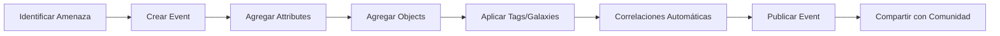
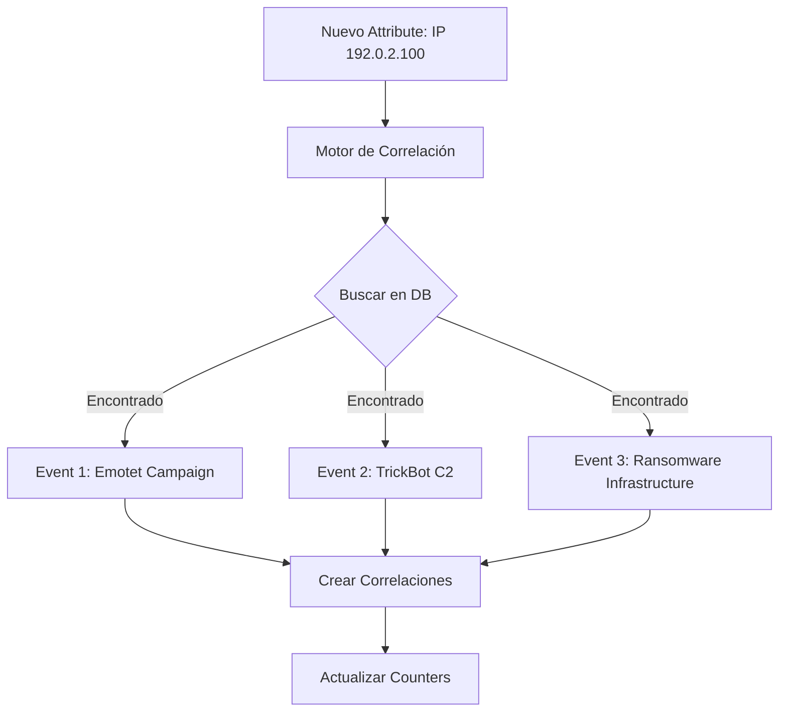
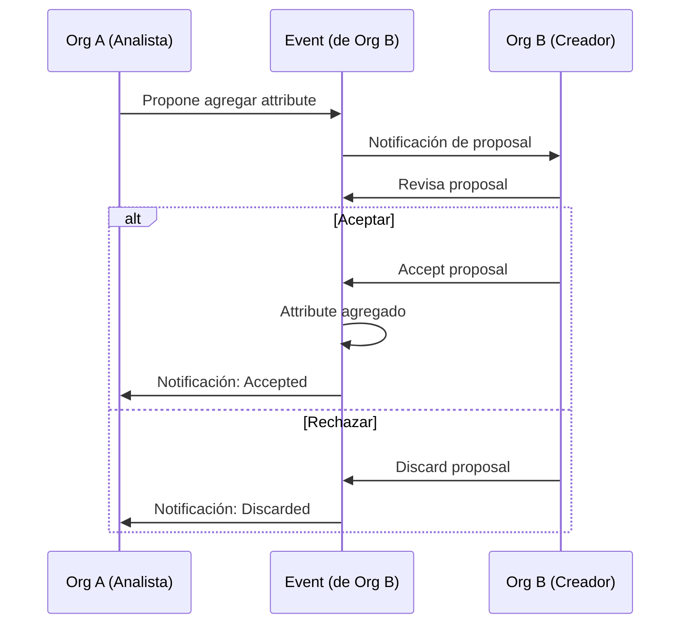

# Gestión de Threat Intelligence en MISP

## Introducción

Esta guía explica cómo gestionar información de amenazas (Threat Intelligence) en MISP, desde la creación de eventos hasta el uso de objetos complejos, correlaciones y frameworks como MITRE ATT&CK.

!!! info "Objetivo"
    Al finalizar esta guía, podrás:
    - Crear y gestionar Events con IOCs
    - Utilizar Objects para estructurar información compleja
    - Aprovechar las correlaciones automáticas
    - Importar y exportar datos en múltiples formatos
    - Integrar MITRE ATT&CK en tus análisis

## Tipos de IOCs Soportados

MISP soporta una amplia variedad de indicadores de compromiso (IOCs) y tipos de datos.

### Categorías de Attributes

=== "Network Activity"
    Indicadores relacionados con actividad de red

    | Tipo | Descripción | Ejemplo | to_ids |
    |------|-------------|---------|--------|
    | `ip-src` | IP de origen | `192.0.2.100` | ✅ |
    | `ip-dst` | IP de destino | `203.0.113.50` | ✅ |
    | `domain` | Nombre de dominio | `malicious.com` | ✅ |
    | `hostname` | Nombre de host | `c2.evil.org` | ✅ |
    | `url` | URL completa | `http://evil.com/payload.exe` | ✅ |
    | `uri` | URI sin esquema | `/admin/backdoor.php` | ⚠️ |
    | `user-agent` | User-Agent HTTP | `Mozilla/5.0 (Malware...)` | ⚠️ |
    | `AS` | Sistema Autónomo | `AS12345` | ⚠️ |

=== "Payload Delivery"
    Archivos y hashes de malware

    | Tipo | Descripción | Ejemplo | to_ids |
    |------|-------------|---------|--------|
    | `md5` | Hash MD5 | `5d41402abc4b2a76b9719d911017c592` | ✅ |
    | `sha1` | Hash SHA1 | `aaf4c61ddcc5e8a2dabede0f3b482cd9aea9434d` | ✅ |
    | `sha256` | Hash SHA256 | `2c26b46b68ffc68ff99b453c1d30413413422d706480...` | ✅ |
    | `ssdeep` | Fuzzy hash | `3:AXGBicFlgVNhBGcL6wCrFQEv:AXGHsNhxLsr2C` | ✅ |
    | `imphash` | Import hash (PE) | `f34d5f2d4577ed6d9ceec516c1f5a744` | ✅ |
    | `filename` | Nombre de archivo | `invoice.doc.exe` | ⚠️ |
    | `malware-sample` | Muestra de malware | `archivo.zip (encriptado)` | ✅ |
    | `attachment` | Archivo adjunto | `documento.pdf` | ⚠️ |

=== "Email"
    Indicadores de phishing y email

    | Tipo | Descripción | Ejemplo | to_ids |
    |------|-------------|---------|--------|
    | `email-src` | Email de origen | `attacker@evil.com` | ✅ |
    | `email-dst` | Email de destino | `victim@company.com` | ❌ |
    | `email-subject` | Asunto del email | `Urgent: Invoice Payment` | ⚠️ |
    | `email-attachment` | Nombre de adjunto | `invoice.zip` | ⚠️ |
    | `email-body` | Cuerpo del email | `Please click here...` | ❌ |
    | `email-header` | Header completo | `Received: from...` | ⚠️ |

=== "Artifacts Dropped"
    Artefactos dejados por malware

    | Tipo | Descripción | Ejemplo | to_ids |
    |------|-------------|---------|--------|
    | `mutex` | Mutex de malware | `Global\MalwareMutex123` | ✅ |
    | `named-pipe` | Named pipe | `\.\pipe\malware` | ✅ |
    | `registry-key` | Clave de registro | `HKLM\Software\Malware` | ✅ |
    | `pattern-in-file` | Patrón en archivo | `string hexadecimal` | ✅ |
    | `pattern-in-memory` | Patrón en memoria | `memoria del proceso` | ✅ |
    | `yara` | Regla YARA | `rule malware {...}` | ✅ |

=== "Other"
    Otros tipos de información

    | Tipo | Descripción | Ejemplo |
    |------|-------------|---------|
    | `comment` | Comentario | `Análisis pendiente` |
    | `text` | Texto libre | `Notas adicionales` |
    | `vulnerability` | Vulnerabilidad | `CVE-2024-1234` |
    | `weakness` | CWE | `CWE-79` |
    | `campaign-name` | Nombre de campaña | `Emotet Q4 2024` |
    | `threat-actor` | Actor de amenaza | `APT28` |

### Flag: to_ids

El flag **to_ids** indica si el atributo debe usarse para detección automática (IDS/IPS).

```python
to_ids = True   # Usar para detección automática (firmas, reglas)
to_ids = False  # Solo contextual, no para automatización
```

!!! warning "Cuándo Usar to_ids=True"
    - ✅ IOCs confirmados de malware (hashes, C2 IPs)
    - ✅ Dominios conocidos de phishing
    - ✅ URLs de descarga de malware
    - ❌ IPs legítimas (Google, CDNs)
    - ❌ Dominios populares (facebook.com)
    - ❌ Información contextual (comentarios)

## Creación de Events

### Flujo de Creación de un Event



### Método 1: Via Web UI

#### Paso 1: Crear Event Base

1. **Navegar a**: Event Actions → Add Event

2. **Completar formulario**:

    ```yaml
    Date: 2024-12-05              # Fecha del incidente
    Distribution: This community only  # Nivel de compartir
    Threat Level: High            # Criticidad
    Analysis: Ongoing             # Estado del análisis
    Event Info: Campaña Emotet Diciembre 2024 - Sector Financiero
    ```

3. **Click**: Submit

!!! tip "Best Practice: Event Info"
    El campo "Event Info" debe ser descriptivo y único:
    - ✅ "Campaña Emotet Q4 2024 - Phishing a Bancos Mexicanos"
    - ✅ "Ransomware LockBit 3.0 - Sector Healthcare - Diciembre 2024"
    - ❌ "Malware"
    - ❌ "Phishing Campaign"

#### Paso 2: Agregar Attributes

Una vez creado el Event:

1. **Click**: Add Attribute

2. **Ejemplo - IP de C2**:
    ```yaml
    Category: Network activity
    Type: ip-dst
    Value: 192.0.2.100
    To IDS: Yes
    Distribution: Inherit event
    Comment: Emotet C2 server, active since 2024-12-01
    ```

3. **Ejemplo - Hash de Malware**:
    ```yaml
    Category: Payload delivery
    Type: sha256
    Value: 2c26b46b68ffc68ff99b453c1d30413413422d706480b8ad529accb91a67e80e
    To IDS: Yes
    Comment: Emotet dropper, detected by 45/60 AV vendors
    ```

4. **Ejemplo - Dominio de Phishing**:
    ```yaml
    Category: Network activity
    Type: domain
    Value: secure-bank-login.com
    To IDS: Yes
    Comment: Phishing domain impersonating Banamex
    ```

### Método 2: Via API con PyMISP

```python
#!/usr/bin/env python3
# Archivo: create_event.py

from pymisp import PyMISP, MISPEvent, MISPAttribute
from datetime import date

# Configuración
misp_url = 'https://misp.tu-empresa.com'
misp_key = 'tu_api_key_aqui'
misp_verifycert = False

# Conectar a MISP
misp = PyMISP(misp_url, misp_key, misp_verifycert)

# Crear event
event = MISPEvent()
event.info = 'Campaña Emotet Diciembre 2024 - Sector Financiero'
event.distribution = 1  # This community only
event.threat_level_id = 1  # High
event.analysis = 1  # Ongoing
event.date = date.today()

# Agregar tags
event.add_tag('tlp:amber')
event.add_tag('type:OSINT')
event.add_tag('malware:emotet')

# Agregar attributes
# IP C2
attr_ip = MISPAttribute()
attr_ip.category = 'Network activity'
attr_ip.type = 'ip-dst'
attr_ip.value = '192.0.2.100'
attr_ip.to_ids = True
attr_ip.comment = 'Emotet C2 server'
event.add_attribute(**attr_ip)

# Hash de malware
attr_hash = MISPAttribute()
attr_hash.category = 'Payload delivery'
attr_hash.type = 'sha256'
attr_hash.value = '2c26b46b68ffc68ff99b453c1d30413413422d706480b8ad529accb91a67e80e'
attr_hash.to_ids = True
attr_hash.comment = 'Emotet dropper'
event.add_attribute(**attr_hash)

# Dominio
attr_domain = MISPAttribute()
attr_domain.category = 'Network activity'
attr_domain.type = 'domain'
attr_domain.value = 'secure-bank-login.com'
attr_domain.to_ids = True
attr_domain.comment = 'Phishing domain'
event.add_attribute(**attr_domain)

# Crear event en MISP
result = misp.add_event(event, pythonify=True)
print(f"Event creado con ID: {result.id}")
print(f"URL: {misp_url}/events/view/{result.id}")
```

Ejecutar:

```bash
pip3 install pymisp
python3 create_event.py
```

## Uso de Objects

Los **Objects** permiten estructurar información compleja de manera estandarizada.

### Templates Disponibles

Ver templates disponibles: **Event Actions → Add Object**

Algunos templates populares:

```
- file: Información completa de archivo
- email: Estructura de email de phishing
- network-connection: Conexión de red
- network-socket: Socket de red
- domain-ip: Resolución DNS
- url: URL con contexto
- person: Individuo (actor de amenaza)
- organization: Organización
- vulnerability: Vulnerabilidad completa
- attack-pattern: Patrón de ataque MITRE
```

### Ejemplo: Object "file"

Representa un archivo con todos sus metadatos.

#### Via Web UI

1. **Event** → Add Object → **file**

2. **Completar campos**:
    ```yaml
    filename: invoice.doc.exe
    size-in-bytes: 245760
    md5: 5d41402abc4b2a76b9719d911017c592
    sha1: aaf4c61ddcc5e8a2dabede0f3b482cd9aea9434d
    sha256: 2c26b46b68ffc68ff99b453c1d30413413422d706480b8ad529accb91a67e80e
    ssdeep: 3:AXGBicFlgVNhBGcL6wCrFQEv:AXGHsNhxLsr2C
    mime-type: application/x-dosexec
    ```

3. **Submit**

#### Via PyMISP

```python
from pymisp import MISPObject

# Crear object file
file_obj = MISPObject('file')
file_obj.add_attribute('filename', value='invoice.doc.exe')
file_obj.add_attribute('size-in-bytes', value=245760)
file_obj.add_attribute('md5', value='5d41402abc4b2a76b9719d911017c592')
file_obj.add_attribute('sha1', value='aaf4c61ddcc5e8a2dabede0f3b482cd9aea9434d')
file_obj.add_attribute('sha256', value='2c26b46b68ffc68ff99b453c1d30413413422d706480b8ad529accb91a67e80e')
file_obj.add_attribute('mime-type', value='application/x-dosexec')

# Agregar al event
event.add_object(file_obj)
misp.update_event(event)
```

### Ejemplo: Object "email"

Estructura completa de un email de phishing.

```python
email_obj = MISPObject('email')
email_obj.add_attribute('from', value='attacker@evil.com')
email_obj.add_attribute('to', value='victim@company.com')
email_obj.add_attribute('subject', value='Urgent: Invoice Payment Required')
email_obj.add_attribute('reply-to', value='payment@phishing.com')
email_obj.add_attribute('email-body', value='Dear customer, please click here to verify your account...')
email_obj.add_attribute('attachment', value='invoice.zip')
email_obj.add_attribute('x-mailer', value='Microsoft Outlook 15.0')

# Agregar relación con archivo adjunto
email_obj.add_reference(file_obj.uuid, 'attachment')

event.add_object(email_obj)
```

### Ejemplo: Object "network-connection"

Conexión de red observada.

```python
netconn_obj = MISPObject('network-connection')
netconn_obj.add_attribute('ip-src', value='10.0.0.50')
netconn_obj.add_attribute('ip-dst', value='192.0.2.100')
netconn_obj.add_attribute('src-port', value=49152)
netconn_obj.add_attribute('dst-port', value=443)
netconn_obj.add_attribute('protocol', value='tcp')
netconn_obj.add_attribute('first-packet-seen', value='2024-12-05T10:30:00Z')
netconn_obj.add_attribute('layer3-protocol', value='IP')
netconn_obj.add_attribute('layer4-protocol', value='TCP')

event.add_object(netconn_obj)
```

### Relaciones entre Objects

Los objects pueden relacionarse entre sí:

```python
# File descargado desde URL
url_obj = MISPObject('url')
url_obj.add_attribute('url', value='http://evil.com/payload.exe')

file_obj = MISPObject('file')
file_obj.add_attribute('filename', value='payload.exe')
file_obj.add_attribute('sha256', value='...')

# Crear relación: URL → File
file_obj.add_reference(url_obj.uuid, 'downloaded-from')

event.add_object(url_obj)
event.add_object(file_obj)
```

## Correlaciones Automáticas

MISP correlaciona automáticamente attributes idénticos o similares entre eventos.

### Cómo Funciona



### Ver Correlaciones

#### Via Web UI

1. **Event** → Ver attribute
2. **Correlations** tab muestra eventos relacionados
3. **Click** en evento correlacionado para ver detalles

#### Via API

```python
# Obtener correlaciones de un attribute
attribute_id = 12345
correlations = misp.get_attribute_correlations(attribute_id)

for corr in correlations:
    print(f"Event {corr['Event']['id']}: {corr['Event']['info']}")
    print(f"  Attribute: {corr['Attribute']['value']}")
```

### Tipos de Correlación

=== "Exact Match"
    Valores idénticos
    ```
    Event 1: ip-dst = 192.0.2.100
    Event 2: ip-dst = 192.0.2.100
    → Correlación exacta
    ```

=== "Fuzzy Hash (ssdeep)"
    Archivos similares
    ```
    Event 1: ssdeep = 3:AXGBicFlgVNhBGcL6wCrFQEv:AXGHsNhxLsr2C
    Event 2: ssdeep = 3:AXGBicFlgVNhBGcL6wCrFQEx:AXGHsNhxLsr2E
    → Archivos similares (95% match)
    ```

=== "CIDR Range"
    IPs en mismo rango
    ```
    Event 1: ip-dst = 192.0.2.100
    Event 2: ip-dst = 192.0.2.101
    → Mismo /24
    ```

### Deshabilitar Correlación

Para attributes que generan muchas correlaciones innecesarias:

```python
attr = MISPAttribute()
attr.type = 'domain'
attr.value = 'cloudflare.com'  # Servicio legítimo muy común
attr.disable_correlation = True  # No correlacionar
event.add_attribute(**attr)
```

## Sightings (Confirmaciones)

Los **Sightings** permiten confirmar o rechazar la observación de un IOC en tu entorno.

### Tipos de Sightings

| Tipo | Significado | Icono |
|------|-------------|-------|
| **Sighting** | IOC observado en mi entorno | 👁️ |
| **False Positive** | Falso positivo confirmado | ❌ |
| **Expiration** | IOC ya no activo | ⏰ |

### Agregar Sighting

#### Via Web UI

1. **Event** → Ver attribute
2. **Click**: Add Sighting
3. **Seleccionar tipo**: Sighting / False Positive / Expiration
4. **Agregar note** (opcional): "Observado en firewall perimetral"

#### Via API

```python
# Reportar sighting de una IP
attribute_id = 12345
sighting = {
    'type': '0',  # 0=Sighting, 1=False positive, 2=Expiration
    'source': 'Firewall Perimetral',
    'timestamp': int(time.time())
}
misp.add_sighting(sighting, attribute_id)
```

### Utilidad de Sightings

- **Validación**: Confirmar que un IOC es real y activo
- **Priorización**: IOCs con más sightings son más críticos
- **False Positives**: Identificar y marcar falsos positivos
- **Lifecycle**: Rastrear cuándo un IOC deja de estar activo

## Proposals (Propuestas)

Las **Proposals** permiten sugerir cambios a eventos de otras organizaciones.

### Flujo de Proposals



### Crear Proposal

#### Proponer Nuevo Attribute

1. **Event** (de otra organización) → Propose Attribute
2. **Completar**:
    ```yaml
    Category: Network activity
    Type: ip-dst
    Value: 192.0.2.200
    Comment: C2 alternativo observado en mi red
    ```
3. **Submit**

#### Proponer Cambio a Attribute Existente

1. **Attribute** → Propose Edit
2. **Modificar** campos necesarios
3. **Submit**

### Gestionar Proposals Recibidas

**Event Actions → View Proposals**

- **Accept**: Incorpora la proposal al event
- **Discard**: Rechaza la proposal
- **Comment**: Agregar comentario antes de decidir

### Via API

```python
# Proponer nuevo attribute
proposal = {
    'category': 'Network activity',
    'type': 'ip-dst',
    'value': '192.0.2.200',
    'comment': 'C2 alternativo observado',
    'to_ids': True
}
misp.add_attribute_proposal(event_id, proposal)
```

## Import/Export de Datos

MISP soporta múltiples formatos de importación y exportación.

### Formatos Soportados

=== "STIX"
    Standard de compartir TI

    **Export**:
    ```bash
    # Via Web UI
    Event → Download as → STIX 1.x / STIX 2.x JSON

    # Via API
    curl -H "Authorization: YOUR_API_KEY" \
         -H "Accept: application/json" \
         "https://misp.tu-empresa.com/events/restSearch/returnFormat:stix2/eventid:123"
    ```

    **Import**:
    ```bash
    # Via Web UI
    Event Actions → Import from → STIX

    # Via API
    curl -X POST -H "Authorization: YOUR_API_KEY" \
         -H "Content-Type: application/json" \
         --data @event.stix.json \
         "https://misp.tu-empresa.com/events/upload_stix"
    ```

=== "CSV"
    Formato simple para análisis

    **Export**:
    ```bash
    # Via Web UI
    Event → Download as → CSV

    # Via API con PyMISP
    result = misp.search(eventid=123, return_format='csv')
    with open('event_123.csv', 'w') as f:
        f.write(result)
    ```

    **Import**:
    ```bash
    # CSV formato: type, value, category, to_ids, comment
    # Ejemplo: ip-dst,192.0.2.100,Network activity,True,C2 server

    # Via Web UI
    Event → Free-text Import → Paste CSV data
    ```

=== "JSON"
    Formato nativo de MISP

    **Export**:
    ```python
    # Exportar event completo
    event = misp.get_event(123, pythonify=True)
    with open('event_123.json', 'w') as f:
        f.write(event.to_json())
    ```

    **Import**:
    ```python
    # Importar event
    with open('event_123.json', 'r') as f:
        event_json = f.read()
    result = misp.add_event(event_json)
    ```

=== "OpenIOC"
    Formato de Mandiant/FireEye

    **Export/Import**: Via Web UI
    ```
    Event → Download as → OpenIOC
    Event Actions → Import from → OpenIOC
    ```

### Free-text Import

MISP puede extraer IOCs automáticamente de texto libre.

#### Via Web UI

1. **Event** → Free-text Import
2. **Paste** texto con IOCs:
    ```
    Observamos comunicación con las siguientes IPs:
    192.0.2.100
    192.0.2.101
    203.0.113.50

    Dominios maliciosos:
    evil.com
    malware-c2.net

    Hashes:
    5d41402abc4b2a76b9719d911017c592
    ```
3. **MISP extrae automáticamente**:
    - 3 IPs → `ip-dst`
    - 2 dominios → `domain`
    - 1 hash → `md5`
4. **Review & Submit**

#### Via API

```python
text = """
Observamos tráfico sospechoso hacia 192.0.2.100 y evil.com.
Hash del archivo: 5d41402abc4b2a76b9719d911017c592
"""

result = misp.freetext_import(event_id, text)
print(f"IOCs extraídos: {len(result['Attribute'])}")
```

## Feeds de Threat Intelligence

Los **Feeds** permiten importar IOCs automáticamente desde fuentes externas.

### Feeds Populares Gratuitos

| Feed | Tipo | URL |
|------|------|-----|
| **CIRCL OSINT** | General | https://www.circl.lu/doc/misp/feed-osint/ |
| **URLhaus** | URLs maliciosas | https://urlhaus.abuse.ch/downloads/json/ |
| **Feodo Tracker** | Botnet C2 | https://feodotracker.abuse.ch/downloads/ipblocklist.json |
| **SSL Blacklist** | Certificados maliciosos | https://sslbl.abuse.ch/blacklist/ |
| **Blocklist.de** | Ataques SSH/FTP | https://lists.blocklist.de/lists/ |

### Configurar Feed

#### Via Web UI

1. **Sync Actions** → **List Feeds**
2. **Add Feed**
3. **Configurar**:
    ```yaml
    Name: URLhaus - Malicious URLs
    Provider: abuse.ch
    URL: https://urlhaus.abuse.ch/downloads/json/
    Source Format: MISP Feed
    Enabled: Yes
    Distribution: This community only
    Default Tag: feed:urlhaus
    Pull Rules: Pull all
    ```
4. **Submit**

#### Fetch Feed Manualmente

```bash
# Via Web UI
Sync Actions → List Feeds → [Feed] → Fetch and store

# Via CLI
docker exec -it misp-core /var/www/MISP/app/Console/cake Server fetchFeed [FEED_ID]
```

#### Automatizar Fetch

Configurar en **Administration → Server Settings → Scheduled Tasks**:

```yaml
# Fetch feeds cada 6 horas
Plugin.Import_scheduled_fetch_feeds_interval: 6
```

### Crear Feed Personalizado

Para compartir tus IOCs vía feed:

1. **Sync Actions → List Feeds → Add Feed**
2. **Configure como "Local" feed**:
    ```yaml
    Type: Local
    Name: Mi Organización - Feed Público
    Distribution: All communities
    Tag: feed:mi-org
    ```
3. **Generar feed**:
    ```bash
    docker exec -it misp-core /var/www/MISP/app/Console/cake Server cacheFeed [FEED_ID]
    ```
4. **Publicar**: Los archivos están en `/var/www/MISP/app/tmp/feeds/`

## MITRE ATT&CK Integration

MISP integra nativamente el framework MITRE ATT&CK para mapear técnicas de adversarios.

### Agregar Técnicas ATT&CK

#### Via Web UI

1. **Event** → Add Galaxy
2. **Select Galaxy**: MITRE ATT&CK
3. **Search** técnica: "Spearphishing Attachment"
4. **Select**: T1566.001 - Phishing: Spearphishing Attachment
5. **Submit**

#### Via API

```python
# Agregar técnica ATT&CK al event
from pymisp import MISPGalaxy, MISPGalaxyCluster

# Buscar técnica
galaxy = misp.get_galaxy(galaxy='mitre-attack-pattern', pythonify=True)
cluster = None
for c in galaxy.clusters:
    if 'T1566.001' in c.value:
        cluster = c
        break

# Agregar al event
event.add_galaxy_cluster(cluster)
misp.update_event(event)
```

### Mapeo Completo de un Ataque

Ejemplo: Campaña de Ransomware

```python
# Event
event = MISPEvent()
event.info = 'Ransomware LockBit 3.0 - Healthcare Sector'

# Técnicas ATT&CK
attack_techniques = [
    'T1566.001',  # Initial Access: Spearphishing Attachment
    'T1204.002',  # Execution: Malicious File
    'T1059.001',  # Execution: PowerShell
    'T1055',      # Privilege Escalation: Process Injection
    'T1027',      # Defense Evasion: Obfuscated Files
    'T1486',      # Impact: Data Encrypted for Impact
    'T1489',      # Impact: Service Stop
]

for tech_id in attack_techniques:
    # Buscar y agregar cada técnica
    galaxy = misp.get_galaxy(galaxy='mitre-attack-pattern', pythonify=True)
    for cluster in galaxy.clusters:
        if tech_id in cluster.value:
            event.add_galaxy_cluster(cluster)
            break

misp.add_event(event)
```

### Visualización de Técnicas

**Event → Galaxy Matrix View**

Muestra matriz ATT&CK con técnicas destacadas:

```
Initial Access | Execution    | Persistence  | ...
----------------|--------------|--------------|-----
✅ T1566.001   | ✅ T1204.002 |              |
               | ✅ T1059.001 |              |
```

### Exportar para ATT&CK Navigator

```bash
# Via Web UI
Event → Download as → ATT&CK Navigator Layer

# Abrir en: https://mitre-attack.github.io/attack-navigator/
```

## Taxonomías y Tags

### Aplicar Tags

#### Tags Recomendados

```python
# TLP (Traffic Light Protocol)
event.add_tag('tlp:white')   # Compartir sin restricciones
event.add_tag('tlp:green')   # Compartir con comunidad
event.add_tag('tlp:amber')   # Compartir limitado
event.add_tag('tlp:red')     # No compartir

# PAP (Permissible Actions Protocol)
event.add_tag('pap:green')   # Automatización permitida
event.add_tag('pap:amber')   # Automatización con precaución
event.add_tag('pap:red')     # Solo manual

# Tipo de datos
event.add_tag('type:OSINT')  # Fuente abierta
event.add_tag('type:HUMINT') # Inteligencia humana

# Confianza
event.add_tag('admiralty-scale:a')  # Confirmado
event.add_tag('admiralty-scale:b')  # Probablemente cierto

# Workflow
event.add_tag('workflow:todo')
event.add_tag('workflow:ongoing')
event.add_tag('workflow:complete')
```

### Crear Taxonomy Personalizada

```bash
# Acceder al contenedor
docker exec -it misp-core bash

# Navegar a taxonomies
cd /var/www/MISP/app/files/taxonomies

# Crear nueva taxonomy
mkdir mi-organizacion
cd mi-organizacion

# Crear manifest.json
cat > machinetag.json << 'EOF'
{
  "namespace": "mi-org",
  "description": "Taxonomy personalizada de Mi Organización",
  "version": 1,
  "predicates": [
    {
      "value": "clasificacion",
      "expanded": "Clasificación de Datos"
    }
  ],
  "values": [
    {
      "predicate": "clasificacion",
      "entry": [
        {"value": "publico", "expanded": "Datos Públicos"},
        {"value": "interno", "expanded": "Uso Interno"},
        {"value": "confidencial", "expanded": "Confidencial"},
        {"value": "secreto", "expanded": "Alto Secreto"}
      ]
    }
  ]
}
EOF

# Actualizar MISP para cargar taxonomy
su -s /bin/bash www-data
/var/www/MISP/app/Console/cake Admin updateTaxonomies
```

## Warninglists

Las warninglists alertan sobre posibles falsos positivos.

### Habilitar Warninglists

**Administration → Warninglists**

Habilitar listas recomendadas:

- ✅ Top 1000 Domains (Alexa)
- ✅ Top 10000 Domains (Cisco Umbrella)
- ✅ Google Services
- ✅ Microsoft Services
- ✅ Cloudflare IPs
- ✅ RFC1918 (Private Networks)
- ✅ Multicast IPs

### Crear Warninglist Personalizada

```json
{
  "name": "Infraestructura Corporativa",
  "type": "string",
  "description": "IPs y dominios de nuestra infraestructura legítima",
  "matching_attributes": ["ip-src", "ip-dst", "domain", "hostname"],
  "list": [
    "10.0.0.0/8",
    "192.168.0.0/16",
    "intranet.tu-empresa.com",
    "vpn.tu-empresa.com"
  ]
}
```

## Casos de Uso Prácticos

### Caso 1: Análisis de Campaña de Phishing

```python
# Event
event = MISPEvent()
event.info = 'Phishing Campaign - Fake Microsoft Login'
event.add_tag('tlp:amber')
event.add_tag('type:OSINT')
event.add_tag('misp-galaxy:threat-actor="FIN7"')

# Email object
email = MISPObject('email')
email.add_attribute('from', 'no-reply@microsoftonline-secure.com')
email.add_attribute('subject', 'Microsoft Account Security Alert')
email.add_attribute('attachment', 'MicrosoftSecurityUpdate.exe')

# File object (attachment)
file_obj = MISPObject('file')
file_obj.add_attribute('filename', 'MicrosoftSecurityUpdate.exe')
file_obj.add_attribute('md5', 'a1b2c3d4e5f6...')
file_obj.add_reference(email.uuid, 'attachment')

# Dominio de phishing
attr_domain = event.add_attribute('domain', 'microsoftonline-secure.com', to_ids=True)

# Técnicas ATT&CK
event.add_galaxy_cluster('T1566.001')  # Spearphishing Attachment

event.add_object(email)
event.add_object(file_obj)
misp.add_event(event)
```

### Caso 2: Indicadores de Ransomware

```python
event = MISPEvent()
event.info = 'LockBit 3.0 Ransomware Indicators'
event.threat_level_id = 1  # High

# Hashes de ransomware
hashes = {
    'md5': 'a1b2c3d4...',
    'sha1': 'e5f6g7h8...',
    'sha256': 'i9j0k1l2...'
}
for hash_type, hash_value in hashes.items():
    event.add_attribute(hash_type, hash_value, category='Payload delivery', to_ids=True)

# Mutex
event.add_attribute('mutex', 'Global\\LockBit3.0', category='Artifacts dropped', to_ids=True)

# Registry key
event.add_attribute('regkey', 'HKLM\\SOFTWARE\\LockBit', category='Artifacts dropped', to_ids=True)

# C2 Infrastructure
c2_ips = ['192.0.2.100', '192.0.2.101', '203.0.113.50']
for ip in c2_ips:
    event.add_attribute('ip-dst', ip, category='Network activity', to_ids=True, comment='C2 server')

# Técnicas MITRE
mitre_techniques = ['T1486', 'T1489', 'T1490']
for tech in mitre_techniques:
    # Agregar galaxy cluster
    pass

misp.add_event(event)
```

## Próximos Pasos

Ahora que dominas la gestión de threat intelligence en MISP:

1. **[Compartir y Comunidad](sharing.md)** - Aprende a compartir con otras organizaciones
2. **[Integración con Stack](integration-stack.md)** - Conecta MISP con Wazuh, TheHive, Shuffle
3. **[API Reference](api-reference.md)** - Profundiza en automatización con PyMISP

---

!!! success "Felicitaciones"
    Ahora sabes cómo gestionar threat intelligence en MISP de manera profesional. La clave está en:

    - ✅ Estructurar bien los events desde el inicio
    - ✅ Usar objects para información compleja
    - ✅ Aprovechar correlaciones automáticas
    - ✅ Aplicar tags y taxonomías consistentemente
    - ✅ Integrar MITRE ATT&CK para contexto táctico

**¡Tus análisis de amenazas ahora son estructurados y compartibles!**
