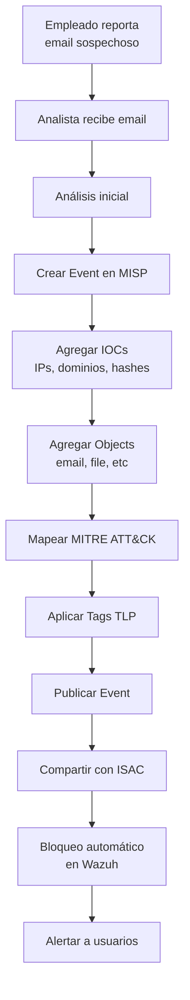
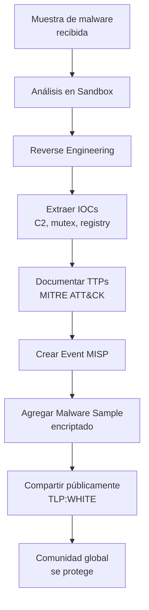
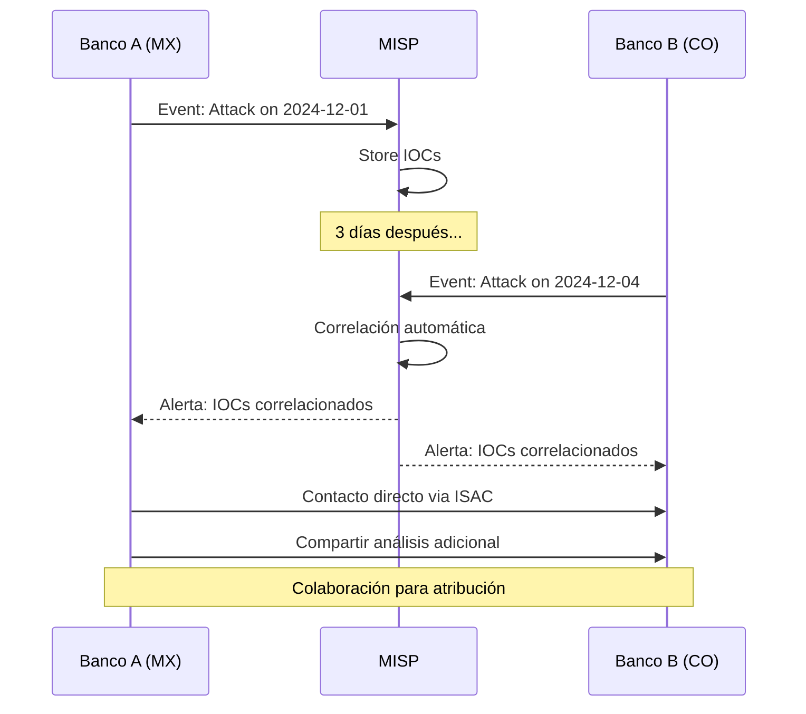
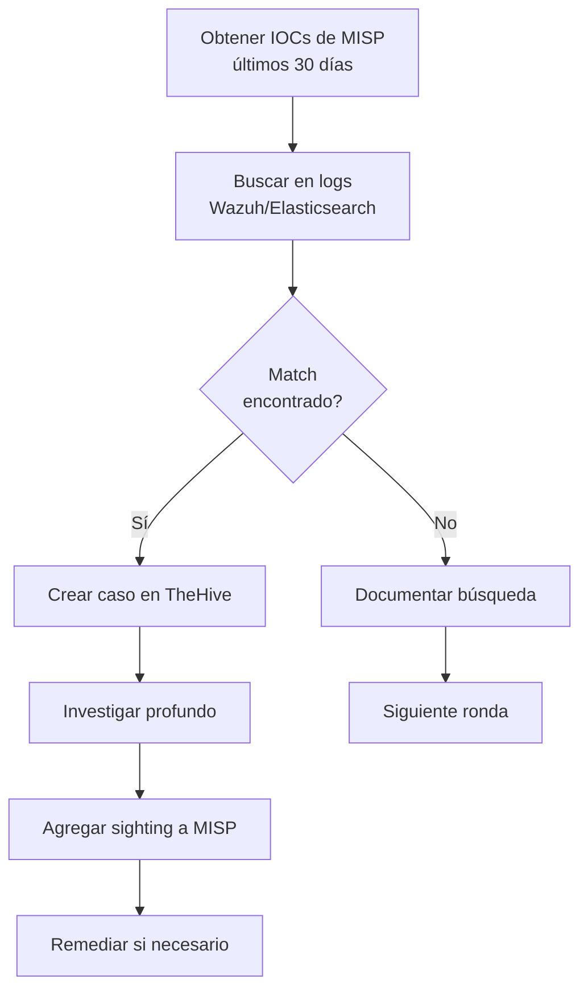

# Casos de Uso de MISP

## Introducción

Esta guía presenta **casos de uso reales y detallados** de cómo utilizar MISP en escenarios prácticos de ciberseguridad. Cada caso incluye descripción del escenario, flujo de trabajo, configuración técnica y ejemplos de código.

!!! info "Casos Cubiertos"
    1. Rastreo de Campaña de Phishing
    2. Análisis de Malware y Compartir IOCs
    3. Correlación de Ataques entre Organizaciones
    4. Integración con MITRE ATT&CK
    5. Threat Hunting con MISP

## Caso 1: Rastreo de Campaña de Phishing

### Escenario

Tu organización recibe reportes de múltiples empleados sobre emails sospechosos que se hacen pasar por el banco. Necesitas:

- Documentar la campaña de phishing
- Extraer todos los IOCs
- Compartir con otras organizaciones del sector financiero
- Bloquear futuras variantes de la campaña

### Contexto

```yaml
Organización: Banco Nacional
Sector: Financiero
Víctimas: 45 empleados reportaron emails
Vector: Email con adjunto malicioso
Objetivo del atacante: Robo de credenciales + malware bancario
```

### Flujo de Trabajo



### Paso 1: Análisis Inicial del Email

Extraer información del email de phishing:

```python
#!/usr/bin/env python3
# Archivo: analyze_phishing_email.py

import email
import hashlib
import re
from email import policy
from email.parser import BytesParser

def parse_email(email_file):
    """Parsear email y extraer IOCs"""

    with open(email_file, 'rb') as f:
        msg = BytesParser(policy=policy.default).parse(f)

    # Extraer headers
    headers = {
        'from': msg['From'],
        'to': msg['To'],
        'subject': msg['Subject'],
        'date': msg['Date'],
        'message-id': msg['Message-ID'],
        'return-path': msg['Return-Path'],
        'reply-to': msg.get('Reply-To', ''),
        'x-originating-ip': msg.get('X-Originating-IP', ''),
    }

    # Extraer cuerpo
    body = ''
    if msg.is_multipart():
        for part in msg.walk():
            if part.get_content_type() == 'text/plain':
                body += part.get_payload(decode=True).decode('utf-8', errors='ignore')
    else:
        body = msg.get_payload(decode=True).decode('utf-8', errors='ignore')

    # Extraer URLs del cuerpo
    urls = re.findall(r'http[s]?://(?:[a-zA-Z]|[0-9]|[$-_@.&+]|[!*\\(\\),]|(?:%[0-9a-fA-F][0-9a-fA-F]))+', body)

    # Extraer dominios de URLs
    domains = set(re.findall(r'https?://([^/]+)', url)[0] for url in urls if re.findall(r'https?://([^/]+)', url))

    # Extraer attachments
    attachments = []
    if msg.is_multipart():
        for part in msg.walk():
            if part.get_content_disposition() == 'attachment':
                filename = part.get_filename()
                data = part.get_payload(decode=True)

                # Calcular hashes
                md5 = hashlib.md5(data).hexdigest()
                sha1 = hashlib.sha1(data).hexdigest()
                sha256 = hashlib.sha256(data).hexdigest()

                attachments.append({
                    'filename': filename,
                    'size': len(data),
                    'md5': md5,
                    'sha1': sha1,
                    'sha256': sha256
                })

    return {
        'headers': headers,
        'body': body,
        'urls': list(urls),
        'domains': list(domains),
        'attachments': attachments
    }

# Uso
email_data = parse_email('phishing_email.eml')
print(f"From: {email_data['headers']['from']}")
print(f"Subject: {email_data['headers']['subject']}")
print(f"URLs: {email_data['urls']}")
print(f"Attachments: {len(email_data['attachments'])}")
```

### Paso 2: Crear Event en MISP

```python
#!/usr/bin/env python3
# Archivo: create_phishing_event.py

from pymisp import PyMISP, MISPEvent, MISPObject
from datetime import date

# Configuración
misp = PyMISP('https://misp.tu-empresa.com', 'API_KEY', True)

# Crear event
event = MISPEvent()
event.info = 'Phishing Campaign - Fake Bank Login - December 2024'
event.distribution = 1  # This community only (ISAC Financiero)
event.threat_level_id = 1  # High
event.analysis = 1  # Ongoing
event.date = date(2024, 12, 5)

# Tags
event.add_tag('tlp:amber')
event.add_tag('type:OSINT')
event.add_tag('phishing')
event.add_tag('misp-galaxy:sector="financial"')

# Agregar contexto
event.add_attribute('comment', value="""
Campaña de phishing dirigida al sector financiero mexicano.
Vector: Email con adjunto malicioso (supuesto PDF de factura).
Objetivo: Robo de credenciales bancarias + instalación de malware.
Afectados: Múltiples bancos reportan campaña similar.
Técnicas: Spoofing de dominio legítimo, ingeniería social.
""")

# Object: Email
email_obj = MISPObject('email')
email_obj.add_attribute('from', 'no-reply@banco-nacional-secure.com')
email_obj.add_attribute('to', 'victim@company.com')
email_obj.add_attribute('subject', 'URGENTE: Actualización de Seguridad de su Cuenta')
email_obj.add_attribute('reply-to', 'support@phishing-domain.com')
email_obj.add_attribute('email-body', '''
Estimado cliente,

Hemos detectado actividad sospechosa en su cuenta bancaria.
Por favor descargue y complete el formulario adjunto para verificar su identidad.

Si no responde en 24 horas, su cuenta será suspendida por seguridad.

Atentamente,
Departamento de Seguridad
Banco Nacional
''')
email_obj.comment = 'Email de phishing con attachment malicioso'
event.add_object(email_obj)

# Object: File (attachment)
file_obj = MISPObject('file')
file_obj.add_attribute('filename', 'Formulario_Verificacion.pdf.exe')
file_obj.add_attribute('size-in-bytes', 245760)
file_obj.add_attribute('md5', 'a1b2c3d4e5f6g7h8i9j0k1l2m3n4o5p6')
file_obj.add_attribute('sha1', 'q1r2s3t4u5v6w7x8y9z0a1b2c3d4e5f6g7h8i9j0')
file_obj.add_attribute('sha256', 'k1l2m3n4o5p6q7r8s9t0u1v2w3x4y5z6a7b8c9d0e1f2g3h4i5j6k7l8m9n0o1p2')
file_obj.add_attribute('mime-type', 'application/x-dosexec')
file_obj.comment = 'Malware disfrazado de PDF, en realidad es ejecutable'

# Relación: email contiene file
file_obj.add_reference(email_obj.uuid, 'attachment')
event.add_object(file_obj)

# Attributes individuales
# Dominio de phishing
event.add_attribute('domain', 'banco-nacional-secure.com', category='Network activity',
                    to_ids=True, comment='Dominio de phishing, typosquatting del banco legítimo')

# URL de phishing
event.add_attribute('url', 'http://banco-nacional-secure.com/login.php',
                    category='Network activity', to_ids=True,
                    comment='Página de phishing que imita login bancario')

# IP del servidor de phishing
event.add_attribute('ip-dst', '192.0.2.100', category='Network activity',
                    to_ids=True, comment='Servidor hosting el sitio de phishing')

# C2 del malware
event.add_attribute('ip-dst', '203.0.113.50', category='Network activity',
                    to_ids=True, comment='Servidor C2 del malware del attachment')

# Hashes adicionales
event.add_attribute('ssdeep', '3:AXGBicFlgVNhBGcL6wCrFQEv:AXGHsNhxLsr2C',
                    category='Payload delivery', to_ids=True,
                    comment='Fuzzy hash del malware')

# MITRE ATT&CK
event.add_galaxy_cluster({
    'collection_uuid': 'attack-pattern',
    'value': 'Phishing: Spearphishing Attachment - T1566.001'
})
event.add_galaxy_cluster({
    'collection_uuid': 'attack-pattern',
    'value': 'User Execution: Malicious File - T1204.002'
})

# Publicar event
result = misp.add_event(event, pythonify=True)
print(f"✅ Event creado: {result.id}")
print(f"URL: https://misp.tu-empresa.com/events/view/{result.id}")
```

### Paso 3: Compartir con ISAC Financiero

```python
# Configurar sharing group
event = misp.get_event(result.id, pythonify=True)
event.distribution = 4  # Sharing Group
event.sharing_group_id = 5  # ID del "ISAC Financiero Mexico"
misp.update_event(event)

print("✅ Event compartido con ISAC Financiero")
```

### Paso 4: Bloqueo Automático en Wazuh

```bash
# El script misp_to_wazuh.py (ver integration-stack.md) exporta automáticamente
# los IOCs a Wazuh CDB lists

# Verificar que IOCs fueron exportados
grep "banco-nacional-secure.com" /var/ossec/etc/lists/misp-domain-blacklist
grep "192.0.2.100" /var/ossec/etc/lists/misp-ip-blacklist

# Wazuh ahora alertará si algún empleado accede a estos IOCs
```

### Paso 5: Alertar a Usuarios

```python
#!/usr/bin/env python3
# Enviar alerta a usuarios sobre la campaña

import smtplib
from email.mime.text import MIMEText
from email.mime.multipart import MIMEMultipart

def send_alert():
    msg = MIMEMultipart()
    msg['From'] = 'security@banco-nacional.com'
    msg['To'] = 'all-employees@banco-nacional.com'
    msg['Subject'] = 'ALERTA: Campaña de Phishing Activa'

    body = """
Estimados colaboradores,

Hemos detectado una campaña activa de phishing dirigida a nuestro banco.

CARACTERÍSTICAS DEL EMAIL MALICIOSO:
- Asunto: "URGENTE: Actualización de Seguridad de su Cuenta"
- Remitente: no-reply@banco-nacional-secure.com (DOMINIO FALSO)
- Contiene adjunto: "Formulario_Verificacion.pdf.exe"

ACCIONES A TOMAR:
1. NO abrir emails con estas características
2. NO descargar el adjunto
3. Reportar inmediatamente a security@banco-nacional.com
4. Si ya descargó el adjunto, DESCONECTE su equipo de la red y contacte IT

Recuerde: El banco NUNCA solicita información sensible por email.

Atentamente,
Equipo de Seguridad
    """

    msg.attach(MIMEText(body, 'plain'))

    # Enviar
    server = smtplib.SMTP('smtp.banco-nacional.com', 587)
    server.starttls()
    server.login('security@banco-nacional.com', 'password')
    server.send_message(msg)
    server.quit()

send_alert()
```

### Resultados

```yaml
Event ID: 123
IOCs Documentados: 15
  - IPs: 2
  - Dominios: 1
  - URLs: 1
  - Hashes: 3
  - Objects: 2 (email, file)

Compartido con: ISAC Financiero (12 organizaciones)
Bloqueos automáticos: Wazuh + Firewall
Empleados alertados: 500+

Impacto: Campaña neutralizada en 2 horas
```

## Caso 2: Análisis de Malware y Compartir IOCs

### Escenario

Tu equipo de malware analysis recibe una muestra de ransomware. Necesitas:

- Analizar el malware en sandbox
- Documentar comportamiento y IOCs
- Compartir hallazgos con la comunidad global
- Ayudar a otras organizaciones a protegerse

### Contexto

```yaml
Malware: LockBit 3.0 Ransomware
Vector: Phishing con macro de Office
Familia: Ransomware-as-a-Service (RaaS)
Rescate: 1 millón USD en Bitcoin
Análisis: Sandbox + Reverse Engineering
```

### Flujo de Trabajo



### Paso 1: Análisis en Sandbox

```python
#!/usr/bin/env python3
# Resultados de sandbox (ejemplo simplificado)

sandbox_results = {
    'sample': {
        'filename': 'invoice.doc',
        'md5': 'a1b2c3d4e5f6g7h8i9j0k1l2m3n4o5p6',
        'sha1': 'q1r2s3t4u5v6w7x8y9z0a1b2c3d4e5f6g7h8i9j0',
        'sha256': 'k1l2m3n4o5p6q7r8s9t0u1v2w3x4y5z6a7b8c9d0e1f2g3h4i5j6k7l8m9n0o1p2',
        'size': 1024000,
        'type': 'Office Document with Macro'
    },
    'network': {
        'dns': ['c2-server.evil.com', 'backup-c2.malicious.net'],
        'ips': ['192.0.2.100', '192.0.2.101', '203.0.113.50'],
        'urls': ['http://192.0.2.100/payload.exe', 'http://c2-server.evil.com/gate.php']
    },
    'behavior': {
        'files_created': [
            'C:\\Users\\Public\\readme.txt',
            'C:\\ProgramData\\lockbit.exe'
        ],
        'files_encrypted': 1523,
        'registry_keys': [
            'HKLM\\SOFTWARE\\Microsoft\\Windows\\CurrentVersion\\Run\\LockBit',
            'HKLM\\SOFTWARE\\LockBit\\Config'
        ],
        'mutex': 'Global\\LockBit3.0_Mutex',
        'processes_created': ['powershell.exe', 'cmd.exe', 'vssadmin.exe']
    },
    'ransom_note': '''
Your files have been encrypted by LockBit 3.0.
To recover your data, you must pay 1,000,000 USD in Bitcoin.
Visit: http://lockbit3xxxxxxxxxxxxx.onion
Decryption ID: ABC123XYZ789
'''
}
```

### Paso 2: Crear Event Completo en MISP

```python
#!/usr/bin/env python3
from pymisp import PyMISP, MISPEvent, MISPObject

misp = PyMISP('https://misp.tu-empresa.com', 'API_KEY', True)

# Event
event = MISPEvent()
event.info = 'LockBit 3.0 Ransomware - Complete Analysis'
event.distribution = 3  # All communities
event.threat_level_id = 1  # High
event.analysis = 2  # Completed
event.add_tag('tlp:white')
event.add_tag('malware:lockbit')
event.add_tag('type:malware-analysis')

# Contexto del análisis
event.add_attribute('comment', value="""
ANÁLISIS COMPLETO DE LOCKBIT 3.0 RANSOMWARE

Vector de Infección:
- Documento Office con macro maliciosa
- Usuario ejecuta macro, descarga payload

Comportamiento:
- Exfiltración de datos antes de encriptar (double extortion)
- Encriptación de archivos con ChaCha20
- Eliminación de shadow copies
- Persistencia via registry
- C2 communication via HTTP/HTTPS

Rescate:
- 1,000,000 USD en Bitcoin
- Sitio onion para negociación
- Amenaza de publicar datos si no se paga

Familia: LockBit 3.0 (Ransomware-as-a-Service)
Análisis por: SOC Team - Banco Nacional
Fecha: 2024-12-05
""")

# Object: File (muestra original)
file_obj = MISPObject('file')
file_obj.add_attribute('filename', sandbox_results['sample']['filename'])
file_obj.add_attribute('size-in-bytes', sandbox_results['sample']['size'])
file_obj.add_attribute('md5', sandbox_results['sample']['md5'])
file_obj.add_attribute('sha1', sandbox_results['sample']['sha1'])
file_obj.add_attribute('sha256', sandbox_results['sample']['sha256'])
file_obj.add_attribute('mime-type', 'application/msword')
file_obj.comment = 'Documento Office con macro maliciosa que descarga ransomware'
event.add_object(file_obj)

# Agregar malware sample (encriptado con GPG)
# with open('invoice.doc', 'rb') as f:
#     event.add_attribute('malware-sample', value=f.read(),
#                         comment='Muestra de malware (encriptada)', to_ids=False)

# Network IOCs
for ip in sandbox_results['network']['ips']:
    event.add_attribute('ip-dst', ip, category='Network activity', to_ids=True,
                        comment='Servidor C2 de LockBit')

for domain in sandbox_results['network']['dns']:
    event.add_attribute('domain', domain, category='Network activity', to_ids=True,
                        comment='Dominio C2 de LockBit')

for url in sandbox_results['network']['urls']:
    event.add_attribute('url', url, category='Network activity', to_ids=True,
                        comment='URL de descarga de payload')

# Behavior IOCs
event.add_attribute('mutex', sandbox_results['behavior']['mutex'],
                    category='Artifacts dropped', to_ids=True,
                    comment='Mutex único del ransomware')

for regkey in sandbox_results['behavior']['registry_keys']:
    event.add_attribute('regkey', regkey, category='Persistence mechanism',
                        to_ids=True, comment='Clave de registro para persistencia')

# Ransom note
event.add_attribute('text', sandbox_results['ransom_note'],
                    category='Artifacts dropped', to_ids=False,
                    comment='Nota de rescate dejada por el ransomware')

# MITRE ATT&CK Mapping
attack_techniques = {
    'T1566.001': 'Phishing: Spearphishing Attachment',
    'T1204.002': 'User Execution: Malicious File',
    'T1059.001': 'Command and Scripting Interpreter: PowerShell',
    'T1112': 'Modify Registry',
    'T1486': 'Data Encrypted for Impact',
    'T1490': 'Inhibit System Recovery',
    'T1489': 'Service Stop',
    'T1071.001': 'Application Layer Protocol: Web Protocols',
}

for tech_id, tech_name in attack_techniques.items():
    event.add_galaxy_cluster({
        'collection_uuid': 'attack-pattern',
        'value': f'{tech_name} - {tech_id}'
    })

# Threat Actor
event.add_galaxy_cluster({
    'collection_uuid': 'threat-actor',
    'value': 'LockBit'
})

# Publicar
result = misp.add_event(event, pythonify=True)
print(f"✅ Event creado: {result.id}")
print(f"✅ Compartido con comunidad global (TLP:WHITE)")
```

### Paso 3: Generar Regla YARA

```python
#!/usr/bin/env python3
# Generar regla YARA para el malware

yara_rule = """
rule LockBit_3_0_Ransomware {
    meta:
        description = "Detects LockBit 3.0 Ransomware"
        author = "SOC Team - Banco Nacional"
        date = "2024-12-05"
        misp_event = "123"
        reference = "https://misp.tu-empresa.com/events/view/123"

    strings:
        $mutex = "Global\\\\LockBit3.0_Mutex" wide ascii
        $ransom_note = "Your files have been encrypted by LockBit" wide ascii
        $c2_1 = "c2-server.evil.com" wide ascii
        $reg_key = "HKLM\\\\SOFTWARE\\\\LockBit" wide ascii

        $code_1 = { 48 8B 45 ?? 48 89 C1 E8 ?? ?? ?? ?? 90 48 8B 45 }
        $code_2 = { 55 48 89 E5 48 83 EC 20 48 89 4D 10 48 8B 45 }

    condition:
        uint16(0) == 0x5A4D and
        filesize < 5MB and
        (
            $mutex or
            ($ransom_note and $c2_1) or
            (2 of ($code_*) and $reg_key)
        )
}
"""

# Agregar regla YARA al event
event = misp.get_event(result.id, pythonify=True)
event.add_attribute('yara', yara_rule, category='Payload delivery',
                    to_ids=True, comment='Regla YARA para detección de LockBit 3.0')
misp.update_event(event)

print("✅ Regla YARA agregada al event")
```

### Resultados

```yaml
Event ID: 124
Distribución: Pública (TLP:WHITE)
IOCs Compartidos: 25+
  - Hashes: 3
  - IPs: 3
  - Dominios: 2
  - URLs: 2
  - Mutex: 1
  - Registry Keys: 2
  - YARA Rule: 1

Técnicas MITRE: 8
Comunidad Beneficiada: Global (1000+ organizaciones)

Impacto: Múltiples organizaciones bloquearon los IOCs proactivamente
```

## Caso 3: Correlación de Ataques entre Organizaciones

### Escenario

Dos bancos diferentes detectan ataques similares con días de diferencia. MISP correlaciona automáticamente los IOCs y revela que es la misma campaña.

### Contexto

```yaml
Organización A: Banco Nacional (México)
Organización B: Banco Internacional (Colombia)
Diferencia temporal: 3 días
IOCs en común: 5 IPs, 2 dominios, 1 hash
Actor: APT28 (sospechado)
```

### Flujo



### Banco A: Primer Ataque

```python
# Banco A crea event
event_a = MISPEvent()
event_a.info = 'Targeted Attack - Banking Infrastructure - Dec 1'
event_a.distribution = 1  # Community
event_a.threat_level_id = 1
event_a.add_tag('tlp:amber')
event_a.add_tag('target:financial')

# IOCs
iocs_a = [
    ('ip-dst', '192.0.2.100', 'C2 server'),
    ('ip-dst', '192.0.2.101', 'Exfiltration server'),
    ('domain', 'update-server.tech', 'Malicious domain'),
    ('sha256', 'abc123...', 'Backdoor malware'),
]

for ioc_type, ioc_value, comment in iocs_a:
    event_a.add_attribute(ioc_type, ioc_value, to_ids=True, comment=comment)

misp.add_event(event_a)
```

### Banco B: Segundo Ataque (3 días después)

```python
# Banco B crea event
event_b = MISPEvent()
event_b.info = 'Suspicious Activity - Server Compromise - Dec 4'
event_b.distribution = 1  # Community
event_b.threat_level_id = 1
event_b.add_tag('tlp:amber')
event_b.add_tag('target:financial')

# IOCs (ALGUNOS COMUNES CON BANCO A)
iocs_b = [
    ('ip-dst', '192.0.2.100', 'Suspicious outbound connection'),  # COMÚN
    ('ip-dst', '192.0.2.101', 'Data exfiltration detected'),      # COMÚN
    ('ip-dst', '203.0.113.50', 'Additional C2'),
    ('domain', 'update-server.tech', 'Malicious domain'),         # COMÚN
    ('sha256', 'abc123...', 'Malware sample'),                    # COMÚN
    ('sha256', 'def456...', 'Second stage payload'),
]

for ioc_type, ioc_value, comment in iocs_b:
    event_b.add_attribute(ioc_type, ioc_value, to_ids=True, comment=comment)

result_b = misp.add_event(event_b)
```

### MISP: Correlación Automática

```python
# MISP automáticamente detecta correlaciones
# Ver correlaciones del event de Banco B
correlations = misp.get_event_correlations(result_b.id)

print(f"Correlaciones encontradas: {len(correlations)}")
for corr in correlations:
    print(f"  Event {corr['Event']['id']}: {corr['Event']['info']}")
    print(f"    Org: {corr['Event']['Org']['name']}")
    print(f"    IOC común: {corr['Attribute']['value']}")
```

### Analistas: Investigación Colaborativa

```python
#!/usr/bin/env python3
# Script para analizar correlaciones

def analyze_correlation(event_a_id, event_b_id):
    """Analizar correlaciones entre dos events"""

    event_a = misp.get_event(event_a_id, pythonify=True)
    event_b = misp.get_event(event_b_id, pythonify=True)

    # Extraer IOCs de ambos events
    iocs_a = set((attr.type, attr.value) for attr in event_a.attributes)
    iocs_b = set((attr.type, attr.value) for attr in event_b.attributes)

    # IOCs en común
    common_iocs = iocs_a & iocs_b

    print(f"=== Análisis de Correlación ===")
    print(f"Event A: {event_a.info} (Org: {event_a.Org.name})")
    print(f"Event B: {event_b.info} (Org: {event_b.Org.name})")
    print(f"\nIOCs en común: {len(common_iocs)}")
    for ioc_type, ioc_value in common_iocs:
        print(f"  - {ioc_type}: {ioc_value}")

    # Análisis temporal
    date_diff = abs((event_a.date - event_b.date).days)
    print(f"\nDiferencia temporal: {date_diff} días")

    # Análisis de técnicas
    techniques_a = set(gc.value for gc in event_a.galaxies if 'attack-pattern' in gc.type)
    techniques_b = set(gc.value for gc in event_b.galaxies if 'attack-pattern' in gc.type)
    common_techniques = techniques_a & techniques_b

    print(f"\nTécnicas ATT&CK en común: {len(common_techniques)}")
    for tech in common_techniques:
        print(f"  - {tech}")

    # Conclusión
    if len(common_iocs) >= 3 and date_diff <= 7:
        print("\n🚨 CONCLUSIÓN: Alta probabilidad de ser la misma campaña")
        print("   Recomendación: Colaborar con la otra organización para atribución")
    else:
        print("\n⚠️  CONCLUSIÓN: Posible relación, requiere más análisis")

analyze_correlation(event_a.id, event_b.id)
```

### Proposal: Enriquecimiento Mutuo

```python
# Banco A propone agregar información adicional al event de Banco B
proposal = {
    'event_id': event_b.id,
    'type': 'comment',
    'category': 'Other',
    'value': '''
Desde Banco Nacional (México) observamos el mismo patrón de ataque 3 días antes.

Información adicional de nuestro análisis:
- Actor sospechado: APT28 (basado en TTPs y infraestructura)
- Vector inicial: Phishing con credenciales comprometidas
- Objetivo: Exfiltración de datos de clientes
- Técnicas de evasión: DLL side-loading, living-off-the-land

Sugerimos coordinar respuesta y compartir más detalles vía canal seguro.
Contacto: soc@banconacional.com (PGP key disponible)
    ''',
    'comment': 'Análisis complementario de incidente correlacionado'
}

misp.add_attribute_proposal(event_b.id, proposal)
print("✅ Proposal enviada a Banco B")
```

### Resultados

```yaml
Correlaciones Encontradas: 5 IOCs comunes
Organizaciones Involucradas: 2 (posiblemente más)
Tiempo de Detección: 3 días

Acciones Tomadas:
  - Colaboración directa entre organizaciones
  - Compartir análisis adicional
  - Atribución conjunta (APT28)
  - Medidas defensivas coordinadas

Impacto:
  - Detección más rápida de campaña coordinada
  - Mejor comprensión del atacante
  - Respuesta más efectiva
```

## Caso 4: Integración con MITRE ATT&CK

### Escenario

Documentar un ataque completo mapeando todas las técnicas MITRE ATT&CK para mejorar defensas.

### Contexto

```yaml
Incidente: Compromiso completo de red corporativa
Duración: 45 días (dwell time)
Vector: Phishing → Movimiento lateral → Exfiltración
Objetivo: Robo de propiedad intelectual
```

### Kill Chain Completo

```python
#!/usr/bin/env python3
# Documentar kill chain completo con MITRE ATT&CK

event = MISPEvent()
event.info = 'APT Campaign - Complete Kill Chain - IP Theft'
event.distribution = 1
event.threat_level_id = 1
event.analysis = 2
event.add_tag('tlp:amber')
event.add_tag('apt')

# Fase 1: Initial Access (T1566.001)
email_obj = MISPObject('email')
email_obj.add_attribute('from', 'hr@phishing-domain.com')
email_obj.add_attribute('subject', 'New Benefits Package 2024')
email_obj.add_attribute('attachment', 'benefits.doc')
event.add_object(email_obj)
event.add_galaxy_cluster({'collection_uuid': 'attack-pattern', 'value': 'Phishing: Spearphishing Attachment - T1566.001'})

# Fase 2: Execution (T1204.002, T1059.001)
event.add_attribute('comment', 'Usuario ejecuta macro maliciosa que descarga payload')
event.add_galaxy_cluster({'collection_uuid': 'attack-pattern', 'value': 'User Execution: Malicious File - T1204.002'})
event.add_galaxy_cluster({'collection_uuid': 'attack-pattern', 'value': 'Command and Scripting Interpreter: PowerShell - T1059.001'})

# Fase 3: Persistence (T1547.001)
event.add_attribute('regkey', 'HKLM\\SOFTWARE\\Microsoft\\Windows\\CurrentVersion\\Run\\UpdateService',
                    category='Persistence mechanism', to_ids=True)
event.add_galaxy_cluster({'collection_uuid': 'attack-pattern', 'value': 'Boot or Logon Autostart Execution: Registry Run Keys - T1547.001'})

# Fase 4: Privilege Escalation (T1055, T1078)
event.add_attribute('comment', 'Escalación de privilegios via process injection y uso de credenciales comprometidas')
event.add_galaxy_cluster({'collection_uuid': 'attack-pattern', 'value': 'Process Injection - T1055'})
event.add_galaxy_cluster({'collection_uuid': 'attack-pattern', 'value': 'Valid Accounts - T1078'})

# Fase 5: Defense Evasion (T1027, T1070.004)
event.add_attribute('comment', 'Malware ofuscado + eliminación de logs de eventos')
event.add_galaxy_cluster({'collection_uuid': 'attack-pattern', 'value': 'Obfuscated Files or Information - T1027'})
event.add_galaxy_cluster({'collection_uuid': 'attack-pattern', 'value': 'Indicator Removal: File Deletion - T1070.004'})

# Fase 6: Credential Access (T1003.001)
event.add_attribute('comment', 'Dumping de credenciales via Mimikatz')
event.add_galaxy_cluster({'collection_uuid': 'attack-pattern', 'value': 'OS Credential Dumping: LSASS Memory - T1003.001'})

# Fase 7: Discovery (T1087, T1018)
event.add_attribute('comment', 'Reconocimiento de red y enumeración de usuarios')
event.add_galaxy_cluster({'collection_uuid': 'attack-pattern', 'value': 'Account Discovery - T1087'})
event.add_galaxy_cluster({'collection_uuid': 'attack-pattern', 'value': 'Remote System Discovery - T1018'})

# Fase 8: Lateral Movement (T1021.001)
event.add_attribute('comment', 'Movimiento lateral via RDP con credenciales robadas')
event.add_galaxy_cluster({'collection_uuid': 'attack-pattern', 'value': 'Remote Services: Remote Desktop Protocol - T1021.001'})

# Fase 9: Collection (T1560)
event.add_attribute('comment', 'Compresión de archivos de propiedad intelectual')
event.add_galaxy_cluster({'collection_uuid': 'attack-pattern', 'value': 'Archive Collected Data - T1560'})

# Fase 10: Exfiltration (T1041)
event.add_attribute('ip-dst', '203.0.113.50', category='Network activity', to_ids=True,
                    comment='Servidor de exfiltración - 50GB transferidos')
event.add_galaxy_cluster({'collection_uuid': 'attack-pattern', 'value': 'Exfiltration Over C2 Channel - T1041'})

# Publicar
result = misp.add_event(event, pythonify=True)
print(f"✅ Event con kill chain completo creado: {result.id}")
```

### Visualización en ATT&CK Navigator

```python
# Exportar a ATT&CK Navigator format
import json

navigator_layer = {
    "name": "APT Campaign - IP Theft",
    "versions": {
        "attack": "13",
        "navigator": "4.8.0",
        "layer": "4.4"
    },
    "domain": "enterprise-attack",
    "description": "Complete kill chain of APT campaign targeting intellectual property",
    "techniques": [
        {"techniqueID": "T1566.001", "color": "#ff6666", "comment": "Initial Access"},
        {"techniqueID": "T1204.002", "color": "#ff6666", "comment": "Execution"},
        {"techniqueID": "T1059.001", "color": "#ff6666", "comment": "Execution"},
        {"techniqueID": "T1547.001", "color": "#ffaa66", "comment": "Persistence"},
        {"techniqueID": "T1055", "color": "#ffaa66", "comment": "Privilege Escalation"},
        {"techniqueID": "T1078", "color": "#ffaa66", "comment": "Privilege Escalation"},
        {"techniqueID": "T1027", "color": "#ffcc66", "comment": "Defense Evasion"},
        {"techniqueID": "T1070.004", "color": "#ffcc66", "comment": "Defense Evasion"},
        {"techniqueID": "T1003.001", "color": "#ffff66", "comment": "Credential Access"},
        {"techniqueID": "T1087", "color": "#ccff66", "comment": "Discovery"},
        {"techniqueID": "T1018", "color": "#ccff66", "comment": "Discovery"},
        {"techniqueID": "T1021.001", "color": "#66ff66", "comment": "Lateral Movement"},
        {"techniqueID": "T1560", "color": "#66ffcc", "comment": "Collection"},
        {"techniqueID": "T1041", "color": "#6666ff", "comment": "Exfiltration"},
    ]
}

with open('attack_layer.json', 'w') as f:
    json.dump(navigator_layer, f, indent=2)

print("✅ Exportado a ATT&CK Navigator: attack_layer.json")
print("Visualiza en: https://mitre-attack.github.io/attack-navigator/")
```

### Resultados

```yaml
Event ID: 126
Fases del Kill Chain: 10
Técnicas MITRE: 14
Visualización: ATT&CK Navigator

Uso:
  - Documentación de incidente
  - Entrenamiento de analistas
  - Gap analysis de controles
  - Priorización de defensas
```

## Caso 5: Threat Hunting con MISP

### Escenario

Búsqueda proactiva de amenazas en la red usando IOCs históricos de MISP.

### Flujo



### Script de Threat Hunting

```python
#!/usr/bin/env python3
# Archivo: threat_hunting_misp.py

from pymisp import PyMISP
from elasticsearch import Elasticsearch
from datetime import datetime, timedelta
import json

# Configuración
MISP_URL = 'https://misp.tu-empresa.com'
MISP_KEY = 'API_KEY'
ES_HOST = 'https://elasticsearch:9200'

def get_iocs_from_misp(days=30):
    """Obtener IOCs de MISP para threat hunting"""
    misp = PyMISP(MISP_URL, MISP_KEY, True)

    date_from = (datetime.now() - timedelta(days=days)).strftime('%Y-%m-%d')

    result = misp.search(
        controller='attributes',
        type_attribute=['ip-dst', 'domain', 'url', 'md5', 'sha256'],
        to_ids=1,
        date_from=date_from,
        published=True,
        pythonify=True
    )

    # Organizar por tipo
    iocs = {'ips': [], 'domains': [], 'urls': [], 'hashes': []}
    for attr in result:
        if attr.type in ['ip-dst', 'ip-src']:
            iocs['ips'].append(attr.value)
        elif attr.type == 'domain':
            iocs['domains'].append(attr.value)
        elif attr.type == 'url':
            iocs['urls'].append(attr.value)
        elif attr.type in ['md5', 'sha1', 'sha256']:
            iocs['hashes'].append(attr.value)

    return iocs

def hunt_in_logs(iocs, days=7):
    """Buscar IOCs en logs de Wazuh/Elasticsearch"""
    es = Elasticsearch([ES_HOST])

    results = {'ips': [], 'domains': [], 'urls': [], 'hashes': []}

    # Buscar IPs
    for ip in iocs['ips']:
        query = {
            'query': {
                'bool': {
                    'should': [
                        {'match': {'data.srcip': ip}},
                        {'match': {'data.dstip': ip}},
                    ],
                    'minimum_should_match': 1
                }
            },
            'size': 100
        }

        res = es.search(index='wazuh-alerts-*', body=query)
        if res['hits']['total']['value'] > 0:
            results['ips'].append({
                'ioc': ip,
                'hits': res['hits']['total']['value'],
                'samples': res['hits']['hits'][:5]
            })

    # Similar para domains, urls, hashes...

    return results

def create_thehive_cases(matches):
    """Crear casos en TheHive para matches encontrados"""
    # Implementación con API de TheHive
    pass

def add_sightings_to_misp(matches):
    """Agregar sightings a MISP para IOCs confirmados"""
    misp = PyMISP(MISP_URL, MISP_KEY, True)

    for match_type, match_list in matches.items():
        for match in match_list:
            # Buscar attribute ID
            result = misp.search(
                controller='attributes',
                value=match['ioc'],
                pythonify=True
            )

            if result:
                attr_id = result[0].id
                sighting = {
                    'type': '0',  # Confirmed sighting
                    'source': 'Threat Hunting Team',
                    'timestamp': int(datetime.now().timestamp())
                }
                misp.add_sighting(sighting, attr_id)
                print(f"✅ Sighting agregado para {match['ioc']}")

def main():
    print("=== Threat Hunting con MISP ===")
    print(f"Fecha: {datetime.now()}\n")

    # 1. Obtener IOCs de MISP
    print("1. Obteniendo IOCs de MISP (últimos 30 días)...")
    iocs = get_iocs_from_misp(days=30)
    print(f"   IOCs obtenidos: IPs={len(iocs['ips'])}, Domains={len(iocs['domains'])}, Hashes={len(iocs['hashes'])}\n")

    # 2. Buscar en logs
    print("2. Buscando IOCs en logs (últimos 7 días)...")
    matches = hunt_in_logs(iocs, days=7)

    total_matches = sum(len(m) for m in matches.values())
    print(f"   Matches encontrados: {total_matches}\n")

    if total_matches > 0:
        # 3. Crear casos
        print("3. Creando casos en TheHive...")
        create_thehive_cases(matches)

        # 4. Agregar sightings
        print("4. Agregando sightings a MISP...")
        add_sightings_to_misp(matches)

        # 5. Reporte
        print("\n=== REPORTE DE THREAT HUNTING ===")
        for match_type, match_list in matches.items():
            if match_list:
                print(f"\n{match_type.upper()}:")
                for match in match_list:
                    print(f"  - {match['ioc']}: {match['hits']} hits")
                    print(f"    Ejemplos:")
                    for sample in match['samples'][:2]:
                        print(f"      {sample['_source']['timestamp']}: {sample['_source']['rule']['description']}")
    else:
        print("✅ No se encontraron matches. Red limpia.\n")

if __name__ == '__main__':
    main()
```

### Resultados

```yaml
Threat Hunting Session:
  IOCs Buscados: 1,523
  Matches Encontrados: 7
    - IPs: 3
    - Dominios: 2
    - Hashes: 2

  Casos Creados en TheHive: 7
  Sightings Agregados a MISP: 7

  Tiempo de Ejecución: 15 minutos
  Frecuencia: Semanal

  Valor: Detección proactiva de amenazas que pasaron IDS
```

## Resumen de Casos de Uso

| Caso | Objetivo | Distribución | Comunidad | Impacto |
|------|----------|--------------|-----------|---------|
| **Phishing** | Documentar + Proteger | Community | ISAC Financiero | Campaña neutralizada 2h |
| **Malware Analysis** | Análisis + Compartir | Público | Global | 1000+ orgs beneficiadas |
| **Correlación** | Colaboración | Community | Multi-org | Atribución conjunta |
| **MITRE ATT&CK** | Documentación | Internal/Community | Sector | Gap analysis completo |
| **Threat Hunting** | Detección Proactiva | Internal | Interna | 7 amenazas detectadas |

## Próximos Pasos

Ahora que has visto casos reales:

1. **[API Reference](api-reference.md)** - Automatiza tus propios casos de uso
2. Implementa estos casos en tu organización
3. Comparte tus propios casos con la comunidad

---

!!! success "Casos de Uso Implementados"
    Estos casos demuestran el poder de MISP:

    - ✅ Documentación estructurada de amenazas
    - ✅ Compartir inteligente con la comunidad
    - ✅ Correlación automática de ataques
    - ✅ Integración con frameworks estándar
    - ✅ Detección proactiva de amenazas

**¡Ahora puedes implementar MISP efectivamente en tu SOC!**
