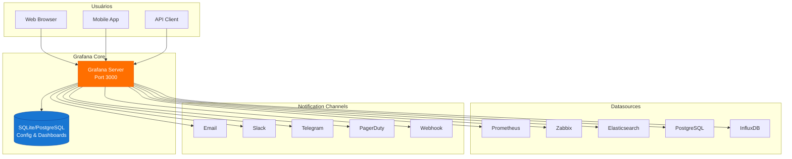
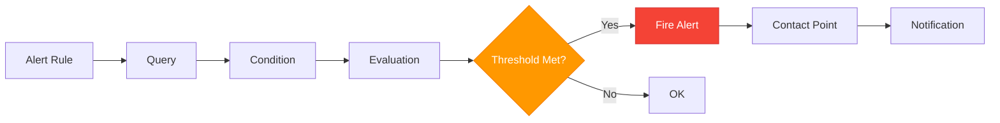

# Grafana e Dashboards

## Introdução

O **Grafana** é a plataforma de visualização e análise de métricas mais popular do mundo, usada por milhões de usuários para criar dashboards interativos e elegantes. É a ferramenta padrão para visualizar dados do Prometheus, Zabbix, Elasticsearch e dezenas de outras fontes de dados.

Neste guia, você aprenderá a instalar o Grafana, configurar datasources e criar dashboards profissionais para a stack **NEO_NETBOX_ODOO**.

---

## O Que é Grafana

### Características Principais

```yaml
Visualização:
  - Gráficos de linha, barras, gauge, heatmaps
  - Tabelas interativas
  - Stat panels (single values)
  - Alertas visuais
  - Anotações e eventos
  - Variáveis e templating

Datasources Suportados:
  - Prometheus (nativo)
  - Zabbix (plugin)
  - Elasticsearch (nativo)
  - PostgreSQL, MySQL
  - InfluxDB
  - CloudWatch, Azure Monitor
  - Google Cloud Monitoring
  - Graphite, OpenTSDB
  - +100 via plugins

Recursos Enterprise:
  - RBAC granular
  - Dashboards em pastas
  - Playlists
  - Anotações
  - Alerting unificado (Grafana 8+)
  - Reporting (PDF, imagens)
  - Dashboard versionamento
  - Provisioning (GitOps)
```

### Arquitetura



---

## Instalação via Docker Compose

### Estrutura de Diretórios

```bash
mkdir -p /opt/neostack/grafana/{data,dashboards,provisioning/{datasources,dashboards,notifiers,plugins}}
cd /opt/neostack/grafana
```

```
/opt/neostack/grafana/
├── docker-compose.yml
├── .env
├── grafana.ini                    # Configuração customizada
├── data/                          # Dados persistentes (SQLite)
├── dashboards/                    # Dashboards JSON
│   ├── system/
│   │   ├── node-exporter.json
│   │   └── docker.json
│   ├── applications/
│   │   ├── odoo.json
│   │   ├── netbox.json
│   │   └── wazuh.json
│   └── databases/
│       ├── postgresql.json
│       └── redis.json
└── provisioning/
    ├── datasources/
    │   └── datasources.yml
    ├── dashboards/
    │   └── dashboards.yml
    └── notifiers/
        └── notifiers.yml
```

### Arquivo .env

```bash
cat > .env << 'EOF'
# Grafana Version
GRAFANA_VERSION=10.2.3

# Ports
GRAFANA_PORT=3000

# Admin credentials (CHANGE IN PRODUCTION!)
GF_SECURITY_ADMIN_USER=admin
GF_SECURITY_ADMIN_PASSWORD=admin_change_me_in_production

# Database (SQLite default, ou PostgreSQL)
GF_DATABASE_TYPE=sqlite3
# GF_DATABASE_TYPE=postgres
# GF_DATABASE_HOST=postgres:5432
# GF_DATABASE_NAME=grafana
# GF_DATABASE_USER=grafana
# GF_DATABASE_PASSWORD=grafana_password

# Server
GF_SERVER_ROOT_URL=https://grafana.empresa.local
GF_SERVER_DOMAIN=grafana.empresa.local

# Security
GF_SECURITY_SECRET_KEY=generate_a_long_random_string_here

# Auth
GF_AUTH_ANONYMOUS_ENABLED=false
GF_AUTH_DISABLE_LOGIN_FORM=false

# SMTP (optional)
GF_SMTP_ENABLED=true
GF_SMTP_HOST=smtp.gmail.com:587
GF_SMTP_USER=grafana@empresa.com
GF_SMTP_PASSWORD=sua_senha_smtp
GF_SMTP_FROM_ADDRESS=grafana@empresa.com
GF_SMTP_FROM_NAME=Grafana NEO Stack

# Plugins
GF_INSTALL_PLUGINS=alexanderzobnin-zabbix-app,grafana-clock-panel,grafana-piechart-panel

# Network
NETWORK_NAME=monitoring
EOF
```

### Docker Compose File

```yaml
cat > docker-compose.yml << 'EOF'
version: '3.8'

networks:
  monitoring:
    external: true

volumes:
  grafana-data:
    driver: local

services:
  grafana:
    image: grafana/grafana:${GRAFANA_VERSION}
    container_name: grafana
    restart: unless-stopped
    user: "472"  # Grafana user ID
    environment:
      # Admin
      - GF_SECURITY_ADMIN_USER=${GF_SECURITY_ADMIN_USER}
      - GF_SECURITY_ADMIN_PASSWORD=${GF_SECURITY_ADMIN_PASSWORD}
      - GF_SECURITY_SECRET_KEY=${GF_SECURITY_SECRET_KEY}

      # Server
      - GF_SERVER_ROOT_URL=${GF_SERVER_ROOT_URL}
      - GF_SERVER_DOMAIN=${GF_SERVER_DOMAIN}
      - GF_SERVER_HTTP_PORT=3000

      # Database
      - GF_DATABASE_TYPE=${GF_DATABASE_TYPE}

      # Auth
      - GF_AUTH_ANONYMOUS_ENABLED=${GF_AUTH_ANONYMOUS_ENABLED}
      - GF_AUTH_DISABLE_LOGIN_FORM=${GF_AUTH_DISABLE_LOGIN_FORM}

      # SMTP
      - GF_SMTP_ENABLED=${GF_SMTP_ENABLED}
      - GF_SMTP_HOST=${GF_SMTP_HOST}
      - GF_SMTP_USER=${GF_SMTP_USER}
      - GF_SMTP_PASSWORD=${GF_SMTP_PASSWORD}
      - GF_SMTP_FROM_ADDRESS=${GF_SMTP_FROM_ADDRESS}
      - GF_SMTP_FROM_NAME=${GF_SMTP_FROM_NAME}

      # Plugins
      - GF_INSTALL_PLUGINS=${GF_INSTALL_PLUGINS}

      # Provisioning
      - GF_PATHS_PROVISIONING=/etc/grafana/provisioning

      # Analytics
      - GF_ANALYTICS_REPORTING_ENABLED=false
      - GF_ANALYTICS_CHECK_FOR_UPDATES=false

      # Logs
      - GF_LOG_MODE=console
      - GF_LOG_LEVEL=info
    volumes:
      - grafana-data:/var/lib/grafana
      - ./provisioning:/etc/grafana/provisioning:ro
      - ./dashboards:/var/lib/grafana/dashboards:ro
    networks:
      - monitoring
    ports:
      - "${GRAFANA_PORT}:3000"
    healthcheck:
      test: ["CMD", "wget", "--quiet", "--tries=1", "--spider", "http://localhost:3000/api/health"]
      interval: 30s
      timeout: 10s
      retries: 3
    deploy:
      resources:
        limits:
          cpus: '2.0'
          memory: 2G
        reservations:
          cpus: '0.5'
          memory: 512M
EOF
```

### Provisioning - Datasources

```yaml
cat > provisioning/datasources/datasources.yml << 'EOF'
apiVersion: 1

datasources:
  # Prometheus
  - name: Prometheus
    type: prometheus
    access: proxy
    url: http://prometheus:9090
    isDefault: true
    editable: true
    jsonData:
      httpMethod: POST
      timeInterval: 15s
      queryTimeout: 60s
      manageAlerts: true
      prometheusType: Prometheus
      prometheusVersion: 2.48.0
      incrementalQuerying: true
      incrementalQueryOverlapWindow: 10m

  # Zabbix
  - name: Zabbix
    type: alexanderzobnin-zabbix-datasource
    access: proxy
    url: http://zabbix-web:8080/api_jsonrpc.php
    editable: true
    jsonData:
      username: Admin
      trends: true
      cacheTTL: 60
    secureJsonData:
      password: zabbix_admin_password

  # Elasticsearch (Wazuh alerts)
  - name: Elasticsearch-Wazuh
    type: elasticsearch
    access: proxy
    url: http://elasticsearch:9200
    database: wazuh-alerts-*
    editable: true
    jsonData:
      esVersion: "8.0.0"
      timeField: "@timestamp"
      interval: Daily
      logMessageField: message
      logLevelField: level
    secureJsonData:
      basicAuthPassword: elastic_password
    basicAuth: true
    basicAuthUser: elastic

  # PostgreSQL (Direct queries)
  - name: PostgreSQL-Odoo
    type: postgres
    access: proxy
    url: postgres:5432
    database: odoo
    user: grafana_reader
    editable: true
    jsonData:
      sslmode: disable
      maxOpenConns: 10
      maxIdleConns: 5
      connMaxLifetime: 14400
    secureJsonData:
      password: grafana_reader_password

  # Loki (Logs)
  - name: Loki
    type: loki
    access: proxy
    url: http://loki:3100
    editable: true
    jsonData:
      maxLines: 1000
EOF
```

### Provisioning - Dashboards

```yaml
cat > provisioning/dashboards/dashboards.yml << 'EOF'
apiVersion: 1

providers:
  - name: 'System Dashboards'
    orgId: 1
    folder: 'System'
    type: file
    disableDeletion: false
    updateIntervalSeconds: 30
    allowUiUpdates: true
    options:
      path: /var/lib/grafana/dashboards/system

  - name: 'Application Dashboards'
    orgId: 1
    folder: 'Applications'
    type: file
    disableDeletion: false
    updateIntervalSeconds: 30
    allowUiUpdates: true
    options:
      path: /var/lib/grafana/dashboards/applications

  - name: 'Database Dashboards'
    orgId: 1
    folder: 'Databases'
    type: file
    disableDeletion: false
    updateIntervalSeconds: 30
    allowUiUpdates: true
    options:
      path: /var/lib/grafana/dashboards/databases
EOF
```

### Iniciar Grafana

```bash
# Criar network se não existir
docker network create monitoring || true

# Ajustar permissões
chown -R 472:472 /opt/neostack/grafana/data

# Iniciar
cd /opt/neostack/grafana
docker-compose up -d

# Verificar logs
docker-compose logs -f grafana

# Acessar interface
# http://seu-servidor:3000
# Login: admin / admin_change_me_in_production
```

!!! warning "Primeira Configuração"
    1. Faça login com as credenciais admin
    2. **ALTERE A SENHA** imediatamente
    3. Verifique se os datasources foram provisionados (Configuration → Data sources)
    4. Instale plugins adicionais se necessário

---

## Configuração de Datasources

### Prometheus (Manual)

```
Configuration → Data sources → Add data source

Type: Prometheus

Settings:
  Name: Prometheus
  URL: http://prometheus:9090
  Access: Server (proxy)

Query Options:
  Scrape interval: 15s
  Query timeout: 60s

Misc:
  ☑ Manage alerts via Alerting UI

Alertmanager:
  URL: http://alertmanager:9093

Save & Test
```

### Zabbix (Manual)

**1. Instalar Plugin:**

```bash
docker exec -it grafana grafana-cli plugins install alexanderzobnin-zabbix-app
docker-compose restart grafana
```

**2. Habilitar Plugin:**

```
Configuration → Plugins → Zabbix → Enable
```

**3. Configurar Datasource:**

```
Configuration → Data sources → Add data source

Type: Zabbix

Settings:
  Name: Zabbix
  URL: http://zabbix-web:8080/api_jsonrpc.php
  Access: Server (proxy)

Zabbix API details:
  Username: Admin
  Password: sua_senha_zabbix
  ☑ Trends
  Cache TTL: 60

Save & Test
```

### Elasticsearch (Manual)

```
Configuration → Data sources → Add data source

Type: Elasticsearch

Settings:
  Name: Elasticsearch-Wazuh
  URL: http://elasticsearch:9200
  Access: Server (proxy)

Authentication:
  ☑ Basic auth
  User: elastic
  Password: sua_senha_elastic

Elasticsearch details:
  Index name: wazuh-alerts-*
  Pattern: Daily
  Time field name: @timestamp
  Version: 8.0+

Save & Test
```

### PostgreSQL (Direct Queries)

```
Configuration → Data sources → Add data source

Type: PostgreSQL

Settings:
  Name: PostgreSQL-Odoo
  Host: postgres:5432
  Database: odoo
  User: grafana_reader
  Password: ***
  SSL Mode: disable

PostgreSQL details:
  Version: 16+
  Max open connections: 10
  Max idle connections: 5
  Connection Max Lifetime: 14400

Save & Test
```

**Criar Usuário Read-Only no PostgreSQL:**

```sql
-- Conectar como superuser
CREATE USER grafana_reader WITH PASSWORD 'senha_forte_aqui';
GRANT CONNECT ON DATABASE odoo TO grafana_reader;
GRANT USAGE ON SCHEMA public TO grafana_reader;
GRANT SELECT ON ALL TABLES IN SCHEMA public TO grafana_reader;
ALTER DEFAULT PRIVILEGES IN SCHEMA public GRANT SELECT ON TABLES TO grafana_reader;
```

---

## Criação de Dashboards

### Estrutura de um Dashboard

```yaml
Dashboard:
  - Title
  - Description
  - Tags
  - Variables (templating)
  - Time range picker
  - Refresh interval
  - Rows / Panels
    - Panel:
      - Title
      - Description
      - Type (graph, stat, gauge, table, etc)
      - Data source
      - Queries
      - Transformations
      - Thresholds
      - Value mappings
      - Overrides
      - Legend
      - Tooltip
      - Links
```

### Criar Dashboard Manualmente

```
1. Dashboard → New Dashboard → Add new panel

2. Panel Editor:
   - Title: "CPU Usage"
   - Description: "CPU utilization across all nodes"

3. Query (Prometheus):
   Query A:
     100 - (avg by (instance) (rate(node_cpu_seconds_total{mode="idle"}[5m])) * 100)

   Legend: {{ instance }}

4. Panel Options:
   - Title: CPU Usage
   - Description: Average CPU usage per node

5. Graph Styles:
   - Style: Lines
   - Line interpolation: Smooth
   - Line width: 2
   - Fill opacity: 10
   - Point size: 5

6. Axes:
   - Left Y:
     - Unit: Percent (0-100)
     - Min: 0
     - Max: 100
   - Right Y: (desabilitado)

7. Legend:
   - Mode: Table
   - Placement: Bottom
   - Values: Min, Max, Mean, Current

8. Thresholds:
   - 85% (warning): Yellow
   - 95% (critical): Red

9. Apply → Save Dashboard
```

---

## Dashboards Prontos para a Stack

### 1. Dashboard Node Exporter (Sistemas)

**ID do Grafana.com:** 1860 (Node Exporter Full)

**Importar:**
```
Dashboard → Import → 1860 → Load

Datasource: Prometheus
Folder: System
Save
```

**Métricas Incluídas:**
```yaml
- CPU Usage (total, per core)
- Memory Usage (total, available, cached, buffers)
- Disk Usage (per filesystem)
- Disk I/O (reads, writes, IOPS)
- Network Traffic (in, out, errors)
- System Load (1m, 5m, 15m)
- System Uptime
- File Descriptors
- Context Switches
- Processes (running, blocked)
```

### 2. Dashboard Docker (Containers)

**ID do Grafana.com:** 893 (Docker and System Monitoring)

```
Dashboard → Import → 893 → Load
```

**Ou criar manualmente:**

```json
{
  "title": "Docker Containers",
  "panels": [
    {
      "title": "Container CPU Usage",
      "targets": [
        {
          "expr": "rate(container_cpu_usage_seconds_total{name!=\"\"}[5m]) * 100"
        }
      ]
    },
    {
      "title": "Container Memory Usage",
      "targets": [
        {
          "expr": "container_memory_usage_bytes{name!=\"\"}"
        }
      ]
    },
    {
      "title": "Container Network I/O",
      "targets": [
        {
          "expr": "rate(container_network_receive_bytes_total{name!=\"\"}[5m])"
        },
        {
          "expr": "rate(container_network_transmit_bytes_total{name!=\"\"}[5m])"
        }
      ]
    }
  ]
}
```

### 3. Dashboard Odoo

```bash
cat > dashboards/applications/odoo.json << 'EOF'
{
  "title": "Odoo Production Monitoring",
  "description": "Comprehensive monitoring for Odoo 19 application",
  "tags": ["odoo", "application"],
  "timezone": "browser",
  "refresh": "30s",
  "panels": [
    {
      "id": 1,
      "title": "Odoo HTTP Requests Rate",
      "type": "graph",
      "gridPos": {"x": 0, "y": 0, "w": 12, "h": 8},
      "targets": [
        {
          "datasource": "Prometheus",
          "expr": "sum(rate(http_requests_total{service=\"odoo\"}[5m])) by (status)",
          "legendFormat": "{{status}}"
        }
      ]
    },
    {
      "id": 2,
      "title": "Odoo Response Time (P95)",
      "type": "graph",
      "gridPos": {"x": 12, "y": 0, "w": 12, "h": 8},
      "targets": [
        {
          "datasource": "Prometheus",
          "expr": "histogram_quantile(0.95, sum by (le) (rate(http_request_duration_seconds_bucket{service=\"odoo\"}[5m])))",
          "legendFormat": "P95 Latency"
        }
      ]
    },
    {
      "id": 3,
      "title": "Odoo Workers",
      "type": "stat",
      "gridPos": {"x": 0, "y": 8, "w": 6, "h": 4},
      "targets": [
        {
          "datasource": "Prometheus",
          "expr": "odoo_workers_active"
        }
      ],
      "fieldConfig": {
        "defaults": {
          "unit": "short",
          "thresholds": {
            "steps": [
              {"value": 0, "color": "green"},
              {"value": 8, "color": "yellow"},
              {"value": 10, "color": "red"}
            ]
          }
        }
      }
    },
    {
      "id": 4,
      "title": "PostgreSQL Connections (Odoo DB)",
      "type": "gauge",
      "gridPos": {"x": 6, "y": 8, "w": 6, "h": 4},
      "targets": [
        {
          "datasource": "Prometheus",
          "expr": "pg_stat_database_numbackends{datname=\"odoo\"}"
        }
      ],
      "fieldConfig": {
        "defaults": {
          "unit": "short",
          "min": 0,
          "max": 100,
          "thresholds": {
            "steps": [
              {"value": 0, "color": "green"},
              {"value": 70, "color": "yellow"},
              {"value": 90, "color": "red"}
            ]
          }
        }
      }
    },
    {
      "id": 5,
      "title": "Odoo Error Rate",
      "type": "stat",
      "gridPos": {"x": 12, "y": 8, "w": 6, "h": 4},
      "targets": [
        {
          "datasource": "Prometheus",
          "expr": "sum(rate(http_requests_total{service=\"odoo\",status=~\"5..\"}[5m])) / sum(rate(http_requests_total{service=\"odoo\"}[5m])) * 100"
        }
      ],
      "fieldConfig": {
        "defaults": {
          "unit": "percent",
          "decimals": 2,
          "thresholds": {
            "steps": [
              {"value": 0, "color": "green"},
              {"value": 1, "color": "yellow"},
              {"value": 5, "color": "red"}
            ]
          }
        }
      }
    },
    {
      "id": 6,
      "title": "Active Users (Sessions)",
      "type": "stat",
      "gridPos": {"x": 18, "y": 8, "w": 6, "h": 4},
      "targets": [
        {
          "datasource": "PostgreSQL-Odoo",
          "rawSql": "SELECT COUNT(*) FROM res_users WHERE active = true AND login_date > NOW() - INTERVAL '15 minutes'"
        }
      ]
    },
    {
      "id": 7,
      "title": "Odoo Container CPU",
      "type": "graph",
      "gridPos": {"x": 0, "y": 12, "w": 12, "h": 8},
      "targets": [
        {
          "datasource": "Prometheus",
          "expr": "rate(container_cpu_usage_seconds_total{name=~\".*odoo.*\"}[5m]) * 100",
          "legendFormat": "{{name}}"
        }
      ]
    },
    {
      "id": 8,
      "title": "Odoo Container Memory",
      "type": "graph",
      "gridPos": {"x": 12, "y": 12, "w": 12, "h": 8},
      "targets": [
        {
          "datasource": "Prometheus",
          "expr": "container_memory_usage_bytes{name=~\".*odoo.*\"} / 1024 / 1024",
          "legendFormat": "{{name}}"
        }
      ],
      "fieldConfig": {
        "defaults": {
          "unit": "decmbytes"
        }
      }
    }
  ]
}
EOF
```

### 4. Dashboard NetBox

```json
cat > dashboards/applications/netbox.json << 'EOF'
{
  "title": "NetBox Monitoring",
  "tags": ["netbox", "ipam"],
  "panels": [
    {
      "title": "NetBox API Response Time",
      "type": "graph",
      "targets": [
        {
          "expr": "probe_http_duration_seconds{instance=~\".*netbox.*\"}"
        }
      ]
    },
    {
      "title": "NetBox API Availability",
      "type": "stat",
      "targets": [
        {
          "expr": "probe_success{instance=~\".*netbox.*\"} * 100"
        }
      ]
    },
    {
      "title": "NetBox Database Connections",
      "type": "gauge",
      "targets": [
        {
          "expr": "pg_stat_database_numbackends{datname=\"netbox\"}"
        }
      ]
    },
    {
      "title": "Total Devices in NetBox",
      "type": "stat",
      "targets": [
        {
          "datasource": "PostgreSQL-NetBox",
          "rawSql": "SELECT COUNT(*) FROM dcim_device"
        }
      ]
    }
  ]
}
EOF
```

### 5. Dashboard Wazuh

```json
cat > dashboards/applications/wazuh.json << 'EOF'
{
  "title": "Wazuh Security Monitoring",
  "tags": ["wazuh", "security", "siem"],
  "panels": [
    {
      "title": "Wazuh Agents Status",
      "type": "piechart",
      "targets": [
        {
          "datasource": "Prometheus",
          "expr": "wazuh_agents_active",
          "legendFormat": "Active"
        },
        {
          "expr": "wazuh_agents_disconnected",
          "legendFormat": "Disconnected"
        }
      ]
    },
    {
      "title": "Security Alerts by Severity",
      "type": "bargauge",
      "targets": [
        {
          "datasource": "Elasticsearch-Wazuh",
          "query": "rule.level:[1 TO 5]",
          "alias": "Low"
        },
        {
          "query": "rule.level:[6 TO 9]",
          "alias": "Medium"
        },
        {
          "query": "rule.level:[10 TO 12]",
          "alias": "High"
        },
        {
          "query": "rule.level:[13 TO 15]",
          "alias": "Critical"
        }
      ]
    },
    {
      "title": "Top 10 Security Rules Triggered",
      "type": "table",
      "targets": [
        {
          "datasource": "Elasticsearch-Wazuh",
          "query": "*",
          "metrics": [
            {"field": "rule.description", "type": "terms", "size": 10}
          ]
        }
      ]
    },
    {
      "title": "Events Per Second (EPS)",
      "type": "graph",
      "targets": [
        {
          "datasource": "Prometheus",
          "expr": "rate(wazuh_events_total[1m])"
        }
      ]
    }
  ]
}
EOF
```

### 6. Dashboard PostgreSQL

**ID do Grafana.com:** 9628 (PostgreSQL Database)

```
Dashboard → Import → 9628 → Load
```

### 7. Dashboard Redis

**ID do Grafana.com:** 11835 (Redis Dashboard)

```
Dashboard → Import → 11835 → Load
```

---

## Variáveis e Templating

### Por Que Usar Variáveis?

```yaml
Benefícios:
  - Um dashboard para múltiplos hosts/serviços
  - Reduz duplicação de dashboards
  - Facilita exploração de dados
  - Melhor UX (dropdowns interativos)
```

### Tipos de Variáveis

#### 1. Query Variable

```
Settings → Variables → New variable

General:
  Name: instance
  Label: Instance
  Type: Query

Query Options:
  Data source: Prometheus
  Query: label_values(node_cpu_seconds_total, instance)
  Regex: (opcional, para filtrar)
  Sort: Alphabetical (asc)

Selection Options:
  Multi-value: Yes
  Include All option: Yes
```

**Uso no painel:**
```promql
node_cpu_seconds_total{instance=~"$instance"}
```

#### 2. Custom Variable

```
Name: environment
Type: Custom
Values: production,staging,development
```

#### 3. Datasource Variable

```
Name: datasource
Type: Data source
Type: Prometheus
```

#### 4. Interval Variable

```
Name: interval
Type: Interval
Values: 1m,5m,15m,1h,6h,1d
```

### Exemplo Completo de Dashboard com Variáveis

```json
{
  "title": "Multi-Instance System Dashboard",
  "templating": {
    "list": [
      {
        "name": "datasource",
        "type": "datasource",
        "query": "prometheus"
      },
      {
        "name": "job",
        "type": "query",
        "datasource": "$datasource",
        "query": "label_values(up, job)",
        "multi": true,
        "includeAll": true
      },
      {
        "name": "instance",
        "type": "query",
        "datasource": "$datasource",
        "query": "label_values(up{job=~\"$job\"}, instance)",
        "multi": true,
        "includeAll": true
      },
      {
        "name": "interval",
        "type": "interval",
        "query": "1m,5m,15m,30m,1h",
        "current": {
          "value": "5m"
        }
      }
    ]
  },
  "panels": [
    {
      "title": "CPU Usage",
      "targets": [
        {
          "expr": "100 - (avg by (instance) (rate(node_cpu_seconds_total{job=~\"$job\",instance=~\"$instance\",mode=\"idle\"}[$interval])) * 100)"
        }
      ]
    }
  ]
}
```

---

## Alertas no Grafana

### Grafana Unified Alerting (8.0+)



### Criar Alerta

```
Alerting → Alert rules → New alert rule

1. Set an alert rule name:
   Name: High CPU Usage

2. Define query and alert condition:
   Query A (Prometheus):
     100 - (avg by (instance) (rate(node_cpu_seconds_total{mode="idle"}[5m])) * 100)

   Reduce:
     Function: Last
     Mode: Strict

   Threshold:
     IS ABOVE 85

3. Alert evaluation behavior:
   Folder: System Alerts
   Evaluation group: (new) system_metrics
   Evaluation interval: 1m
   Pending period: 5m

4. Add annotations:
   Summary: High CPU usage on {{ $labels.instance }}
   Description: CPU usage is {{ $value }}% on {{ $labels.instance }}.
   Runbook URL: https://wiki.empresa.local/runbooks/high-cpu

5. Notifications:
   Contact point: ops-team-slack

Save rule and exit
```

### Contact Points

```
Alerting → Contact points → New contact point

Name: ops-team-slack
Integration: Slack

Settings:
  Webhook URL: https://hooks.slack.com/services/T00000/B00000/XXXX
  Channel: #ops-alerts
  Username: Grafana
  Icon emoji: :grafana:
  Mention: @channel (apenas para critical)

Message:
  {{ template "slack.default.title" . }}
  {{ template "slack.default.text" . }}

Test → Save
```

### Notification Templates

```yaml
# /etc/grafana/provisioning/notifiers/slack_template.yaml

apiVersion: 1

templates:
  - name: slack.custom.title
    template: |
      {{ if eq .Status "firing" }}:red_circle:{{ else }}:large_green_circle:{{ end }}
      {{ .GroupLabels.alertname }} - {{ .Status | toUpper }}

  - name: slack.custom.text
    template: |
      *Alert:* {{ .GroupLabels.alertname }}
      *Severity:* {{ .CommonLabels.severity }}
      *Instance:* {{ .CommonLabels.instance }}
      *Summary:* {{ .CommonAnnotations.summary }}
      *Description:* {{ .CommonAnnotations.description }}
      *Runbook:* {{ .CommonAnnotations.runbook_url }}

      *Started:* {{ .StartsAt.Format "2006-01-02 15:04:05" }}
      {{ if ne .Status "firing" }}*Resolved:* {{ .EndsAt.Format "2006-01-02 15:04:05" }}{{ end }}
```

---

## Provisioning de Dashboards (GitOps)

### Por Que Provisionar?

```yaml
Vantagens:
  ✓ Dashboards como código (versionados no Git)
  ✓ Deploy automatizado
  ✓ Consistência entre ambientes
  ✓ Backup automático
  ✓ Facilita colaboração

Desvantagens:
  ✗ Dashboards provisionados não podem ser editados via UI
  ✗ (solução: allowUiUpdates: true)
```

### Workflow GitOps


### Estrutura de Repositório

```
grafana-dashboards/
├── README.md
├── provisioning/
│   ├── datasources/
│   │   └── datasources.yml
│   └── dashboards/
│       └── dashboards.yml
└── dashboards/
    ├── system/
    │   ├── node-exporter.json
    │   └── docker.json
    ├── applications/
    │   ├── odoo.json
    │   ├── netbox.json
    │   └── wazuh.json
    └── databases/
        ├── postgresql.json
        └── redis.json
```

### CI/CD com GitLab CI

```yaml
# .gitlab-ci.yml

stages:
  - validate
  - deploy

validate_dashboards:
  stage: validate
  image: grafana/grafana:latest
  script:
    - for file in dashboards/**/*.json; do
        echo "Validating $file";
        cat $file | jq . > /dev/null || exit 1;
      done
  only:
    - merge_requests
    - main

deploy_to_production:
  stage: deploy
  image: alpine:latest
  before_script:
    - apk add --no-cache rsync openssh-client
  script:
    - rsync -avz --delete dashboards/ grafana-server:/opt/neostack/grafana/dashboards/
    - ssh grafana-server "docker exec grafana curl -X POST http://localhost:3000/api/admin/provisioning/dashboards/reload -H 'Authorization: Bearer $GRAFANA_API_KEY'"
  only:
    - main
  environment:
    name: production
```

---

## Exportar/Importar Dashboards

### Exportar Dashboard

**Via UI:**
```
Dashboard → Settings (gear icon) → JSON Model
→ Copy to clipboard ou Download JSON
```

**Via API:**
```bash
# Get dashboard UID
curl -H "Authorization: Bearer $GRAFANA_API_KEY" \
  http://grafana:3000/api/search?query=odoo

# Export dashboard
curl -H "Authorization: Bearer $GRAFANA_API_KEY" \
  http://grafana:3000/api/dashboards/uid/DASHBOARD_UID \
  | jq . > odoo-dashboard.json
```

### Importar Dashboard

**Via UI:**
```
Dashboard → Import → Upload JSON file ou paste JSON
→ Select datasource
→ Import
```

**Via API:**
```bash
curl -X POST \
  -H "Content-Type: application/json" \
  -H "Authorization: Bearer $GRAFANA_API_KEY" \
  -d @odoo-dashboard.json \
  http://grafana:3000/api/dashboards/db
```

### Grafana.com - Community Dashboards

```
Dashboard → Import → grafana.com dashboard ID

Popular IDs:
  1860  - Node Exporter Full
  893   - Docker and System Monitoring
  9628  - PostgreSQL Database
  11835 - Redis Dashboard
  7362  - Nginx
  12486 - Blackbox Exporter
  13659 - Alertmanager
```

---

## Plugins Úteis

### Instalar Plugins

```bash
# Via Docker
docker exec grafana grafana-cli plugins install PLUGIN_NAME
docker-compose restart grafana

# OU via environment variable (docker-compose.yml)
GF_INSTALL_PLUGINS: plugin1,plugin2,plugin3
```

### Plugins Recomendados

| Plugin | Descrição | Uso |
|--------|-----------|-----|
| **alexanderzobnin-zabbix-app** | Zabbix integration | Datasource para Zabbix |
| **grafana-clock-panel** | Relógio | NOC/SOC screens |
| **grafana-piechart-panel** | Gráfico pizza | Distribuições |
| **grafana-polystat-panel** | Hexbin status | Overview de múltiplos hosts |
| **yesoreyeram-boomtable-panel** | Tabelas avançadas | Relatórios |
| **agenty-flowcharting-panel** | Fluxogramas/diagramas | Network maps |
| **marcusolsson-json-datasource** | JSON API | APIs customizadas |

```bash
# Instalar todos de uma vez
docker exec grafana grafana-cli plugins install \
  alexanderzobnin-zabbix-app \
  grafana-clock-panel \
  grafana-piechart-panel \
  grafana-polystat-panel \
  yesoreyeram-boomtable-panel \
  agenty-flowcharting-panel

docker-compose restart grafana
```

---

## Melhores Práticas

### 1. Organização

```yaml
Folders:
  - System (Node, Docker, Network)
  - Applications (Odoo, NetBox, Wazuh)
  - Databases (PostgreSQL, Redis)
  - Security (Wazuh, Firewall)
  - Business (KPIs, SLAs)

Tags:
  - production, staging, development
  - critical, important, informational
  - system, application, database
  - security, performance, availability
```

### 2. Naming Conventions

```
Dashboard: [Category] - [Component] - [Detail]
Exemplos:
  - System - Node Exporter - Overview
  - Application - Odoo - Performance
  - Database - PostgreSQL - Connections
  - Security - Wazuh - Alerts Overview
```

### 3. Padrões de Painéis

```yaml
Layout Típico:
  Row 1: Statline (resumo, valores únicos)
  Row 2: Graphs principais (time-series)
  Row 3: Tabelas de detalhamento
  Row 4: Logs ou eventos

Cores:
  - Verde: OK, normal
  - Amarelo: Warning, atenção
  - Laranja: Degradado
  - Vermelho: Critical, problema
  - Azul: Informativo
```

### 4. Performance

```yaml
Otimizações:
  - Use recording rules para queries complexas
  - Limite time range padrão (últimas 6h, não 7 dias)
  - Reduza refresh interval (30s-1m, não 5s)
  - Use variáveis para reduzir número de dashboards
  - Evite queries com * ou muitos labels
```

---

## Troubleshooting

### Dashboard Lento

```yaml
Causas:
  1. Query muito complexa ou ineficiente
  2. Time range muito longo
  3. Muitos painéis no mesmo dashboard
  4. Datasource sobrecarregado

Soluções:
  - Criar recording rules
  - Reduzir time range padrão
  - Dividir em múltiplos dashboards
  - Otimizar queries (use rate(), avg(), etc)
  - Aumentar recursos do Prometheus/datasource
```

### Datasource Connection Failed

```bash
# Verificar conectividade
docker exec grafana wget -O- http://prometheus:9090/-/healthy

# Verificar logs
docker-compose logs grafana | grep -i error

# Testar datasource via API
curl -H "Authorization: Bearer $GRAFANA_API_KEY" \
  http://localhost:3000/api/datasources/proxy/1/api/v1/query?query=up
```

### Dashboard Não Atualiza

```
1. Verificar refresh interval (dashboard settings)
2. Verificar cache do navegador (Ctrl+Shift+R)
3. Verificar se datasource tem dados recentes
4. Verificar time range selecionado
```

---

**Autor:** Equipe NEO_NETBOX_ODOO Stack
**Última Atualização:** 2025-12-05
**Versão:** 1.0
