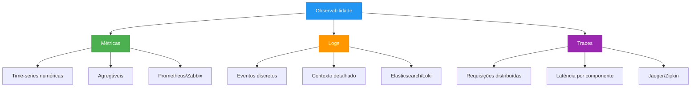
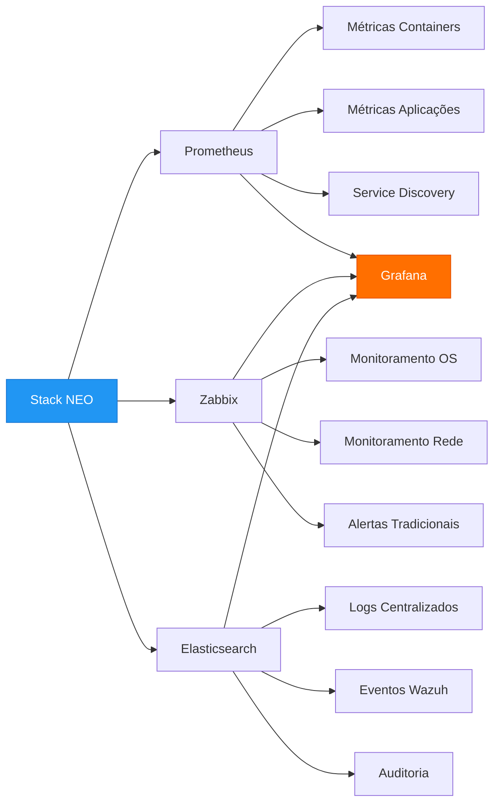
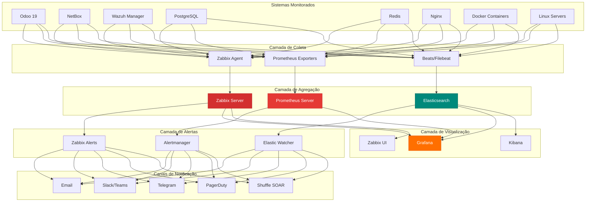
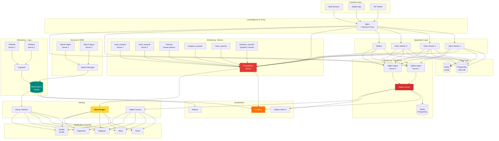
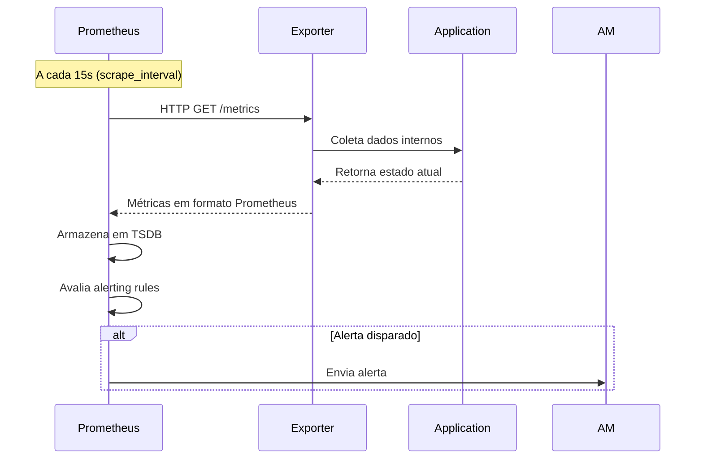
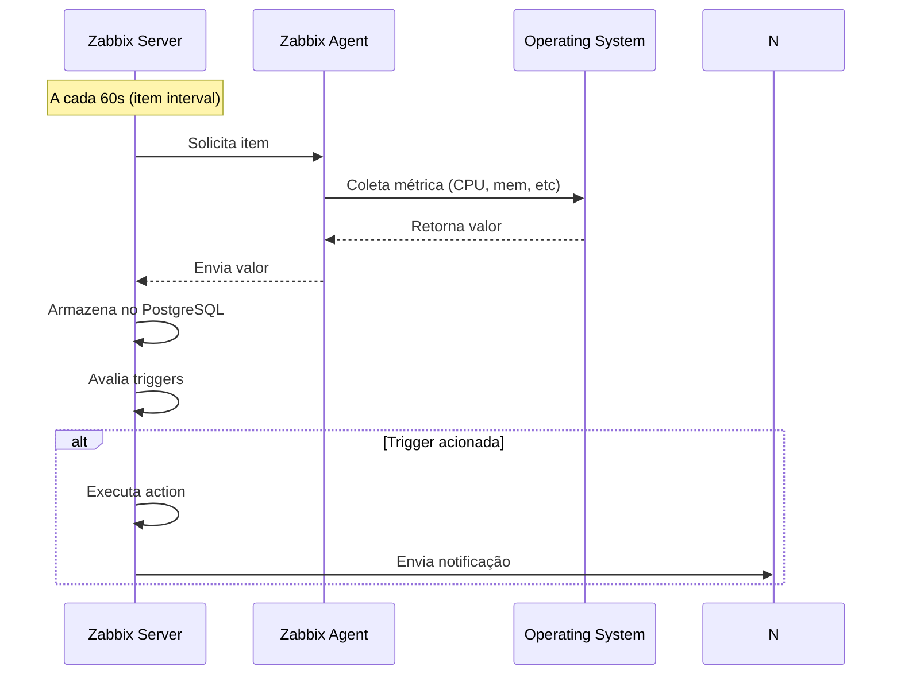
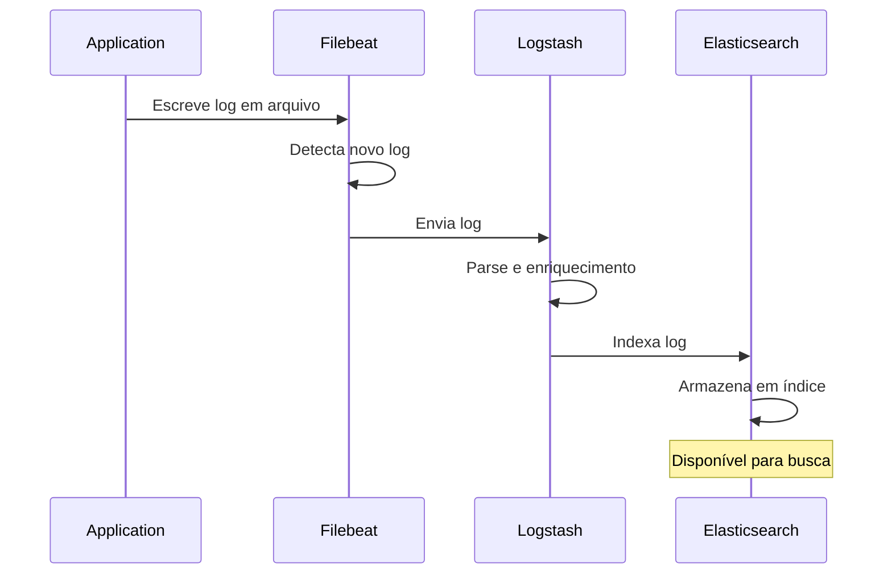

# Visão Geral de Monitoramento

## Introdução

O monitoramento é um componente crítico e fundamental para a operação eficiente, confiável e segura da stack **NEO_NETBOX_ODOO**. Em ambientes empresariais modernos, onde múltiplos sistemas integrados operam continuamente, a capacidade de observar, medir e responder proativamente a problemas é o que diferencia operações amadoras de operações profissionais de nível enterprise.

Este guia apresenta uma arquitetura completa de monitoramento para a stack, combinando as melhores ferramentas open-source disponíveis no mercado: **Zabbix**, **Prometheus**, **Grafana** e **Alertmanager**.

---

## Por Que Monitoramento é Crítico

### Impacto nos Negócios

O monitoramento adequado impacta diretamente nos resultados de negócio:

| Aspecto | Sem Monitoramento | Com Monitoramento |
|---------|-------------------|-------------------|
| **Tempo de Detecção (MTTD)** | Horas ou dias (usuário reporta) | Segundos ou minutos (automático) |
| **Tempo de Resolução (MTTR)** | Horas (investigação manual) | Minutos (métricas apontam causa raiz) |
| **Disponibilidade** | 95-98% (downtime não planejado) | 99.5-99.9% (proativo) |
| **Custo de Incidentes** | Alto (produção parada) | Baixo (prevenção) |
| **Confiança do Usuário** | Baixa (experiência degradada) | Alta (experiência consistente) |
| **Capacity Planning** | Reativo (compra emergencial) | Proativo (planejamento antecipado) |

### Benefícios Operacionais

1. **Detecção Proativa de Problemas**
   - Identificar falhas antes que usuários sejam impactados
   - Alertas automáticos 24/7 sem necessidade de monitoramento humano constante
   - Redução drástica do tempo médio de detecção (MTTD)

2. **Diagnóstico Rápido**
   - Métricas históricas facilitam identificação de causa raiz
   - Correlação de eventos entre múltiplos sistemas
   - Redução do tempo médio de resolução (MTTR)

3. **Capacity Planning**
   - Previsão de necessidade de recursos baseada em tendências
   - Otimização de custos de infraestrutura
   - Prevenção de esgotamento de recursos

4. **Compliance e Auditoria**
   - Evidências de disponibilidade e performance
   - SLA reporting automático
   - Histórico para análises forenses

5. **Melhoria Contínua**
   - Dados para embasar decisões de arquitetura
   - Identificação de gargalos de performance
   - Validação de melhorias implementadas

---

## Observabilidade: Métricas, Logs e Traces

### O Pilar da Observabilidade Moderna

Observabilidade é a capacidade de entender o estado interno de um sistema através de suas saídas externas. Os três pilares fundamentais são:



### 1. Métricas (Metrics)

**O que são:** Valores numéricos coletados ao longo do tempo (time-series).

**Características:**
- Estrutura simples: nome + valor + timestamp + labels
- Altamente agregáveis (soma, média, percentis)
- Baixo custo de armazenamento (compressão eficiente)
- Ideais para alertas em tempo real

**Exemplos na Stack:**
```
# CPU usage do container Odoo
container_cpu_usage_seconds_total{container="odoo", job="cadvisor"} 45.23

# Requests HTTP para NetBox API
netbox_http_requests_total{method="GET", status="200"} 15234

# Agentes Wazuh ativos
wazuh_agents_active{cluster="production"} 142

# Conexões PostgreSQL
pg_stat_database_numbackends{database="odoo"} 87
```

**Quando usar:**
- Monitoramento contínuo de recursos (CPU, memória, disco)
- Contadores de eventos (requests, erros, jobs)
- Performance metrics (latência, throughput)
- Alertas baseados em thresholds

### 2. Logs (Logs)

**O que são:** Registros textuais de eventos discretos que ocorrem no sistema.

**Características:**
- Estrutura rica: timestamp + nível + mensagem + contexto
- Alto volume de dados (verbosos)
- Excelentes para debugging e análise forense
- Contexto detalhado de erros

**Exemplos na Stack:**
```json
// Log estruturado do Odoo
{
  "timestamp": "2025-12-05T10:23:45Z",
  "level": "ERROR",
  "logger": "odoo.http",
  "message": "Database connection failed",
  "database": "production",
  "user_id": 42,
  "traceback": "..."
}

// Log do Nginx
192.168.1.50 - - [05/Dec/2025:10:23:45 +0000]
  "GET /api/dcim/devices/ HTTP/1.1" 200 4523
  "https://netbox.empresa.com" "Mozilla/5.0" 0.243

// Log do Wazuh
2025 Dec 05 10:23:45 wazuh-manager:
  Rule: 5503 - User login failed
  Agent: (001) web-server-01
  User: admin
  SrcIP: 192.168.1.100
```

**Quando usar:**
- Investigação de erros específicos
- Análise de comportamento de usuários
- Auditoria de ações (quem fez o que, quando)
- Troubleshooting de problemas intermitentes

### 3. Traces (Rastreamento Distribuído)

**O que são:** Registro do caminho completo de uma requisição através de múltiplos serviços.

**Características:**
- Mostra latência de cada componente
- Identifica gargalos em arquiteturas distribuídas
- Correlaciona eventos entre múltiplos sistemas
- Alto custo (sampling necessário)

**Exemplo de Trace na Stack:**
```
User Request → Nginx → Odoo → PostgreSQL → NetBox API → Wazuh
   [2ms]       [5ms]   [120ms]   [80ms]      [150ms]      [40ms]
                         ↓
                   Total: 397ms
```

**Quando usar:**
- Debugging de latência em arquiteturas de microserviços
- Otimização de performance end-to-end
- Identificação de dependências entre serviços
- Análise de fluxos complexos

### Integração dos Três Pilares

Na prática, os três pilares trabalham juntos:

1. **Métricas alertam** que há um problema (latência alta)
2. **Traces identificam** onde está o problema (query lenta no PostgreSQL)
3. **Logs explicam** por que ocorreu (lock de tabela)

---

## Zabbix vs Prometheus vs Elastic: Quando Usar

### Comparação Detalhada

| Aspecto | Zabbix | Prometheus | Elastic Stack |
|---------|--------|------------|---------------|
| **Modelo** | Push + Pull | Pull | Push |
| **Uso Principal** | Monitoramento tradicional | Métricas cloud-native | Logs e busca |
| **Curva de Aprendizado** | Média (GUI completa) | Alta (PromQL, config YAML) | Alta (query DSL) |
| **Coleta de Dados** | Agents + SNMP + JMX | Exporters HTTP | Beats + Logstash |
| **Armazenamento** | Banco relacional | Time-series DB próprio | Elasticsearch (JSON) |
| **Performance** | Boa (milhares de hosts) | Excelente (milhões de metrics) | Boa (grandes volumes logs) |
| **Alertas** | Nativos (muito configuráveis) | Alertmanager (simples) | Watcher (complexo) |
| **Visualização** | Gráficos integrados | Grafana (externa) | Kibana (integrado) |
| **Custo de Recursos** | Médio | Baixo | Alto (memória++) |
| **Comunidade** | Grande (corporativa) | Enorme (CNCF) | Grande (Elastic.co) |

### Quando Usar Zabbix

**✅ Use Zabbix para:**

- Monitoramento de infraestrutura tradicional (servidores físicos, VMs)
- Ambientes com equipe acostumada a ferramentas clássicas (Nagios, Cacti)
- Necessidade de GUI completa para configuração
- Monitoramento via SNMP (switches, roteadores, PDUs)
- Templates prontos para tecnologias populares
- Menor dependência de código/YAML

**Exemplo de Caso de Uso:**
```yaml
Cenário: Datacenter com 200 servidores físicos
- 50 switches Cisco (SNMP)
- 100 servidores Linux (Zabbix Agent)
- 50 servidores Windows (Zabbix Agent)
- Equipe de NOC precisa de dashboards prontos
Solução: Zabbix é ideal
```

### Quando Usar Prometheus

**✅ Use Prometheus para:**

- Ambientes containerizados (Kubernetes, Docker Swarm)
- Aplicações cloud-native (microsserviços)
- Métricas de alta cardinalidade
- Integração com Grafana
- Service discovery automático
- Arquitetura GitOps (tudo como código)

**Exemplo de Caso de Uso:**
```yaml
Cenário: Stack moderna containerizada
- 50 containers Docker
- Aplicações com métricas /metrics
- Equipe DevOps com cultura de código
- Necessidade de queries complexas (PromQL)
Solução: Prometheus é ideal
```

### Quando Usar Elastic Stack

**✅ Use Elastic Stack para:**

- Centralização e análise de logs
- Pesquisa full-text em grandes volumes
- Correlação de eventos de segurança
- APM (Application Performance Monitoring)
- Análise de comportamento (user analytics)

**Exemplo de Caso de Uso:**
```yaml
Cenário: Análise de segurança e compliance
- Logs de 100 servidores (syslog, app logs)
- Eventos de segurança (Wazuh, firewall)
- Auditoria e compliance (SOX, PCI-DSS)
- Busca complexa em logs históricos
Solução: Elastic Stack é ideal
```

### Nossa Abordagem Híbrida

Na stack **NEO_NETBOX_ODOO**, usamos uma abordagem híbrida que aproveita o melhor de cada ferramenta:



**Divisão de Responsabilidades:**

| Componente | Ferramenta Principal | Razão |
|------------|---------------------|--------|
| **Odoo** | Prometheus + Logs (Elastic) | Métricas expostas + logs detalhados |
| **NetBox** | Prometheus + Zabbix | API health + templates Zabbix |
| **Wazuh** | Elastic + Prometheus | Eventos nativos Elastic + métricas |
| **PostgreSQL** | Prometheus + Zabbix | Métricas detalhadas + alertas |
| **Docker** | Prometheus | cAdvisor nativo |
| **Servidores OS** | Zabbix + Prometheus | Templates prontos + node_exporter |
| **Nginx** | Prometheus + Logs (Elastic) | Métricas HTTP + access logs |

---

## Arquitetura de Monitoramento da Stack

### Visão Geral da Arquitetura



### Componentes da Arquitetura

#### 1. Zabbix (Monitoramento Tradicional)

**Componentes:**

```yaml
Zabbix Server:
  - Core de processamento
  - Gerenciamento de triggers
  - Execução de actions
  - Banco de dados PostgreSQL

Zabbix Agent:
  - Coleta dados do sistema operacional
  - Execução de scripts customizados
  - Modo ativo (push) ou passivo (pull)

Zabbix Proxy (opcional):
  - Para ambientes distribuídos
  - Reduz carga no servidor central
  - Buffer local em caso de falha
```

**Fluxo de Dados:**
```
Host → Zabbix Agent → Zabbix Server → PostgreSQL DB
                            ↓
                     Trigger Evaluation
                            ↓
                     Actions & Alerts
                            ↓
                     Email/Slack/etc
```

**Casos de Uso:**
- CPU, memória, disco de servidores
- Processos e serviços (systemd)
- Monitoramento de rede (SNMP)
- Scripts customizados (bash, Python)

#### 2. Prometheus (Métricas Cloud-Native)

**Componentes:**

```yaml
Prometheus Server:
  - Time-series database (TSDB)
  - PromQL query language
  - Service discovery (Consul, Kubernetes, DNS)
  - Recording rules (pre-aggregação)
  - Alerting rules

Exporters:
  - node_exporter: métricas do SO
  - cadvisor: métricas de containers
  - postgres_exporter: métricas PostgreSQL
  - blackbox_exporter: probes HTTP/TCP/ICMP
  - custom exporters: aplicações

Pushgateway (opcional):
  - Para jobs batch/efêmeros
  - Push de métricas para Prometheus

Alertmanager:
  - Deduplicação de alertas
  - Grouping e routing
  - Silencing
  - Integrações (email, Slack, PagerDuty)
```

**Fluxo de Dados:**
```
Application → /metrics endpoint → Prometheus (scrape) → TSDB
                                         ↓
                                  Alerting Rules
                                         ↓
                                   Alertmanager
                                         ↓
                               Routing & Grouping
                                         ↓
                              Notification Channels
```

**Casos de Uso:**
- Métricas de aplicações (requests, latência, erros)
- Métricas de containers Docker
- Queries complexas (PromQL)
- Alertas baseados em tendências

#### 3. Grafana (Visualização Universal)

**Características:**

```yaml
Datasources Suportados:
  - Prometheus
  - Zabbix
  - Elasticsearch
  - PostgreSQL
  - InfluxDB
  - MySQL
  - CloudWatch
  - +50 outros

Recursos:
  - Dashboards interativos
  - Variáveis e templating
  - Anotações e eventos
  - Alertas (com suporte a múltiplos datasources)
  - Provisioning (GitOps)
  - RBAC (controle de acesso)
  - Plugins
```

**Fluxo de Visualização:**
```
User → Grafana UI → Query Datasources → Render Dashboard
          ↓
    (Prometheus, Zabbix, Elastic)
          ↓
    Unified View
```

**Casos de Uso:**
- Dashboard unificado de toda a stack
- Correlação de dados de múltiplas fontes
- Apresentações para management
- Dashboards públicos (status page)

#### 4. Alertmanager (Gestão de Alertas)

**Recursos:**

```yaml
Deduplicação:
  - Agrupa alertas idênticos
  - Evita flooding de notificações

Grouping:
  - Agrupa alertas relacionados
  - Exemplo: todos os containers de um host

Routing:
  - Rota alertas por severidade
  - Rota alertas por equipe/serviço
  - Suporte a fallback

Silencing:
  - Silencia alertas durante manutenção
  - Suporta expressões regex

Inhibition:
  - Suprime alertas dependentes
  - Exemplo: host down inibe alertas de serviços
```

---

## O Que Monitorar na Stack

### 1. Odoo 19

#### Métricas Essenciais

**Performance da Aplicação:**
```yaml
Requests HTTP:
  - Total de requests (contador)
  - Requests por método (GET, POST)
  - Requests por código de status (200, 404, 500)
  - Latência (p50, p95, p99)

Workers Odoo:
  - Workers ativos vs configurados
  - Workers em idle
  - Workers processando requests
  - Fila de requests (backlog)

Database Connections:
  - Conexões ativas
  - Conexões idle
  - Conexões máximas atingidas
  - Tempo de espera para conexão

Cache:
  - Hit rate do cache
  - Tamanho do cache
  - Evictions
```

**Recursos do Sistema:**
```yaml
CPU:
  - % CPU por worker
  - % CPU total do container
  - Load average

Memória:
  - RSS (resident set size)
  - Memória compartilhada
  - Memory leaks (tendência crescente)

I/O:
  - Disk read/write
  - IOPS
  - Latência de I/O
```

**Métricas de Negócio:**
```yaml
Usuários:
  - Usuários ativos (sessões)
  - Logins por hora
  - Falhas de autenticação

Módulos Específicos:
  - Tickets criados/resolvidos (Helpdesk)
  - Orders processadas (Sales)
  - Inventory moves (Stock)
```

#### Logs Importantes

```python
# Logs críticos para coletar
ERROR: exceções e stack traces
WARNING: avisos de deprecação, configurações
INFO: requests HTTP, jobs executados
DEBUG: apenas em troubleshooting
```

### 2. NetBox

#### Métricas Essenciais

**API Health:**
```yaml
HTTP Metrics:
  - Total requests
  - Latência média
  - Rate de erros (4xx, 5xx)
  - Requests por endpoint

Database:
  - Query count
  - Query duration
  - Connection pool usage

Cache (Redis):
  - Hit rate
  - Memory usage
  - Evictions
```

**Sync Status:**
```yaml
Integrações:
  - Última sincronização com Odoo (timestamp)
  - Objetos sincronizados
  - Erros de sincronização
  - Drift (diferenças não sincronizadas)
```

### 3. Wazuh

#### Métricas Essenciais

**Manager Health:**
```yaml
Cluster:
  - Status dos nós (active/standby)
  - Sincronização entre nós
  - Lag de replicação

Agentes:
  - Total de agentes
  - Agentes ativos
  - Agentes desconectados (> 10 min)
  - Agentes pendentes de aprovação

Performance:
  - Events per second (EPS)
  - Queue usage (% de filas cheias)
  - Análise de regras (tempo médio)
```

**Eventos de Segurança:**
```yaml
Alertas:
  - Total de alertas
  - Alertas por severidade (low, medium, high, critical)
  - Top 10 regras acionadas
  - Alertas por agente
```

### 4. PostgreSQL

#### Métricas Essenciais

**Connections:**
```yaml
pg_stat_database:
  - numbackends: conexões ativas
  - Conexões por database
  - Máximo de conexões configurado
  - % de utilização
```

**Performance:**
```yaml
Queries:
  - Tempo médio de query
  - Slow queries (> 1s)
  - Queries bloqueadas (locks)
  - Deadlocks

Transactions:
  - TPS (transactions per second)
  - Commit ratio (commits / total)
  - Rollback ratio

Cache:
  - Buffer cache hit ratio (deve ser > 95%)
  - Shared buffers usage
```

**Replicação (se aplicável):**
```yaml
Streaming Replication:
  - Lag de replicação (bytes ou segundos)
  - Status dos replicas (streaming, catching up)
  - Slots de replicação (usados vs disponíveis)
```

### 5. Docker & Containers

#### Métricas Essenciais

**Por Container:**
```yaml
Recursos:
  - CPU usage (% e cores)
  - Memory usage (MB e %)
  - Memory limit
  - OOM kills (out of memory)
  - Network I/O (rx/tx bytes)
  - Disk I/O (read/write bytes)

Estado:
  - Status (running, stopped, restarting)
  - Uptime
  - Restart count
  - Health check status
```

**Docker Host:**
```yaml
Global:
  - Total de containers (running/stopped)
  - Total de images
  - Total de volumes
  - Total de networks

Recursos:
  - CPU total utilizada por containers
  - Memória total utilizada
  - Disk usage (/var/lib/docker)
```

### 6. Nginx

#### Métricas Essenciais

**HTTP:**
```yaml
Requests:
  - Total requests
  - Requests por segundo (RPS)
  - Requests por status code
  - Requests por virtual host

Performance:
  - Request duration (p50, p95, p99)
  - Upstream response time
  - Connection time

Connections:
  - Active connections
  - Reading/Writing/Waiting
  - Connection rate
```

### 7. Redis

#### Métricas Essenciais

```yaml
Memory:
  - used_memory (bytes)
  - used_memory_rss (physical memory)
  - mem_fragmentation_ratio
  - evicted_keys (chaves removidas)

Performance:
  - Commands per second
  - Hit rate (keyspace_hits / keyspace_misses)
  - Slow log

Persistence:
  - Last save time (RDB)
  - Last AOF rewrite
  - AOF current size
```

---

## SLIs, SLOs e SLAs

### Definições

#### SLI (Service Level Indicator)

**Indicador de Nível de Serviço:** Métrica quantitativa que mede um aspecto específico do serviço.

**Exemplos:**
```yaml
Latência:
  SLI: "95% dos requests HTTP devem responder em menos de 300ms"
  Métrica: histogram_quantile(0.95, http_request_duration_seconds)

Disponibilidade:
  SLI: "99.9% dos health checks devem retornar status 200"
  Métrica: (successful_health_checks / total_health_checks) * 100

Taxa de Erro:
  SLI: "Menos de 0.1% dos requests devem retornar 5xx"
  Métrica: (http_requests_5xx / http_requests_total) * 100
```

#### SLO (Service Level Objective)

**Objetivo de Nível de Serviço:** Meta interna que a equipe se compromete a atingir.

**Exemplos para a Stack:**
```yaml
Odoo SLOs:
  - Disponibilidade: 99.5% (downtime máximo: 3.65h/mês)
  - Latência (p95): < 500ms
  - Taxa de erro: < 0.5%

NetBox SLOs:
  - Disponibilidade API: 99.9%
  - Latência API (p95): < 200ms
  - Sync Odoo: < 5 min delay

Wazuh SLOs:
  - Agentes ativos: > 95%
  - Event processing delay: < 10s
  - Cluster sync: < 30s
```

#### SLA (Service Level Agreement)

**Acordo de Nível de Serviço:** Contrato formal com o cliente/usuário.

**Exemplo de SLA:**
```yaml
Acordo: SLA Odoo Production
Cliente: Empresa XYZ
Provedor: TI Internal

Garantias:
  - Disponibilidade: 99.5% mensal
  - Suporte P1 (crítico): resposta em 15 min
  - Suporte P2 (alto): resposta em 2 horas
  - Suporte P3 (médio): resposta em 8 horas

Penalidades:
  - < 99.5%: crédito de 10% do valor mensal
  - < 99.0%: crédito de 25% do valor mensal
  - < 98.0%: crédito de 50% do valor mensal
```

### Implementação de SLOs

#### 1. Definir SLOs Realistas

**Error Budget (Orçamento de Erro):**
```
SLO: 99.9% disponibilidade/mês
Error Budget: 100% - 99.9% = 0.1%
Downtime permitido: 43.2 minutos/mês

Se error budget for consumido:
  - Freeze de novas features
  - Foco em confiabilidade
  - Rollback de mudanças recentes
```

#### 2. Dashboards de SLO

```yaml
Dashboard "SLO Overview":
  - SLO atual (gauge)
  - Error budget restante (%)
  - Burn rate (velocidade de consumo do budget)
  - Histórico de 30 dias
  - Projeção (vai estourar o SLO?)
```

#### 3. Alertas Baseados em SLO

**Multi-Window, Multi-Burn-Rate Alerts:**
```yaml
# Alerta crítico: erro rápido
Alert: SLO Burn Rate Critical
Condition:
  - Burn rate > 14.4x em 1 hora
  - E burn rate > 14.4x em 5 minutos
Action: Page on-call engineer

# Alerta warning: erro lento
Alert: SLO Burn Rate Warning
Condition:
  - Burn rate > 6x em 6 horas
  - E burn rate > 6x em 30 minutos
Action: Notify team channel
```

---

## Diagrama de Arquitetura Completo



---

## Fluxo de Dados de Monitoramento

### 1. Coleta de Métricas (Prometheus)



### 2. Coleta de Dados (Zabbix)



### 3. Processamento de Logs



---

## Checklist de Implementação

### Fase 1: Setup Básico (Semana 1)

- [ ] Instalar Prometheus via Docker Compose
- [ ] Instalar Grafana via Docker Compose
- [ ] Configurar node_exporter em todos os hosts
- [ ] Configurar cAdvisor para Docker
- [ ] Criar primeiro dashboard no Grafana
- [ ] Configurar datasource Prometheus no Grafana
- [ ] Testar coleta de métricas básicas (CPU, mem, disco)

### Fase 2: Monitoramento de Aplicações (Semana 2)

- [ ] Configurar postgres_exporter para PostgreSQL
- [ ] Configurar redis_exporter para Redis
- [ ] Configurar nginx_exporter ou log parsing
- [ ] Configurar blackbox_exporter para health checks
- [ ] Criar dashboards de aplicações
- [ ] Configurar service discovery (se aplicável)

### Fase 3: Alertas (Semana 3)

- [ ] Instalar e configurar Alertmanager
- [ ] Definir alerting rules no Prometheus
- [ ] Configurar routing de alertas
- [ ] Integrar com Email
- [ ] Integrar com Slack/Teams
- [ ] Testar fluxo de alertas end-to-end

### Fase 4: Zabbix (Semana 4 - opcional)

- [ ] Instalar Zabbix Server via Docker Compose
- [ ] Configurar banco de dados Zabbix
- [ ] Instalar Zabbix Agents
- [ ] Importar templates
- [ ] Configurar hosts e host groups
- [ ] Integrar Zabbix como datasource no Grafana

### Fase 5: Logs (Semana 5 - se necessário)

- [ ] Instalar Elasticsearch cluster
- [ ] Instalar Logstash
- [ ] Instalar Filebeat em hosts
- [ ] Configurar pipelines de parsing
- [ ] Instalar Kibana
- [ ] Criar índices e index patterns
- [ ] Integrar Elasticsearch no Grafana

### Fase 6: Otimização (Ongoing)

- [ ] Tuning de retenção de dados
- [ ] Otimização de queries (PromQL)
- [ ] Review de alertas (reduzir false positives)
- [ ] Implementação de SLOs
- [ ] Documentação de runbooks
- [ ] Treinamento da equipe

---

## Melhores Práticas

### 1. Naming Conventions

**Métricas Prometheus:**
```
# Formato: <namespace>_<subsystem>_<name>_<unit>
odoo_http_requests_total
odoo_http_request_duration_seconds
netbox_api_errors_total
wazuh_agents_active
postgres_connections_current
```

**Labels:**
```yaml
# Use labels para dimensões, não nomes de métricas
Bom:
  http_requests_total{method="GET", status="200", service="odoo"}
Ruim:
  http_requests_get_200_total{service="odoo"}
```

### 2. Retenção de Dados

```yaml
Prometheus:
  Curto prazo: 15 dias (consultas frequentes)
  Médio prazo: 90 dias (downsampled, via recording rules)
  Longo prazo: 1-2 anos (downsampled, via Thanos/VictoriaMetrics)

Zabbix:
  Dados brutos: 7 dias
  Tendências (1h): 90 dias
  Histórico: 1 ano

Elasticsearch:
  Hot tier: 7 dias (SSD rápido)
  Warm tier: 30 dias (SSD padrão)
  Cold tier: 90 dias (HDD)
  Frozen tier: 1 ano (S3/object storage)
```

### 3. Alerting Best Practices

**Evite Alert Fatigue:**
```yaml
Princípios:
  - Alerta deve ser acionável (o que fazer?)
  - Alerta deve importar (impacta usuário?)
  - Alerta deve ter owner claro
  - Evite alertas informativos (use dashboards)

Exemplo Ruim:
  Alert: CPU > 80%
  Problema: CPU alta nem sempre é problema

Exemplo Bom:
  Alert: Latência p95 > 1s por 5 minutos
  Problema: Usuários afetados, ação clara necessária
```

### 4. High Cardinality

**Evite labels de alta cardinalidade:**
```yaml
# NUNCA use como label:
Ruim:
  - User ID (milhares de valores únicos)
  - Request ID (único por request)
  - Timestamp (único por segundo)
  - IP do cliente (muitos valores)

# Use labels de baixa cardinalidade:
Bom:
  - Environment (prod, staging, dev)
  - Service (odoo, netbox, wazuh)
  - Status code (200, 404, 500)
  - HTTP method (GET, POST, PUT, DELETE)
```

---

## Recursos Adicionais

### Documentação Oficial

- [Prometheus Documentation](https://prometheus.io/docs/)
- [Grafana Documentation](https://grafana.com/docs/)
- [Zabbix Documentation](https://www.zabbix.com/documentation/current/)
- [Alertmanager Documentation](https://prometheus.io/docs/alerting/latest/alertmanager/)

### Livros Recomendados

- "Prometheus: Up & Running" - Brian Brazil
- "Site Reliability Engineering" - Google (gratuito online)
- "The Art of Monitoring" - James Turnbull

### Comunidades

- [Prometheus Community](https://prometheus.io/community/)
- [Grafana Community Forum](https://community.grafana.com/)
- [r/prometheus](https://reddit.com/r/prometheus)
- [r/grafana](https://reddit.com/r/grafana)

---

## Próximos Passos

Agora que você compreende a visão geral do monitoramento, siga para os guias específicos:

1. **[Zabbix Setup](zabbix-setup.md)** - Instalação e configuração do Zabbix
2. **[Prometheus Setup](prometheus-setup.md)** - Instalação e configuração do Prometheus
3. **[Grafana Dashboards](grafana-dashboards.md)** - Criação de dashboards
4. **[Alerting](alerting.md)** - Configuração de alertas
5. **[Monitoring Stack](monitoring-stack.md)** - Monitoramento de cada componente
6. **[Use Cases](use-cases.md)** - Casos práticos de uso

---

**Autor:** Equipe NEO_NETBOX_ODOO Stack
**Última Atualização:** 2025-12-05
**Versão:** 1.0
