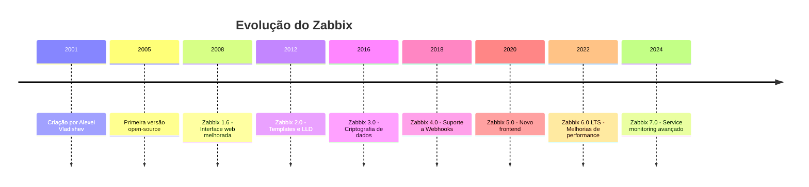
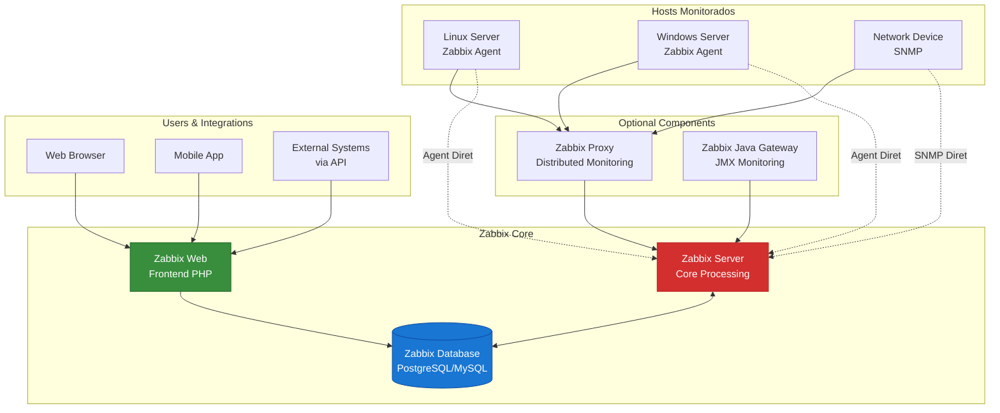
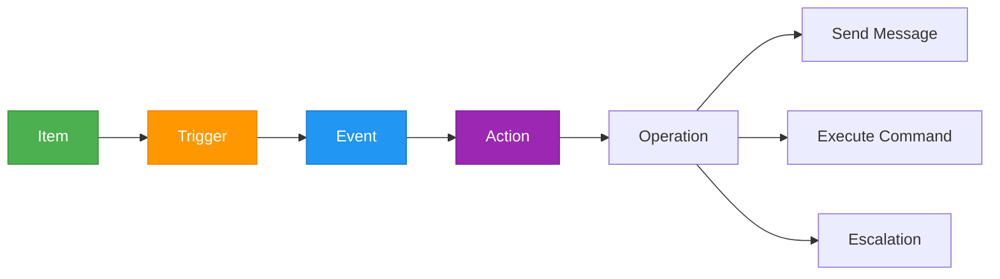

# Instalação e Configuração do Zabbix

## Introdução

O **Zabbix** é uma solução de monitoramento enterprise open-source madura e robusta, com mais de 20 anos de desenvolvimento. É especialmente forte em monitoramento de infraestrutura tradicional, oferecendo uma interface web completa, coleta via agentes, SNMP, IPMI e dezenas de outros protocolos.

Neste guia, você aprenderá a instalar e configurar o Zabbix para monitorar a stack **NEO_NETBOX_ODOO**.

---

## O Que é Zabbix

### História e Evolução



### Versões Atuais

| Versão | Tipo | Lançamento | Suporte até | Recomendação |
|--------|------|------------|-------------|--------------|
| Zabbix 6.0 LTS | Long Term Support | Fev 2022 | Fev 2027 | **Produção** |
| Zabbix 6.4 | Standard | Out 2023 | Out 2025 | Testes |
| Zabbix 7.0 LTS | Long Term Support | Mai 2024 | Mai 2029 | **Produção (Novo)** |

!!! tip "Recomendação para NEO Stack"
    Usaremos **Zabbix 7.0 LTS** neste guia, a versão mais recente com suporte de longo prazo (5 anos).

### Características Principais

```yaml
Coleta de Dados:
  - Agentes (Linux, Windows, macOS, Solaris, AIX)
  - SNMP (v1, v2c, v3)
  - IPMI (monitoramento de hardware)
  - JMX (Java applications)
  - SSH checks
  - Telnet checks
  - HTTP/HTTPS checks
  - Scripts customizados (qualquer linguagem)

Armazenamento:
  - MySQL/MariaDB
  - PostgreSQL
  - Oracle Database
  - TimescaleDB (otimizado para time-series)

Interface:
  - Web UI completa (PHP)
  - API RESTful (JSON-RPC)
  - Mobile apps (iOS, Android)

Notificações:
  - Email (SMTP)
  - SMS
  - Jabber/XMPP
  - Webhooks (Slack, Teams, PagerDuty, custom)
  - Scripts customizados

Recursos Avançados:
  - Network discovery automático
  - Low-Level Discovery (LLD)
  - Templates (reutilizáveis)
  - Macros e variáveis
  - Mapas de rede
  - Screens e dashboards
  - SLA reporting
  - Distributed monitoring (Proxies)
```

---

## Arquitetura do Zabbix

### Componentes



### Descrição dos Componentes

#### 1. Zabbix Server

**Função:** Core de processamento central.

**Responsabilidades:**
```yaml
Coleta de Dados:
  - Polling de agentes
  - Execução de checks (SNMP, HTTP, etc)
  - Processamento de traps (SNMP, log)

Processamento:
  - Avaliação de triggers
  - Cálculo de tendências
  - Execução de actions
  - Low-Level Discovery

Performance:
  - Suporta milhares de hosts
  - Multi-threaded (processes configuráveis)
  - Cache interno para otimização
```

#### 2. Zabbix Database

**Função:** Armazenamento de configurações e dados coletados.

**Opções:**
```yaml
PostgreSQL:
  Pros: Estável, confiável, open-source
  Contras: Menos performático que TimescaleDB
  Recomendado: Sim (com TimescaleDB extension)

MySQL/MariaDB:
  Pros: Simples, amplamente suportado
  Contras: Limitações em grandes ambientes
  Recomendado: Ambientes pequenos/médios

TimescaleDB:
  Pros: Otimizado para time-series, compressão automática
  Contras: Requer PostgreSQL + extension
  Recomendado: Sim (produção)

Oracle Database:
  Pros: Performance enterprise
  Contras: Custos de licença
  Recomendado: Apenas se já licenciado
```

#### 3. Zabbix Web Frontend

**Função:** Interface de gerenciamento via web.

**Características:**
```yaml
Tecnologia:
  - PHP 8.0+
  - Apache ou Nginx
  - JavaScript moderno

Recursos:
  - Configuração completa via UI
  - Dashboards customizáveis
  - Mapas de rede
  - Relatórios
  - Gestão de usuários (RBAC)
  - Autenticação (LDAP, SAML, HTTP)
```

#### 4. Zabbix Agent

**Função:** Coletor de dados instalado nos hosts monitorados.

**Modos de Operação:**
```yaml
Modo Passivo (Pull):
  - Zabbix Server solicita dados
  - Agent responde sob demanda
  - Porta padrão: 10050/tcp
  - Mais seguro (firewall menos permissivo)

Modo Ativo (Push):
  - Agent envia dados periodicamente
  - Reduz carga no Zabbix Server
  - Porta padrão: 10051/tcp (no Server)
  - Melhor para NAT/firewalls complexos

Modo Híbrido:
  - Combina passivo e ativo
  - Configurável por item
```

**Versões:**
```yaml
Zabbix Agent 1:
  - Legado (ainda suportado)
  - Escrito em C
  - Menor footprint de memória

Zabbix Agent 2:
  - Moderno (Go)
  - Plugins nativos (Docker, PostgreSQL, Redis)
  - Coleta local sem servidor
  - Recomendado: Sim
```

#### 5. Zabbix Proxy (Opcional)

**Função:** Coletor intermediário para ambientes distribuídos.

**Casos de Uso:**
```yaml
Quando Usar:
  - Filiais remotas (WAN)
  - Ambientes com milhares de hosts
  - Segmentação de rede (DMZ)
  - Redução de carga no Zabbix Server

Vantagens:
  - Buffer local (tolerância a falhas de rede)
  - Offload de processamento do Server
  - Coleta de dados em rede local (menor latência)
  - Criptografia de dados entre Proxy e Server

Arquitetura:
  Hosts → Zabbix Proxy → Zabbix Server → Database
```

#### 6. Zabbix Java Gateway (Opcional)

**Função:** Monitoramento de aplicações Java via JMX.

**Uso:**
```yaml
Aplicações Suportadas:
  - Tomcat
  - JBoss
  - WebLogic
  - Cassandra
  - Kafka
  - ActiveMQ
  - Qualquer app com JMX habilitado
```

---

## Instalação via Docker Compose

### Pré-requisitos

```bash
# Sistema operacional
Ubuntu 22.04 LTS ou superior
CentOS/RHEL 8+
Debian 11+

# Software
Docker 24.0+
Docker Compose 2.20+

# Hardware (recomendado)
CPU: 4 cores
RAM: 8 GB (mínimo), 16 GB (recomendado)
Disco: 100 GB (SSD recomendado)
```

### Estrutura de Diretórios

```bash
mkdir -p /opt/neostack/zabbix/{postgres,scripts,externalscripts,alertscripts,ssl}
cd /opt/neostack/zabbix
```

```
/opt/neostack/zabbix/
├── docker-compose.yml
├── .env
├── postgres/              # Dados do PostgreSQL
├── scripts/               # Scripts de manutenção
├── externalscripts/       # Scripts para items externos
├── alertscripts/          # Scripts de notificação customizados
└── ssl/                   # Certificados SSL
```

### Arquivo .env

```bash
cat > .env << 'EOF'
# Zabbix Version
ZABBIX_VERSION=7.0-alpine-latest

# PostgreSQL Configuration
POSTGRES_USER=zabbix
POSTGRES_PASSWORD=zabbix_db_strong_password_change_me
POSTGRES_DB=zabbix
POSTGRES_PORT=5432

# Zabbix Server
ZBX_SERVER_HOST=zabbix-server
ZBX_SERVER_PORT=10051

# Zabbix Web
ZBX_WEB_PORT=8080
PHP_TZ=America/Sao_Paulo

# Network
NETWORK_NAME=zabbix-network
SUBNET=172.25.0.0/16

# TimescaleDB (optional, recomendado)
ENABLE_TIMESCALEDB=true

# Cache Configuration (melhor performance)
ZBX_CACHESIZE=256M
ZBX_CACHEUPDATEFREQUENCY=60
ZBX_STARTPOLLERS=10
ZBX_STARTPINGERS=5
ZBX_STARTTRAPPERS=5
ZBX_STARTDISCOVERERS=2
ZBX_STARTHTTPPOLLERS=2

# Timeout
ZBX_TIMEOUT=10

# Housekeeper (limpeza de dados antigos)
ZBX_HOUSEKEEPINGFREQUENCY=1
ZBX_MAXHOUSEKEEPERDELETE=50000
EOF
```

### Docker Compose File

```yaml
cat > docker-compose.yml << 'EOF'
version: '3.8'

networks:
  zabbix-network:
    driver: bridge
    ipam:
      config:
        - subnet: ${SUBNET}

volumes:
  postgres-data:
    driver: local

services:
  postgres:
    image: postgres:16-alpine
    container_name: zabbix-postgres
    restart: unless-stopped
    environment:
      POSTGRES_USER: ${POSTGRES_USER}
      POSTGRES_PASSWORD: ${POSTGRES_PASSWORD}
      POSTGRES_DB: ${POSTGRES_DB}
      # TimescaleDB extension
      POSTGRES_INITDB_ARGS: "-E UTF8"
    volumes:
      - postgres-data:/var/lib/postgresql/data
      - ./init-timescale.sql:/docker-entrypoint-initdb.d/init-timescale.sql:ro
    networks:
      - zabbix-network
    healthcheck:
      test: ["CMD-SHELL", "pg_isready -U ${POSTGRES_USER} -d ${POSTGRES_DB}"]
      interval: 10s
      timeout: 5s
      retries: 5
    ports:
      - "127.0.0.1:${POSTGRES_PORT}:5432"
    deploy:
      resources:
        limits:
          cpus: '2.0'
          memory: 4G
        reservations:
          cpus: '1.0'
          memory: 2G

  zabbix-server:
    image: zabbix/zabbix-server-pgsql:${ZABBIX_VERSION}
    container_name: zabbix-server
    restart: unless-stopped
    environment:
      DB_SERVER_HOST: postgres
      DB_SERVER_PORT: 5432
      POSTGRES_USER: ${POSTGRES_USER}
      POSTGRES_PASSWORD: ${POSTGRES_PASSWORD}
      POSTGRES_DB: ${POSTGRES_DB}
      ZBX_ENABLE_TIMESCALEDB: ${ENABLE_TIMESCALEDB}
      ZBX_CACHESIZE: ${ZBX_CACHESIZE}
      ZBX_CACHEUPDATEFREQUENCY: ${ZBX_CACHEUPDATEFREQUENCY}
      ZBX_STARTPOLLERS: ${ZBX_STARTPOLLERS}
      ZBX_STARTPINGERS: ${ZBX_STARTPINGERS}
      ZBX_STARTTRAPPERS: ${ZBX_STARTTRAPPERS}
      ZBX_STARTDISCOVERERS: ${ZBX_STARTDISCOVERERS}
      ZBX_STARTHTTPPOLLERS: ${ZBX_STARTHTTPPOLLERS}
      ZBX_TIMEOUT: ${ZBX_TIMEOUT}
      ZBX_HOUSEKEEPINGFREQUENCY: ${ZBX_HOUSEKEEPINGFREQUENCY}
      ZBX_MAXHOUSEKEEPERDELETE: ${ZBX_MAXHOUSEKEEPERDELETE}
    volumes:
      - /etc/localtime:/etc/localtime:ro
      - ./externalscripts:/usr/lib/zabbix/externalscripts:ro
      - ./alertscripts:/usr/lib/zabbix/alertscripts:ro
      - ./ssl:/var/lib/zabbix/ssl:ro
    networks:
      - zabbix-network
    ports:
      - "10051:10051"
    depends_on:
      postgres:
        condition: service_healthy
    healthcheck:
      test: ["CMD", "zabbix_server", "-R", "config_cache_reload"]
      interval: 30s
      timeout: 10s
      retries: 3
    deploy:
      resources:
        limits:
          cpus: '4.0'
          memory: 4G
        reservations:
          cpus: '2.0'
          memory: 2G

  zabbix-web:
    image: zabbix/zabbix-web-nginx-pgsql:${ZABBIX_VERSION}
    container_name: zabbix-web
    restart: unless-stopped
    environment:
      DB_SERVER_HOST: postgres
      DB_SERVER_PORT: 5432
      POSTGRES_USER: ${POSTGRES_USER}
      POSTGRES_PASSWORD: ${POSTGRES_PASSWORD}
      POSTGRES_DB: ${POSTGRES_DB}
      ZBX_SERVER_HOST: zabbix-server
      ZBX_SERVER_PORT: ${ZBX_SERVER_PORT}
      PHP_TZ: ${PHP_TZ}
      # Security
      ZBX_SESSION_NAME: zbx_sessionid
      # Performance
      PHP_MEMORY_LIMIT: 512M
      PHP_UPLOAD_MAX_FILESIZE: 16M
      PHP_POST_MAX_SIZE: 16M
      PHP_MAX_EXECUTION_TIME: 300
    volumes:
      - /etc/localtime:/etc/localtime:ro
      - ./ssl:/etc/ssl/nginx:ro
    networks:
      - zabbix-network
    ports:
      - "${ZBX_WEB_PORT}:8080"
      - "8443:8443"
    depends_on:
      - postgres
      - zabbix-server
    healthcheck:
      test: ["CMD", "curl", "-f", "http://localhost:8080/"]
      interval: 30s
      timeout: 10s
      retries: 3
    deploy:
      resources:
        limits:
          cpus: '2.0'
          memory: 2G
        reservations:
          cpus: '0.5'
          memory: 512M

  zabbix-agent:
    image: zabbix/zabbix-agent2:${ZABBIX_VERSION}
    container_name: zabbix-agent-docker-host
    restart: unless-stopped
    environment:
      ZBX_HOSTNAME: "Docker Host"
      ZBX_SERVER_HOST: zabbix-server
      ZBX_SERVER_PORT: ${ZBX_SERVER_PORT}
      ZBX_PASSIVE_ALLOW: "true"
      ZBX_ACTIVE_ALLOW: "true"
    volumes:
      - /etc/localtime:/etc/localtime:ro
      - /proc:/host/proc:ro
      - /sys:/host/sys:ro
      - /dev:/host/dev:ro
      - /var/run/docker.sock:/var/run/docker.sock:ro
    networks:
      - zabbix-network
    ports:
      - "10050:10050"
    privileged: true
    depends_on:
      - zabbix-server
    deploy:
      resources:
        limits:
          cpus: '0.5'
          memory: 256M
        reservations:
          cpus: '0.1'
          memory: 64M
EOF
```

### Script de Inicialização TimescaleDB

```sql
cat > init-timescale.sql << 'EOF'
-- Enable TimescaleDB extension
CREATE EXTENSION IF NOT EXISTS timescaledb CASCADE;

-- Optimize history tables for time-series
-- Será executado após o Zabbix criar as tabelas
-- (execute manualmente após primeiro start)

-- SELECT create_hypertable('history', 'clock', chunk_time_interval => 86400, migrate_data => true);
-- SELECT create_hypertable('history_uint', 'clock', chunk_time_interval => 86400, migrate_data => true);
-- SELECT create_hypertable('history_str', 'clock', chunk_time_interval => 86400, migrate_data => true);
-- SELECT create_hypertable('history_text', 'clock', chunk_time_interval => 86400, migrate_data => true);
-- SELECT create_hypertable('history_log', 'clock', chunk_time_interval => 86400, migrate_data => true);
-- SELECT create_hypertable('trends', 'clock', chunk_time_interval => 2592000, migrate_data => true);
-- SELECT create_hypertable('trends_uint', 'clock', chunk_time_interval => 2592000, migrate_data => true);
EOF
```

### Iniciar o Zabbix

```bash
# Iniciar serviços
docker-compose up -d

# Verificar logs
docker-compose logs -f

# Verificar status
docker-compose ps

# Aguardar inicialização (pode levar 2-3 minutos)
# Aguarde até ver: "Zabbix Server started"
docker-compose logs -f zabbix-server | grep "started"
```

### Acessar Interface Web

```
URL: http://seu-servidor:8080
Usuário: Admin
Senha: zabbix
```

!!! warning "Segurança Crítica"
    **ALTERE A SENHA PADRÃO IMEDIATAMENTE!**

    1. Faça login com Admin/zabbix
    2. Vá em: Administration → Users → Admin
    3. Clique em "Change password"
    4. Use senha forte (mínimo 16 caracteres, letras, números, símbolos)

### Habilitar TimescaleDB (Pós-Instalação)

```bash
# Conectar ao PostgreSQL
docker exec -it zabbix-postgres psql -U zabbix -d zabbix

# Converter tabelas para hypertables
-- Execute linha por linha
SELECT create_hypertable('history', 'clock', chunk_time_interval => 86400, migrate_data => true);
SELECT create_hypertable('history_uint', 'clock', chunk_time_interval => 86400, migrate_data => true);
SELECT create_hypertable('history_str', 'clock', chunk_time_interval => 86400, migrate_data => true);
SELECT create_hypertable('history_text', 'clock', chunk_time_interval => 86400, migrate_data => true);
SELECT create_hypertable('history_log', 'clock', chunk_time_interval => 86400, migrate_data => true);
SELECT create_hypertable('trends', 'clock', chunk_time_interval => 2592000, migrate_data => true);
SELECT create_hypertable('trends_uint', 'clock', chunk_time_interval => 2592000, migrate_data => true);

-- Verificar
SELECT hypertable_name, num_chunks FROM timescaledb_information.hypertables;

-- Sair
\q
```

---

## Configuração do Banco de Dados PostgreSQL

### Tuning para Zabbix

```bash
# Editar configuração do PostgreSQL
# (se não estiver usando Docker, edite postgresql.conf)

cat >> /opt/neostack/zabbix/postgres-custom.conf << 'EOF'
# Memory Configuration
shared_buffers = 2GB              # 25% da RAM
effective_cache_size = 6GB        # 75% da RAM
maintenance_work_mem = 512MB
work_mem = 32MB

# Checkpoint Configuration
checkpoint_completion_target = 0.9
wal_buffers = 16MB
max_wal_size = 4GB
min_wal_size = 1GB

# Query Planner
random_page_cost = 1.1            # Para SSD
effective_io_concurrency = 200    # Para SSD

# Write Performance
synchronous_commit = off          # Melhor performance (aceita perda de últimos commits)
wal_writer_delay = 200ms

# Autovacuum (crítico para Zabbix)
autovacuum = on
autovacuum_max_workers = 4
autovacuum_naptime = 30s
autovacuum_vacuum_cost_delay = 10ms

# Connections
max_connections = 200

# Logging (para troubleshooting)
log_min_duration_statement = 1000  # Log queries > 1s
log_line_prefix = '%t [%p]: [%l-1] user=%u,db=%d,app=%a,client=%h '
log_checkpoints = on
log_connections = on
log_disconnections = on
log_lock_waits = on
EOF
```

!!! tip "Aplicar Custom Config no Docker"
    ```yaml
    # Adicione no docker-compose.yml, serviço postgres:
    volumes:
      - ./postgres-custom.conf:/etc/postgresql/postgresql.conf:ro
    command: postgres -c config_file=/etc/postgresql/postgresql.conf
    ```

### Manutenção do Banco de Dados

#### 1. Particionamento Manual (Se não usar TimescaleDB)

```sql
-- Script de particionamento mensal para history table
-- Execute via cron mensalmente

DO $$
DECLARE
    table_name TEXT;
    start_date DATE;
    end_date DATE;
BEGIN
    -- Próximo mês
    start_date := date_trunc('month', CURRENT_DATE + interval '1 month');
    end_date := date_trunc('month', CURRENT_DATE + interval '2 months');

    -- Criar partições para cada tabela history
    FOREACH table_name IN ARRAY ARRAY['history', 'history_uint', 'history_str', 'history_log', 'history_text']
    LOOP
        EXECUTE format(
            'CREATE TABLE IF NOT EXISTS %I PARTITION OF %I FOR VALUES FROM (%L) TO (%L)',
            table_name || '_' || to_char(start_date, 'YYYY_MM'),
            table_name,
            extract(epoch from start_date),
            extract(epoch from end_date)
        );
    END LOOP;
END $$;
```

#### 2. Limpeza de Dados Antigos

```sql
-- Verificar tamanho das tabelas
SELECT
    schemaname,
    tablename,
    pg_size_pretty(pg_total_relation_size(schemaname||'.'||tablename)) AS size,
    pg_total_relation_size(schemaname||'.'||tablename) AS size_bytes
FROM pg_tables
WHERE schemaname = 'public'
ORDER BY size_bytes DESC
LIMIT 20;

-- O housekeeper do Zabbix faz isso automaticamente
-- Mas você pode limpar manualmente se necessário
DELETE FROM history WHERE clock < extract(epoch from now() - interval '7 days');
DELETE FROM history_uint WHERE clock < extract(epoch from now() - interval '7 days');
DELETE FROM trends WHERE clock < extract(epoch from now() - interval '90 days');
DELETE FROM trends_uint WHERE clock < extract(epoch from now() - interval '90 days');

-- Limpar tabelas de eventos
DELETE FROM events WHERE clock < extract(epoch from now() - interval '30 days');
DELETE FROM alerts WHERE clock < extract(epoch from now() - interval '30 days');

-- Vacuum e reindex
VACUUM FULL ANALYZE;
REINDEX DATABASE zabbix;
```

#### 3. Backup e Restore

```bash
#!/bin/bash
# /opt/neostack/zabbix/scripts/backup.sh

BACKUP_DIR="/backup/zabbix"
DATE=$(date +%Y%m%d_%H%M%S)
RETENTION_DAYS=30

# Criar backup
docker exec zabbix-postgres pg_dump -U zabbix -d zabbix -F c -f /tmp/zabbix_backup.dump

# Copiar para host
docker cp zabbix-postgres:/tmp/zabbix_backup.dump ${BACKUP_DIR}/zabbix_${DATE}.dump

# Comprimir
gzip ${BACKUP_DIR}/zabbix_${DATE}.dump

# Limpar backups antigos
find ${BACKUP_DIR} -name "zabbix_*.dump.gz" -mtime +${RETENTION_DAYS} -delete

echo "Backup concluído: zabbix_${DATE}.dump.gz"
```

```bash
# Restore de backup
# ATENÇÃO: isso substitui todos os dados!

# Parar Zabbix Server
docker-compose stop zabbix-server zabbix-web

# Restore
gunzip -c /backup/zabbix/zabbix_20251205_010000.dump.gz | \
  docker exec -i zabbix-postgres pg_restore -U zabbix -d zabbix -c

# Reiniciar
docker-compose start zabbix-server zabbix-web
```

---

## Configuração do Zabbix Server

### Arquivo de Configuração Avançado

```bash
# Se quiser customizar além das variáveis de ambiente
# Monte um zabbix_server.conf customizado

cat > /opt/neostack/zabbix/zabbix_server.conf << 'EOF'
# Database
DBHost=postgres
DBName=zabbix
DBUser=zabbix
DBPassword=zabbix_db_strong_password_change_me

# Network
ListenPort=10051
ListenIP=0.0.0.0

# Logging
LogType=console
LogFileSize=10
DebugLevel=3

# Performance Tuning
StartPollers=10
StartPingers=5
StartTrappers=5
StartDiscoverers=2
StartHTTPPollers=2
StartPreprocessors=5
StartTimers=1
StartEscalators=1
StartAlerters=3

# Cache
CacheSize=256M
HistoryCacheSize=128M
HistoryIndexCacheSize=64M
TrendCacheSize=32M
ValueCacheSize=128M
CacheUpdateFrequency=60

# Timeouts
Timeout=10
UnreachablePeriod=45
UnavailableDelay=60
UnreachableDelay=15

# Housekeeper
HousekeepingFrequency=1
MaxHousekeeperDelete=50000

# TLS/Encryption (opcional)
# TLSCAFile=/var/lib/zabbix/ssl/ca.crt
# TLSCertFile=/var/lib/zabbix/ssl/server.crt
# TLSKeyFile=/var/lib/zabbix/ssl/server.key
EOF
```

### Montar Custom Config no Docker

```yaml
# Adicione no docker-compose.yml, serviço zabbix-server:
volumes:
  - ./zabbix_server.conf:/etc/zabbix/zabbix_server.conf:ro
```

---

## Instalação de Zabbix Agents

### Agent 2 em Linux (Ubuntu/Debian)

```bash
#!/bin/bash
# Instalação do Zabbix Agent 2

# Variáveis
ZABBIX_VERSION="7.0"
ZABBIX_SERVER="zabbix.empresa.local"  # IP ou hostname do Zabbix Server
HOSTNAME=$(hostname -f)

# Adicionar repositório oficial
wget https://repo.zabbix.com/zabbix/${ZABBIX_VERSION}/ubuntu/pool/main/z/zabbix-release/zabbix-release_${ZABBIX_VERSION}-1+ubuntu22.04_all.deb
dpkg -i zabbix-release_${ZABBIX_VERSION}-1+ubuntu22.04_all.deb
apt update

# Instalar Zabbix Agent 2
apt install -y zabbix-agent2 zabbix-agent2-plugin-*

# Configurar
cat > /etc/zabbix/zabbix_agent2.conf << EOF
# Passive checks (Zabbix Server solicita dados)
Server=${ZABBIX_SERVER}
ListenPort=10050
ListenIP=0.0.0.0

# Active checks (Agent envia dados)
ServerActive=${ZABBIX_SERVER}:10051
Hostname=${HOSTNAME}

# Refresh active checks a cada 60s
RefreshActiveChecks=60

# Buffer
BufferSize=100
BufferSend=5

# Timeout
Timeout=10

# User
User=zabbix

# Include configs de plugins
Include=/etc/zabbix/zabbix_agent2.d/plugins.d/*.conf

# Logging
LogType=file
LogFile=/var/log/zabbix/zabbix_agent2.log
LogFileSize=10
DebugLevel=3

# Permitir comandos remotos (cuidado! segurança)
# EnableRemoteCommands=0
# UnsafeUserParameters=0

# Plugins úteis
Plugins.SystemRun.LogRemoteCommands=1
Plugins.Docker.Endpoint=unix:///var/run/docker.sock
EOF

# Ajustar permissões
chown -R zabbix:zabbix /etc/zabbix /var/log/zabbix

# Adicionar usuário zabbix ao grupo docker (para monitorar containers)
usermod -aG docker zabbix

# Habilitar e iniciar
systemctl enable zabbix-agent2
systemctl start zabbix-agent2

# Verificar status
systemctl status zabbix-agent2

# Testar conectividade
zabbix_agent2 -t agent.ping
```

### Agent 2 em CentOS/RHEL

```bash
#!/bin/bash

ZABBIX_VERSION="7.0"
ZABBIX_SERVER="zabbix.empresa.local"
HOSTNAME=$(hostname -f)

# Adicionar repositório
rpm -Uvh https://repo.zabbix.com/zabbix/${ZABBIX_VERSION}/rhel/8/x86_64/zabbix-release-${ZABBIX_VERSION}-1.el8.noarch.rpm
dnf clean all
dnf install -y zabbix-agent2 zabbix-agent2-plugin-*

# Configurar (mesmo conteúdo do exemplo Ubuntu)
cat > /etc/zabbix/zabbix_agent2.conf << 'EOF'
# (mesmo conteúdo anterior)
EOF

# Firewall
firewall-cmd --permanent --add-port=10050/tcp
firewall-cmd --reload

# SELinux (se habilitado)
setsebool -P zabbix_can_network on

# Iniciar
systemctl enable zabbix-agent2
systemctl start zabbix-agent2
```

### Agent 2 via Docker

```yaml
# Para monitorar um host Docker remoto
version: '3.8'

services:
  zabbix-agent:
    image: zabbix/zabbix-agent2:7.0-alpine-latest
    container_name: zabbix-agent2
    restart: unless-stopped
    environment:
      ZBX_HOSTNAME: "docker-host-01"
      ZBX_SERVER_HOST: "zabbix.empresa.local"
      ZBX_SERVER_PORT: 10051
      ZBX_PASSIVE_ALLOW: "true"
      ZBX_ACTIVE_ALLOW: "true"
    volumes:
      - /etc/localtime:/etc/localtime:ro
      - /proc:/host/proc:ro
      - /sys:/host/sys:ro
      - /dev:/host/dev:ro
      - /var/run/docker.sock:/var/run/docker.sock:ro
    ports:
      - "10050:10050"
    privileged: true
    network_mode: host
```

---

## Configuração de Hosts e Host Groups

### Via Interface Web

#### 1. Criar Host Group

```
Configuration → Host groups → Create host group

Nome: "NEO Stack - Production"
```

#### 2. Adicionar Host

```
Configuration → Hosts → Create host

Host:
  Host name: odoo-server-01
  Visible name: Odoo Production Server 01
  Groups: NEO Stack - Production, Linux servers
  Interfaces:
    - Agent: 192.168.1.10:10050
    - SNMP: (se aplicável)
    - JMX: (se aplicável)
    - IPMI: (se aplicável)

Templates:
  - Linux by Zabbix agent active
  - Generic ICMP
  - Docker by Zabbix agent 2

Macros:
  {$CPU.UTIL.CRIT}: 90
  {$MEMORY.UTIL.MAX}: 90
  {$DISK.UTIL.MAX}: 85

Inventory:
  Type: Automatic
  (preencha dados relevantes: localização, responsável, etc)

Tags:
  environment: production
  service: odoo
  team: infrastructure
```

### Via API (Automação)

```python
#!/usr/bin/env python3
# add_host.py - Adicionar host via API

import requests
import json

ZABBIX_URL = "http://zabbix.empresa.local/api_jsonrpc.php"
ZABBIX_USER = "Admin"
ZABBIX_PASS = "sua_senha_admin"

def get_auth_token():
    payload = {
        "jsonrpc": "2.0",
        "method": "user.login",
        "params": {
            "username": ZABBIX_USER,
            "password": ZABBIX_PASS
        },
        "id": 1
    }
    response = requests.post(ZABBIX_URL, json=payload)
    return response.json()['result']

def create_host(auth_token, hostname, ip, groupid, templateids):
    payload = {
        "jsonrpc": "2.0",
        "method": "host.create",
        "params": {
            "host": hostname,
            "interfaces": [
                {
                    "type": 1,  # Agent
                    "main": 1,
                    "useip": 1,
                    "ip": ip,
                    "dns": "",
                    "port": "10050"
                }
            ],
            "groups": [{"groupid": groupid}],
            "templates": templateids,
            "tags": [
                {"tag": "environment", "value": "production"},
                {"tag": "service", "value": "odoo"}
            ]
        },
        "auth": auth_token,
        "id": 2
    }
    response = requests.post(ZABBIX_URL, json=payload)
    return response.json()

# Exemplo de uso
token = get_auth_token()
result = create_host(token, "netbox-server-01", "192.168.1.20", "2", [{"templateid": "10001"}])
print(json.dumps(result, indent=2))
```

---

## Templates

### Templates Essenciais

| Template | Descrição | Uso |
|----------|-----------|-----|
| **Linux by Zabbix agent active** | Monitoramento completo de Linux | Todos os servidores Linux |
| **Docker by Zabbix agent 2** | Containers Docker | Hosts com Docker |
| **PostgreSQL by Zabbix agent 2** | PostgreSQL database | Servidores de banco |
| **Nginx by Zabbix agent 2** | Nginx web server | Servidores web |
| **Redis by Zabbix agent 2** | Redis cache | Servidores Redis |

### Importar Template Customizado

#### Exemplo: Template para Odoo

```xml
<?xml version="1.0" encoding="UTF-8"?>
<zabbix_export>
    <version>7.0</version>
    <date>2025-12-05T10:00:00Z</date>
    <template_groups>
        <template_group>
            <name>Templates/Applications</name>
        </template_group>
    </template_groups>
    <templates>
        <template>
            <template>Odoo 19</template>
            <name>Odoo 19 Application</name>
            <description>Template para monitorar Odoo 19</description>
            <groups>
                <group>
                    <name>Templates/Applications</name>
                </group>
            </groups>
            <items>
                <item>
                    <name>Odoo: HTTP Response Time</name>
                    <type>SIMPLE</type>
                    <key>net.tcp.service.perf[http,"{HOST.CONN}",{$ODOO.PORT}]</key>
                    <delay>60s</delay>
                    <units>s</units>
                    <description>Tempo de resposta HTTP do Odoo</description>
                </item>
                <item>
                    <name>Odoo: Service Status</name>
                    <type>SIMPLE</type>
                    <key>net.tcp.service[http,"{HOST.CONN}",{$ODOO.PORT}]</key>
                    <delay>60s</delay>
                    <valuemap>
                        <name>Service state</name>
                    </valuemap>
                    <triggers>
                        <trigger>
                            <expression>{last()}=0</expression>
                            <name>Odoo service is down on {HOST.NAME}</name>
                            <priority>HIGH</priority>
                        </trigger>
                    </triggers>
                </item>
            </items>
            <macros>
                <macro>
                    <macro>{$ODOO.PORT}</macro>
                    <value>8069</value>
                    <description>Porta do Odoo</description>
                </macro>
            </macros>
        </template>
    </templates>
</zabbix_export>
```

**Importar:**
```
Configuration → Templates → Import
Selecione o arquivo XML
```

---

## Items, Triggers e Actions

### Hierarquia de Conceitos



### Items (Itens de Dados)

**Tipos de Items:**

```yaml
Zabbix agent:
  - Active check: agent envia dados
  - Passive check: server solicita dados

Simple checks:
  - ICMP ping
  - TCP/UDP port check
  - HTTP check

SNMP:
  - v1, v2c, v3

IPMI:
  - Hardware sensors

JMX:
  - Java monitoring

Database monitor:
  - SQL queries diretas

HTTP agent:
  - REST APIs
  - JSON/XML parsing

Script:
  - Scripts customizados (bash, Python, etc)

Calculated:
  - Cálculos baseados em outros items

Dependent:
  - Derivado de outro item (parsing)
```

**Exemplo de Item Customizado:**

```
Configuration → Hosts → odoo-server-01 → Items → Create item

Name: Odoo Active Sessions
Type: Zabbix agent (active)
Key: web.page.regexp[localhost,/web/session/list,8069,,,"\"active_sessions\": ([0-9]+)",\1]
Type of information: Numeric (unsigned)
Update interval: 60s
History storage period: 7d
Trend storage period: 365d
```

### Triggers (Gatilhos)

**Severidades:**

- **Not classified**: Informativo
- **Information**: Informação
- **Warning**: Aviso
- **Average**: Médio
- **High**: Alto
- **Disaster**: Desastre

**Funções Comuns:**

```yaml
last(): Último valor
avg(5m): Média dos últimos 5 minutos
max(1h): Máximo na última hora
min(1d): Mínimo no último dia
sum(10m): Soma dos últimos 10 minutos
change(): Mudou desde última coleta
diff(): Diferente do último valor
nodata(5m): Sem dados por 5 minutos
```

**Exemplos de Triggers:**

```bash
# CPU alta por 5 minutos
{odoo-server-01:system.cpu.util.avg(5m)}>90

# Memória acima de 90%
{odoo-server-01:vm.memory.util.last()}>90

# Serviço Odoo down
{odoo-server-01:net.tcp.service[http,,8069].last()}=0

# Espaço em disco baixo
{odoo-server-01:vfs.fs.size[/,pused].last()}>85

# PostgreSQL muitas conexões
{postgres-server:pgsql.connections.last()}>{$PG_MAX_CONNECTIONS}*0.8

# Latência alta
{odoo-server-01:web.page.perf[https://odoo.empresa.local].avg(5m)}>2
```

### Actions (Ações)

**Fluxo de Action:**

```
Trigger OK → Problem → Action → Operation → Notification
                ↓
            Event Tags
                ↓
            Conditions
                ↓
            Operations:
              - Send message
              - Remote command
              - Escalation
```

**Exemplo de Action:**

```
Configuration → Actions → Trigger actions → Create action

Name: Notify - Odoo Critical Issues

Conditions:
  - Trigger severity >= High
  - Host group = NEO Stack - Production
  - Tag: service = odoo

Operations:
  Step 1 (0-0): Duration 0
    Send message to: Odoo Team (via Slack)
    Custom message: (ver abaixo)

  Step 2 (1-1): Duration 5m
    Send message to: On-Call Engineer (via PagerDuty)

  Step 3 (2-0): Duration 15m
    Send message to: Manager (via Email)

Recovery operations:
  Send message to: Odoo Team
  Custom message: "RESOLVED: {EVENT.NAME}"
```

**Template de Mensagem:**

```
🚨 ALERT: {EVENT.NAME}

Host: {HOST.NAME}
Severity: {EVENT.SEVERITY}
Time: {EVENT.DATE} {EVENT.TIME}
Age: {EVENT.AGE}

Item: {ITEM.NAME}
Current value: {ITEM.LASTVALUE}

Trigger: {TRIGGER.NAME}
Expression: {TRIGGER.EXPRESSION}

Event ID: {EVENT.ID}

Details: https://zabbix.empresa.local/tr_events.php?triggerid={TRIGGER.ID}&eventid={EVENT.ID}

---
Runbook: https://wiki.empresa.local/runbooks/odoo/{TRIGGER.NAME}
```

---

## Configuração de Alertas

### Canais de Notificação

#### 1. Email

```
Administration → Media types → Email

SMTP server: smtp.gmail.com
SMTP server port: 587
SMTP helo: empresa.local
SMTP email: alertas@empresa.com
Connection security: STARTTLS
Authentication: Username and password
Username: alertas@empresa.com
Password: ***
```

#### 2. Slack

```
Administration → Media types → Slack

Webhook URL: https://hooks.slack.com/services/T00000000/B00000000/XXXXXXXXXXXXXXXXXXXX
Channel: #zabbix-alerts
Bot name: Zabbix
Message type: Personal message
```

**Mensagem Customizada:**
```json
{
  "attachments": [
    {
      "color": "{$ALERT.COLOR}",
      "title": "{EVENT.NAME}",
      "fields": [
        {
          "title": "Host",
          "value": "{HOST.NAME}",
          "short": true
        },
        {
          "title": "Severity",
          "value": "{EVENT.SEVERITY}",
          "short": true
        },
        {
          "title": "Item",
          "value": "{ITEM.NAME}: {ITEM.LASTVALUE}",
          "short": false
        }
      ],
      "footer": "Zabbix",
      "footer_icon": "https://www.zabbix.com/favicon.ico",
      "ts": {EVENT.TIME}
    }
  ]
}
```

#### 3. Telegram

```
Administration → Media types → Telegram

Token: 123456789:ABCdefGHIjklMNOpqrsTUVwxyz
```

**Script de Envio:**
```bash
#!/bin/bash
# /usr/lib/zabbix/alertscripts/telegram.sh

TOKEN="$1"
CHAT_ID="$2"
MESSAGE="$3"

curl -s -X POST "https://api.telegram.org/bot${TOKEN}/sendMessage" \
  -d "chat_id=${CHAT_ID}" \
  -d "text=${MESSAGE}" \
  -d "parse_mode=HTML"
```

#### 4. PagerDuty

```
Administration → Media types → PagerDuty

Integration Key: (da integração PagerDuty)
```

### Configurar Usuários com Media

```
Administration → Users → admin → Media

Type: Slack
Send to: #zabbix-alerts
When active: 1-7,00:00-24:00
Use if severity: Average, High, Disaster
Status: Enabled
```

---

## Hardening de Segurança

### 1. Firewall

```bash
# UFW (Ubuntu/Debian)
ufw allow from 192.168.1.0/24 to any port 10050 comment 'Zabbix Agent'
ufw allow from 192.168.1.5 to any port 10051 comment 'Zabbix Server'

# firewalld (CentOS/RHEL)
firewall-cmd --permanent --add-rich-rule='rule family="ipv4" source address="192.168.1.5" port port="10050" protocol="tcp" accept'
firewall-cmd --reload
```

### 2. TLS/Encryption

**Gerar Certificados:**
```bash
cd /opt/neostack/zabbix/ssl

# CA
openssl genrsa -out ca.key 4096
openssl req -x509 -new -nodes -key ca.key -sha256 -days 3650 -out ca.crt

# Server
openssl genrsa -out server.key 4096
openssl req -new -key server.key -out server.csr
openssl x509 -req -in server.csr -CA ca.crt -CAkey ca.key -CAcreateserial -out server.crt -days 365

# Agent
openssl genrsa -out agent.key 4096
openssl req -new -key agent.key -out agent.csr
openssl x509 -req -in agent.csr -CA ca.crt -CAkey ca.key -CAcreateserial -out agent.crt -days 365
```

**Configurar Server:**
```bash
# zabbix_server.conf
TLSCAFile=/var/lib/zabbix/ssl/ca.crt
TLSCertFile=/var/lib/zabbix/ssl/server.crt
TLSKeyFile=/var/lib/zabbix/ssl/server.key
```

**Configurar Agent:**
```bash
# zabbix_agent2.conf
TLSConnect=cert
TLSAccept=cert
TLSCAFile=/etc/zabbix/ssl/ca.crt
TLSCertFile=/etc/zabbix/ssl/agent.crt
TLSKeyFile=/etc/zabbix/ssl/agent.key
TLSServerCertIssuer=CN=Zabbix CA
TLSServerCertSubject=CN=Zabbix Server
```

### 3. Frontend HTTPS

```nginx
# /etc/nginx/conf.d/zabbix-ssl.conf

server {
    listen 443 ssl http2;
    server_name zabbix.empresa.local;

    ssl_certificate /etc/ssl/certs/zabbix.crt;
    ssl_certificate_key /etc/ssl/private/zabbix.key;
    ssl_protocols TLSv1.2 TLSv1.3;
    ssl_ciphers 'ECDHE-RSA-AES256-GCM-SHA384:ECDHE-RSA-AES128-GCM-SHA256';
    ssl_prefer_server_ciphers on;

    location / {
        proxy_pass http://localhost:8080;
        proxy_set_header Host $host;
        proxy_set_header X-Real-IP $remote_addr;
        proxy_set_header X-Forwarded-For $proxy_add_x_forwarded_for;
        proxy_set_header X-Forwarded-Proto $scheme;
    }
}

server {
    listen 80;
    server_name zabbix.empresa.local;
    return 301 https://$host$request_uri;
}
```

### 4. Autenticação

**LDAP/Active Directory:**
```
Administration → Authentication → LDAP settings

Enable LDAP authentication: Yes
LDAP host: ldap://dc.empresa.local:389
Port: 389
Base DN: dc=empresa,dc=local
Search attribute: sAMAccountName
Bind DN: cn=zabbix,ou=ServiceAccounts,dc=empresa,dc=local
Bind password: ***

Test authentication: (digite usuário de teste)
```

### 5. RBAC (Role-Based Access Control)

**User Groups:**
```
Administration → User groups

- NEO Stack - Admins: Super admin
- NEO Stack - Operators: Read-write (apenas hosts do grupo)
- NEO Stack - Viewers: Read-only
- Developers: Read-only + ack events
```

---

## Troubleshooting

### Logs

```bash
# Zabbix Server logs
docker-compose logs -f zabbix-server

# Zabbix Agent logs
tail -f /var/log/zabbix/zabbix_agent2.log

# PostgreSQL logs
docker-compose logs -f postgres
```

### Comandos Úteis

```bash
# Testar conectividade do agent
zabbix_get -s 192.168.1.10 -k agent.ping

# Testar item específico
zabbix_get -s 192.168.1.10 -k system.cpu.util

# Reload config do server (sem restart)
docker exec zabbix-server zabbix_server -R config_cache_reload

# Status do server
docker exec zabbix-server zabbix_server -R diaginfo
```

### Problemas Comuns

| Problema | Causa | Solução |
|----------|-------|---------|
| **Agent not reachable** | Firewall bloqueando | Verificar firewall (porta 10050) |
| **No data** | Item incorreto ou agent sem permissão | Testar com zabbix_get |
| **High CPU usage** | Muitos pollers | Aumentar pollers ou otimizar items |
| **Database slow** | Falta de índices ou particionamento | Habilitar TimescaleDB, tuning |
| **False alerts** | Threshold incorreto | Ajustar triggers |

---

**Autor:** Equipe NEO_NETBOX_ODOO Stack
**Última Atualização:** 2025-12-05
**Versão:** 1.0
