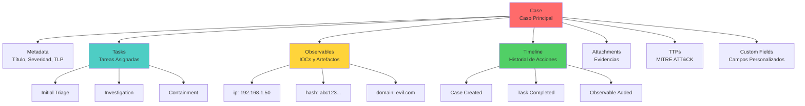
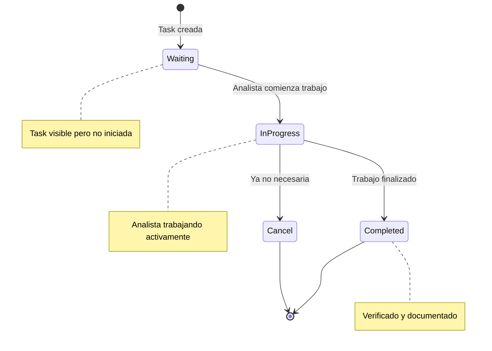
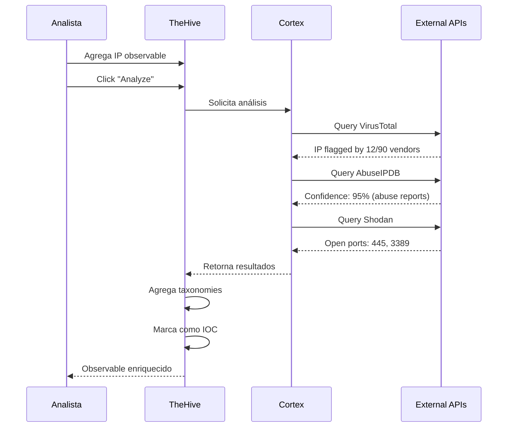
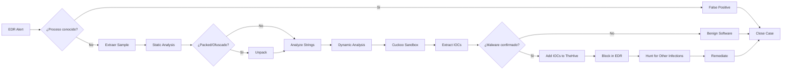

# Gestión de Casos en TheHive

## Resumen Ejecutivo

Este documento explica cómo gestionar casos de seguridad en TheHive 5, desde la creación inicial hasta el cierre, incluyendo tasks, observables, timeline, métricas y mejores prácticas de investigación.

!!! info "AI Context"
    Un **caso** en TheHive representa una investigación completa de un incidente de seguridad. Contiene tareas asignadas a analistas, observables (IOCs), timeline de acciones, y métricas automáticas (MTTD, MTTR). Los casos siguen un ciclo de vida definido: New → InProgress → Resolved → Closed.

---

## Anatomía de un Caso en TheHive

### Componentes Principales



### Estructura de Datos

| Campo | Tipo | Descripción | Ejemplo |
|-------|------|-------------|---------|
| **\_id** | String | ID único del caso | `~41287496` |
| **title** | String | Nombre descriptivo | "Ransomware en PROD-WEB-01" |
| **description** | Markdown | Descripción detallada | Ver ejemplo abajo |
| **severity** | Integer | 1=Low, 2=Medium, 3=High, 4=Critical | `4` |
| **tlp** | Integer | 0=WHITE, 1=GREEN, 2=AMBER, 3=RED | `2` (AMBER) |
| **pap** | Integer | 0=WHITE, 1=GREEN, 2=AMBER, 3=RED | `2` (AMBER) |
| **status** | Enum | New/InProgress/Resolved/Closed | `InProgress` |
| **tags** | Array | Etiquetas libres | `["ransomware", "conti", "t1486"]` |
| **startDate** | Timestamp | Fecha de detección | `1704067200000` |
| **endDate** | Timestamp | Fecha de resolución | `1704153600000` |
| **owner** | String | Usuario propietario | `analyst@thehive.local` |
| **impactStatus** | Enum | NoImpact/WithImpact/NotApplicable | `WithImpact` |
| **customFields** | Object | Campos definidos por organización | Ver ejemplo abajo |

**Ejemplo de Descripción Markdown:**

```markdown
## Resumen del Incidente

Alerta de Wazuh detectó comportamiento sospechoso en servidor web de producción:
- Ejecución de PowerShell ofuscado
- Múltiples intentos de escalación de privilegios
- Conexión a IP sospechosa 185.220.101.45

## Alcance Inicial

**Sistemas Afectados:**
- PROD-WEB-01 (10.0.1.50)
- PROD-DB-01 (10.0.1.51) - Posiblemente comprometido

**Datos en Riesgo:**
- Base de datos de clientes (~500,000 registros)
- Credenciales de aplicación

## Acciones Inmediatas Tomadas

1. ✅ Host PROD-WEB-01 aislado de la red
2. ✅ Snapshot de VM creado para análisis forense
3. ✅ Credenciales de aplicación rotadas
4. ⏳ Análisis de logs en progreso
```

---

## Creación Manual de Casos

### Método 1: Interfaz Web (UI)

#### Paso 1: Acceder a la Creación de Caso

```
1. Login en TheHive: https://thehive.example.com
2. Click en "+ NEW CASE" (esquina superior derecha)
3. Se abre el formulario de creación
```

#### Paso 2: Completar Información Básica

**Formulario de Caso:**

| Campo | Valor de Ejemplo | Notas |
|-------|------------------|-------|
| **Title** | Ransomware Conti en Servidor Web | Descriptivo y específico |
| **Severity** | Critical (4/4) | Basado en matriz de impacto |
| **TLP** | AMBER | Restringido a organización |
| **PAP** | AMBER | Acciones requieren aprobación |
| **Tags** | ransomware, conti, t1486, prod-web-01 | Para búsqueda y correlación |
| **Description** | Ver ejemplo anterior | Markdown soportado |
| **Impact Status** | With Impact | Datos/servicios afectados |

#### Paso 3: Configurar Fechas y Ownership

```
Start Date: [Auto] 2024-01-01 08:30:00
End Date: [Dejar vacío hasta resolución]
Owner: analyst-tier2@thehive.local
```

#### Paso 4: Asignar a Organización

```
Organization: Security Operations Center
```

!!! tip "Organizaciones en TheHive"
    Las organizaciones permiten multi-tenancy. Cada organización tiene sus propios casos, usuarios y permisos aislados.

#### Paso 5: Crear Caso

```
Click en "CREATE CASE"
→ Redirige a la vista del caso recién creado
```

### Método 2: API REST

```bash
# Crear caso via curl
curl -X POST https://thehive.example.com/api/v1/case \
  -H "Authorization: Bearer YOUR_API_KEY" \
  -H "Content-Type: application/json" \
  -d '{
    "title": "Phishing Campaign Targeting Finance Department",
    "description": "# Incident Summary\n\nMultiple employees in Finance received suspicious emails with malicious attachments.\n\n## Indicators\n- Sender: billing@amaz0n-security.com\n- Attachment: invoice_2024.pdf.exe\n- Subject: Urgent: Payment Overdue",
    "severity": 3,
    "tlp": 2,
    "pap": 2,
    "tags": ["phishing", "email", "finance"],
    "status": "New",
    "customFields": {
      "businessUnit": "Finance",
      "affectedUsers": 5,
      "dataClassification": "Confidential"
    }
  }'

# Respuesta exitosa:
# {
#   "_id": "~49152",
#   "title": "Phishing Campaign Targeting Finance Department",
#   "number": 123,
#   "createdAt": 1704153600000,
#   "createdBy": "api-integration@thehive.local",
#   ...
# }
```

### Método 3: Python SDK

```python
from thehive4py.api import TheHiveApi
from thehive4py.models import Case, CaseTask, CaseObservable

# Conectar a TheHive
api = TheHiveApi('https://thehive.example.com', 'YOUR_API_KEY')

# Crear caso
case = Case(
    title='SQL Injection Attempt on API Gateway',
    description='''
## Detection Source
Wazuh alert ID: 92503
WAF rule triggered: OWASP CRS 942100

## Attack Details
- Source IP: 203.0.113.45
- Target: https://api.example.com/v1/users
- Payload: `' OR 1=1 --`
- Timestamp: 2024-01-01 14:32:15 UTC

## Initial Assessment
- Attack blocked by WAF
- No database breach detected
- Attacker IP is known scanner (Shodan)
    ''',
    severity=2,  # Medium
    tlp=1,       # GREEN
    pap=1,       # GREEN
    tags=['sqli', 'web-attack', 'blocked'],
    customFields={
        'attackVector': 'Web Application',
        'preventedByWAF': True
    }
)

# Crear en TheHive
response = api.create_case(case)
case_id = response.json()['id']

print(f"Caso creado: {case_id}")

# Agregar tarea inicial
task = CaseTask(
    title='Verify WAF Logs',
    description='Confirm attack was fully blocked',
    status='Waiting',
    owner='analyst@thehive.local'
)
api.create_case_task(case_id, task)
```

---

## Templates de Casos

### ¿Qué son los Templates?

Los **templates** son plantillas predefinidas que estandarizan la creación de casos para tipos específicos de incidentes. Incluyen:

- Descripción estructurada
- Tasks predefinidas
- Custom fields específicos
- Tags automáticos

### Crear Template desde la UI

```
1. Ir a Admin Panel → Case Templates
2. Click en "+ NEW TEMPLATE"
3. Completar formulario:

Name: Ransomware Incident Response
Display Name: 🔐 Ransomware IR
TLP: AMBER (2)
PAP: AMBER (2)
Severity: Critical (4)
Tags: ransomware, ir, tier3
```

**Descripción del Template:**

```markdown
# 🚨 Ransomware Incident Response

## Objetivos
1. Contener la propagación del ransomware
2. Identificar paciente cero (patient zero)
3. Evaluar alcance del cifrado
4. Recuperar datos desde backups
5. Prevenir re-infección

## Información a Recopilar
- [ ] ¿Qué variante de ransomware? (Analizar nota de rescate)
- [ ] ¿Cuántos sistemas afectados?
- [ ] ¿Datos exfiltrados antes del cifrado?
- [ ] ¿Backups disponibles y limpios?
- [ ] ¿Vector de entrada inicial?

## Stakeholders
- **Incident Commander:** [Asignar]
- **Technical Lead:** [Asignar]
- **Communications:** [Asignar]
- **Legal Counsel:** [Notificar si datos sensibles afectados]

## Severity Justification
Ransomware es crítico por:
- Interrupción de operaciones business-critical
- Posible pérdida de datos
- Potencial exfiltración (double extortion)
- Impacto reputacional
```

**Tasks Predefinidas:**

```yaml
Tasks:
  - title: "Initial Triage"
    description: |
      - Confirmar incidente de ransomware (vs. malware genérico)
      - Identificar variante (buscar nota de rescate)
      - Documentar timestamp de detección
    status: Waiting
    mandatory: true

  - title: "Containment - Network Isolation"
    description: |
      - Aislar hosts afectados de la red
      - Deshabilitar cuentas comprometidas
      - Bloquear IOCs conocidos en firewall
    status: Waiting
    mandatory: true

  - title: "Investigation - Scope Assessment"
    description: |
      - Listar todos los sistemas con archivos cifrados
      - Identificar patient zero (primer host infectado)
      - Analizar logs de EDR/SIEM para timeline
      - Buscar indicadores de exfiltración
    status: Waiting
    mandatory: false

  - title: "Eradication - Malware Removal"
    description: |
      - Eliminar binarios de ransomware
      - Resetear credenciales comprometidas
      - Parchear vulnerabilidades explotadas
    status: Waiting
    mandatory: true

  - title: "Recovery - Restore from Backup"
    description: |
      - Validar integridad de backups
      - Restaurar datos críticos
      - Verificar que sistemas estén limpios antes de reconectar
    status: Waiting
    mandatory: true

  - title: "Post-Incident - Lessons Learned"
    description: |
      - Documentar timeline completo
      - Identificar gaps en detección/respuesta
      - Actualizar playbooks
      - Reportar a stakeholders
    status: Waiting
    mandatory: false
```

### Usar Template para Crear Caso

**Via UI:**

```
1. Click en "+ NEW CASE"
2. En "Use Template", seleccionar "🔐 Ransomware IR"
3. TheHive auto-completa todos los campos
4. Personalizar según sea necesario
5. Click en "CREATE CASE"
```

**Via API:**

```bash
curl -X POST https://thehive.example.com/api/v1/case \
  -H "Authorization: Bearer YOUR_API_KEY" \
  -H "Content-Type: application/json" \
  -d '{
    "template": "ransomware-ir",
    "title": "Ransomware Conti in PROD-DB-03",
    "customFields": {
      "affectedSystems": "PROD-DB-03, PROD-DB-04",
      "ransomwareVariant": "Conti v3"
    }
  }'
```

---

## Severidad y TLP (Traffic Light Protocol)

### Matriz de Severidad

| Severidad | Nivel | Criterios | Ejemplos |
|-----------|-------|-----------|----------|
| **Low** | 1 | Sin impacto operativo, riesgo mínimo | Scan automatizado bloqueado, alerta de policy menor |
| **Medium** | 2 | Impacto limitado, requiere investigación | Phishing reportado (sin clicks), vulnerabilidad de software no-crítico |
| **High** | 3 | Impacto significativo, contención urgente | Malware ejecutado, data breach limitado, sistema crítico comprometido |
| **Critical** | 4 | Impacto catastrófico, crisis empresarial | Ransomware en producción, exfiltración masiva, APT detectado |

**Cálculo de Severidad:**

```
Severidad = (Probabilidad de Éxito × Impacto al Negocio)

Probabilidad:
- Confirmada (100%): Evidencia forense
- Alta (75%): Múltiples indicadores
- Media (50%): Indicadores limitados
- Baja (25%): Sospecha sin confirmación

Impacto:
- Crítico (4): Operaciones detenidas, pérdida financiera >$1M
- Alto (3): Degradación severa, pérdida $100K-$1M
- Medio (2): Degradación moderada, pérdida $10K-$100K
- Bajo (1): Sin impacto operativo, pérdida <$10K
```

### Traffic Light Protocol (TLP)

**Clasificación de Sensibilidad:**

=== "TLP:RED"
    ```
    🔴 TLP:RED - Solo para destinatarios nombrados

    Uso: Información extremadamente sensible
    Compartir: No se puede compartir más allá de la reunión/email específico
    Ejemplos:
    - Información de investigación criminal activa
    - Vulnerabilidades 0-day no parchadas
    - Detalles de operaciones de inteligencia
    ```

=== "TLP:AMBER"
    ```
    🟠 TLP:AMBER - Compartir solo dentro de la organización

    Uso: Información sensible que podría causar daño si se divulga
    Compartir: Solo con miembros de la organización (need-to-know)
    Ejemplos:
    - Detalles de incidentes en investigación
    - IOCs no públicos
    - Vulnerabilidades internas
    ```

=== "TLP:GREEN"
    ```
    🟢 TLP:GREEN - Compartir con comunidad de pares

    Uso: Información útil para conciencia pero no para público general
    Compartir: Comunidad de seguridad, socios, clientes
    Ejemplos:
    - IOCs verificados
    - TTPs de amenazas conocidas
    - Indicadores de campañas de phishing
    ```

=== "TLP:WHITE"
    ```
    ⚪ TLP:WHITE - Disclosure público permitido

    Uso: Información no sensible
    Compartir: Sin restricciones
    Ejemplos:
    - Alertas de seguridad públicas
    - Recomendaciones generales
    - Estadísticas agregadas
    ```

### Permissible Actions Protocol (PAP)

**Define qué acciones se pueden tomar con los IOCs:**

| PAP | Descripción | Acciones Permitidas |
|-----|-------------|---------------------|
| **PAP:RED** | No actuar sin coordinación | Bloqueo manual con aprobación |
| **PAP:AMBER** | Actuar con precaución | Bloqueo después de validación |
| **PAP:GREEN** | Actuar según políticas estándar | Bloqueo automático permitido |
| **PAP:WHITE** | Sin restricciones | Bloqueo inmediato, compartir públicamente |

**Ejemplo de Uso:**

```
Caso: Phishing Campaign
TLP: AMBER (no compartir públicamente)
PAP: GREEN (bloquear sender en email gateway)

Caso: APT Investigation
TLP: RED (solo equipo IR)
PAP: RED (no bloquear IPs aún, siguen siendo monitoreadas)
```

---

## Tasks y Subtasks

### Crear Task desde UI

```
1. Abrir caso existente
2. Ir a pestaña "Tasks"
3. Click en "+ NEW TASK"
4. Completar formulario:

Title: Analyze Malware Sample
Description: |
  Extract sample from quarantine and analyze:
  - Static analysis (strings, imports)
  - Dynamic analysis (sandbox)
  - YARA matching
  - IOC extraction

Status: Waiting
Assignee: malware-analyst@thehive.local
Due Date: 2024-01-02 18:00
```

### Estados de Tasks



### Crear Task via API

```python
from thehive4py.api import TheHiveApi
from thehive4py.models import CaseTask

api = TheHiveApi('https://thehive.example.com', 'YOUR_API_KEY')

task = CaseTask(
    title='Review Firewall Logs',
    description='''
## Objetivo
Identificar conexiones salientes a IP sospechosa 185.220.101.45

## Fuentes de Datos
- Palo Alto Firewall: /var/log/panos/traffic.log
- Timeframe: 2024-01-01 08:00 - 10:00 UTC

## Entregables
- Lista de hosts internos que contactaron la IP
- Puertos y protocolos utilizados
- Volumen de datos transferidos
    ''',
    status='Waiting',
    owner='network-analyst@thehive.local',
    flag=False,  # False = no urgente
    startDate=1704096000000,  # Epoch milliseconds
    dueDate=1704182400000
)

# Agregar a caso existente
case_id = '~49152'
response = api.create_case_task(case_id, task)

print(f"Task creada: {response.json()['id']}")
```

### Subtasks (Tasks Anidadas)

!!! info "Subtasks desde TheHive 5.2+"
    TheHive 5.2+ soporta subtasks nativas. En versiones anteriores, usa checklist en descripción.

**Ejemplo de Subtasks:**

```markdown
# Main Task: Incident Communication

## Subtasks:
- [ ] Notificar a CISO (urgente)
- [ ] Preparar executive summary
- [ ] Enviar update a stakeholders (cada 2 horas)
- [ ] Coordinar con Legal si datos sensibles afectados
- [ ] Post-mortem report al cierre

## Templates de Comunicación:
- Executive: [Link a template]
- Técnico: [Link a template]
```

---

## Observables (IOCs) - Tipos y Gestión

### ¿Qué son los Observables?

Los **observables** son artefactos técnicos relacionados con el incidente. TheHive distingue entre:

- **Observable**: Cualquier dato relacionado (ej: IP legítima de víctima)
- **IOC (Indicator of Compromise)**: Observable confirmado como malicioso

### Tipos de Observables Soportados

| Tipo | Descripción | Ejemplo | Uso Común |
|------|-------------|---------|-----------|
| **ip** | IPv4/IPv6 | `203.0.113.45` | C2 servers, atacantes |
| **domain** | Nombre de dominio | `malicious-site.com` | Phishing, C2 |
| **url** | URL completa | `https://evil.com/payload.exe` | Download de malware |
| **fqdn** | FQDN | `mail.attacker.org` | Infraestructura de atacante |
| **mail** | Email address | `phishing@evil.com` | Remitente de phishing |
| **hash** | MD5/SHA1/SHA256 | `d41d8cd98f00b204e9800998ecf8427e` | Malware samples |
| **filename** | Nombre de archivo | `invoice.pdf.exe` | Malware dropper |
| **user-agent** | HTTP User-Agent | `Mozilla/5.0 (EvilBot)` | Web attacks |
| **registry** | Clave de registro Windows | `HKLM\Software\Malware` | Persistencia |
| **autonomous-system** | ASN | `AS15169` | Atribución de atacante |
| **other** | Datos custom | API Key leaked | Contexto específico |

### Agregar Observable desde UI

```
1. Abrir caso
2. Ir a pestaña "Observables"
3. Click en "+ NEW OBSERVABLE"
4. Completar formulario:

Data Type: ip
Value: 185.220.101.45
TLP: AMBER
Tags: c2-server, conti-ransomware
IOC: [✓] Sí (es malicioso)
Sighted: [✓] Sí (visto en nuestro entorno)
Ignore Similarity: [ ] No
```

!!! tip "Sighted vs. Not Sighted"
    - **Sighted**: Observable visto en TU entorno (tu organización fue afectada)
    - **Not Sighted**: Observable de threat intel externo (no confirmado en tu red)

### Agregar Observable via API

```bash
curl -X POST https://thehive.example.com/api/v1/case/~49152/observable \
  -H "Authorization: Bearer YOUR_API_KEY" \
  -H "Content-Type: application/json" \
  -d '{
    "dataType": "hash",
    "data": "e3b0c44298fc1c149afbf4c8996fb92427ae41e4649b934ca495991b7852b855",
    "tlp": 2,
    "ioc": true,
    "sighted": true,
    "tags": ["ransomware", "conti", "payload"],
    "message": "SHA256 hash of ransomware payload extracted from PROD-WEB-01"
  }'
```

### Búsqueda de Observables Similares

TheHive automáticamente busca observables similares entre casos:

```
Observable agregado: domain:evil-phishing.com

TheHive detecta:
✓ Mismo observable en Caso #115 (Phishing Campaign - Finance)
✓ Similar observable en Caso #98 (evil-phishing.net)

→ Sugiere que pueden ser parte de la misma campaña
```

**Deshabilitar Similarity (casos especiales):**

```yaml
Escenario: Agregar IP pública de Google (8.8.8.8) como observable de investigación

Problema: TheHive lo encuentra en cientos de casos (es extremadamente común)
Solución: Marcar "Ignore Similarity" para no generar falsos positivos
```

---

## Análisis Automático de Observables con Cortex

### Flujo de Análisis



### Analyzers Populares

| Analyzer | Tipo de Observable | Información Retornada |
|----------|-------------------|----------------------|
| **VirusTotal** | ip, domain, hash, url | Reputación, detecciones AV |
| **AbuseIPDB** | ip | Abuse reports, confidence score |
| **Shodan** | ip | Puertos abiertos, servicios, vulnerabilidades |
| **MaxMind** | ip | Geolocalización, ASN, ISP |
| **URLhaus** | url, domain | Malware distribution |
| **MISP** | todos | Threat intel de feeds MISP |
| **Yara** | hash, filename | Pattern matching |
| **CuckooSandbox** | hash, filename | Dynamic malware analysis |

### Ejecutar Análisis Manual

```
1. Ir a observable
2. Click en botón "▶ Run Analyzers"
3. Seleccionar analyzers a ejecutar:
   [✓] VirusTotal_GetReport_3_0
   [✓] AbuseIPDB_1_0
   [✓] Shodan_Info_1_0
   [ ] PassiveTotal_Lookup_2_0
4. Click "RUN"
5. Esperar resultados (10-60 segundos)
```

### Análisis Automático (via Shuffle)

```yaml
Workflow: Auto-Analyze Observables

Trigger: Observable agregado a caso
Condition: IOC = true AND dataType IN ["ip", "domain", "hash"]

Actions:
  1. Ejecutar VirusTotal analyzer
  2. Ejecutar AbuseIPDB analyzer
  3. SI confidence > 80%:
     - Marcar como IOC
     - Agregar tag "high-confidence"
     - Notificar en Slack #soc-alerts
  4. SI confidence < 20%:
     - Remover marca IOC
     - Agregar tag "likely-benign"
```

---

## Timeline de Investigación

### ¿Qué es el Timeline?

El **timeline** es un log inmutable de todas las acciones realizadas en el caso:

```
Timeline Example:

2024-01-01 08:30:15 | Case created by analyst@thehive.local
2024-01-01 08:32:45 | Task "Initial Triage" created
2024-01-01 08:35:12 | Observable added: ip:185.220.101.45
2024-01-01 08:36:03 | Observable analyzed with VirusTotal
2024-01-01 08:36:30 | Observable marked as IOC
2024-01-01 09:15:22 | Task "Initial Triage" status → InProgress
2024-01-01 10:45:10 | Task "Initial Triage" completed by analyst@thehive.local
2024-01-01 10:46:00 | Comment added: "Confirmed as Conti ransomware v3"
2024-01-01 11:00:00 | Case severity changed: Medium → Critical
2024-01-01 14:30:00 | Attachment added: forensic-report.pdf
2024-01-01 18:00:00 | Case status → Resolved
2024-01-02 09:00:00 | Case status → Closed
```

### Filtrar Timeline

```
UI: Vista de Caso → Timeline

Filtros disponibles:
- Show only: [All Actions ▼]
  - Comments
  - Status Changes
  - Task Updates
  - Observables Added
  - Attachments

- Date Range: [Last 7 days ▼]

- User: [All users ▼]
```

### Exportar Timeline

```bash
# Via API
curl -X GET "https://thehive.example.com/api/v1/case/~49152/timeline" \
  -H "Authorization: Bearer YOUR_API_KEY" \
  -o case-timeline.json

# Convertir a formato legible
jq '.[] | "\(.date | strftime("%Y-%m-%d %H:%M:%S")) | \(.message)"' \
  case-timeline.json > case-timeline.txt
```

---

## Métricas y Reportes

### Métricas Automáticas por Caso

TheHive calcula automáticamente:

| Métrica | Descripción | Cálculo |
|---------|-------------|---------|
| **Time to Detect (TTD)** | Tiempo desde incidente hasta detección | `detectionDate - incidentDate` |
| **Time to Respond (TTR)** | Tiempo desde detección hasta primera acción | `firstActionDate - detectionDate` |
| **Time to Resolve (TTRS)** | Tiempo total de resolución | `resolvedDate - detectionDate` |
| **Time to Close (TTC)** | Tiempo desde creación hasta cierre | `closedDate - createdDate` |

### Ver Métricas de un Caso

```
UI: Vista de Caso → Pestaña "Metrics"

Métricas mostradas:
┌─────────────────────────────┐
│ Time to Detect:    2 hours  │
│ Time to Respond:   15 mins  │
│ Time to Resolve:   9.5 hours│
│ Time to Close:     25 hours │
│                             │
│ Tasks Completed:   12/15    │
│ Observables:       47       │
│ IOCs:              18       │
└─────────────────────────────┘
```

### Dashboard de Métricas (Organizacional)

```
UI: Admin → Statistics

Métricas agregadas (últimos 30 días):
- Total Cases: 234
- Critical: 12 (5%)
- High: 45 (19%)
- Medium: 98 (42%)
- Low: 79 (34%)

Avg. Time to Resolve:
- Critical: 4.2 hours
- High: 12.5 hours
- Medium: 2.3 days
- Low: 5.1 days

Top Analysts:
1. analyst1@thehive.local - 45 cases closed
2. analyst2@thehive.local - 38 cases closed
3. analyst3@thehive.local - 32 cases closed
```

### Exportar Métricas para BI

```python
from thehive4py.api import TheHiveApi
import pandas as pd

api = TheHiveApi('https://thehive.example.com', 'YOUR_API_KEY')

# Query casos cerrados en últimos 30 días
query = {
    'query': {
        '_and': [
            {'status': 'Closed'},
            {'_gte': {'closedAt': 1704067200000}}  # Unix timestamp
        ]
    }
}

response = api.find_cases(query=query)
cases = response.json()

# Convertir a DataFrame
df = pd.DataFrame([{
    'case_number': c['number'],
    'title': c['title'],
    'severity': c['severity'],
    'created_at': c['createdAt'],
    'closed_at': c.get('closedAt'),
    'owner': c['owner'],
    'tasks_total': len(c.get('tasks', [])),
    'observables_total': len(c.get('observables', []))
} for c in cases])

# Calcular TTR
df['ttr_hours'] = (df['closed_at'] - df['created_at']) / (1000 * 3600)

# Exportar a CSV para Grafana/Power BI
df.to_csv('thehive-metrics.csv', index=False)
```

---

## Ejemplos Prácticos

### Caso 1: Investigación de Phishing

**Escenario:**

Usuario reporta email sospechoso. SOC debe verificar si es phishing legítimo y si otros usuarios fueron afectados.

#### Paso 1: Crear Caso

```yaml
Title: Suspected Phishing Email - Invoice Theme
Severity: Medium (2)
TLP: GREEN
Tags: phishing, email, finance-theme
Description: |
  User john.doe@example.com reported suspicious email:

  From: billing@amaz0n-security.com
  Subject: Urgent: Payment Overdue - Action Required
  Attachment: invoice_2024.pdf.exe (1.2 MB)

  User did NOT click link or open attachment.
```

#### Paso 2: Crear Tasks

```markdown
Tasks:
1. ✓ Analyze Email Headers
   - Check SPF/DKIM/DMARC
   - Identify originating IP
   - Verify sender legitimacy

2. ✓ Analyze Attachment
   - Submit to sandbox (Cuckoo)
   - Run YARA rules
   - Extract IOCs

3. ✓ Search for Similar Emails
   - Query email gateway logs
   - Identify other recipients
   - Check if anyone clicked

4. ⏳ Block Sender
   - Add to email gateway blacklist
   - Update spam filters

5. ⏳ User Awareness
   - Send reminder to affected users
   - Update phishing training
```

#### Paso 3: Agregar Observables

```python
Observables:
- mail: billing@amaz0n-security.com (IOC: True)
- domain: amaz0n-security.com (IOC: True)
- ip: 203.0.113.45 (sending IP, IOC: True)
- hash: a3f2e1d... (SHA256 of attachment, IOC: True)
- filename: invoice_2024.pdf.exe (IOC: True)
```

#### Paso 4: Análisis con Cortex

```
VirusTotal Results:
- Domain: 45/90 vendors flagged as phishing
- Hash: 52/70 AV engines detect as trojan
- IP: Listed in 3 reputation databases

Verdict: ✓ CONFIRMED PHISHING
```

#### Paso 5: Respuesta

```markdown
Actions Taken:
1. ✓ Sender domain blocked in email gateway
2. ✓ Attachment hash added to EDR blacklist
3. ✓ IP blocked in firewall
4. ✓ Email purged from all mailboxes (15 recipients)
5. ✓ Phishing alert sent to organization

Outcome:
- 0 users clicked link (thanks to quick reporting)
- 0 infections
- Campaign blocked

Case Status: Resolved → Closed
```

### Caso 2: Análisis de Malware

**Escenario:**

EDR detectó ejecución de proceso sospechoso. Analista debe determinar si es malware y su funcionalidad.

#### Workflow Detallado



#### Observables Extraídos

```yaml
File Observables:
- hash: e3b0c442... (SHA256, IOC)
- filename: svchost.exe (IOC - typosquatting real svchost)
- registry: HKCU\Software\Microsoft\Windows\CurrentVersion\Run (persistence)

Network Observables:
- ip: 45.67.89.123 (C2 server, IOC)
- domain: updates-microsoft.net (C2 domain, IOC)
- url: http://updates-microsoft.net/api/beacon (C2 callback, IOC)

Behavior Observables:
- user-agent: "Mozilla/5.0 (Windows NT 10.0; Win64; x64)" (generic, no IOC)
- autonomous-system: AS12345 (attacker infrastructure)
```

#### Report Final

```markdown
# Malware Analysis Report

## Executive Summary
Confirmed malware: **AgentTesla** info-stealer

## Capabilities Identified
- Keylogging
- Clipboard monitoring
- Screenshot capture
- Credential theft (browsers, FTP clients)
- C2 communication via HTTP POST

## Indicators of Compromise
- SHA256: e3b0c442...
- C2 IP: 45.67.89.123
- C2 Domain: updates-microsoft.net

## Remediation
- ✓ Binary removed from infected host
- ✓ EDR signature updated
- ✓ C2 domain blocked in DNS firewall
- ✓ Credentials reset for affected user
- ✓ Threat hunt completed (no other infections found)

## Attribution
Likely related to APT-C-36 (Blind Eagle) based on:
- C2 infrastructure overlap
- Similar packing technique
- Targeting Latin America region
```

---

## AI Context - Información para LLMs

```yaml
Gestión de Casos: TheHive

Componentes de Caso:
  - Title: Nombre descriptivo
  - Severity: 1-4 (Low, Medium, High, Critical)
  - TLP: 0-3 (WHITE, GREEN, AMBER, RED)
  - PAP: 0-3 (define acciones permitidas)
  - Status: New/InProgress/Resolved/Closed
  - Tasks: Pasos de investigación
  - Observables: IOCs y artefactos técnicos
  - Timeline: Log inmutable de acciones

Tipos de Observables:
  - Técnicos: ip, domain, hash, url
  - Email: mail, mail_subject
  - Files: filename, hash
  - System: registry, user-agent
  - Network: autonomous-system, fqdn

Métricas Clave:
  - TTD: Time to Detect
  - TTR: Time to Respond
  - TTRS: Time to Resolve
  - TTC: Time to Close

Workflows Comunes:
  1. Alert → Case Creation
  2. Case → Add Observables
  3. Observables → Cortex Analysis
  4. Analysis → IOC Confirmation
  5. IOCs → Automated Blocking
  6. Resolution → Metrics Collection

Integración con Stack:
  - Wazuh: Alertas → TheHive Cases
  - Cortex: Observable Analysis
  - MISP: Threat Intel Sharing
  - Shuffle: Workflow Automation
  - Odoo: Ticket Creation para Remediación

API Endpoints:
  - POST /api/v1/case: Crear caso
  - GET /api/v1/case/{id}: Ver caso
  - POST /api/v1/case/{id}/observable: Agregar observable
  - POST /api/v1/case/{id}/task: Crear task
  - GET /api/v1/case/_search: Buscar casos
```

---

!!! success "Siguiente Paso"
    Continúa con **[Integración con Shuffle](integration-shuffle.md)** para automatizar la creación de casos desde alertas de Wazuh.
