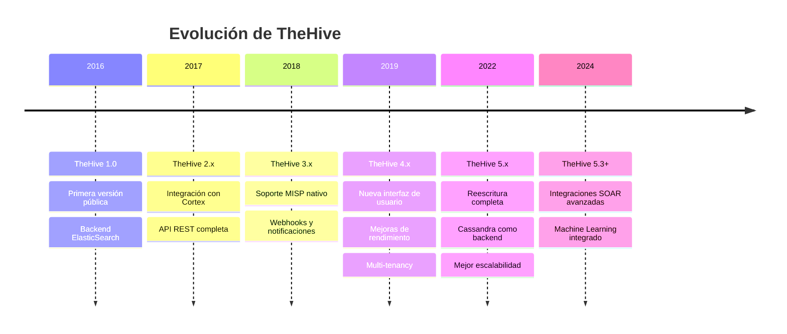
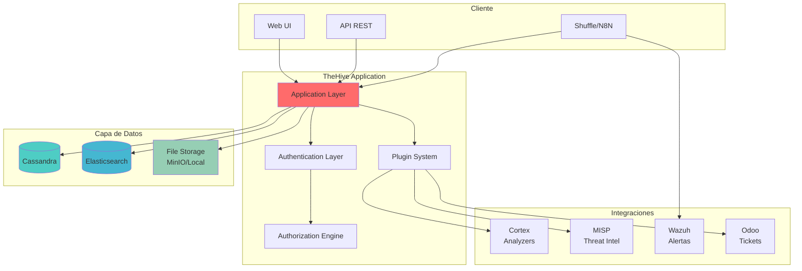
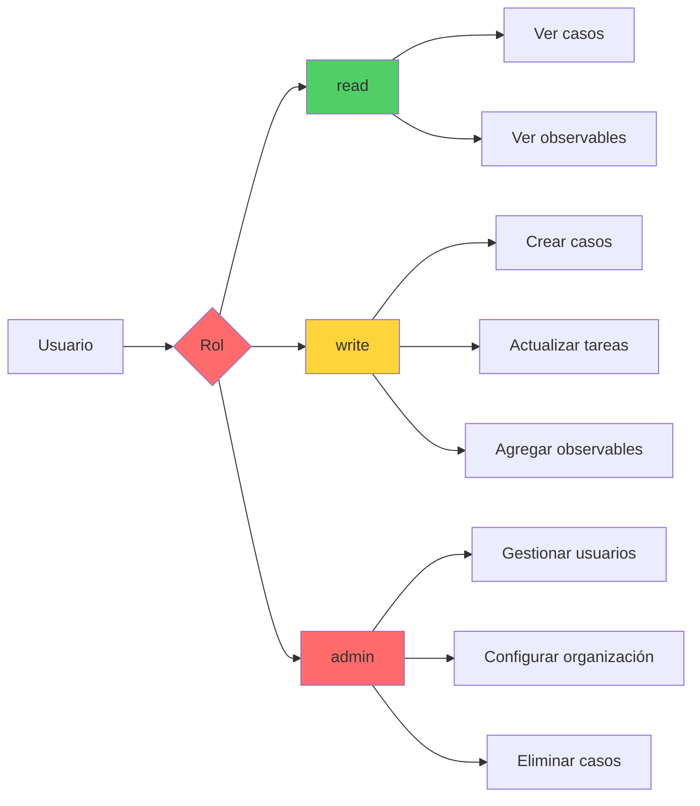
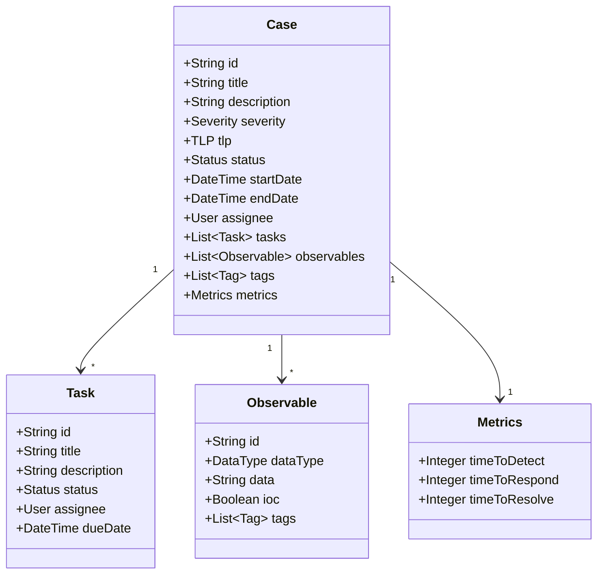
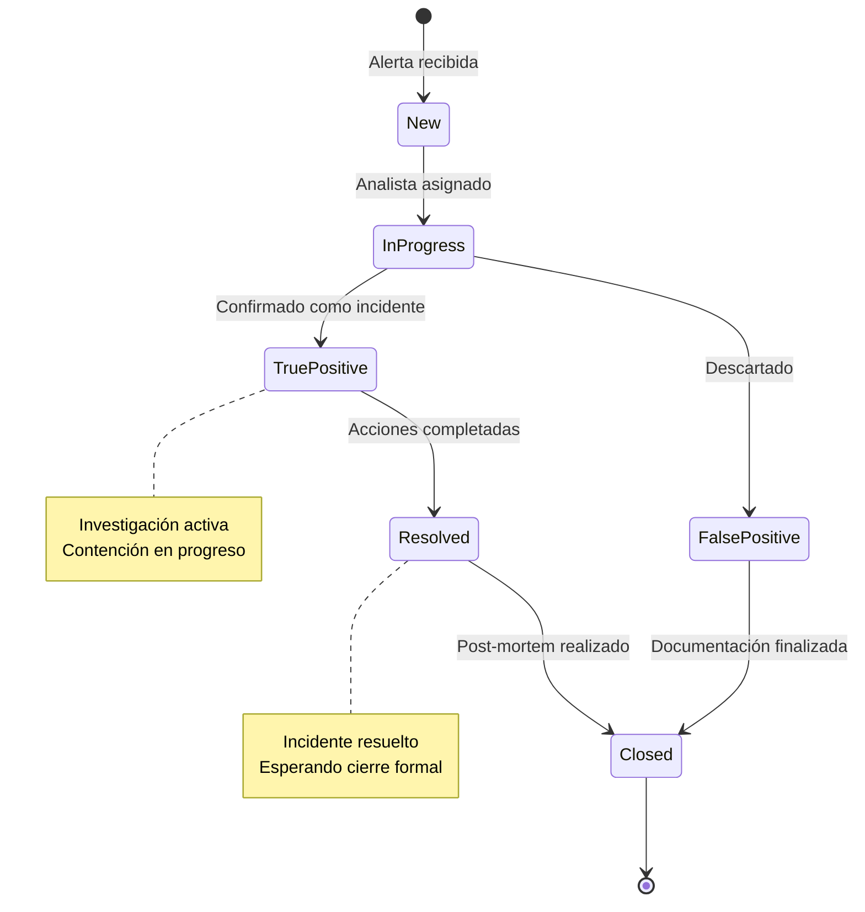
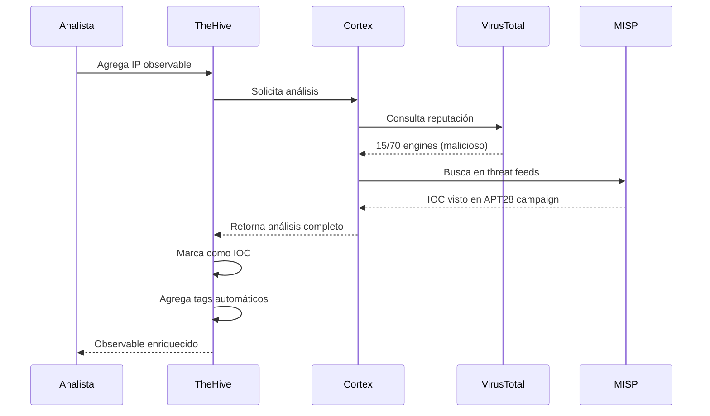
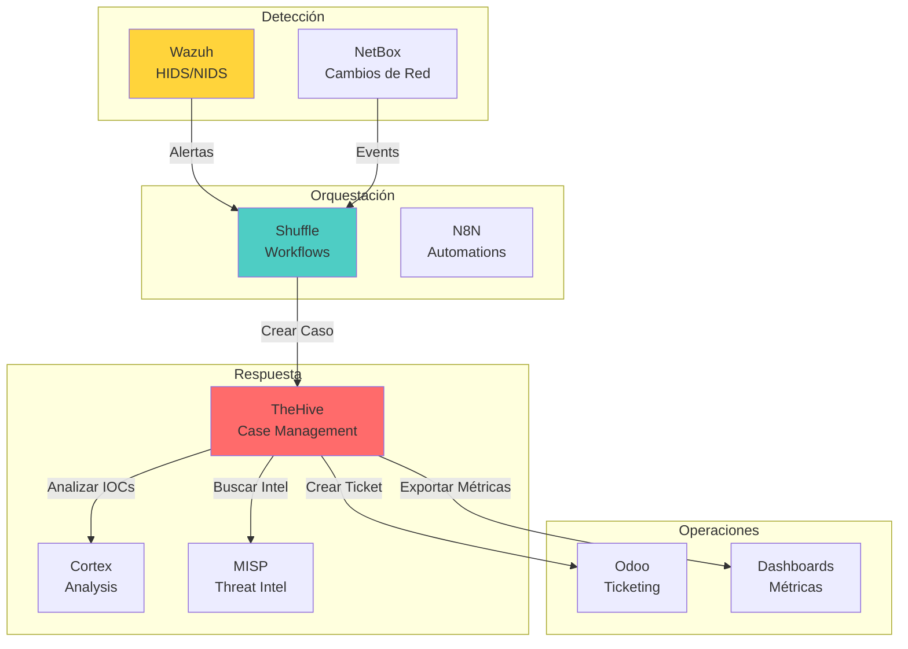
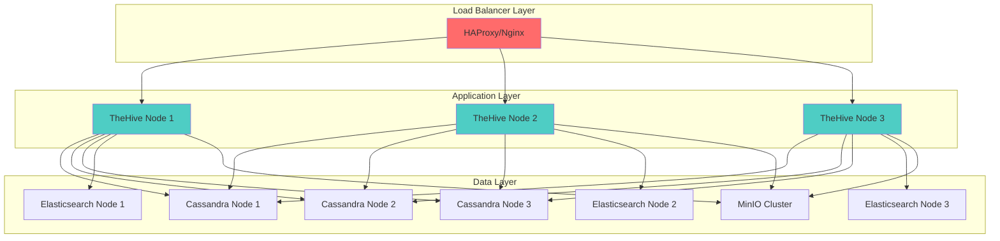
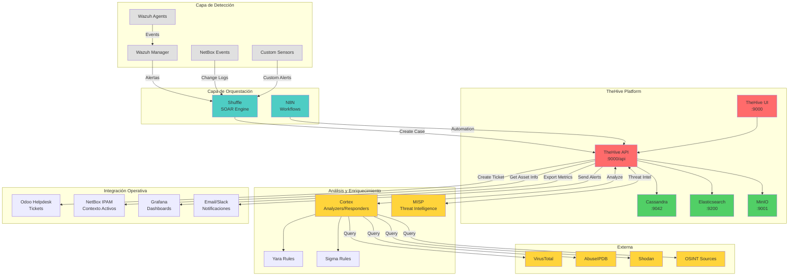

# Introducción a TheHive

## Resumen Ejecutivo

TheHive es una plataforma de **Respuesta a Incidentes de Seguridad (SIRP - Security Incident Response Platform)** de código abierto, diseñada para facilitar la colaboración entre equipos SOC (Security Operations Center), analistas de seguridad e investigadores durante la gestión de incidentes de ciberseguridad.

!!! info "AI Context"
    TheHive es una herramienta fundamental en la stack NEO_NETBOX_ODOO para la gestión centralizada de incidentes de seguridad. Permite convertir alertas de Wazuh en casos investigables, enriquecer IOCs automáticamente, y coordinar la respuesta a incidentes de forma colaborativa.

---

## ¿Qué es TheHive?

### Definición Didáctica

Imagina que tu equipo de seguridad recibe cientos de alertas diarias de diferentes fuentes: Wazuh detecta un comportamiento anómalo, un usuario reporta un correo sospechoso, NetBox muestra actividad inusual en un servidor crítico. **¿Cómo organizas toda esta información? ¿Cómo coordinas la investigación entre múltiples analistas? ¿Cómo documentas las acciones tomadas?**

**TheHive es la respuesta a estas preguntas.**

Es una plataforma que centraliza toda la información relacionada con un incidente de seguridad en una estructura llamada **"Case" (Caso)**. Cada caso puede contener:

- **Alertas** originales que lo desencadenaron
- **Observables** (IOCs): direcciones IP, hashes de archivos, URLs maliciosas
- **Tareas** asignadas a analistas específicos
- **Timeline** de todas las acciones realizadas
- **Anexos** como capturas de pantalla, logs, reportes
- **Métricas** de tiempo de respuesta y resolución

### Analogía Práctica

Si un SIEM como Wazuh es el "sistema de alarmas" de tu organización, **TheHive es el "cuartel de bomberos"** donde se coordina la respuesta. No solo registra qué alarma sonó, sino quién respondió, qué acciones tomó, qué evidencia encontró, y cómo se resolvió el incidente.

---

## Historia y Evolución de la Herramienta

### Cronología de Desarrollo



### TheHive Project

**TheHive Project** es una iniciativa de **CERT-BDF** (Centre d'Expertise de Réponse et de Traitement des Attaques - Francia), lanzada en 2016 como respuesta a la necesidad de contar con herramientas de respuesta a incidentes modernas, colaborativas y de código abierto.

**Motivación Original:**

- Las herramientas comerciales eran costosas y poco flexibles
- Las hojas de cálculo no escalaban para equipos grandes
- Faltaba integración nativa con herramientas OSINT y análisis forense

**Adopción Actual (2024-2025):**

- +5,000 organizaciones utilizan TheHive en producción
- Comunidad activa con +200 integraciones desarrolladas
- Soporte empresarial disponible via StrangeBee (empresa detrás de TheHive)

---

## Arquitectura de TheHive 5.x

### Visión de Alto Nivel



### Componentes Principales

#### 1. Application Layer (Capa de Aplicación)

**Lenguaje:** Scala (backend) + Vue.js (frontend)

**Responsabilidades:**

- Gestión de casos, tareas y observables
- Motor de workflow y automatización
- API REST para integraciones
- Procesamiento de eventos en tiempo real

**Características Técnicas:**

- **Play Framework**: Framework web escalable
- **Akka**: Modelo de actores para concurrencia
- **Asincronía**: Procesa miles de solicitudes simultáneas

#### 2. Authentication & Authorization

**Métodos de Autenticación Soportados:**

| Método | Casos de Uso | Complejidad |
|--------|--------------|-------------|
| **Local** | Entornos de desarrollo/testing | Baja |
| **LDAP/AD** | Integración con Active Directory corporativo | Media |
| **OAuth2** | SSO con Google, Azure AD, Okta | Media |
| **API Keys** | Automatización y integraciones | Baja |
| **PKI (X.509)** | Ambientes de alta seguridad | Alta |

**Modelo de Permisos:**



#### 3. Data Storage (Almacenamiento de Datos)

##### Cassandra (Base de Datos Principal)

!!! warning "Cambio Importante en TheHive 5"
    TheHive 5.x migró de **Elasticsearch** a **Cassandra** como base de datos principal debido a problemas de escalabilidad y consistencia en versiones anteriores.

**Por qué Cassandra:**

- **Escalabilidad horizontal**: Añade nodos sin downtime
- **Alta disponibilidad**: Sin punto único de falla
- **Consistencia eventual**: Ideal para datos de incidentes
- **Rendimiento**: Escrituras extremadamente rápidas

**Esquema de Datos:**

```
Keyspace: thehive
├── cases (casos)
├── tasks (tareas)
├── observables (indicadores)
├── alerts (alertas)
├── users (usuarios)
└── audit_logs (logs de auditoría)
```

##### Elasticsearch (Motor de Búsqueda)

**Rol en TheHive 5:**

- Índices de búsqueda full-text
- Queries complejas sobre casos y observables
- Agregaciones para dashboards
- Búsqueda de similitud (casos relacionados)

**No se usa para:**

- Almacenamiento primario de datos
- Datos críticos (solo índices)

##### MinIO/File Storage

**Almacenamiento de Anexos:**

- Capturas de pantalla
- Archivos de malware (encriptados)
- Reportes en PDF
- Logs exportados

**Opciones de Backend:**

| Opción | Pros | Contras |
|--------|------|---------|
| **Local Filesystem** | Simple, sin dependencias | No escalable |
| **MinIO** | Compatible S3, escalable | Infraestructura adicional |
| **Amazon S3** | Serverless, ilimitado | Costos variables |
| **Azure Blob** | Integrado con Azure | Vendor lock-in |

#### 4. Plugin System

TheHive 5 introdujo un sistema de plugins modular que permite extender funcionalidades sin modificar el core.

**Tipos de Plugins:**

1. **Analyzers** (via Cortex)
   - VirusTotal, AbuseIPDB, Shodan
   - Análisis de archivos (YARA, ClamAV)
   - OSINT (WhoisXML, DomainTools)

2. **Responders** (via Cortex)
   - Bloqueo de IPs en firewall
   - Aislamiento de endpoints
   - Notificaciones a Slack/Teams

3. **Notifiers**
   - Email, Webhooks, SIEM
   - Integración con ticketing (Odoo, Jira)

4. **Custom Integrations**
   - Shuffle workflows
   - N8N automations
   - Scripts Python personalizados

---

## Componentes Principales de TheHive

### 1. Cases (Casos)

Un **caso** es la unidad fundamental de trabajo en TheHive. Representa una investigación completa de un incidente de seguridad.

#### Anatomía de un Caso



#### Campos Clave

| Campo | Descripción | Ejemplo |
|-------|-------------|---------|
| **Title** | Nombre descriptivo del caso | "Ransomware en servidor PROD-WEB-01" |
| **Severity** | Nivel de criticidad (Low/Medium/High/Critical) | Critical |
| **TLP** | Traffic Light Protocol (WHITE/GREEN/AMBER/RED) | AMBER |
| **PAP** | Permissible Actions Protocol | PAP:AMBER |
| **Status** | Estado actual (New/InProgress/Resolved/Closed) | InProgress |
| **Tags** | Etiquetas para categorización | malware, ransomware, conti |
| **Custom Fields** | Campos personalizables | businessImpact, affectedSystems |

#### Ciclo de Vida de un Caso



### 2. Tasks (Tareas)

Las **tareas** dividen la investigación en pasos accionables asignados a analistas específicos.

#### Tipos de Tareas Comunes

```markdown
**Initial Triage**
- [ ] Validar alerta como verdadero positivo
- [ ] Determinar severidad y TLP
- [ ] Identificar activos afectados

**Investigation**
- [ ] Analizar logs del endpoint
- [ ] Revisar tráfico de red (PCAP)
- [ ] Correlacionar con eventos previos

**Containment**
- [ ] Aislar host afectado
- [ ] Bloquear IOCs en firewall
- [ ] Revocar credenciales comprometidas

**Eradication**
- [ ] Eliminar malware del sistema
- [ ] Parchear vulnerabilidad explotada
- [ ] Resetear contraseñas afectadas

**Recovery**
- [ ] Restaurar desde backup
- [ ] Validar integridad de sistemas
- [ ] Monitorear por reinfección

**Post-Incident**
- [ ] Documentar lecciones aprendidas
- [ ] Actualizar playbooks
- [ ] Reportar a stakeholders
```

### 3. Observables (IOCs - Indicators of Compromise)

Los **observables** son artefactos técnicos relacionados con el incidente: IPs, dominios, hashes, etc.

#### Tipos de Observables Soportados

| Tipo | Descripción | Ejemplo |
|------|-------------|---------|
| **ip** | Dirección IPv4/IPv6 | 192.168.1.100 |
| **domain** | Nombre de dominio | malicious-site.com |
| **url** | URL completa | https://evil.com/payload.exe |
| **fqdn** | Fully Qualified Domain Name | mail.attacker.org |
| **hash** | MD5/SHA1/SHA256 | a3d2f1e... |
| **filename** | Nombre de archivo | invoice.pdf.exe |
| **mail** | Dirección de correo | phishing@evil.com |
| **registry** | Clave de registro Windows | HKEY_LOCAL_MACHINE\\... |
| **user-agent** | User-Agent HTTP | Mozilla/5.0 (Evil Bot) |
| **autonomous-system** | Número AS | AS15169 |
| **other** | Cualquier dato custom | API Key leaked |

#### Enriquecimiento Automático de Observables



### 4. TTPs (Tactics, Techniques, and Procedures)

TheHive 5 integra el framework **MITRE ATT&CK** para mapear técnicas de atacantes.

#### Ejemplo de Mapeo ATT&CK

```yaml
Caso: Ransomware Conti en Servidor Web

TTPs Identificados:
  - T1190: Exploit Public-Facing Application
    Descripción: Explotación de CVE-2021-44228 (Log4Shell)

  - T1059.001: Command and Scripting Interpreter - PowerShell
    Descripción: Ejecución de PowerShell ofuscado

  - T1486: Data Encrypted for Impact
    Descripción: Encriptación con AES-256 + RSA-2048

  - T1567.002: Exfiltration Over Web Service
    Descripción: Exfiltración a Mega.nz antes del cifrado

  - T1490: Inhibit System Recovery
    Descripción: Eliminación de Shadow Copies con vssadmin
```

---

## Por Qué Usar TheHive en la Stack NEO_NETBOX_ODOO

### Integración en el Ecosistema



### Beneficios Clave

#### 1. Centralización de Incidentes

**Antes de TheHive:**
- Alertas en correos electrónicos
- Notas en hojas de cálculo compartidas
- Comunicación por chat sin estructura
- Pérdida de información crítica

**Con TheHive:**
- Todos los incidentes en un solo lugar
- Timeline auditado de todas las acciones
- Búsqueda full-text de incidentes históricos
- Métricas automáticas (MTTD, MTTR)

#### 2. Colaboración entre Equipos

| Equipo | Rol en TheHive | Beneficio |
|--------|----------------|-----------|
| **SOC L1** | Triage inicial de alertas | Templates estandarizados |
| **SOC L2** | Investigación profunda | Acceso a herramientas de análisis |
| **Incident Response** | Contención y erradicación | Playbooks automatizados |
| **Threat Intel** | Enriquecimiento de IOCs | Integración MISP/Cortex |
| **IT Operations** | Remediación técnica | Integración con Odoo |
| **Management** | Reportes y métricas | Dashboards ejecutivos |

#### 3. Automatización SOAR

**Flujo Automatizado Completo:**

```python
# Ejemplo de workflow Wazuh → Shuffle → TheHive → Cortex → Odoo

1. Wazuh detecta múltiples intentos de login fallidos (Rule 5710)
   ↓
2. Shuffle recibe alerta via webhook
   ↓
3. Shuffle crea caso en TheHive con severidad "Medium"
   ↓
4. TheHive solicita análisis de IP a Cortex
   ↓
5. Cortex consulta:
   - AbuseIPDB (reputación)
   - GreyNoise (scanner conocido)
   - Shodan (puertos abiertos)
   ↓
6. Si IP maliciosa → Shuffle bloquea en firewall
   ↓
7. Si IP legítima → Shuffle marca caso como False Positive
   ↓
8. Si requiere intervención manual → Crear ticket en Odoo
```

#### 4. Cumplimiento Normativo

TheHive facilita el cumplimiento de regulaciones como:

- **PCI-DSS 10.6**: Revisión de logs de seguridad
- **ISO 27001 (A.16)**: Gestión de incidentes de seguridad
- **GDPR Art. 33**: Notificación de brechas en 72 horas
- **NIST CSF**: Función "Respond" (RS.RP, RS.CO, RS.AN)

**Auditoría Completa:**

```sql
-- TheHive registra automáticamente:
- Quién creó el caso
- Qué acciones se tomaron
- Cuándo se realizaron
- Qué datos fueron accedidos
- Qué decisiones se tomaron (y por qué)
```

---

## Comparación con Otras Herramientas de IR

### TheHive vs. Alternativas

| Característica | TheHive | DFIR-IRIS | Demisto/XSOAR | Resilient |
|----------------|---------|-----------|---------------|-----------|
| **Licencia** | OSS (AGPL) | OSS (LGPL) | Comercial | Comercial |
| **Costo** | Gratis | Gratis | $100k+/año | $150k+/año |
| **Curva de Aprendizaje** | Media | Baja | Alta | Alta |
| **Integraciones** | +200 | ~50 | +500 | +300 |
| **Escalabilidad** | Excelente | Buena | Excelente | Excelente |
| **Comunidad** | Muy activa | Creciente | Comercial | Comercial |
| **SOAR Nativo** | No (requiere Shuffle) | No | Sí | Sí |
| **Gestión de Casos** | ⭐⭐⭐⭐⭐ | ⭐⭐⭐⭐ | ⭐⭐⭐⭐⭐ | ⭐⭐⭐⭐⭐ |
| **API REST** | ⭐⭐⭐⭐⭐ | ⭐⭐⭐⭐ | ⭐⭐⭐⭐⭐ | ⭐⭐⭐⭐ |
| **UI/UX** | ⭐⭐⭐⭐ | ⭐⭐⭐ | ⭐⭐⭐⭐⭐ | ⭐⭐⭐⭐ |

### Cuándo Elegir TheHive

!!! success "TheHive es ideal si..."
    - Tienes presupuesto limitado (OSS)
    - Necesitas flexibilidad para personalizar
    - Quieres evitar vendor lock-in
    - Tu equipo tiene skills técnicos (Docker, APIs)
    - Ya usas herramientas OSS (Wazuh, MISP)

!!! danger "Considera alternativas si..."
    - Requieres soporte 24/7 SLA garantizado
    - Necesitas SOAR nativo sin herramientas adicionales
    - Tu equipo no tiene experiencia con self-hosting
    - Compliance exige soluciones comerciales certificadas

---

## Licenciamiento: Community vs. Enterprise

### TheHive Community Edition (AGPL v3)

**Características:**

- ✅ **Gratis**: Sin costo de licencia
- ✅ **Open Source**: Código fuente completo disponible
- ✅ **Funcionalidad completa**: Sin limitaciones artificiales
- ✅ **Integraciones**: Acceso a todas las integraciones públicas
- ✅ **Actualizaciones**: Parches de seguridad y features

**Restricciones:**

- ⚠️ **AGPL License**: Modificaciones deben ser open source
- ⚠️ **Soporte comunitario**: Vía Discord/GitHub Issues
- ⚠️ **Sin SLA**: No hay garantías de tiempo de respuesta

### TheHive Enterprise (StrangeBee)

**Características Adicionales:**

- 🏢 **Soporte Comercial**: SLA con tiempos de respuesta garantizados
- 🏢 **Multi-tenancy Avanzado**: Aislamiento total entre organizaciones
- 🏢 **Funcionalidades Premium**:
  - Clustering automático
  - Replicación geográfica
  - SSO empresarial (SAML, Kerberos)
  - Dashboards avanzados
  - Capacitación oficial

**Pricing (2024):**

- Basado en cantidad de analistas
- Cotización personalizada
- Rangos típicos: €5,000 - €50,000/año

!!! tip "Recomendación para NEO Stack"
    Para la mayoría de casos, **TheHive Community** es suficiente. Considera Enterprise solo si:

    1. Tu organización requiere soporte 24/7
    2. Tienes +50 analistas usando la plataforma
    3. Necesitas multi-tenancy estricto (por ej., MSSP)

---

## Requisitos del Sistema

### Requisitos Mínimos (Testing/Dev)

| Componente | Especificación |
|------------|----------------|
| **CPU** | 4 vCPUs |
| **RAM** | 8 GB |
| **Disco** | 50 GB SSD |
| **OS** | Ubuntu 22.04 / Debian 12 / Rocky 9 |
| **Docker** | 24.0+ |
| **Docker Compose** | 2.20+ |

**Soporta:**

- ~10 analistas concurrentes
- ~1,000 casos/mes
- ~10,000 observables
- Retention de 6 meses

### Requisitos Recomendados (Producción)

| Componente | Especificación |
|------------|----------------|
| **CPU** | 8-16 vCPUs |
| **RAM** | 32 GB |
| **Disco** | 500 GB NVMe SSD |
| **Network** | 1 Gbps |
| **Backup** | Diario automático |

**Soporta:**

- ~50 analistas concurrentes
- ~10,000 casos/mes
- ~100,000 observables
- Retention de 2+ años

### Requisitos para Alta Disponibilidad



**Especificaciones por Nodo:**

- **TheHive Nodes**: 8 vCPU, 16 GB RAM cada uno
- **Cassandra Nodes**: 8 vCPU, 32 GB RAM, 1 TB SSD cada uno
- **Elasticsearch Nodes**: 4 vCPU, 16 GB RAM, 500 GB SSD cada uno
- **MinIO Cluster**: 4 vCPU, 8 GB RAM, 2 TB HDD cada uno

---

## Diagrama de Arquitectura Completa en NEO Stack



---

## Siguientes Pasos

Ahora que entiendes qué es TheHive y cómo se integra en la stack NEO_NETBOX_ODOO, continúa con:

1. **[Setup e Instalación](setup.md)**: Despliegue completo con Docker Compose
2. **[Gestión de Casos](cases-management.md)**: Cómo trabajar con casos, tareas y observables
3. **[Integración con Shuffle](integration-shuffle.md)**: Automatización SOAR
4. **[Integración con la Stack](integration-stack.md)**: Conectar con Wazuh, MISP, Odoo, NetBox
5. **[Casos de Uso](use-cases.md)**: Escenarios reales de respuesta a incidentes
6. **[API Reference](api-reference.md)**: Automatización vía API REST

---

## Referencias y Recursos Adicionales

### Documentación Oficial

- **TheHive Official Docs**: [https://docs.strangebee.com/](https://docs.strangebee.com/)
- **GitHub Repository**: [https://github.com/TheHive-Project/TheHive](https://github.com/TheHive-Project/TheHive)
- **Cortex Analyzers**: [https://github.com/TheHive-Project/Cortex-Analyzers](https://github.com/TheHive-Project/Cortex-Analyzers)

### Comunidad

- **Discord**: [https://chat.thehive-project.org/](https://chat.thehive-project.org/)
- **Google Groups**: thehive-project@googlegroups.com
- **Twitter/X**: @TheHive_Project

### Cursos y Training

- **StrangeBee Academy**: Capacitación oficial (paga)
- **TryHackMe - TheHive Room**: Introducción práctica (gratis)
- **Cybrary - Incident Response**: Cursos que incluyen TheHive

### Integraciones Populares

| Herramienta | Tipo | Repositorio |
|-------------|------|-------------|
| **Shuffle** | SOAR | [GitHub](https://github.com/Shuffle/Shuffle) |
| **Cortex** | Analysis Engine | [GitHub](https://github.com/TheHive-Project/Cortex) |
| **MISP** | Threat Intel | [GitHub](https://github.com/MISP/MISP) |
| **Wazuh** | SIEM | [Integration Docs](https://documentation.wazuh.com/current/proof-of-concept-guide/poc-integrate-thehive.html) |

---

## AI Context - Información para LLMs

```yaml
Herramienta: TheHive
Versión: 5.3+
Categoría: Security Incident Response Platform (SIRP)
Licencia: AGPL v3 (Community) / Commercial (Enterprise)
Lenguaje: Scala (backend), Vue.js (frontend)

Conceptos Clave:
  - Case: Unidad de investigación de incidente
  - Observable: IOC o artefacto técnico
  - Task: Paso accionable en investigación
  - Alert: Evento que puede convertirse en Case
  - TLP: Traffic Light Protocol (clasificación de sensibilidad)
  - PAP: Permissible Actions Protocol

Arquitectura:
  - Backend: Cassandra (datos) + Elasticsearch (búsqueda)
  - Storage: MinIO/S3 para anexos
  - API: REST en :9000/api
  - UI: Vue.js en :9000

Integraciones Principales:
  - Cortex: Análisis automatizado de observables
  - MISP: Threat Intelligence sharing
  - Shuffle/N8N: Orquestación SOAR
  - Wazuh: Conversión de alertas a casos
  - Odoo: Ticketing para remediación

Casos de Uso:
  - Gestión centralizada de incidentes de seguridad
  - Colaboración entre analistas SOC
  - Automatización de respuesta (SOAR)
  - Documentación para compliance (PCI-DSS, ISO 27001)
  - Métricas de IR (MTTD, MTTR)

Comandos Útiles:
  - API crear caso: POST /api/v1/case
  - API listar casos: GET /api/v1/case
  - API agregar observable: POST /api/v1/case/{id}/observable
  - API crear tarea: POST /api/v1/case/{id}/task

Files Importantes:
  - application.conf: Configuración principal
  - logback.xml: Configuración de logs
  - docker-compose.yml: Despliegue de stack completa
```

---

!!! info "Documento Generado"
    Esta documentación fue creada para el proyecto **NEO_NETBOX_ODOO Stack**.

    - **Versión**: 1.0
    - **Fecha**: 2024-12-05
    - **Mantenedor**: Equipo DevSecOps
    - **Licencia**: CC BY-SA 4.0
