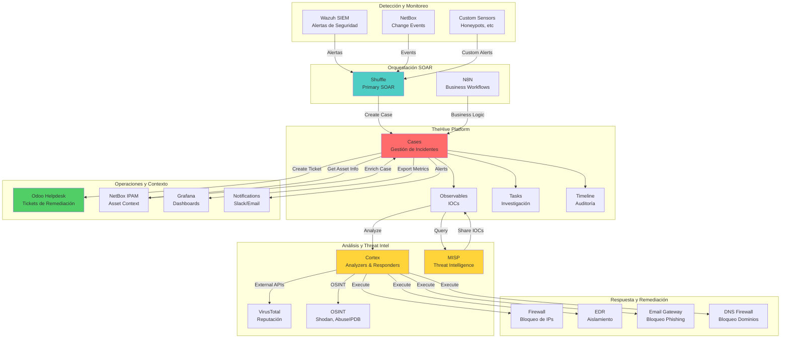
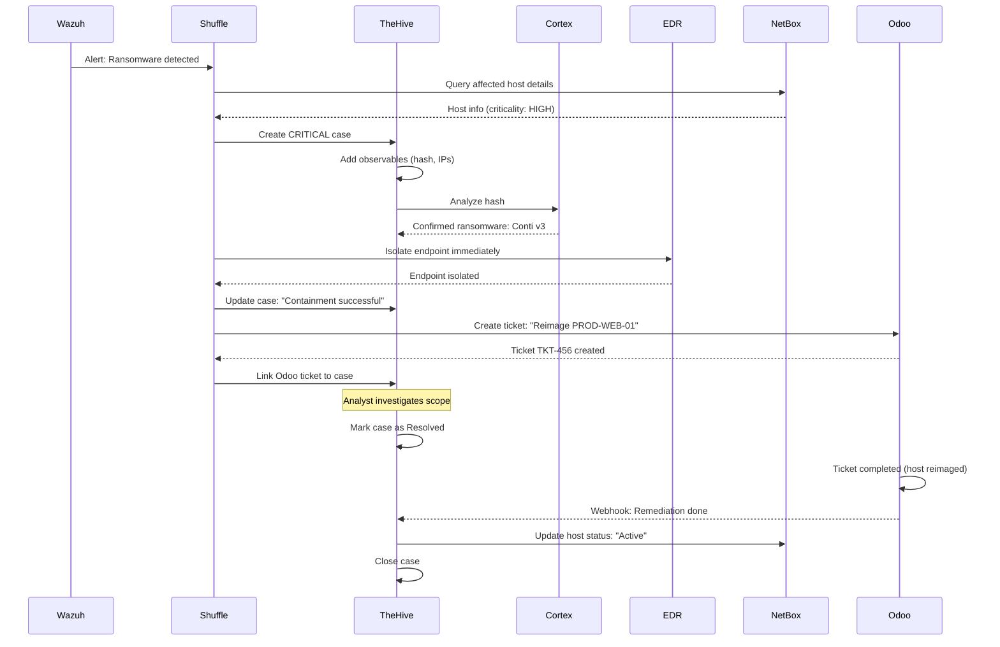
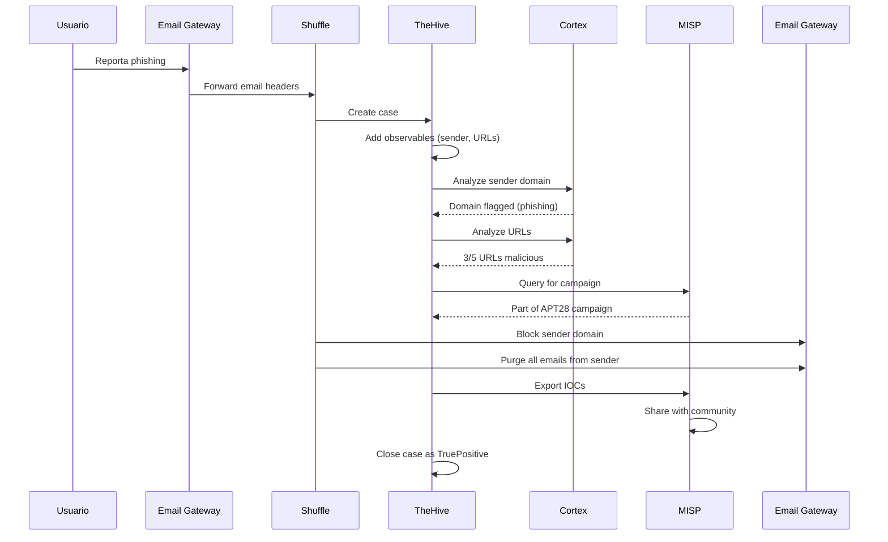

# Integración con Stack Completa NEO_NETBOX_ODOO

## Resumen Ejecutivo

Esta guía detalla la integración de **TheHive** con todos los componentes de la stack NEO_NETBOX_ODOO: Wazuh, MISP, Cortex, Odoo, NetBox, y herramientas SOAR (Shuffle/N8N). El objetivo es crear un ecosistema unificado de seguridad donde los datos fluyen automáticamente entre sistemas.

!!! info "AI Context"
    La stack NEO_NETBOX_ODOO es una plataforma de seguridad y operaciones integrada. TheHive actúa como el **hub central de respuesta a incidentes**, recibiendo alertas de Wazuh, enriqueciéndose con MISP/Cortex, y coordinando remediación con Odoo/NetBox.

---

## Diagrama de Flujo Completo



---

## TheHive ↔ Wazuh (Alertas a Casos)

### Configuración Completa

#### 1. Integración Nativa de Wazuh

```xml
<!-- /var/ossec/etc/ossec.conf en Wazuh Manager -->
<integration>
  <name>shuffle</name>
  <hook_url>https://shuffle.example.com/api/v1/hooks/webhook_wazuh_thehive</hook_url>
  <level>7</level>
  <rule_id>550,551,5710,5720,31100,31103,31108</rule_id>
  <alert_format>json</alert_format>
  <options>
    {
      "authentication": "Bearer SecureToken123",
      "max_retries": 3,
      "timeout": 30
    }
  </options>
</integration>

<!-- Reiniciar Wazuh Manager -->
<!-- systemctl restart wazuh-manager -->
```

#### 2. Mapeo de Severidad Wazuh → TheHive

| Wazuh Level | Wazuh Category | TheHive Severity | TheHive TLP |
|-------------|----------------|------------------|-------------|
| **15** | Critical Attack | Critical (4) | RED (3) |
| **12-14** | High Priority | High (3) | AMBER (2) |
| **10-11** | Medium Attack | High (3) | AMBER (2) |
| **7-9** | Medium Priority | Medium (2) | GREEN (1) |
| **5-6** | Low Priority | Low (1) | GREEN (1) |
| **0-4** | Informational | (No crear caso) | - |

#### 3. Mapeo de Categorías de Wazuh

```javascript
// Shuffle node: Determine Category

const ruleId = $exec.execution_argument.rule.id;
const ruleGroups = $exec.execution_argument.rule.groups;

let category = "unknown";
let tags = ["wazuh", `rule-${ruleId}`];

if (ruleGroups.includes("authentication_failed")) {
  category = "brute-force";
  tags.push("authentication", "brute-force");
} else if (ruleGroups.includes("malware")) {
  category = "malware";
  tags.push("malware", "endpoint");
} else if (ruleGroups.includes("web")) {
  category = "web-attack";
  tags.push("web", "application");
} else if (ruleGroups.includes("syslog")) {
  category = "system-anomaly";
  tags.push("system", "infrastructure");
} else if (ruleGroups.includes("ids")) {
  category = "network-attack";
  tags.push("network", "ids");
}

return {
  "category": category,
  "tags": tags,
  "template": `thehive-template-${category}`
};
```

#### 4. Enriquecimiento con Datos de Wazuh

```javascript
// Shuffle: Extract Complete Context

const alert = $exec.execution_argument;

return {
  "caseTitle": `${alert.rule.description} on ${alert.agent.name}`,
  "caseDescription": `
# Wazuh Security Alert

## Overview
**Rule ID:** ${alert.rule.id}
**Rule Description:** ${alert.rule.description}
**Severity Level:** ${alert.rule.level}
**MITRE ATT&CK:** ${alert.rule.mitre ? alert.rule.mitre.id.join(", ") : "N/A"}

## Affected Asset
**Agent Name:** ${alert.agent.name}
**Agent IP:** ${alert.agent.ip}
**Operating System:** ${alert.agent.os.name} ${alert.agent.os.version}

## Detection Details
**Timestamp:** ${alert.timestamp}
**Location:** ${alert.location}

## Log Evidence
\`\`\`
${alert.full_log}
\`\`\`

## Recommended Actions
${alert.rule.info || "Investigate and contain the incident according to IR playbook."}
  `,
  "customFields": {
    "wazuhRuleId": alert.rule.id,
    "wazuhRuleLevel": alert.rule.level,
    "wazuhAgentId": alert.agent.id,
    "wazuhAgentName": alert.agent.name,
    "wazuhAgentIp": alert.agent.ip,
    "wazuhMitreAttack": alert.rule.mitre ? alert.rule.mitre.id : [],
    "detectionSource": "Wazuh SIEM"
  },
  "observables": extractObservables(alert)
};

function extractObservables(alert) {
  const observables = [];

  // Source IP
  if (alert.data && alert.data.srcip) {
    observables.push({
      "dataType": "ip",
      "data": alert.data.srcip,
      "tlp": 2,
      "ioc": true,
      "tags": ["attacker-ip", "wazuh"]
    });
  }

  // Destination IP
  if (alert.data && alert.data.dstip) {
    observables.push({
      "dataType": "ip",
      "data": alert.data.dstip,
      "tlp": 1,
      "ioc": false,
      "tags": ["target-ip", "wazuh"]
    });
  }

  // File hashes
  if (alert.syscheck && alert.syscheck.sha256) {
    observables.push({
      "dataType": "hash",
      "data": alert.syscheck.sha256,
      "tlp": 2,
      "ioc": true,
      "tags": ["file-hash", "fim", "wazuh"]
    });
  }

  // URLs (web attacks)
  if (alert.data && alert.data.url) {
    observables.push({
      "dataType": "url",
      "data": alert.data.url,
      "tlp": 2,
      "ioc": true,
      "tags": ["web-attack", "wazuh"]
    });
  }

  // Affected hostname
  observables.push({
    "dataType": "other",
    "data": alert.agent.name,
    "tlp": 1,
    "ioc": false,
    "tags": ["affected-host"],
    "message": "Endpoint where alert was triggered"
  });

  return observables;
}
```

---

## TheHive ↔ MISP (IOCs Compartidos)

### Configuración de Integración

#### 1. Configurar MISP en TheHive

```hocon
# /opt/thehive/config/application.conf

play.modules.enabled += org.thp.thehive.connector.misp.MispModule

misp {
  # Intervalo de sincronización
  interval = 1h

  servers = [
    {
      name = "misp-production"
      url = "https://misp.example.com"

      # Autenticación
      auth {
        type = key
        key = "YOUR_MISP_API_KEY"
      }

      # SSL configuration
      wsConfig {
        ssl {
          loose {
            acceptAnyCertificate = false
          }
        }
      }

      # Propósito de la conexión
      purpose = ImportAndExport  # Opciones: ImportOnly, ExportOnly, ImportAndExport

      # Filtros de importación
      tags = ["type:OSINT", "tlp:white", "tlp:green"]
      max_attributes = 1000
      max_age = 30  # días

      # Configuración de exportación
      exportCaseTags = ["to-misp"]
      caseTemplate = "misp-event-template"
    }
  ]
}
```

#### 2. Crear MISP API Key

```bash
# En servidor MISP
docker exec -it misp-app bash

# Dentro del container
cd /var/www/MISP/app/Console

# Crear usuario para TheHive
./cake User create thehive-sync@example.com 1 1 1

# Generar API Key
./cake User authkey_create thehive-sync@example.com "TheHive Integration"

# Output:
# API Key: rT4ndom+MISP+API+K3y==
```

### Flujos de Sincronización

#### MISP → TheHive (Importar Threat Intel)

```yaml
Flujo: Import IOCs from MISP

Trigger: Cada 1 hora (configurado en interval)

Steps:
  1. TheHive consulta MISP API:
     - GET /events/restSearch
     - Filtros: tags, date range, published=true
  2. Para cada MISP Event:
     - SI no existe caso en TheHive:
       - Crear caso nuevo
       - Title: MISP Event name
       - Tags: MISP tags
       - TLP: MISP TLP
     - SI existe caso:
       - Actualizar observables
  3. Para cada Attribute en Event:
     - Crear observable en TheHive
     - Mapear tipo MISP → TheHive:
       - ip-src → ip
       - domain → domain
       - md5/sha1/sha256 → hash
       - url → url
  4. Marcar observables como IOC = true
  5. Agregar tags de MISP
```

**Mapeo de Tipos MISP ↔ TheHive:**

| MISP Type | TheHive DataType | Notas |
|-----------|------------------|-------|
| `ip-src` | `ip` | IP de atacante |
| `ip-dst` | `ip` | IP de destino |
| `domain` | `domain` | Dominio malicioso |
| `hostname` | `fqdn` | FQDN |
| `md5` | `hash` | MD5 hash |
| `sha1` | `hash` | SHA1 hash |
| `sha256` | `hash` | SHA256 hash |
| `url` | `url` | URL completa |
| `email-src` | `mail` | Email remitente |
| `filename` | `filename` | Nombre de archivo |
| `user-agent` | `user-agent` | HTTP User-Agent |

#### TheHive → MISP (Exportar IOCs)

```yaml
Flujo: Export Case to MISP

Trigger: Caso marcado con tag "export-to-misp"

Steps:
  1. Analista completa investigación en TheHive
  2. Marca caso con tag "export-to-misp"
  3. TheHive automáticamente:
     - Crea nuevo Event en MISP
     - Event Name: TheHive Case Title
     - Event Info: TheHive Case Description
     - Event Date: TheHive Case Start Date
     - TLP: Igual que TheHive Case
  4. Para cada Observable en caso:
     - SI ioc = true:
       - Crear Attribute en MISP
       - Category: Determined by dataType
       - Type: Mapped from TheHive dataType
       - Value: Observable data
       - Tags: TheHive tags
  5. Publicar Event en MISP (si configured)
  6. Agregar comment en TheHive: "Exported to MISP Event #123"
```

**Ejemplo de Script Manual:**

```python
from thehive4py.api import TheHiveApi
from pymisp import PyMISP

# Connect to TheHive
thehive = TheHiveApi('https://thehive.example.com', 'THEHIVE_API_KEY')

# Connect to MISP
misp = PyMISP('https://misp.example.com', 'MISP_API_KEY', ssl=True)

# Get case from TheHive
case_id = '~12345'
case = thehive.get_case(case_id).json()

# Create MISP event
event = misp.new_event(
    distribution=1,  # Organization only
    threat_level_id=2,  # Medium
    analysis=1,  # Ongoing
    info=case['title'],
    date=case['startDate']
)

# Add observables as attributes
observables = thehive.get_case_observables(case_id).json()

for obs in observables:
    if obs['ioc']:  # Only export IOCs
        misp.add_attribute(
            event,
            type=map_thehive_to_misp_type(obs['dataType']),
            value=obs['data'],
            comment=f"Exported from TheHive Case #{case['number']}",
            to_ids=True
        )

# Publish event
misp.publish(event)

print(f"Case {case_id} exported to MISP Event {event['Event']['id']}")
```

---

## TheHive ↔ Cortex (Análisis Automatizado)

### Configuración de Cortex

#### 1. Configurar Cortex en TheHive

```hocon
# /opt/thehive/config/application.conf

play.modules.enabled += org.thp.thehive.connector.cortex.CortexModule

cortex {
  servers = [
    {
      name = "cortex-production"
      url = "https://cortex.example.com"

      # Autenticación
      auth {
        type = "bearer"
        key = "YOUR_CORTEX_API_KEY"
      }

      # SSL
      wsConfig.ssl.loose.acceptAnyCertificate = false

      # Configuración de jobs
      refreshDelay = 5 seconds
      maxRetryOnError = 3
      statusCheckInterval = 1 minute
    }
  ]
}
```

#### 2. Analyzers Recomendados

| Analyzer | Observable Types | Información Retornada | Use Case |
|----------|-----------------|----------------------|----------|
| **VirusTotal_GetReport_3_0** | ip, domain, hash, url | Reputación AV, detecciones | Verificar malware conocido |
| **AbuseIPDB_1_0** | ip | Abuse reports, confidence | Validar IPs maliciosas |
| **Shodan_Info_1_0** | ip | Puertos abiertos, servicios | Reconnaissance de atacante |
| **MaxMind_GeoIP_3_0** | ip | Geolocalización, ASN | Contexto geográfico |
| **OTXQuery_2_0** | ip, domain, hash, url | AlienVault OTX intel | Threat intel comunitario |
| **MISP_2_1** | todos | MISP events relacionados | Correlación con MISP |
| **Yara_2_0** | hash, filename | Pattern matching | Clasificación de malware |
| **FileInfo_8_0** | hash, filename | Metadata de archivo | Información técnica |
| **CuckooSandbox_File_Analysis_1_1** | hash, filename | Dynamic analysis | Análisis de comportamiento |
| **URLhaus_2_0** | url, domain | Malware distribution | URLs de malware |

#### 3. Responders para Remediación

| Responder | Acción | Use Case |
|-----------|--------|----------|
| **Firewall_Block_IP** | Bloquea IP en firewall | Contención de atacante |
| **EDR_Isolate_Endpoint** | Aísla host de red | Prevenir lateral movement |
| **EmailGateway_Block_Sender** | Bloquea dominio/email | Prevenir phishing |
| **DNS_Block_Domain** | Bloquea dominio en DNS | Prevenir C2 communication |
| **SOAR_Create_Ticket** | Crea ticket en Odoo | Escalación a IT |

### Automatización de Análisis

#### Workflow: Auto-Analyze New Observables

```yaml
Trigger: Observable agregado a caso

Condition:
  - Observable.ioc = true
  - Observable.dataType IN ["ip", "domain", "hash", "url"]

Actions:
  1. Ejecutar analyzers según dataType:
     - ip: VirusTotal, AbuseIPDB, Shodan, MaxMind
     - domain: VirusTotal, URLhaus, MISP
     - hash: VirusTotal, Yara, MISP
     - url: VirusTotal, URLhaus

  2. Esperar resultados (max 120 segundos)

  3. Agregar taxonomies a observable

  4. SI malicious confirmed:
     - Agregar tag "high-confidence"
     - Update case severity si es mayor
     - Trigger responders (bloqueo)

  5. SI benign:
     - Agregar tag "benign-confirmed"
     - Remover marca IOC

  6. SI indeterminate:
     - Agregar tag "requires-manual-review"
     - Asignar task a analista
```

---

## TheHive ↔ Odoo (Tickets de Soporte)

### Integración via N8N

#### Workflow: Create Odoo Ticket from TheHive Case

```yaml
Trigger: Caso en TheHive marcado con tag "create-odoo-ticket"

N8N Workflow:

1. [Webhook] Recibe notificación de TheHive

2. [TheHive] Get Case Details
   - Endpoint: GET /api/v1/case/{caseId}

3. [Transform Data]
   - Mapear campos TheHive → Odoo

4. [Odoo] Create Helpdesk Ticket
   - Endpoint: POST /api/helpdesk.ticket
   - Fields:
     - name: Case Title
     - description: Case Description
     - priority: Mapped from severity
     - team_id: Security Operations
     - partner_id: Affected user/asset owner

5. [TheHive] Add Comment
   - "Odoo Ticket created: TKT-12345"
   - Link: https://odoo.example.com/helpdesk/ticket/12345

6. [TheHive] Update Custom Field
   - customFields.odooTicketId = 12345
```

**Mapeo de Campos:**

| TheHive | Odoo Helpdesk | Transformación |
|---------|---------------|----------------|
| `title` | `name` | Directo |
| `description` | `description` | Markdown → HTML |
| `severity` (1-4) | `priority` (0-3) | `severity - 1` |
| `owner` | `user_id` | Lookup por email |
| `tags` | `tag_ids` | Create/link tags |
| `customFields.affectedAsset` | `partner_id` | Lookup asset owner |

#### Sincronización Bidireccional

```yaml
Odoo → TheHive:

Trigger: Ticket resuelto en Odoo

Actions:
  1. N8N detecta cambio de estado
  2. Buscar caso en TheHive con customFields.odooTicketId
  3. SI caso aún abierto:
     - Agregar comment: "Remediation completed in Odoo"
     - Completar task relacionada
     - SI todas las tasks completas:
       - Update status → Resolved
```

---

## TheHive ↔ NetBox (Contexto de Activos)

### Enriquecimiento Automático

#### Workflow: Get Asset Context from NetBox

```javascript
// Shuffle node: Query NetBox

const hostname = $thehive_case.customFields.affectedHost;

// Query NetBox API
const device = await fetch(
  `https://netbox.example.com/api/dcim/devices/?name=${hostname}`,
  {
    headers: {
      "Authorization": "Token YOUR_NETBOX_TOKEN",
      "Content-Type": "application/json"
    }
  }
).then(res => res.json());

if (device.count > 0) {
  const asset = device.results[0];

  // Información enriquecida
  const enrichment = {
    "assetId": asset.id,
    "assetName": asset.name,
    "assetType": asset.device_type.display,
    "assetRole": asset.device_role.name,
    "assetSite": asset.site.name,
    "assetLocation": `${asset.site.name} - ${asset.location?.name || "Unknown"}`,
    "assetTenant": asset.tenant?.name || "No tenant",
    "assetPrimaryIp": asset.primary_ip4?.address || "No IP",
    "assetStatus": asset.status.label,
    "assetCriticality": asset.custom_fields?.criticality || "Unknown",
    "assetOwner": asset.custom_fields?.owner || "Unknown",
    "assetMaintenanceWindow": asset.custom_fields?.maintenance_window || "Unknown"
  };

  // Agregar a TheHive case
  return {
    "customFields": enrichment,
    "comment": `
# Asset Information from NetBox

**Device:** ${enrichment.assetName}
**Type:** ${enrichment.assetType}
**Role:** ${enrichment.assetRole}
**Location:** ${enrichment.assetLocation}
**Criticality:** ${enrichment.assetCriticality}
**Owner:** ${enrichment.assetOwner}
**Primary IP:** ${enrichment.assetPrimaryIp}

**NetBox Link:** https://netbox.example.com/dcim/devices/${enrichment.assetId}/
    `
  };
}
```

### Actualización de NetBox desde TheHive

#### Marcar Asset como Comprometido

```python
from thehive4py.api import TheHiveApi
import pynetbox

# Connect to APIs
thehive = TheHiveApi('https://thehive.example.com', 'API_KEY')
nb = pynetbox.api('https://netbox.example.com', token='NETBOX_TOKEN')

# Get compromised hosts from TheHive case
case_id = '~12345'
observables = thehive.get_case_observables(case_id).json()

for obs in observables:
    if obs['dataType'] == 'other' and 'affected-host' in obs.get('tags', []):
        hostname = obs['data']

        # Find device in NetBox
        device = nb.dcim.devices.get(name=hostname)

        if device:
            # Update custom field
            device.custom_fields['security_status'] = 'compromised'
            device.custom_fields['incident_id'] = case_id
            device.custom_fields['compromised_date'] = case['startDate']
            device.save()

            # Add comment in NetBox
            nb.dcim.devices.get(device.id).comments.create(
                comment=f"Device compromised - TheHive Case #{case['number']}"
            )

            print(f"Updated NetBox device: {hostname}")
```

---

## Casos de Uso End-to-End

### Caso 1: Ransomware Completo



### Caso 2: Phishing con MISP



---

## Monitoreo y Métricas de Integración

### Dashboards en Grafana

```yaml
Dashboard: TheHive Integration Health

Panels:

1. Case Creation Rate
   - Query: rate(thehive_cases_created_total[5m])
   - By source: Wazuh, Manual, MISP, Custom

2. API Response Times
   - TheHive API latency (p50, p95, p99)
   - Cortex API latency
   - MISP API latency
   - NetBox API latency

3. Integration Success Rate
   - Wazuh → TheHive: % de alertas que crean casos
   - TheHive → Cortex: % de análisis exitosos
   - TheHive → Odoo: % de tickets creados
   - TheHive ↔ MISP: % de sincronización exitosa

4. Observable Enrichment
   - Observables analizados por hora
   - % con taxonomies agregadas
   - Tiempo promedio de análisis

5. Automation Metrics
   - % de casos auto-resueltos
   - Tiempo promedio de respuesta
   - # de responders ejecutados
```

### Alertas de Integración

```yaml
Alertas Prometheus:

- name: thehive_integration_alerts
  rules:
    - alert: TheHiveAPIDown
      expr: up{job="thehive"} == 0
      for: 5m
      labels:
        severity: critical
      annotations:
        summary: "TheHive API is down"

    - alert: CortexAnalysisFailureRate
      expr: rate(cortex_analysis_failed_total[10m]) > 0.2
      for: 5m
      labels:
        severity: warning
      annotations:
        summary: "Cortex analysis failure rate > 20%"

    - alert: MISPSyncFailed
      expr: time() - thehive_misp_last_sync_timestamp > 7200
      for: 10m
      labels:
        severity: warning
      annotations:
        summary: "MISP sync not running for 2+ hours"
```

---

## Troubleshooting de Integraciones

### Problema: Wazuh Alerts No Crean Casos

**Diagnóstico:**

```bash
# Verificar logs de Wazuh integration
tail -f /var/ossec/logs/integrations.log | grep -i shuffle

# Verificar conectividad
curl -v https://shuffle.example.com/api/v1/hooks/webhook_XXX

# Test manual
curl -X POST https://shuffle.example.com/api/v1/hooks/webhook_XXX \
  -H "Content-Type: application/json" \
  -H "Authorization: Bearer TOKEN" \
  -d @/var/ossec/logs/alerts/alerts.json
```

**Soluciones:**

1. Firewall bloqueando Wazuh → Shuffle
2. Webhook URL incorrecta
3. Token de autenticación inválido

### Problema: Cortex Analysis Timeout

**Diagnóstico:**

```bash
# En Cortex, ver queue
docker exec cortex-app curl http://localhost:9001/api/job

# Verificar workers
docker logs cortex-worker
```

**Soluciones:**

1. Aumentar timeout en TheHive (default: 30s → 120s)
2. Escalar workers de Cortex
3. Verificar API keys de analyzers externos

### Problema: MISP Sync No Funciona

**Diagnóstico:**

```bash
# En TheHive, ver logs
docker logs thehive-app | grep -i misp

# Verificar connectivity
curl -H "Authorization: MISP_API_KEY" \
  https://misp.example.com/events/restSearch
```

**Soluciones:**

1. API Key incorrecta o expirada
2. Filtros de tags muy restrictivos (no hay eventos que coincidan)
3. MISP events no están publicados

---

## AI Context - Información para LLMs

```yaml
Stack Integration: TheHive as Central Hub

Componentes Integrados:
  - Wazuh: Source de alertas
  - MISP: Threat intelligence sharing
  - Cortex: Análisis de observables
  - Odoo: Ticketing de remediación
  - NetBox: Contexto de activos
  - Shuffle/N8N: Orquestación

Flujos de Datos:
  - Wazuh → Shuffle → TheHive (case creation)
  - TheHive → Cortex (observable analysis)
  - MISP ↔ TheHive (IOC sharing)
  - TheHive → Odoo (ticket creation)
  - NetBox → TheHive (asset enrichment)

APIs Utilizadas:
  - TheHive API: /api/v1/*
  - Cortex API: /api/job, /api/analyzer
  - MISP API: /events/restSearch, /attributes/add
  - NetBox API: /api/dcim/devices/
  - Odoo API: /api/helpdesk.ticket

Automatizaciones Clave:
  - Auto case creation from alerts
  - Observable enrichment con threat intel
  - Automated blocking (firewall/EDR)
  - Ticket creation para remediación
  - Asset context agregado a casos

Métricas de Integración:
  - Case creation rate por fuente
  - API latency de cada sistema
  - Success rate de sincronizaciones
  - Automation efficiency (% auto-resolved)

Troubleshooting:
  - Connectivity entre componentes
  - API authentication issues
  - Webhook delivery failures
  - Data mapping errors
```

---

!!! success "Stack Completamente Integrada"
    Con estas integraciones, tu stack NEO_NETBOX_ODOO es una plataforma unificada de seguridad. Continúa con:

    - **[Casos de Uso](use-cases.md)**: Implementar escenarios completos
    - **[API Reference](api-reference.md)**: Automatizar con scripts personalizados
