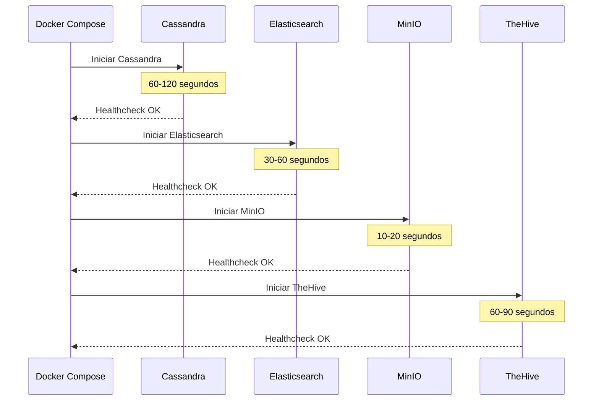

# Instalación y Configuración de TheHive

## Resumen Ejecutivo

Esta guía proporciona instrucciones completas para desplegar **TheHive 5.x** en producción utilizando Docker Compose, incluyendo configuración de Cassandra, Elasticsearch, MinIO, autenticación, y hardening de seguridad.

!!! info "AI Context"
    TheHive 5.x requiere una arquitectura de 4 componentes: TheHive Application, Cassandra (base de datos), Elasticsearch (búsqueda), y MinIO (almacenamiento de archivos). Esta guía asume un despliegue basado en Docker para simplificar la gestión de dependencias.

---

## Prerrequisitos Detallados

### Requisitos de Infraestructura

#### Hardware

| Ambiente | vCPUs | RAM | Disco | Red |
|----------|-------|-----|-------|-----|
| **Development** | 4 | 8 GB | 50 GB SSD | 100 Mbps |
| **Testing** | 8 | 16 GB | 100 GB SSD | 500 Mbps |
| **Production** | 16 | 32 GB | 500 GB NVMe | 1 Gbps |
| **HA Production** | 24+ | 64 GB+ | 2 TB+ NVMe | 10 Gbps |

#### Sistema Operativo

**Distribuciones Soportadas:**

- Ubuntu 22.04 LTS (recomendado)
- Ubuntu 24.04 LTS
- Debian 12 (Bookworm)
- Rocky Linux 9
- AlmaLinux 9

!!! warning "No Soportado Oficialmente"
    - CentOS Stream
    - Fedora (versiones no-enterprise)
    - Alpine Linux (problemas con glibc)

#### Software Base

```bash
# Verificar versiones instaladas
docker --version          # Requerido: 24.0+
docker-compose --version  # Requerido: 2.20+
git --version             # Requerido: 2.30+
curl --version            # Requerido: 7.68+
```

### Configuración del Sistema Operativo

#### 1. Ajustes del Kernel Linux

Cassandra y Elasticsearch requieren ajustes específicos del kernel:

```bash
# Editar /etc/sysctl.conf
sudo nano /etc/sysctl.conf
```

```ini
# Cassandra optimizations
vm.max_map_count=1048575
vm.swappiness=1
net.ipv4.tcp_keepalive_time=60
net.ipv4.tcp_keepalive_probes=3
net.ipv4.tcp_keepalive_intvl=10

# Elasticsearch optimizations
vm.max_map_count=262144
fs.file-max=65536

# Network performance
net.core.rmem_max=134217728
net.core.wmem_max=134217728
net.ipv4.tcp_rmem=4096 87380 134217728
net.ipv4.tcp_wmem=4096 65536 134217728
net.core.netdev_max_backlog=5000
```

```bash
# Aplicar cambios
sudo sysctl -p
```

#### 2. Límites de Recursos

```bash
# Editar /etc/security/limits.conf
sudo nano /etc/security/limits.conf
```

```ini
# Limits for TheHive stack
*    soft    nofile    65536
*    hard    nofile    65536
*    soft    nproc     4096
*    hard    nproc     4096
*    soft    memlock   unlimited
*    hard    memlock   unlimited
```

```bash
# Verificar límites aplicados
ulimit -n  # Debe mostrar 65536
ulimit -u  # Debe mostrar 4096
```

#### 3. Deshabilitar Swap (Producción)

```bash
# Deshabilitar swap temporalmente
sudo swapoff -a

# Deshabilitar permanentemente
sudo sed -i '/ swap / s/^\(.*\)$/#\1/g' /etc/fstab

# Verificar
free -h  # Swap debe mostrar 0B
```

!!! tip "¿Por qué deshabilitar swap?"
    Cassandra y Elasticsearch tienen muy mal rendimiento con swap activo. Es mejor que el proceso falle rápido (OOM) que degradar el rendimiento de toda la base de datos.

### Configuración de Docker

#### Instalación de Docker Engine

=== "Ubuntu/Debian"

    ```bash
    # Remover versiones antiguas
    sudo apt-get remove docker docker-engine docker.io containerd runc

    # Actualizar repositorios
    sudo apt-get update
    sudo apt-get install -y ca-certificates curl gnupg lsb-release

    # Agregar repositorio oficial de Docker
    sudo mkdir -p /etc/apt/keyrings
    curl -fsSL https://download.docker.com/linux/ubuntu/gpg | \
      sudo gpg --dearmor -o /etc/apt/keyrings/docker.gpg

    echo \
      "deb [arch=$(dpkg --print-architecture) signed-by=/etc/apt/keyrings/docker.gpg] \
      https://download.docker.com/linux/ubuntu \
      $(lsb_release -cs) stable" | \
      sudo tee /etc/apt/sources.list.d/docker.list > /dev/null

    # Instalar Docker
    sudo apt-get update
    sudo apt-get install -y docker-ce docker-ce-cli containerd.io \
      docker-buildx-plugin docker-compose-plugin

    # Verificar instalación
    sudo docker run hello-world
    ```

=== "Rocky/AlmaLinux"

    ```bash
    # Agregar repositorio
    sudo dnf -y install dnf-plugins-core
    sudo dnf config-manager --add-repo \
      https://download.docker.com/linux/centos/docker-ce.repo

    # Instalar Docker
    sudo dnf install -y docker-ce docker-ce-cli containerd.io \
      docker-buildx-plugin docker-compose-plugin

    # Iniciar servicio
    sudo systemctl start docker
    sudo systemctl enable docker

    # Verificar instalación
    sudo docker run hello-world
    ```

#### Configuración de Docker Daemon

```bash
# Crear directorio de configuración
sudo mkdir -p /etc/docker

# Crear archivo de configuración
sudo nano /etc/docker/daemon.json
```

```json
{
  "log-driver": "json-file",
  "log-opts": {
    "max-size": "10m",
    "max-file": "3"
  },
  "storage-driver": "overlay2",
  "userland-proxy": false,
  "live-restore": true,
  "default-ulimits": {
    "nofile": {
      "Name": "nofile",
      "Hard": 65536,
      "Soft": 65536
    }
  }
}
```

```bash
# Reiniciar Docker para aplicar cambios
sudo systemctl restart docker

# Verificar configuración
docker info | grep -i "storage driver"
```

#### Agregar Usuario al Grupo Docker

```bash
# Agregar usuario actual
sudo usermod -aG docker $USER

# Aplicar cambios (requiere re-login)
newgrp docker

# Verificar
docker ps  # No debe requerir sudo
```

---

## Instalación vía Docker Compose

### Estructura de Directorios

```bash
# Crear estructura de directorios
sudo mkdir -p /opt/thehive/{data,logs,config}
sudo mkdir -p /opt/thehive/data/{cassandra,elasticsearch,minio,thehive}
sudo mkdir -p /opt/thehive/logs/{cassandra,elasticsearch,minio,thehive}
sudo mkdir -p /opt/thehive/config

# Establecer permisos
sudo chown -R $USER:$USER /opt/thehive
```

**Estructura Final:**

```
/opt/thehive/
├── docker-compose.yml
├── .env
├── config/
│   ├── application.conf
│   ├── logback.xml
│   └── cassandra.yaml
├── data/
│   ├── cassandra/
│   ├── elasticsearch/
│   ├── minio/
│   └── thehive/
└── logs/
    ├── cassandra/
    ├── elasticsearch/
    ├── minio/
    └── thehive/
```

### Archivo de Variables de Entorno (.env)

```bash
cd /opt/thehive
nano .env
```

```bash
# ===========================
# TheHive Stack Configuration
# ===========================

# Versiones de componentes
THEHIVE_VERSION=5.3.0
CASSANDRA_VERSION=4.1.4
ELASTICSEARCH_VERSION=7.17.16
MINIO_VERSION=RELEASE.2024-01-16T16-07-38Z

# Configuración de Red
DOCKER_NETWORK=thehive_network
THEHIVE_PORT=9000
CASSANDRA_PORT=9042
ELASTICSEARCH_PORT=9200
MINIO_API_PORT=9002
MINIO_CONSOLE_PORT=9003

# Credenciales de Cassandra
CASSANDRA_CLUSTER_NAME=TheHive
CASSANDRA_DATACENTER=datacenter1
CASSANDRA_SEEDS=cassandra
CASSANDRA_USERNAME=cassandra
CASSANDRA_PASSWORD=SecureP@ssw0rd_Cassandra_2024!

# Credenciales de Elasticsearch
ELASTIC_USERNAME=elastic
ELASTIC_PASSWORD=SecureP@ssw0rd_Elastic_2024!
ELASTIC_CLUSTER_NAME=thehive-cluster
ELASTIC_DISCOVERY_TYPE=single-node

# Credenciales de MinIO
MINIO_ROOT_USER=thehive-admin
MINIO_ROOT_PASSWORD=SecureP@ssw0rd_MinIO_2024!
MINIO_BUCKET=thehive
MINIO_REGION=us-east-1

# Configuración de TheHive
THEHIVE_SECRET="$(openssl rand -base64 32)"
THEHIVE_CORTEX_URL=http://cortex:9001
THEHIVE_MISP_URL=http://misp:80

# Configuración de Recursos
CASSANDRA_HEAP_SIZE=2G
CASSANDRA_MAX_HEAP_SIZE=2G
ELASTICSEARCH_HEAP_SIZE=2g
THEHIVE_HEAP_SIZE=2G

# Timezone
TZ=America/Mexico_City

# Configuración de Logs
LOG_LEVEL=INFO
LOG_MAX_SIZE=10m
LOG_MAX_FILES=3
```

!!! danger "Seguridad Crítica"
    **NUNCA** uses las contraseñas de ejemplo en producción. Genera contraseñas seguras con:

    ```bash
    # Generar contraseña aleatoria de 32 caracteres
    openssl rand -base64 32
    ```

### Docker Compose Completo

```bash
nano docker-compose.yml
```

```yaml
version: '3.8'

networks:
  thehive_network:
    driver: bridge
    ipam:
      config:
        - subnet: 172.20.0.0/16

volumes:
  cassandra_data:
    driver: local
    driver_opts:
      type: none
      o: bind
      device: /opt/thehive/data/cassandra
  elasticsearch_data:
    driver: local
    driver_opts:
      type: none
      o: bind
      device: /opt/thehive/data/elasticsearch
  minio_data:
    driver: local
    driver_opts:
      type: none
      o: bind
      device: /opt/thehive/data/minio
  thehive_data:
    driver: local
    driver_opts:
      type: none
      o: bind
      device: /opt/thehive/data/thehive

services:
  # ============================================
  # Cassandra - Base de Datos Principal
  # ============================================
  cassandra:
    image: cassandra:${CASSANDRA_VERSION}
    container_name: thehive-cassandra
    hostname: cassandra
    restart: unless-stopped
    networks:
      thehive_network:
        ipv4_address: 172.20.0.2
    ports:
      - "127.0.0.1:${CASSANDRA_PORT}:9042"
    environment:
      CASSANDRA_CLUSTER_NAME: ${CASSANDRA_CLUSTER_NAME}
      CASSANDRA_DC: ${CASSANDRA_DATACENTER}
      CASSANDRA_SEEDS: ${CASSANDRA_SEEDS}
      MAX_HEAP_SIZE: ${CASSANDRA_MAX_HEAP_SIZE}
      HEAP_NEWSIZE: 512M
      CASSANDRA_ENDPOINT_SNITCH: SimpleSnitch
    volumes:
      - cassandra_data:/var/lib/cassandra
      - ./logs/cassandra:/var/log/cassandra
    healthcheck:
      test: ["CMD-SHELL", "cqlsh -u cassandra -p cassandra -e 'describe cluster'"]
      interval: 30s
      timeout: 10s
      retries: 5
      start_period: 120s
    ulimits:
      memlock:
        soft: -1
        hard: -1
      nofile:
        soft: 65536
        hard: 65536
    logging:
      driver: "json-file"
      options:
        max-size: "${LOG_MAX_SIZE}"
        max-file: "${LOG_MAX_FILES}"

  # ============================================
  # Elasticsearch - Motor de Búsqueda
  # ============================================
  elasticsearch:
    image: docker.elastic.co/elasticsearch/elasticsearch:${ELASTICSEARCH_VERSION}
    container_name: thehive-elasticsearch
    hostname: elasticsearch
    restart: unless-stopped
    networks:
      thehive_network:
        ipv4_address: 172.20.0.3
    ports:
      - "127.0.0.1:${ELASTICSEARCH_PORT}:9200"
    environment:
      - discovery.type=${ELASTIC_DISCOVERY_TYPE}
      - cluster.name=${ELASTIC_CLUSTER_NAME}
      - node.name=thehive-es-node01
      - bootstrap.memory_lock=true
      - "ES_JAVA_OPTS=-Xms${ELASTICSEARCH_HEAP_SIZE} -Xmx${ELASTICSEARCH_HEAP_SIZE}"
      - xpack.security.enabled=true
      - xpack.security.http.ssl.enabled=false
      - xpack.security.transport.ssl.enabled=false
      - ELASTIC_PASSWORD=${ELASTIC_PASSWORD}
    volumes:
      - elasticsearch_data:/usr/share/elasticsearch/data
      - ./logs/elasticsearch:/usr/share/elasticsearch/logs
    healthcheck:
      test: ["CMD-SHELL", "curl -u elastic:${ELASTIC_PASSWORD} -f http://localhost:9200/_cluster/health || exit 1"]
      interval: 30s
      timeout: 10s
      retries: 5
      start_period: 60s
    ulimits:
      memlock:
        soft: -1
        hard: -1
      nofile:
        soft: 65536
        hard: 65536
    logging:
      driver: "json-file"
      options:
        max-size: "${LOG_MAX_SIZE}"
        max-file: "${LOG_MAX_FILES}"

  # ============================================
  # MinIO - Almacenamiento de Objetos
  # ============================================
  minio:
    image: minio/minio:${MINIO_VERSION}
    container_name: thehive-minio
    hostname: minio
    restart: unless-stopped
    command: server /data --console-address ":9001"
    networks:
      thehive_network:
        ipv4_address: 172.20.0.4
    ports:
      - "${MINIO_API_PORT}:9000"
      - "${MINIO_CONSOLE_PORT}:9001"
    environment:
      MINIO_ROOT_USER: ${MINIO_ROOT_USER}
      MINIO_ROOT_PASSWORD: ${MINIO_ROOT_PASSWORD}
      MINIO_REGION: ${MINIO_REGION}
    volumes:
      - minio_data:/data
      - ./logs/minio:/var/log/minio
    healthcheck:
      test: ["CMD", "curl", "-f", "http://localhost:9000/minio/health/live"]
      interval: 30s
      timeout: 10s
      retries: 3
      start_period: 30s
    logging:
      driver: "json-file"
      options:
        max-size: "${LOG_MAX_SIZE}"
        max-file: "${LOG_MAX_FILES}"

  # ============================================
  # MinIO Client - Crear Bucket Inicial
  # ============================================
  minio-create-bucket:
    image: minio/mc:latest
    container_name: thehive-minio-setup
    networks:
      - thehive_network
    depends_on:
      minio:
        condition: service_healthy
    entrypoint: >
      /bin/sh -c "
      mc alias set myminio http://minio:9000 ${MINIO_ROOT_USER} ${MINIO_ROOT_PASSWORD};
      mc mb --ignore-existing myminio/${MINIO_BUCKET};
      mc anonymous set download myminio/${MINIO_BUCKET};
      mc admin user add myminio thehive ${MINIO_ROOT_PASSWORD};
      mc admin policy attach myminio readwrite --user thehive;
      exit 0;
      "

  # ============================================
  # TheHive - Aplicación Principal
  # ============================================
  thehive:
    image: strangebee/thehive:${THEHIVE_VERSION}
    container_name: thehive-app
    hostname: thehive
    restart: unless-stopped
    networks:
      thehive_network:
        ipv4_address: 172.20.0.10
    ports:
      - "${THEHIVE_PORT}:9000"
    environment:
      - TZ=${TZ}
      - JVM_OPTS=-Xms${THEHIVE_HEAP_SIZE} -Xmx${THEHIVE_HEAP_SIZE}
    volumes:
      - thehive_data:/opt/thp/thehive/data
      - ./config/application.conf:/etc/thehive/application.conf:ro
      - ./logs/thehive:/var/log/thehive
    depends_on:
      cassandra:
        condition: service_healthy
      elasticsearch:
        condition: service_healthy
      minio:
        condition: service_healthy
    healthcheck:
      test: ["CMD", "curl", "-f", "http://localhost:9000/api/v1/status"]
      interval: 30s
      timeout: 10s
      retries: 5
      start_period: 180s
    logging:
      driver: "json-file"
      options:
        max-size: "${LOG_MAX_SIZE}"
        max-file: "${LOG_MAX_FILES}"
```

### Configuración de TheHive (application.conf)

```bash
nano config/application.conf
```

```hocon
# ============================================
# TheHive Application Configuration
# ============================================

# Secret key for Play Framework (CAMBIAR EN PRODUCCIÓN)
play.http.secret.key = "${THEHIVE_SECRET}"

# HTTP server configuration
play.server.http.port = 9000
play.server.http.address = "0.0.0.0"

# ============================================
# Cassandra Configuration
# ============================================
db {
  provider = janusgraph
  janusgraph {
    storage {
      backend = cql
      hostname = ["cassandra"]
      port = 9042
      cql {
        cluster-name = TheHive
        keyspace = thehive
        local-datacenter = datacenter1
        read-consistency-level = ONE
        write-consistency-level = ONE
      }
    }
    index.search {
      backend = elasticsearch
      hostname = ["elasticsearch"]
      index-name = thehive
      elasticsearch {
        http {
          auth {
            type = basic
            basic {
              username = elastic
              password = "${ELASTIC_PASSWORD}"
            }
          }
        }
      }
    }
  }
}

# ============================================
# File Storage Configuration (MinIO)
# ============================================
storage {
  provider = s3
  s3 {
    bucket = thehive
    endpoint = "http://minio:9000"
    access-key = "${MINIO_ROOT_USER}"
    secret-key = "${MINIO_ROOT_PASSWORD}"
    region = "us-east-1"
    path-style-access = true
  }
}

# ============================================
# Authentication Configuration
# ============================================
auth {
  providers = [
    {
      name = local
      defaultUserDomain = "thehive.local"
    }
  ]

  # Multifactor authentication
  multifactor {
    enabled = false
  }

  # Session configuration
  session {
    warning = 5m
    inactivity = 1h
  }
}

# ============================================
# Cortex Integration
# ============================================
play.modules.enabled += org.thp.thehive.connector.cortex.CortexModule
cortex {
  servers = [
    {
      name = local-cortex
      url = "${?THEHIVE_CORTEX_URL}"
      auth {
        type = "bearer"
        key = "YOUR_CORTEX_API_KEY"
      }
      # SSL/TLS verification
      wsConfig.ssl.loose.acceptAnyCertificate = false
    }
  ]
  # Refresh job cache every
  refreshDelay = 5 seconds
  # Max number of successive errors before give up
  maxRetryOnError = 3
  # Base backoff duration
  statusCheckInterval = 1 minute
}

# ============================================
# MISP Integration
# ============================================
play.modules.enabled += org.thp.thehive.connector.misp.MispModule
misp {
  interval = 1h
  servers = [
    {
      name = local-misp
      url = "${?THEHIVE_MISP_URL}"
      auth {
        type = key
        key = "YOUR_MISP_API_KEY"
      }
      wsConfig.ssl.loose.acceptAnyCertificate = false
      # Filtering
      purpose = ImportOnly  # ImportOnly, ExportOnly, ImportAndExport
    }
  ]
}

# ============================================
# Notification Configuration
# ============================================
notification.webhook.endpoints = [
  {
    name = shuffle-webhook
    version = 0
    wsConfig {}
    auth {type = "none"}
    url = "http://shuffle:3001/api/v1/hooks/webhook_YOUR_ID"
    includedTheHiveOrganisations = ["*"]
    excludedTheHiveOrganisations = []
  }
]

# ============================================
# Advanced Configuration
# ============================================

# Maximum size for file uploads
play.http.parser.maxDiskBuffer = 1GB
play.http.parser.maxMemoryBuffer = 256MB

# Akka configuration for concurrency
akka {
  actor {
    default-dispatcher {
      fork-join-executor {
        parallelism-min = 2
        parallelism-factor = 2.0
        parallelism-max = 10
      }
    }
  }
}

# Stream configuration
stream {
  longPolling {
    refresh = 1 minute
    cache = 15 minutes
  }
}

# Integrity check at startup
integrity.check = true
```

!!! tip "Variables de Entorno en application.conf"
    El formato `${?VARIABLE}` indica que la variable es opcional. Si no existe, TheHive usará un valor por defecto o deshabilitará la funcionalidad.

---

## Despliegue de la Stack

### 1. Iniciar Servicios

```bash
cd /opt/thehive

# Descargar imágenes
docker-compose pull

# Iniciar stack en background
docker-compose up -d

# Ver logs en tiempo real
docker-compose logs -f
```

**Orden de Inicio Esperado:**



### 2. Verificar Estado de Contenedores

```bash
# Ver estado de todos los contenedores
docker-compose ps

# Salida esperada:
# NAME                    STATUS              PORTS
# thehive-app             Up (healthy)        0.0.0.0:9000->9000/tcp
# thehive-cassandra       Up (healthy)        127.0.0.1:9042->9042/tcp
# thehive-elasticsearch   Up (healthy)        127.0.0.1:9200->9200/tcp
# thehive-minio           Up (healthy)        0.0.0.0:9002-9003->9000-9001/tcp
```

### 3. Verificar Conectividad entre Servicios

```bash
# Test Cassandra
docker exec thehive-cassandra cqlsh -e "DESCRIBE KEYSPACES;"

# Test Elasticsearch
curl -u elastic:${ELASTIC_PASSWORD} http://localhost:9200/_cluster/health?pretty

# Test MinIO
curl http://localhost:9002/minio/health/live

# Test TheHive
curl http://localhost:9000/api/v1/status
```

### 4. Crear Usuario Administrador Inicial

TheHive **no tiene usuario por defecto**. Debes crear el primer usuario manualmente:

```bash
# Método 1: Via API (recomendado)
curl -X POST http://localhost:9000/api/v1/user \
  -H "Content-Type: application/json" \
  -d '{
    "login": "admin@thehive.local",
    "name": "Administrator",
    "profile": "admin",
    "password": "SecureAdminP@ssw0rd2024!"
  }'

# Método 2: Via Docker exec
docker exec -it thehive-app /opt/thehive/bin/thehive \
  --createUser admin@thehive.local \
  --name "Administrator" \
  --profile admin \
  --password "SecureAdminP@ssw0rd2024!"
```

!!! danger "Cambiar Contraseña Inmediatamente"
    Después del primer login, cambia la contraseña desde la UI:

    1. Acceder a http://SERVER_IP:9000
    2. Login con `admin@thehive.local`
    3. Ir a **Admin** → **Users** → **admin** → **Change Password**

### 5. Acceder a la Interfaz Web

```
URL: http://YOUR_SERVER_IP:9000
Usuario: admin@thehive.local
Contraseña: [La que configuraste]
```

**Primera Pantalla Esperada:**

```
╔════════════════════════════════════════╗
║         Welcome to TheHive 5          ║
║                                        ║
║  Email: [ admin@thehive.local       ] ║
║  Password: [ ********************* ] ║
║                                        ║
║           [ LOGIN ]                    ║
╚════════════════════════════════════════╝
```

---

## Configuración de Cassandra Avanzada

### Cambiar Contraseña de Cassandra Por Defecto

```bash
# Conectar a Cassandra
docker exec -it thehive-cassandra cqlsh -u cassandra -p cassandra

# Dentro de cqlsh:
ALTER USER cassandra WITH PASSWORD 'NewSecurePassword123!';

# Verificar
exit

# Reconectar con nueva contraseña
docker exec -it thehive-cassandra cqlsh -u cassandra -p NewSecurePassword123!
```

### Crear Usuario Específico para TheHive

```sql
-- Conectar como cassandra
CREATE ROLE thehive_user WITH PASSWORD = 'TheHive_DB_P@ss2024!' AND LOGIN = true;

-- Otorgar permisos sobre keyspace thehive
GRANT ALL PERMISSIONS ON KEYSPACE thehive TO thehive_user;

-- Verificar permisos
LIST ALL PERMISSIONS OF thehive_user;
```

**Actualizar application.conf:**

```hocon
db.janusgraph.storage.cql {
  username = "thehive_user"
  password = "TheHive_DB_P@ss2024!"
}
```

### Backup Automático de Cassandra

```bash
# Crear script de backup
sudo nano /usr/local/bin/backup-cassandra.sh
```

```bash
#!/bin/bash
# Backup script para Cassandra de TheHive

BACKUP_DIR="/opt/backups/cassandra"
DATE=$(date +%Y%m%d_%H%M%S)
RETENTION_DAYS=7

# Crear directorio de backup
mkdir -p "${BACKUP_DIR}"

# Crear snapshot
docker exec thehive-cassandra nodetool snapshot -t "backup_${DATE}" thehive

# Copiar snapshot a directorio de backup
docker cp thehive-cassandra:/var/lib/cassandra/data/thehive \
  "${BACKUP_DIR}/thehive_${DATE}"

# Limpiar snapshots viejos
docker exec thehive-cassandra nodetool clearsnapshot -t "backup_${DATE}" thehive

# Eliminar backups antiguos
find "${BACKUP_DIR}" -type d -mtime +${RETENTION_DAYS} -exec rm -rf {} \;

echo "Backup completado: ${BACKUP_DIR}/thehive_${DATE}"
```

```bash
# Hacer ejecutable
sudo chmod +x /usr/local/bin/backup-cassandra.sh

# Configurar cron job
sudo crontab -e
```

```cron
# Backup diario a las 2 AM
0 2 * * * /usr/local/bin/backup-cassandra.sh >> /var/log/cassandra-backup.log 2>&1
```

---

## Configuración de Elasticsearch Avanzada

### Indexación Inicial

Elasticsearch crea índices automáticamente, pero puedes verificar:

```bash
# Ver índices existentes
curl -u elastic:${ELASTIC_PASSWORD} \
  http://localhost:9200/_cat/indices?v

# Salida esperada:
# health status index   uuid                   pri rep docs.count docs.deleted store.size pri.store.size
# yellow open   thehive dQ8F3gXJTfyN2k6yH1z3Ug   1   1          0            0       225b           225b
```

### Optimización de Índices

```bash
# Forzar merge de segmentos (mejora búsqueda)
curl -u elastic:${ELASTIC_PASSWORD} -X POST \
  "http://localhost:9200/thehive/_forcemerge?max_num_segments=1"

# Refrescar índice
curl -u elastic:${ELASTIC_PASSWORD} -X POST \
  "http://localhost:9200/thehive/_refresh"
```

### Configurar Retention de Logs

```bash
# Crear ILM Policy para logs de Elasticsearch
curl -u elastic:${ELASTIC_PASSWORD} -X PUT \
  "http://localhost:9200/_ilm/policy/thehive-logs-policy" \
  -H 'Content-Type: application/json' \
  -d '{
    "policy": {
      "phases": {
        "hot": {
          "actions": {
            "rollover": {
              "max_age": "7d",
              "max_size": "50GB"
            }
          }
        },
        "delete": {
          "min_age": "90d",
          "actions": {
            "delete": {}
          }
        }
      }
    }
  }'
```

---

## Configuración de Autenticación

### LDAP/Active Directory

```hocon
# Agregar a application.conf
auth {
  providers = [
    {
      name = ldap
      host = ["ldap.example.com:389"]
      bindDN = "cn=thehive,ou=services,dc=example,dc=com"
      bindPW = "LDAP_BIND_PASSWORD"
      baseDN = "ou=users,dc=example,dc=com"
      filter = "(uid={0})"
      defaultRoles = ["read", "write"]
      defaultOrganization = "MyOrganization"
      useSSL = false  # Cambiar a true en producción
    }
  ]
}
```

**Test de Conexión LDAP:**

```bash
# Instalar ldapsearch
sudo apt-get install ldap-utils

# Test bind
ldapsearch -x -H ldap://ldap.example.com:389 \
  -D "cn=thehive,ou=services,dc=example,dc=com" \
  -w "LDAP_BIND_PASSWORD" \
  -b "ou=users,dc=example,dc=com" \
  "(uid=testuser)"
```

### OAuth2 (Azure AD / Google Workspace)

```hocon
# Configuración para Azure AD
auth {
  providers = [
    {
      name = oauth2
      clientId = "YOUR_AZURE_CLIENT_ID"
      clientSecret = "YOUR_AZURE_CLIENT_SECRET"
      redirectUri = "https://thehive.example.com/api/auth/oauth2/callback"
      responseType = "code"
      grantType = "authorization_code"
      authorizationUrl = "https://login.microsoftonline.com/YOUR_TENANT_ID/oauth2/v2.0/authorize"
      tokenUrl = "https://login.microsoftonline.com/YOUR_TENANT_ID/oauth2/v2.0/token"
      userUrl = "https://graph.microsoft.com/v1.0/me"
      scope = ["openid", "profile", "email", "User.Read"]
      defaultRoles = ["read", "write"]
      defaultOrganization = "MyOrganization"
    }
  ]
}
```

### API Keys para Integraciones

```bash
# Crear API Key via curl
curl -X POST http://localhost:9000/api/v1/user/admin@thehive.local/key \
  -H "Authorization: Bearer ADMIN_SESSION_TOKEN" \
  -H "Content-Type: application/json" \
  -d '{
    "name": "shuffle-integration",
    "duration": "365 days"
  }'

# Respuesta:
# {
#   "key": "rT4ndom+Gener4ted+API+K3y=="
# }
```

---

## Configuración de Almacenamiento de Anexos

### MinIO Avanzado

#### Configurar Versionado de Objetos

```bash
# Habilitar versionado en bucket thehive
docker exec thehive-minio-client mc version enable myminio/thehive

# Verificar
docker exec thehive-minio-client mc version info myminio/thehive
```

#### Configurar Lifecycle Policies

```bash
# Crear policy para eliminar versiones antiguas después de 90 días
cat > /tmp/lifecycle.json <<EOF
{
  "Rules": [
    {
      "ID": "ExpireOldVersions",
      "Status": "Enabled",
      "Filter": {},
      "NoncurrentVersionExpiration": {
        "NoncurrentDays": 90
      }
    }
  ]
}
EOF

# Aplicar policy
docker exec -i thehive-minio-client mc ilm import myminio/thehive < /tmp/lifecycle.json
```

### Amazon S3

```hocon
# Cambiar en application.conf
storage {
  provider = s3
  s3 {
    bucket = "thehive-production"
    region = "us-east-1"
    access-key = "AWS_ACCESS_KEY_ID"
    secret-key = "AWS_SECRET_ACCESS_KEY"
    # Opcional: usar IAM role en EC2
    # aws {
    #   credentials {
    #     provider = instance-profile
    #   }
    # }
  }
}
```

---

## Configuración de Notificaciones

### Webhook a Slack

```hocon
notification.webhook.endpoints = [
  {
    name = slack-security-channel
    version = 0
    wsConfig {}
    auth {type = "none"}
    url = "https://hooks.slack.com/services/T00/B00/XXXXXXXXXXXXXXXXXXXX"
    includedTheHiveOrganisations = ["*"]
    excludedTheHiveOrganisations = []
  }
]
```

**Formato de Mensaje Slack:**

```json
{
  "text": "🚨 New TheHive Case Created",
  "blocks": [
    {
      "type": "section",
      "text": {
        "type": "mrkdwn",
        "text": "*Case:* Ransomware in PROD-WEB-01\n*Severity:* Critical\n*Assignee:* analyst@thehive.local"
      }
    },
    {
      "type": "actions",
      "elements": [
        {
          "type": "button",
          "text": {"type": "plain_text", "text": "Open Case"},
          "url": "https://thehive.example.com/case/~12345"
        }
      ]
    }
  ]
}
```

### Email via SMTP

```hocon
# Configuración SMTP
play.mailer {
  host = "smtp.gmail.com"
  port = 587
  ssl = false
  tls = true
  user = "thehive@example.com"
  password = "APP_PASSWORD"
  from = "thehive@example.com"
}

# Habilitar notificaciones por email
notification.email {
  enabled = true
  from = "thehive@example.com"
  # Configurar templates personalizados
  template {
    newCase = """
      <h2>New Case Created: {{case.title}}</h2>
      <p>Severity: {{case.severity}}</p>
      <p><a href="{{case.url}}">View Case</a></p>
    """
  }
}
```

---

## Hardening de Seguridad

### 1. Configurar HTTPS con Nginx Reverse Proxy

```bash
# Instalar Nginx
sudo apt-get install nginx certbot python3-certbot-nginx

# Crear configuración
sudo nano /etc/nginx/sites-available/thehive
```

```nginx
server {
    listen 80;
    server_name thehive.example.com;
    return 301 https://$host$request_uri;
}

server {
    listen 443 ssl http2;
    server_name thehive.example.com;

    # SSL Configuration
    ssl_certificate /etc/letsencrypt/live/thehive.example.com/fullchain.pem;
    ssl_certificate_key /etc/letsencrypt/live/thehive.example.com/privkey.pem;
    ssl_protocols TLSv1.2 TLSv1.3;
    ssl_ciphers HIGH:!aNULL:!MD5;
    ssl_prefer_server_ciphers on;

    # Security Headers
    add_header Strict-Transport-Security "max-age=31536000; includeSubDomains" always;
    add_header X-Content-Type-Options nosniff;
    add_header X-Frame-Options DENY;
    add_header X-XSS-Protection "1; mode=block";
    add_header Content-Security-Policy "default-src 'self'";

    # Logging
    access_log /var/log/nginx/thehive-access.log;
    error_log /var/log/nginx/thehive-error.log;

    # Proxy Configuration
    location / {
        proxy_pass http://127.0.0.1:9000;
        proxy_http_version 1.1;
        proxy_set_header Upgrade $http_upgrade;
        proxy_set_header Connection "upgrade";
        proxy_set_header Host $host;
        proxy_set_header X-Real-IP $remote_addr;
        proxy_set_header X-Forwarded-For $proxy_add_x_forwarded_for;
        proxy_set_header X-Forwarded-Proto $scheme;

        # Timeouts
        proxy_connect_timeout 600;
        proxy_send_timeout 600;
        proxy_read_timeout 600;
        send_timeout 600;

        # Buffer settings
        proxy_buffering off;
        proxy_request_buffering off;
    }

    # Max upload size
    client_max_body_size 1G;
}
```

```bash
# Habilitar sitio
sudo ln -s /etc/nginx/sites-available/thehive /etc/nginx/sites-enabled/

# Obtener certificado SSL
sudo certbot --nginx -d thehive.example.com

# Test y reload
sudo nginx -t
sudo systemctl reload nginx
```

### 2. Firewall Configuration

```bash
# UFW (Ubuntu)
sudo ufw allow 80/tcp
sudo ufw allow 443/tcp
sudo ufw allow 22/tcp
sudo ufw enable

# Bloquear acceso directo a puertos de backend
sudo ufw deny 9000/tcp
sudo ufw deny 9042/tcp
sudo ufw deny 9200/tcp
```

### 3. Fail2Ban para Protección contra Brute Force

```bash
# Instalar Fail2Ban
sudo apt-get install fail2ban

# Crear filtro para TheHive
sudo nano /etc/fail2ban/filter.d/thehive.conf
```

```ini
[Definition]
failregex = .*Authentication failure for user '<HOST>'.*
ignoreregex =
```

```ini
# Configurar jail
sudo nano /etc/fail2ban/jail.local

[thehive]
enabled = true
port = http,https
filter = thehive
logpath = /opt/thehive/logs/thehive/application.log
maxretry = 5
bantime = 3600
findtime = 600
```

```bash
# Reiniciar Fail2Ban
sudo systemctl restart fail2ban
sudo fail2ban-client status thehive
```

### 4. Auditoría y Logging

```hocon
# Habilitar audit log en application.conf
audit {
  enabled = true
  logger = file
  file {
    path = "/var/log/thehive/audit.log"
    maxSize = "100MB"
    maxBackupIndex = 10
  }
}
```

---

## Troubleshooting de Instalación

### Problema 1: Cassandra no Inicia (OOM)

**Síntoma:**

```bash
docker logs thehive-cassandra
# Error: Java heap space
```

**Solución:**

```bash
# Reducir heap size en .env
CASSANDRA_HEAP_SIZE=1G
CASSANDRA_MAX_HEAP_SIZE=1G

# Reiniciar
docker-compose restart cassandra
```

### Problema 2: Elasticsearch Stuck en "Yellow"

**Síntoma:**

```json
{
  "cluster_name": "thehive-cluster",
  "status": "yellow",
  "number_of_nodes": 1,
  "unassigned_shards": 5
}
```

**Solución:**

```bash
# Yellow es normal en single-node cluster (sin réplicas)
# Para forzar green en desarrollo:
curl -u elastic:${ELASTIC_PASSWORD} -X PUT \
  "http://localhost:9200/thehive/_settings" \
  -H 'Content-Type: application/json' \
  -d '{"index": {"number_of_replicas": 0}}'
```

### Problema 3: TheHive No Puede Conectar a Cassandra

**Síntoma:**

```
ERROR - Cannot connect to Cassandra
```

**Diagnóstico:**

```bash
# Verificar que Cassandra está escuchando
docker exec thehive-cassandra netstat -tlnp | grep 9042

# Verificar conectividad desde TheHive
docker exec thehive-app telnet cassandra 9042

# Verificar logs de Cassandra
docker logs thehive-cassandra --tail 100
```

**Solución:**

```bash
# Verificar que los contenedores están en la misma red
docker network inspect thehive_network

# Recrear contenedores
docker-compose down
docker-compose up -d
```

### Problema 4: MinIO Bucket No Existe

**Síntoma:**

```
ERROR - S3 bucket 'thehive' not found
```

**Solución:**

```bash
# Crear bucket manualmente
docker exec -it thehive-minio-client mc mb myminio/thehive

# Verificar
docker exec -it thehive-minio-client mc ls myminio/
```

### Problema 5: Error "play.http.secret.key" No Configurado

**Síntoma:**

```
ERROR - The application secret has not been set
```

**Solución:**

```bash
# Generar secret key
echo "THEHIVE_SECRET=\"$(openssl rand -base64 32)\"" >> .env

# Reiniciar
docker-compose restart thehive
```

---

## Monitoreo y Mantenimiento

### Healthchecks Automáticos

```bash
# Script de monitoreo
nano /usr/local/bin/check-thehive-health.sh
```

```bash
#!/bin/bash
# Healthcheck para stack TheHive

SERVICES=("thehive-app" "thehive-cassandra" "thehive-elasticsearch" "thehive-minio")
WEBHOOK_URL="https://hooks.slack.com/services/YOUR/WEBHOOK/URL"

for SERVICE in "${SERVICES[@]}"; do
    STATUS=$(docker inspect --format='{{.State.Health.Status}}' "$SERVICE" 2>/dev/null)

    if [ "$STATUS" != "healthy" ]; then
        MESSAGE="🚨 Alert: $SERVICE is $STATUS"
        curl -X POST "$WEBHOOK_URL" \
          -H 'Content-Type: application/json' \
          -d "{\"text\": \"$MESSAGE\"}"
        echo "$MESSAGE"
    fi
done
```

```bash
chmod +x /usr/local/bin/check-thehive-health.sh

# Cron cada 5 minutos
*/5 * * * * /usr/local/bin/check-thehive-health.sh
```

### Comandos de Mantenimiento

```bash
# Ver uso de disco
docker system df

# Limpiar containers detenidos
docker system prune -a

# Backup completo
docker-compose exec -T cassandra nodetool snapshot thehive
docker-compose exec -T elasticsearch curl -X PUT "localhost:9200/_snapshot/my_backup"

# Ver logs de errores
docker-compose logs --tail=100 | grep ERROR

# Restart de servicios individuales
docker-compose restart thehive
```

---

## AI Context - Información para LLMs

```yaml
Instalación: TheHive 5.x via Docker Compose

Componentes Requeridos:
  - TheHive Application: :9000
  - Cassandra 4.x: :9042 (base de datos)
  - Elasticsearch 7.17.x: :9200 (búsqueda)
  - MinIO: :9000/:9001 (almacenamiento)

Archivos Críticos:
  - docker-compose.yml: Definición de servicios
  - .env: Variables de entorno
  - config/application.conf: Configuración de TheHive
  - /opt/thehive/data/*: Persistencia de datos

Usuarios por Defecto:
  - TheHive: Sin usuario (crear manualmente)
  - Cassandra: cassandra/cassandra
  - Elasticsearch: elastic/changeme
  - MinIO: minioadmin/minioadmin

Puertos Expuestos:
  - 9000: TheHive UI/API
  - 9042: Cassandra CQL
  - 9200: Elasticsearch HTTP
  - 9002: MinIO API
  - 9003: MinIO Console

Troubleshooting Común:
  - OOM: Reducir heap sizes
  - Conectividad: Verificar red Docker
  - Permisos: chown correcto en /opt/thehive
  - SSL: Usar Nginx reverse proxy

Comandos Útiles:
  - Iniciar: docker-compose up -d
  - Logs: docker-compose logs -f thehive
  - Health: docker-compose ps
  - Backup: nodetool snapshot
  - Restart: docker-compose restart thehive
```

---

!!! success "Stack Lista para Producción"
    Si completaste todos los pasos, tu stack TheHive está lista. Continúa con:

    - **[Gestión de Casos](cases-management.md)**: Aprende a trabajar con casos
    - **[Integración Shuffle](integration-shuffle.md)**: Automatiza la creación de casos
    - **[Casos de Uso](use-cases.md)**: Implementa escenarios reales
