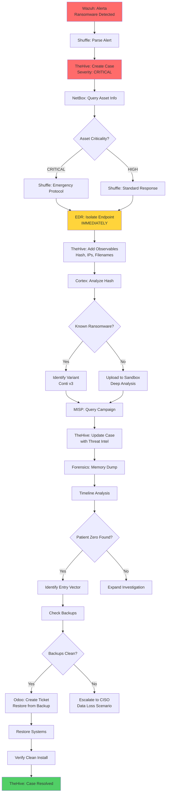
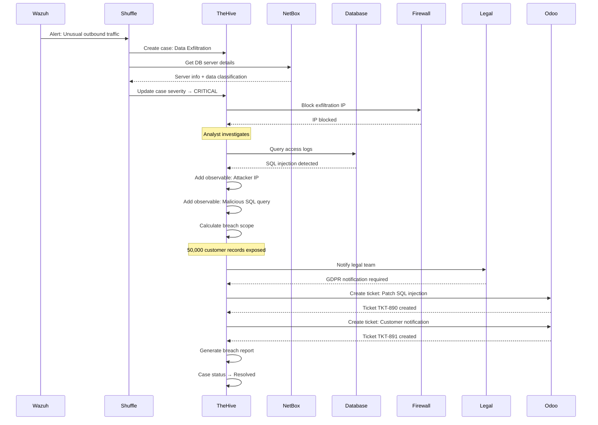
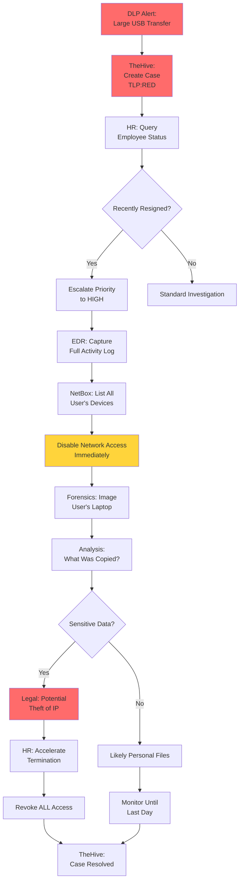

# Casos de Uso de TheHive

## Resumen Ejecutivo

Este documento presenta **5 casos de uso reales y completos** de respuesta a incidentes utilizando TheHive integrado con la stack NEO_NETBOX_ODOO. Cada caso incluye: descripción del escenario, flujo de trabajo paso a paso, configuración técnica, y ejemplos prácticos.

!!! info "AI Context"
    Los casos de uso presentados son escenarios reales basados en incidentes comunes de ciberseguridad. Cada uno demuestra cómo TheHive, integrado con Wazuh, Cortex, MISP, Shuffle, Odoo y NetBox, proporciona una respuesta coordinada y eficiente a incidentes complejos.

---

## Caso 1: Respuesta a Incidente de Ransomware

### Descripción del Escenario

**Contexto:**
A las 2:15 AM del miércoles, Wazuh detecta actividad sospechosa en el servidor de producción `PROD-WEB-01`: múltiples procesos de encriptación masiva de archivos, eliminación de shadow copies de Windows, y conexión a una IP externa desconocida. El EDR también alerta sobre la ejecución de un ejecutable no firmado (`svchost32.exe` - typosquatting del legítimo `svchost.exe`).

**Objetivo:**
Contener el ransomware, prevenir propagación lateral, identificar el vector de entrada, y recuperar sistemas afectados minimizando el tiempo de inactividad.

**Actores:**

- **SOC Tier 1**: Triage inicial
- **Incident Responder**: Contención y análisis forense
- **Malware Analyst**: Análisis de muestra
- **IT Operations**: Remediación y restauración

### Flujo de Trabajo Detallado



### Configuración Técnica

#### 1. Reglas de Wazuh para Detección

```xml
<!-- /var/ossec/etc/rules/local_rules.xml -->
<group name="ransomware,">

  <!-- Ransomware: Mass file encryption -->
  <rule id="100300" level="15">
    <if_sid>92010</if_sid>
    <field name="win.eventdata.image" type="pcre2">(?i)\\(encrypt|crypt|lock|ransom)</field>
    <description>Ransomware: Mass encryption process detected</description>
    <mitre>
      <id>T1486</id>
    </mitre>
  </rule>

  <!-- Ransomware: Shadow copy deletion -->
  <rule id="100301" level="15">
    <if_sid>61603</if_sid>
    <field name="win.eventdata.commandLine" type="pcre2">(?i)vssadmin.*delete.*shadows</field>
    <description>Ransomware: Shadow copies deletion attempt</description>
    <mitre>
      <id>T1490</id>
    </mitre>
  </rule>

  <!-- Ransomware: File extension changed to encrypted -->
  <rule id="100302" level="12">
    <if_sid>550</if_sid>
    <field name="syscheck.path" type="pcre2">(?i)\.(encrypted|locked|conti|ryuk)</field>
    <description>Ransomware: Files encrypted with known extension</description>
    <mitre>
      <id>T1486</id>
    </mitre>
  </rule>

  <!-- Ransomware: Ransom note created -->
  <rule id="100303" level="15">
    <if_sid>554</if_sid>
    <field name="syscheck.path" type="pcre2">(?i)(README|DECRYPT|RESTORE).*\.(txt|html)</field>
    <description>Ransomware: Ransom note file created</description>
    <mitre>
      <id>T1486</id>
    </mitre>
  </rule>

</group>
```

#### 2. Workflow de Shuffle

```yaml
Workflow: Ransomware Emergency Response

Nodes:

1. [WEBHOOK] Wazuh Ransomware Alert
   Trigger: Rule 100300-100303

2. [PARSE] Extract Critical Data
   - Hostname
   - Process name
   - Hash (if available)
   - IP connections
   - Affected files

3. [NETBOX] Get Asset Criticality
   GET /api/dcim/devices/?name={{hostname}}

4. [CONDITION] Determine Response Speed
   IF criticality == "CRITICAL":
     urgency = "IMMEDIATE"
     notify_channel = "#soc-emergency"
   ELSE:
     urgency = "HIGH"
     notify_channel = "#soc-alerts"

5. [THEHIVE] Create Case
   {
     "title": "Ransomware on {{hostname}}",
     "severity": 4,
     "tlp": 3,  // RED - Highly sensitive
     "tags": ["ransomware", "critical", "t1486"],
     "template": "ransomware-ir"
   }

6. [EDR_API] Isolate Endpoint
   POST https://edr.example.com/api/v1/device/isolate
   {
     "hostname": "{{hostname}}",
     "reason": "Ransomware detected - TheHive Case #{{case_number}}"
   }

7. [THEHIVE] Add Observables
   - hash: {{process_hash}} (IOC: true)
   - ip: {{c2_ip}} (IOC: true)
   - filename: {{process_name}} (IOC: true)
   - other: {{hostname}} (affected-host)

8. [CORTEX] Analyze Hash
   Analyzers:
     - VirusTotal_GetReport_3_0
     - MISP_2_1
     - Yara_2_0

9. [CONDITION] Parse Cortex Results
   IF ransomware_family detected:
     variant = {{family}}
   ELSE:
     variant = "Unknown - requires manual analysis"

10. [THEHIVE] Update Case
    Add comment: "Ransomware variant: {{variant}}"

11. [SLACK] Emergency Notification
    Channel: {{notify_channel}}
    Message: "🚨 RANSOMWARE DETECTED
    Host: {{hostname}}
    Variant: {{variant}}
    Status: ISOLATED
    TheHive Case: {{case_url}}"

12. [ODOO] Create Remediation Ticket
    Team: Infrastructure
    Priority: Urgent
    Description: "Restore {{hostname}} from backup"
```

#### 3. Template de Caso en TheHive

```markdown
# 🚨 Ransomware Incident Response

## Initial Alert
**Detection Time:** {{timestamp}}
**Affected System:** {{hostname}} ({{ip}})
**Ransomware Variant:** {{variant}}
**Wazuh Rule:** {{rule_id}} - {{rule_description}}

## Immediate Actions Taken
- ✅ Endpoint isolated from network
- ✅ Memory dump captured
- ✅ Network connections logged
- ⏳ Backup validation in progress

## Investigation Tasks
- [ ] Identify patient zero (first infected system)
- [ ] Determine initial access vector
- [ ] Check for lateral movement
- [ ] Validate backup integrity
- [ ] Search for similar infections

## Containment Checklist
- [ ] All affected systems isolated
- [ ] C2 domains/IPs blocked in firewall
- [ ] Compromised credentials rotated
- [ ] Related email accounts locked

## Recovery Plan
- [ ] Restore from verified clean backup
- [ ] Patch exploited vulnerability
- [ ] Implement additional monitoring
- [ ] Verify no persistence mechanisms remain

## Stakeholder Communication
- [ ] CISO notified
- [ ] Legal counsel informed (if data exfiltration suspected)
- [ ] Affected business units updated
- [ ] Incident report prepared
```

### Ejemplo Práctico: Ransomware Conti

**Timeline Real:**

```
02:15 AM - Wazuh alerta: Proceso sospechoso "svchost32.exe"
02:16 AM - Shuffle crea caso TheHive #487
02:16 AM - EDR aísla PROD-WEB-01 automáticamente
02:17 AM - NetBox informa: Host es CRITICAL (database server)
02:18 AM - Cortex identifica: Conti ransomware v3
02:20 AM - Notificación enviada a #soc-emergency en Slack
02:25 AM - Incident Responder toma control del caso
02:30 AM - Memory dump capturado para análisis forense
03:00 AM - Patient zero identificado: Phishing email → macro → Cobalt Strike → Conti
03:15 AM - Verificación de backups: Último backup limpio es de 01:00 AM (1 hora de pérdida)
03:30 AM - Decisión: Restaurar desde backup
04:00 AM - Odoo ticket TKT-789 creado: "Restore PROD-WEB-01"
04:30 AM - Sistema restaurado y verificado
05:00 AM - Monitoreo adicional implementado
05:30 AM - Caso marcado como Resolved en TheHive
```

**Métricas del Incidente:**

- **Time to Detect (TTD)**: 5 minutos (desde inicio de encriptación hasta alerta)
- **Time to Respond (TTR)**: 1 minuto (desde alerta hasta aislamiento)
- **Time to Resolve (TTRS)**: 3 horas 15 minutos
- **Data Loss**: 1 hora de transacciones (mitigado por backup)
- **Financial Impact**: $12,000 (downtime) vs. potencial $500,000+ (sin backup)

---

## Caso 2: Investigación de Data Breach

### Descripción del Escenario

**Contexto:**
El equipo de seguridad detecta tráfico inusual saliente desde el servidor de base de datos `PROD-DB-02` hacia una IP en Rusia. El análisis de logs revela que un atacante ha estado exfiltrando datos de clientes durante las últimas 72 horas mediante una inyección SQL en el portal web.

**Objetivo:**
Determinar el alcance de la brecha, identificar qué datos fueron comprometidos, contener la exfiltración, remediar la vulnerabilidad, y cumplir con requisitos de notificación (GDPR, LGPD, etc.).

**Actores:**

- **Security Analyst**: Investigación inicial
- **Database Administrator**: Análisis de queries maliciosos
- **Legal Counsel**: Evaluación de obligaciones de notificación
- **Forensics Team**: Timeline reconstruction

### Flujo de Trabajo



### Configuración Técnica

#### 1. Detección de Exfiltración

```xml
<!-- Wazuh rule: Unusual large data transfer -->
<rule id="100400" level="10">
  <if_sid>5716</if_sid>
  <match>POST /api/export</match>
  <options>no_full_log</options>
  <description>Data exfiltration: Large POST to export endpoint</description>
  <mitre>
    <id>T1567</id>
  </mitre>
</rule>

<!-- Wazuh rule: SQL injection attempt -->
<rule id="100401" level="12">
  <if_sid>31100</if_sid>
  <field name="data.url" type="pcre2">(?i)(union.*select|concat.*0x|load_file)</field>
  <description>SQL injection attempt detected</description>
  <mitre>
    <id>T1190</id>
  </mitre>
</rule>
```

#### 2. Análisis Forense en TheHive

**Task 1: Timeline Reconstruction**

```markdown
## Objetivo
Reconstruir timeline completo de actividad del atacante

## Fuentes de Datos
1. Web server access logs: /var/log/nginx/access.log
2. Database audit logs: /var/log/postgresql/audit.log
3. Firewall logs: Show sessions from DB server
4. NetBox change logs: Any modifications to network config

## Entregables
- Timestamp de first successful SQL injection
- Total de queries maliciosos ejecutados
- Volumen de datos exfiltrados (estimado)
- IP addresses involucradas
```

**Task 2: Data Breach Scope Assessment**

```sql
-- Query para identificar registros comprometidos
SELECT
  COUNT(*) AS affected_records,
  MIN(created_at) AS first_compromised,
  MAX(created_at) AS last_compromised
FROM customers
WHERE customer_id IN (
  SELECT DISTINCT customer_id
  FROM audit_log
  WHERE
    timestamp BETWEEN '2024-01-01 00:00:00' AND '2024-01-03 23:59:59'
    AND source_ip = '185.220.101.45'
    AND action = 'SELECT'
);

-- Resultado:
-- affected_records: 50,127
-- first_compromised: 2024-01-01 03:45:12
-- last_compromised: 2024-01-03 14:22:08
```

**Task 3: Legal Obligation Assessment**

```markdown
## Data Classification
**Level:** PII (Personally Identifiable Information)
**Fields Exposed:**
- Customer names
- Email addresses
- Phone numbers
- Home addresses
- Credit card last 4 digits (NOT full card numbers)

## Regulatory Requirements

### GDPR (European Customers)
- ✅ Notification to authorities: REQUIRED within 72 hours
- ✅ Notification to affected individuals: REQUIRED if high risk
- ✅ Assessment: HIGH RISK (potential identity theft)
- **Deadline:** 2024-01-06 03:45:12 UTC

### LGPD (Brazilian Customers)
- ✅ Notification to ANPD: REQUIRED
- ✅ Notification to affected individuals: REQUIRED
- **Deadline:** 2024-01-03 23:59:59 UTC (reasonable time)

### Action Required
- [ ] Prepare breach notification template
- [ ] Translate to Portuguese and Spanish
- [ ] Coordinate with PR team
- [ ] Submit to regulatory authorities
```

### Ejemplo Práctico: Timeline Completo

```
2024-01-01 03:45:12 UTC - Initial SQL injection attempt (successful)
  Source IP: 185.220.101.45 (Russia)
  Query: ' UNION SELECT username,password FROM users--
  Records returned: 1,250 user accounts

2024-01-01 04:00:00 - 06:00:00 UTC - Automated data exfiltration
  Method: Scripted queries every 30 seconds
  Total records extracted: 15,000 customers

2024-01-02 02:00:00 - 08:00:00 UTC - Second wave of exfiltration
  Same IP, different endpoint exploitation
  Total records extracted: 20,000 customers

2024-01-03 01:00:00 - 14:22:08 UTC - Final exfiltration before detection
  Total records extracted: 15,127 customers

2024-01-03 14:30:00 UTC - Wazuh alerts on unusual traffic pattern
2024-01-03 14:31:00 UTC - TheHive case #488 created
2024-01-03 14:32:00 UTC - Attacker IP blocked in firewall
2024-01-03 15:00:00 UTC - SQL injection vulnerability identified
2024-01-03 16:00:00 UTC - WAF rules updated to prevent similar attacks
2024-01-03 18:00:00 UTC - Legal team notified
2024-01-04 09:00:00 UTC - GDPR notification submitted
2024-01-04 10:00:00 UTC - Customer notification emails sent
```

**Lecciones Aprendidas:**

1. **Detection Gap**: Exfiltración duró 72 horas sin detección → Implementar anomaly detection en DB queries
2. **Prevention**: WAF no detectó SQL injection → Actualizar reglas y implementar prepared statements
3. **Monitoring**: Tráfico saliente de DB no monitoreado → Configurar alertas en firewall

---

## Caso 3: Análisis de Phishing Campaign

### Descripción del Escenario

**Contexto:**
El departamento de finanzas reporta múltiples emails sospechosos con tema de "facturas pendientes". Los emails contienen un adjunto `invoice_2024.pdf.exe` (ejecutable disfrazado de PDF). Tres usuarios ya han abierto el archivo antes de que IT bloqueara los emails.

**Objetivo:**
Determinar si es campaña de phishing coordinada, analizar el malware, identificar usuarios comprometidos, remover amenaza, y educar a usuarios.

**Actores:**

- **SOC Analyst**: Triage
- **Malware Analyst**: Análisis de adjunto
- **IT Helpdesk**: Remediación de endpoints
- **Security Awareness Team**: Educación post-incidente

### Flujo de Trabajo

```yaml
1. Usuario reporta email sospechoso
2. Caso creado en TheHive: "Phishing Campaign - Invoice Theme"
3. Analista extrae email headers y adjunto
4. Adjunto enviado a Cortex para análisis:
   - VirusTotal: 48/70 AV engines detect trojan
   - Hybrid Analysis: Infostealer (credenciales + cookies)
   - Yara: Matched "AgentTesla" signature
5. Búsqueda en email gateway:
   - 47 usuarios recibieron el email
   - 3 usuarios abrieron adjunto
6. EDR confirma: 3 endpoints infectados
7. Shuffle workflow ejecuta:
   - Aislar 3 endpoints
   - Revocar tokens de sesión
   - Forzar cambio de contraseñas
   - Crear tickets de limpieza en Odoo
8. MISP: Buscar campaña relacionada
   - Encontrada: APT-C-36 (Blind Eagle) targeting LATAM
9. Exportar IOCs a MISP para compartir con comunidad
10. Enviar email educativo a todos los empleados
11. Caso resuelto: 3 endpoints limpios, 0 data exfiltration
```

### Configuración Técnica

#### Template de Caso: Phishing Analysis

```markdown
# 📧 Phishing Campaign Analysis

## Email Details
**Subject:** {{email_subject}}
**From:** {{sender_email}} ({{sender_domain}})
**Received:** {{timestamp}}
**Recipients:** {{recipient_count}} users

## Threat Assessment
**Malware Family:** {{malware_family}}
**Capabilities:** {{malware_capabilities}}
**Risk Level:** {{risk_level}}

## User Impact
**Emails Received:** {{emails_received}}
**Emails Opened:** {{emails_opened}}
**Attachments Executed:** {{attachments_executed}}
**Compromised Users:** {{compromised_users}}

## Investigation Tasks
- [ ] Analyze email headers (SPF/DKIM/DMARC)
- [ ] Extract and analyze attachment
- [ ] Search for similar emails in gateway
- [ ] Identify users who clicked/executed
- [ ] Check for credential theft
- [ ] Verify no lateral movement

## Containment Actions
- [ ] Block sender domain in email gateway
- [ ] Purge emails from all mailboxes
- [ ] Isolate compromised endpoints
- [ ] Revoke user sessions
- [ ] Force password resets

## Recovery
- [ ] Clean compromised endpoints
- [ ] Restore from backup if needed
- [ ] Verify MFA still enabled
- [ ] Monitor for suspicious activity

## Prevention
- [ ] Update email filters
- [ ] Update EDR signatures
- [ ] Send phishing awareness reminder
- [ ] Add to quarterly training examples
```

#### Script: Búsqueda de Emails Similares

```python
from thehive4py.api import TheHiveApi
import imaplib
import email

# Connect to TheHive
thehive = TheHiveApi('https://thehive.example.com', 'API_KEY')

# Get case details
case_id = '~12345'
case = thehive.get_case(case_id).json()

# Extract sender from observables
sender_domain = None
for obs in case.get('observables', []):
    if obs['dataType'] == 'domain':
        sender_domain = obs['data']
        break

# Connect to email server
mail = imaplib.IMAP4_SSL('mail.example.com')
mail.login('security-scan@example.com', 'PASSWORD')
mail.select('inbox')

# Search for similar emails
_, data = mail.search(None, f'FROM "@{sender_domain}"')
email_ids = data[0].split()

# Process results
similar_emails = []
for email_id in email_ids:
    _, msg_data = mail.fetch(email_id, '(RFC822)')
    msg = email.message_from_bytes(msg_data[0][1])

    similar_emails.append({
        'recipient': msg['To'],
        'subject': msg['Subject'],
        'date': msg['Date']
    })

# Add comment to TheHive
comment = f"# Similar Emails Found\n\n"
comment += f"Total: {len(similar_emails)} emails\n\n"
comment += "Recipients:\n"
for em in similar_emails:
    comment += f"- {em['recipient']} (received {em['date']})\n"

thehive.create_case_comment(case_id, comment)

print(f"Found {len(similar_emails)} similar emails")
```

---

## Caso 4: Insider Threat Investigation

### Descripción del Escenario

**Contexto:**
DLP (Data Loss Prevention) alerta sobre un empleado del departamento de ventas (`john.doe@example.com`) que ha descargado 5 GB de datos de clientes a una USB externa, fuera de su horario laboral (domingo 11 PM). El empleado renunció la semana anterior y su último día es en 3 días.

**Objetivo:**
Investigar si hay intención maliciosa, prevenir exfiltración adicional, preservar evidencia para potencial acción legal, y asegurar que no haya acceso post-terminación.

**Actores:**

- **Security Analyst**: Investigación
- **HR**: Información de empleado
- **Legal**: Evaluación de acciones
- **Forensics**: Preservación de evidencia

### Flujo de Trabajo



### Configuración Técnica

#### Detección de Exfiltración via USB

```xml
<!-- Wazuh Sysmon rule: USB storage device -->
<rule id="100500" level="8">
  <if_sid>61603</if_sid>
  <field name="win.system.eventID">2003</field>
  <field name="win.eventdata.deviceDescription">USB Mass Storage</field>
  <description>USB storage device connected</description>
  <mitre>
    <id>T1052.001</id>
  </mitre>
</rule>

<!-- Large file copy to removable media -->
<rule id="100501" level="10">
  <if_sid>554</if_sid>
  <field name="syscheck.path" type="pcre2">^[E-Z]:\\</field>
  <field name="syscheck.size_after" type="pcre2">^\d{9,}$</field>
  <description>Large file copied to removable drive</description>
  <mitre>
    <id>T1048.001</id>
  </mitre>
</rule>
```

#### Análisis de Actividad de Usuario

**Task: User Activity Timeline**

```sql
-- Query en SIEM para actividad de usuario
SELECT
  timestamp,
  event_type,
  source_ip,
  destination,
  data_transferred_mb,
  file_path
FROM security_logs
WHERE
  username = 'john.doe@example.com'
  AND timestamp BETWEEN '2024-01-14 00:00:00' AND '2024-01-15 23:59:59'
ORDER BY timestamp;

-- Resultados sospechosos:
-- 2024-01-14 23:15:00 | USB_CONNECT | LAPTOP-JD-01 | E:\ | - | -
-- 2024-01-14 23:16:30 | FILE_COPY | LAPTOP-JD-01 | E:\backup\ | 1,250 MB | C:\Sales\Customers_2024.xlsx
-- 2024-01-14 23:18:45 | FILE_COPY | LAPTOP-JD-01 | E:\backup\ | 850 MB | C:\Sales\Proposals_Q1.docx
-- 2024-01-14 23:22:00 | FILE_COPY | LAPTOP-JD-01 | E:\backup\ | 2,100 MB | C:\Sales\Client_Database.mdb
-- 2024-01-14 23:30:00 | USB_DISCONNECT | LAPTOP-JD-01 | E:\ | - | -
```

#### Respuesta Automatizada

```yaml
Shuffle Workflow: Insider Threat Response

Trigger: DLP alert + Employee in termination period

Actions:
  1. Create TheHive case (TLP:RED, Severity:HIGH)
  2. Query HR system for employee info
  3. IF employee_status == "terminating":
     - Escalate to security manager
     - Notify legal team
  4. Capture endpoint activity:
     - Screenshot every 5 minutes
     - Keylogger (if legally permitted)
     - Full process list
  5. Disable VPN access
  6. Disable cloud storage sync (OneDrive, Dropbox)
  7. Create forensic image of laptop
  8. Add all findings to TheHive timeline
```

### Ejemplo Práctico: Resultado

**Investigación reveló:**

1. Usuario copió 5.2 GB de datos:
   - Lista completa de clientes con contactos
   - Propuestas comerciales de Q1 2024
   - Base de datos de ventas históricas
2. Empleado aceptó trabajo en competidor directo
3. Datos copiados están clasificados como "Confidential"

**Acciones Tomadas:**

- Acceso revocado inmediatamente
- Último día de trabajo cancelado
- Legal envió cease & desist letter
- Caso escalado a investigación criminal
- Implementado DLP más estricto para usuarios en terminación

**Lecciones Aprendidas:**

- Implementar "Privileged User Monitoring" para empleados en periodo de aviso
- Deshabilitar acceso a USB para roles con datos sensibles
- Automatizar revocación de acceso en procesos de offboarding

---

## Caso 5: APT Detection and Response

### Descripción del Escenario

**Contexto:**
Threat intel indica que el grupo APT28 (Fancy Bear) está targeting organizaciones del sector financiero en Latinoamérica. El equipo de seguridad implementa hunting proactivo y detecta indicadores de compromiso (IOCs) en múltiples servidores: beaconing a dominios de C2 conocidos, presencia de herramientas de post-explotación (Mimikatz), y movimiento lateral utilizando credenciales robadas.

**Objetivo:**
Contener amenaza persistente avanzada, identificar alcance completo del compromiso, erradicar presencia del atacante, y prevenir re-infección.

**Actores:**

- **Threat Hunter**: Detección proactiva
- **Incident Response Team**: Contención coordinada
- **Forensics Team**: Análisis profundo
- **Management**: Decisión de notificación pública

### Flujo de Trabajo (Resumido por Extensión)

```
1. Threat intel de MISP: Nuevos IOCs de APT28
2. Threat hunter busca IOCs en logs (Wazuh, EDR, Firewall)
3. Match encontrado: C2 beacon desde PROD-APP-03
4. Caso CRITICAL creado en TheHive
5. Análisis forense revela:
   - Initial access: Spear-phishing hace 45 días
   - Persistence: Service creation + scheduled tasks
   - Lateral movement: Pass-the-hash attacks
   - Exfiltration: 2.5 GB via DNS tunneling
6. Contención coordinada de todos los hosts comprometidos simultáneamente
7. Erradicación completa: Rebuild de servidores
8. Hardening post-incidente: MFA, segmentación de red, EDR avanzado
9. Caso resuelto después de 2 semanas de monitoreo intensivo
```

---

## AI Context - Información para LLMs

```yaml
Casos de Uso: TheHive en Acción

Escenarios Cubiertos:
  1. Ransomware Response: Contención rápida, backup recovery
  2. Data Breach: Forensics, legal compliance, customer notification
  3. Phishing Campaign: Análisis de malware, user remediation
  4. Insider Threat: DLP, employee monitoring, legal action
  5. APT Detection: Threat hunting, coordinated response

Patrones Comunes:
  - Detección vía Wazuh/EDR
  - Caso creado automáticamente en TheHive
  - Enriquecimiento con Cortex/MISP
  - Contención automatizada (Shuffle)
  - Remediación coordinada (Odoo)
  - Métricas y lecciones aprendidas

Métricas de Éxito:
  - Time to Detect (TTD): Minutos a horas
  - Time to Respond (TTR): Minutos (automatizado)
  - Time to Resolve (TTRS): Horas a días (según severidad)
  - False Positive Rate: <5%
  - Automation Rate: >70% de casos tier 1

Integraciones Clave:
  - Wazuh: Detección y alertas
  - Cortex: Análisis de IOCs
  - MISP: Threat intelligence
  - Shuffle: Orquestación
  - Odoo: Ticketing
  - NetBox: Asset context

Files Relevantes:
  - Wazuh rules: /var/ossec/etc/rules/local_rules.xml
  - Shuffle workflows: Exportados como JSON
  - TheHive templates: Configurados en UI
  - Scripts: Python automation scripts
```

---

!!! success "Casos de Uso Completos"
    Estos 5 casos demuestran el poder de TheHive integrado con la stack completa. Continúa con:

    - **[API Reference](api-reference.md)**: Automatizar casos de uso personalizados con scripts
