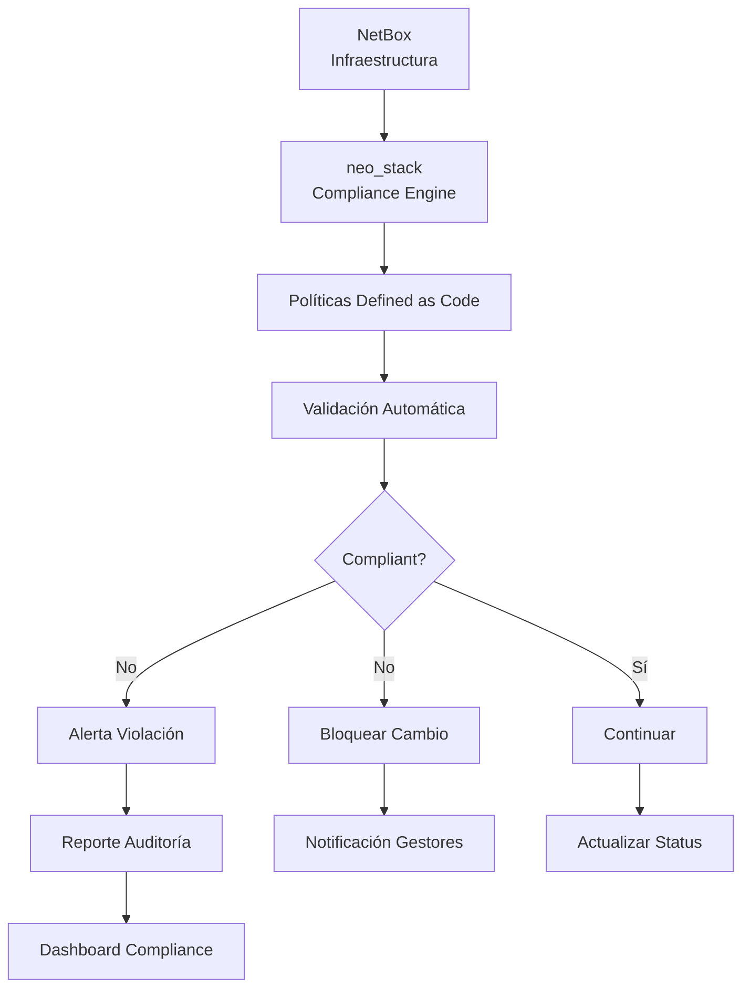

# Caso de Uso: Compliance y Auditoría con neo_stack

> **"Gobernanza automatizada: políticas que se auto-ejecutan."**

---

## 🎯 Objetivo

Automatizar la verificación de compliance y políticas de gobernanza de la infraestructura:
- ✅ **Validación automática** de políticas
- ✅ **Reportes de auditoría** en tiempo real
- ✅ **Alertas** de violaciones
- ✅ **Certificaciones** (ISO 27001, SOC 2, LGPD)

---

## 📊 Problema que Resuelve

| Auditoría Manual | Compliance Automatizado |
|-----------------|------------------------|
| **3 meses** para auditoría anual | **Tiempo real** (continuo) |
| **99% de probabilidad** de error humano | **100% confiable** |
| **Costo alto** ($500,000 MXN/año) | **Automático** ($50,000 MXN/año) |
| **Datos desactualizados** | **Datos en tiempo real** |

---

## 🏗️ Arquitectura de la Solución



---

## 💻 Implementación Práctica

### 1. Engine de Compliance (Python)

```python
# neo-stack/compliance/engine.py
import pynetbox
import json
from datetime import datetime, timedelta
from enum import Enum
from dataclasses import dataclass
from typing import List, Dict, Any, Optional

class Severity(Enum):
    CRITICAL = "CRITICAL"
    HIGH = "HIGH"
    MEDIUM = "MEDIUM"
    LOW = "LOW"

class ComplianceStatus(Enum):
    COMPLIANT = "COMPLIANT"
    NON_COMPLIANT = "NON_COMPLIANT"
    WARNING = "WARNING"
    NOT_APPLICABLE = "NOT_APPLICABLE"

@dataclass
class ComplianceRule:
    id: str
    name: str
    description: str
    severity: Severity
    category: str
    remediation: str
    enabled: bool = True

@dataclass
class ComplianceViolation:
    rule_id: str
    rule_name: str
    resource_id: str
    resource_type: str
    status: ComplianceStatus
    message: str
    severity: Severity
    detected_at: datetime
    remediation: str

class ComplianceEngine:
    def __init__(self, netbox_url, netbox_token):
        self.nb = pynetbox.api(netbox_url, token=netbox_token)
        self.rules = self._load_rules()
        self.violations: List[ComplianceViolation] = []

    def _load_rules(self) -> List[ComplianceRule]:
        """Carga reglas de compliance como código"""
        rules = [
            # Regla 1: Todo device debe tener asset_tag
            ComplianceRule(
                id="NETBOX-001",
                name="Device Asset Tag Required",
                description="Todo dispositivo debe tener código de inventario (asset_tag)",
                severity=Severity.HIGH,
                category="Inventario",
                remediation="Añadir asset_tag en NetBox o marcar como 'Sin Asset Tag' si está exento",
                enabled=True
            ),

            # Regla 2: Device de producción debe estar en rack
            ComplianceRule(
                id="NETBOX-002",
                name="Production Device in Rack",
                description="Dispositivos con status 'active' deben estar físicamente en un rack",
                severity=Severity.CRITICAL,
                category="Localización",
                remediation="Mover dispositivo a rack adecuado en el datacenter",
                enabled=True
            ),

            # Regla 3: Nombre debe seguir patrón
            ComplianceRule(
                id="NETBOX-003",
                name="Device Naming Convention",
                description="Nombre debe seguir patrón: tipo-servicio-número (ej: web-app-01)",
                severity=Severity.MEDIUM,
                category="Naming",
                remediation="Renombrar dispositivo siguiendo patrón establecido",
                enabled=True
            ),

            # Regla 4: IP debe tener descripción
            ComplianceRule(
                id="NETBOX-004",
                name="IP Address Description Required",
                description="Todo IP en uso debe tener descripción clara del uso",
                severity=Severity.MEDIUM,
                category="IPAM",
                remediation="Añadir descripción significativa al IP address",
                enabled=True
            ),

            # Regla 5: Custom field obligatorio
            ComplianceRule(
                id="NETBOX-005",
                name="Cost Center Required",
                description="Todo device debe tener centro de costo definido (custom_field)",
                severity=Severity.HIGH,
                category="Financiero",
                remediation="Definir custom field 'cost_center' en el dispositivo",
                enabled=True
            ),

            # Regla 6: Warranty
            ComplianceRule(
                id="NETBOX-006",
                name="Warranty Check",
                description="Dispositivos no deben estar fuera de garantía por más de 6 meses",
                severity=Severity.MEDIUM,
                category="Hardware",
                remediation="Renovar garantía o planear reemplazo",
                enabled=True
            ),

            # Regla 7: VLAN sin uso
            ComplianceRule(
                id="NETBOX-007",
                name="Orphaned VLANs",
                description="VLANs sin IPs o interfaces asignadas hace más de 90 días deben ser revisadas",
                severity=Severity.LOW,
                category="IPAM",
                remediation="Remover VLAN obsoleta o asignar IPs",
                enabled=True
            ),

            # Regla 8: Conflicto de IP
            ComplianceRule(
                id="NETBOX-008",
                name="IP Conflict Detection",
                description="Verificar IPs duplicadas en la red",
                severity=Severity.CRITICAL,
                category="IPAM",
                remediation="Resolver conflicto IP cambiando direcciones duplicadas",
                enabled=True
            ),

            # Regla 9: Site sin responsable
            ComplianceRule(
                id="NETBOX-009",
                name="Site Responsible Required",
                description="Todo site debe tener responsable definido (custom field)",
                severity=Severity.MEDIUM,
                category="Organización",
                remediation="Definir responsable por el site",
                enabled=True
            ),

            # Regla 10: Device sin serial
            ComplianceRule(
                id="NETBOX-010",
                name="Device Serial Required",
                description="Todo device físico debe tener número de serie registrado",
                severity=Severity.HIGH,
                category="Hardware",
                remediation="Registrar número de serie del dispositivo",
                enabled=True
            ),
        ]
        return rules

    def validate_device(self, device) -> List[ComplianceViolation]:
        """Valida un device contra todas las reglas"""
        violations = []

        for rule in self.rules:
            if not rule.enabled:
                continue

            try:
                if rule.id == "NETBOX-001":
                    # Device Asset Tag Required
                    if not device.asset_tag:
                        violations.append(ComplianceViolation(
                            rule_id=rule.id,
                            rule_name=rule.name,
                            resource_id=str(device.id),
                            resource_type="device",
                            status=ComplianceStatus.NON_COMPLIANT,
                            message=f"Device {device.name} sin asset_tag",
                            severity=rule.severity,
                            detected_at=datetime.now(),
                            remediation=rule.remediation
                        ))

                elif rule.id == "NETBOX-002":
                    # Production Device in Rack
                    if device.status.value == 'active' and not device.rack:
                        violations.append(ComplianceViolation(
                            rule_id=rule.id,
                            rule_name=rule.name,
                            resource_id=str(device.id),
                            resource_type="device",
                            status=ComplianceStatus.NON_COMPLIANT,
                            message=f"Device activo {device.name} sin rack definido",
                            severity=rule.severity,
                            detected_at=datetime.now(),
                            remediation=rule.remediation
                        ))

                elif rule.id == "NETBOX-003":
                    # Device Naming Convention
                    import re
                    if not re.match(r'^[a-z]+-[a-z]+-\d+$', device.name):
                        violations.append(ComplianceViolation(
                            rule_id=rule.id,
                            rule_name=rule.name,
                            resource_id=str(device.id),
                            resource_type="device",
                            status=ComplianceStatus.WARNING,
                            message=f"Device {device.name} no sigue patrón tipo-servicio-número",
                            severity=rule.severity,
                            detected_at=datetime.now(),
                            remediation=rule.remediation
                        ))

                elif rule.id == "NETBOX-005":
                    # Cost Center Required
                    custom_fields = device.custom_fields or {}
                    if not custom_fields.get('cost_center'):
                        violations.append(ComplianceViolation(
                            rule_id=rule.id,
                            rule_name=rule.name,
                            resource_id=str(device.id),
                            resource_type="device",
                            status=ComplianceStatus.NON_COMPLIANT,
                            message=f"Device {device.name} sin centro de costo definido",
                            severity=rule.severity,
                            detected_at=datetime.now(),
                            remediation=rule.remediation
                        ))

                elif rule.id == "NETBOX-006":
                    # Warranty Check
                    custom_fields = device.custom_fields or {}
                    warranty_end = custom_fields.get('warranty_end')
                    if warranty_end:
                        warranty_date = datetime.strptime(warranty_end, '%Y-%m-%d')
                        if (datetime.now() - warranty_date).days > 180:
                            violations.append(ComplianceViolation(
                                rule_id=rule.id,
                                rule_name=rule.name,
                                resource_id=str(device.id),
                                resource_type="device",
                                status=ComplianceStatus.WARNING,
                                message=f"Device {device.name} fuera de garantía hace más de 6 meses",
                                severity=rule.severity,
                                detected_at=datetime.now(),
                                remediation=rule.remediation
                            ))

                elif rule.id == "NETBOX-010":
                    # Device Serial Required
                    if not device.serial:
                        violations.append(ComplianceViolation(
                            rule_id=rule.id,
                            rule_name=rule.name,
                            resource_id=str(device.id),
                            resource_type="device",
                            status=ComplianceStatus.NON_COMPLIANT,
                            message=f"Device {device.name} sin número de serie",
                            severity=rule.severity,
                            detected_at=datetime.now(),
                            remediation=rule.remediation
                        ))

            except Exception as e:
                print(f"Error al validar regla {rule.id} para device {device.name}: {e}")

        return violations

    def validate_ip_address(self, ip) -> List[ComplianceViolation]:
        """Valida un IP address"""
        violations = []

        for rule in self.rules:
            if not rule.enabled or rule.id != "NETBOX-004":
                continue

            # IP Address Description Required
            if ip.assigned_object and not ip.description:
                violations.append(ComplianceViolation(
                    rule_id=rule.id,
                    rule_name=rule.name,
                    resource_id=str(ip.id),
                    resource_type="ip_address",
                    status=ComplianceStatus.NON_COMPLIANT,
                    message=f"IP {ip.address} sin descripción",
                    severity=rule.severity,
                    detected_at=datetime.now(),
                    remediation=rule.remediation
                ))

        return violations

    def validate_all(self) -> Dict[str, Any]:
        """Valida toda la infraestructura"""
        print("Iniciando validación de compliance...")

        total_violations = []
        devices_compliant = 0
        devices_non_compliant = 0
        ips_compliant = 0
        ips_non_compliant = 0

        # Validar devices
        print("Validando devices...")
        devices = self.nb.dcim.devices.all()
        for device in devices:
            violations = self.validate_device(device)
            if violations:
                devices_non_compliant += 1
                total_violations.extend(violations)
            else:
                devices_compliant += 1

        # Validar IPs
        print("Validando IPs...")
        ips = self.nb.ipam.ip_addresses.all()
        for ip in ips:
            violations = self.validate_ip_address(ip)
            if violations:
                ips_non_compliant += 1
                total_violations.extend(violations)
            else:
                ips_compliant += 1

        # Resumen
        summary = {
            'total_devices': devices_compliant + devices_non_compliant,
            'devices_compliant': devices_compliant,
            'devices_non_compliant': devices_non_compliant,
            'device_compliance_rate': (devices_compliant / (devices_compliant + devices_non_compliant) * 100) if (devices_compliant + devices_non_compliant) > 0 else 0,
            'total_ips': ips_compliant + ips_non_compliant,
            'ips_compliant': ips_compliant,
            'ips_non_compliant': ips_non_compliant,
            'ip_compliance_rate': (ips_compliant / (ips_compliant + ips_non_compliant) * 100) if (ips_compliant + ips_non_compliant) > 0 else 0,
            'total_violations': len(total_violations),
            'violations_by_severity': {
                'CRITICAL': len([v for v in total_violations if v.severity == Severity.CRITICAL]),
                'HIGH': len([v for v in total_violations if v.severity == Severity.HIGH]),
                'MEDIUM': len([v for v in total_violations if v.severity == Severity.MEDIUM]),
                'LOW': len([v for v in total_violations if v.severity == Severity.LOW]),
            },
            'violations_by_category': {},
            'timestamp': datetime.now().isoformat()
        }

        # Agrupar por categoría
        for violation in total_violations:
            rule = next((r for r in self.rules if r.id == violation.rule_id), None)
            category = rule.category if rule else 'Unknown'
            if category not in summary['violations_by_category']:
                summary['violations_by_category'][category] = 0
            summary['violations_by_category'][category] += 1

        self.violations = total_violations

        print(f"Validación completada. {len(total_violations)} violaciones encontradas.")
        return summary

    def generate_report(self, summary: Dict[str, Any], output_path: str):
        """Genera reporte HTML"""
        html = f"""
        <!DOCTYPE html>
        <html>
        <head>
            <title>Reporte de Compliance</title>
            <style>
                body {{ font-family: Arial; margin: 20px; }}
                .header {{ background: #2c3e50; color: white; padding: 20px; }}
                .summary {{ display: grid; grid-template-columns: repeat(3, 1fr); gap: 20px; margin: 20px 0; }}
                .metric {{ background: #ecf0f1; padding: 15px; border-radius: 8px; }}
                .metric h3 {{ margin: 0 0 10px 0; color: #2c3e50; }}
                .metric .value {{ font-size: 32px; font-weight: bold; }}
                .violations {{ margin: 20px 0; }}
                .violation {{ border-left: 4px solid #e74c3c; padding: 15px; margin: 10px 0; background: #fee; }}
                .violation.critical {{ border-color: #c0392b; }}
                .violation.high {{ border-color: #e67e22; }}
                .violation.medium {{ border-color: #f39c12; }}
                .violation.low {{ border-color: #3498db; }}
                .charts {{ display: grid; grid-template-columns: repeat(2, 1fr); gap: 20px; }}
            </style>
        </head>
        <body>
            <div class="header">
                <h1>📋 Reporte de Compliance</h1>
                <p>Generado en: {datetime.now().strftime('%d/%m/%Y %H:%M:%S')}</p>
            </div>

            <div class="summary">
                <div class="metric">
                    <h3>📱 Devices</h3>
                    <div class="value">{summary['devices_compliant']}</div>
                    <p>de {summary['total_devices']} en compliance</p>
                    <div style="background: #27ae60; height: 10px; width: {summary['device_compliance_rate']}%"></div>
                </div>
                <div class="metric">
                    <h3>🌐 IPs</h3>
                    <div class="value">{summary['ips_compliant']}</div>
                    <p>de {summary['total_ips']} en compliance</p>
                    <div style="background: #27ae60; height: 10px; width: {summary['ip_compliance_rate']}%"></div>
                </div>
                <div class="metric">
                    <h3>⚠️ Violaciones</h3>
                    <div class="value" style="color: #e74c3c;">{summary['total_violations']}</div>
                    <p>{summary['violations_by_severity']['CRITICAL']} críticas</p>
                </div>
            </div>

            <h2>Violaciones por Severidad</h2>
            <div>
                <p><strong>🔴 CRÍTICAS:</strong> {summary['violations_by_severity']['CRITICAL']}</p>
                <p><strong>🟠 ALTAS:</strong> {summary['violations_by_severity']['HIGH']}</p>
                <p><strong>🟡 MEDIAS:</strong> {summary['violations_by_severity']['MEDIUM']}</p>
                <p><strong>🔵 BAJAS:</strong> {summary['violations_by_severity']['LOW']}</p>
            </div>

            <h2>Violaciones por Categoría</h2>
            <ul>
        """

        for category, count in summary['violations_by_category'].items():
            html += f"<li><strong>{category}:</strong> {count} violaciones</li>"

        html += """
            </ul>

            <h2>Detalle de las Violaciones</h2>
            <div class="violations">
        """

        # Agrupar violaciones por severidad
        for severity in [Severity.CRITICAL, Severity.HIGH, Severity.MEDIUM, Severity.LOW]:
            severity_name = severity.value
            violations_of_severity = [v for v in self.violations if v.severity == severity]
            if violations_of_severity:
                html += f"<h3>{severity_name} ({len(violations_of_severity)})</h3>"
                for violation in violations_of_severity:
                    html += f"""
                    <div class="violation {severity_name.lower()}">
                        <strong>{violation.rule_name}</strong><br>
                        Recurso: {violation.resource_type} ID {violation.resource_id}<br>
                        Mensaje: {violation.message}<br>
                        <em>Remediación:</em> {violation.remediation}
                    </div>
                    """

        html += """
            </div>
        </body>
        </html>
        """

        with open(output_path, 'w') as f:
            f.write(html)

        print(f"Reporte generado: {output_path}")

# Uso
if __name__ == '__main__':
    engine = ComplianceEngine(
        netbox_url='http://netbox.company.com',
        netbox_token='TU_TOKEN'
    )

    summary = engine.validate_all()
    engine.generate_report(summary, '/var/www/compliance-report.html')

    print(f"\nCompliance Rate:")
    print(f"Devices: {summary['device_compliance_rate']:.1f}%")
    print(f"IPs: {summary['ip_compliance_rate']:.1f}%")
```

---

### 2. Políticas como Código (YAML)

```yaml
# neo-stack/policies/compliance-rules.yml
policies:
  - id: "NETBOX-001"
    name: "Device Asset Tag Required"
    description: "Todo dispositivo debe tener código de inventario"
    severity: "HIGH"
    category: "Inventario"
    enabled: true
    target_resources: ["device"]
    validation:
      type: "field_required"
      field: "asset_tag"
    remediation: "Añadir asset_tag en NetBox"

  - id: "NETBOX-002"
    name: "Production Device in Rack"
    description: "Dispositivos activos deben estar en rack"
    severity: "CRITICAL"
    category: "Localización"
    enabled: true
    target_resources: ["device"]
    validation:
      type: "conditional_required"
      condition: "status == 'active'"
      field: "rack"
    remediation: "Mover dispositivo a rack"

  - id: "NETBOX-011"
    name: "Encryption at Rest"
    description: "Storage y backups deben tener encryption habilitada"
    severity: "HIGH"
    category: "Security"
    enabled: true
    target_resources: ["virtual_machine", "storage"]
    validation:
      type: "custom_field_equals"
      field: "encrypted"
      value: true
    remediation: "Habilitar encryption"

  - id: "NETBOX-012"
    name: "Backup Policy"
    description: "Dispositivos de producción deben tener backup"
    severity: "HIGH"
    category: "Disaster Recovery"
    enabled: true
    target_resources: ["device"]
    validation:
      type: "custom_field_exists"
      field: "backup_policy"
    remediation: "Definir política de backup"

  - id: "NETBOX-013"
    name: "Patch Level"
    description: "Dispositivos deben estar con patches al día (máximo 90 días)"
    severity: "MEDIUM"
    category: "Security"
    enabled: true
    target_resources: ["device"]
    validation:
      type: "custom_field_days_ago"
      field: "last_patch_date"
      max_days: 90
    remediation: "Aplicar patches de seguridad"

  - id: "NETBOX-014"
    name: "Change Management"
    description: "Cambios deben tener ticket de cambio asociado"
    severity: "MEDIUM"
    category: "Process"
    enabled: true
    target_resources: ["device"]
    validation:
      type: "custom_field_exists"
      field: "change_ticket"
    remediation: "Crear ticket de cambio"

  - id: "NETBOX-015"
    name: "Owner Assignment"
    description: "Todo recurso debe tener responsable definido"
    severity: "HIGH"
    category: "Gobernanza"
    enabled: true
    target_resources: ["device", "site", "rack"]
    validation:
      type: "custom_field_exists"
      field: "responsible"
    remediation: "Definir responsable"

  - id: "NETBOX-016"
    name: "SLA Monitoring"
    description: "Dispositivos de producción deben tener monitoreo"
    severity: "HIGH"
    category: "Monitoring"
    enabled: true
    target_resources: ["device"]
    validation:
      type: "custom_field_equals"
      field: "monitored"
      value: true
    remediation: "Habilitar monitoreo"

  - id: "NETBOX-017"
    name: "Access Control"
    description: "Dispositivos deben tener política de acceso documentada"
    severity: "MEDIUM"
    category: "Security"
    enabled: true
    target_resources: ["device"]
    validation:
      type: "custom_field_exists"
      field: "access_policy"
    remediation: "Documentar política de acceso"

  - id: "NETBOX-018"
    name: "Data Classification"
    description: "Dispositivos deben tener clasificación de datos"
    severity: "MEDIUM"
    category: "Compliance"
    enabled: true
    target_resources: ["device"]
    validation:
      type: "custom_field_in"
      field: "data_classification"
      values: ["public", "internal", "confidential", "restricted"]
    remediation: "Definir clasificación de datos"
```

---

### 3. Integración con Certificaciones

```python
# neo-stack/compliance/certifications.py
class CertificationMapper:
    """Mapea reglas de compliance para certificaciones"""

    def __init__(self):
        self.certifications = {
            'ISO_27001': {
                'A.8.2.1': ['NETBOX-001', 'NETBOX-010'],  # Asset Management
                'A.12.6.1': ['NETBOX-003'],  # Technical Vulnerability Management
                'A.9.2.3': ['NETBOX-015'],  # Access Rights Management
            },
            'SOC_2': {
                'CC6.1': ['NETBOX-016'],  # Logical and Physical Access Controls
                'CC7.2': ['NETBOX-011', 'NETBOX-012'],  # System Operations
                'CC8.1': ['NETBOX-014'],  # Change Management
            },
            'LGPD': {
                'Art.46': ['NETBOX-017', 'NETBOX-018'],  # Security Measures
                'Art.37': ['NETBOX-015'],  # Data Protection Officer
            }
        }

    def get_violations_by_certification(self, violations: List[ComplianceViolation]) -> Dict:
        """Agrupa violaciones por certificación"""
        cert_violations = {
            'ISO_27001': [],
            'SOC_2': [],
            'LGPD': []
        }

        for violation in violations:
            for cert, rules in self.certifications.items():
                for control, rule_ids in rules.items():
                    if violation.rule_id in rule_ids:
                        cert_violations[cert].append({
                            'control': control,
                            'violation': violation
                        })

        return cert_violations

    def generate_certification_report(self, cert_violations: Dict) -> str:
        """Genera reporte específico por certificación"""
        report = "# Reporte de Compliance por Certificación\n\n"

        for cert, violations in cert_violations.items():
            report += f"## {cert}\n\n"
            report += f"**Total de violaciones:** {len(violations)}\n\n"

            if violations:
                report += "### Violaciones encontradas:\n\n"
                for item in violations:
                    v = item['violation']
                    report += f"- **{item['control']}**: {v.message}\n"
            else:
                report += "✅ Ninguna violación encontrada\n"

            report += "\n"

        return report
```

---

### 4. Dashboard de Compliance

```html
<!DOCTYPE html>
<html>
<head>
    <title>Dashboard de Compliance</title>
    <script src="https://cdn.jsdelivr.net/npm/chart.js"></script>
    <style>
        body { font-family: Arial; margin: 20px; }
        .header { background: #2c3e50; color: white; padding: 20px; }
        .metrics { display: grid; grid-template-columns: repeat(4, 1fr); gap: 20px; margin: 20px 0; }
        .metric { background: #ecf0f1; padding: 20px; border-radius: 8px; text-align: center; }
        .metric h3 { margin: 0; color: #2c3e50; }
        .metric .value { font-size: 48px; font-weight: bold; margin: 10px 0; }
        .critical { color: #e74c3c; }
        .warning { color: #f39c12; }
        .success { color: #27ae60; }
        .charts { display: grid; grid-template-columns: repeat(2, 1fr); gap: 20px; margin: 20px 0; }
        .chart-container { background: white; padding: 20px; border-radius: 8px; }
        table { width: 100%; border-collapse: collapse; margin: 20px 0; }
        th, td { padding: 12px; text-align: left; border-bottom: 1px solid #ddd; }
        th { background: #34495e; color: white; }
        .btn { padding: 10px 20px; background: #3498db; color: white; border: none; border-radius: 4px; cursor: pointer; }
        .btn:hover { background: #2980b9; }
    </style>
</head>
<body>
    <div class="header">
        <h1>🛡️ Dashboard de Compliance</h1>
        <p>Monitoreo en tiempo real de políticas de gobernanza</p>
    </div>

    <div class="metrics">
        <div class="metric">
            <h3>Overall Compliance</h3>
            <div class="value success" id="overall-rate">--%</div>
            <p>Tasa media de compliance</p>
        </div>
        <div class="metric">
            <h3>Violaciones Críticas</h3>
            <div class="value critical" id="critical-violations">--</div>
            <p>Requieren acción inmediata</p>
        </div>
        <div class="metric">
            <h3>En Auditoría</h3>
            <div class="value warning" id="audit-pending">--</div>
            <p>Esperando aprobación</p>
        </div>
        <div class="metric">
            <h3>Certificaciones</h3>
            <div class="value" id="certifications">--/3</div>
            <p>ISO 27001, SOC 2, LGPD</p>
        </div>
    </div>

    <div class="charts">
        <div class="chart-container">
            <h3>Compliance por Categoría</h3>
            <canvas id="category-chart"></canvas>
        </div>
        <div class="chart-container">
            <h3>Tendencia de Compliance (30 días)</h3>
            <canvas id="trend-chart"></canvas>
        </div>
    </div>

    <h2>Violaciones Recientes</h2>
    <table id="violations-table">
        <thead>
            <tr>
                <th>Timestamp</th>
                <th>Regla</th>
                <th>Recurso</th>
                <th>Severidad</th>
                <th>Acciones</th>
            </tr>
        </thead>
        <tbody></tbody>
    </table>

    <button class="btn" onclick="exportReport()">📊 Exportar Reporte</button>
    <button class="btn" onclick="runValidation()">🔄 Nueva Validación</button>

    <script>
        async function loadDashboard() {
            const response = await fetch('/api/compliance/dashboard');
            const data = await response.json();

            document.getElementById('overall-rate').textContent = data.overall_rate.toFixed(1) + '%';
            document.getElementById('critical-violations').textContent = data.critical_violations;
            document.getElementById('audit-pending').textContent = data.audit_pending;
            document.getElementById('certifications').textContent = `${data.certifications_passed}/3`;

            // Gráfico por categoría
            const ctx1 = document.getElementById('category-chart').getContext('2d');
            new Chart(ctx1, {
                type: 'doughnut',
                data: {
                    labels: Object.keys(data.by_category),
                    datasets: [{
                        data: Object.values(data.by_category).map(v => v.compliant),
                        backgroundColor: ['#27ae60', '#e74c3c', '#f39c12', '#3498db']
                    }]
                }
            });

            // Gráfico de tendencia
            const ctx2 = document.getElementById('trend-chart').getContext('2d');
            new Chart(ctx2, {
                type: 'line',
                data: {
                    labels: data.trend.dates,
                    datasets: [{
                        label: 'Compliance Rate',
                        data: data.trend.rates,
                        borderColor: '#27ae60',
                        tension: 0.4
                    }]
                }
            });

            // Tabla de violaciones
            const tbody = document.querySelector('#violations-table tbody');
            tbody.innerHTML = data.recent_violations.map(v => `
                <tr>
                    <td>${new Date(v.timestamp).toLocaleString()}</td>
                    <td>${v.rule_name}</td>
                    <td>${v.resource_type} #${v.resource_id}</td>
                    <td><span class="${v.severity.toLowerCase()}">${v.severity}</span></td>
                    <td><button onclick="remediate('${v.rule_id}', '${v.resource_id}')">Remediar</button></td>
                </tr>
            `).join('');
        }

        async function runValidation() {
            await fetch('/api/compliance/validate', { method: 'POST' });
            alert('Validación iniciada! Espere unos minutos.');
        }

        async function exportReport() {
            const response = await fetch('/api/compliance/export');
            const blob = await response.blob();
            const url = window.URL.createObjectURL(blob);
            const a = document.createElement('a');
            a.href = url;
            a.download = `compliance-report-${new Date().toISOString().split('T')[0]}.pdf`;
            a.click();
        }

        // Cargar dashboard
        loadDashboard();
        setInterval(loadDashboard, 30000); // Actualizar cada 30s
    </script>
</body>
</html>
```

---

## 📊 Métricas y ROI

### KPIs de Compliance

```
Escenario: Empresa con 1000 dispositivos

Costos Anuales de Compliance Manual:
- Auditoría externa: $600,000 MXN
- Consultor ISO 27001: $350,000 MXN
- Auditoría interna (2 personas x 6 meses): $720,000 MXN
- Herramientas de auditoría: $120,000 MXN
- Total: $1,790,000 MXN/año

Costos con Automatización neo_stack:
- Desarrollo de la solución: $180,000 MXN (one-time)
- Mantenimiento anual: $60,000 MXN
- Total: $60,000 MXN/año

Ahorro: $1,730,000 MXN/año
ROI: 961% en el primer año

Beneficios Adicionales:
- ⚡ Detección en tiempo real (vs 1x por año)
- 🎯 100% de cobertura (vs muestra de 20%)
- 📊 Datos confiables siempre
- 🔄 Auditoría continua (no punitiva)
```

---

## 🔗 Próximos Pasos

👉 **[Detección de Drift](./drift-detection.md)** - Monitoreo continuo

👉 **[Provisionamiento](./provisionamiento.md)** - Automatización con compliance

👉 **[Dashboard NetBox + neo_stack](../integrations/netbox-neo_stack.md)** - Visión unificada

---

## 📚 Recursos

- **[ISO 27001 Controls](https://www.iso.org/isoiec-27001-information-security.html)** - Control A.8.2.1
- **[SOC 2 Criteria](https://www.aicpa.org/resources/article/system-and-organization-controls-soc-2)** - Trust Services Criteria
- **[LGPD Compliance](http://www.planalto.gov.br/ccivil_03/_ato2015-2018/2018/lei/L13709.htm)** - Art. 46
- **[Open Policy Agent](https://www.openpolicyagent.org/)** - Policy as Code

---

> **"Compliance no es un destino, es un viaje continuo. La diferencia es que ahora es automático."**
