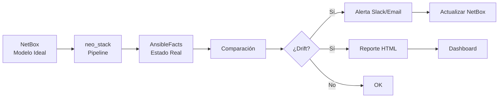

# Caso de Uso: Detección de Drift con neo_stack

> **"Nunca más te sorprendas con un servidor que 'cambió solo'."**

---

## 🎯 Objetivo

Detectar automáticamente cuando la infraestructura real difiere de lo que está definido en NetBox:
- ✅ **Comparación** NetBox (ideal) vs Estado real
- ✅ **Alertas** automáticas cuando detecta drift
- ✅ **Reportes** de compliance
- ✅ **Histórico** de cambios no autorizados

---

## 📊 Problema que Resuelve

| Escenario Sin Detección de Drift | Con Detección de Drift |
|---------------------------|-------------------|
| **Servidor con IP diferente** sin que nadie sepa | Detecta en **10 min** y alerta |
| **VLAN alterada** y causa problema de red | Genera **reporte** de alteración |
| **Configuración divergente** entre equipos | **Compara** automáticamente |
| **Hardware alterado** sin actualización en CMDB | **Audita** cambios en tiempo real |

---

## 🏗️ Arquitectura de la Solución



---

## 💻 Implementación Práctica

### 1. Script de Recolección de Facts (Ansible)

```yaml
# ansible/playbooks/facts-collection.yml
---
- name: Recolectar Facts para Detección de Drift
  hosts: all
  gather_facts: yes
  tasks:
    - name: Recolectar información de red
      ansible.builtin.setup:
        filter:
          - ansible_default_ipv4
          - ansible_*
          - ansible_distribution
          - ansible_kernel

    - name: Recolectar interfaces de red
      ansible.builtin.shell: |
        ip addr show | grep -E "^[0-9]+: " | awk '{print $2}'
      register: interfaces

    - name: Recolectar IPs configurados
      ansible.builtin.shell: |
        ip addr show | grep -E "inet " | awk '{print $2}'
      register: ip_addresses

    - name: Generar JSON de facts
      ansible.builtin.copy:
        content: |
          {
            "hostname": "{{ inventory_hostname }}",
            "interfaces": {{ interfaces.stdout | to_json }},
            "ip_addresses": {{ ip_addresses.stdout | to_json }},
            "ansible_facts": {{ ansible_facts | to_json }},
            "timestamp": "{{ ansible_date_time.iso8601 }}"
          }
        dest: "/tmp/facts/{{ inventory_hostname }}.json"
      delegate_to: localhost

    - name: Enviar a neo_stack
      ansible.builtin.uri:
        url: "http://neo-stack:3000/api/facts"
        method: POST
        body_format: json
        body:
          hostname: "{{ inventory_hostname }}"
          facts: "{{ ansible_facts }}"
        headers:
          Authorization: "Bearer {{ neo_stack_token }}"
```

---

### 2. Comparación en neo_stack

```python
# neo-stack/scripts/drift-detection.py
import pynetbox
import json
from pathlib import Path
import difflib
from datetime import datetime

class DriftDetector:
    def __init__(self, netbox_url, netbox_token):
        self.nb = pynetbox.api(netbox_url, token=netbox_token)
        self.facts_dir = Path('/tmp/facts')

    def collect_netbox_data(self, hostname):
        """Busca datos ideales de NetBox"""
        try:
            device = self.nb.dcim.devices.get(name=hostname)
            if not device:
                return None

            # Recolectar datos técnicos
            netbox_data = {
                'hostname': device.name,
                'serial': device.serial,
                'asset_tag': device.asset_tag,
                'site': device.site.name if device.site else None,
                'rack': device.rack.name if device.rack else None,
                'position': device.position,
                'interfaces': []
            }

            # Interfaces de NetBox
            for iface in device.interfaces.all():
                netbox_data['interfaces'].append({
                    'name': iface.name,
                    'mac_address': iface.mac_address,
                    'enabled': iface.enabled,
                    'description': iface.description
                })

            # IPs de NetBox
            netbox_data['ip_addresses'] = []
            for ip in self.nb.ipam.ip_addresses.filter(device_id=device.id):
                netbox_data['ip_addresses'].append({
                    'address': ip.address,
                    'interface': ip.interface.name if ip.interface else None,
                    'vlan': ip.vlan.name if ip.vlan else None
                })

            return netbox_data

        except Exception as e:
            print(f"Error al recolectar NetBox para {hostname}: {e}")
            return None

    def collect_real_data(self, hostname):
        """Busca estado real vía Ansible facts"""
        facts_file = self.facts_dir / f"{hostname}.json"
        if facts_file.exists():
            with open(facts_file) as f:
                return json.load(f)
        return None

    def detect_drifts(self, hostname):
        """Compara NetBox vs Estado Real"""
        netbox_data = self.collect_netbox_data(hostname)
        real_data = self.collect_real_data(hostname)

        if not netbox_data or not real_data:
            return {
                'hostname': hostname,
                'status': 'ERROR',
                'error': 'Datos insuficientes'
            }

        drifts = []

        # Verificar hostname
        if real_data['hostname'] != netbox_data['hostname']:
            drifts.append({
                'field': 'hostname',
                'netbox': netbox_data['hostname'],
                'real': real_data['hostname'],
                'severity': 'HIGH'
            })

        # Verificar interfaces (comparar listas)
        real_interfaces = [iface.split(':')[0] for iface in real_data['interfaces']]
        netbox_interfaces = [iface['name'] for iface in netbox_data['interfaces']]

        # Interfaces en exceso en el real
        for iface in real_interfaces:
            if iface not in netbox_interfaces and not iface.startswith('lo'):
                drifts.append({
                    'field': 'interfaces',
                    'message': f'Interfaz {iface} existe en real pero no en NetBox',
                    'severity': 'MEDIUM'
                })

        # IPs en exceso en el real
        real_ips = [ip.split('/')[0] for ip in real_data['ip_addresses']]
        netbox_ips = [ip['address'].split('/')[0] for ip in netbox_data['ip_addresses']]

        for ip in real_ips:
            if ip not in netbox_ips:
                drifts.append({
                    'field': 'ip_addresses',
                    'message': f'IP {ip} configurado pero no en NetBox',
                    'severity': 'CRITICAL'
                })

        # Verificar MAC addresses
        for netbox_iface in netbox_data['interfaces']:
            if netbox_iface['mac_address']:
                # Buscar interfaz con mismo nombre
                matching_real = next(
                    (i for i in real_interfaces if netbox_iface['name'] in i),
                    None
                )
                if matching_real:
                    # MAC debe coincidir (simplificado)
                    real_mac = real_data.get('ansible_facts', {}).get('ansible_eth0', {}).get('macaddress')
                    if real_mac != netbox_iface['mac_address']:
                        drifts.append({
                            'field': 'mac_address',
                            'interface': netbox_iface['name'],
                            'message': f"MAC {real_mac} difiere de NetBox {netbox_iface['mac_address']}",
                            'severity': 'HIGH'
                        })

        return {
            'hostname': hostname,
            'timestamp': datetime.now().isoformat(),
            'status': 'DRIFT' if drifts else 'COMPLIANT',
            'drifts': drifts,
            'drift_count': len(drifts)
        }

    def generate_report(self, drifts_report):
        """Genera reporte HTML"""
        html = f"""
        <!DOCTYPE html>
        <html>
        <head>
            <title>Reporte de Detección de Drift</title>
            <style>
                body {{ font-family: Arial; margin: 20px; }}
                .header {{ background: #333; color: white; padding: 20px; }}
                .summary {{ background: #f0f0f0; padding: 15px; margin: 20px 0; }}
                .drift {{ border-left: 4px solid #ff9800; padding: 10px; margin: 10px 0; }}
                .critical {{ border-color: #f44336; }}
                .high {{ border-color: #ff9800; }}
                .medium {{ border-color: #ffc107; }}
            </style>
        </head>
        <body>
            <div class="header">
                <h1>📊 Reporte de Detección de Drift</h1>
                <p>Generado en: {datetime.now().strftime('%d/%m/%Y %H:%M:%S')}</p>
            </div>
        """

        total_drifts = sum(r['drift_count'] for r in drifts_report)
        compliant_count = sum(1 for r in drifts_report if r['status'] == 'COMPLIANT')

        html += f"""
            <div class="summary">
                <h2>📈 Resumen</h2>
                <p><strong>Total de hosts:</strong> {len(drifts_report)}</p>
                <p><strong>En compliance:</strong> {compliant_count}</p>
                <p><strong>Con drift:</strong> {len(drifts_report) - compliant_count}</p>
                <p><strong>Total de drifts:</strong> {total_drifts}</p>
            </div>
        """

        for report in drifts_report:
            status_icon = "✅" if report['status'] == 'COMPLIANT' else "⚠️"
            status_color = "green" if report['status'] == 'COMPLIANT' else "orange"

            html += f"""
            <div style="margin: 20px 0; padding: 15px; border: 1px solid #ddd;">
                <h3>{status_icon} {report['hostname']} - Status: {report['status']}</h3>
            """

            if report['drifts']:
                for drift in report['drifts']:
                    severity = drift.get('severity', 'MEDIUM').lower()
                    html += f"""
                    <div class="drift {severity}">
                        <strong>{drift['field']}</strong>: {drift.get('message', drift.get('netbox', ''))}
                    </div>
                    """
            else:
                html += "<p style='color: green;'>✅ Host en compliance total</p>"

            html += "</div>"

        html += """
        </body>
        </html>
        """

        return html

# Uso
if __name__ == '__main__':
    detector = DriftDetector(
        netbox_url='http://netbox.company.com',
        netbox_token='TU_TOKEN'
    )

    # Detectar drift para todos los devices activos
    devices = detector.nb.dcim.devices.filter(status='active')
    reports = []

    for device in devices:
        print(f"Analizando {device.name}...")
        drift_report = detector.detect_drifts(device.name)
        reports.append(drift_report)

    # Generar reporte
    report_html = detector.generate_report(reports)
    with open('/var/www/drift-report.html', 'w') as f:
        f.write(report_html)

    print(f"Reporte generado: /var/www/drift-report.html")
```

---

### 3. Pipeline neo_stack (YAML)

```yaml
# neo-stack/pipelines/drift-detection.yml
name: Pipeline de Detección de Drift

triggers:
  - cron: "0 */6 * * *"  # Cada 6 horas
  - webhook: "netbox.device.updated"

stages:
  1: Recolección de Facts
    jobs:
      - name: "Ejecutar Ansible Facts"
        type: "ansible-playbook"
        config:
          playbook: "playbooks/facts-collection.yml"
          inventory: "inventory/production"
          timeout: 3600
        notifications:
          - slack: "#infra-alerts"

  2: Análisis de Drift
    jobs:
      - name: "Analizar Drifts"
        type: "python"
        script: "scripts/drift-detection.py"
        dependencies: ["1"]
        output:
          - file: "/var/www/drift-report.html"
          - json: "/tmp/drift-report.json"

  3: Acciones de Compliance
    jobs:
      - name: "Actualizar NetBox"
        type: "webhook"
        config:
          url: "http://netbox.company.com/api/dcim/devices/"
          method: "PATCH"
          payload: "{{ from_stage_2.needs_update }}"
        condition:
          - field: "drift_count"
            operator: "gt"
            value: 0

      - name: "Enviar Alerta"
        type: "notification"
        config:
          channels: ["slack", "email"]
          template: "drift-alert.j2"
        condition:
          - field: "drift_count"
            operator: "gt"
            value: 0
```

---

### 4. Template de Alerta (Slack/Email)

```jinja2
# templates/drift-alert.j2
🚨 **DRIFT DETECTADO**

Host: {{ hostname }}
Fecha: {{ timestamp }}


**Drifts encontrados ({{ drift_count }}):**


⚠️ **{{ drift.field }}** ({{ drift.severity }})
   {{ drift.message }}




Acciones:
- Ver reporte completo: {{ report_url }}
- Actualizar NetBox: {{ netbox_link }}

---
Pipeline: {{ pipeline_id }}
```

---

### 5. Docker Compose (neo_stack + NetBox)

```yaml
# docker-compose.yml (agregar al proyecto)
version: '3.8'
services:
  neo-stack:
    image: neoand/neo-stack:latest
    ports:
      - "3000:3000"
    environment:
      - NETBOX_URL=http://netbox:8080
      - NETBOX_TOKEN=${NETBOX_TOKEN}
      - NEO_STACK_DB_HOST=postgres
    volumes:
      - ./pipelines:/app/pipelines
      - ./scripts:/app/scripts
      - /tmp/facts:/tmp/facts
    depends_on:
      - postgres

  drift-scheduler:
    image: neoand/neo-stack:latest
    command: ["python", "scheduler.py", "drift-detection"]
    environment:
      - NEO_STACK_API=http://neo-stack:3000
    volumes:
      - /tmp/facts:/tmp/facts

  nginx:
    image: nginx:alpine
    ports:
      - "8080:80"
    volumes:
      - ./reports:/var/www
      - ./nginx.conf:/etc/nginx/nginx.conf
    depends_on:
      - neo-stack
```

---

## 📊 Métricas y ROI

### Métricas Recolectadas

```python
# neo-stack/metrics/drift-metrics.py
from prometheus_client import Counter, Histogram, Gauge

# Métricas Prometheus
drift_detections = Counter('drift_detections_total', 'Total de drifts detectados', ['severity'])
drift_resolution_time = Histogram('drift_resolution_seconds', 'Tiempo para resolver drift')
compliance_percentage = Gauge('compliance_percentage', 'Porcentaje de hosts en compliance')
devices_scanned = Counter('devices_scanned_total', 'Total de dispositivos escaneados')

# Ejemplo de uso
for report in drift_reports:
    devices_scanned.inc()
    compliance_pct = (report['compliant'] / report['total']) * 100
    compliance_percentage.set(compliance_pct)

    for drift in report['drifts']:
        drift_detections.labels(severity=drift['severity']).inc()
```

### ROI Calculado

```
Escenario: 500 servidores

Antes de la Detección de Drift:
- 2 drifts/semana no detectados
- 4h para encontrar cada drift
- Costo: $200 MXN/hora
- Pérdida por drift: $20,000 MXN (downtime)
- Costo total/mes: $160,000 MXN

Con Detección de Drift:
- 0 drifts no detectados
- 10 min para detectar
- Costo por drift: $500 MXN (investigación)
- Costo total/mes: $2,000 MXN

Ahorro mensual: $158,000 MXN
Ahorro anual: $1,896,000 MXN

Inversión (desarrollo): $80,000 MXN
ROI: 2,270% en el primer año
```

---

## 🔗 Próximos Pasos

👉 **[Pipelines de Provisionamiento](./provisionamento.md)** - Automatizar creación de infraestructura

👉 **[Integración NetBox + neo_stack](../integrations/netbox-neo_stack.md)** - Ver más integraciones

👉 **[Compliance Auditoría](./compliance.md)** - Políticas y gobernanza

---

## 📚 Recursos

- **[Ansible Facts](https://docs.ansible.com/ansible/latest/modules/setup_module.html)** - Módulo de recolección
- **[NetBox API](https://docs.netbox.dev/en/stable/api-guide/)** - Documentación REST/GraphQL
- **[Pipeline as Code](https://www.jenkins.io/doc/book/pipeline-as-code/)** - Concepto de pipelines
- **[Prometheus Metrics](https://prometheus.io/docs/concepts/metric_types/)** - Observabilidad

---

> **"La diferencia entre infraestructura buena e infraestructura excelente es que en la excelente detectas problemas antes de que ellos te detecten a ti."**