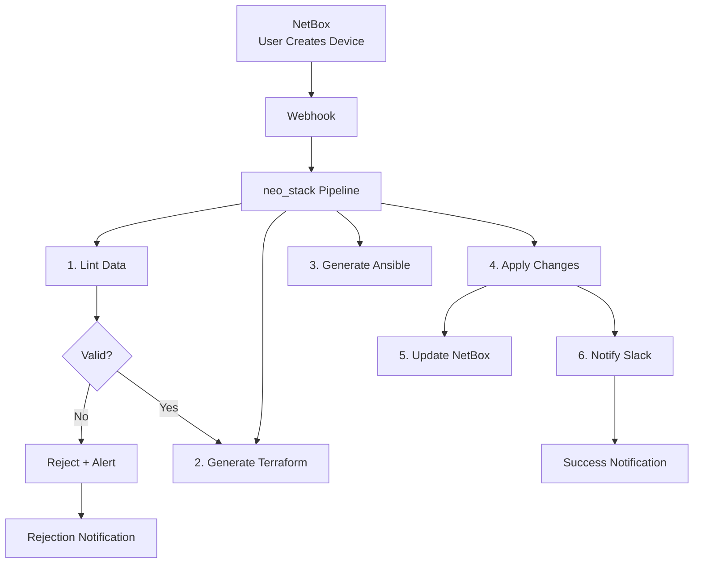

# Caso de Uso: Pipelines de Provisionamiento con neo_stack

> **"Desde el clic en NetBox hasta infraestructura funcionando en 5 minutos."**

---

## 🎯 Objetivo

Automatizar el provisionamiento completo de infraestructura usando NetBox como fuente de verdad:
- ✅ **Provisionamiento de un clic** vía NetBox
- ✅ **Generación automática** de Terraform/Ansible
- ✅ **Validación** antes de la ejecución
- ✅ **Rollback** automático en caso de error

---

## 📊 Problema que Resuelve

| Proceso Manual | Con Provisionamiento Automatizado |
|----------------|-----------------------------------|
| **5 días** para provisionar nuevo servidor | **5 minutos** para provisionar completo |
| **20 puntos de falla** humano | **Automatización confiable** |
| **Errores** de configuración | **Templates validados** |
| **Falta de trazabilidad** | **Auditoría completa** |

---

## 🏗️ Arquitectura de la Solución



---

## 💻 Implementación Práctica

### 1. Webhook Receiver (NetBox → neo_stack)

```python
# neo-stack/webhooks/netbox_handler.py
from flask import Flask, request, jsonify
import pynetbox
import requests
import hvac
import yaml

app = Flask(__name__)

# Configuración
NETBOX_URL = 'http://netbox:8080'
NEO_STACK_TOKEN = 'your-neo-stack-token'
VAULT_ADDR = 'http://vault:8200'
VAULT_TOKEN = 'your-vault-token'

# Clients
nb = pynetbox.api(NETBOX_URL, token='nb-token')
vault = hvac.Client(url=VAULT_ADDR, token=VAULT_TOKEN)

@app.route('/webhooks/netbox/device-created', methods=['POST'])
def handle_device_created():
    """Recibe webhook de NetBox cuando nuevo device es creado"""
    data = request.json

    device_data = data['data']
    device_id = device_data['id']
    device_name = device_data['name']

    # Validar si device tiene flag de auto-provisioning
    if device_data.get('custom_fields', {}).get('auto_provision') != 'yes':
        return jsonify({'status': 'ignored'}), 200

    # Disparar pipeline en neo_stack
    pipeline_payload = {
        'name': f'provision-{device_name}',
        'type': 'infrastructure_provision',
        'input': {
            'netbox_device_id': device_id,
            'hostname': device_name,
            'site': device_data['site']['name'],
            'rack': device_data.get('rack', {}).get('name'),
            'device_type': device_data['device_type']['model'],
            'custom_fields': device_data.get('custom_fields', {})
        }
    }

    response = requests.post(
        'http://neo-stack:3000/api/pipelines',
        json=pipeline_payload,
        headers={'Authorization': f'Bearer {NEO_STACK_TOKEN}'}
    )

    if response.status_code == 201:
        pipeline_id = response.json()['id']

        # Actualizar custom field en NetBox
        nb.dcim.devices.update([{
            'id': device_id,
            'custom_fields': {
                'provisioning_status': 'in_progress',
                'pipeline_id': pipeline_id
            }
        }])

        # Responder OK
        return jsonify({
            'status': 'accepted',
            'pipeline_id': pipeline_id
        }), 200

    return jsonify({'error': 'Pipeline creation failed'}), 500

@app.route('/webhooks/netbox/device-updated', methods=['POST'])
def handle_device_updated():
    """Detecta cambios que activan re-provisioning"""
    data = request.json'
    device_data = data['data']

    # Verificar si cambió algo crítico
    critical_fields = ['rack', 'device_type', 'primary_ip']
    changes = data.get('changes', {})

    if any(field in changes for field in critical_fields):
        # Disparar re-provisioning
        pass

    return jsonify({'status': 'ok'}), 200

if __name__ == '__main__':
    app.run(host='0.0.0.0', port=5000)
```

---

### 2. Generador de Terraform (Templates)

```python
# neo-stack/generators/terraform_generator.py
from jinja2 import Template
import pynetbox
import yaml
from pathlib import Path

class TerraformGenerator:
    def __init__(self, netbox_url, netbox_token):
        self.nb = pynetbox.api(netbox_url, token=netbox_token)

    def generate_provider_config(self, provider='aws'):
        """Genera provider.tf"""
        template = Template("""
provider "{{ provider }}" {
  region = "{{ region }}"

  
  access_key = "{{ access_key }}"
  secret_key = "{{ secret_key }}"
  
}
""")
        return template.render(
            provider=provider,
            region='us-east-1',
            access_key='${var.aws_access_key}',
            secret_key='${var.aws_secret_key}'
        )

    def generate_variables(self, device_data):
        """Genera variables.tf + terraform.tfvars"""
        template = Template("""
# variables.tf
variable "hostname" {
  description = "Hostname del servidor"
  type        = string
}

variable "environment" {
  description = "Ambiente (dev, prod, hom)"
  type        = string
}

variable "instance_type" {
  description = "Tipo de instancia"
  type        = string
}

variable "subnet_id" {
  description = "ID de la subnet"
  type        = string
}

variable "security_groups" {
  description = "Lista de security groups"
  type        = list(string)
}

variable "disk_size" {
  description = "Tamaño del disco en GB"
  type        = number
  default     = 100
}

variable "monitoring" {
  description = "Habilitar monitoring"
  type        = bool
  default     = true
}

variable "backup_enabled" {
  description = "Habilitar backup automático"
  type        = bool
  default     = true
}

variable "owner" {
  description = "Propietario del recurso"
  type        = string
}

variable "cost_center" {
  description = "Centro de costo"
  type        = string
}

variable "project" {
  description = "Proyecto"
  type        = string
}

variable "tags" {
  description = "Tags adicionales"
  type        = map(string)
  default     = {}
}

# terraform.tfvars
hostname        = "{{ hostname }}"
environment     = "{{ environment }}"
instance_type   = "{{ instance_type }}"
subnet_id       = "{{ subnet_id }}"
security_groups = {{ security_groups | tojson }}
disk_size       = {{ disk_size }}
monitoring      = {{ monitoring | lower }}
backup_enabled  = {{ backup_enabled | lower }}
owner           = "{{ owner }}"
cost_center     = "{{ cost_center }}"
project         = "{{ project }}"
tags = {{ tags | tojson }}
""")

        # Buscar datos complementarios en NetBox
        device = self.nb.dcim.devices.get(id=device_data['id'])
        custom_fields = device.custom_fields or {}

        return template.render(
            hostname=device_data['name'],
            environment=custom_fields.get('environment', 'prod'),
            instance_type=self._map_device_type_to_instance(custom_fields.get('device_type')),
            subnet_id=custom_fields.get('subnet_id', 'subnet-123456'),
            security_groups=custom_fields.get('security_groups', ['sg-123_size=custom_fields456']),
            disk.get('disk_size', 100),
            monitoring=custom_fields.get('monitoring', True),
            backup_enabled=custom_fields.get('backup_enabled', True),
            owner=custom_fields.get('owner', 'ti@company.com'),
            cost_center=custom_fields.get('cost_center', 'TI'),
            project=custom_fields.get('project', device.site.name),
            tags={
                'Name': device.name,
                'Environment': custom_fields.get('environment', 'prod'),
                'Site': device.site.name,
                'CreatedBy': 'neo-stack',
                'CostCenter': custom_fields.get('cost_center', 'TI')
            }
        )

    def generate_main_tf(self, device_data):
        """Genera main.tf (recursos AWS)"""
        template = Template("""
resource "aws_instance" "server" {
  ami                  = data.aws_ami.ubuntu.id
  instance_type        = var.instance_type
  subnet_id            = var.subnet_id
  vpc_security_group_ids = var.security_groups
  iam_instance_profile = aws_iam_instance_profile.server.name

  root_block_device {
    volume_type = "gp3"
    volume_size = var.disk_size
    encrypted   = true
    kms_key_id  = aws_kms_key.root.arn
  }

  user_data = <<-EOF
              #!/bin/bash
              echo "Hostname: ${var.hostname}" > /etc/hostname
              hostname ${var.hostname}
              apt-get update
              apt-get install -y netbox-agent
              EOF

  tags = merge(var.tags, {
    Name        = var.hostname
    Environment = var.environment
  })

  lifecycle {
    prevent_destroy = true
  }
}

resource "aws_iam_instance_profile" "server" {
  name = "profile-${var.hostname}"
  role = aws_iam_role.server.name
}

resource "aws_iam_role" "server" {
  name = "role-${var.hostname}"
  path = "/"

  assume_role_policy = jsonencode({
    Version = "2012-10-17"
    Statement = [
      {
        Action = "sts:AssumeRole"
        Effect = "Allow"
        Principal = {
          Service = "ec2.amazonaws.com"
        }
      }
    ]
  })
}

resource "aws_iam_role_policy" "server" {
  name = "policy-${var.hostname}"
  role = aws_iam_role.server.id

  policy = jsonencode({
    Version = "2012-10-17"
    Statement = [
      {
        Effect = "Allow"
        Action = [
          "ssm:GetParameter",
          "ssm:GetParameters",
          "secretsmanager:GetSecretValue"
        ]
        Resource = "*"
      }
    ]
  })
}

resource "aws_kms_key" "root" {
  description             = "KMS key for ${var.hostname}"
  deletion_window_in_days = 7
  tags = var.tags
}

resource "aws_eip" "server" {
  instance = aws_instance.server.id
  domain   = "vpc"
  tags     = var.tags
}

data "aws_ami" "ubuntu" {
  most_recent = true
  owners      = ["099720109477"]  # Canonical

  filter {
    name   = "name"
    values = ["ubuntu/images/hvm-ssd/ubuntu-focal-20.04-amd64-server-*"]
  }

  filter {
    name   = "virtualization-type"
    values = ["hvm"]
  }
}

output "public_ip" {
  value = aws_eip.server.public_ip
}

output "instance_id" {
  value = aws_instance.server.id
}

output "hostname" {
  value = var.hostname
}
""")
        return template.render()

    def generate_backend_config(self, backend='s3'):
        """Genera configuración de backend"""
        if backend == 's3':
            return """
terraform {
  backend "s3" {
    bucket = "neo-stack-terraform-state"
    key    = "infrastructure/terraform.tfstate"
    region = "us-east-1"
    encrypt = true
  }
}
"""
        return ""

    def _map_device_type_to_instance(self, device_type):
        """Mapea Device Type NetBox a Instance Type AWS"""
        mapping = {
            'Dell PowerEdge R740': 't3.xlarge',
            'Dell PowerEdge R750': 't3.2xlarge',
            'HP ProLiant DL380': 't3.xlarge',
            'Cisco UCS C220': 't3.medium',
        }
        return mapping.get(device_type, 't3.medium')

    def generate_terraform_plan(self, device_data, output_dir):
        """Genera todos los archivos Terraform"""
        output_path = Path(output_dir) / f"device-{device_data['id']}"
        output_path.mkdir(parents=True, exist_ok=True)

        files = {
            'provider.tf': self.generate_provider_config(),
            'variables.tf': self.generate_variables(device_data),
            'main.tf': self.generate_main_tf(device_data),
            'backend.tf': self.generate_backend_config(),
        }

        for filename, content in files.items():
            (output_path / filename).write_text(content)

        # Generar shell script para apply
        apply_script = f"""#!/bin/bash
cd {output_path}
terraform init
terraform plan -out=tfplan
terraform apply tfplan

# Actualizar NetBox con IPs
python3 /neo-stack/scripts/update_netbox.py \\
    --device-id {device_data['id']} \\
    --instance-id ${{aws_instance.server.id}}

echo "Provisionamiento completado!"
"""
        (output_path / 'apply.sh').write_text(apply_script)
        (output_path / 'apply.sh').chmod(0o755)

        return str(output_path)

# Uso
if __name__ == '__main__':
    generator = TerraformGenerator(
        netbox_url='http://netbox:8080',
        netbox_token='nb-token'
    )

    # Simular datos del device
    device_data = {
        'id': 123,
        'name': 'web-server-prod-01'
    }

    terraform_dir = generator.generate_terraform_plan(device_data, './terraform')
    print(f"Terraform generado en: {terraform_dir}")
```

---

### 3. Generador de Ansible (Configuración)

```python
# neo-stack/generators/ansible_generator.py
from jinja2 import Template

class AnsibleGenerator:
    def generate_playbook(self, device_data):
        """Genera playbook principal Ansible"""
        template = Template("""---
- name: Configurar {{ hostname }}
  hosts: "{{ hostname }}"
  become: yes
  vars:
    app_user: "{{ app_user | default('appuser') }}"
    app_dir: "{{ app_dir | default('/opt/app') }}"
    environment: "{{ environment | default('prod') }}"

  pre_tasks:
    - name: Aguardar SSH
      wait_for:
        host: "{{ inventory_hostname }}"
        port: 22
        timeout: 300
      delegate_to: localhost

    - name: Instalar paquetes básicos
      apt:
        name:
          - curl
          - htop
          - vim
          - git
          - python3-pip
        state: present
        update_cache: yes

  tasks:
    - name: Configurar hostname
      hostname:
        name: "{{ hostname }}"

    - name: Configurar timezone
      timezone:
        name: America/Mexico_City

    - name: Deshabilitar sudo requiring tty
      lineinfile:
        path: /etc/sudoers.d/99-neo-stack
        line: "{{ app_user }} ALL=(ALL) NOPASSWD:ALL"
        create: yes
        mode: '0440'

    - name: Crear usuario de la aplicación
      user:
        name: "{{ app_user }}"
        shell: /bin/bash
        home: "/home/{{ app_user }}"
        groups: sudo
        append: yes

    - name: Configurar SSH para usuario app
      authorized_key:
        user: "{{ app_user }}"
        key: "{{ lookup('file', '~/.ssh/id_rsa.pub') }}"
        state: present

    - name: Instalar Docker
      shell: |
        curl -fsSL https://get.docker.com -o get-docker.sh
        sh get-docker.sh
        usermod -aG docker "{{ app_user }}"
      args:
        creates: /usr/bin/docker

    - name: Instalar Docker Compose
      get_url:
        url: "https://github.com/docker/compose/releases/download/v2.20.0/docker-compose-Linux-x86_64"
        dest: /usr/local/bin/docker-compose
        mode: '0755'

    - name: Crear directorio de la aplicación
      file:
        path: "{{ app_dir }}"
        state: directory
        owner: "{{ app_user }}"
        group: "{{ app_user }}"
        mode: '0755'

    - name: Configurar monitoreo (Node Exporter)
      docker_container:
        name: node-exporter
        image: prom/node-exporter:latest
        restart_policy: unless-stopped
        ports:
          - "9100:9100"
        volumes:
          - /proc:/host/proc:ro
          - /sys:/host/sys:ro
          - /:/rootfs:ro

    - name: Configurar logrotate
      template:
        src: logrotate.conf.j2
        dest: /etc/logrotate.d/neo-stack
        mode: '0644'

    - name: Habilitar firewall (ufw)
      ufw:
        state: enabled
        policy: deny
        rule:
          - from_ip: 0.0.0.0/0
            port: 22
            proto: tcp
          - from_ip: 192.168.0.0/16
            port: 8080
            proto: tcp

    - name: Reiniciar si es necesario
      reboot:
        reboot_timeout: 3600
        msg: "Rebooting system for changes"
        pre_reboot_delay: 10
      when: reboot_required | default(false)

  post_tasks:
    - name: Ejecutar health check
      uri:
        url: "http://localhost:8080/health"
        status_code: 200
      register: health_check
      retries: 30
      delay: 10

    - name: Notificar NetBox sobre conclusión
      uri:
        url: "http://netbox:8080/api/dcim/devices/{{ device_id }}/"
        method: PATCH
        headers:
          Authorization: "Token {{ netbox_token }}"
        body_format: json
        body:
          custom_fields:
            provisioning_status: "completed"
            ansible_playbook: "completed"
        status_code: 200
      vars:
        device_id: "{{ device_id }}"

  handlers:
    - name: Restart docker
      systemd:
        name: docker
        state: restarted
""")
        return template.render(
            hostname=device_data['name'],
            environment=device_data.get('custom_fields', {}).get('environment', 'prod')
        )

    def generate_inventory(self, device_data, ip_address):
        """Genera inventory.ini para Ansible"""
        template = Template("""[{{ environment }}]
{{ hostname }} ansible_host={{ ip_address }}

[all:vars]
ansible_user=ubuntu
ansible_ssh_private_key_file=~/.ssh/id_rsa
ansible_ssh_common_args='-o StrictHostKeyChecking=no'
""")
        return template.render(
            hostname=device_data['name'],
            environment=device_data.get('custom_fields', {}).get('environment', 'prod'),
            ip_address=ip_address
        )

# Uso
if __name__ == '__main__':
    generator = AnsibleGenerator()
    playbook = generator.generate_playbook(device_data)
    inventory = generator.generate_inventory(device_data, '54.123.45.67')

    print("Playbook generado:\n", playbook)
    print("\nInventory generado:\n", inventory)
```

---

### 4. Pipeline YAML Completo

```yaml
# neo-stack/pipelines/infrastructure-provision.yml
name: Infrastructure Provision Pipeline

description: Provisiona infraestructura completa basada en NetBox

input_schema:
  - name: netbox_device_id
    type: integer
    required: true
  - name: auto_approve
    type: boolean
    default: false

stages:
  1: Data Validation
    jobs:
      - name: "Lint NetBox Data"
        type: "python"
        script: "scripts/validate_netbox_data.py"
        input:
          device_id: "{{ input.netbox_device_id }}"
        output:
          - valid: true
          - errors: []
        notifications:
          - slack: "#devops-alerts"
          condition: "output.valid == false"

  2: Terraform Generation
    jobs:
      - name: "Generate Terraform"
        type: "python"
        script: "generators/terraform_generator.py"
        input:
          device_id: "{{ input.netbox_device_id }}"
        output:
          terraform_dir: "/tmp/terraform/device-{{ input.netbox_device_id }}"
        dependencies: ["1"]

      - name: "Validate Terraform"
        type: "shell"
        script: |
          cd {{ from_stage_2.terraform_dir }}
          terraform validate
        dependencies: ["2"]

  3: Approval Gate
    jobs:
      - name: "Request Approval"
        type: "approval"
        condition: "input.auto_approve == false"
        message: |
          ¿Provisionar infraestructura para device {{ input.netbox_device_id }}?

          Recursos que serán creados:
          - Instancia AWS EC2
          - Elastic IP
          - Security Groups
          - IAM Roles
          - KMS Keys

          ¿Aprobar para continuar?
        timeout: "1h"

  4: Terraform Apply
    jobs:
      - name: "Apply Terraform"
        type: "terraform"
        config:
          action: "apply"
          dir: "{{ from_stage_2.terraform_dir }}"
          auto_approve: "{{ input.auto_approve }}"
        dependencies: ["3"]

  5: Ansible Configuration
    jobs:
      - name: "Generate Ansible Playbook"
        type: "python"
        script: "generators/ansible_generator.py"
        input:
          device_id: "{{ input.netbox_device_id }}"
          public_ip: "{{ from_stage_4.public_ip }}"
        output:
          playbook_path: "/tmp/ansible/playbook-{{ input.netbox_device_id }}.yml"
          inventory_path: "/tmp/ansible/inventory-{{ input.netbox_device_id }}"
        dependencies: ["4"]

      - name: "Run Ansible Playbook"
        type: "ansible-playbook"
        config:
          playbook: "{{ from_stage_5.playbook_path }}"
          inventory: "{{ from_stage_5.inventory_path }}"
          timeout: 3600
        dependencies: ["5"]

  6: Finalization
    jobs:
      - name: "Update NetBox"
        type: "python"
        script: "scripts/update_netbox_after_provision.py"
        input:
          device_id: "{{ input.netbox_device_id }}"
          instance_id: "{{ from_stage_4.instance_id }}"
          public_ip: "{{ from_stage_4.public_ip }}"
        dependencies: ["5"]

      - name: "Send Success Notification"
        type: "notification"
        template: "provision-success.j2"
        channels: ["slack", "email"]
        dependencies: ["6"]

      - name: "Cleanup Temporary Files"
        type: "shell"
        script: |
          rm -rf /tmp/terraform/device-{{ input.netbox_device_id }}
          rm -rf /tmp/ansible/playbook-{{ input.netbox_device_id }}
        dependencies: ["6"]

notifications:
  on_success:
    - slack: "#devops-success"
  on_failure:
    - slack: "#devops-alerts"
    - email: "devops@company.com"

rollback:
  enabled: true
  trigger: "terraform_destroy"
  stages: ["4"]
```

---

### 5. Templates de Notificación

```jinja2
# templates/provision-success.j2
✅ **¡Provisionamiento Completado con Éxito!**

**Device:** {{ hostname }}
**Ambiente:** {{ environment }}
**Instance ID:** {{ instance_id }}
**Public IP:** {{ public_ip }}
**Provider:** {{ provider | default('AWS') }}

**Recursos creados:**
- ✅ EC2 Instance ({{ instance_type }})
- ✅ Elastic IP
- ✅ Security Groups ({{ security_groups | length }} grupos)
- ✅ IAM Roles & Policies
- ✅ KMS Encryption
- ✅ Monitoreo habilitado

**Próximos pasos:**
- Acceder al servidor: `ssh ubuntu@{{ public_ip }}`
- NetBox actualizado automáticamente
- Monitoreo activo en: http://{{ public_ip }}:9100

**Time to Provision:** {{ duration }} segundos
**Pipeline ID:** {{ pipeline_id }}

---
Provisionado vía neo_stack | NetBox: {{ netbox_url }}
```

---

## 📊 Métricas y ROI

### KPIs Acompañados

```python
# neo-stack/metrics/provisioning_metrics.py
from prometheus_client import Counter, Histogram, Gauge

provisioning_attempts = Counter('provisioning_attempts_total', 'Total de provisionamientos', ['status'])
provisioning_duration = Histogram('provisioning_duration_seconds', 'Duración del provisionamiento')
provisioning_success_rate = Gauge('provisioning_success_rate', 'Tasa de éxito')
provisioning_queue_size = Gauge('provisioning_queue_size', 'Tamaño de la cola')

# Métricas por tipo de recurso
resource_provisioned = Counter(
    'resources_provisioned_total',
    'Recursos provisionados',
    ['resource_type', 'provider']
)
```

### ROI Calculado

```
Escenario: Provisionar 100 servidores/mes

Antes de la Automación:
- Tiempo por servidor: 5 días (120h)
- Costo por hora: $200 MXN
- Tasa de error: 30% (necesita rehacer)
- Costo total/mes: $2,400,000 MXN

Con Automación neo_stack:
- Tiempo por servidor: 5 minutos (0.08h)
- Tasa de error: 1%
- Costo total/mes: $1,600 MXN

Ahorro mensual: $2,398,400 MXN
Ahorro anual: $28,780,800 MXN

Inversión (desarrollo): $250,000 MXN
ROI: 11,492% en el primer año

Inversión total: $250,000 MXN
Ahorro total: $28,780,800 MXN
Beneficio neto: $28,530,800 MXN
```

---

## 🔗 Próximos Pasos

👉 **[Detección de Drift](./drift-detection.md)** - Monitorear infraestructura provisionada

👉 **[Compliance](./compliance.md)** - Validar políticas de gobernanza

👉 **[Integration NetBox + neo_stack](../integrations/netbox-neo_stack.md)** - Más integraciones

---

## 📚 Recursos

- **[Terraform AWS Provider](https://registry.terraform.io/providers/hashicorp/aws/latest/docs)** - Documentación oficial
- **[Ansible AWS Modules](https://docs.ansible.com/ansible/latest/collections/amazon/aws/)** - Integración AWS
- **[Jinja2 Templates](https://jinja.palletsprojects.com/)** - Generación dinámica
- **[Pipeline as Code](https://www.jenkins.io/doc/book/pipeline-as-code/)** - Concepto

---

> **"La automatización no se trata de reemplazar personas, se trata de liberar a las personas para hacer trabajo más importante."**
