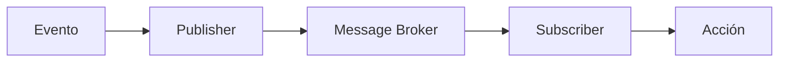
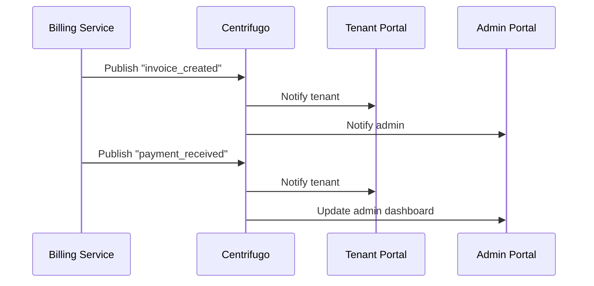
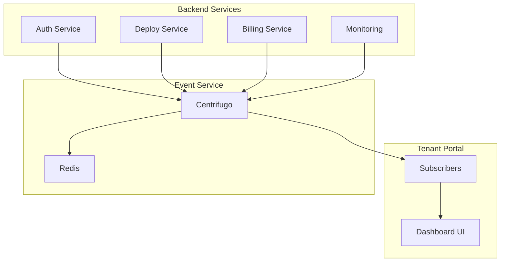

# 🎓 GUÍA EDUCATIVA - CENTRIFUGO
**NEO_STACK Platform v3.0 - Arquitectura Event-Driven en Tiempo Real**

---

## 📋 ÍNDICE

1. [Introducción](#introducción)
2. [¿Qué es Centrifugo?](#qué-es-centrifugo)
3. [¿Por qué usar WebSockets?](#por-qué-usar-websockets)
4. [Arquitectura Event-Driven](#arquitectura-event-driven)
5. [Conceptos Fundamentales](#conceptos-fundamentales)
6. [Pub/Sub Explicado](#pubsub-explicado)
7. [Eventos Multi-tenant](#eventos-multi-tenant)
8. [Casos de Uso Reales](#casos-de-uso-reales)
9. [Implementación en NEO_STACK](#implementación-en-neo-stack)
10. [Ejemplos Prácticos](#ejemplos-prácticos)
11. [Buenas Prácticas](#buenas-prácticas)
12. [Solución de Problemas](#solución-de-problemas)

---

## 🎯 INTRODUCCIÓN

Bienvenido a la **Guía Educativa de Centrifugo** para el **NEO_STACK Platform v3.0**!

Esta guía fue creada para desarrolladores principiantes que quieren entender **por qué y cómo** implementar un sistema de eventos en tiempo real en una plataforma SaaS moderna.

### Objetivos de esta Guía
- ✅ Entender el **concepto** de arquitectura event-driven
- ✅ Aprender **Pub/Sub** de forma práctica
- ✅ Comprender **WebSockets** y tiempo real
- ✅ Implementar **eventos multi-tenant**
- ✅ Aplicar en casos **reales de negocio**

### Prerrequisitos
- Conocimiento básico de JavaScript/TypeScript
- Familiaridad con APIs REST
- Conceptos básicos de Docker
- **Curiosidad** para aprender! 🚀

---

## 🤔 ¿QUÉ ES CENTRIFUGO?

### Definición Simple
**Centrifugo** es un servidor de **mensajes en tiempo real** que permite que aplicaciones web envíen y reciban **actualizaciones instantáneas** sin necesidad de recargar la página.

### Analogía del Mundo Real
Imagina que estás en un **estadio de fútbol**:
- ⚽ **Partido** = Aplicación (eventos ocurriendo)
- 📢 **Sistema de sonido** = Centrifugo (difundiendo las jugadas)
- 👥 **Aficionados** = Usuarios (recibiendo la información)
- 📻 **Radio** = Navegador (medio de comunicación)

Cuando se marca un gol:
1. ✅ El árbitro detecta el evento
2. 📢 El sistema de sonido **publica** la información
3. 👥 Todos los aficionados **reciben** instantáneamente
4. ⚽ El partido continúa

**¡Lo mismo pasa con Centrifugo!**

### Características Principales

| Característica | Descripción | Beneficio |
|----------------|-------------|-----------|
| **Tiempo real** | Mensajes en < 50ms | UX instantánea |
| **Escalable** | 10k+ conexiones simultáneas | Soporta muchos usuarios |
| **Multi-tenant** | Aislamiento por cliente | Seguridad y privacidad |
| **WebSockets** | Conexión persistente | Eficiente y rápido |
| **Redis-backed** | Persistencia confiable | No pierde mensajes |

---

## 🌐 ¿POR QUÉ USAR WEBSOCKETS?

### El Problema: Polling
**Antes** (método antiguo):
```typescript
// ❌ Polling cada 5 segundos
setInterval(async () => {
  const response = await fetch('/api/notifications')
  const notifications = await response.json()
  updateUI(notifications)
}, 5000)
```

**Problemas del Polling**:
- ❌ Desperdicio de ancho de banda (requests innecesarias)
- ❌ Latencia alta (hasta 5 segundos de delay)
- ❌ Servidor sobrecargado (muchas requests)
- ❌ Batería del móvil se agota (mobile)

### La Solución: WebSockets
**Ahora** (método moderno):
```typescript
// ✅ Conexión persistente
const ws = new WebSocket('wss://events.neo-stack.com')

ws.onmessage = (event) => {
  const notification = JSON.parse(event.data)
  showNotification(notification)
}
```

**Ventajas de WebSockets**:
- ✅ **Latencia cero** (mensajes instantáneos)
- ✅ **Eficiente** (una conexión, muchas mensajes)
- ✅ **Bidireccional** (cliente y servidor envían)
- ✅ **Ahorro de batería** (mobile-friendly)

### Comparación Práctica

| Aspecto | Polling | WebSockets |
|---------|---------|------------|
| **Latencia** | 1-30s | < 50ms |
| **Requests/Hora** | 720 | 1 (conexión) |
| **Ancho de banda** | Alto | Bajo |
| **Batería** | Mucha | Poca |
| **Complejidad** | Simple | Moderada |

---

## 🏗️ ARQUITECTURA EVENT-DRIVEN

### ¿Qué es Event-Driven?

**Event-Driven Architecture** (EDA) es un patrón donde el sistema reacciona a **eventos** en lugar de hacer **requests síncronas**.

### Ejemplo del Mundo Real: **Restaurante**

**Modelo Tradicional** (Request-Response):
1. 👤 Cliente hace pedido
2. 👨‍🍳 Cocina recibe
3. ⏳ Cliente espera
4. 👨‍🍳 Cocina prepara
5. 👤 Cliente recibe

**Modelo Event-Driven** (Asíncrono):
1. 👤 Cliente hace pedido (evento: `order_created`)
2. 👨‍🍳 Cocina recibe notificación (subscribe)
3. 👨‍🍳 Prepara (evento: `cooking_started`)
4. 👤 Cliente recibe notificación (¡tiempo real!)
5. 👨‍🍳 Finaliza (evento: `order_ready`)
6. 👤 Cliente recibe notificación (¡tiempo real!)

### Componentes del EDA



1. **Evento**: Algo que pasó (ej: usuario logueó)
2. **Publisher**: Quién crea el evento (ej: Auth Service)
3. **Message Broker**: Centrifugo (distribuye el mensaje)
4. **Subscriber**: Quién recibe (ej: Dashboard)
5. **Acción**: Qué hacer con la información (ej: actualizar UI)

---

## 🧠 CONCEPTOS FUNDAMENTALES

### 1. **Canal (Channel)**
Es como una **estación de radio** - todos sintonizan la misma frecuencia.

```typescript
// Canales del NEO_STACK
"tenant:12345:dashboard"      // Dashboard del tenant 12345
"admin:platform:alerts"       // Alertas de la plataforma
"tenant:67890:deployments"    // Deploys del tenant 67890
"system:health"               // Salud del sistema
```

### 2. **Publicación (Publish)**
Enviar un mensaje a un canal.

```typescript
// Ejemplo: Publicar evento de deploy
publisher.publish("tenant:12345:deployments", {
  type: "deployment_update",
  status: "completed",
  message: "¡Deploy finalizado con éxito!"
})
```

### 3. **Suscripción (Subscribe)**
Recibir mensajes de un canal.

```typescript
// Ejemplo: Suscribirse al dashboard
const unsubscribe = subscribe("tenant:12345:dashboard", (event) => {
  console.log("Evento recibido:", event)
  updateDashboard(event.data)
})
```

### 4. **Conexión (Connection)**
Enlace entre el navegador y el servidor WebSocket.

```typescript
// Establecer conexión
const ws = new WebSocket("wss://events.neo-stack.com")

ws.onopen = () => {
  console.log("¡Conectado a Centrifugo!")
}

ws.onmessage = (event) => {
  const data = JSON.parse(event.data)
  handleEvent(data)
}
```

---

## 📡 PUBSUB EXPLICADO

### ¿Qué es Pub/Sub?

**Pub/Sub** = **Publish/Subscribe** (Publicar/Suscribirse)

Es un patrón de comunicación donde:
- **Publishers** envían mensajes
- **Subscribers** reciben mensajes
- **No se conocen** directamente
- **Desacoplados** (independientes)

### Analogía: **Periódico**

1. **Periodista** (Publisher) escribe artículo
2. **Periódico** (Broker) distribuye
3. **Suscriptores** (Subscribers) reciben en casa
4. **Cada suscriptor** puede elegir qué secciones leer

### Ejemplo Práctico: Notificaciones

```typescript
// 1. Auth Service PUBLICA evento
const authPublisher = new AuthPublisher()
authPublisher.publish("tenant:12345:user_login", {
  userId: "user_789",
  timestamp: "2025-12-06T10:30:00Z",
  ip: "192.168.1.100"
})

// 2. Admin Dashboard SUBSCRIBE
subscribe("tenant:*:user_login", (event) => {
  if (event.userId === "user_789") {
    showNotification(`Usuario logueó: ${event.userId}`)
  }
})

// 3. Tenant Portal SUBSCRIBE
subscribe("tenant:12345:user_login", (event) => {
  updateActiveUsers(event.timestamp)
})
```

### Ventajas del Pub/Sub

| Ventaja | Descripción | Ejemplo |
|---------|-------------|---------|
| **Desacoplamiento** | Publishers no conocen subscribers | Auth service no sabe quién quiere login events |
| **Escalabilidad** | Un evento, muchos receptores | 1 deploy event → 100 usuarios notificados |
| **Flexibilidad** | Agregar subscribers sin cambiar publishers | ¿Nuevo dashboard? ¡Solo suscríbase! |
| **Confiabilidad** | Redis garantiza entrega | Mensajes no se pierden |

---

## 🏢 EVENTOS MULTI-TENANT

### El Desafío

En una plataforma SaaS **multi-tenant**, cada cliente necesita:
- ✅ Ver solo **sus propios eventos**
- ✅ Estar **aislado** de otros tenants
- ✅ Tener **permisos** adecuados
- ✅ **No filtrar** información

### Solución: Tenant Isolation

```typescript
// Formato de canal: tenant:{tenant_id}:{resource}

"tenant:12345:dashboard"      // ✅ Tenant 12345
"tenant:12345:billing"        // ✅ Tenant 12345
"tenant:67890:dashboard"      // ✅ Tenant 67890
"admin:platform:events"       // ✅ Admin (todos los tenants)

// ❌ CANAL INVÁLIDO
"dashboard"                   // ❌ Sin tenant ID
"tenant:12345:other_tenant"   // ❌ Cross-tenant
```

### Autenticación y Autorización

```typescript
// 1. Token JWT con info de tenant
const token = jwt.sign({
  userId: "user_789",
  tenantId: "12345",
  role: "tenant_admin"
}, SECRET)

// 2. Centrifugo valida token
const validateToken = (token) => {
  const decoded = jwt.verify(token, SECRET)
  return {
    userId: decoded.userId,
    tenantId: decoded.tenantId,
    role: decoded.role
  }
}

// 3. RBAC - Control de acceso basado en roles
const canSubscribe = (channel, user) => {
  // Admin puede todo
  if (user.role === "admin") return true

  // Usuario solo accede a canales de su tenant
  return channel.startsWith(`tenant:${user.tenantId}:`)
}
```

### Ejemplo: Tenant Isolation

```typescript
// Tenant A (12345) se suscribe
subscribe("tenant:12345:notifications", (event) => {
  // ✅ Recibe solo eventos del Tenant A
  showNotification(event.message)
})

// Tenant B (67890) se suscribe
subscribe("tenant:67890:notifications", (event) => {
  // ✅ Recibe solo eventos del Tenant B
  showNotification(event.message)
})

// Publicar para Tenant A
publish("tenant:12345:notifications", {
  type: "invoice_paid",
  message: "¡Factura pagada con éxito!"
})

// ✅ Tenant B NO recibe evento del Tenant A
```

---

## 💼 CASOS DE USO REALES

### 1. **Dashboard en Tiempo Real**

**Escenario**: Tenant quiere ver métricas actualizadas instantáneamente.

**Implementación**:
```typescript
// Publisher: Monitoring Service
monitoringPublisher.publish("tenant:12345:metrics", {
  cpu: 45.2,
  memory: 67.8,
  storage: 23.1,
  timestamp: "2025-12-06T10:30:00Z"
})

// Subscriber: Dashboard
subscribe("tenant:12345:metrics", (event) => {
  updateMetricsChart(event.data)
})
```

**Beneficio**: Usuario ve datos **siempre actualizados** sin recargar.

---

### 2. **Notificaciones de Billing**

**Escenario**: Factura creada, pagos, alertas de límite.

**Flujo**:


**Implementación**:
```typescript
// Billing Service
const billing = new BillingPublisher()

// Crear factura
billing.publish("tenant:12345:billing", {
  type: "invoice_created",
  invoiceId: "INV-2025-001",
  amount: 299.90,
  dueDate: "2025-12-20"
})

// Pago recibido
billing.publish("tenant:12345:billing", {
  type: "payment_received",
  invoiceId: "INV-2025-001",
  amount: 299.90,
  status: "paid"
})
```

---

### 3. **Deploy Status en Tiempo Real**

**Escenario**: Deploy de instancia del tenant, status en tiempo real.

**Implementación**:
```typescript
// Stack Deployer
const deployer = new DeployPublisher()

// Iniciar deploy
deployer.publish("tenant:12345:deployments", {
  type: "deployment_started",
  instanceId: "odoo-tenant-12345",
  message: "Iniciando deploy de la instancia Odoo..."
})

// Progreso
deployer.publish("tenant:12345:deployments", {
  type: "deployment_progress",
  instanceId: "odoo-tenant-12345",
  progress: 45,
  message: "Descargando imágenes Docker..."
})

// Completado
deployer.publish("tenant:12345:deployments", {
  type: "deployment_completed",
  instanceId: "odoo-tenant-12345",
  url: "https://odoo-12345.neo-stack.com",
  message: "¡Deploy finalizado con éxito!"
})
```

---

### 4. **Alertas de Monitoreo**

**Escenario**: CPU alta, disco lleno, servicio offline.

**Implementación**:
```typescript
// Monitoring Service
const monitor = new MonitoringPublisher()

// Alerta de CPU
monitor.publish("tenant:12345:monitoring", {
  type: "alert",
  severity: "warning",
  resource: "cpu",
  value: 89.5,
  threshold: 80,
  message: "¡CPU por encima del 80%!"
})

// Alerta crítica
monitor.publish("tenant:12345:monitoring", {
  type: "alert",
  severity: "critical",
  resource: "disk",
  value: 95.2,
  threshold: 90,
  message: "¡Disco casi lleno!"
})
```

---

### 5. **Colaboración en Tiempo Real**

**Escenario**: Múltiples usuarios editando configuraciones.

**Implementación**:
```typescript
// Config Editor
const editor = new CollaborationPublisher()

// Usuario empezó a editar
editor.publish("tenant:12345:collaboration", {
  type: "user_joined",
  userId: "user_789",
  field: "company_settings",
  timestamp: new Date().toISOString()
})

// Cambios en tiempo real
editor.publish("tenant:12345:collaboration", {
  type: "field_changed",
  userId: "user_789",
  field: "company_name",
  oldValue: "Old Corp",
  newValue: "New Corp",
  timestamp: new Date().toISOString()
})
```

---

## 🚀 IMPLEMENTACIÓN EN NEO_STACK

### Arquitectura Integrada



### Flujo de Integración

#### 1. **Setup Inicial**
```bash
# 1. Ejecutar Centrifugo
docker-compose up -d event-service redis

# 2. Verificar status
curl http://localhost:8000/health
```

#### 2. **Configuración**
```typescript
// nuxt.config.ts
export default defineNuxtConfig({
  runtimeConfig: {
    public: {
      apiBase: 'https://api.neo-stack.com',
      eventsUrl: 'wss://events.neo-stack.com', // ⭐ WebSocket URL
      centrifugoToken: process.env.CENTRIFUGO_TOKEN
    }
  }
})
```

#### 3. **Composables**
```typescript
// composables/useEvents.ts
export const useEvents = () => {
  const config = useRuntimeConfig()
  const { user } = useAuth()

  const connect = () => {
    return new WebSocket(
      `${config.public.eventsUrl}?token=${config.public.centrifugoToken}`
    )
  }

  const subscribe = (channel: string, callback: Function) => {
    const ws = connect()

    ws.onopen = () => {
      ws.send(JSON.stringify({
        method: "subscribe",
        params: { channel }
      }))
    }

    ws.onmessage = (event) => {
      const data = JSON.parse(event.data)
      callback(data)
    }

    return () => ws.close()
  }

  return { subscribe }
}
```

#### 4. **Dashboard Tiempo Real**
```vue
<!-- pages/index.vue (Tenant Portal) -->
<template>
  <div>
    <h1>Dashboard</h1>
    <UCard>
      <template #header>
        <h3>Métricas en Tiempo Real</h3>
      </template>

      <div class="grid grid-cols-3 gap-4">
        <UStat label="CPU" :value="metrics.cpu + '%'" />
        <UStat label="Memoria" :value="metrics.memory + '%'" />
        <UStat label="Almacenamiento" :value="metrics.storage + '%'" />
      </div>
    </UCard>
  </div>
</template>

<script setup lang="ts">
const metrics = ref({
  cpu: 0,
  memory: 0,
  storage: 0
})

const { subscribe } = useEvents()
const { user } = useAuth()

onMounted(() => {
  // Suscribirse a actualizaciones de métricas
  const unsubscribe = subscribe(
    `tenant:${user.value.tenantId}:dashboard`,
    (event) => {
      if (event.type === 'metrics_update') {
        metrics.value = event.data
      }
    }
  )

  onUnmounted(() => unsubscribe())
})
</script>
```

---

## 💡 EJEMPLOS PRÁCTICOS

### Ejemplo 1: Sistema de Notificaciones

```typescript
// composables/useNotifications.ts
export const useNotifications = () => {
  const notifications = ref([])
  const { subscribe } = useEvents()
  const { user } = useAuth()

  onMounted(() => {
    const unsubscribe = subscribe(
      `tenant:${user.value.tenantId}:notifications`,
      (event) => {
        notifications.value.unshift({
          id: Date.now(),
          type: event.type,
          title: event.title,
          message: event.message,
          timestamp: new Date(),
          read: false
        })

        // Mostrar toast
        const { toast } = useToast()
        toast(event.type, event.title, event.message)
      }
    )

    onUnmounted(() => unsubscribe())
  })

  const markAsRead = (id: string) => {
    const notification = notifications.value.find(n => n.id === id)
    if (notification) {
      notification.read = true
    }
  }

  const remove = (id: string) => {
    notifications.value = notifications.value.filter(n => n.id !== id)
  }

  return { notifications, markAsRead, remove }
}
```

### Ejemplo 2: Deploy Progress

```typescript
<!-- pages/deployments/index.vue -->
<template>
  <UCard>
    <template #header>
      <h3>Status del Deploy</h3>
    </template>

    <div v-for="deploy in deployments" :key="deploy.id" class="mb-4">
      <div class="flex justify-between items-center">
        <span>{{ deploy.instanceId }}</span>
        <UBadge :color="getStatusColor(deploy.status)">
          {{ deploy.status }}
        </UBadge>
      </div>

      <UProgress
        :value="deploy.progress"
        class="mt-2"
      />

      <p class="text-sm text-gray-500 mt-1">
        {{ deploy.message }}
      </p>
    </div>
  </UCard>
</template>

<script setup lang="ts">
const deployments = ref([])

const { subscribe } = useEvents()
const { user } = useAuth()

onMounted(() => {
  const unsubscribe = subscribe(
    `tenant:${user.value.tenantId}:deployments`,
    (event) => {
      const index = deployments.value.findIndex(
        d => d.instanceId === event.instanceId
      )

      if (index >= 0) {
        // Actualizar deploy existente
        deployments.value[index] = {
          ...deployments.value[index],
          ...event
        }
      } else {
        // Nuevo deploy
        deployments.value.unshift(event)
      }
    }
  )

  onUnmounted(() => unsubscribe())
})

const getStatusColor = (status: string) => {
  const colors = {
    'started': 'blue',
    'running': 'yellow',
    'completed': 'green',
    'failed': 'red'
  }
  return colors[status] || 'gray'
}
</script>
```

---

## ✅ BUENAS PRÁCTICAS

### 1. **Nomenclatura de Canales**
```typescript
// ✅ BUENO: Formato consistente
"tenant:{tenant_id}:{resource}"
"admin:{scope}:{action}"
"system:{component}:{event}"

// ❌ MALO: Inconsistente
"dashboard"
"tenant12345"
"admin-alerts"
```

### 2. **Esquema de Evento**
```typescript
// ✅ BUENO: Esquema bien definido
{
  "type": "deployment_update",
  "tenantId": "12345",
  "instanceId": "odoo-12345",
  "status": "completed",
  "timestamp": "2025-12-06T10:30:00Z",
  "data": {
    "url": "https://odoo-12345.neo-stack.com",
    "version": "17.0"
  }
}

// ❌ MALO: Sin estructura
{
  "msg": "acabó",
  "time": "hoy"
}
```

### 3. **Manejo de Errores**
```typescript
// ✅ BUENO: Manejo de errores
const subscribe = (channel, callback) => {
  const ws = connect()

  ws.onerror = (error) => {
    console.error('WebSocket error:', error)
    // Lógica de reconexión
    setTimeout(() => subscribe(channel, callback), 5000)
  }

  ws.onclose = () => {
    console.log('Connection closed')
    // Reconectar después de 5 segundos
    setTimeout(() => subscribe(channel, callback), 5000)
  }

  return () => ws.close()
}
```

### 4. **Cleanup**
```typescript
// ✅ BUENO: Limpiar subscriptions
onMounted(() => {
  const unsubscribe = subscribe('channel', handler)

  onUnmounted(() => {
    unsubscribe() // ⭐ Importante!
  })
})
```

### 5. **Performance**
```typescript
// ✅ BUENO: Throttle updates
const throttledUpdate = throttle((data) => {
  updateChart(data)
}, 1000) // Máximo una vez por segundo

subscribe('metrics', (event) => {
  throttledUpdate(event.data)
})
```

---

## 🔧 SOLUCIÓN DE PROBLEMAS

### Problema 1: Conexión WebSocket Falla

**Síntomas**:
- ❌ Console: "WebSocket connection failed"
- ❌ Eventos no llegan

**Solución**:
```typescript
// Verificar URL
const eventsUrl = config.public.eventsUrl
console.log('WebSocket URL:', eventsUrl)

// Verificar token
const token = localStorage.getItem('auth_token')
console.log('Token:', token ? 'OK' : 'MISSING')

// Verificar CORS
// Centrifugo debe aceptar origins
```

---

### Problema 2: Eventos de Otros Tenants

**Síntomas**:
- ❌ Usuario ve eventos de otros tenants
- ❌ Datos mezclados

**Solución**:
```typescript
// ✅ Verificar patrón de canal
const userTenantId = user.value.tenantId
const expectedChannel = `tenant:${userTenantId}:*`

// ✅ Validar en middleware
const validateChannel = (channel, userTenantId) => {
  if (!channel.startsWith(`tenant:${userTenantId}:`)) {
    throw new Error('Acceso a canal no autorizado')
  }
}
```

---

### Problema 3: Muchos Eventos (Performance)

**Síntomas**:
- ❌ UI lenta
- ❌ Navegador se congela
- ❌ Alto uso de CPU

**Solución**:
```typescript
// ✅ Implementar throttling
const throttledHandler = throttle((events) => {
  processBatch(events)
}, 100)

// ✅ Batching
const batch = []
setInterval(() => {
  if (batch.length > 0) {
    processBatch(batch)
    batch.length = 0
  }
}, 1000)

// ✅ Virtual scrolling (listas grandes)
```

---

### Problema 4: Reconexión Automática

**Síntomas**:
- ❌ Se desconecta y no vuelve
- ❌ Pierde eventos

**Solución**:
```typescript
// ✅ Implementar auto-reconnect
class WebSocketManager {
  private reconnectAttempts = 0
  private maxReconnectAttempts = 5

  connect() {
    const ws = new WebSocket(url)

    ws.onclose = () => {
      if (this.reconnectAttempts < this.maxReconnectAttempts) {
        this.reconnectAttempts++
        setTimeout(() => {
          console.log(`Reconectando... (${this.reconnectAttempts})`)
          this.connect()
        }, 2000 * this.reconnectAttempts)
      }
    }

    return ws
  }
}
```

---

## 🎓 LECCIONES APRENDIDAS

### Lo que Funciona Bien
1. ✅ **WebSockets** son perfectos para tiempo real
2. ✅ **Redis** garantiza confiabilidad
3. ✅ **Multi-tenant isolation** es esencial
4. ✅ **Composables** facilitan integración
5. ✅ **Event schemas** previenen bugs

### Desafíos Encontrados
1. ⚠️ **Performance** con muchos eventos
2. ⚠️ **Memory leaks** sin cleanup
3. ⚠️ **Cross-tenant** vulnerabilities
4. ⚠️ **Reconnection** logic compleja
5. ⚠️ **Testing** es desafiante

### Consejos de Oro
1. 💡 Siempre valida el **tenant ID**
2. 💡 Implementa **throttling** siempre
3. 💡 Haz **cleanup** de subscriptions
4. 💡 Usa **schemas** bien definidos
5. 💡 Prueba **error scenarios**

---

## 📚 PRÓXIMOS PASOS

### Para Aprender Más
1. 📖 [Documentación de Centrifugo](https://centrifugal.dev/)
2. 📖 [Guía de WebSocket API](https://developer.mozilla.org/en-US/docs/Web/API/WebSockets_API)
3. 📖 [Patrones de Event-Driven Architecture](https://microservices.io/patterns/event-driven/)
4. 📖 [Guía de Redis Pub/Sub](https://redis.io/docs/manual/pubsub/)

### Para Implementar
1. 🔧 Seguir el [Roadmap de Implementación](../internal/IMPLEMENTATION_ROADMAP.md)
2. 🔧 Aplicar los [Casos de Uso Reales](#casos-de-uso-reales)
3. 🔧 Usar las [Buenas Prácticas](#buenas-prácticas)
4. 🔧 Consultar el [Troubleshooting](#solución-de-problemas)

### Para Profundizar
1. 🎯 Scaling a 100k+ conexiones
2. 🎯 Patrones de RBAC avanzados
3. 🎯 Encriptación de mensajes
4. 🎯 Deployment multi-región

---

## ✅ CONCLUSIÓN

**Centrifugo** es una pieza fundamental para transformar el NEO_STACK Platform en una **arquitectura event-driven moderna**.

### Lo que Aprendiste
- ✅ **Conceptos** de arquitectura event-driven
- ✅ **WebSockets** y por qué usarlos
- ✅ **Patrón** Pub/Sub en la práctica
- ✅ **Multi-tenant** event isolation
- ✅ **Casos reales** de implementación
- ✅ **Buenas prácticas** y troubleshooting

### Próximo Paso
**¡Implementa**! Sigue el [Roadmap de Implementación](../internal/IMPLEMENTATION_ROADMAP.md) y comienza a construir tu plataforma event-driven.

---

**Desarrollado por**: NeoAnd with ❤️ 🚀🚀🚀
**Fecha**: 06 de Diciembre de 2025
**Versión**: 1.0 (ES-MX)
**Status**: ✅ Listo para Implementación
