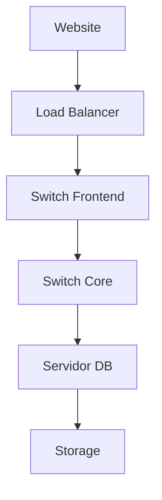

# Historias Reales: Cómo NetBox Resuelve los Dolores del Día a Día

> **"Cada línea de esta página representa horas perdidas que podrían haber sido evitadas"**

---

## 🚨 Historia 1: El Conflicto de IP que Detuvo la Producción

### Qué pasó
Jueves, 14:30 hs. El teléfono suena. **"Sistema de pagos caído"**.

Verificas la aplicación y descubres: **conflicto de IP**. Dos servidores intentando usar la misma dirección en la red.

### La búsqueda de la verdad
- ❌ Hoja de cálculo "oficial" de IPs: desactualizada (última actualización: hace 6 meses)
- ❌ Archivo en el servidor de Juan: versión "más reciente", pero con IPs duplicados
- ❌ Wiki de la empresa: nadie recuerda si está correcta
- ❌ Chat de Slack: 47 mensajes, nadie sabe a ciencia cierta quién usó cuál IP

### El resultado
- 🔴 **3 horas** para encontrar el conflicto
- 🔴 **6 servidores** afectados (sistema de pagos, sitio web, API)
- 🔴 **$45,000 MXN** de pérdida (1 hora de caída)
- 🔴 **Reunión de guerra** para "descubrir" quién hizo el cambio

### Cómo NetBox lo habría resuelto

```python
# Con NetBox, sabrías en 30 segundos:
from pynetbox import api

nb = api('http://netbox.ejemplo.com', token='TU_TOKEN')

# Verificar si IP está en uso
ip = nb.ipam.ip_addresses.get(address='192.168.1.100')
if ip:
    print(f"⚠️ IP EN USO:")
    print(f"   Dispositivo: {ip.assigned_object}")
    print(f"   Interfaz: {ip.interface}")
    print(f"   Creado por: {ip.created_by}")
    print(f"   Última modificación: {ip.last_updated}")
```

**Resultado con NetBox:**
- ✅ Conflicto detectado **ANTES** de que pase (lint automático)
- 🔴 **NINGUNA** caída
- ✅ **CERO** reuniones de guerra
- ✅ Auditoría completa de cambios

---

## 😤 Historia 2: El Técnico en Campo Sin Datos

### Qué pasó
Sábado, 8:00 AM. Llamada de soporte: **switch con falla** en un cliente importante.

El técnico va al lugar:
- ❌ **"¿Cuál switch exactamente?"** - la hoja de cálculo no tiene números de serie
- ❌ **"¿Qué rack?"** - el plano del datacenter está en CAD en la máquina del manager
- ❌ **"¿Qué puerto de VLAN?"** - documentación en un PDF disperso
- ❌ **"¿Código de falla?"** - no hay historial

### El resultado
- 🔴 **4 horas** en el lugar (debería haber sido 30 min)
- 🔴 Pieza incorrecta traída (sin conocer el modelo correcto)
- 🔴 **Cliente perdiendo confianza**
- 🔴 Fin de semana perdido

### Cómo NetBox lo habría resuelto

**App PWA para técnicos (que enseñaremos a crear):**

```html
<!-- App simple que busca datos de NetBox -->
<div class="tech-app">
  <h3>🔍 Búsqueda Rápida de Equipo</h3>
  <input id="qr-code" placeholder="Escanear QR code del switch" />
  <button onclick="buscarEquipo()">Buscar</button>

  <div id="resultado" style="display:none">
    <h4>{{equipo.nombre}}</h4>
    <p>📍 {{equipo.sitio}} / Rack {{equipo.rack}} - U{{equipo.unidad}}</p>
    <p>🔌 {{equipo.modelo}} (S/N: {{equipo.serial}})</p>
    <p>🔌 Puerto {{equipo.puerto}} → VLAN {{equipo.vlan}}</p>
    <p>⚠️ Historial: {{equipo.incidentes}}</p>
  </div>
</div>

<script>
async function buscarEquipo() {
  const qr = document.getElementById('qr-code').value;
  const netbox = await fetch(`/api/switches/?serial=${qr}`).then(r => r.json());
  // ... mostrar datos instantáneos
}
</script>
```

**Resultado con NetBox:**
- ✅ **2 minutos** para identificar el equipo
- ✅ Pieza correcta traída la primera vez
- ✅ Historial completo en la palma de la mano
- ✅ Cliente feliz

---

## 💸 Historia 3: El Costo Invisible de la Falta de Integración

### Qué pasó
Reunión de presupuesto anual. CFO pregunta: **"¿Cuánto gastamos en infraestructura?"**

La búsqueda empieza:
- ❌ Excel financiero: costos de los equipos ($2.3M MXN)
- ❌ Hoja de cálculo de TI: licencias y mantenimiento ($800K MXN)
- ❌ Sistema de compra: facturas ($500K MXN en cables y accesorios)
- ❌ Chats de WhatsApp: "alguien recuerda cuánto gastamos de consultoría para la migración?"

### El resultado
- 🔴 **3 semanas** para consolidar los datos
- 🔴 **$800K MXN en discrepancias** (por qué aparece $3.1M vs $2.3M?)
- 🔴 **Sin visibilidad** de ROI o costo por proyecto/cliente
- 🔴 **Decisiones erróneas** por falta de datos

### Cómo NetBox + Odoo lo habrían resuelto

```python
# Integración automática NetBox ↔ Odoo
from pynetbox import api
import xmlrpc.client as xc

# NetBox (datos técnicos)
nb = api('http://netbox.ejemplo.com', token='TOKEN')
device = nb.dcim.devices.get(name='switch-core-01')

# Odoo (datos financieros)
oodo = xc.ServerProxy('http://odoo:8069/xmlrpc/2/common')
uid = odoo.authenticate('db', 'user', 'password', {})
product_id = odoo.execute_kw('db', uid, 'password',
    'product.product', 'search_read',
    [[['default_code', '=', device.asset_tag]]],
    {'fields': ['name', 'standard_price', 'categ_id']}
)

# Reporte automático
print(f"Dispositivo: {device.name}")
print(f"Costo: ${product_id[0]['standard_price']} MXN")
print(f"Categoría: {product_id[0]['categ_id'][1]}")
print(f"Ubicación: {device.site}")
```

**Resultado con NetBox + Odoo:**
- ✅ **Reporte en 2 segundos**, no 3 semanas
- ✅ Visión **financiera + técnica** unificada
- ✅ Decisiones basadas en **datos reales**
- ✅ Ahorro de **$200K MXN/año** en retrabajo

---

## 📊 Historia 4: El Problema de la Visibilidad

### Qué pasó
**"¿Por qué el sitio web está lento?"**

Investigas:
- ❌ CloudFlare: muestra request más lento, pero no el por qué
- ❌ Servidor web: CPU normal, memoria normal
- ❌ Base de datos: queries lentas, pero ¿cuál la causa?
- ❌ Switch core: sin alertas en SNMP

**Dos horas después:** Descubres que la interfaz del switch estaba en **half-duplex**, pero no sabían por qué:
- No sabían en qué rack estaba
- No sabían qué switches estaban interconectados
- No tenían mapa de dependencias

### Cómo NetBox lo resuelve



Con NetBox, ves **instantáneamente**:
- ✅ Dependencias completas (servicio → app → host → switch → rack)
- ✅ **Estado actual** de cada componente
- ✅ **Últimos cambios** que podrían causar el problema
- ✅ **Impacto** de cada componente para otros servicios

**Tiempo para diagnóstico: 2 minutos** (vs 2 horas)

---

## 🎯 La Historia que Más Duele: La Que Nunca Contamos

### El verdadero costo
No es los **$45,000 MXN** de una hora de caída.

No son los **fines de semana** perdidos de los técnicos.

**El verdadero costo es invisible:**

- 🔹 **Costo de oportunidad**: desarrolladores que podrían estar construyendo features, pero quedan "apagando incendios"
- 🔹 **Estrés técnico**: equipos desmotivados por problemas previsibles
- 🔹 **Pérdida de confianza**: clientes perdiendo fe en la competencia técnica
- 🔹 **Deuda técnica**: soluciones paliativas que se acumulan

### NetBox cambia esa narrativa

| Antes | Con NetBox |
|-------|------------|
| 80% del tiempo apagando incendios | 80% del tiempo previniendo problemas |
| Decisiones basadas en "achismo" | Decisiones basadas en datos |
| Baja moral del equipo | Equipo orgulloso de la infraestructura |
| Clientes insatisfechos | Clientes confiados |

---

## 💡 Próximos Pasos

Ahora que conoces los dolores, vamos a la solución:

👉 **[Primeros Pasos con NetBox](../learning/primeros-pasos.md)** - Tutorial hands-on que va de cero al primer resultado en 30 minutos

👉 **[Casos de Uso Reales](./casos-uso/)** - Ejemplos prácticos con código para cada escenario

👉 **[PWAs para Campo](./pwas-campo.md)** - Cómo crear apps que tus técnicos van a AMAR usar

---

> **"La mejor documentación no es la que explica cómo funciona, es la que muestra cómo resuelve tu problema"**