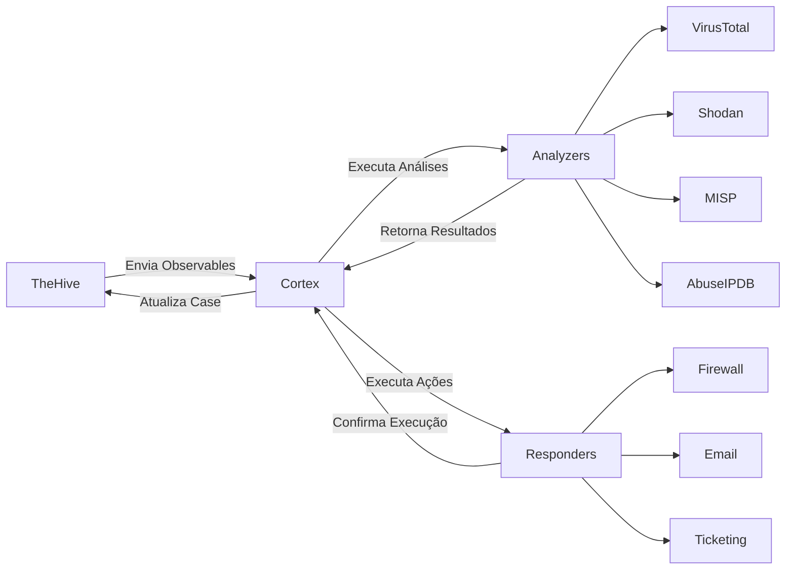
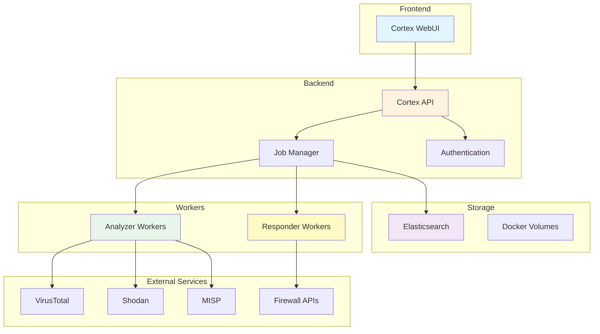
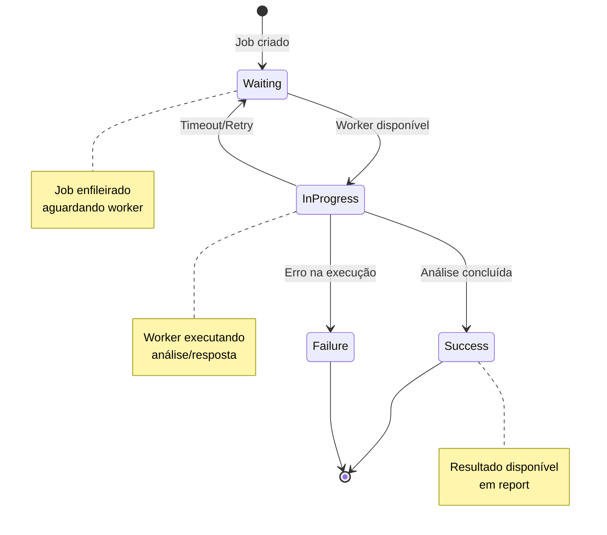
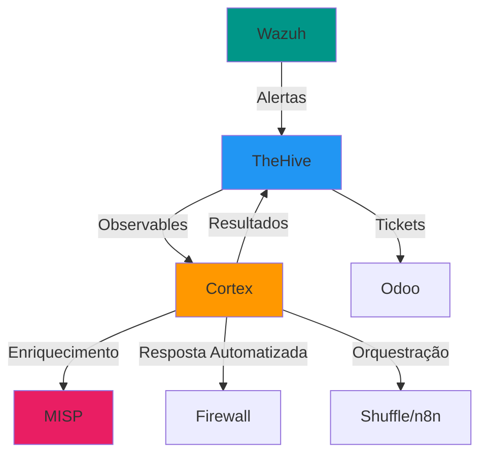
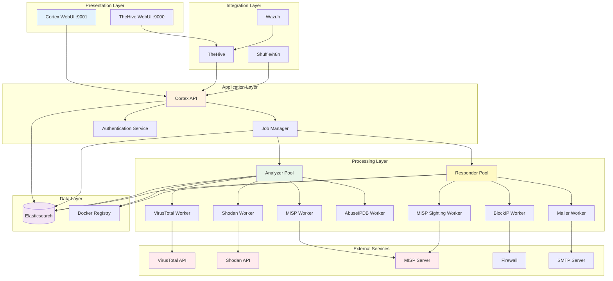

# Cortex - Plataforma de Análise e Resposta

## Visão Geral

**Cortex** é uma plataforma de análise e resposta de segurança desenvolvida pela **StrangeBee** (anteriormente parte do projeto TheHive), projetada para automatizar a análise de observáveis (IOCs - Indicators of Compromise) e executar ações de resposta a incidentes de segurança. Funciona como um motor de orquestração que conecta diversas ferramentas de análise e resposta através de uma interface unificada.

!!! info "Desenvolvedor"
    Cortex é desenvolvido pela **StrangeBee**, a mesma empresa responsável pelo TheHive. Ambas as ferramentas são projetadas para trabalhar em conjunto, formando uma solução completa de SOAR (Security Orchestration, Automation and Response).

## O que é Cortex?

Cortex é essencialmente uma **plataforma de orquestração** que permite:

- **Análise Automatizada**: Executar análises em observáveis (IPs, URLs, hashes, emails, domínios) usando mais de 200 analyzers diferentes
- **Resposta Automatizada**: Executar ações de resposta (bloquear IPs, enviar emails, criar tickets) através de responders
- **Integração Unificada**: Conectar-se a múltiplas fontes de inteligência e ferramentas de segurança através de uma única API
- **Escalabilidade**: Processar análises em paralelo com gerenciamento de recursos e rate limiting
- **Resultados Padronizados**: Obter resultados estruturados e padronizados independentemente da fonte

### Por que Cortex foi Criado?

Durante investigações de segurança, analistas frequentemente precisam:

1. Verificar a reputação de IPs em múltiplas bases (VirusTotal, AbuseIPDB, Shodan)
2. Analisar hashes de arquivos em sandboxes diferentes
3. Verificar URLs em bases de phishing
4. Consultar MISP, Recorded Future e outras fontes de threat intelligence
5. Executar ações de resposta em firewalls, EDRs e outros sistemas

Fazer isso manualmente é:
- **Demorado**: Cada consulta pode levar minutos
- **Repetitivo**: As mesmas verificações são feitas constantemente
- **Propenso a erros**: Fácil esquecer alguma verificação
- **Não escalável**: Impossível processar centenas de IOCs manualmente

**Cortex resolve isso automatizando todo o processo.**

## Relação com TheHive

Cortex foi originalmente criado como parte do ecossistema TheHive e mantém uma integração nativa com a plataforma:



### Workflow Típico com TheHive

1. **Analista cria caso** no TheHive sobre incidente de segurança
2. **Adiciona observables** (IPs, URLs, hashes encontrados)
3. **TheHive envia automaticamente** observables para Cortex
4. **Cortex executa analyzers** configurados (ex: VirusTotal, Shodan, AbuseIPDB)
5. **Resultados retornam** para TheHive e são anexados ao caso
6. **Analista revisa resultados** e toma decisões
7. **Executa responders** se necessário (ex: bloquear IP malicioso)

!!! tip "Uso Independente"
    Embora projetado para trabalhar com TheHive, Cortex pode ser usado de forma independente através de sua API REST, permitindo integração com outras ferramentas da stack.

## Arquitetura do Cortex

### Componentes Principais



### Detalhamento dos Componentes

#### 1. Cortex API
- **Função**: Recebe requisições de análise e resposta
- **Tecnologia**: Scala/Play Framework
- **Porta padrão**: 9001
- **Endpoints principais**:
    - `/api/analyzer`: Gestão de analyzers
    - `/api/responder`: Gestão de responders
    - `/api/job`: Gestão de jobs
    - `/api/organization`: Gestão de organizações

#### 2. Job Manager
- **Função**: Gerencia execução de análises e respostas
- **Características**:
    - Enfileiramento de jobs
    - Controle de concorrência
    - Rate limiting por serviço
    - Retry em falhas
    - Timeout management

#### 3. Elasticsearch
- **Função**: Armazenamento de dados e resultados
- **Armazena**:
    - Configurações de analyzers/responders
    - Histórico de jobs
    - Resultados de análises
    - Métricas e logs
- **Versões suportadas**: 7.x (recomendado: 7.17)

#### 4. Workers (Analyzers e Responders)
- **Função**: Executam as análises e ações
- **Tecnologia**: Docker containers
- **Isolamento**: Cada analyzer/responder roda em container separado
- **Comunicação**: API REST com Cortex Core

#### 5. Docker Registry
- **Função**: Repositório de imagens de analyzers/responders
- **Oficial**: `cortexneurons` (Docker Hub)
- **Customizado**: Registry privado opcional

## Conceitos Fundamentais

### 1. Analyzers (Análise de Observables)

**Analyzers** são componentes que realizam análises em observáveis. Cada analyzer é especializado em um tipo de análise.

#### O que são Observables?

Observables são **indicadores de comprometimento (IOCs)** ou **artefatos** coletados durante investigações:

| Tipo | Exemplos | Descrição |
|------|----------|-----------|
| **ip** | `192.168.1.100`, `8.8.8.8` | Endereços IPv4 ou IPv6 |
| **domain** | `example.com`, `malicious.evil` | Nomes de domínio |
| **url** | `http://phishing.com/login` | URLs completas |
| **hash** | `MD5`, `SHA1`, `SHA256` | Hashes de arquivos |
| **mail** | `phishing@evil.com` | Endereços de email |
| **filename** | `malware.exe` | Nomes de arquivos |
| **fqdn** | `mail.example.com` | FQDN completo |
| **user-agent** | `Mozilla/5.0 ...` | User agents HTTP |

#### Tipos de Analyzers

**Analyzers de Reputação**
```yaml
Nome: VirusTotal_GetReport
Tipo: ip, domain, url, hash
Função: Verifica reputação em 70+ AVs
API: Requer API Key (gratuita disponível)
Taxa: 4 req/min (gratuita), 1000 req/min (paga)
```

**Analyzers de Geolocalização**
```yaml
Nome: MaxMind_GeoIP
Tipo: ip
Função: Determina localização geográfica do IP
API: Requer licença MaxMind
Taxa: Sem limite (banco local)
```

**Analyzers de Malware**
```yaml
Nome: HybridAnalysis_GetReport
Tipo: hash, file
Função: Verifica análise de malware em sandbox
API: Requer API Key
Taxa: 200 req/dia (gratuita)
```

**Analyzers de Email**
```yaml
Nome: EmailRep
Tipo: mail
Função: Verifica reputação de email
API: Requer API Key
Taxa: 300 req/dia (gratuita)
```

**Analyzers de OSINT**
```yaml
Nome: Shodan_Info
Tipo: ip
Função: Busca informações de portas/serviços
API: Requer API Key
Taxa: 100 req/mês (gratuita)
```

#### Exemplo de Execução de Analyzer

```json
{
  "data": "8.8.8.8",
  "dataType": "ip",
  "tlp": 2,
  "message": "Análise de IP suspeito identificado em firewall"
}
```

**Cortex executa automaticamente** todos os analyzers configurados para o tipo `ip`:
- AbuseIPDB_Reputation
- VirusTotal_GetReport
- Shodan_Info
- MaxMind_GeoIP
- MISP_Search
- Greynoise

#### Resultado Estruturado

```json
{
  "success": true,
  "full": {
    "ip": "8.8.8.8",
    "country": "US",
    "isp": "Google LLC",
    "reputation": "clean",
    "detected": false
  },
  "summary": {
    "taxonomies": [
      {
        "level": "safe",
        "namespace": "VirusTotal",
        "predicate": "Score",
        "value": "0/70"
      }
    ]
  },
  "artifacts": []
}
```

### 2. Responders (Ações de Resposta)

**Responders** executam ações automatizadas como resposta a incidentes.

#### Diferença entre Analyzers e Responders

| Aspecto | Analyzer | Responder |
|---------|----------|-----------|
| **Propósito** | Analisar e coletar informações | Executar ações de resposta |
| **Efeito** | Somente leitura | Modifica sistemas/envia dados |
| **Exemplo** | Verificar IP no VirusTotal | Bloquear IP no firewall |
| **Reversível** | N/A (não faz alterações) | Pode ser reversível ou não |

#### Tipos de Responders

**Responders de Firewall**
```yaml
Nome: Firewall_BlockIP
Tipo: ip
Função: Bloqueia IP em firewall (pfSense, FortiGate, etc)
Reversível: Sim (UnblockIP)
Risco: Alto (pode bloquear serviços legítimos)
```

**Responders de Notificação**
```yaml
Nome: Mailer
Tipo: case, alert, log
Função: Envia email com detalhes do incidente
Reversível: Não
Risco: Baixo
```

**Responders de MISP**
```yaml
Nome: MISP_Add_Sighting
Tipo: ip, domain, hash, url
Função: Adiciona sighting de IOC no MISP
Reversível: Não
Risco: Baixo
```

**Responders de Ticketing**
```yaml
Nome: ServiceNow_CreateIncident
Tipo: case, alert
Função: Cria ticket no ServiceNow
Reversível: Não (mas pode fechar ticket)
Risco: Baixo
```

**Responders Customizados**
```yaml
Nome: Custom_Script
Tipo: qualquer
Função: Executa script customizado
Reversível: Depende do script
Risco: Depende da ação
```

#### Exemplo de Execução de Responder

```json
{
  "responderId": "Firewall_BlockIP",
  "objectType": "case_artifact",
  "objectId": "~123456",
  "tlp": 2,
  "parameters": {
    "duration": "24h",
    "reason": "Malicious IP detected by VirusTotal"
  }
}
```

### 3. Jobs (Execução de Análises)

**Jobs** representam execuções individuais de analyzers ou responders.

#### Ciclo de Vida de um Job



#### Estados de Job

| Estado | Descrição | Ação |
|--------|-----------|------|
| **Waiting** | Aguardando worker disponível | Monitorar fila |
| **InProgress** | Em execução | Aguardar conclusão |
| **Success** | Concluído com sucesso | Processar resultados |
| **Failure** | Falhou | Analisar erro, retry se aplicável |
| **Deleted** | Job removido | N/A |

#### Informações de Job

```json
{
  "id": "~123456",
  "analyzerId": "VirusTotal_GetReport_3_0",
  "analyzerName": "VirusTotal_GetReport",
  "status": "Success",
  "data": "8.8.8.8",
  "dataType": "ip",
  "tlp": 2,
  "startDate": 1638360000000,
  "endDate": 1638360005000,
  "organization": "demo",
  "createdBy": "analyst@example.com"
}
```

### 4. Reports (Resultados Estruturados)

**Reports** contêm os resultados das análises em formato estruturado.

#### Estrutura de Report

```json
{
  "summary": {
    "taxonomies": [
      {
        "level": "malicious",
        "namespace": "VirusTotal",
        "predicate": "Detection",
        "value": "15/70"
      },
      {
        "level": "info",
        "namespace": "VirusTotal",
        "predicate": "Country",
        "value": "RU"
      }
    ]
  },
  "full": {
    "positives": 15,
    "total": 70,
    "scans": {
      "Kaspersky": {"detected": true, "result": "Trojan.Generic"},
      "Microsoft": {"detected": true, "result": "Trojan:Win32/Agent"}
    },
    "permalink": "https://virustotal.com/..."
  },
  "artifacts": [
    {
      "type": "domain",
      "value": "c2server.evil.com",
      "tags": ["c2", "malicious"]
    }
  ],
  "operations": []
}
```

#### Taxonomies (Classificações)

Taxonomies padronizam resultados para visualização rápida:

**Níveis de Severidade**
```yaml
safe: Verde - Sem problemas detectados
info: Azul - Informação contextual
suspicious: Laranja - Comportamento suspeito
malicious: Vermelho - Confirmado como malicioso
```

**Namespaces Comuns**
- `VirusTotal`: Resultados do VirusTotal
- `AbuseIPDB`: Score de abuso de IP
- `Shodan`: Informações de serviços
- `MISP`: Matches em eventos MISP

#### Artifacts (IOCs Extraídos)

Analyzers podem extrair novos observables durante análise:

```json
{
  "artifacts": [
    {
      "type": "domain",
      "value": "malicious.com",
      "tags": ["c2", "extracted"]
    },
    {
      "type": "ip",
      "value": "192.0.2.1",
      "tags": ["c2-server"]
    }
  ]
}
```

Esses artifacts podem ser:
- Adicionados automaticamente ao caso no TheHive
- Analisados recursivamente por outros analyzers
- Usados para enriquecer threat intelligence

## Analyzers Disponíveis (200+)

Cortex possui um repositório extenso de analyzers categorizados por função.

### Reputação e Threat Intelligence

| Analyzer | Tipos | Função | API | Custo |
|----------|-------|--------|-----|-------|
| **VirusTotal_GetReport** | ip, domain, url, hash | 70+ AVs e threat intel | Sim | Gratuito/Pago |
| **AbuseIPDB** | ip | Base de IPs maliciosos | Sim | Gratuito/Pago |
| **Shodan** | ip | Informações de serviços expostos | Sim | Gratuito/Pago |
| **GoogleSafeBrowsing** | url | Base de URLs maliciosas Google | Sim | Gratuito |
| **URLhaus** | url, domain | Base de URLs malware | Não | Gratuito |
| **PhishTank** | url | Base de URLs phishing | Não | Gratuito |
| **OTXQuery** | ip, domain, hash | AlienVault OTX | Sim | Gratuito |
| **ThreatCrowd** | ip, domain | Threat correlation | Não | Gratuito |

### Malware Analysis

| Analyzer | Tipos | Função | API | Custo |
|----------|-------|--------|-----|-------|
| **HybridAnalysis** | hash, file | Sandbox malware | Sim | Gratuito/Pago |
| **JoeSandbox** | hash, file | Sandbox avançado | Sim | Pago |
| **ANY.RUN** | url, file | Sandbox interativo | Sim | Pago |
| **Cuckoo** | file | Sandbox local | Local | Gratuito |
| **CAPE** | file | Malware config extraction | Local | Gratuito |
| **MalwareBazaar** | hash | Base de malware | Sim | Gratuito |

### Geolocalização e WHOIS

| Analyzer | Tipos | Função | API | Custo |
|----------|-------|--------|-----|-------|
| **MaxMind_GeoIP** | ip | Geolocalização IP | Local DB | Pago |
| **IPinfo** | ip | Geo, ASN, Company | Sim | Gratuito/Pago |
| **Whois** | domain, ip | Informações de registro | Local | Gratuito |
| **DomainTools** | domain | DNS history, WHOIS | Sim | Pago |

### Email Analysis

| Analyzer | Tipos | Função | API | Custo |
|----------|-------|--------|-----|-------|
| **EmailRep** | mail | Reputação de email | Sim | Gratuito/Pago |
| **Hunter** | mail, domain | Email verification | Sim | Gratuito/Pago |
| **EmailAnalyzer** | file (eml) | Parse de headers email | Local | Gratuito |

### Threat Intelligence Platforms

| Analyzer | Tipos | Função | API | Custo |
|----------|-------|--------|-----|-------|
| **MISP** | ip, domain, hash, etc | Busca em eventos MISP | Sim | Gratuito (self-hosted) |
| **RecordedFuture** | ip, domain, hash | Threat intel comercial | Sim | Pago |
| **ThreatConnect** | ip, domain | TI platform | Sim | Pago |
| **OpenCTI** | ip, domain, hash | STIX/TAXII intel | Sim | Gratuito (self-hosted) |

### Certificate Analysis

| Analyzer | Tipos | Função | API | Custo |
|----------|-------|--------|-----|-------|
| **CERTatPassive** | domain | Certificados SSL/TLS | Não | Gratuito |
| **SSLLabs** | domain | Análise SSL/TLS | Sim | Gratuito |

### File Analysis

| Analyzer | Tipos | Função | API | Custo |
|----------|-------|--------|-----|-------|
| **FileInfo** | file | Metadata de arquivo | Local | Gratuito |
| **Yara** | file | Pattern matching | Local | Gratuito |
| **PEInfo** | file | Parse PE executáveis | Local | Gratuito |

## Responders Disponíveis

### Firewall e Network

| Responder | Tipos | Função | Reversível |
|-----------|-------|--------|------------|
| **pfSense_BlockIP** | ip | Bloqueia IP no pfSense | Sim |
| **FortiGate_BlockIP** | ip | Bloqueia IP no FortiGate | Sim |
| **Cisco_ASA_Block** | ip | Bloqueia IP no Cisco ASA | Sim |

### Notification

| Responder | Tipos | Função | Reversível |
|-----------|-------|--------|------------|
| **Mailer** | case, alert, log | Envia email | Não |
| **Slack** | case, alert | Notificação Slack | Não |
| **MSTeams** | case, alert | Notificação Teams | Não |
| **Telegram** | case, alert | Notificação Telegram | Não |

### Threat Intelligence

| Responder | Tipos | Função | Reversível |
|-----------|-------|--------|------------|
| **MISP_Add_Sighting** | ip, domain, hash | Adiciona sighting | Não |
| **MISP_Create_Event** | case | Cria evento MISP | Não |
| **OpenCTI_Export** | case | Exporta para OpenCTI | Não |

### Ticketing

| Responder | Tipos | Função | Reversível |
|-----------|-------|--------|------------|
| **ServiceNow_Incident** | case | Cria incident | Não |
| **Jira_CreateIssue** | case | Cria issue Jira | Não |
| **RT_CreateTicket** | case | Cria ticket RT | Não |

### Custom Actions

| Responder | Tipos | Função | Reversível |
|-----------|-------|--------|------------|
| **RT4_CreateTicket** | case, alert | Request Tracker | Não |
| **Wazuh_Active_Response** | ip | Ativa resposta Wazuh | Sim |

## Por que Usar Cortex na Stack NEO_NETBOX_ODOO

### Benefícios para a Stack



### 1. Automação de Análise

**Sem Cortex:**
```yaml
Tempo médio por análise manual: 15-30 minutos
Análises por dia: ~20 (1 analista)
IOCs analisados: ~20
```

**Com Cortex:**
```yaml
Tempo médio por análise automatizada: 30-60 segundos
Análises por dia: Ilimitado (automatizado)
IOCs analisados: Milhares
```

**ROI:** Redução de 95%+ no tempo de análise.

### 2. Enriquecimento Multi-Fonte

Para cada IOC, Cortex consulta automaticamente:
- VirusTotal (70+ AVs)
- AbuseIPDB (milhões de reports)
- Shodan (bilhões de scans)
- MISP (sua threat intel)
- E 200+ outras fontes

**Resultado:** Contexto completo em minutos vs. horas/dias manual.

### 3. Resposta Automatizada

Workflow automático:

1. Wazuh detecta atividade maliciosa
2. Cria alerta no TheHive
3. TheHive envia IP para Cortex
4. Cortex analisa em 10+ sources
5. Se confirmado malicioso: executa responders
   - Bloqueia IP no firewall
   - Adiciona a blacklist MISP
   - Cria ticket Odoo
   - Notifica equipe via Slack
6. Tudo em < 2 minutos

### 4. Redução de Falsos Positivos

Cortex permite decisões baseadas em consenso:

```python
# Exemplo: Só bloquear se 3+ sources confirmarem malicioso
if (virustotal.detections > 5 and
    abuseipdb.score > 80 and
    misp.found):
    execute_responder("BlockIP")
```

### 5. Integração com SOAR

Cortex complementa Shuffle/n8n:

- **Cortex**: Análises e respostas específicas de segurança
- **Shuffle/n8n**: Orquestração de workflows complexos

```yaml
Exemplo Workflow:
1. Shuffle recebe webhook Wazuh
2. Envia para Cortex análise
3. Aguarda resultados
4. Baseado em score: executa playbook
5. Atualiza Odoo, MISP, Netbox
```

## Comparação com Outras Ferramentas

### Cortex vs. SOAR Tradicionais

| Aspecto | Cortex | Splunk SOAR | IBM Resilient | Palo Alto XSOAR |
|---------|--------|-------------|---------------|-----------------|
| **Custo** | Gratuito | $$$$ | $$$$ | $$$$ |
| **Foco** | Análise/Resposta IOCs | Orquestração completa | IR completo | SOAR completo |
| **Analyzers** | 200+ | ~100 | ~150 | 500+ |
| **Complexidade** | Baixa | Alta | Alta | Muito Alta |
| **Self-Hosted** | Sim | Não | Híbrido | Híbrido |
| **Open Source** | Sim | Não | Não | Não |

### Cortex vs. Shuffle/n8n

| Aspecto | Cortex | Shuffle | n8n |
|---------|--------|---------|-----|
| **Propósito** | Segurança específica | SOAR geral | Automação geral |
| **Analyzers** | 200+ nativos | Via API externa | Via API externa |
| **Expertise** | Cybersecurity | Cybersecurity | IT automation |
| **Uso ideal** | Análise IOCs | Playbooks SOAR | Workflows IT |

**Melhor abordagem:** Usar **todos juntos**:
- Cortex: Análise e resposta de IOCs
- Shuffle: Orquestração de playbooks de segurança
- n8n: Automação de processos IT/Business

## Licenciamento

### Cortex Core

**Licença:** AGPL v3 (Open Source)

**Permite:**
- Uso comercial
- Modificação
- Distribuição
- Uso privado

**Requer:**
- Divulgar fonte se modificado e distribuído
- Mesma licença para derivados
- Incluir copyright

### Analyzers e Responders

**Licença:** AGPL v3 (maioria)

**Importante:**
- Analyzers são open source
- APIs externas têm suas próprias licenças
- Verificar termos de uso de cada serviço (VirusTotal, Shodan, etc)

### Versão Enterprise (StrangeBee)

Existe suporte comercial disponível:

**Features adicionais:**
- Suporte prioritário
- SLA garantido
- Consultoria de implementação
- Analyzers exclusivos
- Training customizado

**Contato:** https://www.strangebee.com

## Requisitos de Sistema

### Mínimos (Ambiente Teste)

```yaml
CPU: 2 cores
RAM: 4 GB
Disco: 20 GB SSD
OS: Linux (Ubuntu 20.04+, Debian 11+, RHEL 8+)
Docker: 20.10+
Docker Compose: 2.0+
```

### Recomendados (Produção Pequena)

```yaml
CPU: 4 cores
RAM: 8 GB
Disco: 100 GB SSD
Network: 1 Gbps
Elasticsearch: 7.17.x
```

### Produção (Alta Demanda)

```yaml
CPU: 8+ cores
RAM: 16+ GB
Disco: 500+ GB SSD (NVMe)
Network: 10 Gbps
Elasticsearch: Cluster 3+ nodes
Workers: Pool dedicado por tipo analyzer
```

### Dependências Obrigatórias

| Software | Versão | Propósito |
|----------|--------|-----------|
| Docker | 20.10+ | Execução de containers |
| Docker Compose | 2.0+ | Orquestração |
| Elasticsearch | 7.17.x | Storage backend |
| Java | 11+ | Runtime Elasticsearch |

## Diagrama de Arquitetura Completo



## Próximos Passos

Agora que você entende o que é Cortex e como ele funciona, prossiga com:

1. **[Setup e Instalação](setup.md)** - Configure Cortex na sua infraestrutura
2. **[Guia de Analyzers](analyzers.md)** - Configure e utilize analyzers
3. **[Guia de Responders](responders.md)** - Configure respostas automatizadas
4. **[Integração TheHive](integration-thehive.md)** - Conecte com TheHive
5. **[Integração Stack](integration-stack.md)** - Integre com toda a stack

## Recursos Adicionais

- **Documentação Oficial:** https://docs.strangebee.com/cortex/
- **GitHub:** https://github.com/TheHive-Project/Cortex
- **Neuron Catalog:** https://github.com/TheHive-Project/Cortex-Analyzers
- **Community:** https://chat.thehive-project.org
- **StrangeBee:** https://www.strangebee.com

---

**Desenvolvido por:** StrangeBee
**Licença:** AGPL v3
**Versão Documentação:** 1.0
**Última Atualização:** Dezembro 2025
