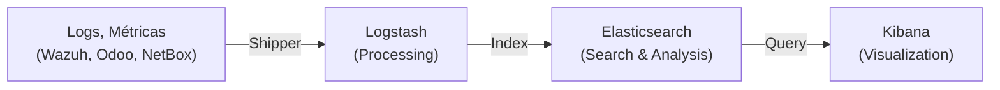

# Elastic/OpenSearch: Plataforma de Visualização e Análise

> **AI Context**: Elastic (ELK Stack) e OpenSearch são plataformas de busca, análise e visualização em tempo real. Na stack NEO, complementam o monitoramento com visualização avançada de logs e métricas.

## Introdução

### O que é Elastic Stack (ELK)?

**Elastic Stack** (anteriormente ELK Stack) é uma suite open-source composta por:

- **Elasticsearch**: Motor de busca e análise em tempo real
- **Logstash**: Pipeline de processamento de dados
- **Kibana**: Visualização e exploração de dados
- **Beats**: Coletores leves de dados



### O que é OpenSearch?

**OpenSearch** é o fork open-source do Elasticsearch (depois que Elastic mudou para licença não-comercial em 2021):

| Aspecto | Elasticsearch | OpenSearch |
|---|---|---|
| **Licença** | SSPL (não open-source puro) | AGPLv3 (100% open-source) |
| **Desenvolvedor** | Elastic (comercial) | Amazon/Comunidade |
| **Custo** | Grátis (community) | 100% grátis |
| **Compatibilidade** | Proprietário | Compatível com ES 7.x |
| **Melhor para** | SaaS, Enterprise | On-premise, open-source |

**Na stack NEO usamos: OpenSearch** (por ser 100% open-source)

## Arquitetura Elastic/OpenSearch

### Componentes

```
┌────────────────────────────────────────┐
│          Fontes de Dados               │
│  (Wazuh, Odoo, NetBox, Prometheus)    │
└────────────┬─────────────────────────┘
             │
             ↓
┌────────────────────────────────────────┐
│  Coleta e Processamento               │
│  (Beats, Logstash, Fluentd)          │
└────────────┬─────────────────────────┘
             │
             ↓
┌────────────────────────────────────────┐
│  Almacenamento e Busca                │
│  (Elasticsearch/OpenSearch)           │
│  - Indexação                          │
│  - Análise full-text                  │
│  - Agregações                         │
└────────────┬─────────────────────────┘
             │
             ↓
┌────────────────────────────────────────┐
│  Visualização e Análise               │
│  (Kibana / OpenSearch Dashboards)    │
│  - Dashboards                         │
│  - Alertas                            │
│  - Relatórios                         │
└────────────────────────────────────────┘
```

## Caso de Uso na Stack NEO

### Problema Resolvido

Sem Elastic/OpenSearch:
- Logs espalhados em múltiplos serviços
- Difícil correlacionar eventos
- Sem visualização histórica
- Compliance/auditoria manual

**Com Elastic/OpenSearch**:
- Centralização de logs
- Correlação automática
- Dashboards em tempo real
- Auditoria e compliance completo

### Fluxo Típico

```
1. Wazuh gera 10.000 alertas/dia
   ↓
2. Filebeat coleta logs de Wazuh
   ↓
3. Logstash processa e enriquece
   ↓
4. OpenSearch indexa tudo
   ↓
5. Kibana exibe em dashboard
   ↓
6. Analista visualiza padrões
```

## OpenSearch vs Wazuh Dashboard

| Aspecto | OpenSearch | Wazuh Dashboard |
|---|---|---|
| **Escopo** | SIEM + logs gerais | Apenas Wazuh |
| **Fonte dados** | Múltiplas | Apenas Wazuh |
| **Customização** | Altíssima | Média |
| **Complexidade** | Média | Baixa |
| **Quando usar** | Stack completo | Só monitorar Wazuh |

## Próximos Passos

- [Setup OpenSearch →](setup.md)
- [Integração Wazuh →](wazuh-integration.md)
- [Dashboards →](dashboards.md)
- [Alertas →](alerting.md)

---

**Documentação**: Stack NEO_NETBOX_ODOO | **Versão**: 1.0 | **Fecha**: Diciembre 2024
