# MISP - Malware Information Sharing Platform

## Visão Geral

O **MISP (Malware Information Sharing Platform)** é uma plataforma open-source de compartilhamento de informações sobre ameaças cibernéticas (Threat Intelligence), desenvolvida para armazenar, compartilhar, colaborar e correlacionar indicadores de comprometimento (IOCs) e informações sobre ameaças.

!!! abstract "O que é MISP?"
    MISP é uma ferramenta que permite às organizações:

    - **Coletar** indicadores de comprometimento (IOCs) de múltiplas fontes
    - **Armazenar** informações estruturadas sobre ameaças
    - **Compartilhar** dados com parceiros e comunidades confiáveis
    - **Correlacionar** automaticamente IOCs para identificar campanhas
    - **Exportar** dados para ferramentas de segurança (SIEM, IDS, firewall)
    - **Enriquecer** eventos com inteligência contextual

## História e Desenvolvimento

### Origem no CIRCL

O MISP foi desenvolvido originalmente pela **CIRCL (Computer Incident Response Center Luxembourg)** em 2011, inicialmente como uma ferramenta interna para gerenciar e compartilhar IOCs durante investigações de incidentes.

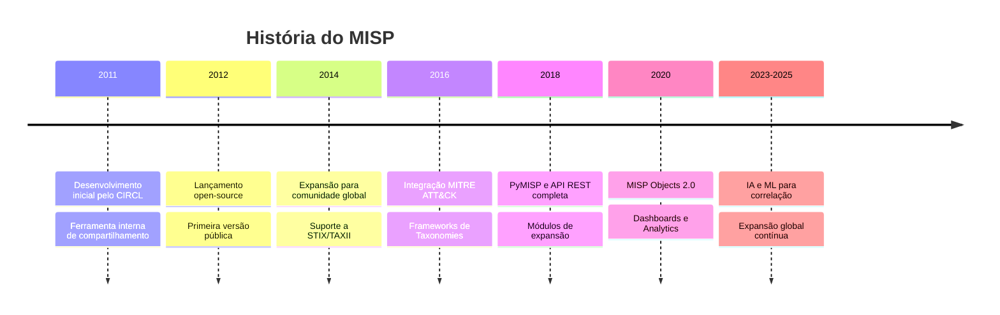

### Comunidade Global

Hoje, o MISP é utilizado por:

- **Centros de Resposta a Incidentes (CSIRTs/CERTs)** em mais de 80 países
- **Agências governamentais** e de defesa
- **Instituições financeiras** (ISACs bancários)
- **Empresas de tecnologia** e cibersegurança
- **Provedores de serviços gerenciados (MSPs/MSSPs)**
- **Organizações de pesquisa** e universidades

!!! success "Adoção Global"
    Mais de **6.000 instâncias MISP** ativas globalmente, compartilhando milhões de IOCs diariamente através de redes de confiança estabelecidas.

## Por Que Threat Intelligence É Crítica?

### O Cenário de Ameaças Moderno

As ameaças cibernéticas evoluem rapidamente. Adversários compartilham ferramentas, técnicas e infraestrutura. **Defender-se isoladamente não é mais eficaz**.

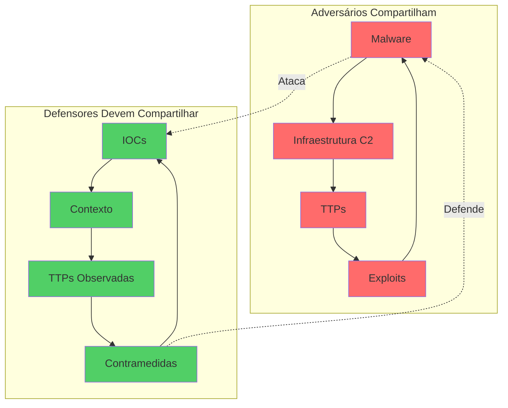

### Benefícios do Compartilhamento de Threat Intelligence

=== "Detecção Antecipada"
    ```yaml
    Cenário:
      - Organização A detecta campanha de phishing
      - Compartilha IOCs via MISP com comunidade
      - Organizações B, C, D recebem alertas
      - Bloqueiam proativamente antes do ataque

    Resultado:
      - Redução de 70-90% no tempo de exposição
      - Economia de milhões em custos de incidente
    ```

=== "Correlação de Ataques"
    ```yaml
    Cenário:
      - Múltiplas organizações sofrem ataques similares
      - IOCs são compartilhados no MISP
      - Correlação automática identifica campanha
      - Revela infraestrutura adversária completa

    Resultado:
      - Visibilidade de campanhas globais
      - Identificação de APTs e grupos organizados
    ```

=== "Enriquecimento Contextual"
    ```yaml
    Cenário:
      - SOC detecta IP suspeito em logs
      - Consulta MISP para contexto
      - Descobre: IOC de ransomware conhecido
      - Contém família, TTPs, recomendações

    Resultado:
      - Resposta mais rápida e eficaz
      - Decisões baseadas em inteligência
    ```

=== "Aprendizado Coletivo"
    ```yaml
    Cenário:
      - Comunidade ISAC compartilha IOCs
      - Organizações menores se beneficiam
      - Todos aprendem com incidentes de outros
      - Capacidades de defesa elevadas coletivamente

    Resultado:
      - Democratização da inteligência
      - Defesa coletiva mais forte
    ```

!!! quote "Compartilhamento é Essencial"
    "No mundo da cibersegurança, compartilhar informações sobre ameaças não é apenas benéfico – é essencial para a sobrevivência. O que uma organização aprende com um ataque pode salvar centenas de outras." - Alexandre Dulaunoy, CIRCL

## Conceitos Fundamentais do MISP

### 1. Events (Eventos)

**Events** são o conceito central do MISP. Representam incidentes, campanhas de ataque, ou conjuntos relacionados de indicadores.

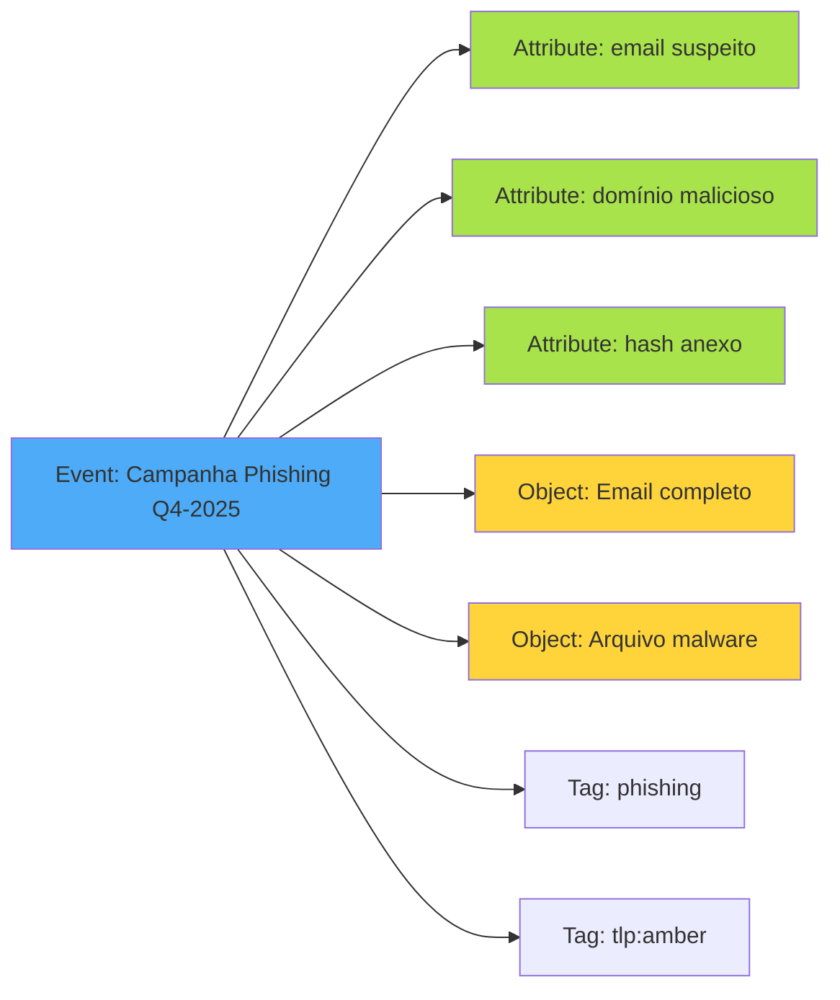

!!! example "Exemplo de Event"
    ```yaml
    Event: "Campanha de Phishing - Falso Banco XYZ"
    Data: 2025-12-05
    Org: CERT-BR
    Distribution: Community
    Threat Level: High
    Analysis: Ongoing

    Attributes:
      - email-src: phishing@fake-banco.com
      - domain: fake-banco.com
      - ip-dst: 192.0.2.15
      - md5: 5d41402abc4b2a76b9719d911017c592

    Tags:
      - tlp:amber
      - phishing
      - financial-fraud
    ```

### 2. Attributes (Atributos)

**Attributes** são os indicadores individuais de comprometimento (IOCs) ou dados descritivos associados a um evento.

#### Tipos de Attributes Suportados

| Categoria | Tipos | Exemplos |
|-----------|-------|----------|
| **Network** | `ip-src`, `ip-dst`, `domain`, `hostname`, `url` | `192.0.2.1`, `malware.com` |
| **File** | `md5`, `sha1`, `sha256`, `filename`, `size` | `5d41402abc...`, `trojan.exe` |
| **Email** | `email-src`, `email-dst`, `email-subject` | `attacker@evil.com` |
| **Registry** | `regkey`, `regkey|value` | `HKLM\Software\Malware` |
| **Malware** | `malware-sample`, `malware-type` | Binário + hash |
| **Other** | `mutex`, `user-agent`, `AS`, `vulnerability` | `CVE-2024-1234` |

```python
# Exemplo de criação de Attributes via PyMISP
from pymisp import PyMISP, MISPEvent, MISPAttribute

misp = PyMISP('https://misp.example.com', 'API_KEY')

event = MISPEvent()
event.info = "Malware Emotet - Campanha Janeiro 2025"

# Attribute de domínio
attr_domain = MISPAttribute()
attr_domain.type = 'domain'
attr_domain.value = 'emotet-c2.malicious.com'
attr_domain.category = 'Network activity'
attr_domain.to_ids = True  # Gerar alertas de IDS
event.add_attribute(**attr_domain)

# Attribute de hash de arquivo
attr_hash = MISPAttribute()
attr_hash.type = 'sha256'
attr_hash.value = '5994471abb01112afcc18159f6cc74b4f511b99806da59b3caf5a9c173cacfc5'
attr_hash.category = 'Payload delivery'
attr_hash.to_ids = True
event.add_attribute(**attr_hash)

misp.add_event(event)
```

#### Flags Importantes

=== "to_ids"
    ```yaml
    to_ids: true/false

    Significado:
      - true: Este IOC deve gerar alertas em sistemas de detecção
      - false: Informação contextual, não para detecção automática

    Exemplo:
      - IP de C2 conhecido: to_ids = true (bloquear!)
      - IP de vítima: to_ids = false (contexto apenas)
    ```

=== "disable_correlation"
    ```yaml
    disable_correlation: true/false

    Significado:
      - false: MISP correlaciona este IOC entre eventos
      - true: Desabilitar correlação (dados genéricos)

    Exemplo:
      - Hash de malware: correlação ativada
      - String comum "admin": correlação desativada
    ```

=== "batch_import"
    ```yaml
    batch_import: true/false

    Significado:
      - true: Importação em lote, sem notificações
      - false: Notificar subscritores sobre mudanças

    Uso:
      - Importar feeds massivos: batch_import = true
    ```

### 3. Objects (Objetos)

**Objects** são estruturas complexas que agrupam múltiplos attributes relacionados em templates predefinidos.

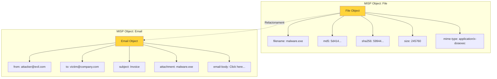

#### Objects Templates Populares

=== "file"
    ```yaml
    Template: file
    Descrição: Representa um arquivo completo

    Attributes:
      - filename: Nome do arquivo
      - md5, sha1, sha256: Hashes
      - size-in-bytes: Tamanho
      - mime-type: Tipo MIME
      - entropy: Entropia (aleatoriedade)
      - ssdeep: Fuzzy hash

    Uso:
      - Malware samples
      - Documentos maliciosos
      - Executáveis suspeitos
    ```

=== "network-connection"
    ```yaml
    Template: network-connection
    Descrição: Conexão de rede completa

    Attributes:
      - ip-src: IP origem
      - ip-dst: IP destino
      - src-port: Porta origem
      - dst-port: Porta destino
      - protocol: TCP/UDP/ICMP
      - hostname: Hostname conectado

    Uso:
      - Conexões C2 de malware
      - Comunicações suspeitas
      - Beaconing
    ```

=== "email"
    ```yaml
    Template: email
    Descrição: Email completo

    Attributes:
      - from: Remetente
      - to: Destinatário
      - subject: Assunto
      - email-body: Corpo
      - attachment: Anexos
      - x-mailer: Cliente de email
      - reply-to: Responder para

    Uso:
      - Campanhas de phishing
      - Análise de spear-phishing
      - BEC (Business Email Compromise)
    ```

=== "domain-ip"
    ```yaml
    Template: domain-ip
    Descrição: Relacionamento domínio-IP

    Attributes:
      - domain: Nome de domínio
      - ip: Endereço IP resolvido
      - first-seen: Primeira observação
      - last-seen: Última observação
      - hostname: Hostname completo

    Uso:
      - Infraestrutura C2
      - Domínios de phishing
      - DGA (Domain Generation Algorithm)
    ```

=== "vulnerability"
    ```yaml
    Template: vulnerability
    Descrição: Vulnerabilidade CVE

    Attributes:
      - id: CVE-YYYY-XXXX
      - summary: Descrição
      - cvss-score: Pontuação CVSS
      - references: Links e referências
      - vulnerable-configuration: Config afetada
      - exploit-available: Exploit público?

    Uso:
      - Rastreamento de vulnerabilidades
      - Priorização de patches
      - Threat hunting por CVEs
    ```

### 4. Galaxies (Galáxias)

**Galaxies** são clusters de conhecimento que representam frameworks, malware families, threat actors e outros conceitos de inteligência.

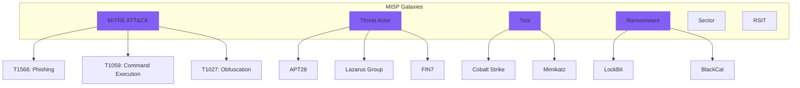

#### Principais Galaxies

=== "MITRE ATT&CK"
    ```yaml
    Galaxy: mitre-attack-pattern

    Descrição:
      - Framework de TTPs (Tactics, Techniques, Procedures)
      - Matriz de técnicas observadas em ataques reais
      - Padrão da indústria para descrever comportamento adversário

    Exemplo:
      - T1566.001: Phishing - Spearphishing Attachment
      - T1059.001: PowerShell
      - T1070.004: File Deletion

    Uso no MISP:
      - Tagear events com técnicas observadas
      - Correlacionar TTPs entre campanhas
      - Mapear capacidades de threat actors
    ```

=== "Threat Actor"
    ```yaml
    Galaxy: threat-actor

    Descrição:
      - Grupos APT conhecidos
      - Operadores de ransomware
      - Cybercrime organizations

    Exemplo:
      - APT28 (Fancy Bear) - Rússia
      - Lazarus Group - Coreia do Norte
      - FIN7 - Cybercrime financeiro

    Uso no MISP:
      - Atribuir ataques a grupos
      - Rastrear campanhas por ator
      - Compartilhar inteligência sobre adversários
    ```

=== "Tool"
    ```yaml
    Galaxy: tool

    Descrição:
      - Ferramentas usadas por adversários
      - Malware frameworks
      - Post-exploitation tools

    Exemplo:
      - Cobalt Strike - C2 framework
      - Mimikatz - Credential dumping
      - BloodHound - AD reconnaissance

    Uso no MISP:
      - Identificar ferramentas em incidentes
      - Correlacionar uso de ferramentas
      - Desenvolver detecções específicas
    ```

=== "Ransomware"
    ```yaml
    Galaxy: ransomware

    Descrição:
      - Famílias de ransomware conhecidas
      - Variantes e evoluções
      - Grupos operadores

    Exemplo:
      - LockBit 3.0
      - BlackCat (ALPHV)
      - Conti

    Uso no MISP:
      - Rastrear campanhas de ransomware
      - Compartilhar IOCs entre vítimas
      - Análise de tendências
    ```

### 5. Taxonomies (Taxonomias)

**Taxonomies** são sistemas de classificação padronizados para categorizar eventos e atributos.

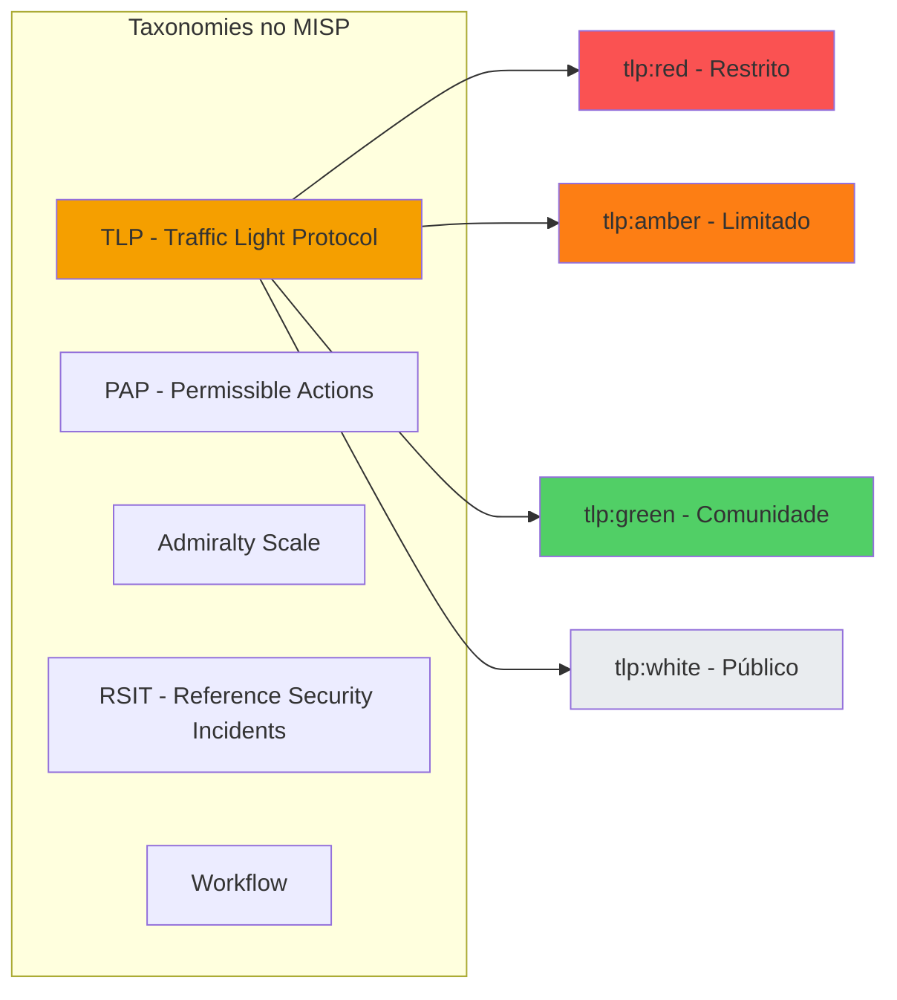

#### Taxonomies Essenciais

=== "TLP - Traffic Light Protocol"
    ```yaml
    Taxonomy: tlp
    Propósito: Controlar compartilhamento de informações

    Níveis:
      tlp:red:
        - Informação extremamente sensível
        - Apenas destinatários específicos
        - Não compartilhar
        Exemplo: IOCs de incidente em andamento não divulgado

      tlp:amber:
        - Compartilhamento limitado
        - Apenas organizações participantes
        - Necessita justificativa para compartilhar
        Exemplo: IOCs de campanha afetando setor específico

      tlp:green:
        - Compartilhamento dentro da comunidade
        - Parceiros e peers confiáveis
        - Não tornar público
        Exemplo: IOCs validados de ameaças conhecidas

      tlp:white (ou tlp:clear):
        - Informação pública
        - Sem restrições de compartilhamento
        - Pode ser divulgado abertamente
        Exemplo: IOCs de malware antigo já público
    ```

=== "PAP - Permissible Actions Protocol"
    ```yaml
    Taxonomy: PAP
    Propósito: Definir ações permitidas com a informação

    Níveis:
      pap:red:
        - Apenas leitura, não usar
        - Informação para awareness apenas
        Exemplo: IOCs ainda em investigação

      pap:amber:
        - Pode usar em detecção passiva
        - Não bloquear automaticamente
        Exemplo: IOCs com possíveis falsos positivos

      pap:green:
        - Pode usar em detecção ativa
        - Bloquear/alertar permitido
        Exemplo: IOCs confirmados de malware

      pap:white:
        - Todas as ações permitidas
        - Compartilhar, bloquear, publicar
        Exemplo: IOCs validados de infraestrutura maliciosa
    ```

=== "Admiralty Scale"
    ```yaml
    Taxonomy: admiralty-scale
    Propósito: Avaliar confiabilidade da fonte e informação

    Confiabilidade da Fonte (A-F):
      A: Completamente confiável
      B: Geralmente confiável
      C: Razoavelmente confiável
      D: Não geralmente confiável
      E: Não confiável
      F: Confiabilidade não pode ser julgada

    Credibilidade da Informação (1-6):
      1: Confirmada por outras fontes
      2: Provavelmente verdadeira
      3: Possivelmente verdadeira
      4: Duvidosa
      5: Improvável
      6: Não pode ser julgada

    Exemplo:
      - IOC de fonte confiável e validado: A1
      - IOC de honeypot próprio, não confirmado: A2
      - IOC de fonte desconhecida, não validado: F6
    ```

=== "RSIT - Reference Security Incidents"
    ```yaml
    Taxonomy: rsit
    Propósito: Classificar tipos de incidentes de segurança

    Categorias:
      - Abusive Content: spam, phishing, harassment
      - Malicious Code: malware, ransomware, botnet
      - Information Gathering: scanning, sniffing
      - Intrusion Attempts: exploit attempts, brute-force
      - Intrusion: compromise confirmado
      - Availability: DDoS, sabotage
      - Information Security: data breach, unauthorized access
      - Fraud: phishing, copyright violation
      - Vulnerable: sistema vulnerável exposto
      - Other: outros tipos

    Exemplo:
      - Campanha de phishing: rsit:abusive-content="phishing"
      - Infecção por ransomware: rsit:malicious-code="ransomware"
    ```

### 6. Warninglists (Listas de Avisos)

**Warninglists** são listas de valores conhecidos como falsos positivos, usadas para filtrar IOCs que não são realmente maliciosos.

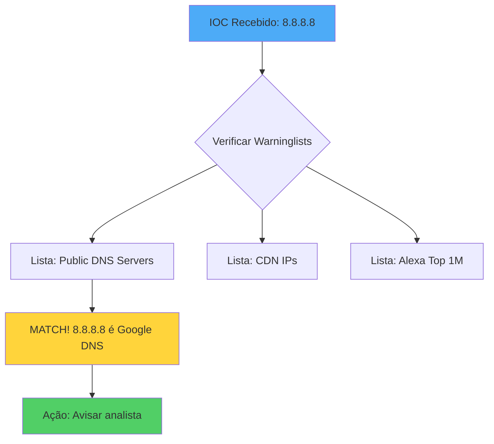

#### Warninglists Importantes

| Lista | Descrição | Exemplos |
|-------|-----------|----------|
| **public-dns** | Servidores DNS públicos conhecidos | 8.8.8.8, 1.1.1.1 |
| **microsoft-azure** | IPs da infraestrutura Azure | Ranges do Azure |
| **amazon-aws** | IPs da AWS | Ranges EC2, S3, CloudFront |
| **google** | IPs de serviços Google | Gmail, Drive, YouTube |
| **alexa** | Top 1M domínios Alexa | google.com, facebook.com |
| **cisco-top1000** | Top 1000 domínios Cisco Umbrella | Domínios legítimos populares |
| **cloudflare** | IPs do Cloudflare | CDN ranges |
| **university-domains** | Domínios de universidades | .edu, universidades globais |
| **bank-website** | Sites de bancos legítimos | Domínios de instituições financeiras |
| **parking-domain** | Domínios em parking | Sedo, GoDaddy parking |

!!! warning "Uso de Warninglists"
    Warninglists **não bloqueiam** IOCs, apenas **alertam** que o valor pode ser legítimo. Cabe ao analista decidir se é realmente um falso positivo no contexto do incidente.

## Arquitetura do MISP

### Componentes Principais

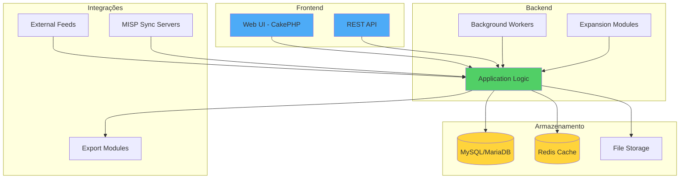

### Fluxo de Dados

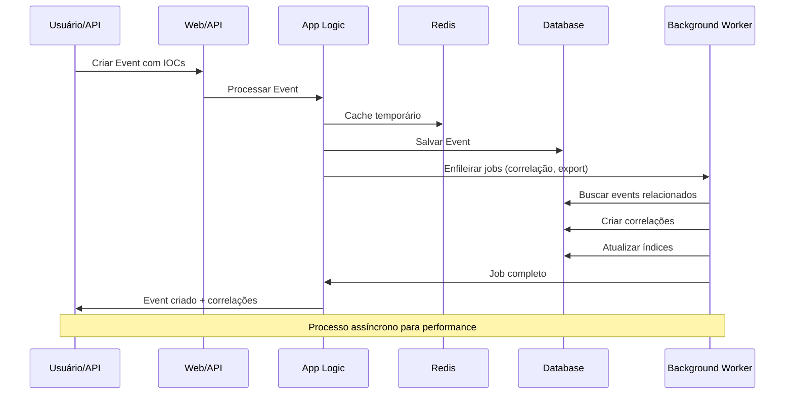

### Arquitetura de Deployment

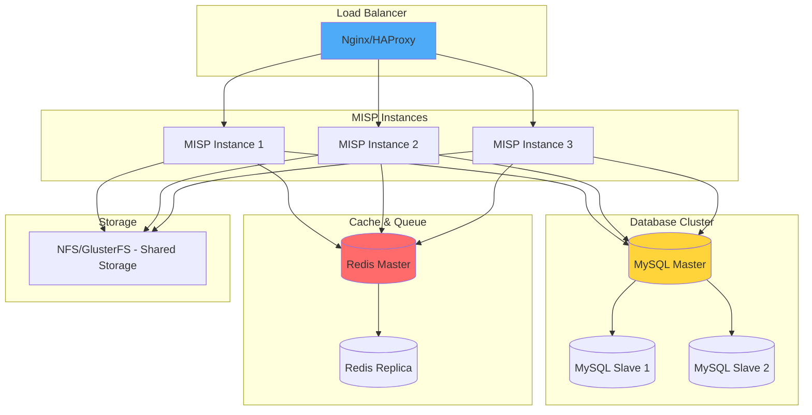

## Comunidade e Sharing Groups

### Modelo de Compartilhamento

O MISP implementa um modelo de **compartilhamento baseado em confiança** através de:

#### 1. Distribution Levels

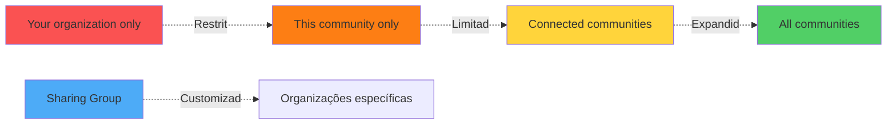

=== "Your organization only"
    ```yaml
    Distribution: 0 - Your organization only

    Comportamento:
      - Apenas sua organização vê o event/attribute
      - Não é sincronizado com nenhum servidor
      - Uso: Informações internas confidenciais

    Exemplo:
      - IOCs de teste internos
      - Dados sob investigação
      - Informações proprietárias
    ```

=== "This community only"
    ```yaml
    Distribution: 1 - This community only

    Comportamento:
      - Visível para todas as organizações na instância MISP local
      - Não é sincronizado com servidores externos
      - Uso: Compartilhamento dentro de ISAC/comunidade local

    Exemplo:
      - IOCs de ataques ao setor bancário local
      - Informações de comunidade setorial
    ```

=== "Connected communities"
    ```yaml
    Distribution: 2 - Connected communities

    Comportamento:
      - Sincronizado com instâncias MISP conectadas
      - Propaga para servidores de sincronização configurados
      - Uso: Compartilhamento entre comunidades confiáveis

    Exemplo:
      - IOCs de campanha multi-setorial
      - Compartilhamento entre CERTs nacionais
    ```

=== "All communities"
    ```yaml
    Distribution: 3 - All communities

    Comportamento:
      - Sem restrições de compartilhamento
      - Propaga para qualquer instância MISP conectada
      - Uso: Informações públicas de interesse geral

    Exemplo:
      - IOCs de malware antigo já público
      - Feeds públicos de threat intelligence
    ```

=== "Sharing Group"
    ```yaml
    Distribution: 4 - Sharing Group

    Comportamento:
      - Compartilhado apenas com organizações específicas
      - Controle granular de acesso
      - Pode atravessar múltiplas instâncias MISP
      - Uso: Colaboração entre organizações selecionadas

    Exemplo:
      - Grupo "Financial Sector ISAC"
      - Grupo "National CERTs - Americas"
      - Grupo "Incident XYZ - Affected Companies"
    ```

#### 2. Sharing Groups

**Sharing Groups** permitem compartilhamento seletivo com organizações específicas, independentemente da instância MISP onde estão.

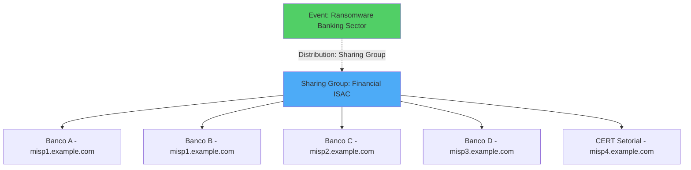

!!! tip "Boas Práticas de Sharing Groups"
    - Criar grupos baseados em **setores** (financeiro, energia, saúde)
    - Criar grupos baseados em **geografia** (LATAM, EU, APAC)
    - Criar grupos baseados em **incidentes** (campanha específica)
    - Criar grupos baseados em **tipo de org** (CERTs, MSPs, enterprises)

### ISACs e Comunidades Setoriais

**ISAC (Information Sharing and Analysis Center)** são comunidades setoriais que compartilham threat intelligence.

#### ISACs Globais Utilizando MISP

| Setor | ISAC | Região | Foco |
|-------|------|--------|------|
| **Financeiro** | FS-ISAC | Global | Bancos, seguradoras, fintech |
| **Energia** | E-ISAC | Global | Energia elétrica, óleo, gás |
| **Saúde** | H-ISAC | Global | Hospitais, farmacêuticas |
| **Aviação** | A-ISAC | Global | Companhias aéreas, aeroportos |
| **Automotivo** | Auto-ISAC | Global | Montadoras, fornecedores |
| **Telecomunicações** | Telecom ISAC | Global | Operadoras, equipamentos |
| **Educação** | EI-ISAC | US/Global | Universidades, escolas |
| **Varejo** | RH-ISAC | US/Global | Lojas, e-commerce |

!!! example "Modelo de ISAC com MISP"
    ```yaml
    ISAC: Financial Sector ISAC - América Latina

    Membros:
      - 45 instituições financeiras
      - 3 CERTs setoriais
      - 2 vendors de segurança

    Instâncias MISP:
      - misp-latam.fs-isac.org (central)
      - Instâncias locais de cada membro (sincronizadas)

    Sharing Groups:
      - FS-ISAC LATAM - All Members
      - FS-ISAC LATAM - Tier 1 Banks
      - FS-ISAC LATAM - CERTs Only
      - FS-ISAC Global - Cross-region

    Volume:
      - 500-1000 events/mês
      - 10,000-50,000 attributes/mês
      - Correlação de 70-80% de campanhas
    ```

## Por Que Usar MISP na Stack NEO_NETBOX_ODOO?

### Integração com a Stack

O MISP se integra perfeitamente com os outros componentes da stack para criar uma plataforma completa de defesa cibernética:

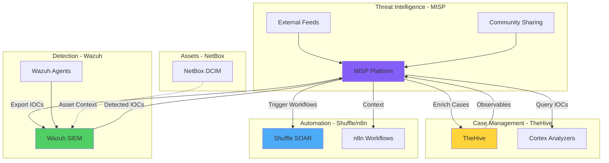

### Casos de Uso na Stack

=== "1. IOCs para Detecção"
    ```yaml
    Fluxo:
      1. MISP recebe IOCs de feeds e comunidade
      2. IOCs são exportados para Wazuh CDB lists
      3. Wazuh agents comparam logs com IOCs
      4. Match de IOC gera alerta de alta prioridade
      5. TheHive cria caso automaticamente
      6. Shuffle orquestra resposta

    Benefício:
      - Detecção proativa de ameaças conhecidas
      - Redução de tempo de detecção de dias para minutos
      - Contexto imediato sobre a ameaça
    ```

=== "2. Enriquecimento de Casos"
    ```yaml
    Fluxo:
      1. TheHive recebe alerta com observable (IP, hash, domain)
      2. Cortex analyzer consulta MISP
      3. MISP retorna:
         - Events relacionados ao observable
         - Contexto (malware family, campaign, TTPs)
         - Threat actor attribution
         - Sightings de outras organizações
      4. Analista tem contexto completo para resposta

    Benefício:
      - Decisões informadas por inteligência
      - Compreensão do escopo da ameaça
      - Priorização baseada em contexto
    ```

=== "3. Compartilhamento de Incidentes"
    ```yaml
    Fluxo:
      1. Organização detecta campanha de ataque
      2. Analista cria Event no MISP com IOCs
      3. Event é tagueado e classificado (TLP, PAP)
      4. MISP sincroniza com instâncias de parceiros
      5. Outras organizações recebem IOCs proativamente
      6. Bloqueiam ataque antes de serem afetadas

    Benefício:
      - Defesa coletiva contra ameaças
      - Organizações menores se beneficiam
      - Redução de impacto de campanhas
    ```

=== "4. Threat Hunting"
    ```yaml
    Fluxo:
      1. Analista busca TTPs no MISP (ex: PowerShell + Scheduled Task)
      2. MISP retorna campaigns usando essas TTPs
      3. Analista extrai IOCs e técnicas associadas
      4. Cria queries de hunting no Wazuh
      5. Descobre atividade suspeita não detectada
      6. Adiciona novos IOCs ao MISP

    Benefício:
      - Caça proativa de ameaças
      - Descoberta de compromissos antigos
      - Melhoria contínua de detecções
    ```

### Vantagens Estratégicas

!!! success "Por Que MISP?"
    **1. Open Source e Extensível**
    - Sem custos de licenciamento
    - Código auditável
    - Comunidade ativa de desenvolvedores
    - Integrações abundantes

    **2. Padrões Abertos**
    - STIX/TAXII compliant
    - MITRE ATT&CK nativo
    - APIs REST completas
    - Interoperabilidade garantida

    **3. Comunidade Global**
    - 6000+ instâncias ativas
    - Milhões de IOCs compartilhados
    - Feeds gratuitos e comerciais
    - Suporte da comunidade

    **4. Flexibilidade**
    - On-premises ou cloud
    - Single ou multi-tenant
    - Customizável para qualquer setor
    - Escalável para qualquer tamanho

    **5. Integração Profunda**
    - Wazuh, Suricata, Snort
    - TheHive, Cortex
    - SIEM (Splunk, ELK, QRadar)
    - Firewalls, EDR, SOAR

## Comparação com Outras Plataformas de TI

| Característica | MISP | OpenCTI | AlienVault OTX | MITRE ATT&CK Navigator | Anomali ThreatStream |
|----------------|------|---------|----------------|------------------------|----------------------|
| **Tipo** | TIP open-source | TIP graph-based | Crowd-sourced TI | Framework visualization | TIP comercial |
| **Licença** | AGPL (free) | Apache 2.0 (free) | Free (cloud) | Apache 2.0 (free) | Comercial |
| **Compartilhamento** | P2P entre instâncias | Graph sync | Cloud central | N/A | Cloud central |
| **IOC Focus** | ✅ Excelente | ✅ Excelente | ✅ Bom | ❌ Não | ✅ Excelente |
| **TTPs Focus** | ✅ MITRE nativo | ✅ Graph-based | ⚠️ Limitado | ✅ Especializado | ✅ Bom |
| **STIX/TAXII** | ✅ Completo | ✅ Nativo | ⚠️ Limitado | ❌ Não | ✅ Completo |
| **On-Premises** | ✅ Sim | ✅ Sim | ❌ Cloud only | ✅ Sim | ⚠️ Enterprise only |
| **API** | ✅ REST completa | ✅ GraphQL | ✅ REST | ⚠️ Limitada | ✅ REST completa |
| **Comunidade** | ✅ Muito grande | ✅ Crescendo | ✅ Grande | ✅ Grande | ⚠️ Comercial |
| **Melhor Para** | Sharing, IOCs | Intel estratégica | Crowd intel | Mapeamento TTPs | Enterprise TI |

!!! tip "Quando Usar Cada Plataforma?"
    - **MISP**: Foco em compartilhamento de IOCs, comunidades, ISACs, operacional
    - **OpenCTI**: Foco em threat actors, campanhas estratégicas, graph analysis
    - **OTX**: Foco em inteligência crowd-sourced, gratuita, cloud
    - **ATT&CK Navigator**: Foco em visualizar e mapear TTPs, coverage de detecções
    - **ThreatStream**: Foco em enterprises com budget, integração comercial

### MISP vs OpenCTI: Qual Escolher?

Ambos são excelentes. **Podem coexistir!**

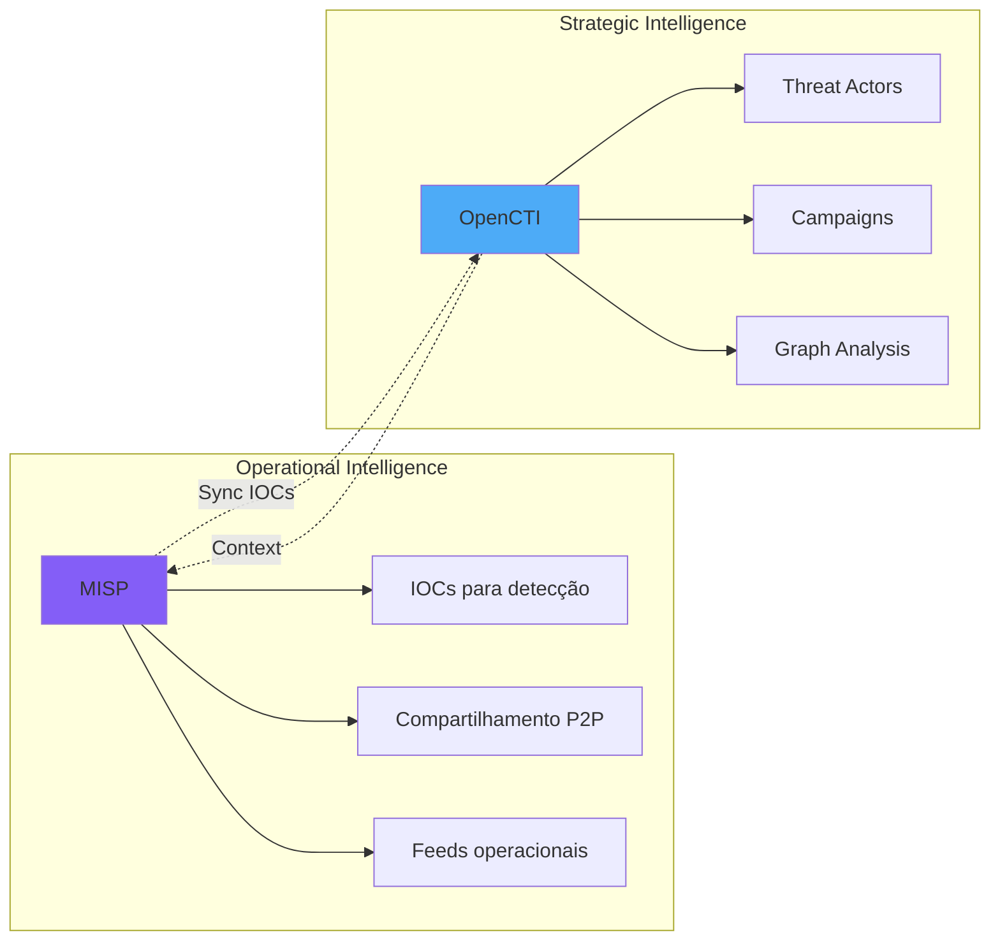

!!! example "Stack Ideal"
    ```yaml
    Cenário: Enterprise Security Operations

    Stack:
      - MISP: IOCs operacionais, detecção diária, compartilhamento
      - OpenCTI: Threat actors, campanhas estratégicas, CTI reporting
      - MITRE ATT&CK Navigator: Coverage de detecções, gaps analysis
      - TheHive: Case management, incident response
      - Cortex: Analyzers, enriquecimento automático

    Resultado: Cobertura completa de Threat Intelligence!
    ```

## Próximos Passos

Agora que você compreende o que é MISP e seus conceitos fundamentais, prossiga para:

1. **[Setup e Instalação](setup.md)** - Instalar e configurar sua instância MISP
2. **[Gestão de Threat Intelligence](threat-intelligence.md)** - Criar events, attributes, objects
3. **[Compartilhamento](sharing.md)** - Configurar sharing groups e sincronização
4. **[Integração com Stack](integration-stack.md)** - Integrar MISP com Wazuh, TheHive, etc
5. **[Casos de Uso](use-cases.md)** - Exemplos práticos detalhados
6. **[API Reference](api-reference.md)** - Automatizar operações via API

!!! quote "Lembre-se"
    "Threat Intelligence não é sobre ter mais dados, é sobre ter os dados certos, no momento certo, para as pessoas certas, para tomar as decisões certas." - Paradigma do MISP

---

**Documentação**: NEO_NETBOX_ODOO Stack
**Versão**: 1.0
**Última Atualização**: 2025-12-05
