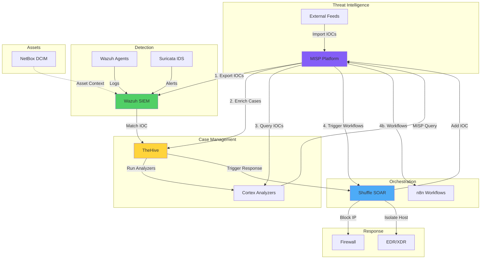
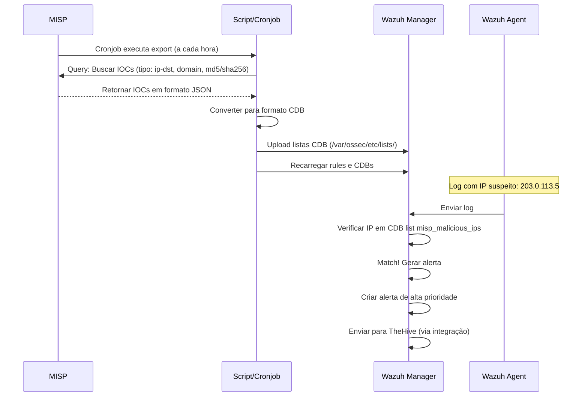
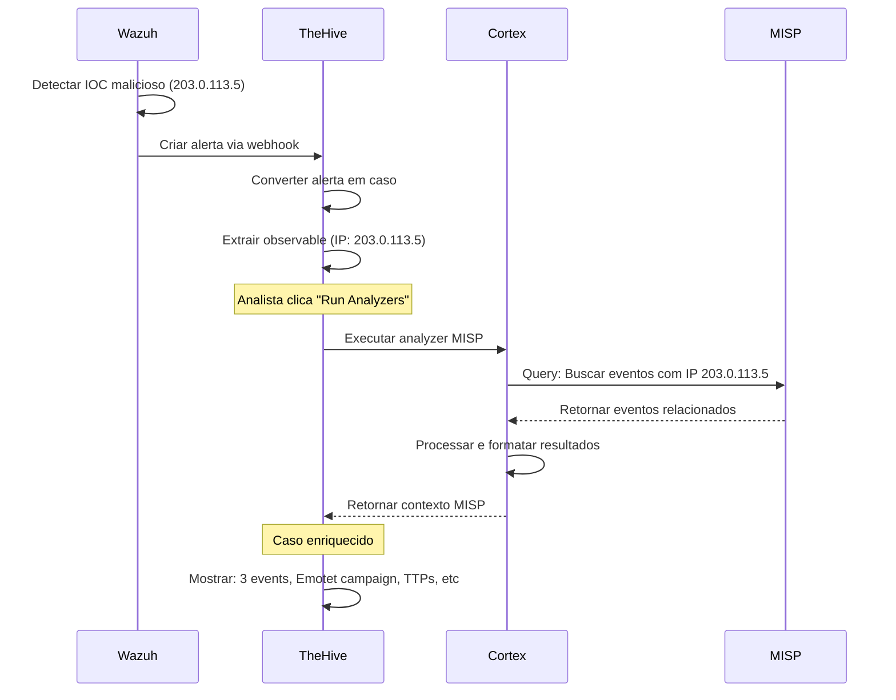
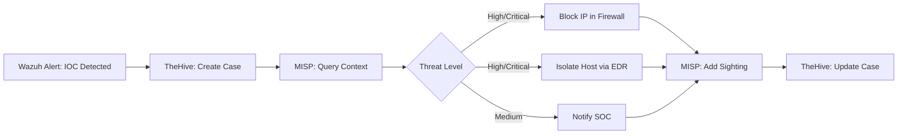

# Integração MISP com a Stack NEO_NETBOX_ODOO

## Visão Geral

Este guia demonstra como integrar o MISP com os outros componentes da stack para criar um ecossistema completo de Threat Intelligence e resposta a incidentes.

!!! abstract "Objetivos deste Guia"
    - Integrar MISP com Wazuh para detecção de IOCs
    - Integrar MISP com TheHive para enriquecimento de casos
    - Integrar MISP com Cortex para análise automatizada
    - Integrar MISP com Shuffle/n8n para orquestração SOAR
    - Configurar feeds recomendados
    - Exportar IOCs para listas CDB do Wazuh
    - Automatizar bloqueio de ameaças
    - Implementar casos de uso end-to-end

## Arquitetura de Integração Completa



## MISP ↔ Wazuh: Detecção de IOCs

### Objetivo

Exportar IOCs do MISP para listas CDB do Wazuh, permitindo que agents detectem automaticamente IPs, domínios e hashes maliciosos em logs.

### Fluxo de Integração



### Implementação

#### 1. Instalar PyMISP no Wazuh Manager

```bash
# SSH no Wazuh Manager
ssh wazuh-manager

# Instalar Python3 e pip (se não estiver)
sudo apt-get update
sudo apt-get install -y python3 python3-pip

# Instalar PyMISP
sudo pip3 install pymisp
```

#### 2. Criar Script de Export

```python title="/var/ossec/integrations/misp_to_wazuh.py"
#!/usr/bin/env python3
"""
MISP to Wazuh IOC Export
Exporta IOCs do MISP para listas CDB do Wazuh
"""

import os
import json
from pymisp import PyMISP
from datetime import datetime, timedelta

# Configuração
MISP_URL = 'https://misp.exemplo.com'
MISP_KEY = 'YOUR_MISP_API_KEY_HERE'
MISP_VERIFYCERT = True

WAZUH_CDB_DIR = '/var/ossec/etc/lists'
WAZUH_BIN = '/var/ossec/bin'

# Arquivos de saída
OUTPUT_FILES = {
    'ip': os.path.join(WAZUH_CDB_DIR, 'misp_malicious_ips'),
    'domain': os.path.join(WAZUH_CDB_DIR, 'misp_malicious_domains'),
    'md5': os.path.join(WAZUH_CDB_DIR, 'misp_malicious_hashes_md5'),
    'sha256': os.path.join(WAZUH_CDB_DIR, 'misp_malicious_hashes_sha256'),
}

def connect_misp():
    """Conectar ao MISP"""
    misp = PyMISP(MISP_URL, MISP_KEY, MISP_VERIFYCERT)
    return misp

def fetch_iocs(misp, ioc_type, days=30):
    """
    Buscar IOCs do MISP

    Args:
        misp: Instância PyMISP
        ioc_type: Tipo de IOC (ip-dst, domain, md5, sha256)
        days: Buscar IOCs dos últimos N dias

    Returns:
        Lista de IOCs
    """
    # Data de busca (últimos N dias)
    date_from = (datetime.now() - timedelta(days=days)).strftime('%Y-%m-%d')

    # Query MISP
    result = misp.search(
        controller='attributes',
        type_attribute=ioc_type,
        date_from=date_from,
        to_ids=True,  # Apenas IOCs marcados para IDS
        published=True,  # Apenas events publicados
        deleted=False,
        pythonify=False
    )

    iocs = []
    if 'Attribute' in result:
        for attr in result['Attribute']:
            value = attr.get('value', '').strip()
            event_info = attr.get('Event', {}).get('info', 'Unknown Event')

            # Para listas CDB do Wazuh: valor:descrição
            iocs.append(f"{value}:MISP - {event_info}")

    return iocs

def write_cdb_list(filename, iocs):
    """Escrever lista CDB do Wazuh"""
    with open(filename, 'w') as f:
        for ioc in iocs:
            f.write(f"{ioc}\n")

    print(f"[+] Escrito {len(iocs)} IOCs em {filename}")

def main():
    print(f"[*] Iniciando export MISP → Wazuh - {datetime.now()}")

    # Conectar ao MISP
    try:
        misp = connect_misp()
        print("[+] Conectado ao MISP com sucesso")
    except Exception as e:
        print(f"[-] Erro ao conectar ao MISP: {e}")
        return

    # Mapear tipos de IOC para tipos de attribute do MISP
    ioc_types = {
        'ip': 'ip-dst',
        'domain': 'domain',
        'md5': 'md5',
        'sha256': 'sha256',
    }

    # Buscar e exportar cada tipo de IOC
    for key, misp_type in ioc_types.items():
        print(f"\n[*] Buscando IOCs do tipo: {misp_type}")
        try:
            iocs = fetch_iocs(misp, misp_type, days=30)

            if iocs:
                write_cdb_list(OUTPUT_FILES[key], iocs)
            else:
                print(f"[!] Nenhum IOC encontrado para tipo: {misp_type}")

        except Exception as e:
            print(f"[-] Erro ao processar tipo {misp_type}: {e}")

    # Recarregar listas CDB no Wazuh
    print("\n[*] Recarregando listas CDB no Wazuh...")
    os.system(f"{WAZUH_BIN}/wazuh-control restart")

    print(f"\n[+] Export concluído - {datetime.now()}")

if __name__ == '__main__':
    main()
```

**Ajustar permissões**:

```bash
sudo chown root:wazuh /var/ossec/integrations/misp_to_wazuh.py
sudo chmod 750 /var/ossec/integrations/misp_to_wazuh.py

# Editar e adicionar sua MISP API key
sudo nano /var/ossec/integrations/misp_to_wazuh.py
```

#### 3. Criar Rules do Wazuh

```xml title="/var/ossec/etc/rules/local_rules.xml"
<!-- MISP IOC Detection Rules -->

<group name="misp,threat_intelligence,">

  <!-- Rule: Malicious IP Detected -->
  <rule id="100100" level="10">
    <if_matched_sid>1002</if_matched_sid>
    <list field="srcip" lookup="address_match_key">etc/lists/misp_malicious_ips</list>
    <description>MISP: Malicious source IP detected - $(srcip)</description>
    <group>misp,malicious_ip,</group>
  </rule>

  <rule id="100101" level="10">
    <if_matched_sid>1002</if_matched_sid>
    <list field="dstip" lookup="address_match_key">etc/lists/misp_malicious_ips</list>
    <description>MISP: Connection to malicious destination IP - $(dstip)</description>
    <group>misp,malicious_ip,c2_communication,</group>
  </rule>

  <!-- Rule: Malicious Domain Detected -->
  <rule id="100110" level="10">
    <if_matched_sid>1002</if_matched_sid>
    <list field="url" lookup="match_key">etc/lists/misp_malicious_domains</list>
    <description>MISP: Access to malicious domain detected - $(url)</description>
    <group>misp,malicious_domain,phishing,</group>
  </rule>

  <!-- Rule: Malicious File Hash Detected (MD5) -->
  <rule id="100120" level="12">
    <if_matched_sid>554</if_matched_sid>
    <list field="md5" lookup="match_key">etc/lists/misp_malicious_hashes_md5</list>
    <description>MISP: Malicious file detected by MD5 hash - $(md5)</description>
    <group>misp,malware,file_integrity,</group>
  </rule>

  <!-- Rule: Malicious File Hash Detected (SHA256) -->
  <rule id="100121" level="12">
    <if_matched_sid>554</if_matched_sid>
    <list field="sha256" lookup="match_key">etc/lists/misp_malicious_hashes_sha256</list>
    <description>MISP: Malicious file detected by SHA256 hash - $(sha256)</description>
    <group>misp,malware,file_integrity,</group>
  </rule>

  <!-- Rule: Multiple MISP IOC Detections (Correlation) -->
  <rule id="100150" level="14" frequency="3" timeframe="300">
    <if_matched_group>misp</if_matched_group>
    <description>MISP: Multiple IOC detections in short timeframe - Possible active compromise</description>
    <group>misp,correlation,active_response,</group>
  </rule>

</group>
```

#### 4. Configurar Listas CDB no Wazuh

```xml title="/var/ossec/etc/ossec.conf"
<!-- Adicionar dentro de <ossec_config> -->

<ruleset>
  <!-- Outras regras... -->

  <!-- MISP CDB Lists -->
  <list>etc/lists/misp_malicious_ips</list>
  <list>etc/lists/misp_malicious_domains</list>
  <list>etc/lists/misp_malicious_hashes_md5</list>
  <list>etc/lists/misp_malicious_hashes_sha256</list>
</ruleset>
```

#### 5. Automatizar Export (Cronjob)

```bash
# Editar crontab do root
sudo crontab -e

# Adicionar linha (executar a cada hora)
0 * * * * /var/ossec/integrations/misp_to_wazuh.py >> /var/log/misp_to_wazuh.log 2>&1
```

#### 6. Testar Integração

```bash
# Executar script manualmente
sudo /var/ossec/integrations/misp_to_wazuh.py

# Verificar listas criadas
ls -lh /var/ossec/etc/lists/misp_*

# Verificar conteúdo
head /var/ossec/etc/lists/misp_malicious_ips

# Reiniciar Wazuh
sudo /var/ossec/bin/wazuh-control restart

# Simular detecção (exemplo: conectar a IP malicioso via curl)
curl http://203.0.113.5

# Verificar alerta no Wazuh
tail -f /var/ossec/logs/alerts/alerts.json | jq .
```

### Active Response: Bloqueio Automático

Configure active response para bloquear automaticamente IPs maliciosos:

```xml title="/var/ossec/etc/ossec.conf"
<active-response>
  <command>firewall-drop</command>
  <location>local</location>
  <rules_id>100101</rules_id>  <!-- Rule: Connection to malicious IP -->
  <timeout>3600</timeout>  <!-- Bloquear por 1 hora -->
</active-response>
```

!!! warning "Cuidado com Active Response"
    Active response pode gerar falsos positivos e bloquear serviços legítimos. Teste extensivamente antes de habilitar em produção.

## MISP ↔ TheHive: Enriquecimento de Casos

### Objetivo

Quando o Wazuh detecta um IOC do MISP e cria um alerta, automaticamente:
1. TheHive cria um caso
2. Cortex analyzer consulta MISP para contexto
3. Analista recebe caso enriquecido com informações de TI

### Fluxo de Integração



### Implementação

#### 1. Configurar MISP Analyzer no Cortex

**Arquivo de configuração**:

```json title="/opt/cortex/application.conf"
## MISP Analyzer Configuration
analyzer {
  # ... outras configurações ...

  urls = [
    "https://github.com/TheHive-Project/Cortex-Analyzers"
  ]

  # Configuração do MISP
  MISP_2_1 {
    url = "https://misp.exemplo.com"
    key = "YOUR_MISP_API_KEY"
    certpath = "/path/to/cert.pem"  # Opcional, para cert auto-assinado
  }
}
```

**Recarregar Cortex**:

```bash
docker restart cortex
# ou
sudo systemctl restart cortex
```

#### 2. Habilitar Analyzer na Interface Cortex

```
Cortex Web UI > Organization > Analyzers
Buscar: MISP
Habilitar: MISP_2_1
Configurar:
  - url: https://misp.exemplo.com
  - key: <API key>
  - certpath: (se necessário)
Save
```

#### 3. Configurar TheHive para Auto-Enriquecer

```json title="/opt/thehive/application.conf"
## Auto-enrich observables with Cortex
play.http.filters = org.thp.thehive.services.Filters

# Configuração Cortex
cortex {
  servers = [
    {
      name = "Local Cortex"
      url = "http://cortex:9001"
      auth {
        type = "bearer"
        key = "CORTEX_API_KEY"
      }
    }
  ]

  # Auto-run analyzers
  autoRun = true
  autoRunFilters = {
    "MISP_2_1" = ["ip", "domain", "hash"]
  }
}
```

#### 4. Testar Enriquecimento

**Criar caso manualmente no TheHive**:

```
Cases > New Case
Title: Test MISP Enrichment
Add Observable:
  - Type: ip
  - Value: 203.0.113.5 (usar IP presente no MISP)

No observable > Run Analyzers > MISP_2_1
Aguardar execução
Ver Report: Mostra events do MISP relacionados
```

### Criar Template de Caso com MISP

Template para casos gerados por detecção MISP:

```json title="TheHive Case Template: MISP IOC Detection"
{
  "name": "MISP IOC Detection",
  "displayName": "Detecção de IOC do MISP",
  "titlePrefix": "[MISP]",
  "description": "Caso criado automaticamente após detecção de IOC presente no MISP",
  "severity": 3,
  "tags": ["misp", "ioc-detection", "automated"],
  "tasks": [
    {
      "title": "Verificar alerta do Wazuh",
      "description": "Analisar o alerta original do Wazuh que disparou este caso"
    },
    {
      "title": "Analisar contexto MISP",
      "description": "Revisar informações de Threat Intelligence do MISP sobre este IOC"
    },
    {
      "title": "Investigar host afetado",
      "description": "Analisar logs e processos do host que contatou/foi contatado pelo IOC"
    },
    {
      "title": "Conter ameaça",
      "description": "Isolar host, bloquear IPs/domínios, remover malware"
    },
    {
      "title": "Documentar e reportar",
      "description": "Documentar achados e atualizar MISP com sightings"
    }
  ]
}
```

## MISP ↔ Cortex: Análise Automatizada

### Analyzers MISP Disponíveis

| Analyzer | Função | Input | Output |
|----------|--------|-------|--------|
| **MISP_2_1** | Buscar IOC no MISP | IP, domain, hash, email, URL | Events relacionados, contexto |
| **MISPWarningLists** | Verificar warninglists | IP, domain | True/False (é false positive?) |
| **MISP_Lookup** | Lookup simples | Qualquer IOC | Presença no MISP |

### Responder: Adicionar Sighting ao MISP

Criar **Responder** customizado para adicionar sighting ao MISP quando IOC é detectado:

```python title="/opt/cortex/responders/MISP_AddSighting.py"
#!/usr/bin/env python3
"""
Cortex Responder: MISP Add Sighting
Adiciona sighting ao MISP quando observable é confirmado
"""

from cortexutils.responder import Responder
from pymisp import PyMISP

class MISPAddSighting(Responder):
    def __init__(self):
        Responder.__init__(self)
        self.misp_url = self.get_param('config.url', None, 'MISP URL is missing')
        self.misp_key = self.get_param('config.key', None, 'MISP API key is missing')
        self.misp_verifycert = self.get_param('config.verifycert', True)

    def run(self):
        # Conectar ao MISP
        misp = PyMISP(self.misp_url, self.misp_key, self.misp_verifycert)

        # Obter dados do observable
        data_type = self.get_param('data.dataType')
        data_value = self.get_param('data.data')

        # Buscar attribute no MISP
        result = misp.search(controller='attributes', value=data_value, pythonify=False)

        if 'Attribute' in result and len(result['Attribute']) > 0:
            # Para cada attribute encontrado, adicionar sighting
            for attr in result['Attribute']:
                attr_id = attr['id']

                # Adicionar sighting
                sighting = {
                    'value': data_value,
                    'type': '0',  # 0 = sighting, 1 = false-positive, 2 = expiration
                    'source': 'TheHive + Cortex',
                    'timestamp': attr.get('timestamp', None)
                }

                misp.add_sighting(sighting, attribute_id=attr_id)

            self.report({'message': f'Sighting adicionado ao MISP para {len(result["Attribute"])} attributes'})
        else:
            self.error(f'IOC {data_value} não encontrado no MISP')

    def operations(self, raw):
        return [self.build_operation('AddSighting', tag='MISP:sighting-added')]

if __name__ == '__main__':
    MISPAddSighting().run()
```

## MISP ↔ Shuffle: Orquestração SOAR

### Objetivo

Usar Shuffle para orquestrar workflows automatizados envolvendo MISP:
- Detectar IOC → Buscar contexto no MISP → Bloquear → Atualizar MISP
- Novo event no MISP → Distribuir IOCs para ferramentas → Criar tickets
- Incidente no TheHive → Extrair IOCs → Adicionar ao MISP

### Workflows Recomendados

#### Workflow 1: IOC Detection → Response



**Implementação no Shuffle**:

```yaml
Workflow: MISP IOC Detection Response

Trigger: Webhook (Wazuh alerta via webhook)

Steps:

1. Parse Wazuh Alert:
   - App: Shuffle Tools
   - Action: Parse JSON
   - Input: $exec.text (webhook body)

2. Create TheHive Case:
   - App: TheHive
   - Action: Create Case
   - Title: "MISP IOC Detection - $wazuh_alert.rule.description"
   - Severity: High
   - Tags: ["misp", "auto-detection"]

3. Query MISP:
   - App: HTTP (ou MISP app se disponível)
   - Method: POST
   - URL: https://misp.exemplo.com/attributes/restSearch
   - Headers: Authorization: YOUR_API_KEY
   - Body:
     {
       "returnFormat": "json",
       "value": "$wazuh_alert.data.srcip"
     }

4. Evaluate Threat Level:
   - App: Shuffle Tools
   - Action: Filter
   - Condition: $misp_response.Event.threat_level_id in [1, 2]

5a. Block IP (if High threat):
   - App: HTTP / Firewall API
   - Action: Add to blocklist
   - IP: $wazuh_alert.data.srcip

5b. Isolate Host (if High threat):
   - App: EDR (CrowdStrike, SentinelOne, etc)
   - Action: Isolate host
   - Hostname: $wazuh_alert.agent.name

6. Add Sighting to MISP:
   - App: HTTP
   - Method: POST
   - URL: https://misp.exemplo.com/sightings/add
   - Body:
     {
       "value": "$wazuh_alert.data.srcip",
       "source": "Wazuh + Shuffle",
       "type": "0"
     }

7. Update TheHive Case:
   - App: TheHive
   - Action: Create Task
   - Case ID: $thehive_case.id
   - Task: "Resposta automatizada concluída: IP bloqueado"
```

#### Workflow 2: Enrichment Request

```yaml
Workflow: MISP Enrichment on Demand

Trigger: TheHive Webhook (observable created)

Steps:

1. Parse Observable:
   - Extract type and value

2. Query MISP:
   - Search for observable value

3. Parse MISP Response:
   - Extract events, TTPs, threat actors

4. Update TheHive Observable:
   - Add tags from MISP
   - Add custom fields with context

5. Create Report:
   - Generate markdown report with MISP findings
   - Attach to TheHive case
```

#### Workflow 3: Export IOCs to Multiple Systems

```yaml
Workflow: MISP IOC Distribution

Trigger: MISP Webhook (new event published)

Steps:

1. Parse MISP Event:
   - Extract all attributes (IPs, domains, hashes)

2. Filter by Type:
   - IPs → Send to firewall
   - Domains → Send to DNS filter (Pi-hole, pfSense)
   - Hashes → Send to EDR

3. Update Wazuh CDBs:
   - Trigger /var/ossec/integrations/misp_to_wazuh.py

4. Update Suricata Rules:
   - Generate Suricata rules from IOCs
   - Reload Suricata

5. Notify SOC:
   - Send summary email/Slack message
```

### Implementar no Shuffle

**Passo 1**: Criar Workflow no Shuffle

```
Shuffle Web UI > Workflows > New Workflow
Nome: MISP IOC Detection Response
```

**Passo 2**: Adicionar Apps

```
- Webhook (trigger)
- Shuffle Tools (parsing, logic)
- HTTP (para chamar MISP API)
- TheHive
- (Opcional) Firewall, EDR apps
```

**Passo 3**: Configurar Webhook Trigger

```
Webhook URL: https://shuffle.exemplo.com/api/v1/hooks/YOUR_WEBHOOK_ID
Configurar Wazuh para enviar alertas:

/var/ossec/etc/ossec.conf:
<integration>
  <name>shuffle</name>
  <hook_url>https://shuffle.exemplo.com/api/v1/hooks/YOUR_WEBHOOK_ID</hook_url>
  <level>10</level>
  <rule_id>100100,100101,100110</rule_id>  <!-- Rules MISP -->
  <alert_format>json</alert_format>
</integration>
```

**Passo 4**: Configurar Steps (ver workflows acima)

**Passo 5**: Testar Workflow

```
Shuffle > Workflow > Run > Manual Test
Input: JSON de exemplo de alerta Wazuh
Ver execução passo a passo
Debugar erros
```

## MISP ↔ n8n: Automação de Workflows

n8n é alternativa ao Shuffle, mais visual e com muitos nodes pré-construídos.

### Workflow n8n: Auto-import de IOCs

```
Nodes:

1. Schedule Trigger (Cron: 0 * * * * - a cada hora)
   ↓
2. HTTP Request - Query MISP
   - Method: POST
   - URL: https://misp.exemplo.com/attributes/restSearch
   - Authentication: Header Auth (Authorization: YOUR_API_KEY)
   - Body:
     {
       "returnFormat": "json",
       "type": ["ip-dst", "domain"],
       "date_from": "-1d",
       "to_ids": true,
       "published": true
     }
   ↓
3. Function - Parse MISP Response
   - Extrair apenas values de attributes
   - Remover duplicatas
   ↓
4. Split Out - Processar cada IOC individualmente
   ↓
5. Switch - Routing por tipo de IOC
   - IP → Branch A
   - Domain → Branch B
   ↓
Branch A (IPs):
6a. HTTP Request - Add to Firewall Blocklist
7a. HTTP Request - Add to Wazuh CDB

Branch B (Domains):
6b. HTTP Request - Add to DNS Filter
7b. HTTP Request - Add to Suricata rules

(Ambos)
   ↓
8. Function - Generate Summary Report
   ↓
9. Send Email/Slack - Notify SOC
```

## Feeds Recomendados

### Feeds Essenciais para Detecção

| Feed | URL | Foco | Atualização |
|------|-----|------|-------------|
| **CIRCL OSINT** | https://www.circl.lu/doc/misp/feed-osint/ | Mixed IOCs, curado | Diário |
| **abuse.ch URLhaus** | https://urlhaus.abuse.ch/downloads/csv_online/ | URLs maliciosas | Tempo real |
| **abuse.ch Feodo** | https://feodotracker.abuse.ch/downloads/ipblocklist.csv | Botnet C2 IPs | Diário |
| **ThreatFox** | https://threatfox.abuse.ch/export/ | IOCs recentes | Tempo real |
| **Malware Bazaar** | https://bazaar.abuse.ch/export/csv/recent/ | Hashes de malware | Diário |

### Configurar Feeds para Wazuh

Apenas feeds de **IPs, domínios e hashes** são úteis para Wazuh. Filtrar na configuração do feed:

```yaml
Feed Configuration (MISP):

Pull rules:
{
  "type": ["ip-dst", "ip-src", "domain", "md5", "sha256"],
  "to_ids": true
}

Tags to add:
  - feed:urlhaus (identificar origem)

Distribution:
  - Your organization only (não re-compartilhar feeds públicos)
```

## Casos de Uso End-to-End

### Caso 1: Detecção e Bloqueio Automatizado

```yaml
Cenário:
  - Wazuh agent detecta conexão a IP 203.0.113.5
  - IP está na lista CDB do MISP (C2 de Emotet)

Fluxo Automatizado:

1. Wazuh:
   - Rule 100101 dispara: "MISP: Connection to malicious destination IP"
   - Alerta de nível 10 (High)
   - Envia webhook para Shuffle

2. Shuffle (Workflow):
   - Recebe alerta
   - Cria caso no TheHive: "MISP IOC Detection - Emotet C2"
   - Consulta MISP para contexto adicional do IP
   - Bloqueia IP no firewall via API
   - Isola host afetado via EDR
   - Adiciona sighting ao MISP

3. TheHive:
   - Caso criado automaticamente
   - Cortex analyzer MISP executa
   - Enriquece com: Emotet campaign info, TTPs, threat actor

4. Analista (SOC):
   - Recebe notificação de caso High priority
   - Visualiza caso pré-enriquecido
   - Valida ações automatizadas
   - Investiga host para persistência
   - Documenta achados

Resultado:
  - Tempo de detecção → resposta: < 2 minutos
  - Contenção automática
  - Contexto completo para analista
  - MISP atualizado com sighting
```

### Caso 2: Sharing de IOCs Descobertos

```yaml
Cenário:
  - SOC descobre campanha de phishing via análise manual
  - Extrai IOCs do email malicioso

Fluxo:

1. Analista (TheHive):
   - Cria caso: "Phishing Campaign - Fake Invoice"
   - Adiciona observables: emails, domínios, hashes de anexo
   - Marca como "Confirmed - True Positive"

2. Shuffle (Workflow):
   - Trigger: TheHive case status = "Confirmed"
   - Extrai todos os observables do caso
   - Cria event no MISP:
     * Event Info: "Phishing Campaign - Fake Invoice"
     * Attributes: Todos os observables
     * Tags: tlp:amber, phishing, financial-fraud
     * Distribution: Connected communities

3. MISP:
   - Event criado automaticamente
   - Correlação automática encontra: 2 events similares de outras orgs
   - Sincroniza event com servidores conectados (ISAC, parceiros)

4. Organizações Parceiras:
   - Recebem event via sync
   - Importam IOCs para Wazuh CDBs automaticamente
   - Bloqueiam proativamente

Resultado:
  - Descoberta em Org A → Proteção em Orgs B, C, D em < 1 hora
  - Campanha mapeada coletivamente
  - Adversário tem infraestrutura queimada rapidamente
```

## Monitoramento da Integração

### Métricas Importantes

```yaml
MISP:
  - Total de events
  - IOCs exportados para Wazuh (por tipo)
  - Feeds ativos e atualizados
  - Sightings recebidos

Wazuh:
  - Alertas gerados por rules MISP (100100-100150)
  - Tamanho das listas CDB
  - Última atualização das listas

TheHive:
  - Casos criados por detecção MISP
  - Tempo médio de enriquecimento
  - Analyzers executados com sucesso

Shuffle:
  - Workflows executados
  - Taxa de sucesso/falha
  - Tempo médio de execução
```

### Dashboard Grafana

Criar dashboard para visualizar integração:

```yaml
Panels:

1. MISP IOCs by Type (Pie Chart):
   - Source: MISP API
   - Query: Count attributes by type

2. Wazuh MISP Alerts Timeline (Time Series):
   - Source: Elasticsearch (Wazuh alerts)
   - Query: rule.id: 100100 OR 100101 OR 100110...

3. TheHive Cases from MISP (Stat):
   - Source: TheHive API
   - Query: tag: misp

4. Shuffle Workflow Success Rate (Gauge):
   - Source: Shuffle API
   - Query: Workflow success/failure count

5. Top IOCs Detected (Table):
   - Source: Elasticsearch
   - Query: Aggregation on IOC values
```

## Próximos Passos

Agora que você integrou MISP com a stack:

1. **[Casos de Uso](use-cases.md)** - Exemplos práticos detalhados de uso conjunto
2. **[API Reference](api-reference.md)** - Automatizar operações via API/PyMISP

!!! tip "Lembre-se"
    A integração é mais eficaz quando automatizada, mas sempre mantenha o analista humano no loop para validação e decisões críticas.

---

**Documentação**: NEO_NETBOX_ODOO Stack - MISP
**Versão**: 1.0
**Última Atualização**: 2025-12-05
