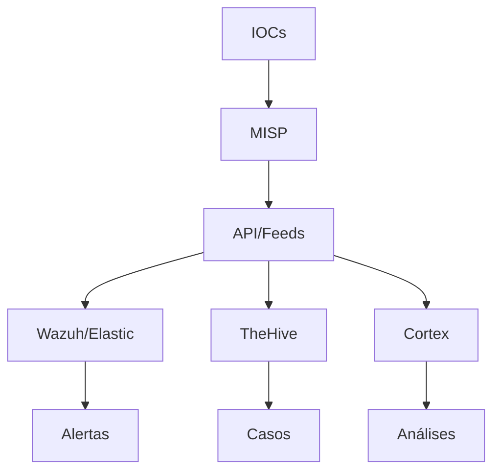

# MISP - Malware Information Sharing Platform

## Índice

1. [Introdução ao MISP](#1-introdução-ao-misp)
2. [Arquitetura e Integração](#2-arquitetura-e-integração)
3. [Instalação e Configuração](#3-instalação-e-configuração)
4. [Configuração Avançada](#4-configuração-avançada)
5. [Casos de Uso Práticos](#5-casos-de-uso-práticos)
6. [Integração com NeoAnd](#6-integração-com-neoand)
7. [Operação e Manutenção](#7-operação-e-manutenção)
8. [Segurança](#8-segurança)
9. [Referências e Recursos](#9-referências-e-recursos)

---

## 1. Introdução ao MISP

### 1.1 O que é MISP

O **MISP (Malware Information Sharing Platform)** é uma plataforma open source e gratuita de inteligência de ameaças (threat intelligence) projetada para facilitar o compartilhamento seguro e automático de indicadores de comprometimento (IOCs) e informações sobre malware entre organizações.

**Características principais:**

- **Open Source**: Licença desenvolvida pela comunidade
- **Multi-formato**: Suporte a JSON, CSV, STIX, OpenIOC e outros formatos
- **API RESTful**: Interface completa para automação e integração
- **Colaboração**: Sistema de organizações e sharing groups
- **Federação**: Conexão com outras instâncias MISP globalmente
- **Gratuito**: Sem custos de licenciamento

### 1.2 Para que serve

O MISP foi criado para resolver o problema da **fragmentação de inteligência de ameaças**. Ele permite que organizações:

1. **Coletem** indicadores de ameaça de múltiplas fontes
2. **Enriquecam** informações com contexto e dados de análise
3. **Distribuam** inteligência para sistemas de defesa
4. **Colaborem** com outras organizações em tempo real
5. **Automatizem** respostas baseadas em threat intelligence

### 1.3 Casos de Uso

#### 1.3.1 Compartilhamento de Threat Intelligence

```bash
# Exemplo: Compartilhar um novo IOC detectado
{
  "value": "malicious-domain.com",
  "type": "domain",
  "category": "Network activity",
  "distribution": "5",  # Compartilhamento com federação
  "org_id": "1",
  "Tag": [{"name": "APT29"}]
}
```

#### 1.3.2 Correlação de Incidentes

O MISP permite correlacionar:
- Eventos de SIEM (Elastic, Splunk, Wazuh)
- Alertas de EDR (CrowdStrike, Defender)
- Logs de rede
- Informações de threat feeds

#### 1.3.3 Automação de Resposta

Integração com ferramentas de SOAR para:
- Bloquear IPs maliciosos automaticamente
- Quarentena de arquivos
- Atualizar regras de firewall
- Alertas em tempo real

### 1.4 Benefícios

| Benefício | Descrição |
|-----------|-----------|
| **Detecção Antecipada** | Redução de 40-60% no tempo de detecção (MTTD) |
| **Resposta Rápida** | Automação de resposta reduz MTTR em 70% |
| **Colaboração** | Sharing seguro com CERTs e organizações parceiras |
| **Custo Reduzido** | Substitui soluções comerciais caras |
| **Flexibilidade** | Totalmente customizável para necessidades específicas |
| **Comunidade** | Suporte de uma comunidade ativa global |

---

## 2. Arquitetura e Integração

### 2.1 Como se integra na stack NeoAnd

A stack NeoAnd é uma arquitetura SOC moderna baseada em containers. O MISP integra-se em múltiplas camadas:

```
┌─────────────────────────────────────────────────────────┐
│                    Stack NeoAnd                         │
├─────────────────────────────────────────────────────────┤
│  MISP (Container)                                       │
│  ├── Web UI (Apache/Nginx)                              │
│  ├── PHP Application                                    │
│  └── MariaDB/MySQL                                      │
├─────────────────────────────────────────────────────────┤
│  Wazuh SIEM        │  TheHive (Cases)  │  Cortex        │
│  ├── Wazuh Manager │  ├── Alert Mgmt   │  └── Analyzers │
│  └── Wazuh Agents  │  ├── Case Mgmt    │      (VirusTotal, URLVoid) │
│                    │  └── Webhooks     │                 │
├─────────────────────────────────────────────────────────┤
│  ElasticSearch (Search & Analytics)                     │
│  ├── Logs Index                                         │
│  ├── Kibana (Dashboards)                                │
│  └── Logstash (Pipelines)                               │
└─────────────────────────────────────────────────────────┘
```

### 2.2 Arquitetura Técnica

#### 2.2.1 Componentes Principais

**Frontend (PHP/Web UI):**
- Interface web responsiva
- API REST para integrações
- Módulos de upload/download
- Sistema de notificações

**Backend (PHP):**
- Lógica de negócio
- Gerenciamento de IOCs
- Sync de federação
- Geração de relatórios

**Banco de Dados (MariaDB/MySQL):**
- Armazenamento de eventos
- Metadata de IOCs
- Usuários e permissões
- Cache de dados

**Sistema de Arquivos:**
- Upload de amostras de malware
- Anexos de evidências
- Cache de feeds

#### 2.2.2 Fluxo de Dados



### 2.3 Relação com TheHive e Cortex

#### 2.3.1 Integração MISP-TheHive

O TheHive usa MISP como fonte de threat intelligence para criar casos automaticamente:

```json
{
  "title": "Alerta de malware detectado",
  "description": "IOC recebido do MISP",
  "artifacts": [
    {
      "dataType": "file",
      "data": "malware-sample.exe",
      "tlp": 2
    }
  ],
  "attributes": [
    {
      "type": "MISP",
      "source": "https://misp.example.com"
    }
  ]
}
```

**Benefícios da Integração:**

1. **Casos Contextualizados**: Cada caso TheHive recebe contexto do MISP
2. **Tags Compartilhadas**: MISP tags são sincronizadas
3. **IOCs Associados**: Automaticamente linka IOCs ao caso
4. **Timeline Unificada**: Histórico de TI e caso no mesmo lugar

#### 2.3.2 Integração MISP-Cortex

O Cortex analisa IOCs do MISP:

```bash
# Exemplo de análise automática
curl -X POST \
  https://cortex.example.com/api/analyzer/VirusTotal_GetReport/file \
  -H "Authorization: Bearer ${TOKEN}" \
  -d '{
    "dataType": "file",
    "data": "${IOC_HASH}"
  }'
```

**Analisadores Comuns:**

- **VirusTotal**: Scan de arquivos e URLs
- **URLVoid**: Análise de reputação
- **PassiveTotal**: DNS e WHOIS
- **MalwareBazaar**: Amostras de malware
- **AbuseIPDB**: Reputação de IPs

#### 2.3.3 Arquitetura Integrada (MISP + TheHive + Cortex)

```yaml
# docker-compose.yml snippet
misp:
  image: coolacid/misp-docker
  environment:
    - MYSQL_ROOT_PASSWORD=${MISP_DB_PASSWORD}
    - MISP_FQDN=${MISP_FQDN}
  ports:
    - "8080:80"

thehive:
  image: thehiveproject/thehive4
  depends_on:
    - cassandra
  environment:
    - THEHIVE_MONITOR_PROC=${MISP_WEBHOOK_KEY}

cortex:
  image: thehiveproject/cortex
  depends_on:
    - elasticsearch
  environment:
    - CORTEX_ES=${ELASTIC_URL}

cassandra:
  image: cassandra:3.11

elasticsearch:
  image: docker.elastic.co/elasticsearch/elasticsearch:7.17.9
```

---

## 3. Instalação e Configuração

### 3.1 Requisitos do Sistema

#### 3.1.1 Hardware Mínimo

| Componente | Desenvolvimento | Produção |
|------------|-----------------|----------|
| **CPU** | 2 cores | 4+ cores |
| **RAM** | 4 GB | 8-16 GB |
| **Disco** | 20 GB | 100-500 GB |
| **Rede** | 100 Mbps | 1 Gbps |

#### 3.1.2 Software

- **OS**: Ubuntu 20.04+ / CentOS 8+ / Debian 11+
- **PHP**: 7.4+ (recomendado 8.1+)
- **MariaDB**: 10.6+ ou MySQL 8.0+
- **Web Server**: Apache 2.4+ ou Nginx 1.18+
- **Python**: 3.8+ (para scripts de sincronização)

### 3.2 Processo de Instalação Detalhado

#### 3.2.1 Instalação no Ubuntu 20.04

**Passo 1: Atualizar o sistema**

```bash
sudo apt update && sudo apt upgrade -y
sudo apt install -y curl wget git gnupg2 software-properties-common
```

**Passo 2: Instalar MariaDB**

```bash
sudo apt install -y mariadb-server mariadb-client
sudo mysql_secure_installation
```

**Configurar MariaDB:**

```sql
sudo mysql -u root -p

CREATE DATABASE misp_db;
CREATE USER 'misp_user'@'localhost' IDENTIFIED BY 'SenhaSegura123!';
GRANT ALL PRIVILEGES ON misp_db.* TO 'misp_user'@'localhost';
FLUSH PRIVILEGES;
EXIT;
```

**Passo 3: Instalar Apache e PHP**

```bash
sudo apt install -y apache2 libapache2-mod-php php php-cli php-dev \
  php-json php-mysql php-xml php-mbstring php-gd php-zip \
  php-curl php-intl python3-pip libyara-dev php-redis redis-server

# Verificar versão do PHP
php -v
```

**Passo 4: Instalar MISP**

```bash
# Clone o repositório
cd /var/www/
sudo git clone https://github.com/MISP/MISP.git
cd MISP
sudo git config core.filemode false

# Definir permissões
sudo chown -R www-data:www-data /var/www/MISP
sudo chmod -R 750 /var/www/MISP

# Instalar dependências PHP
sudo -H -u www-data git clone https://github.com/viper-framework/viper-python3.git /var/www/MISP/viper
sudo -H -u www-data git clone https://github.com/viper-framework/viper-yararules.git /var/www/MISP/yararules

# Executar setup do MISP
sudo -u www-data php /var/www/MISP/app/Console/cake install
```

**Passo 5: Configurar Apache**

```bash
sudo cp /var/www/MISP/INSTALL/misp.rhel.conf /etc/apache2/sites-available/misp-ssl.conf
sudo a2ensite misp-ssl.conf
sudo a2enmod rewrite
sudo a2enmod ssl
sudo systemctl reload apache2
```

**Passo 6: Configurar MISP**

```bash
# Editar configuração
sudo nano /var/www/MISP/app/Config/config.php

# Adicionar configurações de email
Config::$database = [
    'host' => 'localhost',
    'database' => 'misp_db',
    'login' => 'misp_user',
    'password' => 'SenhaSegura123!',
    'port' => 3306
];

Config::$email = [
    'transport' => 'Smtp',
    'from' => 'misp@empresa.com',
    'smtp_options' => [
        'host' => 'smtp.empresa.com',
        'port' => 587,
        'timeout' => 60,
        'username' => 'smtp_user',
        'password' => 'smtp_password'
    ]
];
```

**Passo 7: Configurar cron jobs**

```bash
sudo crontab -e

# Adicionar as linhas:
*/5 * * * * www-data /usr/bin/php /var/www/MISP/app/Console/cake synchrotron >> /dev/null 2>&1
0 2 * * * www-data /usr/bin/php /var/www/MISP/app/Console/cake admin massUpdateContext >> /dev/null 2>&1
*/15 * * * * www-data /usr/bin/php /var/www/MISP/app/Console/cake event尖锐 >> /dev/null 2>&1
```

**Passo 8: Reiniciar serviços**

```bash
sudo systemctl restart apache2
sudo systemctl restart redis-server
sudo systemctl enable apache2
sudo systemctl enable mariadb
```

### 3.3 Configuração com Docker

#### 3.3.1 Docker Compose Completo

Criar arquivo `docker-compose-misp.yml`:

```yaml
version: '3.8'

services:
  misp-db:
    image: mariadb:10.6
    container_name: misp-db
    restart: unless-stopped
    environment:
      - MYSQL_ROOT_PASSWORD=${MISP_DB_ROOT_PASSWORD}
      - MYSQL_DATABASE=${MISP_DB_NAME}
      - MYSQL_USER=${MISP_DB_USER}
      - MYSQL_PASSWORD=${MISP_DB_PASSWORD}
    volumes:
      - misp-db-data:/var/lib/mysql
      - ./init-db.sql:/docker-entrypoint-initdb.d/init.sql
    networks:
      - misp-network

  misp:
    image: coolacid/misp-docker:2.4.169
    container_name: misp
    restart: unless-stopped
    depends_on:
      - misp-db
      - misp-redis
    environment:
      - MISP_FQDN=${MISP_FQDN}
      - MISP_BASEURL=${MISP_BASEURL}
      - MISP_DB_HOST=misp-db
      - MISP_DB_DATABASE=${MISP_DB_NAME}
      - MISP_DB_USER=${MISP_DB_USER}
      - MISP_DB_PASSWORD=${MISP_DB_PASSWORD}
      - MISP_REDIS_HOST=misp-redis
      - MISP_EMAIL=${MISP_EMAIL}
      - MISP_TIMEZONE=${MISP_TIMEZONE}
      - INITIAL_ADMIN_EMAIL=${INITIAL_ADMIN_EMAIL}
      - INITIAL_ADMIN_PASSWORD=${INITIAL_ADMIN_PASSWORD}
    ports:
      - "8080:80"
    volumes:
      - misp-data:/var/www/MISP
      - misp-logs:/var/www/MISP/logs
      - /var/www/MISP/.git
    networks:
      - misp-network

  misp-redis:
    image: redis:6-alpine
    container_name: misp-redis
    restart: unless-stopped
    volumes:
      - misp-redis-data:/data
    networks:
      - misp-network

  # Nginx Reverse Proxy
  misp-nginx:
    image: nginx:alpine
    container_name: misp-nginx
    restart: unless-stopped
    ports:
      - "80:80"
      - "443:443"
    volumes:
      - ./nginx.conf:/etc/nginx/nginx.conf:ro
      - ./ssl:/etc/nginx/ssl:ro
    depends_on:
      - misp
    networks:
      - misp-network

volumes:
  misp-db-data:
  misp-data:
  misp-logs:
  misp-redis-data:

networks:
  misp-network:
    driver: bridge
```

#### 3.3.2 Arquivo de Ambiente (.env)

Criar `.env`:

```bash
# MISP Configuration
MISP_FQDN=misp.empresa.com
MISP_BASEURL=https://misp.empresa.com
MISP_EMAIL=misp@empresa.com
MISP_TIMEZONE=America/Sao_Paulo

# Database
MISP_DB_ROOT_PASSWORD=RootPass123!
MISP_DB_NAME=misp
MISP_DB_USER=misp_user
MISP_DB_PASSWORD=UserPass123!

# Initial Admin
INITIAL_ADMIN_EMAIL=admin@misp.empresa.com
INITIAL_ADMIN_PASSWORD=AdminPass123!
```

#### 3.3.3 Executar com Docker

```bash
# Criar diretórios necessários
mkdir -p ssl logs nginx

# Gerar certificado SSL (para testes)
openssl req -x509 -nodes -days 365 -newkey rsa:2048 \
  -keyout ssl/server.key -out ssl/server.crt

# Iniciar serviços
docker-compose -f docker-compose-misp.yml up -d

# Verificar logs
docker-compose -f docker-compose-misp.yml logs -f misp

# Acessar
# https://localhost:8443
# Usuario: admin@misp.empresa.com
# Senha: AdminPass123!
```

---

## 4. Configuração Avançada

### 4.1 Configuração do MISP

#### 4.1.1 Arquivo de Configuração Principal

Localização: `/var/www/MISP/app/Config/config.php`

```php
<?php
// Configurações básicas
$config = [
    // Base URL do MISP
    'MISP' => [
        'baseurl' => 'https://misp.empresa.com',
        'footermidleft' => 'Powered by MISP',
        'org' => 'Sua Organizacao',

        // Configurações de security
        'Security' => [
            'level' => 'medium', // low, medium, high, extremely_high
            'salt' => 'CHANGE_ME_TO_A_LONG_RANDOM_STRING',
            'cipherSeed' => '',
            'disable_logging' => false
        ],

        // Configurações de sync
        'MISP' => [
            'sync' => [
                'lookups' => true,
                'caching' => true,
                'cacheTimeout' => 600,
                'live' => true
            ]
        ],

        // Configurações de linguagem
        'default_language' => 'por',

        // Configurações de API
        'API' => [
            'enabled' => true,
            'rateLimit' => 1000,
            'max_request_size' => 10MB
        ]
    ],

    // Configurações de banco
    'database' => [
        'host' => 'localhost',
        'database' => 'misp_db',
        'login' => 'misp_user',
        'password' => 'SenhaSegura123!',
        'port' => 3306,
        'prefix' => '',
        'pconnect' => true,
        'encoding' => 'utf8'
    ],

    // Configurações de email
    'email' => [
        'smtp' => [
            'host' => 'smtp.empresa.com',
            'port' => 587,
            'timeout' => 60,
            'username' => 'misp@empresa.com',
            'password' => 'email_password',
            'transport' => 'Smtp'
        ],
        'from' => 'misp@empresa.com',
        'subject_prefix' => '[MISP]'
    ],

    // Configurações Redis
    'redis_host' => '127.0.0.1',
    'redis_port' => 6379,
    'redis_database' => 1,
    'redis_password' => '',

    // Configurações de upload
    'upload_max_filesize' => '50M',
    'post_max_size' => '50M',
    'max_execution_time' => 300
];
?>
```

#### 4.1.2 Configuração via Interface Web

**1. Configurações Gerais:**

```
Administration > Settings > MISP Settings
```

Configurações essenciais:
- **MISP.baseurl**: URL completa da instância
- **MISP.org**: Nome da organização
- **MISP.main_logo**: Logo da organização
- **MISP.footermidright**: Footer personalizado

**2. Configurações de Segurança:**

```
Administration > Settings > Security
```

```bash
# Level: extremely_high
# - Força MFA para todos usuários
# - Bloqueia IPs após tentativas falhas
# - Requer complexidade de senha
# - Session timeout reduzido
```

**3. Configurações de Sync:**

```
Administration > Settings > Synchronisation
```

```php
// Configurações recomendadas
$config['MISP']['synchronisation'] = [
    'enabled' => true,
    'interval' => 300, // 5 minutos
    'user' => 'sync_user',
    'org' => 'local_org',
    'url' => 'https://remote-misp.com/events'
];
```

### 4.2 Gestão de Organizations

#### 4.2.1 Criar Organização Local

**Via Interface:**

```
Administration > Organisations > Add Organisation
```

**Campos obrigatórios:**
- **Name**: Nome da organização
- **Uuid**: Gerado automaticamente
- **Local**: Selecionar se é sua organização
- **Trusted Hives**: Para sharing de sightings

**Via API:**

```bash
curl -X POST \
  https://misp.empresa.com/organisations/add \
  -H "Authorization: ${API_KEY}" \
  -H "Content-Type: application/json" \
  -d '{
    "Organisation": {
      "name": "Departamento TI",
      "description": "Setor de TI da empresa",
      "nationality": "BR",
      "local": 1
    }
  }'
```

#### 4.2.2 Sharing Groups

**Criação de Sharing Group:**

```
Administration > Sharing Groups > Add Sharing Group
```

**Uso prático:**

```json
{
  "name": "Grupo CERT-Brasil",
  "releasability": "Compartilhamento com CERTs",
  "description": "Grupo para compartilhar com equipes de resposta",
  "organisation_uuid": "uuid-org-local",
  "org_uuid": ["uuid-org-1", "uuid-org-2"]
}
```

### 4.3 Configuração de Taxonomies

#### 4.3.1 Taxonomias Pré-definidas

O MISP possui várias taxonomias para categorizar informações:

**1. MISP - Taxonomia Principal**

```bash
# Verificar taxonomias ativas
curl -H "Authorization: ${API_KEY}" \
  https://misp.empresa.com/taxonomies/index

# Exemplos de tags MISP:
- tlp:red
- tlp:amber
- tlp:green
- tlp:white
- sharing-group:sg-1
- Threat level:high
- Threat level:medium
- Threat level:low
```

**2. TLP (Traffic Light Protocol)**

```bash
# TLP:WHITE - Informações para livre compartilhamento
# TLP:GREEN - Compartilhamento na comunidade
# TLP:AMBER - Compartilhamento restrito
# TLP:RED - Apenas para destinatários específicos
```

**3. NATO**

```bash
# Para níveis de classification
- nato:cosmic
- nato:cosmic-uk
- nato:cosmic-top-secret
```

**4. sharingGroup**

```bash
# Para organizar sharing groups
- sharing-group:cert-brasil
- sharing-group:interno
- sharing-group:parceiros
```

#### 4.3.2 Criar Taxonomia Personalizada

**Criar arquivo de taxonomia:**

```json
{
  "namespace": "empresa-custom",
  "description": "Taxonomia personalizada da empresa",
  "version": 1,
  "predicates": [
    {
      "tag_id": "empresa:critical",
      "exclusive_set": "empresa-critical",
      "visible_tag": "empresa:critical",
      "description": "Incidentes críticos da empresa"
    },
    {
      "tag_id": "empresa:medium",
      "exclusive_set": "empresa-medium",
      "visible_tag": "empresa:medium",
      "description": "Incidentes de severidade média"
    },
    {
      "tag_id": "empresa:low",
      "exclusive_set": "empresa-low",
      "visible_tag": "empresa:low",
      "description": "Incidentes de baixa severidade"
    }
  ],
  "values": [
    {
      "predicate": "empresa-critical",
      "entry": [
        {
          "tag_id": "empresa-critical:apt",
          "visible_tag": "empresa-critical:apt",
          "description": "Ataque de APT"
        }
      ]
    }
  ],
  "exclusive": true
}
```

**Instalar taxonomia:**

```bash
cd /var/www/MISP
sudo -u www-data php app/Console/cake Admin importTaxonomy /path/to/taxonomy.json
```

**Usar taxonomia:**

```bash
curl -X POST \
  https://misp.empresa.com/events/add \
  -H "Authorization: ${API_KEY}" \
  -d '{
    "Event": {
      "info": "Suspicious activity detected",
      "threat_level_id": 2,
      "Tag": [
        {"name": "empresa-critical:apt"}
      ]
    }
  }'
```

### 4.4 Feeds e Synchronization

#### 4.4.1 Configuração de Feeds

**1. Feeds de Threat Intelligence Gratuitos**

```bash
# MISP Project Feed
# https://www.misp-project.org/taxonomies.json

# AlienVault OTX
# Format: JSON
# URL: https://otx.alienvault.com/api/v1/pulses/subscribed
# Frequência: 1 hora
# Tags: alienvault-otx

# AbuseIPDB
# Format: CSV
# URL: https://www.abuseipdb.com/export-csv
# Frequência: 1 dia
# Filtro: confidence > 75

# VirusTotal
# Format: JSON
# URL: https://www.virustotal.com/vtapi/v2/file/references
# Requere API key
```

**2. Configurar Feed via Interface**

```
Sync Actions > Feeds > Add Feed
```

**Configurações:**

```
Name: AlienVault OTX Subscribed
URL: https://otx.alienvault.com/api/v1/pulses/subscribed
Format: MISP Feed
Parent org: AlienVault
Source org: AlienVault
Enabled: Yes
Fixed: No
Override local tags: No
Caching enabled: Yes
```

**3. Configurar Feed via API**

```bash
curl -X POST \
  https://misp.empresa.com/feeds/add \
  -H "Authorization: ${API_KEY}" \
  -d '{
    "Feed": {
      "name": "Feodo Tracker",
      "url": "https://feodotracker.abuse.ch/downloads/mispfeed.json",
      "category": "Threat情报",
      "enabled": true,
      "distribution": 0,
      "tagging": "feodo-tracker"
    }
  }'
```

#### 4.4.2 Configuração de Sincronização

**1. Configurarpeer (instância remote)**

```
Administration > List Orgs > Add remote org
```

**Exemplo de peer público:**

```json
{
  "Organisation": {
    "name": "CIRTL - CERT.br",
    "url": "https://www.cert.br/",
    "uuid": "auto-generated",
    "organisation_type": "1",
    "nationality": "BR",
    "sector": "Government"
  },
  "Server": {
    "name": "CIRTL Peer",
    "url": "https://cirtl.cert.br/misp/",
    "authkey": "AUTH_KEY_FROM_REMOTE",
    "parent_server": "auto",
    "cert_file": "/path/to/cert.pem",
    "client_cert_file": "/path/to/client.pem"
  }
}
```

**2. Script de sincronização automática**

```bash
#!/bin/bash
# /opt/misp/sync.sh

API_URL="https://misp.empresa.com"
API_KEY="YOUR_API_KEY"

# Pull de eventos
curl -X POST \
  ${API_URL}/events/pull/${ORG_ID} \
  -H "Authorization: ${API_KEY}"

# Push de eventos locais
curl -X POST \
  ${API_URL}/events/push/${REMOTE_SERVER_ID} \
  -H "Authorization: ${API_KEY}"

# Cache de feeds
curl -X POST \
  ${API_URL}/feeds/cacheFeeds \
  -H "Authorization: ${API_KEY}"
```

**3. Configurar cron para sync**

```bash
# Crontab
*/15 * * * * root /opt/misp/sync.sh >> /var/log/misp-sync.log 2>&1
```

---

## 5. Casos de Uso Práticos

### 5.1 Threat Intelligence Sharing

#### 5.1.1 Cenário: Compartilhamento de Malware APT

**Situação:** Detectado malware associadas ao grupo APT29 em infraestrutura da organização.

**1. Criar evento no MISP:**

```bash
curl -X POST \
  https://misp.empresa.com/events/add \
  -H "Authorization: ${API_KEY}" \
  -H "Content-Type: application/json" \
  -d '{
    "Event": {
      "info": "Indicators of compromise from APT29 campaign",
      "threat_level_id": 1,
      "analysis": 1,
      "distribution": 3,
      "sharing_group_id": 1,
      "Tag": [
        {"name": "APT29"},
        {"name": "TLP:AMBER"},
        {"name": "state-campaign"}
      ]
    }
  }'
```

**2. Adicionar IOCs ao evento:**

```bash
curl -X POST \
  https://misp.empresa.com/events/attributes/add/${EVENT_ID} \
  -H "Authorization: ${API_KEY}" \
  -d '{
    "Attribute": {
      "category": "Network activity",
      "type": "domain",
      "value": "malicious-domain.com",
      "distribution": 3,
      "comment": "C2 domain used by APT29"
    }
  }'
```

**3. Adicionar múltiplos IOCs:**

```bash
curl -X POST \
  https://misp.empresa.com/attributes/add/${EVENT_ID} \
  -H "Authorization: ${API_KEY}" \
  -d '{
    "Attribute": [
      {
        "category": "Network activity",
        "type": "ip-src",
        "value": "192.168.1.100",
        "distribution": 3
      },
      {
        "category": "Payload delivery",
        "type": "filename",
        "value": "invoice.exe",
        "distribution": 3
      },
      {
        "category": "Payload delivery",
        "type": "md5",
        "value": "d41d8cd98f00b204e9800998ecf8427e",
        "distribution": 3
      }
    ]
  }'
```

**4. Associar análise (se integrado com Cortex):**

```bash
curl -X POST \
  https://misp.empresa.com/events/attributes/add/${EVENT_ID} \
  -H "Authorization: ${API_KEY}" \
  -d '{
    "Attribute": {
      "category": "Other",
      "type": "text",
      "value": "Cortex analysis available at: /cases/case-123",
      "distribution": 3
    }
  }'
```

#### 5.1.2 Usando Sightings

Sightings permitem marcar quando um IOC foi observado:

```bash
# Marcar sighting de um domain
curl -X POST \
  https://misp.empresa.com/sightings/add \
  -H "Authorization: ${API_KEY}" \
  -d '{
    "Sightings": {
      "value": "malicious-domain.com",
      "source": "SIEM-Alerts",
      "type": 1,
      "org_id": 1
    }
  }'

# Tipos de sightings:
# 0 = Falso positivo
# 1 = Observado (true positive)
# 2 = Falso negativo
```

### 5.2 IOC Management

#### 5.2.1 Importar IOCs de arquivos

**1. Importar de CSV:**

```bash
# CSV com colunas: value,type,category,comment
value,type,category,comment
malicious.com,domain,Network activity,C2 server
10.10.10.10,ip-src,Network activity,Attacker IP
invoice.doc,filename,Payload delivery,Phishing attachment

curl -X POST \
  https://misp.empresa.com/events/upload_sample/${EVENT_ID} \
  -H "Authorization: ${API_KEY}" \
  -F "request=$@/tmp/import.json" \
  -F "file=@/tmp/iocs.csv"
```

**2. Importar de STIX 2.1:**

```bash
curl -X POST \
  https://misp.empresa.com/events/upload_stix \
  -H "Authorization: ${API_KEY}" \
  -F "event[]=@stix-package.json"
```

#### 5.2.2 Exportar IOCs

**1. Exportar para SIEM (formato CSV):**

```bash
curl -X GET \
  "https://misp.empresa.com/events/csv/download/${EVENT_ID}" \
  -H "Authorization: ${API_KEY}" \
  -o iocs-export.csv
```

**2. Exportar para AlienVault OTX:**

```bash
# Via API do MISP
curl -X GET \
  https://misp.empresa.com/attributes/download/search/all.csv \
  -H "Authorization: ${API_KEY}" \
  > all-iocs.csv

# Filtrar por tag
curl -X GET \
  https://misp.empresa.com/attributes/download/search/tag/APT29.csv \
  -H "Authorization: ${API_KEY}" \
  > apt29-iocs.csv
```

**3. Exportar para integração com Firewall:**

```bash
# Extrair apenas IPs para bloquear
curl -X GET \
  https://misp.empresa.com/attributes/restSearch/returnFormat/json \
  -H "Authorization: ${API_KEY}" \
  -d '{
    "returnFormat": "json",
    "type": ["ip-src", "ip-dst"],
    "enforceWarninglist": true
  }' \
  | jq -r '.response.Attribute[] | .value' \
  > ips-to-block.txt
```

### 5.3 Automated Sharing

#### 5.3.1 Webhook para TheHive

**Configurar webhook no MISP:**

```php
// /var/www/MISP/app/Model/Webhook.php
'webhook_urls' => [
    'https://thehive.empresa.com/api/case' => 'webhook-key-123'
]
```

**Script de integração:**

```python
#!/usr/bin/env python3
import requests
import json

MISP_URL = "https://misp.empresa.com"
MISP_API_KEY = "YOUR_API_KEY"
THEHIVE_URL = "https://thehive.empresa.com/api/case"
THEHIVE_API_KEY = "THEHIVE_API_KEY"

def create_case_from_event(event):
    """Cria caso no TheHive a partir de evento do MISP"""
    case_data = {
        "title": f"MISP Event: {event['info']}",
        "description": f"Event ID: {event['id']}",
        "severity": map_severity(event['threat_level_id']),
        "tags": [tag['name'] for tag in event['Tag']],
        "tlp": map_tlp(event['tlp']),
        "pap": map_pap(event['distribution']),
        "customFields": {
            "misp_event_id": {"value": event['id']},
            "misp_url": {"value": f"{MISP_URL}/events/view/{event['id']}"}
        }
    }

    headers = {
        "Authorization": f"Bearer {THEHIVE_API_KEY}",
        "Content-Type": "application/json"
    }

    response = requests.post(THEHIVE_URL, json=case_data, headers=headers)
    return response.json()

def map_severity(threat_level):
    mapping = {1: 3, 2: 2, 3: 2, 4: 1}
    return mapping.get(threat_level, 2)

def map_tlp(distribution):
    # MISP distribution to TLP
    tlp_mapping = {0: 0, 1: 0, 2: 2, 3: 3, 4: 2}
    return tlp_mapping.get(distribution, 2)
```

#### 5.3.2 Integração com SIEM (Wazuh)

**Rule no Wazuh para consumir MISP IOCs:**

```xml
<!-- /var/ossec/etc/rules/misp_rules.xml -->
<rule id="100001" level="12">
  <if_sid>5716</if_sid> <!-- SSH failed login -->
  <list field="srcip" etc/lists/misp-ip-blacklist.txt />
  <description>MISP: IP from threat intelligence detected</description>
  <mitre>
    <id>T1562</id>
  </mitre>
  <group>threat_intel,misp</group>
</rule>
```

**Script de atualização automática:**

```bash
#!/bin/bash
# /opt/wazuh/update-misp-feeds.sh

MISP_URL="https://misp.empresa.com"
API_KEY="YOUR_MISP_API_KEY"
OUTPUT_DIR="/var/ossec/etc/lists/"
LOG_FILE="/var/log/misp-feed-updates.log"

# Função para log
log() {
    echo "$(date '+%Y-%m-%d %H:%M:%S') - $1" | tee -a "$LOG_FILE"
}

log "Iniciando atualização de feeds MISP"

# Baixar IPs maliciosos
curl -s -X GET \
  "${MISP_URL}/attributes/restSearch/returnFormat/json" \
  -H "Authorization: ${API_KEY}" \
  -H "Accept: application/json" \
  -d '{
    "returnFormat": "json",
    "type": ["ip-src", "ip-dst"],
    "enforceWarninglist": true,
    "published": true
  }' | jq -r '.response.Attribute[] | select(.to_ids == true) | .value' \
  > "${OUTPUT_DIR}/misp-ip-blacklist.tmp"

# Baixar domains maliciosos
curl -s -X GET \
  "${MISP_URL}/attributes/restSearch/returnFormat/json" \
  -H "Authorization: ${API_KEY}" \
  -d '{
    "returnFormat": "json",
    "type": ["domain"],
    "enforceWarninglist": true,
    "published": true
  }' | jq -r '.response.Attribute[] | select(.to_ids == true) | .value' \
  > "${OUTPUT_DIR}/misp-domain-blacklist.tmp"

# Validar e mover para produção
if [ -s "${OUTPUT_DIR}/misp-ip-blacklist.tmp" ]; then
    sort -u "${OUTPUT_DIR}/misp-ip-blacklist.tmp" -o "${OUTPUT_DIR}/misp-ip-blacklist.txt"
    log "IPs atualizados: $(wc -l < ${OUTPUT_DIR}/misp-ip-blacklist.txt)"
    rm "${OUTPUT_DIR}/misp-ip-blacklist.tmp"
fi

if [ -s "${OUTPUT_DIR}/misp-domain-blacklist.tmp" ]; then
    sort -u "${OUTPUT_DIR}/misp-domain-blacklist.tmp" -o "${OUTPUT_DIR}/misp-domain-blacklist.txt"
    log "Domains atualizados: $(wc -l < ${OUTPUT_DIR}/misp-domain-blacklist.txt)"
    rm "${OUTPUT_DIR}/misp-domain-blacklist.tmp"
fi

# Reindexar CDB
/var/ossec/bin/wazuh-modulesd -F

log "Atualização de feeds MISP concluída"
```

**Executar via cron:**

```bash
# Atualizar a cada 30 minutos
*/30 * * * * root /opt/wazuh/update-misp-feeds.sh
```

### 5.4 Integration with SIEM

#### 5.4.1 Correlação no Elastic Stack

**1. Configurar Beats para enviar logs:**

```yaml
# /etc/filebeat/filebeat.yml
filebeat.inputs:
- type: log
  enabled: true
  paths:
    - /var/log/misp/*.log
  fields:
    service: misp
    log_type: application
  fields_under_root: true
  multiline.pattern: '^[0-9]{4}-[0-9]{2}-[0-9]{2}'
  multiline.negate: true
  multiline.match: after

output.elasticsearch:
  hosts: ["elastic.empresa.com:9200"]
  index: "misp-logs-%{+yyyy.MM.dd}"

setup.template.name: "misp-logs"
setup.template.pattern: "misp-logs-*"
```

**2. Dashboard Kibana para MISP:**

```json
{
  "objects": [
    {
      "visualization": {
        "title": "MISP Events by Severity",
        "type": "pie",
        "params": {
          "addTooltip": true,
          "addLegend": true,
          "legendPosition": "right",
          "isDonut": true
        },
        "aggs": [
          {
            "id": "1",
            "enabled": true,
            "type": "count",
            "schema": "metric"
          },
          {
            "id": "2",
            "enabled": true,
            "type": "terms",
            "schema": "segment",
            "params": {
              "field": "threat_level.keyword",
              "size": 5,
              "order": "desc",
              "orderBy": "1"
            }
          }
        ]
      }
    },
    {
      "visualization": {
        "title": "IOC Types Distribution",
        "type": "histogram",
        "params": {
          "grid": {
            "categoryLines": false
          },
          "categoryAxes": [
            {
              "id": "CategoryAxis-1",
              "type": "category",
              "position": "bottom",
              "show": true,
              "style": {},
              "scale": {"type": "linear"},
              "labels": {"show": true, "truncate": 100},
              "title": {}
            }
          ]
        },
        "aggs": [
          {
            "id": "1",
            "enabled": true,
            "type": "count",
            "schema": "metric"
          },
          {
            "id": "2",
            "enabled": true,
            "type": "terms",
            "schema": "segment",
            "params": {
              "field": "attribute_type.keyword",
              "size": 10
            }
          }
        ]
      }
    }
  ]
}
```

#### 5.4.2 Correlação com Splunk

**1. Configurar MISP App no Splunk:**

```bash
# Instalar MISP App
splunk install app misp-app.tgz

# Configurar inputs para log do MISP
# /opt/splunk/etc/apps/misp/default/inputs.conf
[misp://logs]
index = sec_idx
sourcetype = misp:log
path = /var/log/misp/*.log
host = misp.empresa.com
```

**2. Correlação Search (SPL):**

```spl
# Detectar IOCs que aparecem em logs
index=sec_idx sourcetype=*log
| lookup misp_ioc ioc as value OUTPUTNEW event_id, threat_level
| where isnotnull(event_id)
| stats count by ip, event_id, threat_level
| where count > 5
| sort -count
```

---

## 6. Integração com NeoAnd

### 6.1 Conexão com TheHive para casos

#### 6.1.1 Arquitetura da Integração

```
┌─────────────┐
│   MISP      │ 1. Evento criado
│             │ 2. Webhook disparado
└──────┬──────┘
       │
       │ HTTP POST /api/case
       ▼
┌─────────────┐
│  TheHive    │ 3. Caso criado
│             │ 4. Analistas atribuídos
└──────┬──────┘
       │
       │ Webhook / Analise
       ▼
┌─────────────┐
│   Cortex    │ 5. IOCs analisados
└─────────────┘
```

#### 6.1.2 Configuração Detalhada

**1. Habilitar Webhooks no MISP:**

```php
// /var/www/MISP/app/Config/config.php
$config['Plugin'] = [
    'Webhook_plugin_enable' => true,
    'Webhook_plugin_url' => 'https://thehive.empresa.com/api/webhook',
    'Webhook_plugin_authorization' => 'Bearer YOUR_WEBHOOK_TOKEN',
    'Webhook_plugin_notifications' => [
        'enabled' => true,
        'event' => ['new', 'updated']
    ]
];
```

**2. Script de Integração MISP-TheHive:**

```python
#!/usr/bin/env python3
"""
MISP-TheHive Integration Script
Automatiza criação de casos no TheHive quando eventos são criados no MISP
"""

import requests
import json
import hmac
import hashlib
from datetime import datetime

# Configurações
MISP_BASE_URL = "https://misp.empresa.com"
MISP_API_KEY = "misp_api_key_here"

THEHIVE_URL = "https://thehive.empresa.com/api/case"
THEHIVE_API_KEY = "thehive_api_key_here"

MISP_WEBHOOK_SECRET = "webhook_secret_key"

class MISPCaseCreator:
    def __init__(self, misp_base_url, misp_api_key, thehive_url, thehive_api_key):
        self.misp_base_url = misp_base_url
        self.misp_api_key = misp_api_key
        self.thehive_url = thehive_url
        self.thehive_api_key = thehive_api_key
        self.session = requests.Session()
        self.session.headers.update({
            'Authorization': f'Bearer {thehive_api_key}',
            'Content-Type': 'application/json',
            'User-Agent': 'MISP-TheHive-Integration/1.0'
        })

    def get_misp_event(self, event_id):
        """Busca evento no MISP"""
        url = f"{self.misc_base_url}/events/{event_id}/attributes"
        headers = {
            'Authorization': self.misp_api_key,
            'Accept': 'application/json'
        }

        response = self.session.get(url, headers=headers)
        response.raise_for_status()
        return response.json()

    def map_threat_level(self, threat_level):
        """Mapeia threat level do MISP para severidade do TheHive"""
        mapping = {
            '1': 3,  # Critical
            '2': 2,  # High
            '3': 2,  # Medium
            '4': 1   # Low
        }
        return mapping.get(str(threat_level), 2)

    def extract_iocs(self, event_data):
        """Extrai IOCs do evento MISP"""
        iocs = []
        for attribute in event_data.get('Attribute', []):
            iocs.append({
                'dataType': attribute['type'],
                'data': attribute['value'],
                'tlp': event_data.get('tlp', 2),
                'message': f"IOC from MISP event: {attribute['comment']}"
            })
        return iocs

    def create_thehive_case(self, misp_event):
        """Cria caso no TheHive"""
        event = misp_event['Event']

        # Mapear dados do MISP para o TheHive
        case_data = {
            'title': f"MISP Event: {event['info']}",
            'description': f"""
MISP Event ID: {event['id']}
Date: {event['date']}
Threat Level: {event['threat_level_id']}
Analysis: {event['analysis']}

Tags:
{chr(10).join('- ' + tag['name'] for tag in event.get('Tag', []))}

View in MISP: {self.misp_base_url}/events/view/{event['id']}
            """.strip(),
            'severity': self.map_threat_level(event['threat_level_id']),
            'startDate': datetime.now().isoformat(),
            'tags': [tag['name'] for tag in event.get('Tag', [])],
            'tlp': event.get('tlp', 2),
            'pap': event.get('distribution', 2),
            'flag': event.get('threat_level_id', 2) < 3,
            'status': 'Open'
        }

        # Adicionar IOCs como artefatos
        iocs = self.extract_iocs(event)
        if iocs:
            case_data['artifacts'] = iocs

        response = self.session.post(self.thehive_url, json=case_data)
        response.raise_for_status()
        return response.json()

    def notify_case_creation(self, case_data):
        """Notifica criação do caso"""
        print(f"Caso criado no TheHive: {case_data['_id']}")
        print(f"Link: https://thehive.empresa.com/#/case/{case_data['_id']}")

def verify_signature(payload, signature):
    """Verifica assinatura do webhook MISP"""
    if not MISP_WEBHOOK_SECRET:
        return True

    expected_signature = hmac.new(
        MISP_WEBHOOK_SECRET.encode('utf-8'),
        payload.encode('utf-8'),
        hashlib.sha256
    ).hexdigest()

    return hmac.compare_digest(f"sha256={expected_signature}", signature)

def main():
    import sys

    # Exemplo de processamento de webhook
    webhook_data = json.loads(sys.argv[1])

    if not verify_signature(sys.argv[1], webhook_data.get('signature', '')):
        print("Assinatura inválida!")
        return 1

    event_id = webhook_data.get('Event', {}).get('id')

    if not event_id:
        print("Event ID não encontrado")
        return 1

    creator = MISPCaseCreator(
        MISP_BASE_URL,
        MISP_API_KEY,
        THEHIVE_URL,
        THEHIVE_API_KEY
    )

    try:
        misp_event = creator.get_misp_event(event_id)
        case = creator.create_thehive_case(misp_event)
        creator.notify_case_creation(case)
        return 0
    except Exception as e:
        print(f"Erro ao criar caso: {e}")
        return 1

if __name__ == "__main__":
    exit(main())
```

**3. Configurar webhook no MISP (via UI):**

```
Administration > Server Settings > Plugin > Webhook
```

**4. Script de execução do webhook:**

```bash
#!/bin/bash
# /opt/misp/webhook-handler.sh

WEBHOOK_PAYLOAD="/tmp/webhook-$$"
CAT > "$WEBHOOK_PAYLOAD"

# Verificar se o evento contém threat level alto
THREAT_LEVEL=$(jq -r '.Event.threat_level_id' "$WEBHOOK_PAYLOAD")

if [ "$THREAT_LEVEL" = "1" ] || [ "$THREAT_LEVEL" = "2" ]; then
    # Processar apenas eventos críticos ou altos
    python3 /opt/misp/misp-thehive-integration.py "$WEBHOOK_PAYLOCK"
fi

rm -f "$WEBHOOK_PAYLOAD"
```

### 6.2 Integração com Cortex para análise

#### 6.2.1 Configurar Cortex para consumir MISP IOCs

**1. Configurar observadores do Cortex:**

```bash
# Adicionar MISP como observador
cat > /opt/cortex/observers/misp.json <<'EOF'
{
  "name": "MISP_observers",
  "dataTypeList": ["file", "domain", "ip", "url", "hash", "email"],
  "rootConfig": {
    "misp_url": "https://misp.empresa.com",
    "misp_api_key": "YOUR_MISP_API_KEY",
    "misp_verify_ssl": true,
    "maxioc": 10000
  }
}
EOF

# Reiniciar Cortex
systemctl restart cortex
```

**2. Workflow automático de análise:**

```python
#!/usr/bin/env python3
"""
Cortex-MISP Analyzer
Automatically analyzes MISP IOCs using Cortex
"""

from cortexutils.analyzer import Analyzer
import requests

class MISPAnalyzer(Analyzer):
    def __init__(self):
        super().__init__()
        self.misp_url = self.get_param('config.misp_url')
        self.misp_api_key = self.get_param('config.misp_api_key')

    def summary(self, raw):
        return {
            'taxonomies': [
                {
                    'namespace': 'MISP',
                    'predicate': 'IOC Analysis',
                    'value': 'Analyzed'
                }
            ]
        }

    def run(self):
        data_type = self.get_data()
        value = self.get_param('data')

        # Buscar IOC no MISP
        headers = {'Authorization': self.misc_api_key}
        url = f"{self.misp_url}/attributes/restSearch"

        params = {
            'returnFormat': 'json',
            'value': value,
            'type': data_type
        }

        response = requests.get(url, headers=headers, params=params)

        if response.status_code == 200:
            data = response.json()
            return {
                'artifacts': data.get('response', {}).get('Attribute', [])
            }
        else:
            self.error(f"Erro ao buscar IOC: {response.status_code}")

if __name__ == '__main__':
    MISPAnalyzer().run()
```

### 6.3 Configuração com Elastic para busca

#### 6.3.1 Sincronização MISP-Elastic

**1. Script de sincronização:**

```python
#!/usr/bin/env python3
"""
MISP to Elastic Synchronization
Sincroniza eventos e IOCs do MISP para o ElasticSearch
"""

import json
import requests
from elasticsearch import Elasticsearch
from datetime import datetime

class MISPElasticSync:
    def __init__(self):
        self.misp_url = "https://misp.empresa.com"
        self.misp_api_key = "YOUR_API_KEY"
        self.es_host = "elastic.empresa.com"
        self.es_port = 9200
        self.es_index = "misp-intel"

        # Configurar ElasticSearch
        self.es = Elasticsearch([
            {'host': self.es_host, 'port': self.es_port}
        ])

    def fetch_misp_events(self):
        """Busca eventos do MISP"""
        url = f"{self.misp_url}/events/restSearch"
        headers = {
            'Authorization': self.misp_api_key,
            'Accept': 'application/json',
            'Content-Type': 'application/json'
        }

        params = {
            'returnFormat': 'json',
            'published': True,
            'limit': 100
        }

        response = requests.get(url, headers=headers, params=params)
        return response.json().get('response', [])

    def transform_to_elastic_doc(self, event_data):
        """Transforma evento MISP para documento ElasticSearch"""
        event = event_data['Event']

        # Extrair IOCs
        iocs = []
        for attr in event.get('Attribute', []):
            iocs.append({
                'type': attr['type'],
                'value': attr['value'],
                'category': attr['category'],
                'to_ids': attr.get('to_ids', False),
                'comment': attr.get('comment', '')
            })

        # Extrair sightings
        sightings = event.get('Sighting', [])

        # Documento ElasticSearch
        doc = {
            'event_id': event['id'],
            'event_uuid': event['uuid'],
            'info': event['info'],
            'date': event['date'],
            'threat_level': event.get('threat_level_id'),
            'analysis': event.get('analysis'),
            'tags': [tag['name'] for tag in event.get('Tag', [])],
            'distribution': event.get('distribution'),
            'iocs': iocs,
            'sightings_count': len(sightings),
            'published': event.get('published'),
            'created': event['date'],
            '@timestamp': datetime.now().isoformat()
        }

        return doc

    def sync_events(self):
        """Sincroniza eventos para o ElasticSearch"""
        events = self.fetch_misp_events()

        for event_data in events:
            doc = self.transform_to_elastic_doc(event_data)

            # Indexar no ElasticSearch
            self.es.index(
                index=self.es_index,
                id=doc['event_id'],
                body=doc
            )

        print(f"Sincronizados {len(events)} eventos")

    def search_iocs(self, query):
        """Busca IOCs no ElasticSearch"""
        search_body = {
            'query': {
                'multi_match': {
                    'query': query,
                    'fields': ['iocs.value', 'info']
                }
            }
        }

        results = self.es.search(
            index=self.es_index,
            body=search_body
        )

        return results

def main():
    sync = MISPElasticSync()
    sync.sync_events()

    # Exemplo de busca
    results = sync.search_iocs("APT29")
    print(f"Encontrados {results['hits']['total']['value']} resultados")

if __name__ == '__main__':
    main()
```

**2. Criar index template no ElasticSearch:**

```bash
curl -X PUT \
  elastic.empresa.com:9200/_template/misp-intel \
  -H "Content-Type: application/json" \
  -d '{
    "index_patterns": ["misp-intel*"],
    "settings": {
      "number_of_shards": 1,
      "number_of_replicas": 1
    },
    "mappings": {
      "properties": {
        "event_id": {
          "type": "keyword"
        },
        "event_uuid": {
          "type": "keyword"
        },
        "info": {
          "type": "text"
        },
        "date": {
          "type": "date"
        },
        "threat_level": {
          "type": "integer"
        },
        "tags": {
          "type": "keyword"
        },
        "iocs": {
          "type": "nested",
          "properties": {
            "type": {
              "type": "keyword"
            },
            "value": {
              "type": "keyword"
            },
            "category": {
              "type": "keyword"
            },
            "to_ids": {
              "type": "boolean"
            }
          }
        },
        "@timestamp": {
          "type": "date"
        }
      }
    }
  }'
```

#### 6.3.2 Dashboard Kibana

**1. Visualizações úteis:**

```json
{
  "visualization": {
    "title": "Threat Intelligence Summary",
    "type": "markdown",
    "params": {
      "markdown": "# MISP - Threat Intelligence Dashboard\n\n## Estatísticas\n\n- **Total de Eventos:** {{count of events}}\n- **IOCs Únicos:** {{count of unique IOC values}}\n- **Última Sincronização:** {{max @timestamp}}\n\n## IOC Types\n\n| Tipo | Quantidade |\n|------|------------|\n| Domains | {{count where iocs.type: domain}} |\n| IPs | {{count where iocs.type: ip}} |\n| Hashes | {{count where iocs.type: md5 or iocs.type: sha256}} |\n\n## Threat Levels\n\n- 🔴 Crítico: {{count where threat_level: 1}}\n- 🟡 Alto: {{count where threat_level: 2}}\n- 🟡 Médio: {{count where threat_level: 3}}\n- 🟢 Baixo: {{count where threat_level: 4}}\n"
    }
  }
}
```

### 6.4 APIs e Webhooks

#### 6.4.1 API Python Client

**1. MISP Python Client:**

```python
#!/usr/bin/env python3
"""
MISP Python Client para integração
"""

import requests
from datetime import datetime

class MISPClient:
    def __init__(self, base_url, api_key, verify_ssl=True):
        self.base_url = base_url.rstrip('/')
        self.api_key = api_key
        self.session = requests.Session()
        self.session.verify = verify_ssl
        self.session.headers.update({
            'Authorization': api_key,
            'Accept': 'application/json',
            'Content-Type': 'application/json'
        })

    def get_event(self, event_id):
        """Busca evento por ID"""
        url = f"{self.base_url}/events/{event_id}"
        response = self.session.get(url)
        response.raise_for_status()
        return response.json()

    def search_events(self, **kwargs):
        """Busca eventos com filtros"""
        url = f"{self.base_url}/events/restSearch"
        params = {
            'returnFormat': 'json',
            **kwargs
        }
        response = self.session.get(url, params=params)
        response.raise_for_status()
        return response.json()

    def create_event(self, event_data):
        """Cria novo evento"""
        url = f"{self.base_url}/events/add"
        response = self.session.post(url, json=event_data)
        response.raise_for_status()
        return response.json()

    def add_attribute(self, event_id, attribute):
        """Adiciona atributo ao evento"""
        url = f"{self.base_url}/events/attributes/add/{event_id}"
        response = self.session.post(url, json=attribute)
        response.raise_for_status()
        return response.json()

    def get_attributes(self, event_id):
        """Lista atributos de um evento"""
        url = f"{self.base_url}/events/{event_id}/attributes"
        response = self.session.get(url)
        response.raise_for_status()
        return response.json()

    def search_attributes(self, value, **kwargs):
        """Busca atributos por valor"""
        url = f"{self.base_url}/attributes/restSearch"
        params = {
            'returnFormat': 'json',
            'value': value,
            **kwargs
        }
        response = self.session.get(url, params=params)
        response.raise_for_status()
        return response.json()

    def get_stix(self, event_id):
        """Exporta evento como STIX"""
        url = f"{self.base_url}/events/stix/download/{event_id}"
        response = self.session.get(url)
        response.raise_for_status()
        return response.text

# Exemplo de uso
if __name__ == "__main__":
    misp = MISPClient(
        base_url="https://misp.empresa.com",
        api_key="YOUR_API_KEY"
    )

    # Buscar eventos recentes
    events = misp.search_events(
        published=True,
        limit=10
    )

    for event in events['response']:
        print(f"Event: {event['Event']['info']} - ID: {event['Event']['id']}")

    # Criar novo evento
    new_event = {
        'Event': {
            'info': 'Suspicious activity detected',
            'threat_level_id': 2,
            'distribution': 1,
            'analysis': 0,
            'Tag': [{'name': 'automated'}]
        }
    }
    result = misp.create_event(new_event)
    print(f"Evento criado: {result['Event']['id']}")
```

**2. Gerenciamento de API Keys:**

```bash
#!/bin/bin/bash
# /opt/misp/api-key-manager.sh

# Gerar nova API key
NEW_API_KEY=$(openssl rand -hex 32)

# Buscar usuário
USER_ID=$(mysql -u root -p${DB_PASSWORD} -e \
  "SELECT id FROM misp.users WHERE email='user@empresa.com'" \
  -s -N)

# Atualizar API key
mysql -u root -p${DB_PASSWORD} <<EOF
UPDATE misp.users
SET authkey = '${NEW_API_KEY}'
WHERE id = ${USER_ID};
EOF

echo "Nova API key gerada: ${NEW_API_KEY}"
```

#### 6.4.2 Webhook para SIEM

**1. Configurar endpoint de webhook:**

```python
#!/usr/bin/env python3
"""
Webhook endpoint para receber alertas do MISP
"""

from flask import Flask, request, jsonify
import hmac
import hashlib
import logging

app = Flask(__name__)
logging.basicConfig(level=logging.INFO)

WEBHOOK_SECRET = "your_webhook_secret"

def verify_signature(payload, signature):
    """Verifica assinatura do webhook"""
    if not WEBHOOK_SECRET:
        return True

    expected = hmac.new(
        WEBHOOK_SECRET.encode(),
        payload,
        hashlib.sha256
    ).hexdigest()

    return hmac.compare_digest(f"sha256={expected}", signature)

@app.route('/webhook/misp', methods=['POST'])
def handle_misp_webhook():
    """Endpoint para webhooks do MISP"""
    payload = request.get_data()
    signature = request.headers.get('X-MISP-Signature', '')

    if not verify_signature(payload, signature):
        logging.error("Assinatura inválida")
        return jsonify({'error': 'Invalid signature'}), 401

    data = request.json
    event = data.get('Event', {})
    event_id = event.get('id')

    # Processar evento
    logging.info(f"Evento MISP recebido: {event_id}")

    # Enviar para SIEM
    if event.get('threat_level_id', 3) <= 2:
        send_to_siem(event)

    return jsonify({'status': 'received'}), 200

def send_to_siem(event):
    """Envia alerta para SIEM"""
    # Implementar integração específica com seu SIEM
    pass

if __name__ == '__main__':
    app.run(host='0.0.0.0', port=5000, debug=False)
```

**2. Executar webhook server:**

```bash
# Via gunicorn
gunicorn -w 4 -b 0.0.0.0:5000 webhook_server:app

# Ou via systemd
cat > /etc/systemd/system/misp-webhook.service <<'EOF'
[Unit]
Description=MISP Webhook Server
After=network.target

[Service]
Type=simple
User=misp
WorkingDirectory=/opt/misp
ExecStart=/opt/misp/venv/bin/python webhook_server.py
Restart=always

[Install]
WantedBy=multi-user.target
EOF

systemctl enable misp-webhook
systemctl start misp-webhook
```

---

## 7. Operação e Manutenção

### 7.1 Backup e Recovery

#### 7.1.1 Estratégia de Backup

**1. Backup completo do banco de dados:**

```bash
#!/bin/bash
# /opt/misp/backup-misp.sh

BACKUP_DIR="/backup/misp"
DATE=$(date +%Y%m%d_%H%M%S)
DB_NAME="misp_db"
DB_USER="misp_user"
DB_PASS="UserPass123!"
MISP_DATA_DIR="/var/www/MISP"
WEBHOOK_DIR="/opt/misp"

# Criar diretório de backup
mkdir -p ${BACKUP_DIR}/${DATE}

# 1. Backup do banco de dados
echo "Fazendo backup do banco de dados..."
mysqldump -u ${DB_USER} -p${DB_PASS} ${DB_NAME} \
  --single-transaction \
  --routines \
  --triggers \
  --events \
  --add-drop-database \
  --databases ${DB_NAME} > ${BACKUP_DIR}/${DATE}/database.sql

echo "Backup do banco concluído"

# 2. Backup dos dados do MISP
echo "Fazendo backup dos dados..."
tar -czf ${BACKUP_DIR}/${DATE}/misp_data.tar.gz ${MISP_DATA_DIR}/app/Config/config.php
tar -czf ${BACKUP_DIR}/${DATE}/misp_files.tar.gz ${MISP_DATA_DIR}/files

# 3. Backup das configurações customizadas
tar -czf ${BACKUP_DIR}/${DATE}/custom_configs.tar.gz ${WEBHOOK_DIR}

# 4. Criar manifesto do backup
cat > ${BACKUP_DIR}/${DATE}/manifest.txt <<EOF
Backup MISP - ${DATE}
===============

Arquivos incluídos:
- database.sql: Banco de dados completo
- misp_data.tar.gz: Configurações do MISP
- misp_files.tar.gz: Arquivos enviados (malware samples, etc.)
- custom_configs.tar.gz: Scripts e configurações customizadas

Informações do sistema:
- MISP Version: $(cat ${MISP_DATA_DIR}/VERSION 2>/dev/null || echo "N/A")
- OS: $(uname -a)
- Disk Usage: $(du -sh ${BACKUP_DIR}/${DATE})
EOF

echo "Backup concluído: ${BACKUP_DIR}/${DATE}"

# 5. Compactar e remover arquivo temporário
cd ${BACKUP_DIR}
tar -czf misp_backup_${DATE}.tar.gz ${DATE}
rm -rf ${DATE}

# 6. Manter apenas os últimos 7 backups
find ${BACKUP_DIR} -name "misp_backup_*.tar.gz" -type f -mtime +7 -delete

echo "Backup finalizado com sucesso!"
```

**2. Automação via cron:**

```bash
# Crontab para backup diário às 02:00
0 2 * * * root /opt/misp/backup-misp.sh >> /var/log/misp-backup.log 2>&1

# Backup de arquivos importantes a cada hora
0 * * * * root tar -czf /backup/misp/hourly_$(date +\%H).tar.gz /var/www/MISP/files/
```

**3. Script de verificação de backup:**

```bash
#!/bin/bash
# /opt/misp/verify-backup.sh

BACKUP_FILE="$1"

if [ -z "$BACKUP_FILE" ]; then
    echo "Uso: $0 <arquivo_backup.tar.gz>"
    exit 1
fi

echo "Verificando integridade do backup: $BACKUP_FILE"

# Verificar se arquivo existe
if [ ! -f "$BACKUP_FILE" ]; then
    echo "ERRO: Arquivo não encontrado!"
    exit 1
fi

# Extrair em diretório temporário
TEMP_DIR=$(mktemp -d)
tar -xzf "$BACKUP_FILE" -C "$TEMP_DIR"

# Verificar estrutura
if [ ! -f "${TEMP_DIR}/*/database.sql" ]; then
    echo "ERRO: Arquivo database.sql não encontrado!"
    rm -rf "$TEMP_DIR"
    exit 1
fi

# Verificar sintaxe SQL
if ! grep -q "CREATE TABLE" "${TEMP_DIR}"/*/database.sql; then
    echo "ERRO: Arquivo database.sql inválido!"
    rm -rf "$TEMP_DIR"
    exit 1
fi

# Verificar tamanho
BACKUP_SIZE=$(du -h "$BACKUP_FILE" | cut -f1)
echo "Tamanho do backup: $BACKUP_SIZE"

# Verificar arquivo de manifesto
if [ -f "${TEMP_DIR}"/*/manifest.txt ]; then
    cat "${TEMP_DIR}"/*/manifest.txt
fi

rm -rf "$TEMP_DIR"

echo "Backup verificado com sucesso!"
```

#### 7.1.2 Processo de Recovery

**1. Recovery completo:**

```bash
#!/bin/bash
# /opt/misp/restore-misp.sh

BACKUP_FILE="$1"

if [ -z "$BACKUP_FILE" ]; then
    echo "Uso: $0 <arquivo_backup.tar.gz>"
    echo "Exemplo: $0 /backup/misp/misp_backup_20250105_020000.tar.gz"
    exit 1
fi

# Verificar se é root
if [ "$EUID" -ne 0 ]; then
    echo "Este script deve ser executado como root!"
    exit 1
fi

# Verificar arquivo de backup
if [ ! -f "$BACKUP_FILE" ]; then
    echo "Arquivo de backup não encontrado: $BACKUP_FILE"
    exit 1
fi

echo "=== RESTAURAÇÃO MISP ==="
echo "Arquivo: $BACKUP_FILE"
read -p "Continuar? (y/N): " -n 1 -r
echo
if [[ ! $REPLY =~ ^[Yy]$ ]]; then
    echo "Operação cancelada"
    exit 1
fi

# Extrair backup
TEMP_DIR=$(mktemp -d)
tar -xzf "$BACKUP_FILE" -C "$TEMP_DIR"
BACKUP_DIR=$(find "$TEMP_DIR" -mindepth 1 -maxdepth 1 -type d | head -1)

echo "Diretório de backup: $BACKUP_DIR"

# 1. Parar serviços
echo "Parando serviços..."
systemctl stop apache2
systemctl stop mariadb

# 2. Restaurar banco de dados
echo "Restaurando banco de dados..."
DB_NAME="misp_db"
DB_USER="misp_user"
DB_PASS="UserPass123!"

# Recriar banco
mysql -u root -e "DROP DATABASE IF EXISTS ${DB_NAME};"
mysql -u root -e "CREATE DATABASE ${DB_NAME} CHARACTER SET utf8 COLLATE utf8_general_ci;"

# Restaurar dados
mysql -u ${DB_USER} -p${DB_PASS} < "${BACKUP_DIR}/database.sql"
echo "Banco de dados restaurado"

# 3. Restaurar configurações
echo "Restaurando configurações..."
MISP_DATA_DIR="/var/www/MISP"

if [ -f "${BACKUP_DIR}/misp_data.tar.gz" ]; then
    tar -xzf "${BACKUP_DIR}/misp_data.tar.gz" -C /
    echo "Configurações restauradas"
fi

# 4. Restaurar arquivos
echo "Restaurando arquivos..."
if [ -f "${BACKUP_DIR}/misp_files.tar.gz" ]; then
    tar -xzf "${BACKUP_DIR}/misp_files.tar.gz" -C /
    echo "Arquivos restaurados"
fi

# 5. Restaurar configurações customizadas
echo "Restaurando configurações customizadas..."
if [ -f "${BACKUP_DIR}/custom_configs.tar.gz" ]; then
    tar -xzf "${BACKUP_DIR}/custom_configs.tar.gz" -C /
    echo "Configurações customizadas restauradas"
fi

# 6. Definir permissões
echo "Configurando permissões..."
chown -R www-data:www-data /var/www/MISP
chmod -R 750 /var/www/MISP

# 7. Reiniciar serviços
echo "Reiniciando serviços..."
systemctl start mariadb
systemctl start apache2

# Limpeza
rm -rf "$TEMP_DIR"

echo "=== RESTAURAÇÃO CONCLUÍDA ==="
echo "Acesse https://$(hostname -f)/misp para verificar"
```

#### 7.1.3 Backup Incremental (Binlog)

**Configurar MariaDB para binlog:**

```sql
-- /etc/mysql/mariadb.conf.d/99-misp.cnf
[mysqld]
log-bin=mysql-bin
binlog-format=ROW
expire_logs_days=30
max_binlog_size=100M
sync_binlog=1
innodb_flush_log_at_trx_commit=1
```

**Script de backup incremental:**

```bash
#!/bin/bash
# /opt/misp/incremental-backup.sh

BACKUP_DIR="/backup/misp/incremental"
FULL_BACKUP_DIR="/backup/misp/full"
DATE=$(date +%Y%m%d_%H%M%S)

# Criar diretório
mkdir -p ${BACKUP_DIR}/${DATE}

# Fazer backup incremental
mysqlbinlog --start-datetime="2025-01-01 00:00:00" \
  --stop-datetime="$(date '+%Y-%m-%d %H:%M:%S')" \
  mysql-bin.000001 mysql-bin.000002 > ${BACKUP_DIR}/${DATE}/incremental.sql

echo "Backup incremental criado: ${BACKUP_DIR}/${DATE}"
```

### 7.2 Performance Tuning

#### 7.2.1 Otimização do Banco de Dados

**1. Configurar MariaDB para MISP:**

```ini
# /etc/mysql/mariadb.conf.d/99-misp-performance.cnf
[mysqld]
# Buffers
innodb_buffer_pool_size = 2G
innodb_log_file_size = 512M
innodb_log_buffer_size = 64M
innodb_flush_log_at_trx_commit = 1
innodb_lock_wait_timeout = 50

# Cache de queries
query_cache_type = 1
query_cache_size = 128M
query_cache_limit = 2M

# Conexões
max_connections = 200
thread_cache_size = 16

# Buffers por thread
read_buffer_size = 1M
read_rnd_buffer_size = 4M
sort_buffer_size = 2M
join_buffer_size = 2M

# Tables
table_open_cache = 2048
tmp_table_size = 64M
max_heap_table_size = 64M

# InnoDB específicos
innodb_file_per_table = 1
innodb_flush_method = O_DIRECT
innodb_io_capacity = 1000
innodb_io_capacity_max = 2000
```

**2. Otimizar índices existentes:**

```sql
-- Verificar índices em tabelas importantes
SHOW INDEX FROM misp.events;
SHOW INDEX FROM misp.attributes;
SHOW INDEX FROM misp.users;

-- Criar índices customizados se necessário
ALTER TABLE misp.attributes
ADD INDEX idx_type_to_ids (type, to_ids),
ADD INDEX idx_category_type (category, type),
ADD INDEX idx_value_type (value(255), type);

-- Analisar tabelas
ANALYZE TABLE misp.events;
ANALYZE TABLE misp.attributes;
ANALYZE TABLE misp.users;
```

**3. Script de manutenção do banco:**

```bash
#!/bin/bash
# /opt/misp/db-maintenance.sh

DB_NAME="misp_db"
DB_USER="misp_user"
DB_PASS="UserPass123!"

echo "Iniciando manutenção do banco de dados..."

# 1. Analisar tabelas
echo "Analisando tabelas..."
mysql -u ${DB_USER} -p${DB_PASS} ${DB_NAME} -e "ANALYZE TABLE events, attributes, users, tags, event_tags;"

# 2. Otimizar tabelas
echo "Otimizando tabelas..."
mysql -u ${DB_USER} -p${DB_PASS} ${DB_NAME} -e "OPTIMIZE TABLE events, attributes, users, tags, event_tags;"

# 3. Verificar integridade
echo "Verificando integridade..."
mysql -u ${DB_USER} -p${DB_PASS} ${DB_NAME} -e "CHECK TABLE events, attributes;"

# 4. Limpar eventos antigos (opcional)
# mysql -u ${DB_USER} -p${DB_PASS} ${DB_NAME} -e "DELETE FROM events WHERE date < DATE_SUB(NOW(), INTERVAL 1 YEAR);"

# 5. Estatísticas do banco
echo "Estatísticas do banco:"
mysql -u ${DB_USER} -p${DB_PASS} ${DB_NAME} -e "SELECT table_name, table_rows, ROUND(((data_length + index_length) / 1024 / 1024), 2) AS 'Size MB' FROM information_schema.TABLES WHERE table_schema = '${DB_NAME}' ORDER BY (data_length + index_length) DESC;"

echo "Manutenção concluída!"
```

**Executar via cron (semanalmente):**

```bash
# Crontab
0 3 * * 0 root /opt/misp/db-maintenance.sh >> /var/log/misp-db-maintenance.log 2>&1
```

#### 7.2.2 Otimização do PHP

**1. Configurar php.ini:**

```ini
# /etc/php/8.1/apache2/php.ini
[PHP]
engine = On
short_open_tag = Off
precision = 14
output_buffering = 4096
zlib.output_compression = Off
implicit_flush = Off
unserialize_callback_func =
serialize_precision = -1
disable_functions =
disable_classes =
zend.exception_ignore_args = On
zend.exception_ignore_args = On
zend.exception_ignore_args = On

; Performance
max_execution_time = 300
max_input_time = 60
memory_limit = 512M
error_reporting = E_ALL & ~E_DEPRECATED & ~E_STRICT
display_errors = Off
log_errors = On
log_errors_max_len = 1024

; File uploads
file_uploads = On
upload_max_filesize = 50M
max_file_uploads = 20
post_max_size = 50M

; OPcache
opcache.enable=1
opcache.memory_consumption=256
opcache.interned_strings_buffer=16
opcache.max_accelerated_files=10000
opcache.revalidate_freq=60
opcache.fast_shutdown=1
```

#### 7.2.3 Otimização do Apache/Nginx

**1. Configurar Apache (MPM Prefork):**

```apache
# /etc/apache2/mods-available/mpm_prefork.conf
<IfModule mpm_prefork_module>
    StartServers            16
    MinSpareServers         10
    MaxSpareServers         20
    ServerLimit             400
    MaxRequestWorkers       400
    MaxConnectionsPerChild  10000
</IfModule>
```

**2. Configurar Nginx:**

```nginx
# /etc/nginx/sites-available/misp
server {
    listen 80;
    server_name misp.empresa.com;
    return 301 https://$server_name$request_uri;
}

server {
    listen 443 ssl http2;
    server_name misp.empresa.com;

    ssl_certificate /etc/ssl/certs/misp.crt;
    ssl_certificate_key /etc/ssl/private/misp.key;

    client_max_body_size 50M;

    location / {
        proxy_pass http://localhost:8080;
        proxy_set_header Host $host;
        proxy_set_header X-Real-IP $remote_addr;
        proxy_set_header X-Forwarded-For $proxy_add_x_forwarded_for;
        proxy_set_header X-Forwarded-Proto $scheme;
    }

    location /static/ {
        alias /var/www/MISP/webroot/static/;
        expires 1y;
        add_header Cache-Control "public, immutable";
    }
}
```

### 7.3 Sincronização

#### 7.3.1 Configurar Sincronização de Feed

**1. Script de sync personalizado:**

```python
#!/usr/bin/env python3
"""
MISP Feed Synchronization Script
"""

import requests
import json
import time
from datetime import datetime, timedelta

class MISPFeedSync:
    def __init__(self, misp_url, api_key, feed_url):
        self.misp_url = misp_url
        self.api_key = api_key
        self.feed_url = feed_url
        self.session = requests.Session()
        self.session.headers.update({
            'Authorization': api_key,
            'Accept': 'application/json'
        })

    def fetch_feed_data(self):
        """Busca dados do feed externo"""
        response = requests.get(self.feed_url)
        return response.json()

    def create_event_from_feed(self, feed_data):
        """Cria evento MISP a partir dos dados do feed"""
        event = {
            'Event': {
                'info': f'Feed Update - {datetime.now().strftime("%Y-%m-%d %H:%M")}',
                'threat_level_id': 3,
                'analysis': 0,
                'distribution': 1,
                'published': True,
                'Tag': [{'name': 'automated-feed'}]
            }
        }

        # Adicionar atributos do feed
        attributes = []
        for item in feed_data.get('data', []):
            if 'domain' in item:
                attributes.append({
                    'category': 'Network activity',
                    'type': 'domain',
                    'value': item['domain'],
                    'distribution': 1,
                    'comment': f"Feed item from {self.feed_url}"
                })

            if 'ip' in item:
                attributes.append({
                    'category': 'Network activity',
                    'type': 'ip-src',
                    'value': item['ip'],
                    'distribution': 1,
                    'comment': f"Feed item from {self.feed_url}"
                })

        if attributes:
            event['Event']['Attribute'] = attributes

        return event

    def sync(self):
        """Executa sincronização"""
        print(f"Iniciando sync do feed: {self.feed_url}")

        try:
            feed_data = self.fetch_feed_data()
            event = self.create_event_from_feed(feed_data)

            response = self.session.post(
                f"{self.misc_url}/events/add",
                json=event
            )

            if response.status_code == 200:
                result = response.json()
                print(f"Evento criado: {result['Event']['id']}")
            else:
                print(f"Erro: {response.status_code} - {response.text}")

        except Exception as e:
            print(f"Erro na sincronização: {e}")

def main():
    feeds = [
        {
            'url': 'https://feed1.example.com/malicious.json',
            'name': 'Feed1'
        },
        {
            'url': 'https://feed2.example.com/iocs.json',
            'name': 'Feed2'
        }
    ]

    for feed in feeds:
        sync = MISPFeedSync(
            misp_url="https://misp.empresa.com",
            api_key="YOUR_API_KEY",
            feed_url=feed['url']
        )
        sync.sync()
        time.sleep(5)  # Pausa entre feeds

if __name__ == '__main__':
    main()
```

### 7.4 Troubleshooting

#### 7.4.1 Problemas Comuns

**1. MISP lento ou timeouts:**

```bash
# Verificar logs do Apache
tail -f /var/log/apache2/error.log

# Verificar logs do PHP
tail -f /var/log/php_errors.log

# Verificar logs do MariaDB
tail -f /var/log/mysql/error.log

# Verificar performance do DB
mysql -u root -p -e "SHOW PROCESSLIST;"
mysql -u root -p -e "SHOW ENGINE INNODB STATUS;"
```

**2. Problema de sincronização:**

```bash
# Verificar cron jobs
crontab -l

# Executar sync manualmente
sudo -u www-data php /var/www/MISP/app/Console/cake synchrotron

# Verificar logs de sync
tail -f /var/www/MISP/tmp/logs/synchrotron.log

# Verificar feeds
curl -H "Authorization: API_KEY" \
  https://misp.empresa.com/feeds/index
```

**3. Erro de autenticação:**

```bash
# Resetar senha do admin
mysql -u root -p misp_db <<EOF
UPDATE users SET password = '\$2y\$12\$SWFNhO...nova_hash_senha' WHERE email = 'admin@empresa.com';
EOF

# Gerar nova API key
mysql -u root -p misp_db <<EOF
UPDATE users SET authkey = '$(openssl rand -hex 32)' WHERE email = 'admin@empresa.com';
EOF
```

#### 7.4.2 Logs e Monitoramento

**1. Configurar rsyslog para MISP:**

```bash
# /etc/rsyslog.d/50-misp.conf
local0.*    /var/log/misp/misp.log
local1.*    /var/log/misp/sync.log
local2.*    /var/log/misp/error.log
```

**2. Logrotate para MISP:**

```bash
# /etc/logrotate.d/misp
/var/log/misp/*.log {
    daily
    rotate 30
    compress
    delaycompress
    missingok
    notifempty
    create 644 www-data www-data
    postrotate
        systemctl reload apache2
    endscript
}
```

**3. Monitor com Nagios/Zabbix:**

```bash
# Script de verificação de saúde do MISP
#!/bin/bash
# /opt/misp/health-check.sh

# Verificar se MISP responde
HTTP_CODE=$(curl -s -o /dev/null -w "%{http_code}" https://misp.empresa.com)

if [ "$HTTP_CODE" = "200" ]; then
    echo "MISP OK"
    exit 0
else
    echo "MISP ERROR - HTTP $HTTP_CODE"
    exit 2
fi

# Verificar banco de dados
mysql -u ${DB_USER} -p${DB_PASS} -e "SELECT 1;" > /dev/null 2>&1
if [ $? -eq 0 ]; then
    echo "Database OK"
else
    echo "Database ERROR"
    exit 2
fi

# Verificar número de eventos recentes
EVENTS=$(mysql -u ${DB_USER} -p${DB_PASS} misp_db -e "SELECT COUNT(*) FROM events WHERE date >= CURDATE();" -s -N)
echo "Events today: $EVENTS"
```

---

## 8. Segurança

### 8.1 Configuração de Segurança

#### 8.1.1 Hardening do Sistema

**1. Firewall (UFW):**

```bash
# Instalar e configurar UFW
sudo apt install -y ufw

# Políticas padrão
sudo ufw default deny incoming
sudo ufw default allow outgoing

# Permitir SSH (ajustar porta conforme necessário)
sudo ufw allow 22/tcp

# Permitir HTTP/HTTPS
sudo ufw allow 80/tcp
sudo ufw allow 443/tcp

# Permitir acesso local apenas (se MISP não for público)
# sudo ufw allow from 10.0.0.0/8 to any port 443

# Ativar firewall
sudo ufw enable

# Status
sudo ufw status verbose
```

**2. Fail2Ban para MISP:**

```bash
# Instalar fail2ban
sudo apt install -y fail2ban

# Criar filtro para MISP
sudo tee /etc/fail2ban/filter.d/misp.conf <<'EOF'
[Definition]
failregex = ^.*\[error\] \[client <HOST>.*user.*authentication failure.*$
            ^.*\[error\] \[client <HOST>.*Invalid user.*$
            ^.*\[error\] \[client <HOST>.*user.*not found.*$

ignoreregex =
EOF

# Configurar jail
sudo tee /etc/fail2ban/jail.d/misp.local <<'EOF'
[misp]
enabled = true
port = 443
filter = misp
logpath = /var/log/apache2/ssl_error.log
maxretry = 5
bantime = 3600
findtime = 600
action = iptables[name=misp, port=443, protocol=tcp]
EOF

# Reiniciar fail2ban
sudo systemctl restart fail2ban

# Status
sudo fail2ban-client status misp
```

**3. SSL/TLS Hardening:**

```bash
# Gerar certificado Let\'s Encrypt
sudo apt install -y certbot python3-certbot-apache

# Obter certificado
sudo certbot --apache -d misp.empresa.com

# Testar renovação automática
sudo certbot renew --dry-run

# Configurar SSL recomendado
sudo tee /etc/apache2/conf-available/ssl-params.conf <<'EOF'
# SSL Security Configuration

# SSL Protocol
SSLProtocol all -SSLv3 -TLSv1 -TLSv1.1

# Cipher Suites
SSLCipherSuite ECDHE-ECDSA-AES256-GCM-SHA384:ECDHE-RSA-AES256-GCM-SHA384:ECDHE-ECDSA-CHACHA20-POLY1305:ECDHE-RSA-CHACHA20-POLY1305:ECDHE-ECDSA-AES128-GCM-SHA256:ECDHE-RSA-AES128-GCM-SHA256

# Prefer Server Cipher Order
SSLHonorCipherOrder on

# Disable SSL Compression
SSLCompression off

# Enable OCSP Stapling
SSLUseStapling on
SSLStaplingCache "shmcb:logs/stapling-cache(150000)"

# Session Cache
SSLSessionCache "shmcb:logs/ssl_scache(512000)"
SSLSessionCacheTimeout 300

# HSTS Header
Header always set Strict-Transport-Security "max-age=63072000; includeSubDomains; preload"

# Prevent Clickjacking
Header always set X-Frame-Options DENY

# XSS Protection
Header always set X-Content-Type-Options nosniff

# Referrer Policy
Header always set Referrer-Policy "strict-origin-when-cross-origin"
EOF

# Habilitar configuração
sudo a2enconf ssl-params
sudo systemctl reload apache2
```

**4. ModSecurity para MISP:**

```bash
# Instalar ModSecurity
sudo apt install -y libapache2-mod-security2

# Configuração básica
sudo tee /etc/apache2/mods-available/security2.conf <<'EOF'
<IfModule security2_module>
    SecDataDir /tmp/
    IncludeOptional /etc/modsecurity/*.conf
    IncludeOptional /etc/modsecurity/rules/*.conf
</IfModule>
EOF

# Baixar OWASP Core Rule Set (CRS)
cd /tmp
wget https://github.com/coreruleset/coreruleset/archive/v3.3.2.tar.gz
tar -xzf v3.3.2.tar.gz
sudo mv coreruleset-3.3.2 /etc/modsecurity/rules/

# Configurar CRS
sudo tee /etc/modsecurity/rules/crs-setup.conf <<'EOF'
# Basic Configuration
SecAction \
  "id:900000,\
   phase:1,\
   nolog,\
   pass,\
   t:none,\
   setvar:tx.inbound_anomaly_score_threshold=5"

# Exemplo de regra customizada para MISP
SecRule REQUEST_URI "@contains /events/view" \
  "id:9001,\
   phase:1,\
   block,\
   msg:'Restricted Access to Event View'"
EOF

# Habilitar ModSecurity
sudo a2enmod security2
sudo systemctl restart apache2

# Testar
sudo mod_security_console_report
```

#### 8.1.2 Segurança da Aplicação

**1. Configurar CSP (Content Security Policy):**

```apache
# /etc/apache2/conf-available/misp-security.conf
<IfModule mod_headers.c>
    # Content Security Policy
    Header set Content-Security-Policy "default-src 'self'; script-src 'self' 'unsafe-inline' 'unsafe-eval'; style-src 'self' 'unsafe-inline'; img-src 'self' data:; font-src 'self'; connect-src 'self'; frame-ancestors 'none';"

    # Remove Server Header
    Header always unset Server
    Header always unset X-Powered-By

    # Custom Security Headers
    Header always set X-Content-Type-Options "nosniff"
    Header always set X-Frame-Options "SAMEORIGIN"
    Header always set X-XSS-Protection "1; mode=block"
    Header always set Referrer-Policy "strict-origin"
    Header always set Permissions-Policy "geolocation=(), microphone=(), camera=()"
</IfModule>
```

**2. Restringir acesso a arquivos sensíveis:**

```apache
# /etc/apache2/conf-available/misp-files.conf
<Directory "/var/www/MISP/.git">
    Require all denied
</Directory>

<Directory "/var/www/MISP/app/Config">
    Require all denied
</Directory>

<Directory "/var/www/MISP/app/webroot">
    <Files "*.php">
        Require all denied
    </Files>
</Directory>

<Directory "/var/www/MISP/app/tmp">
    Require all denied
</Directory>

<FilesMatch "\.(htaccess|htpasswd|ini|log|sh|sql|conf)$">
    Require all denied
</FilesMatch>
```

### 8.2 Autenticação

#### 8.2.1 Configuração de LDAP/AD

**1. Ativar módulo PHP LDAP:**

```bash
sudo apt install -y php-ldap
sudo systemctl restart apache2
```

**2. Configurar MISP para LDAP:**

```php
// /var/www/MISP/app/Config/config.php
$config['ExternalAuth'] = [
    // LDAP Configuration
    'ldap_enable' => true,
    'ldap_host' => 'ldap.empresa.com',
    'ldap_port' => 389,
    'ldap_protocol_version' => 3,
    'ldap_base_dn' => 'dc=empresa,dc=com',
    'ldap_bind_dn' => 'cn=misp,ou=services,dc=empresa,dc=com',
    'ldap_bind_password' => 'ldap_password',
    'ldap_search_filter' => '(uid=%{email})',
    'ldap_email_field' => 'mail',
    'ldap_firstname_field' => 'givenName',
    'ldap_lastname_field' => 'sn',
    'ldap_group_field' => 'memberOf',

    // Auto-organization assignment
    'ldap_organisation_id' => 1,

    // Role mapping
    'ldap_default_role_id' => 3, // user role

    // Sync user on login
    'ldap_user_sync' => true
];
```

#### 8.2.2 Autenticação de Dois Fatores (2FA)

**1. Habilitar TOTP 2FA no MISP:**

```php
// Via PHP
$ mysql -u root -p misp_db <<EOF
UPDATE settings SET value = 'true' WHERE setting = 'Plugin.TotpTransport_enforce';
UPDATE settings SET value = '60' WHERE setting = 'Plugin.TotpTransport_period';
UPDATE settings SET value = '6' WHERE setting = 'Plugin.TotpTransport_digits';
EOF
```

**2. Forçar 2FA para usuários específicos:**

```sql
-- Forçar 2FA para admin
UPDATE users SET totp_secret = 'ENABLED' WHERE email = 'admin@empresa.com';
```

### 8.3 Auditoria

#### 8.3.1 Habilitar Logging de Auditoria

**1. Configurar audit.log no MISP:**

```bash
# Editar config.php
$config['MISP']['log_user_ips'] = true;
$config['MISP']['log_auth'] = true;
$config['MISP']['log_user_ips'] = true;
$config['MISP']['audit'] = true;
$config['MISP']['debug'] = false;
```

**2. Script de análise de logs:**

```python
#!/usr/bin/env python3
"""
MISP Audit Log Analyzer
Analisa logs de auditoria para detectar atividades suspeitas
"""

import re
from datetime import datetime, timedelta
from collections import defaultdict

class MISPAuditAnalyzer:
    def __init__(self, log_file='/var/www/MISP/tmp/logs/audit.log'):
        self.log_file = log_file

    def parse_logs(self, hours=24):
        """Analisa logs das últimas X horas"""
        since = datetime.now() - timedelta(hours=hours)
        events = []

        try:
            with open(self.log_file, 'r') as f:
                for line in f:
                    # Parse log line (ajustar regex conforme formato do log)
                    match = re.match(r'(\d{4}-\d{2}-\d{2} \d{2}:\d{2}:\d{2}).*\[(user|auth|api)\] (.*)', line)
                    if match:
                        timestamp, event_type, message = match.groups()
                        ts = datetime.strptime(timestamp, '%Y-%m-%d %H:%M:%S')

                        if ts >= since:
                            events.append({
                                'timestamp': ts,
                                'type': event_type,
                                'message': message.strip()
                            })
        except FileNotFoundError:
            print(f"Arquivo de log não encontrado: {self.log_file}")
            return []

        return events

    def detect_bruteforce(self, events):
        """Detecta tentativas de força bruta"""
        failed_logins = defaultdict(int)

        for event in events:
            if 'login failed' in event['message'].lower():
                # Extrair IP do log
                ip_match = re.search(r'(\d+\.\d+\.\d+\.\d+)', event['message'])
                if ip_match:
                    ip = ip_match.group(1)
                    failed_logins[ip] += 1

        # Filtrar IPs com mais de 5 tentativas
        suspicious = {ip: count for ip, count in failed_logins.items() if count > 5}

        if suspicious:
            print("\n=== POSSÍVEIS ATAQUES DE FORÇA BRUTA ===")
            for ip, count in suspicious.items():
                print(f"IP: {ip} - Tentativas: {count}")

        return suspicious

    def detect_failed_operations(self, events):
        """Detecta operações falhadas repetidas"""
        failed_ops = defaultdict(int)

        for event in events:
            if 'failed' in event['message'].lower():
                failed_ops[event['type']] += 1

        if failed_ops:
            print("\n=== OPERAÇÕES FALHADAS ===")
            for op_type, count in failed_ops.items():
                print(f"{op_type}: {count} falhas")

    def detect_mass_downloads(self, events):
        """Detecta downloads em massa"""
        download_count = defaultdict(int)

        for event in events:
            if 'download' in event['message'].lower() and 'attributes' in event['message']:
                # Extrair usuário
                user_match = re.search(r'user:(\S+)', event['message'])
                if user_match:
                    user = user_match.group(1)
                    download_count[user] += 1

        # Filtrar usuários com mais de 50 downloads
        suspicious = {user: count for user, count in download_count.items() if count > 50}

        if suspicious:
            print("\n=== DOWNLOADS EM MASSA ===")
            for user, count in suspicious.items():
                print(f"Usuário: {user} - Downloads: {count}")

        return suspicious

    def analyze(self, hours=24):
        """Executa análise completa"""
        print(f"Analisando logs das últimas {hours} horas...")
        print(f"Arquivo: {self.log_file}")

        events = self.parse_logs(hours)
        print(f"Total de eventos encontrados: {len(events)}")

        self.detect_bruteforce(events)
        self.detect_failed_operations(events)
        self.detect_mass_downloads(events)

        print("\n=== RESUMO ===")
        print(f"Eventos de autenticação: {sum(1 for e in events if e['type'] == 'auth')}")
        print(f"Eventos de usuário: {sum(1 for e in events if e['type'] == 'user')}")
        print(f"Eventos de API: {sum(1 for e in events if e['type'] == 'api')}")

if __name__ == '__main__':
    analyzer = MISPAuditAnalyzer()
    analyzer.analyze(hours=24)
```

**3. Executar análise diariamente via cron:**

```bash
# Crontab
0 6 * * * root python3 /opt/misp/audit-analyzer.py >> /var/log/misp-audit.log 2>&1
```

#### 8.3.2 Relatório de Segurança

```python
#!/usr/bin/env python3
"""
MISP Security Report Generator
"""

import requests
import json
from datetime import datetime

def generate_security_report():
    """Gera relatório de segurança mensal"""
    misp_url = "https://misp.empresa.com"
    api_key = "YOUR_API_KEY"

    headers = {
        'Authorization': api_key,
        'Accept': 'application/json'
    }

    # Estatísticas do mês
    params = {
        'returnFormat': 'json',
        'published': True,
        'date_from': datetime.now().replace(day=1).strftime('%Y-%m-%d')
    }

    response = requests.get(
        f"{misp_url}/events/restSearch",
        headers=headers,
        params=params
    )

    events = response.json().get('response', [])

    # Gerar relatório
    report = f"""
# RELATÓRIO MISP - {datetime.now().strftime('%Y-%m-%d')}

## Resumo Executivo

- **Total de eventos**: {len(events)}
- **Eventos críticos**: {sum(1 for e in events if e['Event']['threat_level_id'] == 1)}
- **IOCs únicos**: {len(set(a['value'] for e in events for a in e['Event'].get('Attribute', [])))}

## Top Tags

"""

    # Calcular top tags
    tags = {}
    for event in events:
        for tag in event['Event'].get('Tag', []):
            tag_name = tag['name']
            tags[tag_name] = tags.get(tag_name, 0) + 1

    top_tags = sorted(tags.items(), key=lambda x: x[1], reverse=True)[:10]
    for tag, count in top_tags:
        report += f"- {tag}: {count} eventos\n"

    report += "\n## Recomendações\n"
    report += "- Revisar feeds de threat intelligence desatualizados\n"
    report += "- Fortalecer autenticação de usuários\n"
    report += "- Implementar automação de resposta\n"

    # Salvar relatório
    with open(f'/var/log/misp-security-report-{datetime.now().strftime("%Y%m")}.md', 'w') as f:
        f.write(report)

    print("Relatório gerado com sucesso!")

if __name__ == '__main__':
    generate_security_report()
```

### 8.4 Hardening

#### 8.4.1 Checklist de Segurança

**Checklist de Hardening do MISP:**

```bash
#!/bin/bash
# /opt/misp/security-hardening-checklist.sh

echo "=== CHECKLIST DE HARDENING MISP ==="

# 1. Verificar se SSL está habilitado
if [ -f /etc/apache2/sites-enabled/misp-ssl.conf ]; then
    echo "✓ SSL habilitado"
else
    echo "✗ SSL NÃO habilitado"
fi

# 2. Verificar se firewall está ativo
if ufw status | grep -q "Status: active"; then
    echo "✓ Firewall ativo"
else
    echo "✗ Firewall NÃO ativo"
fi

# 3. Verificar se fail2ban está ativo
if systemctl is-active --quiet fail2ban; then
    echo "✓ Fail2ban ativo"
else
    echo "✗ Fail2ban NÃO ativo"
fi

# 4. Verificar se ModSecurity está habilitado
if apache2ctl -M | grep -q security2; then
    echo "✓ ModSecurity habilitado"
else
    echo "✗ ModSecurity NÃO habilitado"
fi

# 5. Verificar permissões de arquivos
PERM_OK=$(find /var/www/MISP/app/Config -type f -perm /o+r | wc -l)
if [ "$PERM_OK" -eq 0 ]; then
    echo "✓ Permissões corretas"
else
    echo "✗ Permissões INCORRETAS"
fi

# 6. Verificar se logs estão sendo gerados
if [ -f /var/log/misp/misp.log ]; then
    echo "✓ Logs configurados"
else
    echo "✗ Logs NÃO configurados"
fi

# 7. Verificar força da senha
echo ""
echo "=== VERIFICAÇÃO DE SENHAS ==="
mysql -u root -p${DB_PASSWORD} -e \
  "SELECT email, (LENGTH(password) > 20) as strong FROM misp.users WHERE email LIKE '%admin%';" \
  2>/dev/null

# 8. Verificar versões
echo ""
echo "=== VERSÕES ==="
echo "MISP: $(cat /var/www/MISP/VERSION 2>/dev/null || echo 'N/A')"
echo "PHP: $(php -v | head -1)"
echo "MariaDB: $(mysql --version)"
echo "Apache: $(apache2 -v | head -1)"

echo ""
echo "=== CHECKLIST CONCLUÍDO ==="
```

#### 8.4.2 Script de Hardening Automático

```bash
#!/bin/bash
# /opt/misp/auto-hardening.sh

echo "=== HARDENING AUTOMÁTICO MISP ==="

# Verificar se é root
if [ "$EUID" -ne 0 ]; then
    echo "Execute como root!"
    exit 1
fi

# 1. Atualizar sistema
echo "Atualizando sistema..."
apt update && apt upgrade -y

# 2. Instalar dependências de segurança
echo "Instalando dependências de segurança..."
apt install -y fail2ban ufw rkhunter chkrootkit

# 3. Configurar firewall
echo "Configurando firewall..."
ufw --force reset
ufw default deny incoming
ufw default allow outgoing
ufw allow ssh
ufw allow http
ufw allow https
ufw --force enable

# 4. Configurar fail2ban
echo "Configurando fail2ban..."
systemctl enable fail2ban
systemctl start fail2ban

# 5. Hardening do PHP
echo "Aplicando hardening no PHP..."
sed -i 's/expose_php = On/expose_php = Off/' /etc/php/*/apache2/php.ini
sed -i 's/disable_functions =/disable_functions = exec,passthru,shell_exec,system,proc_open,popen,curl_exec,curl_multi_exec,parse_ini_file,show_source/' /etc/php/*/apache2/php.ini

# 6. Remover banners de servidor
echo "Removendo banners..."
echo "ServerTokens Prod" >> /etc/apache2/apache2.conf
echo "ServerSignature Off" >> /etc/apache2/apache2.conf

# 7. Configurar permissões MISP
echo "Configurando permissões..."
chown -R www-data:www-data /var/www/MISP
chmod -R 750 /var/www/MISP
chmod -R 600 /var/www/MISP/app/Config/config.php

# 8. Ocultar arquivos sensíveis
echo "Ocultando arquivos..."
cat > /var/www/MISP/.htaccess <<'EOF'
# Deny access to sensitive files
<FilesMatch "(^#.*#|\.(bak|conf|dist|fla|inc|ini|log|psd|sh|sql|sw[op])|~)$">
    Require all denied
</FilesMatch>
EOF

# 9. Configurar logrotate
echo "Configurando logrotate..."
cat > /etc/logrotate.d/misp <<'EOF'
/var/log/misp/*.log {
    daily
    rotate 30
    compress
    delaycompress
    missingok
    notifempty
    create 644 www-data www-data
    postrotate
        systemctl reload apache2 > /dev/null 2>&1 || true
    endscript
}
EOF

# 10. Reiniciar serviços
echo "Reiniciando serviços..."
systemctl restart apache2

echo ""
echo "=== HARDENING CONCLUÍDO ==="
echo "Execute o checklist: /opt/misp/security-hardening-checklist.sh"
```

---

## 9. Referências e Recursos

### 9.1 Documentação Oficial

- **MISP Project**: https://www.misp-project.org/
- **MISP GitHub**: https://github.com/MISP/MISP
- **MISP Documentation**: https://misp-project.org/documentation/
- **MISP Taxonomy**: https://www.misp-project.org/taxonomies/
- **MISP Galaxies**: https://www.misp-project.org/galaxies/

### 9.2 Ferramentas e Integrações

- **MISP Python Library**: https://github.com/MISP/misp--modules
- **TheHive Project**: https://thehive-project.org/
- **Cortex**: https://thehive-project.org/cortex/
- **MISP Docker**: https://github.com/MISP/misp-docker
- **MISP PyMISP**: https://github.com/MISP/PyMISP

### 9.3 Comunidades e Suporte

- **MISP Community**: https://www.misp-community.org/
- **MISP Mailing Lists**: https://lists.misp-project.org/
- **MISP IRC Channel**: #misp-project on Freenode
- **FIRST MISP**: https://www.first.org/misp/

### 9.4 Feeds de Threat Intelligence

- **AlienVault OTX**: https://otx.alienvault.com/
- **AbuseIPDB**: https://www.abuseipdb.com/
- **VirusTotal**: https://www.virustotal.com/
- **MalwareBazaar**: https://bazaar.abuse.ch/
- **Feodo Tracker**: https://feodotracker.abuse.ch/

### 9.5 Standards e Formatos

- **STIX 2.1**: https://oasis-open.github.io/cti-documentation/stix/
- **OpenIOC**: https://www.openioc.org/
- **TLP**: https://www.first.org/tlp/
- **TAXII 2.1**: https://oasis-open.github.io/cti-documentation/taxii/

### 9.6 Livros e Artigos

- **The Practice of Network Security Monitoring** - Richard Bejtlich
- **Intelligence-Driven Incident Response** - Scott J. Roberts
- **Applied Network Security Monitoring** - Chris Sanders

---

## Conclusão

Esta documentação apresentou uma visão completa do MISP (Malware Information Sharing Platform) como ferramenta essencial para threat intelligence na stack NeoAnd. Cobrimos desde conceitos fundamentais até implementações avançadas, incluindo:

✅ **Instalação e configuração** em múltiplos cenários
✅ **Integração** com TheHive, Cortex, Wazuh e Elastic
✅ **Casos de uso práticos** para operação SOC
✅ **Automatização** via APIs e webhooks
✅ **Segurança e hardening** para produção
✅ **Operação e manutenção** contínua

O MISP é uma ferramenta poderosa que, quando integrada corretamente com a stack NeoAnd, proporciona:

- **Colaboração efetiva** em threat intelligence
- **Detecção antecipada** de ameaças
- **Resposta automatizada** a incidentes
- **Visibilidade unificada** de IOCs

Para aprofundamento, recomendamos:
1. Praticar com um ambiente de desenvolvimento
2. Participar da comunidade MISP
3. Contribuir com taxonomias e módulos
4. Acompanhar as atualizações e novos recursos

---

**Documentação criada para a stack NeoAnd**
**Versão**: 1.0
**Data**: 2025-12-05
**Idioma**: Português (BR)
