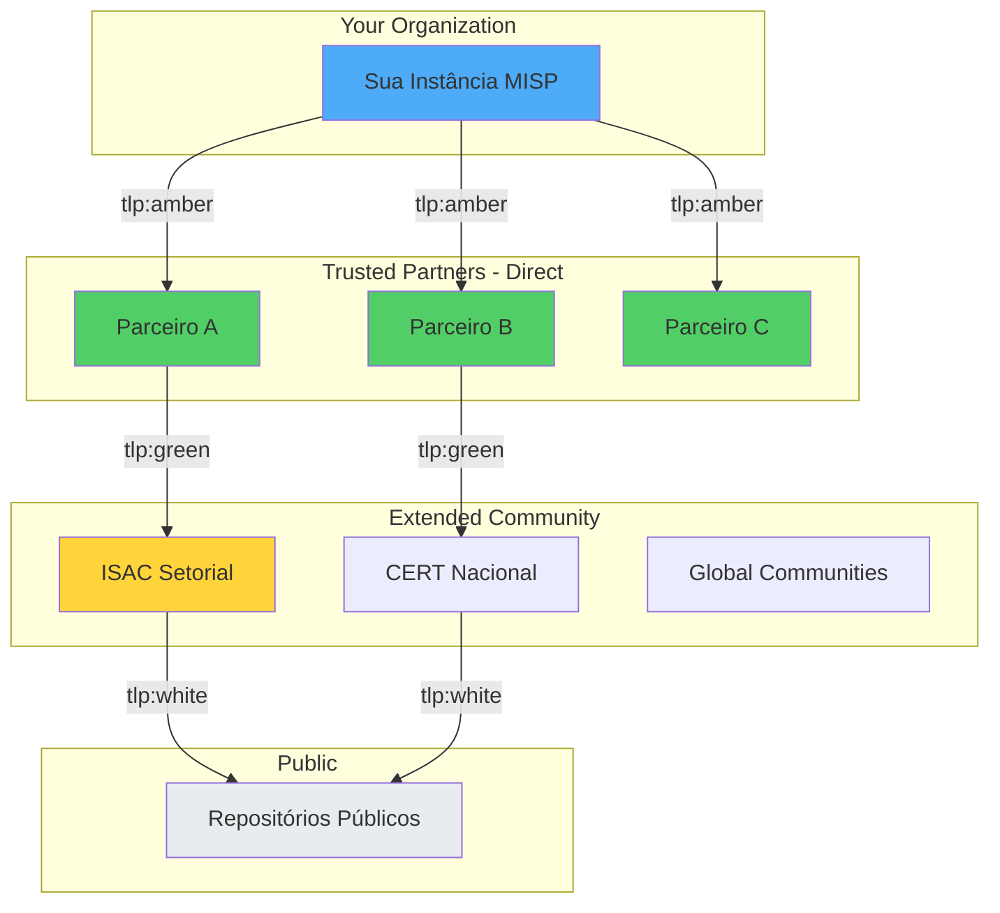
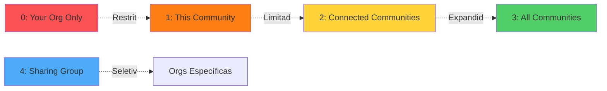
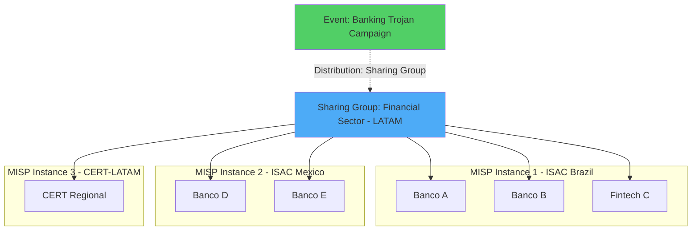
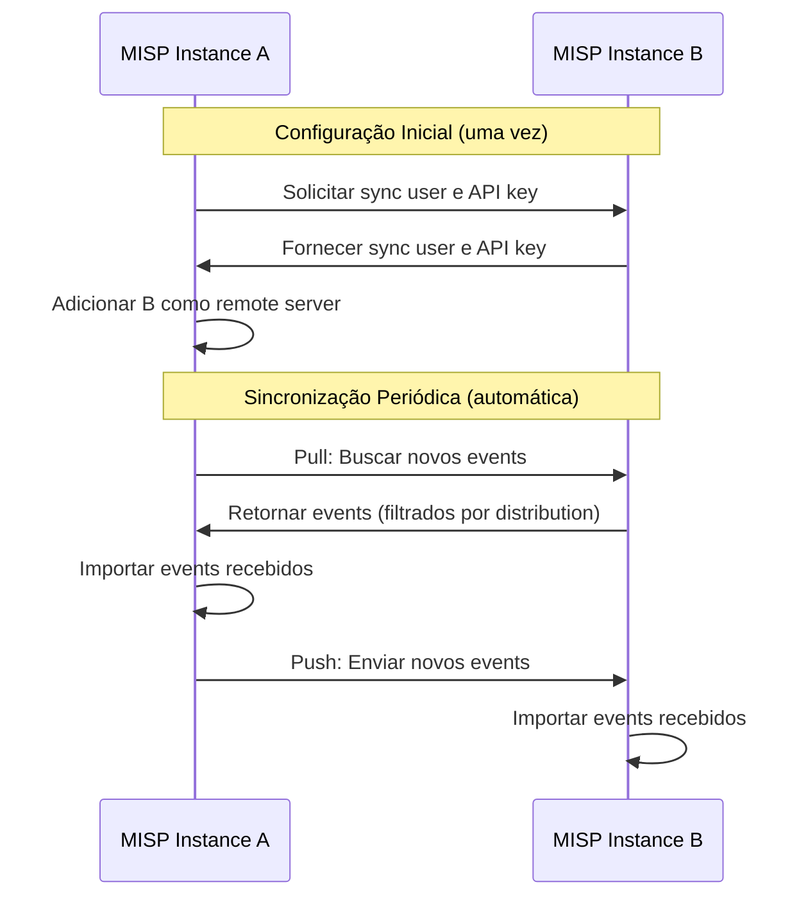
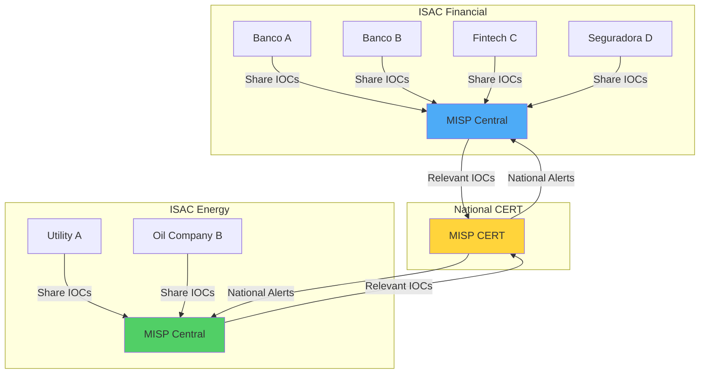
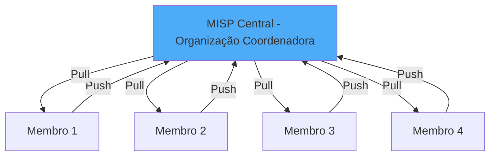
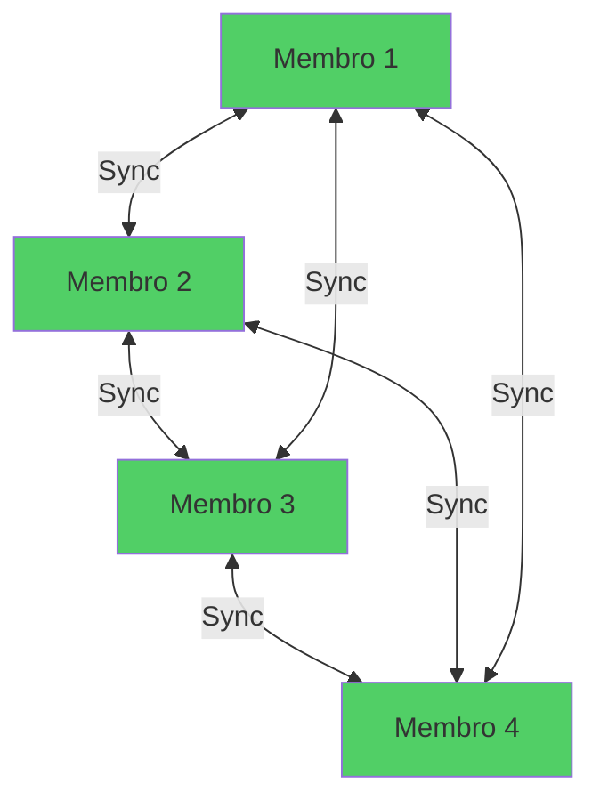

# Compartilhamento e Comunidade no MISP

## Visão Geral

O compartilhamento de Threat Intelligence é o coração do MISP. Este guia explica como configurar e gerenciar compartilhamento seguro e eficaz de IOCs e informações sobre ameaças.

!!! abstract "Objetivos deste Guia"
    - Entender a filosofia de compartilhamento do MISP
    - Configurar níveis de distribuição
    - Criar e gerenciar Sharing Groups
    - Configurar sincronização com outras instâncias MISP
    - Implementar push/pull de dados
    - Aplicar filtros de sincronização
    - Participar de ISACs e comunidades
    - Seguir boas práticas de compartilhamento
    - Garantir privacidade e anonimização

## Filosofia de Compartilhamento do MISP

### Modelo de Confiança

O MISP opera em um modelo de **círculos de confiança** (circles of trust):



### Princípios Fundamentais

!!! quote "Princípios de Compartilhamento"
    1. **Need to Share**: Compartilhar é essencial para defesa coletiva
    2. **Need to Protect**: Proteger fontes e métodos é igualmente importante
    3. **Reciprocidade**: Quem recebe deve contribuir
    4. **Contexto é Rei**: IOCs sem contexto têm valor limitado
    5. **Qualidade > Quantidade**: Prefira dados validados
    6. **TLP e PAP**: Sempre use marcações apropriadas

### Por Que Compartilhar?

=== "Benefícios Individuais"
    ```yaml
    Para Sua Organização:

    - Detecção antecipada: Receber IOCs antes de ser atacado
    - Contexto ampliado: Entender campanhas maiores
    - Validação: Confirmar observações com outros
    - Economizar recursos: Não reinventar análises
    - Melhor resposta: Aprender com incidentes de outros
    ```

=== "Benefícios Coletivos"
    ```yaml
    Para a Comunidade:

    - Defesa coordenada: Todos mais protegidos
    - Visibilidade global: Campanhas são mapeadas
    - Adversários desacelerados: Infraestrutura derrubada mais rápido
    - Democratização: Organizações menores se beneficiam
    - Evolução conjunta: Capacidades crescem juntas
    ```

=== "Impacto em Adversários"
    ```yaml
    Compartilhamento Efetivo:

    - Aumenta custo operacional de adversários
    - Reduz tempo de vida de infraestrutura C2
    - Força mudança constante de TTPs
    - Dificulta reutilização de ferramentas
    - Expõe padrões e atribuições
    ```

## Distribution Levels (Níveis de Distribuição)

### Visão Geral dos Níveis

Cada event e attribute no MISP tem um **distribution level** que controla quem pode ver e receber aquela informação.



### Distribution Level 0: Your Organization Only

```yaml
Level: 0 - Your organization only

Comportamento:
  - Visível apenas para usuários da sua organização
  - Não é sincronizado com nenhuma instância externa
  - Não aparece em exports para parceiros
  - Ideal para dados internos

Casos de Uso:
  - IOCs ainda em investigação interna
  - Dados sensíveis da organização
  - Testes e desenvolvimento
  - Informações proprietárias

Exemplo:
  Event: "Internal Honeypot Findings - Under Analysis"
  Distribution: Your organization only
  TLP: tlp:red (mesmo sendo interno)
```

!!! warning "Não é Segredo Absoluto"
    Distribution 0 protege contra sincronização acidental, mas administradores da instância MISP ainda têm acesso ao database. Para segredos críticos, use sistemas segregados.

### Distribution Level 1: This Community Only

```yaml
Level: 1 - This community only

Comportamento:
  - Visível para todas as organizações na mesma instância MISP
  - Não é sincronizado com instâncias externas
  - Permanece dentro da "comunidade local"
  - Ideal para ISACs, comunidades setoriais

Casos de Uso:
  - Compartilhar dentro de ISAC setorial
  - Informações relevantes apenas para membros locais
  - Ameaças específicas ao setor/região

Exemplo:
  MISP Instance: Financial ISAC Brazil
  Event: "Phishing Campaign Targeting Brazilian Banks"
  Distribution: This community only
  TLP: tlp:amber
  Visível para: Todos os bancos membros do ISAC
  Não visível para: Instâncias MISP externas
```

### Distribution Level 2: Connected Communities

```yaml
Level: 2 - Connected communities

Comportamento:
  - Sincronizado com instâncias MISP conectadas (sync servers)
  - Propaga para parceiros diretos configurados
  - Não propaga para além dos parceiros diretos (sem cascata)
  - Ideal para colaboração entre organizações confiáveis

Casos de Uso:
  - Compartilhar com CERTs parceiros
  - Trocar informações entre ISACs
  - Colaboração em investigações conjuntas

Exemplo:
  Event: "APT28 Campaign - Government Sector"
  Distribution: Connected communities
  TLP: tlp:amber
  Comportamento:
    - Sua instância → CERT Nacional (conectado)
    - Sua instância → Parceiro Setorial (conectado)
    - NÃO propaga: CERT Nacional → Outras instâncias dele
```

!!! tip "Connected = 1 Hop Apenas"
    Distribution 2 significa **1 salto** apenas. Se você sincroniza com A, e A sincroniza com B, o event NÃO chega em B automaticamente (a menos que B também esteja conectado a você).

### Distribution Level 3: All Communities

```yaml
Level: 3 - All communities

Comportamento:
  - Sem restrições de sincronização
  - Propaga através de todas as conexões
  - Pode alcançar instâncias MISP globalmente
  - Ideal para informações públicas

Casos de Uso:
  - IOCs de malware antigo já público
  - Informações de domínio público
  - Feeds compartilhados globalmente
  - Threat intelligence open-source

Exemplo:
  Event: "Emotet Botnet IOCs - Public"
  Distribution: All communities
  TLP: tlp:white
  Comportamento:
    - Sincroniza para todos os servidores conectados
    - Esses servidores sincronizam para os deles
    - Propagação global sem limites
```

!!! danger "Cuidado com All Communities"
    Uma vez que um event é distribuído com nível 3, você **perde controle** sobre onde ele vai parar. Use apenas para informações verdadeiramente públicas.

### Distribution Level 4: Sharing Group

```yaml
Level: 4 - Sharing Group

Comportamento:
  - Compartilhado apenas com organizações no Sharing Group
  - Controle granular de acesso
  - Pode atravessar múltiplas instâncias MISP
  - Mais flexível e seguro

Casos de Uso:
  - Incidentes compartilhados entre vítimas específicas
  - Colaboração em investigações de APT
  - Grupos setoriais multi-instância
  - Operações coordenadas

Exemplo:
  Sharing Group: "Ransomware Investigation 2025-01"
  Membros:
    - Company A (misp1.example.com)
    - Company B (misp1.example.com)
    - Company C (misp2.example.com)
    - CERT Nacional (misp3.example.com)

  Event: "LockBit 3.0 Attack - Shared IOCs"
  Distribution: Sharing Group "Ransomware Investigation 2025-01"
  TLP: tlp:amber
  Visível apenas para: Membros do Sharing Group (mesmo em instâncias diferentes)
```

## Sharing Groups

### O Que São Sharing Groups?

**Sharing Groups** são grupos de organizações que podem compartilhar informações entre si, independentemente da instância MISP onde estão.



### Criar Sharing Group

**Passo 1**: Acessar configuração

```
Administration > Sharing Groups > Add Sharing Group
```

**Passo 2**: Preencher informações

```yaml
Name: Financial Sector LATAM - Ransomware Defense
Description: Grupo para compartilhamento de IOCs de ransomware entre instituições financeiras na América Latina
Organization: Your organization (creator)
Releasability: Membros podem ver uns aos outros
```

**Passo 3**: Adicionar organizações locais

```
Add Organisation to Sharing Group

Selecionar organizações da sua instância MISP:
  - Banco A (local)
  - Banco B (local)
  - Fintech C (local)
Extend: ✓ (permitir que vejam events do Sharing Group)
```

**Passo 4**: Adicionar organizações externas (de outras instâncias)

```
Add Server to Sharing Group

Selecionar servidor sync configurado:
  - MISP Instance: ISAC Mexico
  - All orgs: ☐ (não todas)

Add Organisation from Server:
  - Banco D (da instância ISAC Mexico)
  - Banco E (da instância ISAC Mexico)
Extend: ✓
```

**Passo 5**: Salvar Sharing Group

### Usar Sharing Group em Event

Ao criar ou editar event:

```yaml
Distribution: Sharing Group
Sharing Group: Financial Sector LATAM - Ransomware Defense

Resultado:
  - Apenas membros do grupo verão o event
  - Sincronização automática entre instâncias
  - Controle granular mantido
```

### Gerenciar Sharing Groups

**Visualizar membros**:

```
Administration > Sharing Groups > List Sharing Groups
> View (ícone de olho)

Mostra:
  - Todas as organizações membros
  - Instâncias MISP envolvidas
  - Quem pode editar o Sharing Group
```

**Editar membros**:

```
Edit Sharing Group
Add/Remove organizações conforme necessário
```

**Deletar Sharing Group**:

```
⚠️ Cuidado: Events usando este Sharing Group ficarão sem distribuição!
Primeiro: Mudar distribution dos events para outro nível
Depois: Deletar Sharing Group
```

### Boas Práticas de Sharing Groups

!!! tip "Recomendações"
    1. **Nome descritivo**: "Financial ISAC - Core Members", não "Group 1"
    2. **Descrição clara**: Objetivo, escopo, critérios de participação
    3. **Começar pequeno**: 3-5 organizações confiáveis
    4. **Expandir gradualmente**: Adicionar membros conforme confiança
    5. **Revisar periodicamente**: Remover membros inativos
    6. **Grupos específicos**: Por incidente, setor, região, ou ameaça
    7. **Documentar fora do MISP**: Termos de participação, políticas

## Sync Servers (Sincronização)

### O Que É Sincronização?

**Sync servers** permitem que duas instâncias MISP troquem events e attributes automaticamente.



### Tipos de Sincronização

=== "Pull"
    ```yaml
    Pull: Buscar events de outra instância

    Comportamento:
      - Sua instância solicita events do servidor remoto
      - Recebe events que você tem permissão de ver
      - Importa para seu database local
      - Mantém sincronização unidirecional (remoto → você)

    Casos de Uso:
      - Consumir feeds de CERT/ISAC
      - Receber IOCs de parceiros maiores
      - Importar de repositórios centralizados
    ```

=== "Push"
    ```yaml
    Push: Enviar events para outra instância

    Comportamento:
      - Sua instância envia events para servidor remoto
      - Envia apenas events que eles podem ver (distribution)
      - Servidor remoto importa para database dele
      - Mantém sincronização unidirecional (você → remoto)

    Casos de Uso:
      - Contribuir para CERT/ISAC
      - Compartilhar com parceiros
      - Alimentar repositórios centralizados
    ```

=== "Pull + Push"
    ```yaml
    Pull + Push: Sincronização bidirecional

    Comportamento:
      - Ambos pull e push habilitados
      - Troca completa de informações
      - Cada lado mantém cópia dos events
      - Sincronização mútua e recíproca

    Casos de Uso:
      - Parceiros iguais (peer-to-peer)
      - ISACs compartilhando mutuamente
      - Instâncias redundantes
    ```

### Configurar Sync Server

#### Pré-requisitos

**Na instância remota (que você vai conectar):**

1. Criar usuário de sincronização:

```
Administration > Add User

Email: sync@your-org.com
Organisation: Your Organization
Role: Sync User (role específica)
Authkey: (será gerado automaticamente)

Copiar a Authkey gerada!
```

2. Fornecer informações para você:
   - URL da instância: https://misp-partner.example.com
   - Authkey do sync user
   - Certificado SSL (se auto-assinado)

#### Configurar na Sua Instância

**Passo 1**: Adicionar servidor remoto

```
Sync Actions > List Servers > Add Server
```

**Passo 2**: Preencher configuração

```yaml
Remote server settings:

Base URL: https://misp-partner.example.com
Organisation: Nome da organização parceira
Authkey: <authkey fornecida>
Internal: ☐ (deixar desmarcado para externos)

Pull settings:
Pull: ✓
Pull rules: (opcional - filtros, ver abaixo)
Caching: ✓ (recomendado)

Push settings:
Push: ✓
Push rules: (opcional - filtros)

Certificate:
  (Colar certificado SSL se auto-assinado, ou deixar em branco para certificados públicos)

Advanced settings:
Self Signed: ☐ (marcar apenas se certificado auto-assinado)
Skip SSL validation: ☐ (não recomendado, apenas para testes)
```

**Passo 3**: Testar conexão

```
Actions > Test Connection

Sucesso: "Connection test passed"
Erro: Verificar URL, authkey, firewall, certificado
```

**Passo 4**: Realizar pull inicial

```
Actions > Pull

Aguardar: Pode levar vários minutos na primeira vez
Verificar logs: Job queue para progresso
```

### Filtros de Sincronização (Pull/Push Rules)

Filtros permitem sincronizar apenas eventos relevantes, evitando sobrecarga.

#### Sintaxe de Filtros

```json
{
  "tags": ["tlp:amber", "phishing", "!false-positive"],
  "orgs": ["CERT-BR", "ISAC-Financial"],
  "type": ["ip-dst", "domain", "sha256"],
  "published": true,
  "threat_level_id": [1, 2]
}
```

#### Exemplos de Pull Rules

=== "Apenas Relevantes ao Setor"
    ```json
    {
      "tags": ["financial-sector", "banking", "fintech"],
      "published": true
    }
    ```
    **Comportamento**: Puxa apenas events tagueados com setor financeiro

=== "Apenas IOCs de Rede"
    ```json
    {
      "type": ["ip-src", "ip-dst", "domain", "hostname", "url"],
      "published": true
    }
    ```
    **Comportamento**: Puxa apenas attributes de rede (para firewall/IDS)

=== "Excluir Baixa Prioridade"
    ```json
    {
      "threat_level_id": [1, 2],
      "analysis": [2],
      "published": true
    }
    ```
    **Comportamento**: Apenas high/medium threat, analysis completed

=== "Apenas de Organizações Confiáveis"
    ```json
    {
      "orgs": ["CERT-National", "ISAC-Central", "Trusted-Partner"],
      "published": true
    }
    ```
    **Comportamento**: Puxa apenas events de orgs específicas

#### Exemplos de Push Rules

=== "Não Enviar Dados Internos"
    ```json
    {
      "tags": ["!internal", "!test", "!draft"]
    }
    ```
    **Comportamento**: Não envia events tagueados como internos, testes, ou rascunhos

=== "Apenas TLP:WHITE e TLP:GREEN"
    ```json
    {
      "tags": ["tlp:white", "tlp:green"]
    }
    ```
    **Comportamento**: Apenas events com compartilhamento amplo

### Monitorar Sincronização

**Via Web UI**:

```
Sync Actions > List Servers
Ver coluna "Last Successful Pull/Push"
```

**Via Logs**:

```
Administration > Jobs
Filtrar por: "pull" ou "push"
Ver status: Success, Failed, Running
```

**Via CLI**:

```bash
# Dentro do container
docker compose exec misp bash

# Pull manual de servidor específico
/var/www/MISP/app/Console/cake Server pull <server_id>

# Pull de todos os servidores
/var/www/MISP/app/Console/cake Server pull all

# Push manual
/var/www/MISP/app/Console/cake Server push <server_id>

# Ver logs
tail -f /var/www/MISP/app/tmp/logs/sync-*.log
```

### Troubleshooting Sync

=== "Connection Failed"
    ```yaml
    Erro: "Could not reach server"

    Causas:
      - URL incorreta
      - Firewall bloqueando
      - Certificado SSL inválido
      - Servidor remoto offline

    Solução:
      1. Testar conectividade: curl https://misp-partner.example.com
      2. Verificar certificado: openssl s_client -connect misp-partner.example.com:443
      3. Verificar firewall: telnet misp-partner.example.com 443
      4. Contatar parceiro para confirmar disponibilidade
    ```

=== "Authentication Failed"
    ```yaml
    Erro: "Unauthorised"

    Causas:
      - Authkey incorreta
      - Sync user desabilitado
      - Permissões inadequadas

    Solução:
      1. Revalidar authkey com parceiro
      2. Verificar se sync user está ativo
      3. Verificar role do sync user (deve ser Sync User)
    ```

=== "Sync Trava"
    ```yaml
    Erro: Pull/Push não completa

    Causas:
      - Volume muito grande de dados
      - Timeout de rede
      - Memória insuficiente

    Solução:
      1. Verificar logs: /var/www/MISP/app/tmp/logs/sync-*.log
      2. Aumentar timeout: Settings > MISP.network_timeout
      3. Sincronizar em partes: usar filtros (pull rules)
      4. Aumentar memória do container Docker
    ```

## ISACs e Comunidades Setoriais

### O Que São ISACs?

**ISAC (Information Sharing and Analysis Center)** são organizações setoriais focadas em compartilhamento de threat intelligence.



### Participar de um ISAC

**Passo 1**: Identificar ISAC relevante para seu setor

| Setor | ISAC | Website | Região |
|-------|------|---------|--------|
| Financeiro | FS-ISAC | fsisac.com | Global |
| Energia | E-ISAC | eisac.com | Global |
| Saúde | H-ISAC | h-isac.org | Global |
| Telecom | Telecom ISAC | telecomisac.org | Global |
| Aviação | A-ISAC | a-isac.com | Global |
| Varejo | RH-ISAC | rhisac.org | US/Global |

**Passo 2**: Solicitar participação

```yaml
Processo típico:
  1. Acessar website do ISAC
  2. Solicitar membership (geralmente requer validação do setor)
  3. Aguardar aprovação
  4. Receber credenciais e instruções de acesso MISP
  5. Configurar sync com instância central do ISAC
```

**Passo 3**: Configurar sincronização com ISAC

```yaml
Sync Actions > Add Server

Base URL: https://misp.isac-exemplo.com
Authkey: <fornecida pelo ISAC>
Pull: ✓
Push: ✓

Pull rules: (geralmente configuradas pelo ISAC)
Push rules: (não enviar dados internos)
```

**Passo 4**: Contribuir ativamente

```yaml
Responsabilidades:
  - Compartilhar IOCs relevantes ao setor
  - Adicionar sightings quando detectar IOCs
  - Participar de análises colaborativas
  - Manter qualidade dos dados (não spam)
  - Respeitar TLP e PAP
```

### Criar Comunidade Própria

Se não existe ISAC para seu contexto, você pode criar uma comunidade:

**Modelo Centralizado**:



**Modelo Distribuído (P2P)**:



**Recomendação**: Modelo centralizado para começar, distribuído conforme maturidade.

## Boas Práticas de Compartilhamento

### 1. Sempre Use TLP e PAP

!!! danger "Regra de Ouro"
    **NUNCA** compartilhe events sem tags TLP e PAP. É irresponsável e pode causar vazamento de informações sensíveis.

```yaml
Checklist antes de compartilhar:
  ✓ TLP definido (red/amber/green/white)
  ✓ PAP definido (red/amber/green/white)
  ✓ Distribution level apropriado
  ✓ Sharing Group correto (se aplicável)
  ✓ Contexto suficiente (comment, event info)
```

### 2. Adicione Contexto

```yaml
❌ Ruim:
  Event Info: "IOCs"
  Attribute: ip-dst: 203.0.113.5 (sem comment)

✅ Bom:
  Event Info: "Emotet Banking Trojan - Campaign Jan 2025"
  Attribute: ip-dst: 203.0.113.5
  Comment: "C2 server, active 2025-01-15 to 2025-01-20, responds on port 8080"
  Tags: malware:emotet, sector:financial
  Galaxy: MITRE ATT&CK T1071.001
```

### 3. Valide IOCs Antes de Compartilhar

```yaml
Passos de validação:

1. Verificar Warninglists:
   - IOC é CDN, DNS público, serviço legítimo?

2. Testar IOC:
   - IP ainda responde?
   - Domínio ainda resolve?
   - Hash ainda detectado como malicioso?

3. Enriquecer:
   - VirusTotal, AbuseIPDB, Shodan
   - Adicionar contexto extra

4. Confirmar relevância:
   - IOC ainda é útil?
   - Infraestrutura foi derrubada?
```

### 4. Contribua Reciprocamente

!!! quote "Regra de Reciprocidade"
    Se você **recebe** IOCs de uma comunidade, você **deve contribuir** também. Comunidades só funcionam com participação ativa.

```yaml
Contribuição ideal:

Receber: Pull de feeds e parceiros
Validar: Testar IOCs em seu ambiente
Enriquecer: Adicionar sightings quando detectar
Compartilhar: Publicar novos IOCs descobertos
Colaborar: Responder proposals, participar de análises
```

### 5. Não Compartilhe Lixo

```yaml
❌ Não compartilhe:
  - IOCs não validados
  - Dados de testes internos
  - Informações duplicadas (verifique antes)
  - Falsos positivos conhecidos
  - IOCs sem contexto algum

✅ Compartilhe:
  - IOCs validados e enriquecidos
  - Contexto completo (TTPs, campanha)
  - Sightings de IOCs da comunidade
  - Análises de incidentes (quando permitido)
```

### 6. Respeite Privacidade e Sensibilidade

```yaml
Dados para NUNCA compartilhar publicamente:

- IPs internos da vítima
- Nomes de vítimas (a menos que público)
- Detalhes de vulnerabilidades não patcheadas
- Informações sobre fontes e métodos de coleta
- Dados pessoais (PII) de usuários afetados
- Credenciais ou secrets

Sempre:
  - Anonimize vítimas ("Company A", não "ACME Corp")
  - Use distribution apropriada para sensibilidade
  - Obtenha permissão antes de atribuir ataques
```

## Privacidade e Anonimização

### Anonimizar Vítimas

```yaml
Cenário: Compartilhar IOCs de incidente sem expor vítima

❌ Não fazer:
  Event Info: "Ransomware Attack on ACME Corporation"
  Attribute: ip-src: 192.168.1.50 (IP interno da ACME)

✅ Fazer:
  Event Info: "Ransomware Attack on Brazilian Financial Institution"
  Attribute: ip-dst: 203.0.113.5 (IP do atacante)
  Comment: "C2 server contacted by victim"
  Distribution: Sharing Group (apenas membros confiáveis)
  TLP: tlp:amber
```

### Sanitize Dados

```bash
# Remover IPs internos antes de compartilhar
# Revisar attributes do event:

Manter:
  - IPs públicos de atacantes
  - Domínios maliciosos
  - Hashes de malware
  - TTPs observadas

Remover:
  - IPs privados (10.x, 172.16.x, 192.168.x)
  - Hostnames internos
  - Usernames de vítimas
  - Paths de arquivos internos (ex: C:\Users\joao.silva\...)
```

### Pseudonimizar Organizações

```yaml
Em event de colaboração multi-vítima:

Event Info: "Coordinated Phishing Campaign - Multiple Organizations"

Usar códigos:
  Org A: Atacada em 2025-01-15, 50 emails
  Org B: Atacada em 2025-01-16, 120 emails
  Org C: Atacada em 2025-01-17, 30 emails

Sharing Group: "Phishing Incident 2025-01 - Victims"
Membros sabem quem é quem, mas event não expõe publicamente
```

## Próximos Passos

Agora que você domina compartilhamento no MISP:

1. **[Integração com Stack](integration-stack.md)** - Usar IOCs compartilhados em Wazuh, TheHive, Shuffle
2. **[Casos de Uso](use-cases.md)** - Exemplos práticos de compartilhamento em ação
3. **[API Reference](api-reference.md)** - Automatizar sincronização e compartilhamento via API

!!! quote "Lembre-se"
    "Compartilhar é um ato de confiança. Respeite essa confiança sendo responsável, preciso e recíproco."

---

**Documentação**: NEO_NETBOX_ODOO Stack - MISP
**Versão**: 1.0
**Última Atualização**: 2025-12-05
