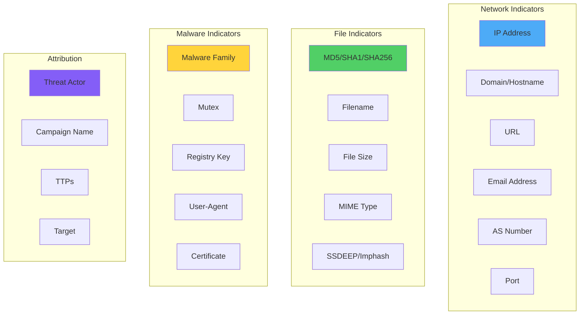
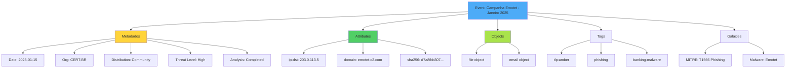
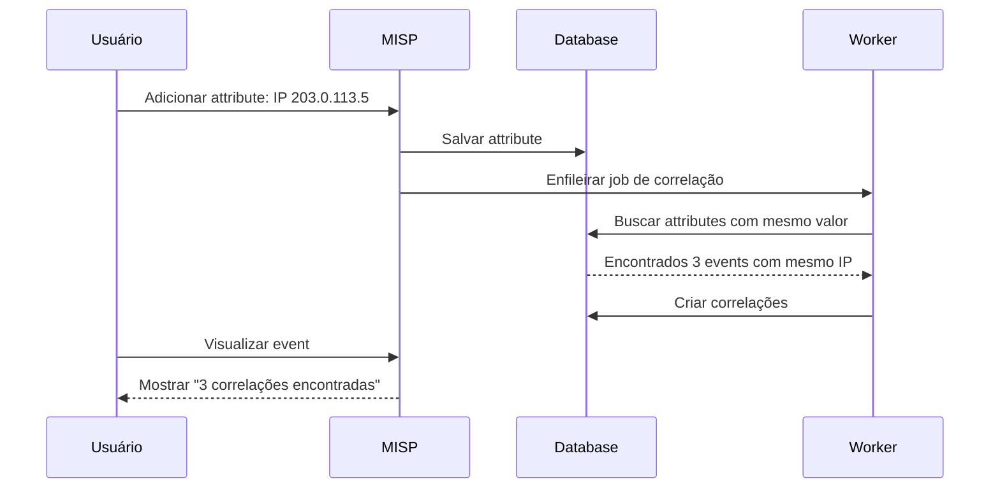
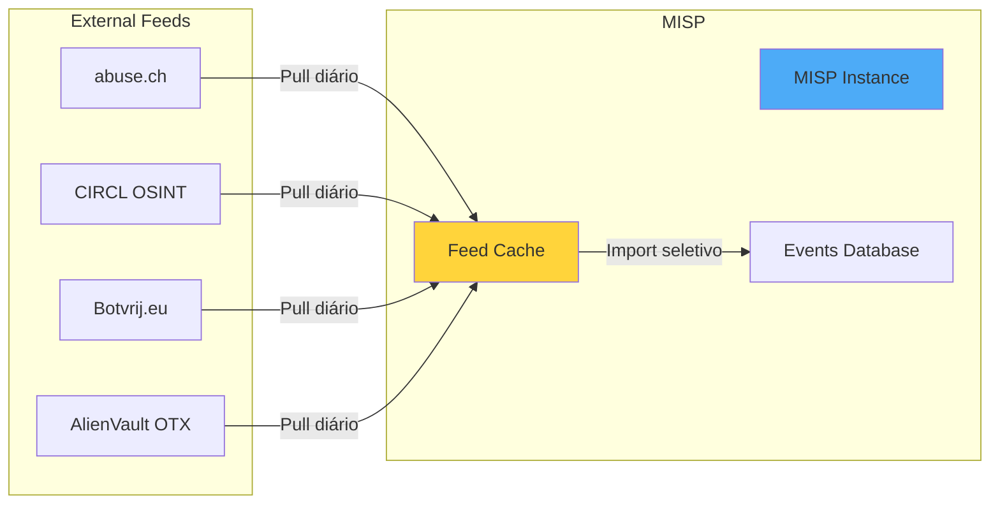

# Gestão de Threat Intelligence no MISP

## Visão Geral

Este guia ensina como gerenciar Threat Intelligence no MISP, desde a criação básica de eventos até técnicas avançadas de correlação e análise.

!!! abstract "Objetivos deste Guia"
    - Entender tipos de IOCs e como usá-los
    - Criar Events estruturados
    - Adicionar Attributes e Objects
    - Utilizar Galaxies e Taxonomies
    - Trabalhar com correlações automáticas
    - Implementar Sightings
    - Fazer Proposals colaborativos
    - Import/Export de dados
    - Configurar Feeds de Threat Intelligence
    - Integrar MITRE ATT&CK

## Tipos de IOCs Suportados

### Categorias de IOCs

O MISP suporta dezenas de tipos de indicadores organizados em categorias:



### Tabela Completa de Tipos

| Tipo | Categoria | Descrição | Exemplo | to_ids |
|------|-----------|-----------|---------|--------|
| **ip-src** | Network | IP de origem | 192.0.2.10 | ✅ |
| **ip-dst** | Network | IP de destino (C2, malicious) | 203.0.113.5 | ✅ |
| **domain** | Network | Domínio malicioso | evil.com | ✅ |
| **hostname** | Network | Hostname completo | c2.evil.com | ✅ |
| **url** | Network | URL completa | http://evil.com/payload.exe | ✅ |
| **email-src** | Network | Email de origem (phishing) | attacker@evil.com | ✅ |
| **email-dst** | Network | Email de destino (vítima) | victim@company.com | ❌ |
| **email-subject** | Network | Assunto do email | "Invoice Attached" | ⚠️ |
| **md5** | Payload | Hash MD5 | 5d41402abc4b... | ✅ |
| **sha1** | Payload | Hash SHA1 | 2fd4e1c67a... | ✅ |
| **sha256** | Payload | Hash SHA256 | d7a8fbb307... | ✅ |
| **filename** | Payload | Nome do arquivo | invoice.exe | ⚠️ |
| **filename\|md5** | Payload | Arquivo + hash | invoice.exe\|5d41402... | ✅ |
| **regkey** | Artifacts | Chave de registro | HKLM\Software\Malware | ✅ |
| **mutex** | Artifacts | Mutex de malware | Global\MalwareMutex | ✅ |
| **user-agent** | Network | User-Agent HTTP | Mozilla/5.0 (custom) | ⚠️ |
| **vulnerability** | Other | CVE | CVE-2024-1234 | ❌ |
| **malware-sample** | Payload | Arquivo binário | (arquivo zip) | ✅ |

!!! tip "to_ids: Quando Ativar?"
    - **✅ Sempre**: IPs maliciosos, hashes de malware, domínios C2, mutexes
    - **❌ Nunca**: IPs de vítimas, emails de vítimas, CVEs (contexto)
    - **⚠️ Depende**: Filenames genéricos (pode gerar FP), user-agents customizados

## Criando Events

### Estrutura de um Event



### Criando Event via Interface Web

**Passo 1**: Acessar criação de evento

```
Menu > Event Actions > Add Event
```

**Passo 2**: Preencher informações básicas

```yaml
Date: 2025-01-15              # Data do incidente
Distribution: This Community  # Ou outro nível apropriado
Threat Level: High            # Low/Medium/High
Analysis: Initial             # Initial/Ongoing/Completed
Event Info: Emotet Banking Trojan Campaign - Q1 2025
```

!!! info "Campos Explicados"
    - **Date**: Data do incidente/observação, não da criação do event
    - **Distribution**: Quem pode ver este event (ver seção Sharing)
    - **Threat Level**: Severidade da ameaça
    - **Analysis**: Status da análise do incidente
    - **Event Info**: Descrição clara e concisa (uma linha)

**Passo 3**: Clicar em "Submit"

### Adicionando Attributes ao Event

Após criar o event, adicione IOCs:

**Opção 1: Via Interface "Add Attribute"**

```
No event criado > Add Attribute

Category: Network activity
Type: domain
Value: emotet-c2.malicious.com
Comment: C2 server observed in campaign
to_ids: ✓ (checked)
Batch import: ☐ (unchecked)
```

**Opção 2: Via "Freetext Import"**

Ideal para adicionar múltiplos IOCs rapidamente:

```
No event > Populate from... > Freetext import

Cole os IOCs (um por linha ou em bloco de texto):
203.0.113.5
emotet-c2.malicious.com
d7a8fbb307d313a6df40847d1e0e9e56
invoice_jan2025.doc.exe
```

O MISP automaticamente:
- Detecta o tipo de cada IOC
- Categoriza adequadamente
- Remove duplicatas

!!! tip "Freetext Import é Inteligente"
    O MISP reconhece automaticamente:
    - IPs (v4 e v6)
    - Domínios e URLs
    - Hashes (MD5, SHA1, SHA256)
    - Emails
    - CVEs (CVE-YYYY-XXXXX)

### Adicionando Objects

Objects são estruturas complexas pré-definidas. Exemplo: adicionar um arquivo malicioso completo.

**Passo 1**: No event, clicar em "Add Object"

**Passo 2**: Selecionar template "file"

**Passo 3**: Preencher attributes do object:

```yaml
filename: invoice_jan2025.doc.exe
md5: 5d41402abc4b2a76b9719d911017c592
sha1: aaf4c61ddcc5e8a2dabede0f3b482cd9aea9434d
sha256: d7a8fbb307d313a6df40847d1e0e9e56fcb7dcb3bb6e15e1a1d2c3d4e5f6a7b8
size-in-bytes: 245760
mime-type: application/x-dosexec
```

**Passo 4**: Submit

!!! success "Vantagens de Objects"
    - Agrupamento lógico de attributes relacionados
    - Templates padronizados
    - Melhor visualização
    - Correlações mais precisas
    - Export/Import estruturado

### Objects Templates Mais Utilizados

=== "file"
    ```yaml
    Template: file
    Uso: Representar arquivo (malware, documento malicioso)

    Attributes principais:
      - filename: Nome do arquivo
      - md5, sha1, sha256, sha512: Hashes
      - size-in-bytes: Tamanho em bytes
      - mime-type: Tipo MIME
      - entropy: Entropia (indicador de packing/criptografia)
      - ssdeep: Fuzzy hash (detecção de variantes)
      - imphash: Import hash (PE files)

    Exemplo:
      - Ransomware executável
      - Documento Office com macro
      - PDF malicioso
    ```

=== "email"
    ```yaml
    Template: email
    Uso: Email de phishing/spear-phishing completo

    Attributes principais:
      - from: Remetente
      - to: Destinatário
      - cc: Cópia
      - subject: Assunto
      - email-body: Corpo do email
      - attachment: Anexos (referência a file object)
      - x-mailer: Cliente/software usado
      - reply-to: Endereço de resposta
      - message-id: Message-ID do email

    Exemplo:
      - Campanha de phishing bancário
      - BEC (Business Email Compromise)
      - Spear-phishing direcionado
    ```

=== "network-connection"
    ```yaml
    Template: network-connection
    Uso: Conexão de rede observada

    Attributes principais:
      - ip-src: IP origem
      - ip-dst: IP destino
      - src-port: Porta origem
      - dst-port: Porta destino
      - protocol: TCP/UDP/ICMP
      - hostname: Hostname conectado
      - first-packet-seen: Timestamp primeiro pacote
      - layer3-protocol: IPv4/IPv6

    Exemplo:
      - Conexão C2 de malware
      - Beaconing observado
      - Exfiltração de dados
    ```

=== "domain-ip"
    ```yaml
    Template: domain-ip
    Uso: Relacionamento domínio ↔ IP

    Attributes principais:
      - domain: Nome de domínio
      - ip: Endereço IP resolvido
      - first-seen: Primeira resolução observada
      - last-seen: Última resolução observada
      - hostname: Hostname completo (com subdomínio)

    Exemplo:
      - Domínio de phishing resolvido para IP
      - Infraestrutura C2 (múltiplos domínios → mesmo IP)
      - Fast-flux networks
    ```

=== "url"
    ```yaml
    Template: url
    Uso: URL maliciosa completa com contexto

    Attributes principais:
      - url: URL completa
      - domain: Domínio extraído
      - ip: IP resolvido
      - first-seen: Primeira observação
      - last-seen: Última observação
      - port: Porta (se não padrão)

    Exemplo:
      - URL de phishing
      - Drive-by download
      - C2 callback URL
    ```

=== "vulnerability"
    ```yaml
    Template: vulnerability
    Uso: CVE detalhado

    Attributes principais:
      - id: CVE-YYYY-XXXXX
      - summary: Descrição da vulnerabilidade
      - cvss-score: Pontuação CVSS (0-10)
      - cvss-string: String CVSS v3
      - published: Data de publicação
      - references: Links (NVD, vendor advisories)
      - vulnerable-configuration: CPE ou configuração afetada

    Exemplo:
      - CVE explorada em campanha
      - Vulnerabilidade 0-day
      - Patch prioritário
    ```

## Utilizando Galaxies

### Adicionar Galaxies a Events

Galaxies adicionam contexto de threat intelligence ao event.

**Passo 1**: No event, clicar em "Add Tag" > "Add Galaxy Matrix"

**Passo 2**: Selecionar Galaxy apropriada

=== "MITRE ATT&CK"
    ```yaml
    Cenário: Adicionar técnicas observadas

    Passos:
      1. Selecionar Galaxy: "mitre-attack-pattern"
      2. Buscar técnicas observadas:
         - T1566.001: Phishing - Spearphishing Attachment
         - T1059.001: Command and Scripting Interpreter - PowerShell
         - T1053.005: Scheduled Task/Job
         - T1070.004: Indicator Removal - File Deletion
      3. Adicionar cada técnica

    Resultado:
      - Event mapeado com TTPs
      - Correlação com outros events usando mesmas TTPs
      - Análise de cobertura de detecção
    ```

=== "Threat Actor"
    ```yaml
    Cenário: Atribuir ataque a grupo APT

    Passos:
      1. Selecionar Galaxy: "threat-actor"
      2. Buscar threat actor:
         - APT28 (Fancy Bear)
         - Lazarus Group
         - FIN7
      3. Adicionar ao event

    Resultado:
      - Attribution do ataque
      - Correlação com campanhas do mesmo grupo
      - Contexto sobre modus operandi
    ```

=== "Malware"
    ```yaml
    Cenário: Identificar família de malware

    Passos:
      1. Selecionar Galaxy: "ransomware" ou "malware"
      2. Buscar família:
         - Emotet
         - LockBit 3.0
         - Cobalt Strike
      3. Adicionar ao event

    Resultado:
      - Classificação do malware
      - Correlação com outras infecções
      - IOCs conhecidos da família
    ```

### Criar Cluster Customizado

Para adicionar threat actor ou malware não listado:

```
Administration > Galaxies > List Galaxies
Selecionar galaxy (ex: "Threat Actor")
> Add Cluster

Name: Grupo Brasileiro XYZ
Description: Grupo APT brasileiro focado em setor financeiro
Synonyms: BrazilAPT, FinBR
Meta:
  - Country: BR
  - Sectors: Financial, Banking
  - First seen: 2024-01
```

## Trabalhando com Taxonomies

### Principais Taxonomies para Aplicar

**1. TLP (Traffic Light Protocol)** - OBRIGATÓRIO

```yaml
Sempre adicione TLP a eventos:

tlp:red:
  - Uso: Informação extremamente sensível
  - Exemplo: IOCs de incidente em curso não divulgado

tlp:amber:
  - Uso: Compartilhamento limitado à comunidade
  - Exemplo: IOCs de campanha setorial

tlp:green:
  - Uso: Compartilhamento dentro de comunidade extendida
  - Exemplo: IOCs validados de ameaça conhecida

tlp:white (ou tlp:clear):
  - Uso: Público, sem restrições
  - Exemplo: IOCs de malware antigo público
```

**2. PAP (Permissible Actions Protocol)**

```yaml
Define o que receptores podem fazer:

pap:red:
  - Apenas visualizar, não usar em detecção
  - Exemplo: IOCs ainda em investigação

pap:amber:
  - Usar em detecção passiva
  - Exemplo: IOCs com possíveis falsos positivos

pap:green:
  - Usar em detecção ativa, alertar/bloquear
  - Exemplo: IOCs confirmados (recomendado)

pap:white:
  - Todas as ações, inclusive compartilhar publicamente
```

**3. Admiralty Scale**

```yaml
Avaliar confiabilidade:

Fonte: A (Confiável) + Info: 1 (Confirmada)
  - Exemplo: IOC do próprio honeypot, validado

Fonte: B (Geralmente confiável) + Info: 2 (Provável)
  - Exemplo: IOC de parceiro confiável, não confirmado

Fonte: F (Não pode julgar) + Info: 6 (Não pode julgar)
  - Exemplo: IOC de fonte desconhecida, não validado
```

**Como aplicar**:

```
No event ou attribute > Add Tag
Buscar: tlp:amber, pap:green, admiralty-scale:A1
Adicionar
```

!!! warning "TLP e PAP são Mandatórios"
    **Sempre** adicione TLP e PAP a seus events. São essenciais para compartilhamento responsável!

## Correlações Automáticas

O MISP correlaciona automaticamente attributes idênticos entre eventos.

### Como Funciona



### Visualizar Correlações

**Na lista de attributes do event**:

```
Attribute: ip-dst: 203.0.113.5
Related Events: [3]
  - Event #1234: Campanha Phishing Bancário - Jan 2025
  - Event #5678: Emotet Infrastructure - Dec 2024
  - Event #9012: APT28 Campaign - Nov 2024
```

**Clicar em "Related Events"** para ver detalhes completos.

### Correlação por Valores Similares

Além de correlação exata, o MISP pode correlacionar:

- **Fuzzy hashing (ssdeep)**: Detectar variantes de arquivos
- **Domínios similares**: Typosquatting, DGA patterns
- **IPs em mesmo range**: /24, /16, AS

!!! tip "Usar Correlações para Threat Hunting"
    1. Encontrar IOC suspeito em seus logs
    2. Buscar no MISP
    3. Verificar correlações
    4. Descobrir campanhas relacionadas
    5. Extrair IOCs adicionais
    6. Buscar esses IOCs em seus logs
    7. Expandir investigação!

## Sightings

**Sightings** são confirmações de que um IOC foi observado/detectado.

### Tipos de Sightings

```yaml
Tipos:

sighting (default):
  - Observei este IOC em meu ambiente
  - Confirma a ameaça é ativa

false-positive:
  - Este IOC é falso positivo
  - Ajuda a filtrar ruído

expiration:
  - IOC não é mais válido/ativo
  - Infraestrutura foi derrubada
```

### Adicionar Sighting

**Via Web UI**:

```
No attribute > ícone de "olho" > Add Sighting
Tipo: Sighting (ou False Positive)
Source: (opcional) Nome da sua organização
Timestamp: (automático ou custom)
```

**Por que usar Sightings?**

- **Validação comunitária**: "Outros também estão vendo isso"
- **Priorização**: IOCs com muitos sightings são mais ativos
- **Feedback loop**: False positives ajudam a limpar dados
- **Timeline**: Quando IOC foi ativo (first seen → last sighting)

!!! example "Cenário de Sightings"
    ```yaml
    IOC: domain: ransomware-payment.onion

    Sightings:
      - Org A: Sighting em 2025-01-15 (vítima de ransomware)
      - Org B: Sighting em 2025-01-16 (tentativa de pagamento)
      - Org C: Sighting em 2025-01-18 (vítima diferente)
      - CERT: False positive em 2025-01-20 (domínio legítimo de pesquisa)

    Análise:
      - Campanha ativa entre 15-18 de janeiro
      - Múltiplas vítimas confirmadas
      - Alerta de false positive (verificar contexto)
    ```

## Proposals (Propostas)

**Proposals** permitem que usuários com permissões limitadas sugiram edições a eventos de outras organizações.

### Quando Usar Proposals

```yaml
Cenários:

1. Corrigir erro:
   - Attribute errado (ex: tipo IP ao invés de Domain)
   - Valor incorreto (typo)

2. Adicionar informação:
   - Novo IOC relacionado ao mesmo incidente
   - Context adicional

3. Deletar IOC inválido:
   - False positive
   - IOC de teste que vazou
```

### Criar Proposal

**Propor novo attribute**:

```
No event (de outra org) > Propose Attribute
Preencher campos (igual a Add Attribute)
Submit
```

**Propor edição de attribute existente**:

```
No attribute > ícone de "lápis" > Propose Edit
Modificar campos
Submit proposal
```

**Propor deleção**:

```
No attribute > ícone de "lixeira" > Propose Deletion
Justificativa: "False positive - IP é do Google DNS"
Submit
```

### Aceitar/Rejeitar Proposals

Se você é o dono do event:

```
Event > Proposals tab
Ver propostas pendentes
Accept ou Discard com justificativa
```

!!! success "Proposals Promovem Colaboração"
    - Usuários contribuem sem permissões completas
    - Proprietário do event mantém controle
    - Qualidade dos dados melhora coletivamente
    - Transparência no processo

## Import/Export de Dados

### Formatos Suportados

| Formato | Import | Export | Uso |
|---------|--------|--------|-----|
| **MISP JSON** | ✅ | ✅ | Formato nativo, completo |
| **STIX 1/2** | ✅ | ✅ | Padrão internacional |
| **CSV** | ✅ | ✅ | Planilhas, bulk import |
| **OpenIOC** | ✅ | ✅ | Framework da Mandiant |
| **YARA** | ❌ | ✅ | Regras de detecção |
| **Snort/Suricata** | ❌ | ✅ | IDS rules |
| **RPZ** | ❌ | ✅ | DNS Response Policy Zone |
| **CEF** | ❌ | ✅ | Common Event Format |

### Export de Event

=== "MISP JSON"
    ```
    No event > Download as... > JSON

    Uso:
      - Backup de event
      - Compartilhar com outra instância MISP
      - Importar em scripts PyMISP
    ```

=== "STIX"
    ```
    No event > Download as... > STIX 2.1 JSON

    Uso:
      - Interoperabilidade com outras TIPs
      - Compartilhar com organizações sem MISP
      - Integrar com TAXII servers
    ```

=== "CSV"
    ```
    No event > Download as... > CSV

    Colunas:
      - uuid, event_id, category, type, value, comment, to_ids

    Uso:
      - Análise em planilhas
      - Import em outras ferramentas
      - Relatórios gerenciais
    ```

=== "IDS Rules"
    ```
    No event > Download as... > Suricata rules (ou Snort)

    Gera regras IDS automaticamente:

    alert ip any any -> [IOC_IPs] any (msg:"MISP Event #123"; sid:2100001;)
    alert dns any any -> any any (msg:"MISP Domain"; dns.query; content:"evil.com"; sid:2100002;)

    Uso:
      - Importar diretamente em Suricata/Snort
      - Detecção automatizada de IOCs
    ```

### Import de Dados

=== "MISP JSON"
    ```
    Event Actions > Import from... > MISP JSON

    Selecionar arquivo .json
    Choose import mode:
      - Create new event
      - Merge into existing event
    Submit
    ```

=== "CSV"
    ```
    Event Actions > Import from... > CSV

    Formato esperado:
    type,value,category,comment,to_ids
    ip-dst,203.0.113.5,Network activity,C2 server,1
    domain,evil.com,Network activity,Phishing domain,1
    md5,5d41402abc...,Payload delivery,Malware hash,1

    Opções:
      - Has header: ✓
      - Delimiter: , (comma)
      - Create new event ou Merge
    ```

=== "Freetext"
    ```
    Já explicado anteriormente - mais versátil

    Event > Populate from... > Freetext import

    Cola qualquer texto contendo IOCs:
      - Logs
      - Relatórios de IR
      - Emails de alerta
      - CTI reports

    MISP extrai IOCs automaticamente!
    ```

### Bulk Export (Todo o Database)

```
Sync Actions > Download > All Events

Formato: MISP JSON
Uso: Backup completo, migração, disaster recovery

⚠️ Cuidado: Pode ser arquivo MUITO grande (GBs)
```

## Feeds de Threat Intelligence

### O Que São Feeds?

Feeds são fontes automatizadas de IOCs que o MISP pode consumir periodicamente.



### Feeds Recomendados

| Feed | Tipo | Frequência | Qualidade | Foco |
|------|------|------------|-----------|------|
| **CIRCL OSINT** | Mixed IOCs | Diário | ⭐⭐⭐⭐⭐ | Geral |
| **abuse.ch URLhaus** | URLs maliciosas | Tempo real | ⭐⭐⭐⭐⭐ | Malware distribution |
| **abuse.ch Feodo Tracker** | Botnet C2 | Diário | ⭐⭐⭐⭐⭐ | Banking trojans |
| **Botvrij.eu** | Mixed IOCs | Diário | ⭐⭐⭐⭐ | Botnets, malware |
| **CERT-EU** | Mixed IOCs | Diário | ⭐⭐⭐⭐⭐ | APTs, targeted attacks |
| **Malware Bazaar** | Hashes, samples | Diário | ⭐⭐⭐⭐ | Recent malware |
| **ThreatFox** | IOCs mixed | Tempo real | ⭐⭐⭐⭐⭐ | Recente, curado |

### Configurar Feeds

**Passo 1**: Acessar configuração de feeds

```
Sync Actions > List Feeds
```

**Passo 2**: Adicionar feed

```
Add Feed

Name: URLhaus (abuse.ch)
Provider: abuse.ch
Input Source: Network (URL)
URL: https://urlhaus.abuse.ch/downloads/csv_online/
Format: CSV
Distribution: Your organization only (inicialmente)
Default Tag: feed:urlhaus
Enabled: ✓
Caching enabled: ✓
Pull rules: (deixar em branco inicialmente)
```

**Passo 3**: Testar e habilitar

```
Actions > Fetch and store feed
Verificar: Feed cache updated

Aguardar alguns minutos
Actions > Load cached feed
Verificar: X events would be created
```

**Passo 4**: Configurar pull automático

```
Edit Feed
Pull rules: (opcional - filtrar por tipo, categoria)
Publishing: Enable auto-publishing (se confia no feed)

Administration > Scheduled Tasks
Verificar: fetch_feeds está habilitado (roda a cada hora por padrão)
```

### Gerenciar Feeds

```bash
# Via CLI (dentro do container)
docker compose exec misp bash

# Fetch todos os feeds
/var/www/MISP/app/Console/cake Server fetchFeed all

# Fetch feed específico
/var/www/MISP/app/Console/cake Server fetchFeed 1  # ID do feed

# Cache de feed para events
/var/www/MISP/app/Console/cake Server cacheFeed all

# Agendar via cron (já está por padrão)
0 */1 * * * /var/www/MISP/app/Console/cake Server fetchFeed all
```

### Boas Práticas com Feeds

!!! tip "Recomendações"
    1. **Começar com poucos feeds**: 3-5 de alta qualidade
    2. **Testar antes de ativar**: Verificar volume e qualidade
    3. **Usar tags**: Identificar origem do IOC (feed:urlhaus)
    4. **Distribution cautelosa**: Inicialmente "Your org only"
    5. **Monitorar volume**: Feeds podem gerar milhares de IOCs/dia
    6. **Filtrar relevantes**: Use pull rules para filtrar por tipo/categoria
    7. **Validar periodicamente**: Remover feeds de baixa qualidade
    8. **Sightings**: Marcar IOCs de feeds quando detectados

!!! warning "Cuidado com Volume"
    Alguns feeds geram **10.000+ IOCs por dia**. Isso pode:
    - Sobrecarregar database
    - Gerar falsos positivos em massa
    - Dificultar análise de eventos próprios

    Solução: Filtrar feeds e usar distribution "Your org only"

## Integração MITRE ATT&CK

### Mapear TTPs em Events

O MITRE ATT&CK ajuda a documentar **como** um ataque aconteceu, além dos IOCs (o quê).

**Exemplo: Campanha de Phishing**

```yaml
Event: Phishing Campaign - Credential Harvesting

IOCs (Attributes):
  - email-src: attacker@evil.com
  - domain: fake-login-page.com
  - url: https://fake-login-page.com/login.php

TTPs (MITRE ATT&CK Galaxies):
  - T1566.002: Phishing - Spearphishing Link
  - T1598.003: Phishing for Information - Spearphishing Link
  - T1071.001: Application Layer Protocol - Web Protocols
  - T1078: Valid Accounts (objetivo final)
```

### Adicionar MITRE ATT&CK

```
No event > Add Galaxy Matrix > mitre-attack-pattern

Buscar técnicas:
  "phishing" → T1566
  "powershell" → T1059.001
  "scheduled task" → T1053.005

Adicionar cada técnica relevante
```

### Visualizar Coverage

O MISP pode gerar heatmap de cobertura ATT&CK:

```
Event > View Event Graph > MITRE ATT&CK Matrix

Mostra:
  - Técnicas observadas neste event
  - Táticas (colunas do ATT&CK)
  - Kill chain completa
```

### Export ATT&CK Navigator Layer

```
Event > Download as... > ATT&CK Navigator Layer (JSON)

Uso:
  - Importar em https://mitre-attack.github.io/attack-navigator/
  - Visualizar técnicas em matriz interativa
  - Comparar com coverage de detecções
  - Identificar gaps
```

!!! example "Workflow: ATT&CK + MISP"
    ```yaml
    1. Análise de Incidente:
       - Identificar TTPs observadas
       - Mapear para MITRE ATT&CK

    2. No MISP:
       - Criar event com IOCs
       - Adicionar galaxies ATT&CK
       - Tagear com tlp: e pap:
       - Compartilhar com comunidade

    3. Benefícios:
       - Comunidade aprende TTPs, não apenas IOCs
       - Correlação por técnicas (não só por indicators)
       - Melhoria de detecções baseada em comportamento
       - Análise de gaps de cobertura
    ```

## Próximos Passos

Agora que você domina gestão de Threat Intelligence:

1. **[Compartilhamento](sharing.md)** - Configurar sharing groups e sincronização com parceiros
2. **[Integração com Stack](integration-stack.md)** - Usar IOCs em Wazuh, TheHive, Shuffle
3. **[Casos de Uso](use-cases.md)** - Exemplos práticos completos
4. **[API Reference](api-reference.md)** - Automatizar operações via API/PyMISP

!!! quote "Lembre-se"
    "A qualidade dos dados é mais importante que a quantidade. Um IOC bem documentado, com contexto e TTPs, vale mais que mil IOCs sem informação."

---

**Documentação**: NEO_NETBOX_ODOO Stack - MISP
**Versão**: 1.0
**Última Atualização**: 2025-12-05
