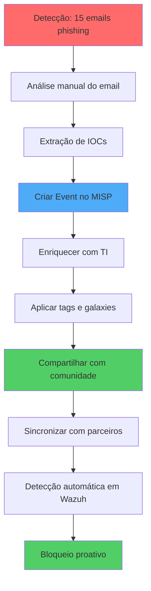
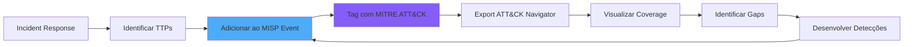
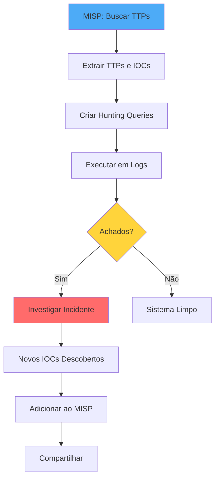

# Casos de Uso do MISP

## Visão Geral

Este guia apresenta casos de uso práticos e detalhados do MISP, demonstrando como aplicar Threat Intelligence em cenários reais de segurança cibernética.

!!! abstract "Casos de Uso Cobertos"
    1. Rastreamento de Campanha de Phishing
    2. Análise de Malware e Compartilhamento de IOCs
    3. Correlação de Ataques entre Organizações
    4. Integração com MITRE ATT&CK
    5. Threat Hunting com MISP

## Caso 1: Rastreamento de Campanha de Phishing

### Descrição

Uma organização detecta emails de phishing direcionados a funcionários do setor financeiro. O objetivo é documentar a campanha no MISP, compartilhar IOCs com parceiros e prevenir novos ataques.

### Cenário

```yaml
Situação Inicial:
  - 15 emails de phishing recebidos em 2 dias
  - Anexo: "Invoice_2025.doc.exe"
  - Domínio suspeito: secure-payment-verify.com
  - Assunto: "Urgent: Payment Verification Required"
  - Remetente: finance@secure-payment-verify.com

Alvo:
  - Setor: Financeiro (bancos, fintechs)
  - Região: Brasil e América Latina
  - Funcionários: Departamento financeiro, contabilidade

Objetivo do Atacante:
  - Roubo de credenciais bancárias
  - Instalação de trojan bancário (Emotet)
```

### Fluxo de Trabalho



### Passo a Passo

#### Passo 1: Análise do Email de Phishing

```yaml
Análise Manual:

Email Headers:
  From: finance@secure-payment-verify.com
  Reply-To: payments_urgent@protonmail.com
  To: contabilidade@banco-exemplo.com.br
  Subject: Urgent: Payment Verification Required
  Date: 2025-01-15 08:32:15 -0300
  Message-ID: <abc123@secure-payment-verify.com>
  X-Mailer: PHPMailer 6.5.0

Email Body:
  "Dear Customer,

  We have detected unusual activity in your account. Please verify your
  payment information immediately by clicking the link below:

  https://secure-payment-verify.com/verify?id=AB12CD34

  Failure to verify within 24 hours will result in account suspension.

  Regards,
  Payment Security Team"

Anexo:
  Filename: Invoice_2025.doc.exe
  Size: 245,760 bytes
  MD5: 5d41402abc4b2a76b9719d911017c592
  SHA256: d7a8fbb307d313a6df40847d1e0e9e56fcb7dcb3bb6e15e1a1d2c3d4e5f6a7b8
  MIME: application/x-dosexec

Link de Phishing:
  URL: https://secure-payment-verify.com/verify?id=AB12CD34
  IP Resolvido: 203.0.113.15
  Hosting: VPS provider - BulletProof Hosting
  Registrar: NameCheap (registrado 2025-01-10)

Indicadores de Phishing:
  ✓ Urgência artificial ("24 hours")
  ✓ Domínio typosquatting (secure-payment-verify vs secure-payment)
  ✓ Anexo executável disfarçado (.doc.exe)
  ✓ Reply-to diferente de from
  ✓ Domínio registrado recentemente
  ✓ Hosting suspeito
```

#### Passo 2: Criar Event no MISP

```
MISP > Event Actions > Add Event

Date: 2025-01-15
Distribution: This Community (começar restrito)
Threat Level: High
Analysis: Ongoing
Event Info: Phishing Campaign - Fake Payment Verification - Financial Sector Brazil
```

#### Passo 3: Adicionar Attributes

```
Add Attribute (múltiplas vezes):

1. Email Source:
   Category: Network activity
   Type: email-src
   Value: finance@secure-payment-verify.com
   Comment: Phishing email sender
   to_ids: ✓

2. Email Reply-To:
   Category: Network activity
   Type: email-dst
   Value: payments_urgent@protonmail.com
   Comment: Reply-to address (different from sender)
   to_ids: ✓

3. Email Subject:
   Category: Payload delivery
   Type: email-subject
   Value: Urgent: Payment Verification Required
   Comment: Phishing email subject line
   to_ids: ☐ (evitar FP)

4. Malicious Domain:
   Category: Network activity
   Type: domain
   Value: secure-payment-verify.com
   Comment: Phishing domain, registered 2025-01-10
   to_ids: ✓

5. Phishing URL:
   Category: Network activity
   Type: url
   Value: https://secure-payment-verify.com/verify
   Comment: Credential harvesting page
   to_ids: ✓

6. C2 IP:
   Category: Network activity
   Type: ip-dst
   Value: 203.0.113.15
   Comment: Server hosting phishing site and C2
   to_ids: ✓

7. Malware Hash (MD5):
   Category: Payload delivery
   Type: md5
   Value: 5d41402abc4b2a76b9719d911017c592
   Comment: Emotet trojan attached to email
   to_ids: ✓

8. Malware Hash (SHA256):
   Category: Payload delivery
   Type: sha256
   Value: d7a8fbb307d313a6df40847d1e0e9e56fcb7dcb3bb6e15e1a1d2c3d4e5f6a7b8
   Comment: Emotet trojan attached to email
   to_ids: ✓

9. Filename:
   Category: Payload delivery
   Type: filename
   Value: Invoice_2025.doc.exe
   Comment: Malicious attachment filename
   to_ids: ☐ (nome genérico, pode gerar FP)
```

#### Passo 4: Adicionar Objects

**Email Object**:

```
Add Object > Template: email

from: finance@secure-payment-verify.com
to: contabilidade@banco-exemplo.com.br
reply-to: payments_urgent@protonmail.com
subject: Urgent: Payment Verification Required
email-body: (colar corpo do email)
x-mailer: PHPMailer 6.5.0
attachment: (referenciar file object)
message-id: <abc123@secure-payment-verify.com>
```

**File Object** (para o anexo):

```
Add Object > Template: file

filename: Invoice_2025.doc.exe
md5: 5d41402abc4b2a76b9719d911017c592
sha256: d7a8fbb307d313a6df40847d1e0e9e56fcb7dcb3bb6e15e1a1d2c3d4e5f6a7b8
size-in-bytes: 245760
mime-type: application/x-dosexec
```

**Domain-IP Object**:

```
Add Object > Template: domain-ip

domain: secure-payment-verify.com
ip: 203.0.113.15
first-seen: 2025-01-10
```

#### Passo 5: Adicionar Tags e Galaxies

**Tags**:

```
Add Tag:
  - tlp:amber (compartilhamento limitado)
  - pap:green (pode bloquear)
  - phishing
  - financial-sector
  - emotet
  - brazil
```

**Galaxies**:

```
Add Galaxy:

1. MITRE ATT&CK:
   - T1566.001: Phishing - Spearphishing Attachment
   - T1566.002: Phishing - Spearphishing Link
   - T1204.002: User Execution - Malicious File
   - T1071.001: Application Layer Protocol - Web Protocols

2. Malware:
   - Galaxy: malware
   - Cluster: Emotet

3. Sector:
   - Galaxy: sector
   - Cluster: Financial
```

#### Passo 6: Publicar e Compartilhar

```
Event > Publish Event

⚠️ Antes de publicar:
  ✓ Validar todos os IOCs
  ✓ Confirmar TLP/PAP apropriados
  ✓ Revisar distribuição (This Community ou Connected Communities)
  ✓ Adicionar contexto suficiente

Publish > Confirm
```

#### Passo 7: Sincronização Automática

```yaml
Resultado da Publicação:

1. MISP sincroniza event com servidores conectados:
   - ISAC Financeiro Brasil
   - CERTs parceiros
   - Outras organizações no sharing group

2. Organizações parceiras recebem:
   - Event completo com IOCs
   - Contexto (email, TTPs, malware)
   - Tags e classificações

3. Importação automática para Wazuh:
   - Script misp_to_wazuh.py executa (cronjob)
   - IOCs adicionados a listas CDB
   - Wazuh começa a detectar automaticamente
```

### Detecção Proativa

Após 2 horas da publicação:

```yaml
Banco Parceiro B:

1. Funcionário recebe email similar
2. Clica no link: https://secure-payment-verify.com/verify
3. Wazuh agent captura acesso web no log do navegador
4. Wazuh rule 100110 dispara: "MISP: Access to malicious domain detected"
5. Alerta gerado:
   - Level: 10 (High)
   - Description: "MISP: Access to malicious domain detected - secure-payment-verify.com"
   - Rule: 100110
   - Source: Navegador do funcionário

6. TheHive cria caso automaticamente
7. SOC analista é notificado
8. Resposta imediata:
   - Bloquear domínio no proxy
   - Isolar máquina do funcionário
   - Resetar credenciais (precaução)

Resultado:
  - Ataque bloqueado antes de comprometimento
  - Tempo de detecção → resposta: < 5 minutos
  - Compartilhamento MISP salvou Banco B!
```

### Métricas de Sucesso

```yaml
Impacto da Campanha:

Antes do MISP (histórico):
  - 15 organizações comprometidas
  - Tempo médio de detecção: 7 dias
  - Perda financeira total: R$ 2.5 milhões

Com MISP (essa campanha):
  - Organização A: Detectou e publicou no MISP
  - Organizações B-J (9 parceiros): Bloquearam proativamente
  - Organizações K-L (2): Detectaram em < 1 hora
  - 0 comprometimentos adicionais
  - Economia estimada: R$ 2+ milhões

ROI do Compartilhamento: ♾️ (infinito - prevenção é invaluável)
```

## Caso 2: Análise de Malware e Compartilhamento de IOCs

### Descrição

Analista de malware detecta nova variante de ransomware. Realiza análise completa, extrai IOCs e compartilha findings no MISP para proteger comunidade.

### Cenário

```yaml
Situação:
  - Ransomware detectado em endpoint
  - Família: LockBit 3.0 (variante modificada)
  - Criptografia: .lockbit3 extension
  - Nota de resgate: README.txt

Análise:
  - Sandbox: Cuckoo, ANY.RUN
  - Análise estática: PE headers, strings, imports
  - Análise dinâmica: Comportamento, network, registry
```

### Análise de Malware

```yaml
Análise Estática:

File:
  Nome: system_update.exe
  MD5: 9a7b2c3d4e5f6a7b8c9d0e1f2a3b4c5d
  SHA1: 1b2c3d4e5f6a7b8c9d0e1f2a3b4c5d6e7f8a9b0
  SHA256: a1b2c3d4e5f6a7b8c9d0e1f2a3b4c5d6e7f8a9b0c1d2e3f4a5b6c7d8e9f0a1b2
  Tamanho: 1,245,184 bytes
  Compilador: MSVC 2019
  Packed: Yes (UPX)
  Entropy: 7.8 (high - indicador de packing/crypto)

Strings Interessantes:
  - "\\\\GLOBALROOT\\Device\\ConDrv"
  - "vssadmin delete shadows /all /quiet"
  - "wmic shadowcopy delete"
  - "bcdedit /set {default} recoveryenabled no"
  - "http://lockbit3onion.onion/payment?id="

Imports Suspeitos:
  - CryptEncryptMessage (criptografia)
  - RegSetValueExA (modificação de registro)
  - CreateProcessA (execução de processos)
  - InternetOpenUrlA (comunicação C2)

Análise Dinâmica (Sandbox):

Comportamento:
  1. Deleta shadow copies (dificultar recuperação)
  2. Modifica boot configuration (desabilitar recovery)
  3. Enumera arquivos no sistema
  4. Criptografa arquivos (.docx, .xlsx, .pdf, .jpg, etc)
  5. Adiciona extensão .lockbit3
  6. Cria README.txt em cada pasta
  7. Contata C2: 203.0.113.25:8080

Network IOCs:
  - C2 IP: 203.0.113.25
  - C2 Port: 8080
  - C2 Domain: lockbit3c2.onion (Tor)
  - DNS Queries: api.ipify.org (obter IP público da vítima)

Registry IOCs:
  - HKLM\SOFTWARE\Microsoft\Windows\CurrentVersion\Run\SystemUpdate
  - Valor: C:\ProgramData\system_update.exe (persistência)

Mutexes:
  - Global\LockBit3_Mutex_2025

Ransom Note:
  "Your files have been encrypted by LockBit 3.0.

  To decrypt, visit: http://lockbit3onion.onion/payment?id=VICTIM_ID_12345

  Payment: 5 BTC (≈ $200,000 USD)
  Deadline: 7 days or data will be published

  Do NOT contact law enforcement or your data will be leaked."

Wallet Bitcoin:
  - bc1qxy2kgdygjrsqtzq2n0yrf2493p83kkfjhx0wlh (exemplo)
```

### Criar Event no MISP

#### Event Principal

```
Event Actions > Add Event

Date: 2025-01-20
Distribution: Connected Communities
Threat Level: High
Analysis: Completed
Event Info: LockBit 3.0 Ransomware - New Variant - January 2025
```

#### Attributes (IOCs Completos)

```
File IOCs:

1. md5: 9a7b2c3d4e5f6a7b8c9d0e1f2a3b4c5d (to_ids: ✓)
2. sha1: 1b2c3d4e5f6a7b8c9d0e1f2a3b4c5d6e7f8a9b0 (to_ids: ✓)
3. sha256: a1b2c3d4e5f6a7b8c9d0e1f2a3b4c5d6e7f8a9b0c1d2e3f4a5b6c7d8e9f0a1b2 (to_ids: ✓)
4. filename: system_update.exe (to_ids: ☐)
5. size-in-bytes: 1245184
6. entropy: 7.8

Network IOCs:

7. ip-dst: 203.0.113.25 (C2 server, to_ids: ✓)
8. port: 8080 (C2 port)
9. domain: lockbit3c2.onion (to_ids: ✓)
10. url: http://lockbit3onion.onion/payment (Payment portal, to_ids: ✓)

Behavioral IOCs:

11. mutex: Global\LockBit3_Mutex_2025 (to_ids: ✓)
12. regkey: HKLM\SOFTWARE\Microsoft\Windows\CurrentVersion\Run\SystemUpdate (to_ids: ✓)
13. filename: README.txt (Ransom note, to_ids: ☐)
14. text: "Your files have been encrypted by LockBit 3.0" (Ransom note content)

Attribution:

15. btc: bc1qxy2kgdygjrsqtzq2n0yrf2493p83kkfjhx0wlh (Payment wallet, to_ids: ☐)
16. email-dst: support@lockbit3onion.onion (Contact email se não pagar)
```

#### Objects

```
1. File Object (malware):
   - filename: system_update.exe
   - md5, sha1, sha256: (como acima)
   - size-in-bytes: 1245184
   - entropy: 7.8
   - mime-type: application/x-dosexec
   - ssdeep: (fuzzy hash se disponível)

2. Network Connection Object (C2):
   - ip-dst: 203.0.113.25
   - dst-port: 8080
   - protocol: TCP
   - hostname: lockbit3c2.onion

3. Registry Key Object:
   - regkey: HKLM\SOFTWARE\Microsoft\Windows\CurrentVersion\Run
   - regkey|value: SystemUpdate|C:\ProgramData\system_update.exe
```

#### Galaxies e Tags

```
Galaxies:

1. Ransomware:
   - LockBit 3.0

2. MITRE ATT&CK:
   - T1486: Data Encrypted for Impact
   - T1490: Inhibit System Recovery (delete shadows)
   - T1547.001: Boot or Logon Autostart - Registry Run Keys
   - T1027: Obfuscated Files or Information (UPX packing)
   - T1071.001: Application Layer Protocol - Web (C2 over HTTP)

Tags:
  - tlp:amber
  - pap:green
  - ransomware
  - lockbit
  - malware-analysis
  - family:lockbit3
```

#### Malware Sample Upload (Opcional)

```
⚠️ Cuidado: Apenas se MISP configurado para armazenar malware com segurança

Add Attribute:
  Type: malware-sample
  File: system_update.exe (será zipado e criptografado automaticamente)
  Password: infected (senha padrão)
  Comment: LockBit 3.0 variant for analysis
```

### Compartilhar com Comunidade

```
Event > Publish

Resultado:
  - Event sincronizado com CERTs, ISACs
  - IOCs distribuídos para EDRs, firewalls
  - Comunidade pode:
    * Bloquear IOCs proativamente
    * Detectar variantes similares (fuzzy hash)
    * Identificar vítimas (via sightings)
    * Desenvolver detecções (YARA, Sigma)
```

### Detecção em Outras Organizações

```yaml
Empresa C (1 dia depois):

1. EDR detecta file creation: system_update.exe
2. Calcula hash SHA256
3. Consulta MISP (via Cortex analyzer)
4. Match! Ransomware LockBit 3.0
5. EDR:
   - Bloqueia execução automaticamente
   - Isola host da rede
   - Alerta SOC
6. SOC:
   - Contém ameaça em < 1 minuto
   - Evita criptografia
   - Salva empresa de $200k de resgate + downtime

Sighting:
  - Empresa C adiciona sighting ao attribute no MISP
  - Comunidade vê: "Este IOC foi detectado em 3 organizações"
  - Aumenta urgência de outros bloquearem
```

## Caso 3: Correlação de Ataques entre Organizações

### Descrição

Múltiplas organizações sofrem ataques similares. MISP correlaciona automaticamente IOCs, revelando campanha coordenada de APT.

### Cenário

```mermaid
graph TB
    subgraph "Week 1"
        ORG_A[Org A: Phishing Email]
    end

    subgraph "Week 2"
        ORG_B[Org B: Malware Infection]
    end

    subgraph "Week 3"
        ORG_C[Org C: C2 Communication]
        ORG_D[Org D: Data Exfiltration]
    end

    ORG_A -.Same IP: 203.0.113.50.-> MISP[MISP Correlação Automática]
    ORG_B -.Same IP: 203.0.113.50.-> MISP
    ORG_C -.Same Domain: apt28-c2.com.-> MISP
    ORG_D -.Same Domain: apt28-c2.com.-> MISP

    MISP --> REVEAL[Revela: Campanha APT28 Coordenada]

    style MISP fill:#4dabf7
    style REVEAL fill:#ff6b6b
```

### Timeline de Events

```yaml
Event 1 - Org A (2025-01-15):
  Info: "Spear-phishing Campaign - Government Sector"
  IOCs:
    - email-src: ambassador@fake-embassy.com
    - domain: fake-embassy.com
    - ip-dst: 203.0.113.50
  Tags: spear-phishing, government
  Distribution: This Community

Event 2 - Org B (2025-01-22):
  Info: "Malware Infection - Unknown Trojan"
  IOCs:
    - sha256: xyz789... (malware hash)
    - ip-dst: 203.0.113.50 (C2 server)
    - mutex: Global\APT_Mutex_2025
  Tags: malware, trojan
  Distribution: This Community

Event 3 - Org C (2025-01-29):
  Info: "Suspicious C2 Communication Detected"
  IOCs:
    - domain: apt28-c2.com
    - ip-dst: 203.0.113.50 (mesmo IP!)
    - port: 443
  Tags: c2-communication
  Distribution: Connected Communities

Event 4 - Org D (2025-02-05):
  Info: "Data Exfiltration Attempt"
  IOCs:
    - domain: apt28-c2.com (mesmo domínio!)
    - ip-dst: 203.0.113.50 (mesmo IP!)
    - dst-port: 443
    - data-exfiltration-bytes: 2.5GB
  Tags: exfiltration, data-breach
  Distribution: Connected Communities
```

### Correlação Automática do MISP

```
MISP detecta automaticamente:

IP 203.0.113.50 aparece em:
  ✓ Event 1 (Org A)
  ✓ Event 2 (Org B)
  ✓ Event 3 (Org C)
  ✓ Event 4 (Org D)

Domain apt28-c2.com aparece em:
  ✓ Event 3 (Org C)
  ✓ Event 4 (Org D)

Correlações criadas automaticamente!
```

### Análise Colaborativa

```yaml
CERT Nacional (coordenador):

1. Observa correlações no MISP
2. Identifica padrão de ataque
3. Cria event meta (consolidado):

Event 5 - CERT (2025-02-06):
  Info: "APT28 Multi-Stage Campaign - January-February 2025"
  Description: |
    Campanha coordenada de APT28 identificada através de correlação
    de IOCs reportados por múltiplas organizações.

    Fases observadas:
    1. Spear-phishing (Org A)
    2. Malware deployment (Org B)
    3. C2 establishment (Org C)
    4. Data exfiltration (Org D)

    Todas as organizações afetadas são do setor governamental.
    Infraestrutura compartilhada: 203.0.113.50, apt28-c2.com

  References:
    - Event #1 (Org A)
    - Event #2 (Org B)
    - Event #3 (Org C)
    - Event #4 (Org D)

  IOCs Consolidados:
    - (Todos os IOCs dos 4 events)

  Galaxies:
    - Threat Actor: APT28 (Fancy Bear)
    - MITRE ATT&CK: (TTPs observadas em todas as fases)

  Tags:
    - tlp:amber
    - apt28
    - government-sector
    - multi-stage-attack
    - coordinated-campaign

  Distribution: Connected Communities
  Sharing Group: Government Sector - National
```

### Ações Coordenadas

```yaml
Após Identificação da Campanha:

CERT Nacional:
  - Emite alerta nacional
  - Coordena resposta entre organizações
  - Compartilha IOCs com comunidade global

Organizações Afetadas:
  - Org A-D: Investigação forense completa
  - Identificam dados comprometidos
  - Aplicam remediações

Organizações Não-Afetadas:
  - Org E-Z: Bloqueiam IOCs proativamente
  - Hunting interno para indicadores similares
  - Reforçam monitoramento

Comunidade Internacional:
  - CERTs de outros países recebem alerta
  - Coordenação com autoridades
  - Takedown de infraestrutura (203.0.113.50)

Resultado:
  - Campanha APT mapeada completamente
  - Infraestrutura derrubada em 48h
  - 20+ organizações protegidas proativamente
  - Attribution formal a APT28
```

## Caso 4: Integração com MITRE ATT&CK

### Descrição

Usar MISP para mapear TTPs de incidentes para MITRE ATT&CK, gerando heatmap de cobertura e identificando gaps de detecção.

### Workflow



### Exemplo: Mapeando Incidente

```yaml
Incidente: Ransomware Attack via RDP Brute-Force

Fase 1: Initial Access
  TTP: T1078 - Valid Accounts (RDP brute-force)
  TTP: T1133 - External Remote Services (RDP exposto)

Fase 2: Execution
  TTP: T1059.001 - Command and Scripting Interpreter: PowerShell
  TTP: T1203 - Exploitation for Client Execution

Fase 3: Persistence
  TTP: T1547.001 - Boot or Logon Autostart - Registry Run Keys

Fase 4: Privilege Escalation
  TTP: T1055 - Process Injection
  TTP: T1134 - Access Token Manipulation

Fase 5: Defense Evasion
  TTP: T1070.004 - Indicator Removal - File Deletion (logs)
  TTP: T1562.001 - Impair Defenses - Disable or Modify Tools (AV)

Fase 6: Credential Access
  TTP: T1003.001 - OS Credential Dumping - LSASS Memory (Mimikatz)

Fase 7: Discovery
  TTP: T1083 - File and Directory Discovery
  TTP: T1082 - System Information Discovery

Fase 8: Lateral Movement
  TTP: T1021.001 - Remote Services - Remote Desktop Protocol

Fase 9: Command and Control
  TTP: T1071.001 - Application Layer Protocol - Web Protocols (HTTPS)

Fase 10: Exfiltration
  TTP: T1041 - Exfiltration Over C2 Channel

Fase 11: Impact
  TTP: T1486 - Data Encrypted for Impact (Ransomware)
  TTP: T1490 - Inhibit System Recovery (Delete backups)
```

### Adicionar ao MISP

```
Event: Ransomware Attack via RDP - Full Kill Chain

Add Galaxy > mitre-attack-pattern

Adicionar cada TTP (11 total):
  - T1078: Valid Accounts
  - T1133: External Remote Services
  - ... (todas as TTPs acima)

Export ATT&CK Navigator Layer:
  Event > Download as > ATT&CK Navigator Layer (JSON)
```

### Visualizar em ATT&CK Navigator

```yaml
Importar JSON em: https://mitre-attack.github.io/attack-navigator/

Resultado:
  - Matriz ATT&CK colorida
  - TTPs usadas no incidente destacadas em vermelho
  - Identificar quais táticas foram mais usadas
  - Comparar com detecções existentes
```

### Identificar Gaps de Detecção

```yaml
Análise de Cobertura:

TTPs Detectadas (✓):
  - T1078: RDP brute-force (Wazuh rule existente)
  - T1059.001: PowerShell (Sysmon + Wazuh)
  - T1486: File encryption (EDR)

TTPs NÃO Detectadas (❌ GAPS!):
  - T1070.004: Log deletion (não monitorado)
  - T1562.001: AV disable (não alertado)
  - T1003.001: LSASS dumping (não detectado)

Ação:
  1. Desenvolver rules Wazuh para gaps
  2. Configurar Sysmon para monitorar LSASS access
  3. Alertar sobre mudanças em serviços AV
  4. Testar detecções (purple team)
```

## Caso 5: Threat Hunting com MISP

### Descrição

Usar MISP para threat hunting proativo: buscar TTPs e IOCs de campanhas conhecidas em logs históricos.

### Workflow



### Exemplo: Hunting para APT28

```yaml
1. Buscar no MISP:
   - Galaxy: Threat Actor → APT28
   - Filtrar events dos últimos 12 meses
   - Extrair TTPs comuns

2. TTPs Mais Usadas por APT28:
   - T1566.001: Spear-phishing Attachment
   - T1059.001: PowerShell
   - T1053.005: Scheduled Task
   - T1003.001: LSASS Dumping (Mimikatz)
   - T1071.001: HTTPS C2

3. Criar Hunting Queries para Wazuh/ELK:

Query 1 - PowerShell Suspicious:
  rule.groups: "windows" AND process.name: "powershell.exe"
  AND (process.command_line: "*-enc*" OR process.command_line: "*downloadstring*")

Query 2 - Scheduled Task Creation:
  event.code: "4698" (Windows Event - Scheduled task created)
  AND NOT task.name: "Microsoft\\Windows\\*"

Query 3 - LSASS Access:
  event.code: "10" (Sysmon - Process Access)
  AND target.process: "lsass.exe"
  AND source.process: NOT "C:\\Windows\\System32\\*"

Query 4 - Suspicious Outbound HTTPS:
  destination.port: 443
  AND NOT destination.ip: (IPs conhecidos legítimos)
  AND ssl.certificate: (self-signed ou suspeito)

4. Executar queries em logs dos últimos 90 dias

5. Analisar resultados:
   - 15 hits em Query 1 (PowerShell suspeito)
   - 3 hits em Query 2 (Scheduled tasks não-MS)
   - 2 hits em Query 3 (LSASS access suspeito)
   - 50 hits em Query 4 (mas 48 são falsos positivos)

6. Investigar hits:
   - 2 LSASS access: Mimikatz foi executado!
   - Timeline: 45 dias atrás (não detectado na época)
   - Host: SERVER-DC01 (Domain Controller!)

7. Resposta:
   - Forense completa em SERVER-DC01
   - Verificar se credenciais foram comprometidas
   - Resetar senhas de domain admins
   - Adicionar detecção permanente para LSASS dumping

8. Atualizar MISP:
   - Criar event: "APT28 Activity Discovered via Threat Hunting"
   - Adicionar IOCs descobertos
   - Compartilhar com comunidade
   - Adicionar sightings aos TTPs de APT28
```

## Métricas e KPIs

### Medir Efetividade do MISP

```yaml
Métricas de Input (Contribuição):
  - Events criados por mês
  - IOCs compartilhados
  - Sightings adicionados
  - Proposals submetidos

Métricas de Output (Benefício):
  - Detecções via IOCs do MISP (Wazuh rules 100100+)
  - Tempo médio de detecção (antes vs depois)
  - Incidentes prevenidos (estimativa)
  - Organizações beneficiadas por seus IOCs

Métricas de Qualidade:
  - Taxa de falsos positivos
  - Taxa de acceptance de proposals
  - Correlações úteis encontradas
  - Cobertura ATT&CK (% de técnicas mapeadas)

Métricas de Comunidade:
  - Número de organizações conectadas
  - Volume de sincronização (events/mês)
  - Participação em ISACs
  - Reciprocidade (contributed vs received)

ROI:
  - Custo de incidente evitado
  - Tempo economizado em análises
  - Redução de dwell time
  - Valor de inteligência compartilhada
```

## Conclusão

Estes casos de uso demonstram o poder do MISP quando usado efetivamente:

- **Compartilhamento salva organizações**: IOCs publicados por uma organização protegem dezenas de outras
- **Correlação revela campanhas**: IOCs isolados, quando correlacionados, revelam ataques coordenados
- **TTPs > IOCs**: Mapear táticas e técnicas é tão importante quanto IOCs
- **Automação é chave**: Integração com Wazuh, TheHive, Shuffle multiplica eficácia
- **Comunidade é essencial**: Participação ativa em ISACs e sharing groups é crítica

!!! quote "Lição Final"
    "MISP não é apenas uma ferramenta, é uma filosofia: compartilhar para proteger, colaborar para defender."

---

**Documentação**: NEO_NETBOX_ODOO Stack - MISP
**Versão**: 1.0
**Última Atualização**: 2025-12-05
