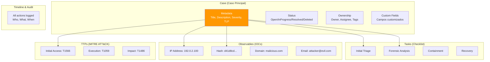
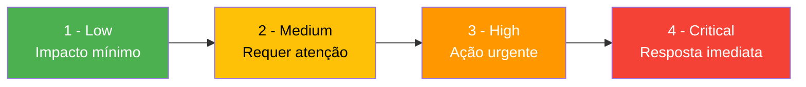
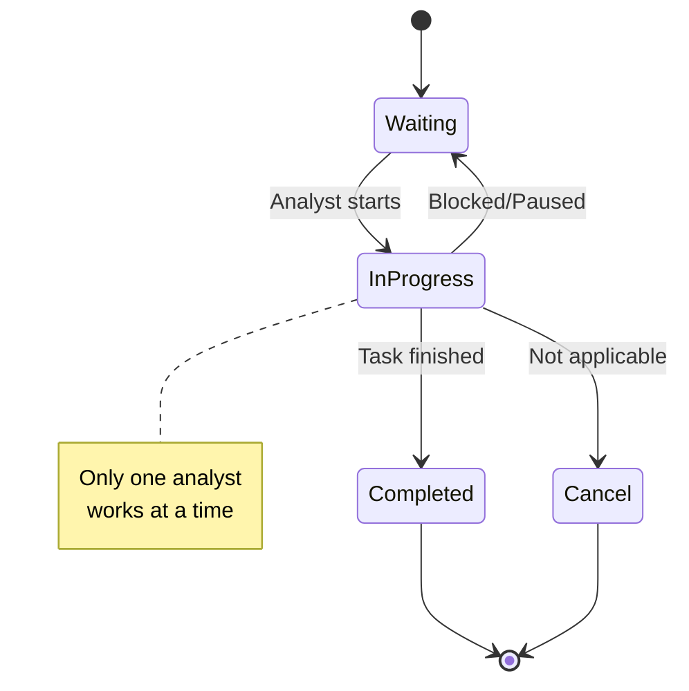
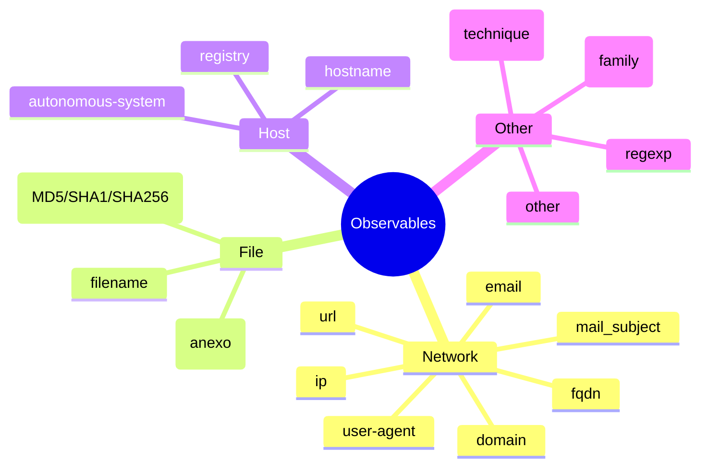

# Gestão de Casos no TheHive

## Visão Geral

!!! info "AI Context: Case Management"
    Cases (casos) são o núcleo do TheHive - representam incidentes de segurança que requerem investigação formal. Um caso contém informações estruturadas como título, descrição, severidade, TLP, tasks (checklist de ações), observables (IOCs coletados), TTPs (mapeamento MITRE ATT&CK) e timeline completa de todas as ações realizadas. Este guia cobre desde criação manual de casos até templates, métricas e relatórios.

Este guia completo ensina como gerenciar casos de segurança no TheHive, desde a criação até o fechamento, incluindo tasks, observables, TTPs e geração de relatórios.

## Anatomia de um Caso no TheHive

### Estrutura Completa



### Campos Principais de um Caso

| Campo | Tipo | Descrição | Exemplo |
|-------|------|-----------|---------|
| **title** | String | Título resumido do incidente | "Ransomware Conti on Finance Server" |
| **description** | Markdown | Descrição detalhada | "EDR detected file encryption on finance-srv-01..." |
| **severity** | 1-4 | Criticidade (1=Low, 4=Critical) | 3 (High) |
| **tlp** | Enum | Traffic Light Protocol | AMBER |
| **pap** | Enum | Permissible Actions Protocol | AMBER |
| **status** | Enum | Estado atual | Open/InProgress/Resolved |
| **owner** | User | Responsável geral pelo caso | analyst@company.com |
| **assignee** | User | Analista atual trabalhando | senior-analyst@company.com |
| **tags** | Array | Tags para categorização | ["ransomware", "conti", "finance"] |
| **startDate** | Timestamp | Data/hora de início | 2024-01-15T08:30:00Z |
| **endDate** | Timestamp | Data/hora de resolução | null (se ainda aberto) |
| **customFields** | Object | Campos customizados | {"affected-systems": "srv-01, srv-02"} |

## Criação Manual de Casos

### Via Interface Web

#### Passo 1: Acessar Criação de Caso

```
Dashboard > Cases > New Case (botão +)
```

#### Passo 2: Preencher Informações Básicas

![Conceito: Formulário de Criação de Caso]

```yaml
# Exemplo de preenchimento

Title: "Suspected Brute Force Attack on SSH Server"

Description: |
  ## Incident Summary
  Multiple failed SSH login attempts detected on production web server
  prod-web-01 originating from external IP 203.0.113.50.

  ## Initial Observations
  - 450 failed login attempts in 15 minutes
  - Targeting user accounts: root, admin, webmaster
  - Source IP: 203.0.113.50 (China, ASN 4134)
  - Started at: 2024-01-15 14:23:00 UTC

  ## Immediate Actions Taken
  - IP blocked temporarily via firewall rule
  - Monitoring active for additional attempts

Severity: 2 (Medium)
TLP: AMBER
PAP: AMBER
Tags: ["brute-force", "ssh", "external-attack", "prod-web-01"]
```

!!! tip "Markdown Support"
    O campo Description suporta **Markdown completo**, permitindo:
    - Cabeçalhos (`#`, `##`, `###`)
    - Listas ordenadas e não ordenadas
    - Code blocks com syntax highlighting
    - Links e imagens
    - Tabelas

#### Passo 3: Configurar Severidade e TLP

**Severidade:**



**TLP (Traffic Light Protocol):**

| TLP Level | Compartilhamento | Quando Usar |
|-----------|------------------|-------------|
| **RED** | Não compartilhar | Informações extremamente sensíveis (senhas, chaves) |
| **AMBER** | Compartilhamento limitado | Informações sensíveis (IPs internos, detalhes técnicos) |
| **AMBER+STRICT** | Apenas sua organização | Detalhes internos que não devem sair da empresa |
| **GREEN** | Comunidade relevante | IOCs úteis para parceiros/comunidade |
| **WHITE/CLEAR** | Público | Informações já públicas (advisories, CVEs) |

**PAP (Permissible Actions Protocol):**

| PAP Level | Ações Permitidas |
|-----------|-----------------|
| **RED** | Não agir com base nesta informação |
| **AMBER** | Ações limitadas, coordenar com fonte |
| **GREEN** | Ações permitidas dentro da organização |
| **WHITE/CLEAR** | Ações públicas permitidas |

#### Passo 4: Adicionar Custom Fields (Opcional)

Custom fields permitem adicionar metadados estruturados específicos da sua organização:

```yaml
Custom Fields:
  affected-systems:
    type: string
    value: "prod-web-01, prod-web-02"

  business-impact:
    type: string
    value: "High - Production website temporarily unreachable"

  estimated-cost:
    type: number
    value: 15000  # USD

  compliance-required:
    type: boolean
    value: true

  incident-category:
    type: string
    value: "Unauthorized Access Attempt"
```

### Via API (Automação)

#### Criar Caso via curl

```bash
curl -X POST http://thehive.company.local:9000/api/v1/case \
  -H "Authorization: Bearer YOUR_API_KEY" \
  -H "Content-Type: application/json" \
  -d '{
    "title": "Automated Case from Wazuh Alert",
    "description": "## Alert Details\n\nRule ID: 5710 - Possible SSH brute force attack\n\n## Source\n- IP: 203.0.113.50\n- Agent: prod-web-01\n- Timestamp: 2024-01-15T14:23:00Z",
    "severity": 2,
    "tlp": 2,
    "pap": 2,
    "tags": ["wazuh", "brute-force", "ssh"],
    "customFields": {
      "wazuh-rule-id": {
        "string": "5710"
      },
      "source-ip": {
        "string": "203.0.113.50"
      }
    }
  }'
```

**Resposta:**

```json
{
  "_id": "~1234567890",
  "_type": "case",
  "title": "Automated Case from Wazuh Alert",
  "number": 42,
  "status": "Open",
  "severity": 2,
  "tlp": 2,
  "createdAt": 1705329780000,
  "createdBy": "api-user@company.local"
}
```

#### Criar Caso via Python

```python
import requests
import json
from datetime import datetime

THEHIVE_URL = "http://thehive.company.local:9000"
API_KEY = "YOUR_API_KEY"

headers = {
    "Authorization": f"Bearer {API_KEY}",
    "Content-Type": "application/json"
}

case_data = {
    "title": "Malware Detection on Workstation",
    "description": f"""
## Incident Summary
VirusTotal detected malware on workstation WS-FIN-045.

## Details
- Timestamp: {datetime.utcnow().isoformat()}
- File: invoice_urgent.pdf.exe
- Hash: d41d8cd98f00b204e9800998ecf8427e
- Detection: Trojan.Generic (35/50 engines)

## User
- Username: john.doe
- Department: Finance
- Email: john.doe@company.local
    """,
    "severity": 3,  # High
    "tlp": 2,       # AMBER
    "pap": 2,
    "tags": ["malware", "finance", "trojan", "virustotal"],
    "customFields": {
        "affected-user": {"string": "john.doe"},
        "workstation": {"string": "WS-FIN-045"},
        "file-hash": {"string": "d41d8cd98f00b204e9800998ecf8427e"}
    }
}

response = requests.post(
    f"{THEHIVE_URL}/api/v1/case",
    headers=headers,
    data=json.dumps(case_data)
)

if response.status_code == 201:
    case = response.json()
    print(f"Case created successfully!")
    print(f"Case ID: {case['_id']}")
    print(f"Case Number: #{case['number']}")
else:
    print(f"Error creating case: {response.status_code}")
    print(response.text)
```

## Templates de Casos

### Por que Usar Templates?

Templates padronizam a resposta a incidentes recorrentes, garantindo que:

- Nenhuma etapa crítica seja esquecida
- Todos os analistas sigam o mesmo procedimento
- Métricas sejam comparáveis entre casos similares
- Onboarding de novos analistas seja mais rápido

### Criar Template via UI

```
Settings > Case Templates > New Template
```

### Exemplo: Template para Ransomware

```yaml
Template Name: "Ransomware Incident Response"

Description: |
  Template para resposta a incidentes de ransomware, seguindo
  o playbook SANS ICS410 e NIST SP 800-61.

Title Pattern: "Ransomware - {affected-system} - {date}"

Severity: 3 (High)
TLP: AMBER
PAP: AMBER

Tags:
  - ransomware
  - incident-response
  - business-critical

Tasks:
  1. Initial Triage (Waiting)
     - [ ] Identificar sistemas afetados
     - [ ] Identificar variante do ransomware
     - [ ] Avaliar impacto nos negócios
     - [ ] Notificar stakeholders (CISO, Legal, PR)

  2. Containment (Waiting)
     - [ ] Isolar sistemas afetados da rede
     - [ ] Desabilitar contas comprometidas
     - [ ] Bloquear IOCs no firewall/proxy
     - [ ] Preservar evidências (snapshots, memória)

  3. Forensic Analysis (Waiting)
     - [ ] Capturar imagem de memória
     - [ ] Capturar imagem de disco
     - [ ] Identificar vetor de entrada inicial
     - [ ] Identificar C2 servers
     - [ ] Determinar exfiltração de dados
     - [ ] Coletar ransom note

  4. Eradication (Waiting)
     - [ ] Remover malware de todos os sistemas
     - [ ] Aplicar patches de segurança
     - [ ] Resetar credenciais (AD, VPNs, aplicações)
     - [ ] Validar remoção completa

  5. Recovery (Waiting)
     - [ ] Restaurar dados de backups (validados e limpos)
     - [ ] Reconstruir sistemas comprometidos
     - [ ] Validar integridade de dados restaurados
     - [ ] Retornar sistemas à produção gradualmente
     - [ ] Monitorar por reinfecção (48-72h)

  6. Post-Incident Activities (Waiting)
     - [ ] Documentar timeline completa do incidente
     - [ ] Identificar lições aprendidas
     - [ ] Atualizar runbooks e playbooks
     - [ ] Atualizar controles de segurança
     - [ ] Reportar para compliance/auditoria
     - [ ] Compartilhar IOCs com comunidade (MISP)

Custom Fields:
  ransom-note:
    type: string
    description: "Conteúdo da ransom note"

  ransom-amount:
    type: number
    description: "Valor do resgate (USD)"

  bitcoin-address:
    type: string
    description: "Endereço Bitcoin para pagamento"

  data-exfiltrated:
    type: boolean
    description: "Dados foram exfiltrados?"

  backup-available:
    type: boolean
    description: "Backups íntegros disponíveis?"

  downtime-hours:
    type: number
    description: "Horas de downtime total"
```

### Template para Phishing Investigation

```yaml
Template Name: "Phishing Email Investigation"

Description: |
  Template para investigação de emails de phishing reportados
  por usuários ou detectados automaticamente.

Title Pattern: "Phishing - {sender-email} - {date}"

Severity: 2 (Medium)
TLP: GREEN
PAP: GREEN

Tags:
  - phishing
  - email-security
  - social-engineering

Tasks:
  1. Email Analysis (Waiting)
     - [ ] Obter headers completos do email
     - [ ] Analisar sender (SPF, DKIM, DMARC)
     - [ ] Identificar links maliciosos
     - [ ] Identificar anexos maliciosos
     - [ ] Classificar tipo de phishing (credential harvesting, malware, etc)

  2. IOC Collection (Waiting)
     - [ ] Extrair todos os IPs/domínios do email
     - [ ] Extrair hashes de anexos
     - [ ] Analisar links (VirusTotal, URLScan)
     - [ ] Analisar anexos (VirusTotal, Hybrid Analysis)

  3. Impact Assessment (Waiting)
     - [ ] Identificar todos os destinatários
     - [ ] Verificar quem abriu o email
     - [ ] Verificar quem clicou em links
     - [ ] Verificar quem baixou anexos
     - [ ] Verificar quem forneceu credenciais

  4. Containment (Waiting)
     - [ ] Deletar email de todas as mailboxes
     - [ ] Bloquear sender no gateway de email
     - [ ] Bloquear URLs/domínios no proxy
     - [ ] Resetar credenciais comprometidas

  5. User Notification (Waiting)
     - [ ] Notificar usuários afetados
     - [ ] Fornecer orientações de segurança
     - [ ] Solicitar vigilância por atividades suspeitas

  6. Documentation (Waiting)
     - [ ] Documentar técnica de phishing utilizada
     - [ ] Gerar relatório para awareness training
     - [ ] Compartilhar IOCs (MISP)

Custom Fields:
  sender-email:
    type: string
    description: "Email do remetente"

  sender-ip:
    type: string
    description: "IP de origem do email"

  subject:
    type: string
    description: "Assunto do email"

  recipients-count:
    type: number
    description: "Número de destinatários"

  clicked-count:
    type: number
    description: "Número de usuários que clicaram"

  credentials-entered:
    type: number
    description: "Número de usuários que forneceram credenciais"
```

### Usar Template ao Criar Caso

```
New Case > Select Template > "Ransomware Incident Response"
```

Todos os campos, tasks e custom fields serão pré-preenchidos automaticamente!

## Tasks e Subtasks

### Criar Task Manualmente

Na página do caso:

```
Tasks tab > Add Task
```

```yaml
Task:
  title: "Analyze malicious file with sandbox"
  status: Waiting
  description: |
    ## Objective
    Submit suspicious executable to Cuckoo Sandbox for behavioral analysis.

    ## Steps
    1. Extract file from quarantine
    2. Calculate all hashes (MD5, SHA1, SHA256)
    3. Submit to Cuckoo Sandbox
    4. Wait for analysis completion (~10 min)
    5. Review behavioral report
    6. Document findings in case

    ## Expected Artifacts
    - Sandbox report PDF
    - Network traffic PCAP
    - Registry changes
    - File system changes

  group: "Forensic Analysis"
  assignee: forensics@company.local
```

### Workflow de Task



### Organizar Tasks por Grupos

```yaml
Groups:
  - "Triage & Initial Response"
      - Identify affected systems
      - Assess severity
      - Notify stakeholders

  - "Investigation & Analysis"
      - Collect logs
      - Analyze malware
      - Identify IOCs

  - "Containment & Eradication"
      - Isolate systems
      - Block IOCs
      - Remove malware

  - "Recovery"
      - Restore from backup
      - Validate integrity
      - Return to production

  - "Post-Incident"
      - Document lessons learned
      - Update procedures
      - Share IOCs
```

### Task Dependencies (Via Description)

Embora TheHive não tenha dependências nativas, você pode documentá-las:

```markdown
## Dependencies

⚠️ This task depends on:
- [ ] Task #1: "Collect forensic image" (must be Completed)
- [ ] Task #3: "Obtain legal approval" (must be Completed)

✅ After completing this task, proceed to:
- Task #8: "Analyze memory dump"
- Task #9: "Timeline reconstruction"
```

## Observables (IOCs)

### Tipos de Observables Suportados



### Adicionar Observable Manualmente

Na página do caso:

```
Observables tab > Add Observable
```

```yaml
Observable:
  type: ip
  value: "203.0.113.50"
  tlp: AMBER
  ioc: true  # Marcar como Indicator of Compromise
  sighted: true  # Foi observado ativamente no ambiente
  tags:
    - c2-server
    - brute-force-source
  description: "C2 server identified during brute force investigation"
```

### Adicionar Multiple Observables (Bulk)

```
Observables tab > Add Multiple
```

```text
# Um observable por linha, formato: type:value

ip:203.0.113.50
ip:203.0.113.51
ip:203.0.113.52
domain:malicious-c2.example.com
domain:phishing-site.example.net
hash:d41d8cd98f00b204e9800998ecf8427e
hash:098f6bcd4621d373cade4e832627b4f6
email:attacker@evil.com
```

### Enrichment de Observables via Cortex

Se Cortex estiver configurado, você pode analisar observables automaticamente:

```
Observable > Actions > Run Analyzers
```

**Analyzers Disponíveis:**

| Analyzer | Observable Types | Informação Retornada |
|----------|-----------------|---------------------|
| **VirusTotal** | ip, domain, url, hash | Reputação, detecções AV, WHOIS |
| **AbuseIPDB** | ip | Score de abuso, relatórios históricos |
| **MaxMind GeoIP** | ip | País, cidade, ASN, ISP |
| **MISP** | all | Eventos relacionados, atributos |
| **PassiveTotal** | domain, ip | DNS histórico, WHOIS, SSL certs |
| **Shodan** | ip | Portas abertas, serviços, CVEs |
| **URLScan.io** | url | Screenshot, tecnologias, redirects |
| **Hybrid Analysis** | hash, file | Análise sandbox, behavior |
| **Google Safe Browsing** | url, domain | Status de segurança |
| **OTX AlienVault** | all | Pulses relacionados, reputação |

**Exemplo de Resultado (VirusTotal):**

```json
{
  "success": true,
  "full": {
    "results": {
      "positives": 15,
      "total": 50,
      "scan_date": "2024-01-15 14:30:00",
      "permalink": "https://virustotal.com/...",
      "verbose_msg": "IP address in dataset",
      "detected_urls": [
        {
          "url": "http://203.0.113.50/malware.exe",
          "positives": 35,
          "total": 50
        }
      ]
    }
  },
  "summary": {
    "taxonomies": [
      {
        "level": "malicious",
        "namespace": "VirusTotal",
        "predicate": "Score",
        "value": "15/50"
      }
    ]
  }
}
```

### Responders (Ações Automatizadas)

Responders permitem **tomar ações** baseadas em observables:

```
Observable > Actions > Run Responder
```

**Exemplos de Responders:**

| Responder | Ação | Observable Types |
|-----------|------|------------------|
| **Block IP (Firewall)** | Bloqueia IP no firewall | ip |
| **Block Domain (DNS)** | Bloqueia domínio no DNS resolver | domain, fqdn |
| **Delete Email** | Remove email de mailboxes | email |
| **Disable User** | Desabilita conta de usuário | user |
| **Isolate Host** | Isola host da rede (via EDR) | hostname, ip |
| **Send to MISP** | Cria evento no MISP | all |
| **Create Ticket** | Cria ticket no Odoo/ServiceNow | all |

!!! warning "Responders Requerem Cortex"
    Responders são executados via Cortex. Certifique-se de ter Cortex configurado e conectado ao TheHive.

### Similaridade de Observables

TheHive correlaciona automaticamente observables entre casos:

```
Observable > Similar Cases
```

Se o IP `203.0.113.50` apareceu em outros 3 casos nos últimos 30 dias, você verá:

```yaml
Similar Cases (3):
  - Case #38: "Brute Force Attack on VPN"
    - Date: 2024-01-10
    - Status: Resolved
    - Analyst: john.doe@company.local

  - Case #41: "Port Scan Activity"
    - Date: 2024-01-12
    - Status: Open
    - Analyst: jane.smith@company.local

  - Case #42: "SQL Injection Attempt"
    - Date: 2024-01-14
    - Status: InProgress
    - Analyst: senior-analyst@company.local
```

Isso ajuda a identificar **campanhas coordenadas** e **threat actors persistentes**.

## TTPs (MITRE ATT&CK)

### O que são TTPs?

**TTPs** (Tactics, Techniques, and Procedures) mapeiam o comportamento do atacante usando o framework **MITRE ATT&CK**, permitindo:

- Entender o modus operandi do atacante
- Comparar incidentes similares
- Identificar gaps de detecção
- Priorizar controles de segurança

### Framework MITRE ATT&CK

```mermaid
graph LR
    TA0001[Reconnaissance] --> TA0042[Resource Development]
    TA0042 --> TA0001_2[Initial Access]
    TA0001_2 --> TA0002[Execution]
    TA0002 --> TA0003[Persistence]
    TA0003 --> TA0004[Privilege Escalation]
    TA0004 --> TA0005[Defense Evasion]
    TA0005 --> TA0006[Credential Access]
    TA0006 --> TA0007[Discovery]
    TA0007 --> TA0008[Lateral Movement]
    TA0008 --> TA0009[Collection]
    TA0009 --> TA0011[Command & Control]
    TA0011 --> TA0010[Exfiltration]
    TA0010 --> TA0040[Impact]
```



### Adicionar TTP a um Caso

Na página do caso:

```
TTPs tab > Add TTP
```

```yaml
TTP:
  tactic: "Initial Access"
  technique: "T1566.001 - Phishing: Spearphishing Attachment"
  description: |
    Usuário abriu anexo malicioso (invoice_urgent.pdf.exe) recebido
    por email de phishing.

    Evidence:
    - Email received: 2024-01-15 08:15:00
    - Attachment opened: 2024-01-15 08:23:00
    - EDR detected suspicious process execution

  occurredAt: "2024-01-15T08:23:00Z"
```

### Exemplo Completo: Ransomware Attack

```yaml
TTPs for Ransomware Case #42:

  1. Initial Access
     - T1566.001: Phishing: Spearphishing Attachment
       "User opened malicious PDF attachment"

  2. Execution
     - T1204.002: User Execution: Malicious File
       "PDF.exe executed by user"

  3. Persistence
     - T1547.001: Registry Run Keys / Startup Folder
       "Created registry key HKCU\Software\Microsoft\Windows\CurrentVersion\Run"

  4. Privilege Escalation
     - T1068: Exploitation for Privilege Escalation
       "Exploited CVE-2021-34527 (PrintNightmare)"

  5. Defense Evasion
     - T1562.001: Impair Defenses: Disable or Modify Tools
       "Disabled Windows Defender via registry"

  6. Credential Access
     - T1003.001: OS Credential Dumping: LSASS Memory
       "Dumped credentials from LSASS using Mimikatz"

  7. Discovery
     - T1082: System Information Discovery
       "Enumerated system info, hostname, domain"
     - T1083: File and Directory Discovery
       "Searched for valuable files (.xlsx, .docx, .pdf)"

  8. Lateral Movement
     - T1021.001: Remote Services: Remote Desktop Protocol
       "RDP to finance-srv-02 using stolen credentials"

  9. Collection
     - T1005: Data from Local System
       "Collected documents from file server"

  10. Command and Control
      - T1071.001: Application Layer Protocol: Web Protocols
        "Connected to C2 server malicious-c2.example.com via HTTPS"

  11. Impact
      - T1486: Data Encrypted for Impact
        "Encrypted files with .conti extension"
      - T1489: Service Stop
        "Stopped backup services"
```

### Visualização ATT&CK Navigator

TheHive 5.x permite exportar TTPs para o **MITRE ATT&CK Navigator**:

```
Case > TTPs > Export to ATT&CK Navigator
```

Isso gera um heat map visual das técnicas utilizadas no ataque.

## Timeline de Investigação

### Timeline Automática

TheHive mantém automaticamente uma **timeline completa** de todas as ações:

```yaml
Timeline for Case #42:

  2024-01-15 08:15:00 | Case Created
    - Created by: analyst-l1@company.local
    - Title: "Ransomware - finance-srv-01"

  2024-01-15 08:18:00 | Observable Added
    - Type: hash
    - Value: d41d8cd98f00b204e9800998ecf8427e
    - Added by: analyst-l1@company.local

  2024-01-15 08:20:00 | Analyzer Ran
    - Analyzer: VirusTotal
    - Result: Malicious (35/50 engines)

  2024-01-15 08:25:00 | Case Assigned
    - Assigned to: senior-analyst@company.local
    - By: analyst-l1@company.local

  2024-01-15 08:30:00 | Task Started
    - Task: "Containment"
    - Status: Waiting → InProgress

  2024-01-15 08:45:00 | Responder Executed
    - Responder: Block IP (Firewall)
    - Observable: 203.0.113.50

  2024-01-15 09:00:00 | Task Completed
    - Task: "Containment"
    - Status: InProgress → Completed

  2024-01-15 14:30:00 | Case Resolved
    - Status: Open → Resolved
    - Resolution: "System reimaged, data restored from backup"
    - Resolved by: senior-analyst@company.local
```

### Filtrar Timeline

```
Timeline > Filters
```

- Por tipo de evento (Case update, Task, Observable, etc)
- Por autor
- Por período de tempo
- Por observable específico

## Métricas e Relatórios

### Dashboard de Métricas

```
Dashboard > Statistics
```

**Métricas Disponíveis:**

```yaml
KPIs:
  Total Cases: 156
  Open Cases: 23
  In Progress: 8
  Resolved (30 days): 125

  Cases by Severity:
    Critical: 5
    High: 18
    Medium: 78
    Low: 55

  Cases by Status:
    Open: 23
    InProgress: 8
    Resolved: 125

  Average Time to Resolution:
    Critical: 2.5 hours
    High: 8 hours
    Medium: 24 hours
    Low: 72 hours

  Top Analysts:
    1. senior-analyst@company.local (45 cases)
    2. john.doe@company.local (32 cases)
    3. jane.smith@company.local (28 cases)

  Top Tags:
    1. malware (34)
    2. phishing (28)
    3. brute-force (22)
    4. ransomware (12)
    5. data-breach (8)
```

### Relatório de Caso Individual

```
Case > Export Report
```

**Formatos Suportados:**

- **PDF**: Relatório formatado para impressão
- **JSON**: Dados estruturados para análise
- **Markdown**: Edição e compartilhamento

**Conteúdo do Relatório:**

```markdown
# Incident Report - Case #42

## Executive Summary

Ransomware attack (Conti variant) detected on finance server finance-srv-01
on January 15, 2024. System was successfully isolated, malware eradicated,
and data restored from backup. Total downtime: 6 hours.

## Case Details

- **Case Number**: #42
- **Title**: Ransomware - finance-srv-01
- **Severity**: High (3/4)
- **TLP**: AMBER
- **Status**: Resolved
- **Created**: 2024-01-15 08:15:00 UTC
- **Resolved**: 2024-01-15 14:30:00 UTC
- **Time to Resolution**: 6 hours 15 minutes

## Affected Systems

- finance-srv-01 (10.0.10.50)
- finance-srv-02 (10.0.10.51)

## Indicators of Compromise (IOCs)

### IP Addresses
- 203.0.113.50 (C2 server)

### Domains
- malicious-c2.example.com

### File Hashes (MD5)
- d41d8cd98f00b204e9800998ecf8427e (ransomware payload)

### Registry Keys
- HKCU\Software\Microsoft\Windows\CurrentVersion\Run\Updater

## TTPs (MITRE ATT&CK)

- **Initial Access**: T1566.001 (Phishing: Spearphishing Attachment)
- **Execution**: T1204.002 (User Execution: Malicious File)
- **Impact**: T1486 (Data Encrypted for Impact)

## Timeline

[Timeline completa aqui...]

## Actions Taken

1. ✅ Isolated affected systems
2. ✅ Blocked C2 server IP
3. ✅ Collected forensic evidence
4. ✅ Removed malware
5. ✅ Restored from backup
6. ✅ Validated data integrity

## Lessons Learned

- Update email security training (phishing awareness)
- Implement application whitelisting
- Increase backup frequency to hourly
- Deploy EDR to all finance systems

## Recommendations

1. **Immediate**: Deploy EDR to all remaining systems
2. **Short-term**: Implement email sandboxing
3. **Long-term**: Zero-trust architecture for finance network

---

**Report Generated**: 2024-01-15 15:00:00 UTC
**Generated By**: senior-analyst@company.local
```

### Exportar Dados para SIEM/BI Tools

```bash
# Exportar casos via API
curl -X GET "http://thehive.company.local:9000/api/v1/case?range=0-1000" \
  -H "Authorization: Bearer YOUR_API_KEY" | jq '.' > cases.json

# Importar para Elasticsearch/Splunk para análise avançada
```

## Exemplos Práticos com Screenshots Conceituais

### Exemplo 1: Caso de Brute Force SSH

**Dashboard View:**

```
┌─────────────────────────────────────────────────────────────┐
│ Case #38: Suspected Brute Force Attack on SSH Server       │
├─────────────────────────────────────────────────────────────┤
│ Status: Resolved     Severity: Medium (2)     TLP: AMBER   │
│ Created: 2024-01-10 14:23:00                               │
│ Resolved: 2024-01-10 16:45:00                              │
│ Owner: john.doe@company.local                              │
├─────────────────────────────────────────────────────────────┤
│ Tags: [brute-force] [ssh] [external-attack]               │
├─────────────────────────────────────────────────────────────┤
│ Tasks: 5/5 Completed                                       │
│ Observables: 1 (IP)                                        │
│ TTPs: 2 techniques                                         │
└─────────────────────────────────────────────────────────────┘
```

**Tasks Completed:**

```
✅ 1. Initial Triage (15 min)
✅ 2. Analyze source IP (VirusTotal, AbuseIPDB) (10 min)
✅ 3. Block IP in firewall (5 min)
✅ 4. Review authentication logs (30 min)
✅ 5. Document findings (20 min)

Total Time: 1h 20min
```

**Observables:**

```
┌──────────────────────────────────────────────────────────┐
│ Observable: IP Address                                   │
├──────────────────────────────────────────────────────────┤
│ Value: 203.0.113.50                                      │
│ TLP: AMBER     IOC: Yes     Sighted: Yes                │
│ Tags: [brute-force-source] [blocked]                    │
├──────────────────────────────────────────────────────────┤
│ Analysis Results (AbuseIPDB):                           │
│   - Abuse Score: 95/100                                  │
│   - Reports: 45 in last 30 days                         │
│   - Categories: SSH brute force, Port scan              │
│                                                          │
│ Analysis Results (MaxMind):                             │
│   - Country: China                                       │
│   - ASN: AS4134 (Chinanet)                              │
│   - ISP: China Telecom                                  │
└──────────────────────────────────────────────────────────┘
```

### Exemplo 2: Caso de Phishing Campaign

**Multiple Observables:**

```
Observables (15):

┌─────────────────────────────────────────────────┐
│ email: attacker@evil.com                       │
│ domain: phishing-site.example.net              │
│ url: http://phishing-site.example.net/login    │
│ ip: 198.51.100.75                              │
│ hash: 098f6bcd4621d373cade4e832627b4f6 (MD5)   │
│ mail_subject: "Urgent: Verify Your Account"    │
│ ... (9 more)                                    │
└─────────────────────────────────────────────────┘

All observables analyzed via Cortex:
  ✅ VirusTotal (15/15)
  ✅ URLScan.io (3/3)
  ✅ Google Safe Browsing (3/3)
```

## Próximos Passos

Agora que você domina a gestão de casos, prossiga para:

1. **[Integration with Shuffle](integration-shuffle.md)**: Automatize criação de casos a partir de alertas
2. **[Stack Integration](integration-stack.md)**: Integre com Odoo, NetBox, MISP
3. **[Use Cases](use-cases.md)**: Casos de uso completos end-to-end

!!! tip "AI Context: Case Management Summary"
    Gestão de casos no TheHive envolve: (1) Criação de caso com metadata estruturada (severity, TLP, PAP), (2) Organização de tasks em checklist de ações, (3) Coleta de observables (IOCs) com enrichment via Cortex analyzers, (4) Mapeamento de TTPs usando MITRE ATT&CK, (5) Timeline automática de todas as ações, (6) Geração de relatórios e métricas. Templates padronizam resposta a incidentes recorrentes. Casos podem ser criados manualmente via UI ou automaticamente via API/webhooks.
