# TheHive - Plataforma de Resposta a Incidentes

## Visão Geral

!!! info "AI Context: TheHive Overview"
    TheHive é uma plataforma open-source de Security Incident Response Platform (SIRP) criada pela StrangeBee (anteriormente Thehive Project). É projetada para equipes de SOC, CSIRT e analistas de segurança gerenciarem e responderem a incidentes de segurança de forma colaborativa. A ferramenta permite centralizar alertas, correlacionar indicadores de comprometimento (IOCs), automatizar tarefas repetitivas e documentar toda a investigação em um único lugar.

TheHive é uma plataforma poderosa e escalável para **Security Incident Response (IR)**, projetada para ajudar equipes de segurança a gerenciar, investigar e responder a incidentes de segurança cibernética de forma colaborativa e eficiente.

Se você está familiarizado com ferramentas como ServiceNow, Jira ou sistemas de ticketing tradicionais, pense no TheHive como uma solução especializada para **gerenciamento de incidentes de segurança**, mas com recursos específicos para analistas de SOC e times de resposta a incidentes.

### O que é TheHive?

TheHive é uma **Security Incident Response Platform (SIRP)** que permite:

- **Gerenciar casos de segurança** (security cases) de forma estruturada
- **Correlacionar alertas** de múltiplas fontes (SIEM, EDR, IDS/IPS)
- **Centralizar observáveis** (IOCs - Indicators of Compromise)
- **Automatizar investigações** através de integrações com ferramentas de análise
- **Colaborar em tempo real** com equipes distribuídas
- **Documentar todo o ciclo de vida** de um incidente
- **Gerar métricas e relatórios** para compliance e melhoria contínua

### Para quem nunca viu TheHive

Imagine que sua equipe recebe **centenas de alertas de segurança por dia** vindos de diferentes fontes:

- Wazuh detecta tentativas de brute force
- Seu IDS/IPS identifica tráfego suspeito
- Usuários reportam emails de phishing
- Scanners de vulnerabilidade encontram sistemas desatualizados

**Sem TheHive**, esses alertas ficam espalhados em:
- Emails diversos
- Planilhas Excel desatualizadas
- Múltiplos sistemas de ticketing
- Ferramentas de chat sem histórico estruturado
- Documentos Word armazenados localmente

**Com TheHive**, você tem:
- **Um único lugar** para todos os alertas e incidentes
- **Correlação automática** de eventos relacionados
- **Templates padronizados** para diferentes tipos de incidentes
- **Timeline completa** de todas as ações tomadas
- **Integração nativa** com ferramentas de análise e enriquecimento
- **Dashboards e métricas** em tempo real

### Diferença entre Alerta e Caso

É fundamental entender a distinção:

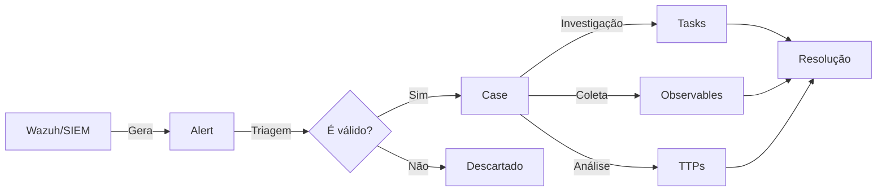

- **Alert (Alerta)**: Evento bruto gerado por ferramentas de monitoramento
- **Case (Caso)**: Incidente confirmado que requer investigação formal
- **Task (Tarefa)**: Ações específicas a serem realizadas durante a investigação
- **Observable (Observável)**: Indicadores de comprometimento (IPs, hashes, domínios, etc)
- **TTP**: Táticas, Técnicas e Procedimentos do atacante (framework MITRE ATT&CK)

!!! tip "Analogia com Sistema de Tickets"
    Se você conhece Jira/ServiceNow:
    - **Alert** = Notificação automática não validada
    - **Case** = Issue/Incident ticket formal
    - **Task** = Subtarefa com checklist
    - **Observable** = Anexo estruturado com metadados
    - **TTP** = Tags/Labels especializadas de MITRE ATT&CK

## História e Evolução da Ferramenta

### Linha do Tempo

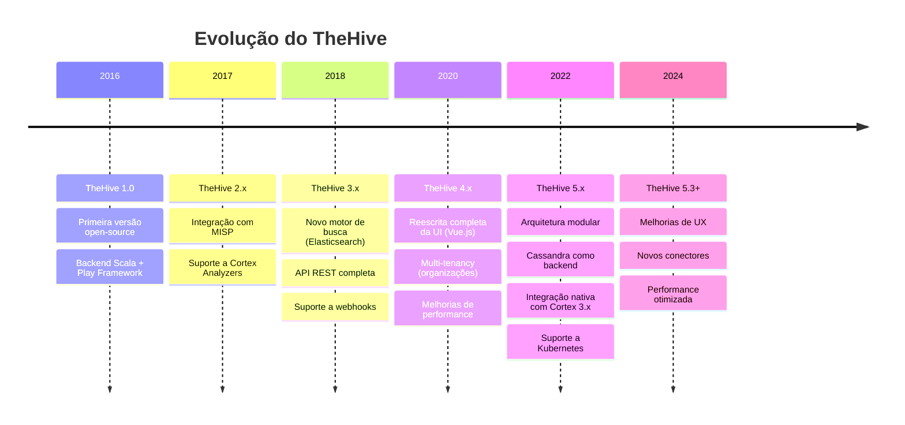

### Criadores e Comunidade

- **Empresa**: StrangeBee (anteriormente TheHive Project)
- **Fundadores**: CERT-ANSSI (Agência Nacional de Segurança Francesa)
- **Linguagem**: Scala (backend) + Vue.js (frontend)
- **Licença**: AGPL v3 (Community Edition)
- **Comunidade**: Mais de 10.000 usuários ativos, centenas de contribuidores

### Marcos Importantes

| Ano | Evento |
|-----|--------|
| 2016 | Lançamento do projeto open-source |
| 2017 | Primeira integração com MISP (Malware Information Sharing Platform) |
| 2018 | Adoção por grandes CERTs e SOCs ao redor do mundo |
| 2019 | Parceria com ANSSI e CERT-EU |
| 2020 | Lançamento do TheHive 4 com nova arquitetura |
| 2021 | Criação da StrangeBee para suporte comercial |
| 2022 | TheHive 5 com suporte a multi-tenancy empresarial |
| 2023 | Integração nativa com MITRE ATT&CK Navigator |

## Arquitetura do TheHive 5.x

### Visão Geral da Arquitetura

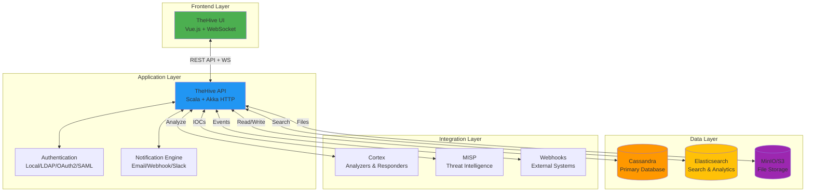

### Componentes Principais

#### 1. Frontend (Interface Web)

- **Framework**: Vue.js 3.x
- **Comunicação**: REST API + WebSockets para atualizações em tempo real
- **Recursos**:
  - Dashboard com métricas em tempo real
  - Editor de casos com markdown
  - Visualização de timeline de eventos
  - Gestão de observáveis com enrichment
  - Integração com Cortex para análises

#### 2. Backend (TheHive API)

- **Framework**: Scala + Akka HTTP
- **Recursos**:
  - API REST completa e documentada
  - Sistema de autenticação plugável
  - Engine de notificações
  - Sistema de templates
  - Webhooks para integrações

#### 3. Camada de Dados

##### Cassandra (Database Principal)

- **Função**: Armazenamento de todos os dados estruturados
- **Conteúdo**: Cases, alerts, tasks, observables, users, organizations
- **Vantagens**:
  - Alta disponibilidade
  - Escalabilidade horizontal
  - Tolerância a falhas
  - Performance em escritas massivas

##### Elasticsearch (Motor de Busca)

- **Função**: Indexação e busca full-text
- **Conteúdo**: Índices de todos os objetos para busca rápida
- **Vantagens**:
  - Busca full-text em milissegundos
  - Agregações para dashboards
  - Autocomplete e sugestões
  - Análise de tendências

##### MinIO/S3 (Armazenamento de Arquivos)

- **Função**: Armazenamento de arquivos e anexos
- **Conteúdo**: Malware samples, screenshots, logs, relatórios
- **Vantagens**:
  - Armazenamento distribuído
  - Compatível com S3
  - Versionamento de arquivos
  - Backup simplificado

#### 4. Integrações Nativas

##### Cortex (Motor de Análise)

- **Função**: Análise automatizada de observáveis
- **Exemplos**: VirusTotal, Abuse.ch, PassiveTotal, MISP, DomainTools
- **Responders**: Ações automatizadas (bloquear IP, deletar email, etc)

##### MISP (Threat Intelligence)

- **Função**: Compartilhamento de IOCs
- **Recursos**:
  - Importação automática de eventos MISP
  - Exportação de observáveis para MISP
  - Sincronização bidirecional

##### Webhooks

- **Função**: Notificações em tempo real para sistemas externos
- **Eventos**: Criação de casos, atualização de status, novos observáveis
- **Alvos**: Shuffle, n8n, Slack, Microsoft Teams, sistemas customizados

## Componentes Principais do TheHive

### 1. Cases (Casos)

**Cases** são o núcleo do TheHive - representam incidentes de segurança que requerem investigação formal.

#### Anatomia de um Caso

```yaml
Case:
  title: "Ransomware Conti Detection on Finance Server"
  description: "EDR detected suspicious file encryption on finance-srv-01"
  severity: 3 (High)
  tlp: AMBER
  pap: AMBER
  status: Open
  owner: analyst@company.com
  assignee: senior-analyst@company.com
  startDate: 2024-01-15T08:30:00Z
  endDate: null
  tags:
    - ransomware
    - conti
    - finance-department
  customFields:
    affected-systems: "finance-srv-01, finance-srv-02"
    estimated-impact: "Critical"
    containment-status: "Isolated"
```

#### Severidade dos Casos

| Nível | Descrição | Exemplos |
|-------|-----------|----------|
| **1 - Low** | Impacto mínimo, sem urgência | Scan de porta isolado, falha de login única |
| **2 - Medium** | Requer atenção, impacto moderado | Malware contido, tentativa de phishing reportada |
| **3 - High** | Impacto significativo, ação urgente | Ransomware ativo, data breach confirmado |
| **4 - Critical** | Crise organizacional, resposta imediata | APT ativo, comprometimento total de sistemas críticos |

#### Traffic Light Protocol (TLP)

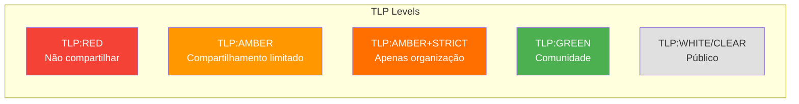

!!! warning "TLP na Prática"
    - **RED**: Informações confidenciais (senhas, chaves privadas)
    - **AMBER**: Informações sensíveis (IPs internos, detalhes de vulnerabilidades)
    - **GREEN**: Informações úteis para a comunidade (IOCs genéricos)
    - **WHITE/CLEAR**: Informações públicas (advisories públicos)

### 2. Tasks (Tarefas)

**Tasks** são checklist de ações a serem executadas durante a investigação.

#### Exemplo de Tasks para Incidente de Ransomware

```yaml
Tasks:
  - task: "Initial Triage"
    status: Completed
    owner: analyst-l1@company.com
    description: |
      - [x] Identificar sistemas afetados
      - [x] Isolar sistemas da rede
      - [x] Coletar evidências iniciais

  - task: "Forensic Analysis"
    status: InProgress
    owner: forensics@company.com
    description: |
      - [x] Capturar imagem de memória
      - [x] Capturar imagem de disco
      - [ ] Analisar artefatos do ransomware
      - [ ] Identificar vetor de entrada

  - task: "Containment"
    status: Waiting
    owner: incident-commander@company.com
    description: |
      - [ ] Bloquear IOCs no firewall
      - [ ] Resetar credenciais comprometidas
      - [ ] Aplicar patches de segurança

  - task: "Recovery"
    status: Waiting
    owner: sysadmin@company.com
    description: |
      - [ ] Restaurar dados de backup
      - [ ] Validar integridade dos dados
      - [ ] Retornar sistemas à produção

  - task: "Post-Incident"
    status: Waiting
    owner: ciso@company.com
    description: |
      - [ ] Documentar lições aprendidas
      - [ ] Atualizar runbooks
      - [ ] Reportar para stakeholders
```

#### Status de Tasks

- **Waiting**: Aguardando início
- **InProgress**: Em execução
- **Completed**: Finalizada
- **Cancel**: Cancelada (não aplicável)

### 3. Observables (Observáveis / IOCs)

**Observables** são indicadores de comprometimento coletados durante a investigação.

#### Tipos de Observables

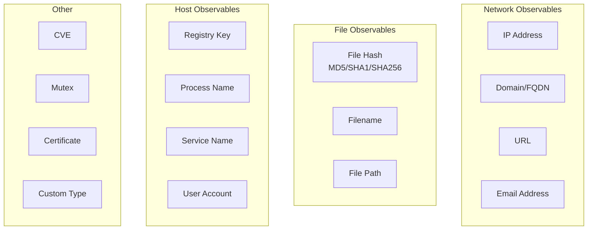

#### Exemplo de Observables

```yaml
Observables:
  - type: ip
    value: "192.0.2.100"
    tlp: AMBER
    ioc: true
    sighted: true
    tags:
      - c2-server
      - conti-ransomware
    reports:
      VirusTotal: "Malicious (15/50 engines)"
      AbuseIPDB: "Reported 45 times in 30 days"

  - type: hash
    value: "d41d8cd98f00b204e9800998ecf8427e"
    dataType: md5
    tlp: AMBER
    ioc: true
    tags:
      - ransomware-payload
    reports:
      VirusTotal: "Detected as Conti v3"

  - type: domain
    value: "malicious-c2.example.com"
    tlp: AMBER
    ioc: true
    sighted: true
    tags:
      - command-and-control
    reports:
      PassiveDNS: "Recent resolves to 192.0.2.100"

  - type: filename
    value: "invoice_payment_urgent.pdf.exe"
    tlp: AMBER
    ioc: true
    tags:
      - initial-access
      - phishing
```

#### Dados Enriquecidos (Enrichment)

TheHive permite análise automática de observáveis via **Cortex Analyzers**:

| Analyzer | Observable Type | Informação Retornada |
|----------|----------------|----------------------|
| **VirusTotal** | hash, ip, domain, url | Reputação, detecções de AV, WHOIS |
| **AbuseIPDB** | ip | Score de abuso, relatórios históricos |
| **MaxMind** | ip | Geolocalização, ASN, provedor |
| **MISP** | all | Eventos relacionados, atributos, galaxies |
| **PassiveTotal** | domain, ip | DNS histórico, WHOIS, SSL certificates |
| **Shodan** | ip | Portas abertas, serviços expostos, CVEs |
| **Hybrid Analysis** | hash, file | Análise de malware em sandbox |

### 4. TTPs (Tactics, Techniques, and Procedures)

**TTPs** mapeiam o comportamento do atacante usando o framework **MITRE ATT&CK**.

#### Framework MITRE ATT&CK

```mermaid
graph LR
    A[Initial Access<br/>T1566 Phishing] --> B[Execution<br/>T1059 Command Line]
    B --> C[Persistence<br/>T1547 Registry Run Key]
    C --> D[Privilege Escalation<br/>T1068 Exploit Vuln]
    D --> E[Defense Evasion<br/>T1562 Disable Security]
    E --> F[Credential Access<br/>T1003 Credential Dumping]
    F --> G[Discovery<br/>T1082 System Info]
    G --> H[Lateral Movement<br/>T1021 RDP/SMB]
    H --> I[Collection<br/>T1005 Data from System]
    I --> J[Exfiltration<br/>T1041 C2 Channel]
    J --> K[Impact<br/>T1486 Data Encryption]
```

#### Exemplo de TTPs em um Caso

```yaml
TTPs:
  - tactic: "Initial Access"
    technique: "T1566.001 - Phishing: Spearphishing Attachment"
    description: "Email with malicious PDF attachment"

  - tactic: "Execution"
    technique: "T1204.002 - User Execution: Malicious File"
    description: "User opened PDF.exe file"

  - tactic: "Defense Evasion"
    technique: "T1562.001 - Impair Defenses: Disable AV"
    description: "Disabled Windows Defender via registry"

  - tactic: "Impact"
    technique: "T1486 - Data Encrypted for Impact"
    description: "Conti ransomware encrypted files with .conti extension"
```

!!! tip "Integração com ATT&CK Navigator"
    TheHive 5.x permite exportar TTPs diretamente para o MITRE ATT&CK Navigator para visualização em heat map das técnicas utilizadas pelo atacante.

## Por que usar TheHive na Stack NEO_NETBOX_ODOO

### Posicionamento na Stack

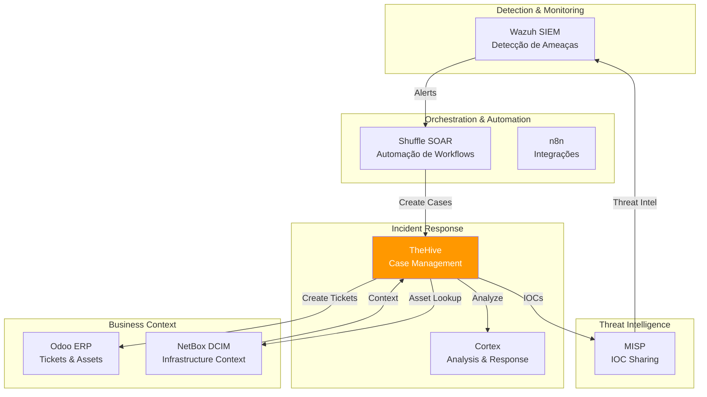

### Benefícios na Integração

#### 1. Wazuh → TheHive

**Problema sem TheHive**: Centenas de alertas do Wazuh ficam no Kibana sem contexto estruturado.

**Solução com TheHive**:
- Alertas do Wazuh são automaticamente criados no TheHive
- Triagem de alertas para promover a casos reais
- Correlação de múltiplos alertas em um único caso
- Timeline completa da investigação

#### 2. TheHive → Cortex

**Problema**: Enriquecimento manual de IOCs é lento e repetitivo.

**Solução**:
- Análise automática de IPs, hashes, domínios
- 100+ analyzers disponíveis (VirusTotal, AbuseIPDB, Shodan, etc)
- Responders para ações automatizadas (bloquear IP, deletar email)

#### 3. TheHive → MISP

**Problema**: IOCs descobertos não são compartilhados entre equipes/organizações.

**Solução**:
- Exportação automática de IOCs para MISP
- Enriquecimento de casos com threat intelligence
- Compartilhamento controlado com TLP

#### 4. TheHive → Odoo

**Problema**: Desconexão entre incidentes de segurança e tickets de TI.

**Solução**:
- Criação automática de tickets no Odoo Helpdesk
- Sincronização de status entre sistemas
- Métricas unificadas de SLA

#### 5. TheHive → NetBox

**Problema**: Analistas não têm contexto sobre ativos afetados.

**Solução**:
- Lookup automático de IPs no NetBox
- Contexto de localização, VLAN, proprietário
- Identificação rápida de sistemas críticos

### Casos de Uso na Stack

#### Fluxo Completo: Brute Force Attack

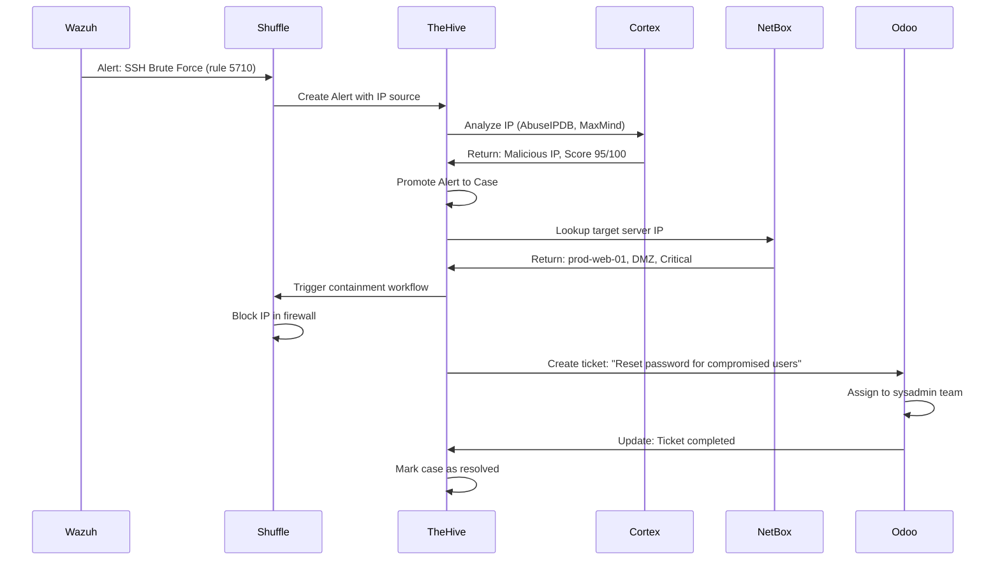

### ROI (Return on Investment)

| Métrica | Sem TheHive | Com TheHive | Ganho |
|---------|-------------|-------------|-------|
| **Tempo de triagem de alertas** | 30 min/alerta | 5 min/alerta | -83% |
| **Tempo de investigação** | 4 horas | 1.5 horas | -62% |
| **Alertas falso-positivos** | 70% | 30% | -57% |
| **Documentação de casos** | 40% | 95% | +137% |
| **Compartilhamento de IOCs** | Manual | Automático | N/A |
| **Conformidade (auditoria)** | Difícil | Fácil | N/A |

!!! success "Benefícios Mensuráveis"
    - **Redução de 60% no tempo de resposta** a incidentes
    - **Aumento de 3x na documentação** de casos
    - **Eliminação de 80% das tarefas manuais** repetitivas
    - **Melhoria de 50% no MTTD** (Mean Time to Detect)
    - **Melhoria de 70% no MTTR** (Mean Time to Respond)

## Comparação com Outras Ferramentas de IR

### TheHive vs Alternativas

| Recurso | TheHive | IBM Resilient | Splunk SOAR | ServiceNow SecOps | Cortex XSOAR |
|---------|---------|---------------|-------------|-------------------|--------------|
| **Licença** | AGPL (Open Source) | Proprietário | Proprietário | Proprietário | Proprietário |
| **Preço (50 analistas)** | Free / ~$50k | ~$250k/ano | ~$300k/ano | ~$200k/ano | ~$400k/ano |
| **Curva de aprendizado** | Média | Alta | Alta | Alta | Alta |
| **Integrações nativas** | 100+ | 300+ | 400+ | 500+ | 600+ |
| **Customização** | Alta (código aberto) | Média | Média | Baixa | Alta |
| **Self-hosted** | Sim | Não | Opcional | Não | Opcional |
| **API REST** | Completa | Completa | Completa | Completa | Completa |
| **MITRE ATT&CK** | Nativo | Plugin | Plugin | Plugin | Nativo |
| **MISP Integration** | Nativo | Plugin | Plugin | Não | Plugin |
| **Community Support** | Excelente | Limitado | Limitado | Limitado | Bom |

### Quando escolher TheHive

✅ **TheHive é ideal quando**:
- Você precisa de uma solução **open-source** e customizável
- Seu orçamento é **limitado** (OpEx vs CapEx)
- Você quer **controle total** sobre os dados (self-hosted)
- Sua equipe tem **skills técnicos** para manutenção
- Você precisa de **integração com MISP** e Cortex
- Você valoriza **transparência** (código aberto)

❌ **TheHive pode não ser ideal quando**:
- Você precisa de **suporte 24/7 enterprise** com SLA garantido
- Sua organização exige **certificações** específicas (FedRAMP, etc)
- Você precisa de **400+ integrações** prontas out-of-the-box
- Sua equipe **não tem skills** para gerenciar infraestrutura
- Você precisa de **automações avançadas** tipo RPA

### TheHive vs SOAR Tradicionais

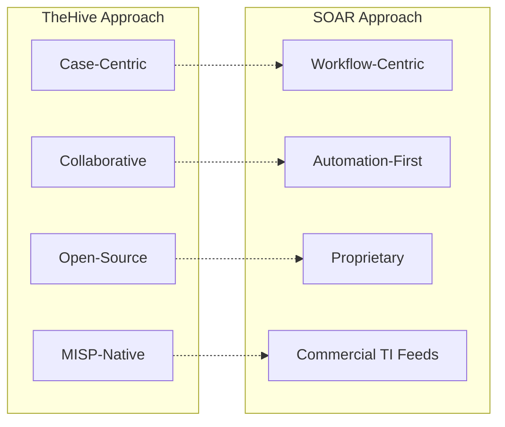

**Diferenças Filosóficas**:

- **TheHive**: Foco em **gestão de casos** e colaboração humana, com automação complementar
- **SOAR**: Foco em **automação de workflows** e orquestração, com cases como subproduto

**Na Stack NEO_NETBOX_ODOO**: Usamos **TheHive + Shuffle** para obter o melhor dos dois mundos:
- **TheHive**: Case management robusto e colaboração
- **Shuffle**: Automação de workflows e orquestração

## Licenciamento: Community vs Enterprise

### Community Edition (AGPL)

```yaml
TheHive Community Edition:
  license: AGPL v3
  cost: Free (open-source)
  features:
    - Unlimited users
    - Unlimited cases
    - Unlimited observables
    - API REST completa
    - Integrações com Cortex e MISP
    - Webhooks
    - Custom fields
    - Templates
  limitations:
    - Suporte apenas via comunidade (Discord, GitHub)
    - Sem multi-tenancy avançado
    - Sem SSO empresarial (SAML)
    - Sem auditoria avançada
```

### Enterprise Edition

```yaml
TheHive Enterprise:
  license: Proprietária (StrangeBee)
  cost: ~$50k - $200k/ano (dependendo de usuários e suporte)
  features_adicionais:
    - Multi-tenancy avançado (isolamento completo)
    - SSO empresarial (SAML, OAuth2)
    - Auditoria avançada e compliance
    - Dashboards customizados
    - Suporte 24/7 com SLA
    - Professional services (treinamento, consultoria)
    - Updates prioritários
    - Integrações empresariais (ServiceNow, Splunk)
  ideal_para:
    - Grandes empresas (500+ funcionários)
    - SOCs com múltiplos clientes (MSSPs)
    - Ambientes regulados (financeiro, saúde)
```

### Matriz de Decisão

| Critério | Community | Enterprise |
|----------|-----------|------------|
| **Tamanho da equipe** | < 20 analistas | 20+ analistas |
| **Orçamento anual** | < $50k | $50k+ |
| **Multi-tenancy** | Básico | Avançado |
| **Suporte SLA** | Comunidade | 24/7 com SLA |
| **Compliance** | Básico | Avançado (SOC2, ISO27001) |
| **SSO empresarial** | Não | Sim (SAML, OAuth2) |
| **Customização** | Código aberto | + Professional Services |

!!! info "Recomendação para Stack NEO"
    Para a maioria dos casos de uso, a **Community Edition** é suficiente. Considere Enterprise apenas se você tiver requisitos específicos de compliance ou precisar de suporte SLA garantido.

## Requisitos de Sistema

### Requisitos Mínimos (Ambiente de Teste)

```yaml
Hardware:
  CPU: 4 cores
  RAM: 16 GB
  Storage: 50 GB SSD

Software:
  OS: Ubuntu 22.04 LTS / Rocky Linux 9
  Docker: 24.0+
  Docker Compose: 2.20+

Componentes:
  TheHive: 2 GB RAM
  Cassandra: 4 GB RAM
  Elasticsearch: 4 GB RAM
  MinIO: 1 GB RAM
  Cortex (opcional): 2 GB RAM
```

### Requisitos Recomendados (Produção - até 50 analistas)

```yaml
Hardware:
  CPU: 16 cores
  RAM: 64 GB
  Storage: 500 GB SSD (NVMe preferencial)
  Network: 1 Gbps

Software:
  OS: Ubuntu 22.04 LTS / Rocky Linux 9
  Docker: 24.0+
  Docker Compose: 2.20+

Componentes:
  TheHive: 8 GB RAM
  Cassandra: 16 GB RAM (cluster 3 nodes recomendado)
  Elasticsearch: 16 GB RAM (cluster 3 nodes recomendado)
  MinIO: 4 GB RAM
  Cortex: 8 GB RAM
```

### Requisitos Enterprise (100+ analistas)

```yaml
Arquitetura:
  Type: Cluster multi-node
  LoadBalancer: HAProxy / Nginx
  HA: Multi-master (Cassandra + ES clusters)

TheHive Nodes:
  Quantity: 3+ nodes
  CPU: 16 cores por node
  RAM: 32 GB por node
  Storage: 200 GB SSD por node

Cassandra Cluster:
  Quantity: 5+ nodes (replication factor 3)
  CPU: 16 cores por node
  RAM: 64 GB por node
  Storage: 1 TB SSD por node

Elasticsearch Cluster:
  Quantity: 3+ nodes (1 master + 2 data)
  CPU: 16 cores por node
  RAM: 64 GB por node
  Storage: 1 TB SSD por node

MinIO Cluster:
  Quantity: 4+ nodes (distributed mode)
  Storage: 2 TB+ por node
```

### Requisitos de Rede

```yaml
Portas:
  TheHive UI/API: 9000/tcp
  Cassandra: 9042/tcp, 7000/tcp, 7001/tcp
  Elasticsearch: 9200/tcp, 9300/tcp
  MinIO: 9000/tcp, 9001/tcp
  Cortex API: 9001/tcp

Conectividade Externa:
  - Acesso a repositórios Docker (docker.io, ghcr.io)
  - Acesso a analyzers externos (VirusTotal, AbuseIPDB, etc)
  - Acesso a MISP instance (se aplicável)
  - Acesso a SMTP server (para notificações)

Firewalls:
  - Liberar comunicação entre nós do cluster
  - Restringir acesso externo apenas aos load balancers
```

### Estimativa de Storage

```yaml
Cases:
  Average size: 1 MB por caso (com observables e tasks)
  10,000 cases/year: ~10 GB/ano

Observables:
  Average size: 10 KB por observable
  100,000 observables/year: ~1 GB/ano

Attachments:
  Average size: 5 MB por anexo
  1,000 attachments/year: ~5 GB/ano

Logs & Audit:
  Average size: 100 MB/dia
  Retention 1 year: ~36 GB/ano

Total Estimated (1 year):
  Data: ~50 GB
  Overhead (replication, indexing): ~150 GB
  Total: ~200 GB/ano
```

!!! warning "Planejamento de Capacidade"
    - **Cassandra**: Planejar 3x o espaço de dados brutos (replication factor 3)
    - **Elasticsearch**: Planejar 2x o espaço de dados brutos (índices + réplicas)
    - **MinIO**: Planejar 1.5x o espaço de anexos (versionamento)
    - **Backups**: Adicionar 100% do storage total para backups

## Diagrama de Arquitetura Completo

### Arquitetura de Referência para Stack NEO

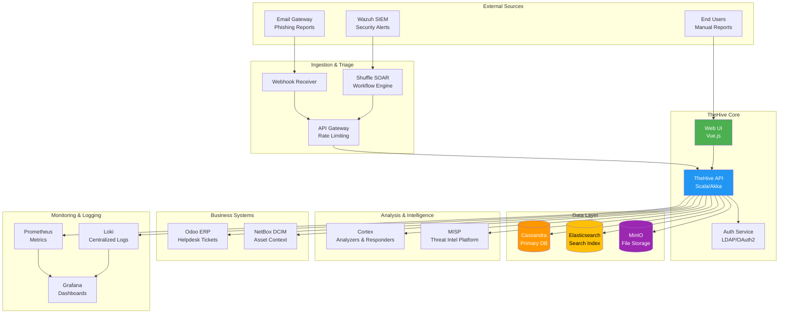

### Fluxo de Dados: Alerta até Resolução

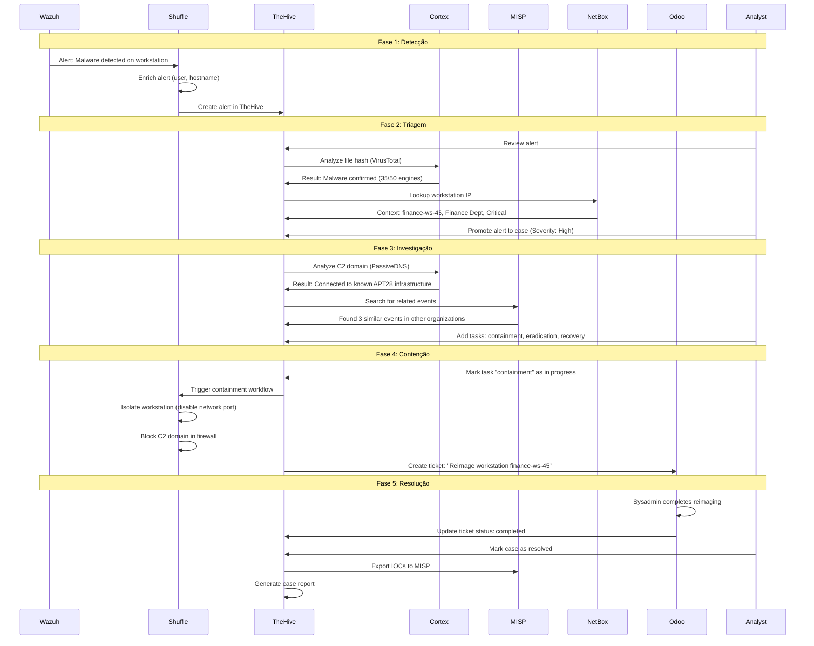

## Próximos Passos

Agora que você entende o que é TheHive e como ele se encaixa na stack NEO_NETBOX_ODOO, siga para:

1. **[Setup](setup.md)**: Instalação e configuração completa do TheHive
2. **[Cases Management](cases-management.md)**: Aprenda a gerenciar casos e investigações
3. **[Integration with Shuffle](integration-shuffle.md)**: Automatize workflows Wazuh → TheHive
4. **[Stack Integration](integration-stack.md)**: Integre com Odoo, NetBox, MISP

## Recursos Adicionais

### Documentação Oficial

- [TheHive Official Documentation](https://docs.strangebee.com/)
- [TheHive GitHub Repository](https://github.com/TheHive-Project/TheHive)
- [Cortex Documentation](https://docs.strangebee.com/cortex/)
- [MISP Documentation](https://www.misp-project.org/documentation/)

### Comunidade

- [TheHive Discord](https://discord.gg/thehive-project)
- [GitHub Discussions](https://github.com/TheHive-Project/TheHive/discussions)
- [Training & Certifications](https://www.strangebee.com/training/)

### Vídeos e Tutoriais

- [TheHive 5 - Getting Started (YouTube)](https://www.youtube.com/watch?v=example)
- [Incident Response with TheHive (Sans.org)](https://www.sans.org/webcasts/)
- [TheHive + MISP Integration (StrangeBee Blog)](https://blog.strangebee.com/)

!!! tip "AI Context: TheHive Overview Summary"
    **TheHive** é uma plataforma open-source de Security Incident Response (SIRP) que centraliza gestão de casos de segurança, correlação de alertas, análise de IOCs e colaboração entre analistas. Na stack NEO_NETBOX_ODOO, atua como hub central de incident response, integrando-se com Wazuh (detecção), Shuffle (automação), Cortex (análise), MISP (threat intel), Odoo (tickets) e NetBox (contexto de ativos). É ideal para SOCs que precisam de uma solução customizável, self-hosted e com controle total sobre dados de investigações.
