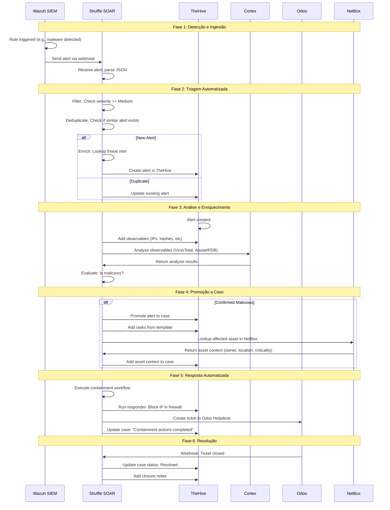
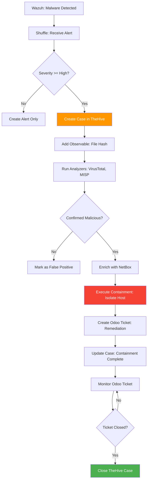

# Integração TheHive com Shuffle SOAR

## Visão Geral

!!! info "AI Context: TheHive-Shuffle Integration"
    A integração Wazuh → Shuffle → TheHive permite automação completa do fluxo de incident response: alertas do Wazuh são recebidos via webhook no Shuffle, passam por triagem e enrichment automatizados, e casos são criados automaticamente no TheHive com todos os observables, tasks e contexto necessário. Shuffle também pode executar responders (bloquear IPs, isolar hosts, criar tickets no Odoo) e fechar casos automaticamente quando resolvidos.

Este guia completo mostra como integrar TheHive com Shuffle SOAR para criar **workflows automatizados** de resposta a incidentes, desde a detecção de alertas no Wazuh até a resolução de casos no TheHive.

## Arquitetura da Integração

### Fluxo Completo



### Componentes da Integração

| Componente | Função | Responsabilidade |
|------------|--------|------------------|
| **Wazuh** | Detecção | Gera alertas de segurança |
| **Shuffle** | Orquestração | Triagem, enrichment, automação de workflows |
| **TheHive** | Case Management | Gerencia investigações e documentação |
| **Cortex** | Análise | Enriquece observables (VirusTotal, etc) |
| **NetBox** | Contexto de Ativos | Fornece informações sobre sistemas afetados |
| **Odoo** | Ticketing | Cria tickets de remediação |

## Configuração de API Keys

### 1. Criar API Key no TheHive

```bash
# Via UI:
# Settings > Users > [seu usuário] > Create API Key

# Ou via API (como admin):
curl -X POST http://thehive.company.local:9000/api/v1/user \
  -H "Authorization: Bearer ADMIN_API_KEY" \
  -H "Content-Type: application/json" \
  -d '{
    "login": "shuffle-automation",
    "name": "Shuffle Automation User",
    "profile": "analyst",
    "apikey": "GENERATE_RANDOM_KEY_HERE"
  }'
```

**Salvar API Key:**

```bash
THEHIVE_API_KEY="YOUR_GENERATED_API_KEY"
```

!!! warning "Segurança da API Key"
    - Nunca commitar API keys em git
    - Usar secrets manager do Shuffle para armazenar
    - Rotacionar keys periodicamente (90 dias recomendado)
    - Criar usuário dedicado com permissões mínimas

### 2. Configurar TheHive App no Shuffle

```
Shuffle UI > Apps > Search "TheHive" > Install
```

**Configure TheHive App:**

```yaml
App: TheHive
Version: 1.0.0 (ou mais recente)

Configuration:
  url: "http://thehive.company.local:9000"
  api_key: "${THEHIVE_API_KEY}"  # Usar secrets do Shuffle
  verify_ssl: false  # Mudar para true em produção com certificado válido
```

**Testar Conexão:**

```
TheHive App > Actions > Get Status
```

Se retornar `{"versions":{"TheHive":"5.3.x"}}`, a conexão está OK!

### 3. Criar Webhook no Wazuh

**Configurar Wazuh Manager (`/var/ossec/etc/ossec.conf`):**

```xml
<ossec_config>
  <integration>
    <name>shuffle</name>
    <hook_url>https://shuffle.company.local/api/v1/hooks/webhook_wazuh</hook_url>
    <level>7</level>
    <alert_format>json</alert_format>
    <options>
      {"shuffle_workflow_id": "WORKFLOW_ID_AQUI"}
    </options>
  </integration>
</ossec_config>
```

```bash
# Reiniciar Wazuh Manager
systemctl restart wazuh-manager

# Verificar logs
tail -f /var/ossec/logs/integrations.log
```

## Criação Automática de Casos via Shuffle

### Workflow 1: Malware Detection → TheHive Case

#### Trigger: Webhook Wazuh

```yaml
Trigger:
  Type: Webhook
  Method: POST
  Path: /webhook_wazuh
  Authentication: API Key
```

**Payload Esperado (Wazuh):**

```json
{
  "timestamp": "2024-01-15T14:23:00.000Z",
  "rule": {
    "level": 12,
    "description": "Malware detected",
    "id": "550",
    "groups": ["malware", "virustotal"]
  },
  "agent": {
    "id": "001",
    "name": "finance-ws-045",
    "ip": "10.0.10.45"
  },
  "data": {
    "virustotal": {
      "malicious": "35",
      "total": "50",
      "sha256": "d41d8cd98f00b204e9800998ecf8427e"
    }
  },
  "location": "/var/log/syslog"
}
```

#### Step 1: Parse Wazuh Alert

```yaml
Action: Parse JSON
Input: $exec.text.body
Output: $wazuh_alert
```

#### Step 2: Filter by Severity

```yaml
Action: Condition
Condition: $wazuh_alert.rule.level >= 10
If True: Continue to Step 3
If False: Stop workflow
```

#### Step 3: Check for Duplicates

```yaml
Action: TheHive - Search Alerts
Parameters:
  query: |
    {
      "_and": [
        {"status": "New"},
        {"customFields.wazuh_rule_id": "$wazuh_alert.rule.id"},
        {"customFields.agent_id": "$wazuh_alert.agent.id"}
      ]
    }
  range: "0-10"

Output: $existing_alerts
```

```yaml
Action: Condition
Condition: len($existing_alerts) > 0
If True: Update existing alert (Step 3a)
If False: Create new alert (Step 4)
```

#### Step 4: Create Alert in TheHive

```yaml
Action: TheHive - Create Alert
Parameters:
  type: "wazuh-alert"
  source: "Wazuh SIEM"
  sourceRef: "$wazuh_alert.rule.id"
  title: "Wazuh Alert $wazuh_alert.rule.id: $wazuh_alert.rule.description"
  description: |
    ## Alert Details

    **Rule ID**: $wazuh_alert.rule.id
    **Description**: $wazuh_alert.rule.description
    **Level**: $wazuh_alert.rule.level
    **Groups**: $wazuh_alert.rule.groups

    ## Agent Information

    **Agent ID**: $wazuh_alert.agent.id
    **Hostname**: $wazuh_alert.agent.name
    **IP Address**: $wazuh_alert.agent.ip

    ## Timestamp

    $wazuh_alert.timestamp

    ## Raw Data

    ```json
    $wazuh_alert.data
    ```

  severity: 2  # Medium
  tlp: 2       # AMBER
  pap: 2
  tags:
    - "wazuh"
    - "automated"
    - "$wazuh_alert.rule.groups"

  customFields:
    wazuh_rule_id:
      string: "$wazuh_alert.rule.id"
    wazuh_rule_level:
      integer: $wazuh_alert.rule.level
    agent_id:
      string: "$wazuh_alert.agent.id"
    agent_name:
      string: "$wazuh_alert.agent.name"
    agent_ip:
      string: "$wazuh_alert.agent.ip"

Output: $thehive_alert
```

#### Step 5: Add Observables

```yaml
Action: TheHive - Create Observable
Parameters:
  alert_id: "$thehive_alert._id"
  dataType: "ip"
  data: "$wazuh_alert.agent.ip"
  tlp: 2
  ioc: false
  tags: ["agent-ip"]
  message: "Agent IP address"
```

```yaml
Action: TheHive - Create Observable
Parameters:
  alert_id: "$thehive_alert._id"
  dataType: "hash"
  data: "$wazuh_alert.data.virustotal.sha256"
  tlp: 2
  ioc: true
  sighted: true
  tags: ["malware", "virustotal"]
  message: "Malicious file hash (VT: $wazuh_alert.data.virustotal.malicious/$wazuh_alert.data.virustotal.total)"
```

#### Step 6: Analyze Observables via Cortex

```yaml
Action: TheHive - Run Analyzers
Parameters:
  observable_id: "$observable_hash._id"
  analyzers:
    - "VirusTotal_GetReport_3_0"
    - "MISP_2_1"
    - "OTX_Query_2_0"

Output: $analyzer_results
```

#### Step 7: Evaluate Results and Promote to Case

```yaml
Action: Condition
Condition: |
  $analyzer_results.VirusTotal.summary.taxonomies[0].level == "malicious"
If True: Promote to Case (Step 8)
If False: Mark as False Positive (Step 7a)
```

#### Step 8: Promote Alert to Case

```yaml
Action: TheHive - Promote Alert to Case
Parameters:
  alert_id: "$thehive_alert._id"
  case_template: "Malware Incident Response"  # Usar template pré-configurado
  title: "Malware Detection - $wazuh_alert.agent.name"
  severity: 3  # High
  tlp: 2       # AMBER
  pap: 2

Output: $thehive_case
```

#### Step 9: Enrich Case with NetBox Context

```yaml
Action: NetBox - Get IP Address
Parameters:
  ip: "$wazuh_alert.agent.ip"

Output: $netbox_asset
```

```yaml
Action: TheHive - Update Case
Parameters:
  case_id: "$thehive_case._id"
  customFields:
    asset_owner:
      string: "$netbox_asset.tenant.name"
    asset_location:
      string: "$netbox_asset.site.name"
    asset_criticality:
      string: "$netbox_asset.custom_fields.criticality"
```

#### Step 10: Execute Containment Actions

```yaml
Action: TheHive - Run Responder
Parameters:
  observable_id: "$observable_ip._id"
  responder: "Firewall_Block_IP_1_0"

Output: $firewall_result
```

```yaml
Action: TheHive - Create Task Log
Parameters:
  task_id: "$containment_task._id"
  message: |
    ✅ IP $wazuh_alert.agent.ip blocked in firewall

    Result:
    ```
    $firewall_result
    ```
```

#### Step 11: Create Ticket in Odoo

```yaml
Action: Odoo - Create Helpdesk Ticket
Parameters:
  name: "Malware Remediation - $wazuh_alert.agent.name"
  description: |
    A malware infection was detected on $wazuh_alert.agent.name.

    TheHive Case: $thehive_case.caseId (#$thehive_case.number)

    Required Actions:
    - Isolate workstation from network
    - Run full antivirus scan
    - Reimage if necessary
    - Validate no lateral movement

  team_id: 3  # IT Security Team
  priority: "2"  # High
  tag_ids: ["malware", "incident-response"]

Output: $odoo_ticket
```

```yaml
Action: TheHive - Update Case
Parameters:
  case_id: "$thehive_case._id"
  customFields:
    odoo_ticket_id:
      integer: $odoo_ticket.id
    odoo_ticket_url:
      string: "https://odoo.company.local/web#id=$odoo_ticket.id&model=helpdesk.ticket"
```

### Workflow 2: Brute Force Detection → Auto-Block

#### Trigger: Webhook Wazuh (Rule 5710 - SSH Brute Force)

```json
{
  "rule": {
    "level": 10,
    "description": "sshd: brute force trying to get access to the system",
    "id": "5710"
  },
  "data": {
    "srcip": "203.0.113.50",
    "srcuser": "root"
  }
}
```

#### Steps:

1. **Parse Alert**
2. **Check AbuseIPDB**: Score > 80?
3. **If Malicious**:
   - Create case in TheHive
   - Block IP in firewall (via responder)
   - Add to blacklist
   - Create task: "Monitor for additional attempts"
4. **If Unknown**:
   - Create alert (not case)
   - Queue for manual review

**Shuffle Workflow (YAML sintético):**

```yaml
workflow:
  - name: "Parse Wazuh Alert"
    app: "shuffle-tools"
    action: "parse_json"

  - name: "Check AbuseIPDB"
    app: "abuseipdb"
    action: "check_ip"
    input: "$wazuh.data.srcip"

  - name: "Evaluate Threat Level"
    app: "shuffle-tools"
    action: "condition"
    condition: "$abuseipdb.abuseConfidenceScore > 80"

  - name: "Create Case (High Confidence)"
    app: "thehive"
    action: "create_case"
    if: "$evaluate.result == true"
    params:
      title: "Brute Force Attack from $wazuh.data.srcip"
      severity: 2
      template: "Brute Force Investigation"

  - name: "Block IP in Firewall"
    app: "thehive"
    action: "run_responder"
    params:
      responder: "Firewall_Block_IP"
      observable_value: "$wazuh.data.srcip"

  - name: "Create Alert (Low Confidence)"
    app: "thehive"
    action: "create_alert"
    if: "$evaluate.result == false"
```

### Workflow 3: Phishing Email → Automated Analysis

#### Trigger: Email Forward (via email integration)

```yaml
Trigger:
  Type: Email
  Address: phishing@company.local
```

#### Steps:

1. **Parse Email**:
   - Extract headers (From, Subject, Date)
   - Extract URLs
   - Extract attachments

2. **Analyze URLs** (via URLScan.io):
   - Screenshot
   - Redirects
   - Malicious content

3. **Analyze Attachments** (via VirusTotal):
   - File hash
   - Detections

4. **Create Case**:
   - Add all observables (sender email, URLs, hashes)
   - Add tasks: "Identify recipients", "Delete emails", "Reset credentials"

5. **Execute Actions**:
   - Block sender domain in email gateway
   - Delete email from all mailboxes (via O365/Gmail API)

## Enriquecimento de Casos

### Enriquecer com Threat Intelligence

```yaml
Action: Threat Intel Lookup
Parallel Execution:
  - VirusTotal: Check hash reputation
  - AbuseIPDB: Check IP reputation
  - MISP: Search for related events
  - OTX AlienVault: Check pulses
  - Shodan: Get IP port scan

Aggregate Results:
  - Count "malicious" verdicts
  - Collect all tags
  - Collect all related events

Update Case:
  - Add tags from TI sources
  - Add related MISP events as observables
  - Add summary to case description
```

### Enriquecer com Contexto de Ativos (NetBox)

```yaml
Action: NetBox Enrichment
Input: $wazuh_alert.agent.ip

Steps:
  1. Get IP Address from NetBox
  2. Get associated Device
  3. Get Device Tenant (owner)
  4. Get Device Site (location)
  5. Get Device Role (server, workstation, etc)
  6. Get Custom Fields (criticality, backup status)

Update TheHive Case:
  customFields:
    asset_owner: "$netbox.tenant.name"
    asset_location: "$netbox.site.name"
    asset_role: "$netbox.device_role.name"
    asset_criticality: "$netbox.custom_fields.criticality"
    backup_enabled: "$netbox.custom_fields.backup_enabled"

Add Context to Description:
  |
  ## Asset Context (from NetBox)

  - **Owner**: $netbox.tenant.name
  - **Location**: $netbox.site.name (Rack: $netbox.rack.name)
  - **Role**: $netbox.device_role.name
  - **Criticality**: $netbox.custom_fields.criticality
  - **Backup Status**: $netbox.custom_fields.backup_enabled

  [View in NetBox](https://netbox.company.local/dcim/devices/$netbox.id/)
```

### Enriquecer com Histórico de Incidentes

```yaml
Action: Search Similar Cases
Query: |
  Find cases in last 90 days with same:
  - Source IP
  - Malware hash
  - Target agent

Results:
  - Case #35: Malware on finance-ws-043 (30 days ago)
  - Case #41: Malware on finance-ws-045 (15 days ago)

Update Case:
  Add note: |
    ⚠️ **Related Incidents Detected**

    This is the 3rd malware incident in Finance department in 30 days.
    Possible targeted attack or systemic issue.

    See related cases: #35, #41
```

## Fechamento Automático de Casos

### Workflow: Auto-Close False Positives

```yaml
Trigger:
  Type: TheHive Webhook
  Event: "AlertCreated"

Conditions:
  - Alert has been open for > 24 hours
  - No analyst interaction (no tasks started)
  - All analyzer results = "safe" or "info"

Action:
  - Update alert status: "Ignored"
  - Add comment: "Auto-closed: No malicious indicators found"
  - Archive alert
```

### Workflow: Close Case When Ticket Resolved

```yaml
Trigger:
  Type: Odoo Webhook
  Event: "TicketClosed"

Steps:
  1. Extract Odoo ticket ID from webhook
  2. Search TheHive for case with customField.odoo_ticket_id = $ticket_id
  3. If case exists and status = "InProgress":
      - Update case status: "Resolved"
      - Add closure note from Odoo ticket
      - Add resolution category: "Fixed"
      - Set endDate: now()

Notification:
  - Send email to case owner
  - Post to Slack: "Case #42 auto-closed (Odoo ticket #123 resolved)"
```

### Workflow: Escalate Stale Cases

```yaml
Trigger:
  Type: Scheduled (daily at 9:00 AM)

Query TheHive:
  - Status: "Open" or "InProgress"
  - No updates in last 3 days
  - Severity >= "High"

For each stale case:
  1. Add comment: "⚠️ Case has been stale for 3 days. Please update status."
  2. Send email to case owner and CISO
  3. Increase severity by 1 level
  4. Add tag: "stale"
```

## Dashboards e Métricas

### Shuffle Dashboard

**Criar Dashboard no Shuffle:**

```
Shuffle > Dashboards > New Dashboard
```

**Widgets Recomendados:**

```yaml
Dashboard: "TheHive Integration Metrics"

Widgets:
  - Name: "Alerts Processed (24h)"
    Type: Counter
    Source: Workflow executions (Wazuh Alert Processing)
    Filter: Last 24 hours

  - Name: "Cases Created (7 days)"
    Type: Line Chart
    Source: TheHive API (/api/v1/case)
    Filter: Last 7 days
    Group by: Day

  - Name: "Cases by Severity"
    Type: Pie Chart
    Source: TheHive API
    Group by: severity

  - Name: "Average Time to Resolution"
    Type: Metric
    Calculation: AVG(endDate - startDate)
    Filter: Resolved cases, last 30 days

  - Name: "Top Alert Sources"
    Type: Bar Chart
    Source: Wazuh alerts
    Group by: rule.id
    Limit: Top 10

  - Name: "Automation Success Rate"
    Type: Metric
    Calculation: |
      (successful_automations / total_automations) * 100
    Format: Percentage
```

### TheHive Custom Dashboards

**Via TheHive UI:**

```
Dashboard > Customize
```

**Widgets úteis:**

- Cases by Status (Donut Chart)
- Cases by Severity (Bar Chart)
- Top Observables (Table)
- Recent Activity (Timeline)
- Cases per Analyst (Bar Chart)
- Average Resolution Time (Metric)

### Grafana Integration

**Exportar métricas para Prometheus/Grafana:**

```python
# Script Python para exportar métricas do TheHive para Prometheus
from prometheus_client import start_http_server, Gauge
import requests
import time

THEHIVE_URL = "http://thehive.company.local:9000"
API_KEY = "YOUR_API_KEY"

# Definir métricas
cases_total = Gauge('thehive_cases_total', 'Total number of cases')
cases_open = Gauge('thehive_cases_open', 'Number of open cases')
cases_resolved = Gauge('thehive_cases_resolved', 'Number of resolved cases')
cases_by_severity = Gauge('thehive_cases_by_severity', 'Cases by severity', ['severity'])

def fetch_metrics():
    headers = {"Authorization": f"Bearer {API_KEY}"}

    # Total cases
    resp = requests.get(f"{THEHIVE_URL}/api/v1/case", headers=headers)
    cases_total.set(len(resp.json()))

    # Cases by status
    open_cases = requests.post(
        f"{THEHIVE_URL}/api/v1/query",
        headers=headers,
        json={"query": [{"_name": "listCase"}, {"_name": "filter", "_eq": {"_field": "status", "_value": "Open"}}]}
    )
    cases_open.set(len(open_cases.json()))

    # Cases by severity
    for sev in [1, 2, 3, 4]:
        sev_cases = requests.post(
            f"{THEHIVE_URL}/api/v1/query",
            headers=headers,
            json={"query": [{"_name": "listCase"}, {"_name": "filter", "_eq": {"_field": "severity", "_value": sev}}]}
        )
        cases_by_severity.labels(severity=sev).set(len(sev_cases.json()))

if __name__ == '__main__':
    start_http_server(8000)
    while True:
        fetch_metrics()
        time.sleep(60)  # Update every minute
```

**Grafana Dashboard:**

```json
{
  "dashboard": {
    "title": "TheHive Metrics",
    "panels": [
      {
        "title": "Total Cases",
        "type": "stat",
        "targets": [{"expr": "thehive_cases_total"}]
      },
      {
        "title": "Cases by Status",
        "type": "piechart",
        "targets": [
          {"expr": "thehive_cases_open", "legendFormat": "Open"},
          {"expr": "thehive_cases_resolved", "legendFormat": "Resolved"}
        ]
      },
      {
        "title": "Cases by Severity",
        "type": "bargauge",
        "targets": [{"expr": "thehive_cases_by_severity"}]
      }
    ]
  }
}
```

## Exemplos de Workflows Completos

### Exemplo 1: Malware Detection End-to-End



### Exemplo 2: Brute Force Auto-Response

```yaml
1. Wazuh Alert: SSH Brute Force (Rule 5710)
   └─> Source IP: 203.0.113.50
   └─> Target: prod-web-01

2. Shuffle: Check AbuseIPDB
   └─> Score: 95/100 (Malicious)

3. Shuffle: Create Case in TheHive
   └─> Title: "Brute Force Attack from 203.0.113.50"
   └─> Add Observable: IP 203.0.113.50
   └─> Add Tasks:
       - Containment: Block IP
       - Investigation: Review auth logs
       - Recovery: Reset compromised accounts

4. Shuffle: Execute Containment
   └─> TheHive Responder: Block IP in Firewall
       └─> Result: ✅ IP blocked successfully

5. Shuffle: Create Odoo Ticket
   └─> Title: "Review Authentication Logs - prod-web-01"
   └─> Assigned to: Sysadmin Team

6. TheHive: Manual Investigation
   └─> Analyst reviews auth logs
   └─> Finds 3 accounts with failed attempts
   └─> Marks task "Investigation" as Completed

7. Odoo: Ticket Closed
   └─> Sysadmin: "No accounts compromised, passwords reset as precaution"

8. Shuffle: Auto-Close Case
   └─> TheHive case status: Resolved
   └─> Add closure note from Odoo ticket
```

### Exemplo 3: Phishing Campaign Response

```yaml
1. User Reports Phishing Email
   └─> Forward to: phishing@company.local

2. Shuffle: Email Parser
   └─> Extract:
       - Sender: attacker@evil.com
       - Subject: "Urgent: Verify Your Account"
       - URLs: http://phishing-site.example.net/login
       - Attachments: invoice.pdf.exe

3. Shuffle: Analyze Observables
   ├─> URLScan.io: phishing-site.example.net
   │   └─> Result: Credential phishing page (screenshot saved)
   └─> VirusTotal: invoice.pdf.exe
       └─> Result: Trojan detected (40/50 engines)

4. Shuffle: Create Case in TheHive
   └─> Title: "Phishing Campaign - attacker@evil.com"
   └─> Add Observables:
       - Email: attacker@evil.com
       - Domain: phishing-site.example.net
       - URL: http://phishing-site.example.net/login
       - Hash: d41d8cd98f00b204e9800998ecf8427e

5. Shuffle: Execute Containment
   ├─> Block sender domain in email gateway
   ├─> Block phishing URL in proxy
   └─> Delete email from all mailboxes (O365 API)

6. Shuffle: Identify Victims
   └─> Search O365 logs: Who received/opened email?
       └─> Found: 15 recipients, 3 clicked link, 1 entered credentials

7. Shuffle: Reset Compromised Account
   └─> TheHive Responder: Disable User Account
   └─> Create Odoo Ticket: "Reset password for user.compromised@company.com"

8. Shuffle: Create Awareness Task
   └─> TheHive Task: "Send phishing awareness email to all affected users"

9. Completion
   └─> All tasks completed
   └─> Case resolved
   └─> IOCs shared to MISP
```

## Troubleshooting

### Problema: TheHive não recebe alertas do Shuffle

**Diagnóstico:**

```bash
# Verificar conectividade
curl -X GET http://thehive.company.local:9000/api/v1/status \
  -H "Authorization: Bearer YOUR_API_KEY"

# Verificar logs do Shuffle
docker logs shuffle-backend | grep -i thehive

# Verificar logs do TheHive
docker logs thehive | grep -i api
```

**Soluções:**

- Verificar API key válida
- Verificar URL correta (com porta :9000)
- Verificar firewall/network entre Shuffle e TheHive
- Verificar certificado SSL (desabilitar verify_ssl temporariamente)

### Problema: Observables não sendo analisados

**Diagnóstico:**

```bash
# Verificar Cortex configurado no TheHive
curl -X GET http://thehive.company.local:9000/api/v1/connector/cortex/status \
  -H "Authorization: Bearer YOUR_API_KEY"

# Verificar logs do Cortex
docker logs cortex | grep -i analyzer
```

**Soluções:**

- Verificar Cortex URL e API key no TheHive config
- Verificar analyzers habilitados no Cortex
- Verificar rate limits de APIs externas (VirusTotal, etc)

### Problema: Casos duplicados sendo criados

**Solução:**

Adicionar step de deduplicação no Shuffle:

```yaml
Action: Search Existing Alerts
Query: |
  {
    "_and": [
      {"status": "New"},
      {"customFields.wazuh_rule_id": "$wazuh_alert.rule.id"},
      {"customFields.agent_id": "$wazuh_alert.agent.id"},
      {"_gte": {"_field": "createdAt", "_value": "now-1h"}}
    ]
  }

Condition: len($existing_alerts) > 0
If True: Update existing alert instead of creating new
```

## Próximos Passos

Agora que você tem integração automatizada Wazuh → Shuffle → TheHive, prossiga para:

1. **[Stack Integration](integration-stack.md)**: Integre também com Odoo, NetBox e MISP
2. **[Use Cases](use-cases.md)**: Casos de uso completos end-to-end
3. **[API Reference](api-reference.md)**: Referência completa da API do TheHive

!!! tip "AI Context: Shuffle Integration Summary"
    Integração Shuffle-TheHive automatiza fluxo completo de IR: alertas do Wazuh são recebidos via webhook no Shuffle, passam por triagem (filtro de severidade, deduplicação), enrichment (AbuseIPDB, VirusTotal, NetBox), criação automática de casos no TheHive com observables e tasks, execução de containment actions (bloquear IPs, isolar hosts), criação de tickets no Odoo, e fechamento automático quando resolvidos. Workflows principais: malware detection, brute force auto-block, phishing response. Métricas exportadas para Grafana via Prometheus.
