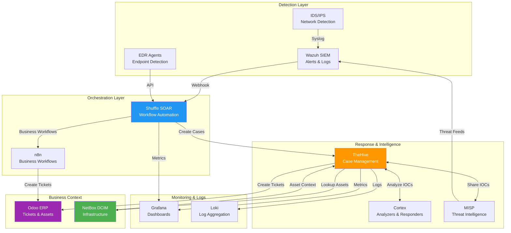
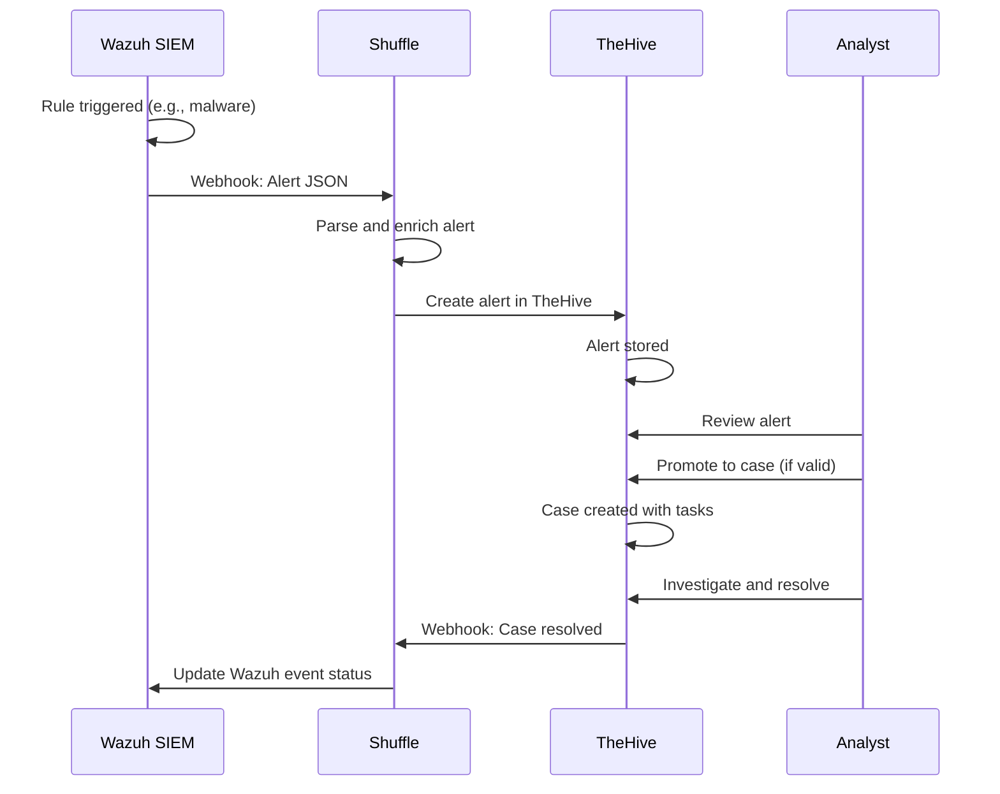
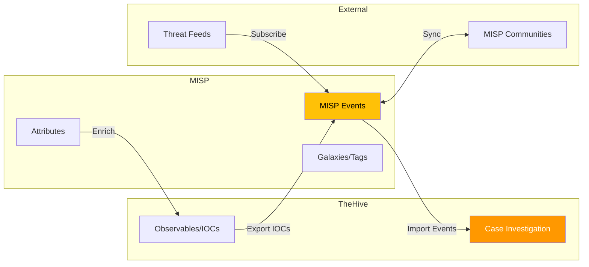
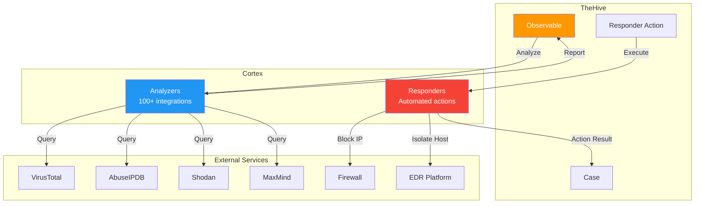
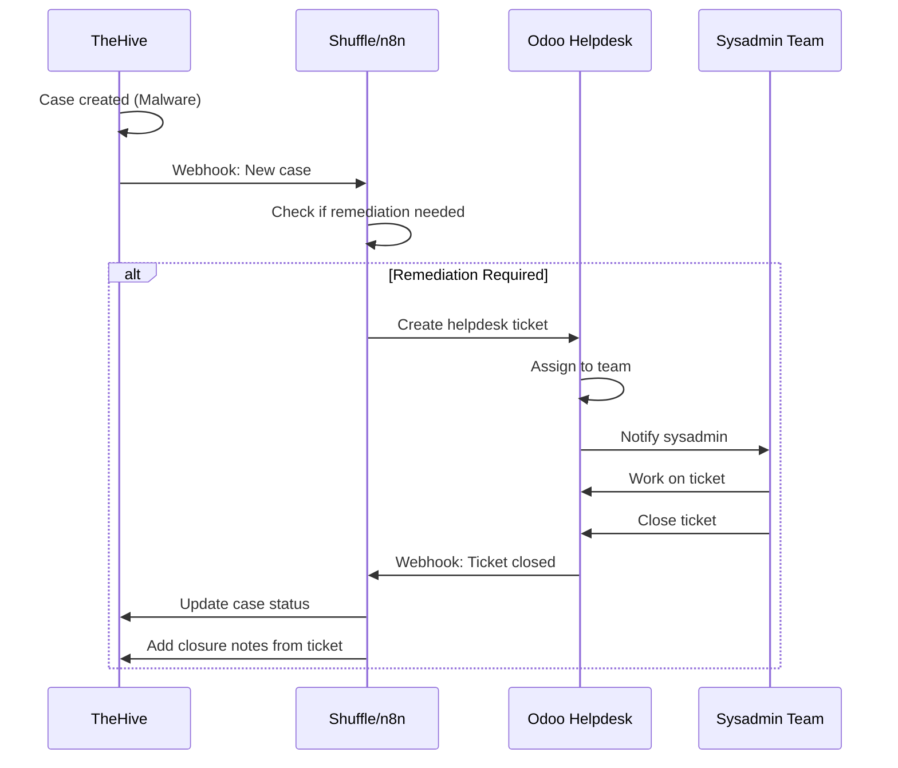
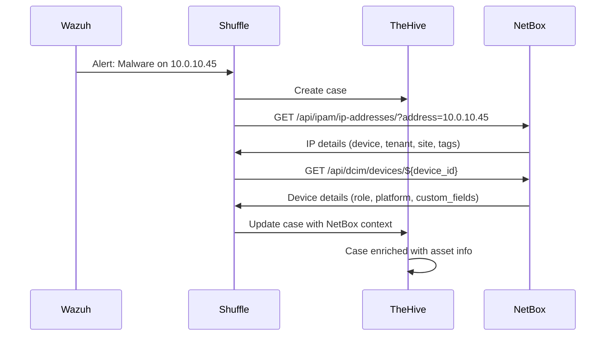
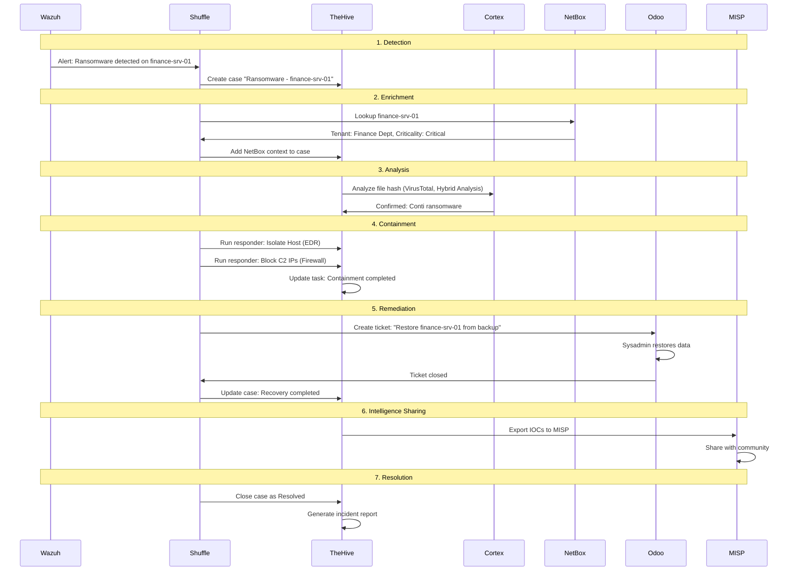

# Integração com Stack Completa NEO_NETBOX_ODOO

## Visão Geral

!!! info "AI Context: Full Stack Integration"
    Este guia mostra como integrar TheHive com todos os componentes da stack NEO_NETBOX_ODOO: Wazuh (detecção de ameaças), MISP (threat intelligence), Cortex (análise automatizada), Odoo (ticketing e gestão de ativos), NetBox (contexto de infraestrutura) e Shuffle/n8n (automação de workflows). A integração completa permite fluxo end-to-end desde detecção até resolução, com contexto de negócio e infraestrutura enriquecendo cada caso.

Este guia completo mostra como integrar TheHive com **todos os componentes** da stack NEO_NETBOX_ODOO, criando um ecossistema completo de Security Operations.

## Diagrama de Fluxo Completo



## TheHive ↔ Wazuh (Alertas para Casos)

### Arquitetura de Integração



### Configuração: Wazuh → TheHive

#### 1. Configurar Integration no Wazuh

```xml
<!-- /var/ossec/etc/ossec.conf -->
<ossec_config>
  <integration>
    <name>shuffle</name>
    <hook_url>https://shuffle.company.local/api/v1/hooks/webhook_wazuh</hook_url>
    <level>7</level>
    <alert_format>json</alert_format>
    <options>
      {"workflow_id": "wazuh_to_thehive"}
    </options>
  </integration>
</ossec_config>
```

#### 2. Workflow Shuffle: Wazuh → TheHive

Ver [Integration with Shuffle](integration-shuffle.md) para workflow completo.

**Resumo:**

```yaml
1. Receive Wazuh Alert (Webhook)
2. Filter by severity (>= 7)
3. Deduplicate (check existing alerts)
4. Create alert in TheHive
5. Add observables (IPs, hashes, etc)
6. Run Cortex analyzers
7. If malicious: Promote to case
8. Execute containment actions
```

### Casos de Uso

| Wazuh Rule | TheHive Action | Automação |
|------------|----------------|-----------|
| **5710** - SSH Brute Force | Create case + Block IP | Automático |
| **550** - Malware detected | Create case + Isolate host | Automático |
| **5503** - User login failed | Create alert (manual review) | Manual triagem |
| **31101** - Integrity checksum changed | Create case + High severity | Automático |
| **80791** - Ransomware detected | Create case + Immediate response | Automático + Notification |

## TheHive ↔ MISP (IOCs Compartilhados)

### Arquitetura de Integração



### Configuração: TheHive ↔ MISP

#### 1. Adicionar MISP ao TheHive

**Editar `/opt/thehive/config/thehive.conf`:**

```hocon
misp {
  servers = [
    {
      name = "MISP-Production"
      url = "https://misp.company.local"
      auth {
        type = "key"
        key = "YOUR_MISP_API_KEY"
      }

      # Importar eventos MISP como casos TheHive
      purpose = "ImportAndExport"

      # Template para casos importados
      caseTemplate = "MISP Event Import"

      # Whitelist de organizações (opcional)
      wsConfig {}

      # Tags para filtrar eventos
      tags = ["tlp:white", "tlp:green", "tlp:amber"]

      # Idade máxima de eventos para importar (dias)
      max-age = 7

      # Attributes para excluir da importação
      excludedAttributes = ["comment"]
    }
  ]
}
```

```bash
# Reiniciar TheHive
docker compose restart thehive
```

#### 2. Verificar Conexão

```bash
# Via API
curl -X GET "http://thehive.company.local:9000/api/v1/connector/misp/status" \
  -H "Authorization: Bearer YOUR_API_KEY"

# Resposta esperada:
# {
#   "name": "MISP-Production",
#   "status": "OK",
#   "url": "https://misp.company.local"
# }
```

### Fluxos de Integração

#### Fluxo 1: Exportar IOCs do TheHive para MISP

```yaml
Cenário: Analista descobre novos IOCs durante investigação

Steps:
  1. Analista investiga caso #42 (Malware)
  2. Identifica IOCs:
     - IP C2: 203.0.113.50
     - Hash: d41d8cd98f00b204e9800998ecf8427e
     - Domain: malicious-c2.example.com
  3. Marca observables como "IOC: true"
  4. TheHive > Case > Actions > "Export to MISP"
  5. Configurar exportação:
     - Distribution: "Your organization only"
     - Threat Level: "High"
     - Analysis: "Completed"
     - Tags: ["apt28", "malware", "tlp:amber"]
  6. MISP Event criado automaticamente
  7. Outros analistas podem ver IOCs no MISP
```

**Via API:**

```bash
# Exportar caso para MISP
curl -X POST "http://thehive.company.local:9000/api/v1/case/CASE_ID/export" \
  -H "Authorization: Bearer YOUR_API_KEY" \
  -H "Content-Type: application/json" \
  -d '{
    "connector": "misp",
    "distribution": 1,
    "threat_level": 2,
    "analysis": 2,
    "tags": ["apt28", "malware"]
  }'
```

#### Fluxo 2: Importar Eventos MISP para TheHive

```yaml
Cenário: MISP recebe threat intelligence de feed externo

Steps:
  1. MISP importa evento de feed (AlienVault OTX)
  2. Evento contém IOCs de nova campanha de phishing
  3. Evento tem tag "tlp:amber" (dentro do whitelist)
  4. TheHive sincroniza automaticamente (a cada 5 minutos)
  5. Caso criado no TheHive usando template "MISP Event Import"
  6. Todos os attributes do MISP viram observables
  7. Analista revisa caso e decide: investigar ou ignorar
```

**Configurar sincronização automática:**

```bash
# Adicionar ao cron
crontab -e

# Sincronizar MISP events a cada 5 minutos
*/5 * * * * curl -X POST http://thehive.company.local:9000/api/v1/connector/misp/import \
  -H "Authorization: Bearer YOUR_API_KEY"
```

#### Fluxo 3: Enriquecer Observables com MISP

```yaml
Cenário: Analista quer verificar se IOC já é conhecido

Steps:
  1. Analista adiciona observable (IP: 203.0.113.50)
  2. Observable > Actions > "Search in MISP"
  3. MISP retorna:
     - 3 eventos relacionados
     - Visto em 5 organizações
     - Tags: "c2-server", "apt28", "russia"
  4. Analista adiciona contexto ao caso:
     "IP conhecido, parte de campanha APT28 ativa desde 2023"
```

### Casos de Uso

| Cenário | Fluxo |
|---------|-------|
| **Descoberta de novo malware** | TheHive → MISP (exportar IOCs) |
| **Receber threat intel de parceiros** | MISP → TheHive (importar eventos) |
| **Verificar reputação de IOC** | TheHive → MISP (query via analyzer) |
| **Compartilhar IOCs com comunidade** | TheHive → MISP → MISP Communities |
| **Automatizar blacklists** | MISP → Firewall/IDS (via feed) |

## TheHive ↔ Cortex (Análise Automatizada)

### Arquitetura de Integração



### Configuração: TheHive ↔ Cortex

#### 1. Instalar Cortex (Docker)

```yaml
# Adicionar ao docker-compose.yml da stack TheHive

  cortex:
    image: thehiveproject/cortex:latest
    container_name: cortex
    hostname: cortex
    restart: unless-stopped
    depends_on:
      - elasticsearch
    environment:
      # Elasticsearch connection
      ES_HOSTNAMES: "elasticsearch"
      ES_HTTP_PORT: "9200"

      # Job directory
      JOB_DIRECTORY: "/tmp/cortex-jobs"
    volumes:
      - ./config/cortex/application.conf:/etc/cortex/application.conf:ro
      - cortex_jobs:/tmp/cortex-jobs
    networks:
      - thehive_network
    ports:
      - "9001:9001"

volumes:
  cortex_jobs:
    driver: local
```

#### 2. Configurar Cortex no TheHive

**Editar `/opt/thehive/config/thehive.conf`:**

```hocon
cortex {
  servers = [
    {
      name = "Cortex-Production"
      url = "http://cortex:9001"
      auth {
        type = "bearer"
        key = "YOUR_CORTEX_API_KEY"
      }

      # Refresh interval (seconds)
      refreshDelay = 5

      # Max parallel jobs
      maxParallelJobs = 5

      # Proxy config (if needed)
      # wsConfig.proxy {}
    }
  ]
}
```

```bash
# Reiniciar TheHive
docker compose restart thehive
```

#### 3. Instalar Analyzers no Cortex

```bash
# Acessar Cortex UI
xdg-open http://localhost:9001

# Organization Admin > Analyzers > Enable analyzers:
# - VirusTotal_GetReport_3_0
# - AbuseIPDB_1_0
# - MaxMind_GeoIP_4_0
# - MISP_2_1
# - Shodan_Host_1_0
# - OTX_Query_2_0

# Configurar API keys de cada analyzer
```

### Analyzers Recomendados

#### Analyzers para IP Address

| Analyzer | Informação Retornada | API Key Necessária |
|----------|---------------------|-------------------|
| **AbuseIPDB** | Abuse score, relatórios históricos | Sim (free tier) |
| **MaxMind GeoIP** | País, cidade, ASN, ISP | Sim (free tier) |
| **Shodan** | Portas abertas, serviços, CVEs | Sim (paid) |
| **MISP** | Eventos relacionados | Sim (MISP instance) |
| **GreyNoise** | Reputation, tags, classification | Sim (free tier) |
| **Censys** | Certificates, services | Sim (paid) |

#### Analyzers para File Hash

| Analyzer | Informação Retornada | API Key Necessária |
|----------|---------------------|-------------------|
| **VirusTotal** | Detecções AV, comportamento | Sim (free tier) |
| **Hybrid Analysis** | Sandbox analysis, IOCs | Sim (free tier) |
| **MISP** | Eventos relacionados | Sim |
| **MalwareBazaar** | Malware family, tags | Não |
| **OTX AlienVault** | Pulses relacionados | Sim (free) |

#### Analyzers para Domain/URL

| Analyzer | Informação Retornada | API Key Necessária |
|----------|---------------------|-------------------|
| **VirusTotal** | Reputação, detecções | Sim (free tier) |
| **URLScan.io** | Screenshot, redirects, tech stack | Sim (free tier) |
| **Google Safe Browsing** | Status de segurança | Sim (free) |
| **PhishTank** | Phishing database check | Não |
| **PassiveTotal** | DNS histórico, WHOIS | Sim (paid) |

### Responders Recomendados

#### Responders para IP Address

| Responder | Ação | Requisitos |
|-----------|------|-----------|
| **Firewall_Block_IP** | Bloqueia IP no firewall | API firewall configurada |
| **EDR_Isolate_Host** | Isola host da rede | EDR API (CrowdStrike, SentinelOne) |
| **MISP_Export** | Exporta IOC para MISP | MISP configurado |
| **Blacklist_Add** | Adiciona a blacklist interna | Database configurado |

#### Responders para Email

| Responder | Ação | Requisitos |
|-----------|------|-----------|
| **O365_DeleteEmail** | Remove email de mailboxes | Microsoft Graph API |
| **Gmail_DeleteEmail** | Remove email de mailboxes | Google Workspace API |
| **EmailGateway_BlockSender** | Bloqueia sender | API gateway (Proofpoint, Mimecast) |

#### Responders para User Account

| Responder | Ação | Requisitos |
|-----------|------|-----------|
| **AD_DisableUser** | Desabilita conta AD | LDAP/AD API |
| **AD_ResetPassword** | Força reset de senha | LDAP/AD API |
| **O365_RevokeTokens** | Revoga todos os tokens OAuth | Microsoft Graph API |

### Exemplo de Uso

```yaml
Cenário: Analisar IP suspeito

1. Analista adiciona observable: IP 203.0.113.50
2. Observable > Actions > Run Analyzers
3. Selecionar analyzers:
   - AbuseIPDB_1_0
   - MaxMind_GeoIP_4_0
   - Shodan_Host_1_0
   - MISP_2_1
4. Aguardar execução (~30 segundos)
5. Visualizar resultados:

   AbuseIPDB:
     - Abuse Score: 95/100
     - Total Reports: 45
     - Categories: SSH brute force, Port scan

   MaxMind GeoIP:
     - Country: China
     - City: Beijing
     - ASN: AS4134 (Chinanet)
     - ISP: China Telecom

   Shodan:
     - Open Ports: 22, 80, 443, 3389
     - Services: SSH (OpenSSH 7.4), HTTP (nginx)
     - CVEs: CVE-2021-28041

   MISP:
     - Found in 3 events
     - Tags: c2-server, apt28, russia

6. Decisão: IP confirmado malicioso
7. Observable > Actions > Run Responders
8. Selecionar: Firewall_Block_IP
9. IP bloqueado automaticamente
10. Task atualizada: "✅ IP 203.0.113.50 blocked in firewall"
```

## TheHive ↔ Odoo (Tickets de Suporte)

### Arquitetura de Integração



### Configuração: TheHive → Odoo

#### 1. Criar API User no Odoo

```bash
# Via Odoo UI
Settings > Users > Create User

User:
  Name: "TheHive Integration"
  Login: "thehive-api"
  Password: "STRONG_PASSWORD"
  Access Rights:
    - Helpdesk: User - Own Tickets Only
    - Technical: API Access

# Obter API Key
Settings > Users > thehive-api > Preferences > API Key > Generate
```

#### 2. Workflow n8n: TheHive → Odoo

```yaml
Workflow: "Create Odoo Ticket from TheHive Case"

Trigger:
  - Type: Webhook
  - URL: https://n8n.company.local/webhook/thehive-case-created
  - Method: POST

Nodes:
  1. Webhook (Trigger)
     - Receives TheHive case data

  2. Function: Parse Case Data
     - Extract: title, description, severity, customFields

  3. Condition: Check if Ticket Needed
     - If case.tags includes "remediation-required"
     - Then: Continue
     - Else: Stop

  4. Odoo: Create Helpdesk Ticket
     - Model: helpdesk.ticket
     - Fields:
         name: "[TheHive #${case.number}] ${case.title}"
         description: |
           TheHive Case: #${case.number}
           Severity: ${case.severity}
           Created: ${case.createdAt}

           ${case.description}

           Link: https://thehive.company.local/case/${case.id}
         team_id: 3  # IT Security Team
         priority: ${case.severity}
         tag_ids: ["thehive", "security-incident"]
         user_id: false  # Unassigned

  5. TheHive: Update Case Custom Fields
     - Add field: odoo_ticket_id = ${odoo_ticket.id}
     - Add field: odoo_ticket_url = https://odoo.company.local/...

  6. TheHive: Add Case Comment
     - Comment: "✅ Odoo ticket created: #${odoo_ticket.id}"
```

#### 3. Workflow n8n: Odoo Ticket Closed → TheHive

```yaml
Workflow: "Close TheHive Case when Odoo Ticket Resolved"

Trigger:
  - Type: Odoo Webhook
  - Model: helpdesk.ticket
  - Event: stage_id changed to "Closed"

Nodes:
  1. Webhook (Trigger)
     - Receives Odoo ticket data

  2. Function: Extract TheHive Case Number
     - Parse ticket name: "[TheHive #42]"
     - Extract case_number: 42

  3. TheHive: Search Case by Number
     - Query: {"number": case_number}

  4. Condition: Case Exists and Not Resolved
     - If case.status != "Resolved"
     - Then: Continue
     - Else: Stop

  5. TheHive: Update Case Status
     - Status: "Resolved"
     - Resolution: "Fixed"
     - Summary: "Resolved via Odoo ticket #${ticket.id}"

  6. TheHive: Add Closure Notes
     - Comment: |
         ## Case Resolved

         **Odoo Ticket**: #${ticket.id}
         **Closed By**: ${ticket.user_id.name}
         **Resolution Notes**:

         ${ticket.resolution_notes}

  7. Notification: Send Email
     - To: case.owner
     - Subject: "TheHive Case #${case.number} Resolved"
     - Body: "Case closed via Odoo ticket #${ticket.id}"
```

### Casos de Uso

| Cenário | Fluxo | Automação |
|---------|-------|-----------|
| **Malware remediation** | TheHive case → Odoo ticket (reimage workstation) | Automático |
| **Vulnerability patching** | TheHive case → Odoo ticket (apply patches) | Automático |
| **Account reset** | TheHive case → Odoo ticket (reset password) | Automático |
| **Incident closure** | Odoo ticket closed → TheHive case resolved | Automático |
| **Escalation** | TheHive high-severity case → Odoo urgent ticket | Automático |

## TheHive ↔ NetBox (Contexto de Ativos)

### Arquitetura de Integração



### Configuração: TheHive → NetBox

#### 1. Criar API Token no NetBox

```bash
# Via NetBox UI
Admin > Users > [seu usuário] > API Tokens > Add Token

Token:
  Key: GENERATE_RANDOM_KEY
  Write enabled: No (read-only recomendado)
  Expires: Never (ou 1 year)
```

#### 2. Workflow Shuffle: Enrich Case with NetBox

```yaml
Action: NetBox Enrichment

Input: $wazuh_alert.agent.ip

Steps:
  1. NetBox: Get IP Address
     - URL: https://netbox.company.local/api/ipam/ip-addresses/
     - Query: ?address=${agent_ip}
     - Headers: Authorization: Token ${NETBOX_API_KEY}
     - Output: $netbox_ip

  2. Condition: IP Found in NetBox
     - If: $netbox_ip.count > 0
     - Then: Continue enrichment
     - Else: Skip (asset not managed)

  3. NetBox: Get Device
     - URL: https://netbox.company.local/api/dcim/devices/${netbox_ip.results[0].assigned_object.device.id}
     - Output: $netbox_device

  4. NetBox: Get Tenant
     - URL: https://netbox.company.local/api/tenancy/tenants/${netbox_device.tenant.id}
     - Output: $netbox_tenant

  5. Build Context Object
     - asset_name: $netbox_device.name
     - asset_role: $netbox_device.device_role.name
     - asset_type: $netbox_device.device_type.display
     - asset_site: $netbox_device.site.name
     - asset_rack: $netbox_device.rack.name
     - asset_tenant: $netbox_tenant.name
     - asset_contact: $netbox_tenant.custom_fields.contact_email
     - asset_criticality: $netbox_device.custom_fields.criticality
     - asset_backup_enabled: $netbox_device.custom_fields.backup_enabled

  6. TheHive: Update Case Custom Fields
     - Add all asset context fields
     - Add link: netbox_url: https://netbox.company.local/dcim/devices/${netbox_device.id}

  7. TheHive: Add Case Comment
     - Comment: |
         ## Asset Context (from NetBox)

         **Device**: ${netbox_device.name}
         **Role**: ${netbox_device.device_role.name}
         **Location**: ${netbox_device.site.name} - Rack ${netbox_device.rack.name}
         **Owner**: ${netbox_tenant.name}
         **Contact**: ${netbox_tenant.custom_fields.contact_email}
         **Criticality**: ${netbox_device.custom_fields.criticality}
         **Backup Enabled**: ${netbox_device.custom_fields.backup_enabled}

         [View in NetBox](${netbox_url})
```

### Custom Fields no TheHive

**Criar custom fields para contexto de NetBox:**

```
Settings > Custom Fields > Create Fields for "Case"

Fields:
  - asset_name (String)
  - asset_role (String)
  - asset_site (String)
  - asset_tenant (String)
  - asset_contact (String)
  - asset_criticality (String: Low/Medium/High/Critical)
  - asset_backup_enabled (Boolean)
  - netbox_url (String - URL)
```

### Casos de Uso

| Cenário | Benefício |
|---------|-----------|
| **Priorização de casos** | Casos em ativos críticos (NetBox criticality=Critical) têm prioridade automática |
| **Notificação de proprietários** | Alertar tenant owner automaticamente via email do NetBox |
| **Decisão de backup vs reimage** | Se backup_enabled=true, restaurar; senão, reimage |
| **Contenção granular** | Isolar apenas devices em mesma VLAN (NetBox vlan_id) |
| **Auditoria de ativos afetados** | Relatório de todos os devices comprometidos por tenant/site |

## Casos de Uso End-to-End

### Caso 1: Ransomware Detection → Full Response



**Métricas:**

- **Detecção → Contenção**: 5 minutos (automático)
- **Contenção → Recuperação**: 2 horas (manual)
- **Tempo Total**: 2h 5min
- **Downtime**: 2 horas
- **Dados perdidos**: 0 (backup restaurado)

### Caso 2: Phishing Campaign → Multi-Tenant Response

```yaml
Cenário: Email de phishing enviado para 500 usuários

1. Detection (Wazuh Email Gateway Integration)
   - 500 emails detectados com link malicioso
   - Wazuh alerta: "Phishing campaign detected"

2. Triage Automatizada (Shuffle)
   - Agrupar alertas duplicados
   - Criar 1 caso único (não 500!)
   - Identificar todas as vítimas

3. Analysis (Cortex)
   - URLScan.io: Screenshot da página de phishing
   - VirusTotal: URL marcada como maliciosa
   - PhishTank: Confirmado phishing

4. Enrichment (NetBox)
   - Lookup de 500 vítimas
   - Agrupar por tenant/departamento:
       - Finance: 150 usuários
       - HR: 200 usuários
       - IT: 100 usuários
       - Sales: 50 usuários

5. Containment (Responders)
   - Bloquear URL em todos os proxies
   - Bloquear sender domain no email gateway
   - Deletar emails de todas as mailboxes (O365 API)

6. Impact Assessment
   - 15 usuários clicaram no link
   - 3 usuários forneceram credenciais
   - Identificar via logs de autenticação

7. Remediation (Odoo)
   - Criar 3 tickets: "Reset password - compromised accounts"
   - Criar 15 tickets: "Security awareness training"

8. Prevention
   - Atualizar regras de email gateway
   - Adicionar IOCs ao MISP
   - Criar alerta no Wazuh para domínio similar

9. Communication
   - Email para todos os 500 usuários: "Phishing attempt blocked"
   - Email para 15 clickers: "Mandatory security training"
   - Email para 3 compromised: "Password reset required"

10. Resolution
    - Caso fechado após 4 horas
    - Todos os tickets Odoo resolvidos
    - IOCs compartilhados com comunidade MISP
```

## Monitoramento da Integração

### Métricas de Saúde da Stack

```yaml
Métricas (Prometheus/Grafana):

  # TheHive
  - thehive_cases_total
  - thehive_cases_by_status{status="Open|InProgress|Resolved"}
  - thehive_api_requests_total
  - thehive_api_errors_total

  # Wazuh → TheHive
  - wazuh_alerts_sent_total
  - thehive_alerts_received_total
  - thehive_cases_created_from_wazuh_total

  # TheHive → MISP
  - thehive_misp_exports_total
  - thehive_misp_imports_total
  - thehive_misp_sync_errors_total

  # TheHive → Cortex
  - cortex_analyzers_executed_total
  - cortex_analyzers_failed_total
  - cortex_responders_executed_total

  # TheHive → Odoo
  - odoo_tickets_created_from_thehive_total
  - thehive_cases_closed_from_odoo_total

  # TheHive → NetBox
  - netbox_lookups_total
  - netbox_enrichments_total
```

### Dashboard Grafana

```json
{
  "dashboard": {
    "title": "TheHive Stack Integration Health",
    "panels": [
      {
        "title": "Alert Flow",
        "type": "graph",
        "targets": [
          {"expr": "rate(wazuh_alerts_sent_total[5m])", "legendFormat": "Wazuh Alerts"},
          {"expr": "rate(thehive_alerts_received_total[5m])", "legendFormat": "TheHive Received"},
          {"expr": "rate(thehive_cases_created_total[5m])", "legendFormat": "Cases Created"}
        ]
      },
      {
        "title": "Integration Success Rate",
        "type": "gauge",
        "targets": [
          {"expr": "(thehive_misp_exports_total / (thehive_misp_exports_total + thehive_misp_sync_errors_total)) * 100"}
        ]
      },
      {
        "title": "Average Time to Resolution",
        "type": "stat",
        "targets": [
          {"expr": "avg(thehive_case_resolution_time_seconds)"}
        ]
      }
    ]
  }
}
```

## Troubleshooting

### Problema: TheHive não está recebendo alertas do Wazuh

**Diagnóstico:**

```bash
# Verificar logs do Wazuh Manager
tail -f /var/ossec/logs/integrations.log

# Verificar logs do Shuffle
docker logs shuffle-backend | grep -i wazuh

# Verificar conectividade
curl -X POST https://shuffle.company.local/api/v1/hooks/webhook_wazuh \
  -H "Content-Type: application/json" \
  -d '{"test": "integration"}'
```

**Soluções:**

- Verificar webhook URL no Wazuh config
- Verificar certificado SSL (disable verification temporariamente)
- Verificar firewall entre Wazuh e Shuffle

### Problema: MISP sync failing

**Diagnóstico:**

```bash
# Verificar status da conexão
curl -X GET "http://thehive.company.local:9000/api/v1/connector/misp/status" \
  -H "Authorization: Bearer YOUR_API_KEY"

# Verificar logs do TheHive
docker logs thehive | grep -i misp
```

**Soluções:**

- Verificar MISP API key válida
- Verificar certificado SSL do MISP
- Verificar tags whitelist no config

### Problema: Cortex analyzers não executando

**Diagnóstico:**

```bash
# Verificar status do Cortex
curl -X GET "http://cortex:9001/api/status"

# Verificar analyzers habilitados
curl -X GET "http://cortex:9001/api/analyzer" \
  -H "Authorization: Bearer CORTEX_API_KEY"
```

**Soluções:**

- Verificar API keys de analyzers (VirusTotal, etc)
- Verificar rate limits de APIs externas
- Aumentar timeout de jobs no Cortex

## Próximos Passos

Agora que você tem a stack completamente integrada:

1. **[Use Cases](use-cases.md)**: Casos de uso detalhados para cenários específicos
2. **[API Reference](api-reference.md)**: Referência completa da API do TheHive

!!! tip "AI Context: Stack Integration Summary"
    Integração completa TheHive na stack NEO_NETBOX_ODOO conecta: (1) Wazuh via webhook Shuffle para criação automática de alertas/casos, (2) MISP para import/export bidirecional de IOCs e threat intel, (3) Cortex para análise automatizada de observables via 100+ analyzers e responders, (4) Odoo para criação de tickets de remediation e fechamento sincronizado de casos, (5) NetBox para enriquecimento de contexto de ativos (owner, location, criticality). Fluxo end-to-end: detecção (Wazuh) → triagem (Shuffle) → investigação (TheHive+Cortex) → enrichment (NetBox+MISP) → remediation (Odoo) → intelligence sharing (MISP).
