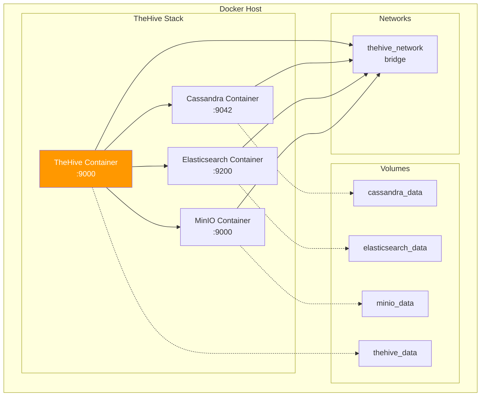
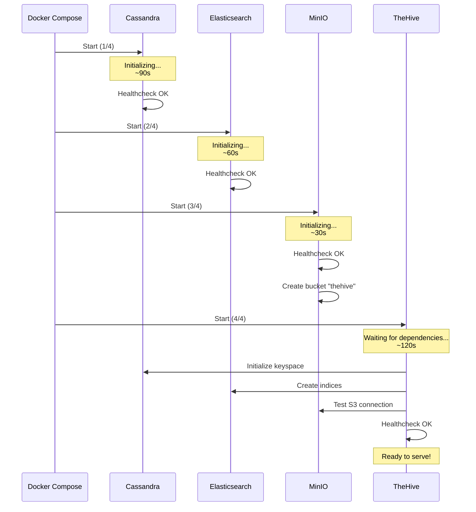

# Setup e Configuração do TheHive

## Visão Geral

!!! info "AI Context: TheHive Installation"
    Este guia cobre a instalação completa do TheHive 5.x usando Docker Compose, incluindo todos os componentes necessários (Cassandra, Elasticsearch, MinIO), configuração de autenticação, hardening de segurança e troubleshooting. A instalação via Docker é recomendada para ambientes de produção por facilitar updates, backup e alta disponibilidade.

Este guia fornece instruções passo a passo para instalar e configurar TheHive 5.x em ambiente de produção usando **Docker Compose**, a forma recomendada e mais simples de deployment.

## Pré-requisitos Detalhados

### Hardware

=== "Ambiente de Teste/Lab"

    ```yaml
    Mínimo:
      CPU: 4 cores (Intel/AMD x86_64)
      RAM: 16 GB
      Storage: 50 GB SSD
      Network: 100 Mbps

    Recomendado:
      CPU: 8 cores
      RAM: 32 GB
      Storage: 200 GB SSD (NVMe)
      Network: 1 Gbps
    ```

=== "Ambiente de Produção"

    ```yaml
    Mínimo:
      CPU: 16 cores
      RAM: 64 GB
      Storage: 500 GB SSD NVMe
      Network: 1 Gbps

    Recomendado:
      CPU: 32 cores
      RAM: 128 GB
      Storage: 1 TB SSD NVMe (RAID 10)
      Network: 10 Gbps
      Backup Storage: 2 TB+ (separado)
    ```

### Software

| Componente | Versão Mínima | Versão Recomendada |
|------------|---------------|-------------------|
| **Sistema Operacional** | Ubuntu 20.04 / Rocky 8 | Ubuntu 22.04 LTS / Rocky 9 |
| **Docker Engine** | 20.10+ | 24.0+ |
| **Docker Compose** | 2.0+ | 2.20+ |
| **Python** | 3.8+ | 3.11+ (para scripts auxiliares) |
| **Kernel Linux** | 5.4+ | 6.x+ |

### Requisitos de Rede

```yaml
Portas Necessárias:
  TheHive:
    - 9000/tcp (UI e API)
  Cassandra:
    - 9042/tcp (CQL protocol)
    - 7000/tcp (inter-node communication)
    - 7001/tcp (TLS inter-node)
  Elasticsearch:
    - 9200/tcp (HTTP API)
    - 9300/tcp (transport)
  MinIO:
    - 9000/tcp (S3 API)
    - 9001/tcp (Console)
  Cortex (opcional):
    - 9001/tcp (API)

Acesso Externo:
  - Docker Hub (docker.io, ghcr.io)
  - Cortex Analyzers (api.virustotal.com, etc)
  - MISP instance (se aplicável)
  - SMTP server (para notificações)
```

!!! warning "Firewall e SELinux"
    - Desabilite SELinux temporariamente durante instalação (ou configure corretamente)
    - Configure firewall (ufw/firewalld) para permitir apenas portas necessárias
    - Restrinja acesso ao TheHive via IP whitelist ou VPN

### Checklist Pré-Instalação

```bash
# Verificar recursos de hardware
echo "=== CPU ==="
lscpu | grep -E "^CPU\(s\)|Model name"

echo "=== RAM ==="
free -h

echo "=== Storage ==="
df -h

echo "=== Network ==="
ip addr show

# Verificar versões de software
echo "=== Docker ==="
docker --version

echo "=== Docker Compose ==="
docker compose version

# Verificar conectividade externa
echo "=== Internet Connectivity ==="
curl -I https://docker.io
curl -I https://api.virustotal.com
```

## Instalação via Docker Compose

### Arquitetura do Deployment



### Passo 1: Preparar o Ambiente

```bash
# Criar diretório de trabalho
mkdir -p /opt/thehive
cd /opt/thehive

# Criar estrutura de diretórios
mkdir -p {config,data/{cassandra,elasticsearch,minio,thehive},logs,backups}

# Configurar permissões
chown -R 1000:1000 data/
chmod -R 755 data/
```

### Passo 2: Configurar Parâmetros do Sistema

```bash
# Elasticsearch requer vm.max_map_count >= 262144
sudo sysctl -w vm.max_map_count=262144

# Tornar permanente
echo "vm.max_map_count=262144" | sudo tee -a /etc/sysctl.conf

# Verificar
sysctl vm.max_map_count

# Aumentar limites de arquivo (recomendado para Cassandra)
cat <<EOF | sudo tee -a /etc/security/limits.conf
* soft nofile 65536
* hard nofile 65536
* soft nproc 32768
* hard nproc 32768
EOF
```

### Passo 3: Criar docker-compose.yml

```yaml
# /opt/thehive/docker-compose.yml
version: "3.8"

networks:
  thehive_network:
    driver: bridge
    ipam:
      config:
        - subnet: 172.20.0.0/16

volumes:
  cassandra_data:
    driver: local
  elasticsearch_data:
    driver: local
  minio_data:
    driver: local
  thehive_data:
    driver: local

services:
  # =============================================================================
  # Cassandra - Primary Database
  # =============================================================================
  cassandra:
    image: cassandra:4.1
    container_name: thehive_cassandra
    hostname: cassandra
    restart: unless-stopped
    environment:
      # Cluster configuration
      CASSANDRA_CLUSTER_NAME: "TheHive Cluster"
      CASSANDRA_DC: "DC1"
      CASSANDRA_RACK: "RACK1"

      # Memory settings (ajustar conforme hardware)
      MAX_HEAP_SIZE: "4G"
      HEAP_NEWSIZE: "800M"

      # Authentication
      CASSANDRA_AUTHENTICATOR: "PasswordAuthenticator"
      CASSANDRA_AUTHORIZER: "CassandraAuthorizer"

      # Performance tuning
      CASSANDRA_NUM_TOKENS: "256"
      CASSANDRA_SEEDS: "cassandra"
    volumes:
      - cassandra_data:/var/lib/cassandra
      - ./logs/cassandra:/var/log/cassandra
    networks:
      thehive_network:
        ipv4_address: 172.20.0.10
    ports:
      - "9042:9042"  # CQL
      - "7000:7000"  # Inter-node
    healthcheck:
      test: ["CMD", "cqlsh", "-e", "describe keyspaces"]
      interval: 30s
      timeout: 10s
      retries: 5
      start_period: 120s
    ulimits:
      memlock: -1
      nofile:
        soft: 65536
        hard: 65536

  # =============================================================================
  # Elasticsearch - Search Engine
  # =============================================================================
  elasticsearch:
    image: docker.elastic.co/elasticsearch/elasticsearch:7.17.15
    container_name: thehive_elasticsearch
    hostname: elasticsearch
    restart: unless-stopped
    environment:
      # Cluster settings
      cluster.name: "thehive-cluster"
      node.name: "es-node-01"
      discovery.type: "single-node"

      # Memory settings
      ES_JAVA_OPTS: "-Xms4g -Xmx4g"

      # Security (desabilitado para simplificar - habilitar em produção)
      xpack.security.enabled: "false"
      xpack.monitoring.enabled: "false"
      xpack.ml.enabled: "false"
      xpack.watcher.enabled: "false"

      # Performance
      indices.query.bool.max_clause_count: "4096"
      thread_pool.search.queue_size: "10000"
    volumes:
      - elasticsearch_data:/usr/share/elasticsearch/data
      - ./logs/elasticsearch:/usr/share/elasticsearch/logs
    networks:
      thehive_network:
        ipv4_address: 172.20.0.11
    ports:
      - "9200:9200"
      - "9300:9300"
    healthcheck:
      test: ["CMD", "curl", "-f", "http://localhost:9200/_cluster/health"]
      interval: 30s
      timeout: 10s
      retries: 5
      start_period: 60s
    ulimits:
      memlock:
        soft: -1
        hard: -1
      nofile:
        soft: 65536
        hard: 65536

  # =============================================================================
  # MinIO - S3-compatible Object Storage
  # =============================================================================
  minio:
    image: minio/minio:latest
    container_name: thehive_minio
    hostname: minio
    restart: unless-stopped
    command: server /data --console-address ":9001"
    environment:
      MINIO_ROOT_USER: "minioadmin"
      MINIO_ROOT_PASSWORD: "minioadmin123!"  # ALTERAR EM PRODUÇÃO
      MINIO_REGION: "us-east-1"
    volumes:
      - minio_data:/data
    networks:
      thehive_network:
        ipv4_address: 172.20.0.12
    ports:
      - "9000:9000"  # S3 API
      - "9001:9001"  # Console
    healthcheck:
      test: ["CMD", "curl", "-f", "http://localhost:9000/minio/health/live"]
      interval: 30s
      timeout: 10s
      retries: 3
      start_period: 30s

  # =============================================================================
  # MinIO Client - Create bucket on startup
  # =============================================================================
  minio-create-bucket:
    image: minio/mc:latest
    container_name: thehive_minio_setup
    depends_on:
      minio:
        condition: service_healthy
    networks:
      - thehive_network
    entrypoint: >
      /bin/sh -c "
      /usr/bin/mc alias set myminio http://minio:9000 minioadmin minioadmin123!;
      /usr/bin/mc mb myminio/thehive --ignore-existing;
      /usr/bin/mc anonymous set download myminio/thehive;
      exit 0;
      "

  # =============================================================================
  # TheHive - Main Application
  # =============================================================================
  thehive:
    image: strangebee/thehive:5.3
    container_name: thehive
    hostname: thehive
    restart: unless-stopped
    depends_on:
      cassandra:
        condition: service_healthy
      elasticsearch:
        condition: service_healthy
      minio:
        condition: service_healthy
      minio-create-bucket:
        condition: service_completed_successfully
    environment:
      # JVM settings
      JVM_OPTS: "-Xms4g -Xmx4g"

      # Application settings
      TH_SECRET: "CHANGE_ME_RANDOM_STRING_AT_LEAST_50_CHARS_LONG_1234567890"  # ALTERAR!
      TH_NO_CONFIG_CORTEX: "1"  # Desabilitar Cortex por padrão

      # Cassandra connection
      CQL_HOSTNAMES: "cassandra"
      CQL_PORT: "9042"
      CQL_USERNAME: "cassandra"
      CQL_PASSWORD: "cassandra"
      CQL_KEYSPACE: "thehive"

      # Elasticsearch connection
      TH_INDEX_BACKEND: "elasticsearch"
      ES_HOSTNAMES: "elasticsearch"
      ES_HTTP_PORT: "9200"
      ES_INDEX_NAME: "thehive"

      # MinIO/S3 storage
      TH_STORAGE_PROVIDER: "s3"
      S3_ENDPOINT: "http://minio:9000"
      S3_REGION: "us-east-1"
      S3_BUCKET: "thehive"
      S3_ACCESS_KEY: "minioadmin"
      S3_SECRET_KEY: "minioadmin123!"
      S3_USE_PATH_ACCESS_STYLE: "true"
    volumes:
      - thehive_data:/opt/thehive/data
      - ./config/thehive.conf:/etc/thehive/application.conf:ro
      - ./logs/thehive:/var/log/thehive
    networks:
      thehive_network:
        ipv4_address: 172.20.0.20
    ports:
      - "9000:9000"
    healthcheck:
      test: ["CMD", "curl", "-f", "http://localhost:9000/api/v1/status"]
      interval: 30s
      timeout: 10s
      retries: 5
      start_period: 180s
```

!!! danger "Segurança - IMPORTANTE"
    Antes de subir em produção, **ALTERE IMEDIATAMENTE**:
    - `TH_SECRET`: String aleatória de 50+ caracteres
    - `MINIO_ROOT_PASSWORD`: Senha forte
    - `CQL_PASSWORD`: Senha do Cassandra (ver seção de hardening)
    - Todas as senhas padrão!

### Passo 4: Criar Configuração do TheHive

```bash
# /opt/thehive/config/thehive.conf
include "application"

# =============================================================================
# Play Framework Configuration
# =============================================================================
play.http.secret.key = "${TH_SECRET}"

play.http.parser.maxMemoryBuffer = "10M"
play.http.parser.maxDiskBuffer = "1G"

play.server.http.idleTimeout = "10 minutes"
play.server.akka.requestTimeout = "10 minutes"

# =============================================================================
# Akka HTTP Configuration
# =============================================================================
akka {
  actor {
    default-dispatcher {
      fork-join-executor {
        parallelism-min = 4
        parallelism-factor = 2.0
        parallelism-max = 16
      }
    }
  }
  http {
    server {
      idle-timeout = "10 minutes"
      request-timeout = "10 minutes"
    }
  }
}

# =============================================================================
# TheHive Configuration
# =============================================================================
thehive {
  # Base URL for notifications
  baseUrl = "http://thehive.company.local:9000"

  # Authentication configuration
  auth {
    providers = [
      {name: local}
      # Adicionar LDAP/OAuth2 aqui (ver seção de autenticação)
    ]
  }
}

# =============================================================================
# Database Configuration (Cassandra)
# =============================================================================
db.janusgraph {
  storage {
    backend = "cql"
    hostname = ["cassandra"]
    port = 9042
    username = "cassandra"
    password = "cassandra"

    cql {
      cluster-name = "TheHive Cluster"
      keyspace = "thehive"

      # Replication settings
      replication-factor = 1  # Aumentar para 3 em cluster

      # Connection pooling
      local-max-connections-per-host = 8
      remote-max-connections-per-host = 2
    }
  }

  index.search {
    backend = "elasticsearch"
    hostname = ["elasticsearch"]
    port = 9200
    index-name = "thehive"

    elasticsearch {
      bulk-refresh = "wait_for"
    }
  }
}

# =============================================================================
# File Storage Configuration (MinIO/S3)
# =============================================================================
storage {
  provider = "s3"

  s3 {
    endpoint = "http://minio:9000"
    region = "us-east-1"
    bucket = "thehive"
    access-key = "minioadmin"
    secret-key = "minioadmin123!"

    # S3-compatible storage settings
    path-style-access = true
  }
}

# =============================================================================
# Cortex Configuration (opcional)
# =============================================================================
# Descomente para habilitar integração com Cortex
# cortex {
#   servers = [
#     {
#       name = "Cortex-01"
#       url = "http://cortex:9001"
#       auth {
#         type = "bearer"
#         key = "YOUR_CORTEX_API_KEY"
#       }
#     }
#   ]
# }

# =============================================================================
# MISP Configuration (opcional)
# =============================================================================
# Descomente para habilitar integração com MISP
# misp {
#   servers = [
#     {
#       name = "MISP-01"
#       url = "https://misp.company.local"
#       auth {
#         type = "key"
#         key = "YOUR_MISP_API_KEY"
#       }
#       purpose = "ImportAndExport"
#       caseTemplate = "MISP Event Import"
#     }
#   ]
# }

# =============================================================================
# Notification Configuration
# =============================================================================
notification {
  webhook {
    endpoints = [
      # Exemplo: Webhook para Shuffle
      # {
      #   name = "Shuffle"
      #   version = 2
      #   wsConfig {
      #     url = "https://shuffle.company.local/api/v1/hooks/webhook_thehive"
      #     auth {
      #       type = "bearer"
      #       key = "YOUR_SHUFFLE_WEBHOOK_KEY"
      #     }
      #   }
      # }
    ]
  }
}
```

### Passo 5: Iniciar a Stack

```bash
cd /opt/thehive

# Iniciar todos os serviços
docker compose up -d

# Monitorar logs de inicialização
docker compose logs -f

# Verificar status dos containers
docker compose ps

# Aguardar healthcheck (pode levar 3-5 minutos)
watch docker compose ps
```

**Ordem de Inicialização Esperada:**



### Passo 6: Primeiro Acesso

```bash
# Verificar que TheHive está respondendo
curl http://localhost:9000/api/v1/status

# Resposta esperada:
# {"versions":{"TheHive":"5.3.x"}}

# Acessar via navegador
xdg-open http://localhost:9000
# ou
# http://<seu-ip>:9000
```

**Credenciais Padrão:**

```yaml
Username: admin@thehive.local
Password: secret
```

!!! danger "Primeiro Login - Ações Obrigatórias"
    1. **Alterar senha do admin** imediatamente
    2. Criar novo usuário com privilégios de admin
    3. Desabilitar ou remover usuário admin padrão
    4. Configurar autenticação via LDAP/OAuth2 (recomendado)

## Configuração de Cassandra

### Criar Keyspace Manualmente (se necessário)

```bash
# Acessar Cassandra CLI
docker exec -it thehive_cassandra cqlsh

# Criar keyspace com replication factor 3 (cluster)
CREATE KEYSPACE IF NOT EXISTS thehive
WITH replication = {
  'class': 'SimpleStrategy',
  'replication_factor': 3
};

# Verificar keyspace criado
DESCRIBE KEYSPACES;

# Verificar tabelas criadas pelo TheHive
USE thehive;
DESCRIBE TABLES;

# Sair
EXIT;
```

### Alterar Senha Padrão do Cassandra

```bash
# Acessar Cassandra
docker exec -it thehive_cassandra cqlsh -u cassandra -p cassandra

# Alterar senha
ALTER USER cassandra WITH PASSWORD 'NEW_STRONG_PASSWORD_HERE';

# Criar usuário dedicado para TheHive
CREATE USER thehiveuser WITH PASSWORD 'STRONG_PASSWORD' SUPERUSER;

# Verificar usuários
LIST USERS;

# Sair
EXIT;
```

**Atualizar docker-compose.yml:**

```yaml
environment:
  CQL_USERNAME: "thehiveuser"
  CQL_PASSWORD: "STRONG_PASSWORD"
```

```bash
# Reiniciar TheHive
docker compose restart thehive
```

### Monitoramento de Cassandra

```bash
# Status do node
docker exec -it thehive_cassandra nodetool status

# Estatísticas de keyspace
docker exec -it thehive_cassandra nodetool cfstats thehive

# Compaction status
docker exec -it thehive_cassandra nodetool compactionstats

# Logs
docker logs -f thehive_cassandra
```

## Configuração de Elasticsearch

### Verificar Indices Criados

```bash
# Listar indices
curl -X GET "http://localhost:9200/_cat/indices?v"

# Verificar saúde do cluster
curl -X GET "http://localhost:9200/_cluster/health?pretty"

# Estatísticas do índice TheHive
curl -X GET "http://localhost:9200/thehive/_stats?pretty"
```

### Otimizar Performance

```yaml
# Adicionar ao docker-compose.yml (seção elasticsearch)
environment:
  # Aumentar cache de queries
  indices.queries.cache.size: "20%"

  # Aumentar buffer de indexação
  indices.memory.index_buffer_size: "30%"

  # Desabilitar swapping
  bootstrap.memory_lock: "true"
```

### Reindexação Manual (se necessário)

```bash
# Deletar índice existente (CUIDADO!)
curl -X DELETE "http://localhost:9200/thehive"

# Reiniciar TheHive para recriar índice
docker compose restart thehive

# Monitorar logs de reindexação
docker logs -f thehive
```

## Configuração de Armazenamento de Anexos

### MinIO Console

```bash
# Acessar MinIO Console
xdg-open http://localhost:9001

# Credenciais padrão:
# Username: minioadmin
# Password: minioadmin123!
```

**Ações no Console:**

1. Alterar senha do admin
2. Criar access key dedicada para TheHive
3. Configurar lifecycle policies para arquivos antigos
4. Habilitar versionamento do bucket
5. Configurar notificações (opcional)

### Testar Upload de Arquivo

```bash
# Via API do TheHive
curl -X POST http://localhost:9000/api/v1/case \
  -H "Authorization: Bearer YOUR_API_KEY" \
  -H "Content-Type: application/json" \
  -d '{
    "title": "Test Case with Attachment",
    "description": "Testing file upload"
  }'

# Fazer upload de anexo (substituir CASE_ID)
curl -X POST http://localhost:9000/api/v1/case/CASE_ID/attachment \
  -H "Authorization: Bearer YOUR_API_KEY" \
  -F "attachment=@/path/to/file.txt"
```

### Backup de Anexos

```bash
# Backup manual do bucket MinIO
docker exec thehive_minio \
  mc mirror /data/thehive /backup/thehive-$(date +%Y%m%d)

# Configurar backup automático (cron)
cat <<EOF | sudo tee /etc/cron.daily/thehive-minio-backup
#!/bin/bash
docker exec thehive_minio mc mirror /data/thehive /backup/thehive-\$(date +\%Y\%m\%d)
find /backup -name "thehive-*" -mtime +30 -delete
EOF

sudo chmod +x /etc/cron.daily/thehive-minio-backup
```

## Configuração de Autenticação

### Autenticação Local (Padrão)

Já está habilitada por padrão. Gerenciar usuários via UI:

```
Settings > Users > Add User
```

### Autenticação via LDAP/Active Directory

**Adicionar ao `/opt/thehive/config/thehive.conf`:**

```hocon
auth {
  providers = [
    {
      name: ldap

      # LDAP server configuration
      serverNames: ["ldap.company.local:389"]
      # ou para LDAPS: ["ldaps://ldap.company.local:636"]

      # Bind configuration
      bindDN: "cn=thehive-service,ou=ServiceAccounts,dc=company,dc=local"
      bindPW: "SERVICE_ACCOUNT_PASSWORD"

      # User search base
      baseDN: "ou=Users,dc=company,dc=local"
      filter: "(cn={0})"

      # Attribute mapping
      fields {
        login: "cn"
        name: "displayName"
        email: "mail"
      }

      # Default profile for new users
      defaultProfile: "analyst"

      # Auto-create user on first login
      autoCreateUser: true
    },
    {name: local}  # Manter fallback local
  ]
}
```

**Testar autenticação LDAP:**

```bash
# Restart TheHive
docker compose restart thehive

# Verificar logs
docker logs -f thehive | grep -i ldap

# Tentar login via UI com usuário LDAP
```

### Autenticação via OAuth2 (Google, Azure AD, etc)

**Exemplo para Azure AD:**

```hocon
auth {
  providers = [
    {
      name: oauth2

      # OAuth2 endpoints (Azure AD)
      clientId: "YOUR_CLIENT_ID"
      clientSecret: "YOUR_CLIENT_SECRET"
      redirectUri: "http://thehive.company.local:9000/api/ssoLogin"

      responseType: "code"
      grantType: "authorization_code"

      authorizationUrl: "https://login.microsoftonline.com/TENANT_ID/oauth2/v2.0/authorize"
      tokenUrl: "https://login.microsoftonline.com/TENANT_ID/oauth2/v2.0/token"
      userUrl: "https://graph.microsoft.com/v1.0/me"

      scope: ["openid", "profile", "email"]

      # User field mapping
      userFields {
        login: "userPrincipalName"
        name: "displayName"
        email: "mail"
      }

      defaultProfile: "analyst"
      autoCreateUser: true
    },
    {name: local}
  ]
}
```

### Autenticação via SAML2

!!! info "Recurso Enterprise"
    Autenticação SAML2 está disponível apenas no TheHive Enterprise Edition.

## Configuração de Notificações

### Email (SMTP)

**Adicionar ao `thehive.conf`:**

```hocon
notification {
  email {
    enabled = true

    # SMTP configuration
    smtp {
      host = "smtp.company.local"
      port = 587
      user = "thehive@company.local"
      password = "SMTP_PASSWORD"

      # TLS/SSL
      ssl = false
      startTls = true

      # Email settings
      from = "thehive@company.local"
      fromName = "TheHive Alerts"
    }

    # Templates
    templates {
      caseCreated = """
        A new case has been created:

        Title: {{case.title}}
        Severity: {{case.severity}}
        URL: {{baseUrl}}/case/{{case.id}}
      """
    }
  }
}
```

### Webhooks para Shuffle/n8n

```hocon
notification {
  webhook {
    endpoints = [
      {
        name = "Shuffle"
        version = 2

        # Webhook URL
        wsConfig {
          url = "https://shuffle.company.local/api/v1/hooks/webhook_thehive"

          # Authentication (opcional)
          auth {
            type = "bearer"
            key = "YOUR_WEBHOOK_SECRET"
          }

          # Headers customizados
          extraHeaders = [
            {name: "Content-Type", value: "application/json"}
          ]
        }

        # Eventos a enviar
        includedTheHiveOrganisations = ["*"]
        excludedTheHiveOrganisations = []
      }
    ]
  }
}
```

**Testar webhook:**

```bash
# Criar caso via API
curl -X POST http://localhost:9000/api/v1/case \
  -H "Authorization: Bearer YOUR_API_KEY" \
  -H "Content-Type: application/json" \
  -d '{
    "title": "Webhook Test Case",
    "description": "Testing webhook notification"
  }'

# Verificar se webhook foi chamado (checar logs do Shuffle)
```

### Slack Notifications

```hocon
notification {
  webhook {
    endpoints = [
      {
        name = "Slack"
        version = 2

        wsConfig {
          url = "https://hooks.slack.com/services/YOUR/SLACK/WEBHOOK"
        }

        # Filtrar apenas casos críticos
        filters = [
          {
            name = "critical-cases"
            condition = "case.severity == 4"
          }
        ]
      }
    ]
  }
}
```

## Hardening de Segurança

### 1. Segurança de Rede

```bash
# Configurar firewall (UFW)
sudo ufw allow 9000/tcp comment "TheHive UI/API"
sudo ufw deny 9042/tcp comment "Cassandra (internal only)"
sudo ufw deny 9200/tcp comment "Elasticsearch (internal only)"
sudo ufw deny 9001/tcp comment "MinIO (internal only)"

# Restringir acesso por IP (recomendado)
sudo ufw allow from 10.0.0.0/8 to any port 9000 proto tcp
```

**Configurar reverse proxy (Nginx):**

```nginx
# /etc/nginx/sites-available/thehive
upstream thehive_backend {
    server 127.0.0.1:9000;
}

server {
    listen 443 ssl http2;
    server_name thehive.company.local;

    # SSL configuration
    ssl_certificate /etc/ssl/certs/thehive.crt;
    ssl_certificate_key /etc/ssl/private/thehive.key;
    ssl_protocols TLSv1.2 TLSv1.3;
    ssl_ciphers HIGH:!aNULL:!MD5;

    # Security headers
    add_header X-Frame-Options "SAMEORIGIN" always;
    add_header X-Content-Type-Options "nosniff" always;
    add_header X-XSS-Protection "1; mode=block" always;
    add_header Strict-Transport-Security "max-age=31536000" always;

    # Rate limiting
    limit_req_zone $binary_remote_addr zone=thehive_limit:10m rate=10r/s;
    limit_req zone=thehive_limit burst=20 nodelay;

    # Client body size (para uploads)
    client_max_body_size 100M;

    location / {
        proxy_pass http://thehive_backend;
        proxy_set_header Host $host;
        proxy_set_header X-Real-IP $remote_addr;
        proxy_set_header X-Forwarded-For $proxy_add_x_forwarded_for;
        proxy_set_header X-Forwarded-Proto $scheme;

        # WebSocket support
        proxy_http_version 1.1;
        proxy_set_header Upgrade $http_upgrade;
        proxy_set_header Connection "upgrade";

        # Timeouts
        proxy_connect_timeout 600s;
        proxy_send_timeout 600s;
        proxy_read_timeout 600s;
    }
}

# Redirect HTTP to HTTPS
server {
    listen 80;
    server_name thehive.company.local;
    return 301 https://$server_name$request_uri;
}
```

### 2. Alterar Todas as Senhas Padrão

```bash
# Gerar senhas fortes
openssl rand -base64 32

# Alterar em docker-compose.yml:
# - TH_SECRET
# - MINIO_ROOT_PASSWORD
# - CQL_PASSWORD (Cassandra)
# - S3_SECRET_KEY

# Reiniciar stack
docker compose down
docker compose up -d
```

### 3. Habilitar Auditoria

**Adicionar ao `thehive.conf`:**

```hocon
audit {
  enabled = true

  # Log all actions
  logger {
    enabled = true
    level = "INFO"

    # Log to file
    file {
      path = "/var/log/thehive/audit.log"
      pattern = "%date %level %logger %message%n"

      # Rotation
      rolling {
        type = "time"
        pattern = "yyyy-MM-dd"
        maxHistory = 90
      }
    }
  }

  # Send to SIEM (opcional)
  siem {
    enabled = false
    # url = "https://siem.company.local/logs"
  }
}
```

### 4. Limitar API Rate

```hocon
# Rate limiting
play.filters.enabled += "play.filters.cors.CORSFilter"

play.filters.cors {
  pathPrefixes = ["/api"]
  allowedOrigins = ["https://thehive.company.local"]
  allowedHttpMethods = ["GET", "POST", "PUT", "DELETE", "PATCH"]
  allowedHttpHeaders = ["Accept", "Content-Type", "Authorization"]
}

# Rate limit configuration (via Nginx - ver seção anterior)
```

### 5. Backup e Disaster Recovery

```bash
#!/bin/bash
# /opt/thehive/scripts/backup.sh

BACKUP_DIR="/backup/thehive"
DATE=$(date +%Y%m%d_%H%M%S)
BACKUP_PATH="$BACKUP_DIR/backup_$DATE"

mkdir -p "$BACKUP_PATH"

# Backup Cassandra
echo "Backing up Cassandra..."
docker exec thehive_cassandra nodetool snapshot thehive
docker cp thehive_cassandra:/var/lib/cassandra/data "$BACKUP_PATH/cassandra"

# Backup Elasticsearch
echo "Backing up Elasticsearch..."
curl -X POST "http://localhost:9200/_snapshot/thehive_backup/snapshot_$DATE?wait_for_completion=true"

# Backup MinIO
echo "Backing up MinIO..."
docker exec thehive_minio mc mirror /data/thehive "$BACKUP_PATH/minio"

# Backup config
echo "Backing up configuration..."
cp -r /opt/thehive/config "$BACKUP_PATH/config"
cp /opt/thehive/docker-compose.yml "$BACKUP_PATH/"

# Compress
echo "Compressing backup..."
tar -czf "$BACKUP_PATH.tar.gz" -C "$BACKUP_DIR" "backup_$DATE"
rm -rf "$BACKUP_PATH"

# Retention (manter últimos 30 dias)
find "$BACKUP_DIR" -name "backup_*.tar.gz" -mtime +30 -delete

echo "Backup completed: $BACKUP_PATH.tar.gz"
```

**Agendar backup diário:**

```bash
# Adicionar ao crontab
sudo crontab -e

# Executar backup às 2h da manhã
0 2 * * * /opt/thehive/scripts/backup.sh >> /var/log/thehive-backup.log 2>&1
```

## Troubleshooting de Instalação

### TheHive não inicia

**Sintoma**: Container thehive não fica healthy

```bash
# Verificar logs
docker logs thehive

# Erros comuns:
```

**Erro: "Unable to connect to Cassandra"**

```bash
# Verificar se Cassandra está rodando
docker ps | grep cassandra

# Testar conexão
docker exec -it thehive_cassandra cqlsh

# Se falhar, reiniciar Cassandra
docker compose restart cassandra

# Aguardar healthcheck (90s)
docker compose ps
```

**Erro: "Elasticsearch unreachable"**

```bash
# Verificar se ES está rodando
curl http://localhost:9200/_cluster/health

# Se retornar erro, verificar logs
docker logs thehive_elasticsearch

# Erro comum: vm.max_map_count muito baixo
sudo sysctl -w vm.max_map_count=262144
docker compose restart elasticsearch
```

**Erro: "S3/MinIO connection failed"**

```bash
# Verificar se MinIO está rodando
curl http://localhost:9000/minio/health/live

# Verificar se bucket foi criado
docker exec -it thehive_minio mc ls myminio

# Recriar bucket manualmente
docker exec -it thehive_minio mc mb myminio/thehive
```

### Performance Issues

**Cassandra lento:**

```bash
# Aumentar heap size no docker-compose.yml
environment:
  MAX_HEAP_SIZE: "8G"
  HEAP_NEWSIZE: "1600M"

# Compactar tabelas
docker exec -it thehive_cassandra nodetool compact thehive
```

**Elasticsearch lento:**

```bash
# Aumentar heap no docker-compose.yml
environment:
  ES_JAVA_OPTS: "-Xms8g -Xmx8g"

# Limpar cache
curl -X POST "http://localhost:9200/_cache/clear"

# Forçar merge de segments
curl -X POST "http://localhost:9200/thehive/_forcemerge?max_num_segments=1"
```

**TheHive consumindo muita RAM:**

```bash
# Reduzir heap JVM
environment:
  JVM_OPTS: "-Xms2g -Xmx4g"

# Restart
docker compose restart thehive
```

### Problemas de Conectividade

**Erro 502 Bad Gateway (Nginx):**

```bash
# Verificar que TheHive está respondendo
curl http://localhost:9000/api/v1/status

# Verificar logs do Nginx
sudo tail -f /var/log/nginx/error.log

# Aumentar timeouts no Nginx (ver seção de hardening)
```

**WebSocket disconnections:**

```nginx
# Adicionar ao Nginx config
location / {
    proxy_http_version 1.1;
    proxy_set_header Upgrade $http_upgrade;
    proxy_set_header Connection "upgrade";
    proxy_read_timeout 86400;  # 24 horas
}
```

### Logs Úteis

```bash
# Logs consolidados
docker compose logs -f

# Logs específicos por serviço
docker logs -f thehive
docker logs -f thehive_cassandra
docker logs -f thehive_elasticsearch
docker logs -f thehive_minio

# Logs do sistema
journalctl -u docker -f

# Logs de audit (se habilitado)
tail -f /opt/thehive/logs/thehive/audit.log
```

### Comandos de Diagnóstico

```bash
# Script de diagnóstico completo
cat <<'EOF' > /opt/thehive/scripts/diagnose.sh
#!/bin/bash

echo "=== TheHive Diagnostics ==="
echo

echo "1. Docker Containers Status:"
docker compose ps
echo

echo "2. TheHive API Status:"
curl -s http://localhost:9000/api/v1/status | jq
echo

echo "3. Cassandra Status:"
docker exec thehive_cassandra nodetool status
echo

echo "4. Elasticsearch Health:"
curl -s http://localhost:9200/_cluster/health?pretty
echo

echo "5. MinIO Status:"
curl -s http://localhost:9000/minio/health/live
echo

echo "6. Disk Usage:"
df -h
echo

echo "7. Memory Usage:"
free -h
echo

echo "8. Recent Errors (last 50 lines):"
docker logs thehive --tail 50 | grep -i error
echo

echo "=== End of Diagnostics ==="
EOF

chmod +x /opt/thehive/scripts/diagnose.sh

# Executar diagnóstico
/opt/thehive/scripts/diagnose.sh
```

## Próximos Passos

Agora que TheHive está instalado e configurado, prossiga para:

1. **[Cases Management](cases-management.md)**: Aprenda a gerenciar casos e investigações
2. **[Integration with Shuffle](integration-shuffle.md)**: Automatize criação de casos a partir de alertas do Wazuh
3. **[Stack Integration](integration-stack.md)**: Integre com Odoo, NetBox, MISP e Cortex

## Recursos Adicionais

- [TheHive Official Installation Guide](https://docs.strangebee.com/thehive/installation/)
- [Docker Compose Best Practices](https://docs.docker.com/compose/production/)
- [Cassandra Operations Guide](https://cassandra.apache.org/doc/latest/)
- [Elasticsearch Production Guide](https://www.elastic.co/guide/en/elasticsearch/reference/current/docker.html)

!!! tip "AI Context: Installation Summary"
    A instalação do TheHive 5.x via Docker Compose envolve 4 componentes principais: Cassandra (database), Elasticsearch (search), MinIO (storage) e TheHive (application). A stack completa requer ~16GB RAM mínimo e 64GB recomendado para produção. Pontos críticos: alterar senhas padrão, configurar vm.max_map_count=262144 para Elasticsearch, garantir healthchecks OK antes de acessar UI, e habilitar autenticação externa (LDAP/OAuth2) em ambientes empresariais.
