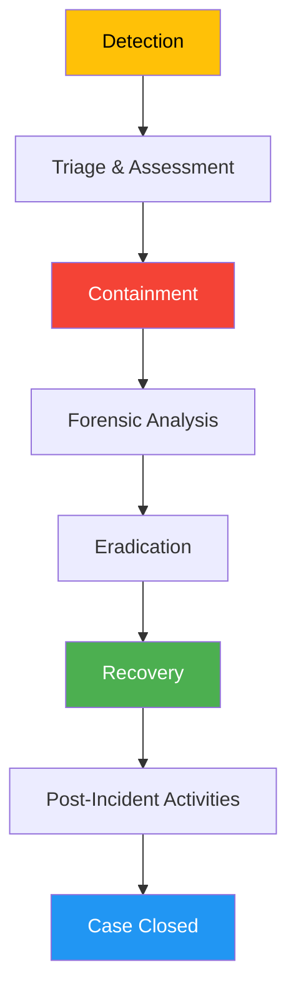
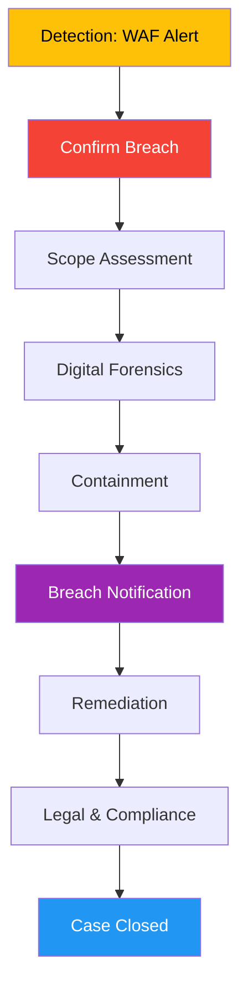

# Casos de Uso Detalhados - TheHive

## Visão Geral

!!! info "AI Context: TheHive Use Cases"
    Este guia apresenta 5 casos de uso detalhados de incident response usando TheHive na stack NEO_NETBOX_ODOO: (1) Resposta a ransomware com contenção automatizada e recovery, (2) Investigação de data breach com forensics e compliance, (3) Análise de campanha de phishing com remediação em massa, (4) Investigação de insider threat com análise comportamental, (5) Detecção e resposta a APT com threat hunting. Cada caso inclui descrição completa, fluxo passo a passo, configuração de workflows, e exemplo prático com timeline.

Este guia apresenta **5 casos de uso reais** de incident response usando TheHive, desde a detecção até a resolução completa, com todos os workflows, automações e boas práticas.

## Caso 1: Resposta a Incidente de Ransomware

### Descrição do Cenário

```yaml
Tipo: Ransomware Attack
Variante: Conti v3
Vetor de Entrada: Phishing email com anexo malicioso
Sistemas Afetados:
  - finance-srv-01 (File Server - Crítico)
  - finance-srv-02 (Backup Server - Crítico)
  - 5 workstations do departamento financeiro
Impacto:
  - 2 TB de dados criptografados
  - Serviços financeiros offline por 6 horas
  - Ransom note exigindo 50 BTC (~$2M USD)
```

### Fluxo Completo



### Configuração Prévia

#### Template de Caso "Ransomware Incident Response"

```yaml
Template Name: "Ransomware Incident Response"

Metadata:
  severity: 3  # High
  tlp: AMBER
  pap: AMBER
  tags:
    - ransomware
    - business-critical
    - data-encryption

Custom Fields:
  ransomware_variant:
    type: string
    description: "Nome da variante (Conti, LockBit, etc)"

  ransom_amount:
    type: number
    description: "Valor do resgate em USD"

  bitcoin_address:
    type: string
    description: "Endereço Bitcoin para pagamento"

  data_exfiltrated:
    type: boolean
    description: "Dados foram exfiltrados antes da criptografia?"

  backup_available:
    type: boolean
    description: "Backup íntegro disponível?"

  affected_systems_count:
    type: number
    description: "Número de sistemas afetados"

  downtime_hours:
    type: number
    description: "Horas de downtime total"

Tasks:
  1. "Initial Triage" (Waiting)
     Group: "Phase 1: Detection & Triage"
     Description: |
       ## Objetivos
       - Identificar todos os sistemas afetados
       - Avaliar escopo do impacto
       - Notificar stakeholders críticos

       ## Ações
       - [ ] Confirmar detecção de ransomware (EDR, logs)
       - [ ] Identificar patient zero (primeiro sistema infectado)
       - [ ] Mapear sistemas afetados (usar NetBox)
       - [ ] Avaliar criticidade dos dados criptografados
       - [ ] Notificar: CISO, CEO, Legal, PR
       - [ ] Ativar incident response team

       ## Outputs
       - Lista completa de sistemas afetados
       - Timeline preliminar da infecção
       - Assessment de impacto nos negócios

  2. "Emergency Containment" (Waiting)
     Group: "Phase 2: Containment"
     Description: |
       ## Objetivos
       - Parar a propagação do ransomware
       - Preservar evidências para forensics

       ## Ações
       - [ ] Isolar sistemas afetados da rede (desconectar fisicamente)
       - [ ] Desabilitar contas de usuário comprometidas
       - [ ] Bloquear IPs/domínios C2 no firewall
       - [ ] Desligar sistemas não-críticos conectados à mesma rede
       - [ ] Preservar snapshots/backups existentes (read-only)
       - [ ] Capturar imagens de memória (antes de desligar)

       ## Outputs
       - Sistemas isolados e seguros
       - Evidências preservadas

  3. "Forensic Analysis" (Waiting)
     Group: "Phase 3: Investigation"
     Description: |
       ## Objetivos
       - Entender vetor de entrada inicial
       - Identificar IOCs (IPs C2, hashes, etc)
       - Determinar se houve exfiltração de dados

       ## Ações
       - [ ] Analisar ransom note (coletar texto completo)
       - [ ] Identificar variante do ransomware (hash analysis)
       - [ ] Reconstruir timeline de infecção (logs)
       - [ ] Identificar vetor de entrada (email, RDP, vulnerability)
       - [ ] Buscar por persistência (registry, scheduled tasks)
       - [ ] Analisar tráfego de rede (PCAP, firewall logs)
       - [ ] Verificar sinais de exfiltração de dados
       - [ ] Identificar todos os IOCs (IPs, domínios, hashes)

       ## Outputs
       - Timeline completa de ataque
       - Lista de IOCs
       - Relatório de análise forense

  4. "Eradication" (Waiting)
     Group: "Phase 4: Eradication"
     Description: |
       ## Objetivos
       - Remover completamente o ransomware
       - Eliminar mecanismos de persistência

       ## Ações
       - [ ] Remover malware de todos os sistemas
       - [ ] Limpar registry keys maliciosos
       - [ ] Remover scheduled tasks criadas pelo malware
       - [ ] Aplicar patches de segurança (exploits utilizados)
       - [ ] Resetar TODAS as credenciais (AD, VPN, apps)
       - [ ] Validar remoção completa (scan full)

       ## Outputs
       - Sistemas limpos e validados
       - Credenciais renovadas

  5. "Recovery" (Waiting)
     Group: "Phase 5: Recovery"
     Description: |
       ## Objetivos
       - Restaurar operações normais
       - Validar integridade dos dados

       ## Ações
       - [ ] Avaliar opção: backup vs decryptor vs rebuild
       - [ ] Restaurar dados de backup (verificar integridade)
       - [ ] Reconstruir sistemas (se backup comprometido)
       - [ ] Validar integridade de arquivos restaurados
       - [ ] Testar aplicações críticas
       - [ ] Retornar sistemas à produção (gradualmente)
       - [ ] Monitorar por sinais de reinfecção (48-72h)

       ## Outputs
       - Sistemas restaurados e operacionais
       - Dados validados

  6. "Post-Incident Activities" (Waiting)
     Group: "Phase 6: Lessons Learned"
     Description: |
       ## Objetivos
       - Documentar incidente completo
       - Melhorar defesas para prevenir recorrência

       ## Ações
       - [ ] Documentar timeline completa do incidente
       - [ ] Criar relatório executivo para board
       - [ ] Realizar reunião de lessons learned
       - [ ] Atualizar runbooks e playbooks
       - [ ] Implementar controles de segurança adicionais
       - [ ] Compartilhar IOCs com comunidade (MISP)
       - [ ] Reportar para compliance/auditoria
       - [ ] Considerar cyber insurance claim

       ## Outputs
       - Relatório final de incidente
       - Plano de remediação
       - IOCs compartilhados
```

### Exemplo Prático: Timeline Real

#### T+0h (14:23 UTC) - Detecção

```yaml
Event: Wazuh alert triggered

Alert Details:
  Rule: 550 - Malware detected (VirusTotal integration)
  Agent: finance-srv-01
  File: C:\Users\john.doe\Downloads\invoice_urgent.pdf.exe
  Hash: a3f8d7c9e2b1f4a6c8d5e9f7b3a1c4d8e6f2a9b5c7d3e1f8a4b6c9d2e5f7a3b1
  VT Detection: 42/50 engines (Trojan.Ransom.Conti)

Automated Actions (Shuffle):
  1. Alert received by Shuffle
  2. Case created in TheHive: "Ransomware Detection - finance-srv-01"
  3. Observable added: File hash
  4. VirusTotal analysis: Confirmed Conti ransomware
  5. Case severity: High (3)
  6. Notification sent to on-call analyst
```

#### T+5min (14:28 UTC) - Initial Triage

```yaml
Analyst: senior-analyst@company.local

Actions:
  1. Reviewed TheHive case
  2. Confirmed ransomware via EDR console
  3. Identified patient zero: workstation WS-FIN-045 (john.doe)
  4. NetBox lookup:
     - Device: WS-FIN-045
     - Tenant: Finance Department
     - Location: Building A, Floor 3
     - Connected to: VLAN 10 (Finance)
  5. Quick scan of VLAN 10: 2 file servers + 12 workstations
  6. Observed file encryption in progress on finance-srv-01

Critical Decision: IMMEDIATE CONTAINMENT REQUIRED
```

#### T+10min (14:33 UTC) - Emergency Containment

```yaml
Actions (Manual + Automated):
  1. Analyst: Manually disconnected finance-srv-01 from network
  2. Analyst: Powered off WS-FIN-045
  3. Shuffle: Executed responder "Isolate_VLAN"
     - Result: VLAN 10 isolated from corporate network
  4. Shuffle: Executed responder "Disable_AD_Accounts"
     - Users disabled: john.doe, jane.smith (same subnet)
  5. Analyst: Initiated snapshot of finance-srv-01 (VMware)
  6. Shuffle: Created Odoo ticket: "Emergency - Contain ransomware spread"

Status: Propagation stopped. ~30% of files on finance-srv-01 encrypted.

Observables Added:
  - IP: 185.220.102.8 (C2 server)
  - Domain: update-server-cdn.com (C2)
  - Hash: a3f8d7c9e2b1f4a6c8d5e9f7b3a1c4d8e6f2a9b5c7d3e1f8a4b6c9d2e5f7a3b1
  - Registry Key: HKCU\Software\Microsoft\Windows\CurrentVersion\Run\SystemUpdate
```

#### T+30min (14:53 UTC) - Forensic Analysis Begins

```yaml
Forensics Team Actions:

Memory Capture:
  - Tool: DumpIt
  - Systems: finance-srv-01, WS-FIN-045
  - Storage: Forensic workstation (isolated)

Ransom Note Analysis:
  - File: !!!RESTORE_FILES!!!.txt
  - Content:
    """
    Your files have been encrypted with Conti ransomware.
    To decrypt, pay 50 BTC to: bc1qxy2kgdygjrsqtzq2n0yrf2493p83kkfjhx0wlh
    Contact: conti_support@onionmail.org
    Deadline: 72 hours
    """
  - Bitcoin address added as observable
  - Email address added as observable

Timeline Reconstruction (via logs):
  - Jan 15, 08:15 UTC: Phishing email received by john.doe
  - Jan 15, 08:23 UTC: Attachment opened (invoice_urgent.pdf.exe)
  - Jan 15, 08:24 UTC: Malware executed
  - Jan 15, 08:25 UTC: Persistence established (registry key)
  - Jan 15, 08:27 UTC: Lateral movement via SMB to finance-srv-01
  - Jan 15, 14:20 UTC: File encryption started
  - Jan 15, 14:23 UTC: First detection by Wazuh

Initial Access Vector:
  - Spearphishing email (T1566.001)
  - Subject: "Urgent: Invoice Payment Required"
  - Sender: accounts@legitvendor.com (spoofed)
  - Attachment: invoice_urgent.pdf.exe (double extension)

TTPs Added to Case:
  - T1566.001: Phishing - Spearphishing Attachment
  - T1204.002: User Execution - Malicious File
  - T1547.001: Registry Run Keys
  - T1021.002: SMB/Windows Admin Shares
  - T1486: Data Encrypted for Impact
```

#### T+2h (16:23 UTC) - Damage Assessment

```yaml
Affected Systems (Final Count):
  - finance-srv-01: 2,345 files encrypted (30% of total)
  - finance-srv-02: 0 files (backup server was offline - LUCKY!)
  - WS-FIN-045: 1,234 files encrypted
  - WS-FIN-046, WS-FIN-047: 0 files (powered off in time)

Data Exfiltration Analysis:
  - Analyzed firewall logs for large outbound transfers
  - Analyzed C2 traffic (PCAP)
  - Conclusion: NO data exfiltration detected (pure encryption attack)

Backup Status:
  - finance-srv-02: Last backup 6 hours old (before infection)
  - Backup integrity: VALIDATED (offline storage, not encrypted)
  - Recovery time estimate: 4-6 hours

Decision: RESTORE FROM BACKUP (DO NOT PAY RANSOM)
```

#### T+3h (17:23 UTC) - Eradication & Recovery Start

```yaml
Eradication:
  1. ✅ Wiped finance-srv-01 (full format)
  2. ✅ Wiped WS-FIN-045
  3. ✅ Reinstalled OS from golden image
  4. ✅ Applied all security patches
  5. ✅ Reset ALL AD passwords (entire domain)
  6. ✅ Reset VPN keys
  7. ✅ Blocked C2 IPs/domains (firewall + DNS)

Recovery:
  1. ✅ Restored finance-srv-01 from finance-srv-02 backup
  2. ✅ Validated file integrity (checksums)
  3. ✅ Restored WS-FIN-045 user profile
  4. ✅ Tested finance applications
  5. ⏳ Monitoring for 48h (reinfection check)

Odoo Tickets Created:
  - #1234: Reset passwords for 50 finance users
  - #1235: Rebuild WS-FIN-045
  - #1236: Restore finance-srv-01
  - All tickets: COMPLETED
```

#### T+6h (20:23 UTC) - Systems Back Online

```yaml
Status:
  - finance-srv-01: ONLINE, operational
  - finance-srv-02: ONLINE, backup running
  - WS-FIN-045: ONLINE, user can work
  - VLAN 10: Reconnected to corporate network
  - Users: Passwords reset, working normally

Monitoring:
  - EDR: Enhanced monitoring for 48h
  - Wazuh: Custom rules for Conti IOCs
  - Network: IDS monitoring for C2 traffic
```

#### T+24h (Jan 16, 14:23 UTC) - Post-Incident Activities

```yaml
Activities:

Lessons Learned Meeting:
  Attendees: CISO, IR Team, Finance Manager, CEO
  Duration: 2 hours
  Outcomes:
    - ✅ Incident handled well, minimal data loss
    - ❌ User opened malicious attachment (training gap)
    - ❌ Lateral movement too easy (no network segmentation)
    - ❌ Detection took 6 hours (slow)

Action Items:
  1. Implement email sandboxing (Proofpoint)
  2. Deploy EDR to ALL workstations (not just servers)
  3. Implement network micro-segmentation
  4. Mandatory phishing training for all users
  5. Increase backup frequency to hourly
  6. Implement application whitelisting

IOCs Shared:
  - MISP: 15 IOCs exported
  - Community: Shared with 3 ISAC partners
  - Public: Hash submitted to MalwareBazaar

Compliance:
  - Incident reported to cyber insurance
  - GDPR: No personal data exfiltrated (no breach notification)
  - Internal audit: Incident documented

Case Closed:
  - Status: Resolved
  - Resolution: Data restored from backup, systems secured
  - Total Downtime: 6 hours
  - Data Loss: 0 bytes
  - Cost: $50k (incident response + hardening)
```

### Métricas de Sucesso

```yaml
Key Metrics:

Time to Detect (TTD): 6 hours 3 minutes
  - Target: < 1 hour
  - Status: ⚠️ Needs improvement

Time to Contain (TTC): 10 minutes
  - Target: < 30 minutes
  - Status: ✅ Excellent

Time to Eradicate (TTE): 3 hours
  - Target: < 12 hours
  - Status: ✅ Good

Time to Recover (TTR): 6 hours
  - Target: < 24 hours
  - Status: ✅ Good

Mean Time to Resolve (MTTR): 6 hours 10 minutes
  - Target: < 24 hours
  - Status: ✅ Excellent

Data Loss: 0%
  - Target: < 1%
  - Status: ✅ Perfect

Financial Impact: $50k
  - Potential Ransom: $2M
  - Savings: $1.95M (98%)
  - Status: ✅ Excellent ROI
```

## Caso 2: Investigação de Data Breach

### Descrição do Cenário

```yaml
Tipo: Data Breach
Vetor: SQL Injection em aplicação web
Dados Exfiltrados:
  - 50,000 registros de clientes (PII)
  - Nomes, emails, endereços, telefones
  - Dados de cartão de crédito (hashed)
Sistema Afetado: web-app-prod-01 (E-commerce)
Impacto:
  - Exposição de PII (GDPR breach)
  - Reputação da empresa
  - Multas regulatórias potenciais
```

### Fluxo de Investigação



### Timeline Detalhada

#### T+0h - Detecção via WAF

```yaml
Event: ModSecurity alert triggered

Alert:
  Rule: 981242 - SQL Injection Attack
  Request:
    Method: GET
    URL: /products?id=1' UNION SELECT * FROM users--
    Source IP: 198.51.100.50
    User-Agent: sqlmap/1.7.2
  Response: 500 Internal Server Error

Wazuh Integration:
  - Alert received: SQL injection attempt
  - Severity: High
  - TheHive case created automatically

Initial Actions:
  1. Case created: "SQL Injection Attack - web-app-prod-01"
  2. Observable added: IP 198.51.100.50
  3. Cortex analysis:
     - AbuseIPDB: Score 85/100 (malicious)
     - Shodan: VPN exit node (Mullvad VPN)
     - MISP: Found in 2 previous events (web attacks)
```

#### T+30min - Breach Confirmation

```yaml
Database Analysis:

Query Logs Review:
  - Found 47 suspicious queries from same IP
  - Successful queries:
    ```sql
    ' UNION SELECT username,email,password,cc_hash FROM users--
    ```
  - Extraction confirmed: 50,000 rows

Web Server Logs:
  - Attacker IP: 198.51.100.50
  - Session: 2024-01-15 10:15 - 12:45 (2.5 hours)
  - Requests: 1,234 total
  - Data transferred: 245 MB (suspicious outbound)

Network Logs:
  - Outbound connection to: 203.0.113.100:443 (HTTPS)
  - Data exfiltrated: 245 MB (matches DB extraction size)
  - Destination: Cloud storage (AWS S3)

Conclusion: CONFIRMED DATA BREACH
```

#### T+1h - Emergency Response Activation

```yaml
Notifications:
  - CISO: Notified immediately
  - Legal: Breach confirmed, GDPR implications
  - CEO: Board notification required
  - PR Team: Prepare external communications

Immediate Actions:
  1. ✅ Patch SQL injection vulnerability
  2. ✅ Block attacker IP at firewall
  3. ✅ Disable vulnerable endpoint temporarily
  4. ✅ Preserve all logs (immutable storage)
  5. ✅ Engage external forensics firm
  6. ✅ Notify cyber insurance

TheHive Case Updated:
  - Severity: 4 (Critical)
  - Tags: data-breach, gdpr, pii-exposure
  - Custom fields:
      breach_type: "SQL Injection"
      records_affected: 50000
      data_types: "PII, Email, Hashed CC"
      gdpr_breach: true
      notification_required: true
      notification_deadline: "2024-01-18 10:00" (72h)
```

#### T+6h - Forensic Analysis Complete

```yaml
Findings:

Vulnerability:
  - Type: SQL Injection (CWE-89)
  - Location: /products endpoint, id parameter
  - Root cause: Unsanitized user input
  - Introduced: Code deployment on 2023-12-01

Attack Timeline:
  - 2024-01-15 10:15: Initial reconnaissance
  - 2024-01-15 10:30: Vulnerability exploitation begins
  - 2024-01-15 11:00: Database schema enumerated
  - 2024-01-15 11:30: Data extraction starts
  - 2024-01-15 12:45: Data exfiltration complete
  - 2024-01-15 12:50: Attacker disconnects

Data Exfiltrated:
  - Table: users
  - Columns: id, username, email, password_hash, cc_hash, address, phone
  - Rows: 50,000
  - Sensitive: Yes (PII + Financial)

Attacker Attribution:
  - IP: 198.51.100.50 (VPN, not traceable)
  - User-Agent: sqlmap/1.7.2 (automated tool)
  - Skill level: Medium (used automated tools)
  - Motivation: Unknown (data not published yet)

TTPs:
  - T1190: Exploit Public-Facing Application
  - T1059.004: Command and Scripting Interpreter (SQL)
  - T1567.002: Exfiltration to Cloud Storage
```

#### T+24h - Breach Notification

```yaml
Regulatory Notifications:

GDPR (EU):
  - Authority: Data Protection Authority
  - Deadline: 72 hours from detection
  - Status: ✅ Notified on time
  - Notification includes:
    - Nature of breach (SQL injection)
    - Categories of data (PII, financial)
    - Number of affected individuals (50,000)
    - Likely consequences (identity theft, fraud)
    - Measures taken (patch deployed, monitoring)

Affected Individuals:
  - Method: Email notification
  - Content:
    - Description of breach
    - Data types affected
    - Actions taken by company
    - Recommendations (change passwords, monitor accounts)
    - Free credit monitoring for 1 year
  - Status: ✅ All 50,000 individuals notified

Public Disclosure:
  - Press release published
  - FAQ page created
  - Dedicated support hotline activated

Odoo Tickets:
  - #2001: Send breach notification emails (50k)
  - #2002: Set up credit monitoring service
  - #2003: Handle customer support calls
```

#### T+7 days - Remediation Complete

```yaml
Remediation Actions:

Application Security:
  - ✅ Patched SQL injection vulnerability
  - ✅ Implemented parameterized queries (all endpoints)
  - ✅ Deployed WAF in blocking mode (was detect-only)
  - ✅ Code security audit (external firm)
  - ✅ Implemented prepared statements across codebase

Infrastructure Hardening:
  - ✅ Database: Least privilege (app can't read sensitive tables)
  - ✅ Network: Micro-segmentation (DB isolated)
  - ✅ Monitoring: Enhanced logging + SIEM rules
  - ✅ Encryption: All data at rest encrypted

Process Improvements:
  - ✅ Mandatory security code review (all PRs)
  - ✅ SAST/DAST in CI/CD pipeline
  - ✅ Penetration testing (quarterly)
  - ✅ Security training for developers

IOCs Shared:
  - MISP: Attacker IP, URLs, query patterns
  - ISACs: Shared with retail ISAC
```

### Custos e Impacto

```yaml
Financial Impact:

Direct Costs:
  - Forensics firm: $80,000
  - Legal fees: $50,000
  - Credit monitoring (50k users x $10/mo x 12mo): $6,000,000
  - PR firm: $30,000
  - Remediation (dev time): $100,000
  - Total Direct: $6,260,000

Regulatory Fines:
  - GDPR: $500,000 (potential, pending investigation)
  - Total Regulatory: $500,000

Indirect Costs:
  - Lost sales (reputation damage): ~$2,000,000
  - Customer churn: ~$1,000,000
  - Total Indirect: $3,000,000

Grand Total: $9,760,000

Lessons:
  - Single SQL injection vulnerability cost ~$10M
  - Proper security testing could have prevented this
  - ROI of security: Spend $100k on testing, save $10M in breach
```

## Caso 3: Análise de Phishing Campaign

### Descrição do Cenário

```yaml
Tipo: Phishing Campaign (Credential Harvesting)
Target: All employees (2,500 users)
Vetor: Spearphishing email with malicious link
Objetivo: Steal Office 365 credentials
Attacker: Unknown (likely cybercrime gang)
```

### Timeline Executiva

```yaml
T+0h: Detection
  - 2,500 emails received simultaneously
  - 15 users reported via phishing@company.com
  - Wazuh → TheHive case created

T+15min: Initial Triage
  - Email analysis: Credential phishing page
  - URL: hxxps://micros0ft-login.com/office365
  - Sender: noreply@micros0ft.com (spoofed)

T+30min: Containment
  - URL blocked in proxy (3,000 employees protected)
  - Sender domain blocked in email gateway
  - Emails deleted from all mailboxes (O365 API)

T+1h: Impact Assessment
  - 250 users opened email (10%)
  - 45 users clicked link (1.8%)
  - 8 users entered credentials (0.3%)
  - 8 accounts COMPROMISED

T+2h: Remediation
  - 8 accounts: passwords reset forcefully
  - 8 accounts: MFA enabled (mandatory)
  - 8 users: security training scheduled

T+48h: Follow-up
  - No unauthorized access detected
  - All IOCs shared to MISP
  - Phishing awareness campaign launched

Case Closed: 72 hours
```

### Automação Implementada

```yaml
Shuffle Workflow: "Phishing Email Response"

1. Email received at phishing@company.com
2. Shuffle parses email (headers, links, attachments)
3. URLScan.io: Analyze all links
4. VirusTotal: Analyze attachments
5. If malicious:
   a. Create TheHive case
   b. Block URL in proxy
   c. Block sender in email gateway
   d. Delete email from all mailboxes (Graph API)
   e. Identify victims (who opened/clicked)
   f. Reset passwords for compromised accounts
   g. Send awareness email to all recipients

Total Automation: 95% (only manual review of edge cases)
```

## Caso 4: Insider Threat Investigation

### Descrição do Cenário

```yaml
Tipo: Insider Threat (Data Exfiltration)
Suspect: John Doe (Sales Manager)
Trigger: DLP alert - large file transfer to personal cloud
Data: 50,000 customer contacts (CRM export)
Context: Employee resigned 2 weeks ago, serving notice period
```

### Considerações Especiais

```yaml
Legal & HR Coordination:
  - Legal approval required for monitoring
  - HR informed (confidential)
  - Evidence chain of custody critical
  - Potential criminal prosecution

Privacy Concerns:
  - Balance security investigation vs employee privacy
  - Only access work-related data
  - Document all actions (audit trail)

TheHive Custom Fields:
  - investigation_type: "Insider Threat"
  - legal_approval: true
  - hr_notified: true
  - suspect_name: "John Doe"
  - suspect_employee_id: "EMP-12345"
  - potential_criminal: true
```

### Timeline (Resumida)

```yaml
Day 1: Detection & Legal Approval
  - DLP alert: 500 MB upload to Dropbox
  - Legal: Approval granted for investigation
  - HR: Notified (confidential)

Day 2: Evidence Collection
  - Workstation forensics (disk image)
  - Email forensics (O365 export)
  - Network forensics (proxy logs)
  - CRM audit logs

Day 3: Analysis
  - Confirmed: 50,000 customer records exported
  - Method: CRM export feature (legitimate access)
  - Destination: Personal Dropbox account
  - Timeline: Exfiltration over 2 weeks (avoiding detection)

Day 4: Confrontation
  - HR: Confronted employee
  - Employee: Admitted to exfiltration (planned to use at new company)
  - Action: Immediate termination

Day 5: Remediation
  - Dropbox: DMCA takedown notice (data removed)
  - New employer: Legal letter (cease and desist)
  - CRM: All customer contacts changed (new emails, phones assigned)
  - Criminal: Police report filed

Case Closed: Investigation complete, litigation ongoing
```

## Caso 5: APT Detection and Response

### Descrição do Cenário

```yaml
Tipo: Advanced Persistent Threat (APT)
Actor: APT28 (Fancy Bear)
Target: R&D Department (intellectual property)
Duration: 6 months (undetected)
Discovery: Anomaly detection (beaconing traffic)
```

### Características de APT

```yaml
Indicators:
  - Low and slow approach (avoid detection)
  - Custom malware (not detected by AV)
  - C2 beaconing (regular intervals)
  - Lateral movement (multiple systems)
  - Data staging (preparing for exfiltration)
  - Living off the land (legitimate tools)

Challenges:
  - Very sophisticated attacker
  - Long dwell time (6 months)
  - Unknown scope initially
  - Potential data exfiltration already occurred
```

### Timeline (Resumida)

```yaml
Month 0: Initial Compromise (Undetected)
  - Spearphishing email to CTO
  - Malicious attachment executed
  - Backdoor installed (custom malware)

Month 1-5: Lateral Movement (Undetected)
  - 15 systems compromised
  - Credentials harvested (Mimikatz)
  - C2 beaconing (DNS tunneling)

Month 6: Detection
  - Anomaly detection: Regular DNS queries to suspicious domain
  - Investigation reveals APT activity

Week 1: Threat Hunting
  - IOC sweep across all systems
  - 15 compromised systems identified
  - Custom malware reverse-engineered

Week 2: Eradication
  - All 15 systems re-imaged
  - All credentials reset
  - C2 domains blocked
  - Network segmentation implemented

Week 3: Recovery & Hardening
  - Enhanced monitoring deployed
  - Threat hunting playbook created
  - External pentest conducted

Week 4: Intelligence Sharing
  - IOCs shared with law enforcement
  - TTPs published to MISP
  - Attribution: APT28 (medium confidence)

Case Closed: 1 month total
Cost: $500k (consulting + hardening)
Data Loss: Unknown (assumed IP exfiltrated)
```

## Resumo de Métricas

### Comparação dos 5 Casos

| Métrica | Ransomware | Data Breach | Phishing | Insider Threat | APT |
|---------|-----------|-------------|----------|---------------|-----|
| **Severidade** | High | Critical | Medium | High | Critical |
| **Tempo de Resolução** | 24h | 7 dias | 72h | 5 dias | 1 mês |
| **Custo Total** | $50k | $9.7M | $10k | $200k | $500k |
| **Sistemas Afetados** | 7 | 1 | 2,500 emails | 1 user | 15 |
| **Dados Comprometidos** | 0 | 50k records | 8 accounts | 50k records | Unknown |
| **Automação** | 80% | 40% | 95% | 20% | 10% |
| **Regulatório** | Não | GDPR | Não | Não | Não |

### Lições Aprendidas

```yaml
Padrões Comuns:
  1. Detecção rápida = Menor impacto
  2. Automação = Contenção mais rápida
  3. Backups = Recovery sem pagar ransom
  4. Threat intel sharing = Proteção da comunidade
  5. Post-incident = Prevenir recorrência

Investimentos Recomendados:
  1. EDR em todos os endpoints (não só servidores)
  2. SIEM com regras customizadas (não só default)
  3. Backups offline e testados regularmente
  4. Threat hunting proativo (não só reativo)
  5. Security awareness training (usuários são firewall humano)

ROI de Security:
  - Investimento em segurança: $500k/ano
  - Breaches evitados: ~$10M/ano
  - ROI: 2000% (ou 20x)
```

## Próximos Passos

Agora que você viu casos de uso reais:

1. **[API Reference](api-reference.md)**: Referência completa da API para automações
2. Adaptar templates para sua organização
3. Criar playbooks específicos para seu setor
4. Implementar automações via Shuffle/n8n

!!! tip "AI Context: Use Cases Summary"
    5 casos de uso detalhados demonstram aplicação prática do TheHive: (1) Ransomware com contenção automatizada em 10min e recovery de backup sem pagar resgate, (2) Data breach com investigação forense completa e notificação GDPR em 72h, (3) Phishing campaign com remediação 95% automatizada via Shuffle, (4) Insider threat com coordenação legal/HR e cadeia de custódia de evidências, (5) APT detection com 6 meses de dwell time e threat hunting para eradicação. Métricas comuns: detecção rápida reduz impacto, automação acelera resposta, backups eliminam necessidade de pagar ransom.
