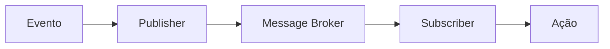
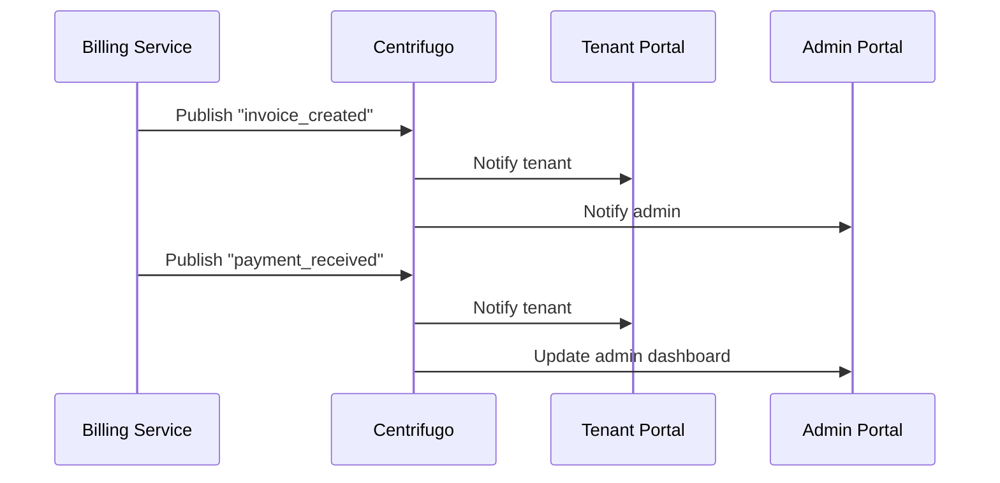
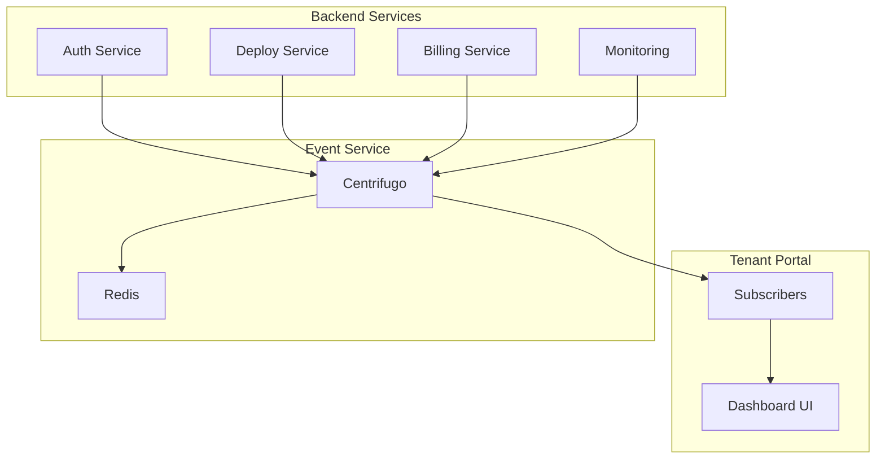

# 🎓 GUIA EDUCACIONAL - CENTRIFUGO
**NEO_STACK Platform v3.0 - Event-Driven Real-time Architecture**

---

## 📋 ÍNDICE

1. [Introdução](#introdução)
2. [O que é Centrifugo?](#o-que-é-centrifugo)
3. [Por que usar WebSockets?](#por-que-usar-websockets)
4. [Arquitetura Event-Driven](#arquitetura-event-driven)
5. [Conceitos Fundamentais](#conceitos-fundamentais)
6. [Pub/Sub Explained](#pubsub-explained)
7. [Multi-tenant Events](#multi-tenant-events)
8. [Casos de Uso Reais](#casos-de-uso-reais)
9. [Implementação no NEO_STACK](#implementação-no-neo-stack)
10. [Exemplos Práticos](#exemplos-práticos)
11. [Boas Práticas](#boas-práticas)
12. [Troubleshooting](#troubleshooting)

---

## 🎯 INTRODUÇÃO

Bem-vindo ao **Guia Educacional do Centrifugo** para o **NEO_STACK Platform v3.0**!

Este guia foi criado para desenvolvedores iniciantes que querem entender **por que e como** implementar um sistema de eventos em tempo real em uma plataforma SaaS moderna.

### Objetivos deste Guia
- ✅ Entender o **conceito** de event-driven architecture
- ✅ Aprender **Pub/Sub** de forma prática
- ✅ Compreender **WebSockets** e real-time
- ✅ Implementar **multi-tenant events**
- ✅ Aplicar em casos **reais de negócio**

### Pré-requisitos
- Conhecimento básico de JavaScript/TypeScript
- Familiaridade com APIs REST
- Conceitos básicos de Docker
- **Curiosidade** para aprender! 🚀

---

## 🤔 O QUE É CENTRIFUGO?

### Definição Simples
**Centrifugo** é um servidor de **mensagens em tempo real** que permite que aplicações web enviem e recebam **atualizações instantâneas** sem precisar recarregar a página.

### Analogia do Mundo Real
Imagine que você está em um **estádio de futebol**:
- ⚽ **Jogo** = Aplicação (eventos acontecendo)
- 📢 **Sistema de som** = Centrifugo (divulgando os lances)
- 👥 **Torcedores** = Usuários (recebendo as informações)
- 📻 **Rádio** = Navegador (meio de comunicação)

Quando um gol acontece:
1. ✅ O juiz detecta o evento
2. 📢 O sistema de som **publica** a informação
3. 👥 Todos os torcedores **recebem** instantaneamente
4. ⚽ A partida continua

**O mesmo acontece no Centrifugo!**

### Características Principais

| Característica | Descrição | Benefício |
|----------------|-----------|-----------|
| **Real-time** | Mensagens em < 50ms | UX instantânea |
| **Scalable** | 10k+ conexões simultâneas | Suporta muitos usuários |
| **Multi-tenant** | Isolamento por cliente | Segurança e privacidade |
| **WebSockets** | Conexão persistente | Eficiente e rápida |
| **Redis-backed** | Persistência confiável | Não perde mensagens |

---

## 🌐 POR QUE USAR WEBSOCKETS?

### O Problema: Polling
**Antes** (método antigo):
```typescript
// ❌ Polling a cada 5 segundos
setInterval(async () => {
  const response = await fetch('/api/notifications')
  const notifications = await response.json()
  updateUI(notifications)
}, 5000)
```

**Problemas do Polling**:
- ❌ Desperdício de banda (requests desnecessárias)
- ❌ Latência alta (até 5 segundos de delay)
- ❌ Servidor sobrecarregado (muitas requests)
- ❌ Bateria do celular esvazia (mobile)

### A Solução: WebSockets
**Agora** (método moderno):
```typescript
// ✅ Conexão persistente
const ws = new WebSocket('wss://events.neo-stack.com')

ws.onmessage = (event) => {
  const notification = JSON.parse(event.data)
  showNotification(notification)
}
```

**Vantagens do WebSockets**:
- ✅ **Latência zero** (mensagens instantâneas)
- ✅ **Eficiente** (uma conexão, muitas mensagens)
- ✅ **Bidirecional** (cliente e servidor enviam)
- ✅ **Economia de bateria** (mobile-friendly)

### Comparação Prática

| Aspecto | Polling | WebSockets |
|---------|---------|------------|
| **Latência** | 1-30s | < 50ms |
| **Requests/Hora** | 720 | 1 (conexão) |
| **Banda** | Alta | Baixa |
| **Bateria** | Muita | Pouca |
| **Complexidade** | Simples | Moderada |

---

## 🏗️ ARQUITETURA EVENT-DRIVEN

### O que é Event-Driven?

**Event-Driven Architecture** (EDA) é um padrão onde o sistema reage a **eventos** em vez de fazer **requests síncronas**.

### Exemplo do Mundo Real: **Restaurante**

**Modelo Tradicional** (Request-Response):
1. 👤 Cliente faz pedido
2. 👨‍🍳 Cozinha recebe
3. ⏳ Cliente espera
4. 👨‍🍳 Cozinha prepara
5. 👤 Cliente recebe

**Modelo Event-Driven** (Assíncrono):
1. 👤 Cliente faz pedido (evento: `order_created`)
2. 👨‍🍳 Cozinha recebe notificação (subscribe)
3. 👨‍🍳 Prepara (evento: `cooking_started`)
4. 👤 Cliente recebe notificação (real-time!)
5. 👨‍🍳 Finaliza (evento: `order_ready`)
6. 👤 Cliente recebe notificação (real-time!)

### Componentes do EDA



1. **Evento**: Algo que aconteceu (ex: usuário logou)
2. **Publisher**: Quem cria o evento (ex: Auth Service)
3. **Message Broker**: Centrifugo (distribui a mensagem)
4. **Subscriber**: Quem recebe (ex: Dashboard)
5. **Ação**: O que fazer com a informação (ex: atualizar UI)

---

## 🧠 CONCEITOS FUNDAMENTAIS

### 1. **Canal (Channel)**
É como uma **estação de rádio** - todo mundo sintoniza na mesma frequência.

```typescript
// Canais do NEO_STACK
"tenant:12345:dashboard"      // Dashboard do tenant 12345
"admin:platform:alerts"       // Alertas da plataforma
"tenant:67890:deployments"    // Deploys do tenant 67890
"system:health"               // Saúde do sistema
```

### 2. **Publicação (Publish)**
Enviar uma mensagem para um canal.

```typescript
// Exemplo: Publicar evento de deploy
publisher.publish("tenant:12345:deployments", {
  type: "deployment_update",
  status: "completed",
  message: "Deploy finalizado com sucesso!"
})
```

### 3. **Inscrição (Subscribe)**
Receber mensagens de um canal.

```typescript
// Exemplo: Inscrever no dashboard
const unsubscribe = subscribe("tenant:12345:dashboard", (event) => {
  console.log("Evento recebido:", event)
  updateDashboard(event.data)
})
```

### 4. **Conexão (Connection)**
Link entre o navegador e o servidor WebSocket.

```typescript
// Estabelecer conexão
const ws = new WebSocket("wss://events.neo-stack.com")

ws.onopen = () => {
  console.log("Conectado ao Centrifugo!")
}

ws.onmessage = (event) => {
  const data = JSON.parse(event.data)
  handleEvent(data)
}
```

---

## 📡 PUBSUB EXPLAINED

### O que é Pub/Sub?

**Pub/Sub** = **Publish/Subscribe** (Publicar/Inscrever)

É um padrão de comunicação onde:
- **Publishers** enviam mensagens
- **Subscribers** recebem mensagens
- **Não se conhecem** diretamente
- **Desacoplados** (independentes)

### Analogia: **Jornal**

1. **Jornalista** (Publisher) escreve artigo
2. **Jornal** (Broker) distribui
3. **Assinantes** (Subscribers) recebem em casa
4. **Cada assinante** pode escolher quais seções ler

### Exemplo Prático: Notificações

```typescript
// 1. Auth Service PUBLICA evento
const authPublisher = new AuthPublisher()
authPublisher.publish("tenant:12345:user_login", {
  userId: "user_789",
  timestamp: "2025-12-06T10:30:00Z",
  ip: "192.168.1.100"
})

// 2. Admin Dashboard SUBSCREVE
subscribe("tenant:*:user_login", (event) => {
  if (event.userId === "user_789") {
    showNotification(`Usuário logou: ${event.userId}`)
  }
})

// 3. Tenant Portal SUBSCREVE
subscribe("tenant:12345:user_login", (event) => {
  updateActiveUsers(event.timestamp)
})
```

### Vantagens do Pub/Sub

| Vantagem | Descrição | Exemplo |
|----------|-----------|---------|
| **Desacoplamento** | Publishers não knowem subscribers | Auth service não sabe quem quer login events |
| **Escalabilidade** | Um evento, muitos receivers | 1 deploy event → 100 usuários notified |
| **Flexibilidade** | Adicionar subscribers sem mudar publishers | Novo dashboard? Só subscrever! |
| **Confiabilidade** | Redis garante entrega | Mensagens não se perdem |

---

## 🏢 MULTI-TENANT EVENTS

### O Desafio

Em uma plataforma SaaS **multi-tenant**, cada cliente precisa:
- ✅ Ver apenas **seus próprios eventos**
- ✅ Estar **isolado** de outros tenants
- ✅ Ter **permissões** adequadas
- ✅ **Não vazar** informações

### Solução: Tenant Isolation

```typescript
// Canal formato: tenant:{tenant_id}:{resource}

"tenant:12345:dashboard"      // ✅ Tenant 12345
"tenant:12345:billing"        // ✅ Tenant 12345
"tenant:67890:dashboard"      // ✅ Tenant 67890
"admin:platform:events"       // ✅ Admin (todos os tenants)

// ❌ CANAL INVÁLIDO
"dashboard"                   // ❌ Sem tenant ID
"tenant:12345:other_tenant"   // ❌ Cross-tenant
```

### Autenticação e Autorização

```typescript
// 1. Token JWT com tenant info
const token = jwt.sign({
  userId: "user_789",
  tenantId: "12345",
  role: "tenant_admin"
}, SECRET)

// 2. Centrifugo valida token
const validateToken = (token) => {
  const decoded = jwt.verify(token, SECRET)
  return {
    userId: decoded.userId,
    tenantId: decoded.tenantId,
    role: decoded.role
  }
}

// 3. RBAC - Role-based access control
const canSubscribe = (channel, user) => {
  // Admin pode tudo
  if (user.role === "admin") return true

  // Usuário só acessa canais do seu tenant
  return channel.startsWith(`tenant:${user.tenantId}:`)
}
```

### Exemplo: Tenant Isolation

```typescript
// Tenant A (12345) se inscreve
subscribe("tenant:12345:notifications", (event) => {
  // ✅ Recebe apenas eventos do Tenant A
  showNotification(event.message)
})

// Tenant B (67890) se inscreve
subscribe("tenant:67890:notifications", (event) => {
  // ✅ Recebe apenas eventos do Tenant B
  showNotification(event.message)
})

// Publicar para Tenant A
publish("tenant:12345:notifications", {
  type: "invoice_paid",
  message: "Fatura paga com sucesso!"
})

// ✅ Tenant B NÃO recebe evento do Tenant A
```

---

## 💼 CASOS DE USO REAIS

### 1. **Dashboard em Tempo Real**

**Cenário**: Tenant quer ver métricas atualizadas instantaneamente.

**Implementação**:
```typescript
// Publisher: Monitoring Service
monitoringPublisher.publish("tenant:12345:metrics", {
  cpu: 45.2,
  memory: 67.8,
  storage: 23.1,
  timestamp: "2025-12-06T10:30:00Z"
})

// Subscriber: Dashboard
subscribe("tenant:12345:metrics", (event) => {
  updateMetricsChart(event.data)
})
```

**Benefício**: Usuário vê dados **sempre atualizados** sem recarregar.

---

### 2. **Notificações de Billing**

**Cenário**: Fatura criada, pagamentos, alertas de limite.

**Fluxo**:


**Implementação**:
```typescript
// Billing Service
const billing = new BillingPublisher()

// Criar fatura
billing.publish("tenant:12345:billing", {
  type: "invoice_created",
  invoiceId: "INV-2025-001",
  amount: 299.90,
  dueDate: "2025-12-20"
})

// Pagamento recebido
billing.publish("tenant:12345:billing", {
  type: "payment_received",
  invoiceId: "INV-2025-001",
  amount: 299.90,
  status: "paid"
})
```

---

### 3. **Deploy Status em Tempo Real**

**Cenário**: Deploy de instância do tenant, status em tempo real.

**Implementação**:
```typescript
// Stack Deployer
const deployer = new DeployPublisher()

// Iniciar deploy
deployer.publish("tenant:12345:deployments", {
  type: "deployment_started",
  instanceId: "odoo-tenant-12345",
  message: "Iniciando deploy da instância Odoo..."
})

// Progresso
deployer.publish("tenant:12345:deployments", {
  type: "deployment_progress",
  instanceId: "odoo-tenant-12345",
  progress: 45,
  message: "Baixando imagens Docker..."
})

// Concluído
deployer.publish("tenant:12345:deployments", {
  type: "deployment_completed",
  instanceId: "odoo-tenant-12345",
  url: "https://odoo-12345.neo-stack.com",
  message: "Deploy finalizado com sucesso!"
})
```

---

### 4. **Alertas de Monitoramento**

**Cenário**: CPU alta, disco cheio, serviço offline.

**Implementação**:
```typescript
// Monitoring Service
const monitor = new MonitoringPublisher()

// Alerta de CPU
monitor.publish("tenant:12345:monitoring", {
  type: "alert",
  severity: "warning",
  resource: "cpu",
  value: 89.5,
  threshold: 80,
  message: "CPU acima de 80%!"
})

// Alerta crítico
monitor.publish("tenant:12345:monitoring", {
  type: "alert",
  severity: "critical",
  resource: "disk",
  value: 95.2,
  threshold: 90,
  message: "Disco quase cheio!"
})
```

---

### 5. **Colaboração em Tempo Real**

**Cenário**: Múltiplos usuários editando configurações.

**Implementação**:
```typescript
// Config Editor
const editor = new CollaborationPublisher()

// Usuário started editing
editor.publish("tenant:12345:collaboration", {
  type: "user_joined",
  userId: "user_789",
  field: "company_settings",
  timestamp: new Date().toISOString()
})

// Changes in real-time
editor.publish("tenant:12345:collaboration", {
  type: "field_changed",
  userId: "user_789",
  field: "company_name",
  oldValue: "Old Corp",
  newValue: "New Corp",
  timestamp: new Date().toISOString()
})
```

---

## 🚀 IMPLEMENTAÇÃO NO NEO_STACK

### Arquitetura Integrada



### Fluxo de Integração

#### 1. **Setup Inicial**
```bash
# 1. Rodar Centrifugo
docker-compose up -d event-service redis

# 2. Verificar status
curl http://localhost:8000/health
```

#### 2. **Configuração**
```typescript
// nuxt.config.ts
export default defineNuxtConfig({
  runtimeConfig: {
    public: {
      apiBase: 'https://api.neo-stack.com',
      eventsUrl: 'wss://events.neo-stack.com', // ⭐ WebSocket URL
      centrifugoToken: process.env.CENTRIFUGO_TOKEN
    }
  }
})
```

#### 3. **Composables**
```typescript
// composables/useEvents.ts
export const useEvents = () => {
  const config = useRuntimeConfig()
  const { user } = useAuth()

  const connect = () => {
    return new WebSocket(
      `${config.public.eventsUrl}?token=${config.public.centrifugoToken}`
    )
  }

  const subscribe = (channel: string, callback: Function) => {
    const ws = connect()

    ws.onopen = () => {
      ws.send(JSON.stringify({
        method: "subscribe",
        params: { channel }
      }))
    }

    ws.onmessage = (event) => {
      const data = JSON.parse(event.data)
      callback(data)
    }

    return () => ws.close()
  }

  return { subscribe }
}
```

#### 4. **Dashboard Real-time**
```vue
<!-- pages/index.vue (Tenant Portal) -->
<template>
  <div>
    <h1>Dashboard</h1>
    <UCard>
      <template #header>
        <h3>Métricas em Tempo Real</h3>
      </template>

      <div class="grid grid-cols-3 gap-4">
        <UStat label="CPU" :value="metrics.cpu + '%'" />
        <UStat label="Memória" :value="metrics.memory + '%'" />
        <UStat label="Armazenamento" :value="metrics.storage + '%'" />
      </div>
    </UCard>
  </div>
</template>

<script setup lang="ts">
const metrics = ref({
  cpu: 0,
  memory: 0,
  storage: 0
})

const { subscribe } = useEvents()
const { user } = useAuth()

onMounted(() => {
  // Subscribe to metrics updates
  const unsubscribe = subscribe(
    `tenant:${user.value.tenantId}:dashboard`,
    (event) => {
      if (event.type === 'metrics_update') {
        metrics.value = event.data
      }
    }
  )

  onUnmounted(() => unsubscribe())
})
</script>
```

---

## 💡 EXEMPLOS PRÁTICOS

### Exemplo 1: Sistema de Notificações

```typescript
// composables/useNotifications.ts
export const useNotifications = () => {
  const notifications = ref([])
 } = useEvents()
  const { subscribe  const { user } = useAuth()

  onMounted(() => {
    const unsubscribe = subscribe(
      `tenant:${user.value.tenantId}:notifications`,
      (event) => {
        notifications.value.unshift({
          id: Date.now(),
          type: event.type,
          title: event.title,
          message: event.message,
          timestamp: new Date(),
          read: false
        })

        // Show toast
        const { toast } = useToast()
        toast(event.type, event.title, event.message)
      }
    )

    onUnmounted(() => unsubscribe())
  })

  const markAsRead = (id: string) => {
    const notification = notifications.value.find(n => n.id === id)
    if (notification) {
      notification.read = true
    }
  }

  const remove = (id: string) => {
    notifications.value = notifications.value.filter(n => n.id !== id)
  }

  return { notifications, markAsRead, remove }
}
```

### Exemplo 2: Deploy Progress

```typescript
// pages/deployments/index.vue
<template>
  <UCard>
    <template #header>
      <h3>Deploy Status</h3>
    </template>

    <div v-for="deploy in deployments" :key="deploy.id" class="mb-4">
      <div class="flex justify-between items-center">
        <span>{{ deploy.instanceId }}</span>
        <UBadge :color="getStatusColor(deploy.status)">
          {{ deploy.status }}
        </UBadge>
      </div>

      <UProgress
        :value="deploy.progress"
        class="mt-2"
      />

      <p class="text-sm text-gray-500 mt-1">
        {{ deploy.message }}
      </p>
    </div>
  </UCard>
</template>

<script setup lang="ts">
const deployments = ref([])

const { subscribe } = useEvents()
const { user } = useAuth()

onMounted(() => {
  const unsubscribe = subscribe(
    `tenant:${user.value.tenantId}:deployments`,
    (event) => {
      const index = deployments.value.findIndex(
        d => d.instanceId === event.instanceId
      )

      if (index >= 0) {
        // Update existing deployment
        deployments.value[index] = {
          ...deployments.value[index],
          ...event
        }
      } else {
        // New deployment
        deployments.value.unshift(event)
      }
    }
  )

  onUnmounted(() => unsubscribe())
})

const getStatusColor = (status: string) => {
  const colors = {
    'started': 'blue',
    'running': 'yellow',
    'completed': 'green',
    'failed': 'red'
  }
  return colors[status] || 'gray'
}
</script>
```

### Exemplo 3: Billing Alerts

```typescript
// composables/useBillingAlerts.ts
export const useBillingAlerts = () => {
  const alerts = ref([])
  const { subscribe } = useEvents()
  const { user } = useAuth()

  onMounted(() => {
    const unsubscribe = subscribe(
      `tenant:${user.value.tenantId}:billing`,
      (event) => {
        if (event.type === 'usage_limit_warning') {
          alerts.value.push({
            id: Date.now(),
            severity: 'warning',
            title: 'Limite de Uso',
            message: `Você usou ${event.usage}% do seu limite de ${event: {
.resource}`,
            action: 'Ver Faturamento',
              to: '/billing'
            }
                       label })
        }

        if (event.type === 'invoice_overdue') {
          alerts.value.push({
            id: Date.now(),
            severity: 'critical',
            title: 'Fatura Vencida',
            message: `Fatura ${event.invoiceId} está vencida`,
            action: {
              label: 'Pagar Agora',
              to: `/billing/invoices/${event.invoiceId}`
            }
          })
        }
      }
    )

    onUnmounted(() => unsubscribe())
  })

  return { alerts }
}
```

---

## ✅ BOAS PRÁTICAS

### 1. **Nomeação de Canais**
```typescript
// ✅ BOM: Formato consistente
"tenant:{tenant_id}:{resource}"
"admin:{scope}:{action}"
"system:{component}:{event}"

// ❌ RUIM: Inconsistente
"dashboard"
"tenant12345"
"admin-alerts"
```

### 2. **Event Schema**
```typescript
// ✅ BOM: Schema bem definido
{
  "type": "deployment_update",
  "tenantId": "12345",
  "instanceId": "odoo-12345",
  "status": "completed",
  "timestamp": "2025-12-06T10:30:00Z",
  "data": {
    "url": "https://odoo-12345.neo-stack.com",
    "version": "17.0"
  }
}

// ❌ RUIM: Sem estrutura
{
  "msg": "acabou",
  "time": "hoje"
}
```

### 3. **Error Handling**
```typescript
// ✅ BOM: Tratamento de erros
const subscribe = (channel, callback) => {
  const ws = connect()

  ws.onerror = (error) => {
    console.error('WebSocket error:', error)
    // Reconnect logic
    setTimeout(() => subscribe(channel, callback), 5000)
  }

  ws.onclose = () => {
    console.log('Connection closed')
    // Reconnect after 5 seconds
    setTimeout(() => subscribe(channel, callback), 5000)
  }

  return () => ws.close()
}
```

### 4. **Cleanup**
```typescript
// ✅ BOM: Limpar subscriptions
onMounted(() => {
  const unsubscribe = subscribe('channel', handler)

  onUnmounted(() => {
    unsubscribe() // ⭐ Importante!
  })
})
```

### 5. **Performance**
```typescript
// ✅ BOM: Throttle updates
const throttledUpdate = throttle((data) => {
  updateChart(data)
}, 1000) // Max once per second

subscribe('metrics', (event) => {
  throttledUpdate(event.data)
})
```

---

## 🔧 TROUBLESHOOTING

### Problema 1: Conexão WebSocket Falha

**Sintomas**:
- ❌ Console: "WebSocket connection failed"
- ❌ Eventos não chegam

**Solução**:
```typescript
// Verificar URL
const eventsUrl = config.public.eventsUrl
console.log('WebSocket URL:', eventsUrl)

// Verificar token
const token = localStorage.getItem('auth_token')
console.log('Token:', token ? 'OK' : 'MISSING')

// Verificar CORS
// Centrifugo deve aceitar origins
```

---

### Problema 2: Eventos de Outros Tenants

**Sintomas**:
- ❌ Usuário vê eventos de outros tenants
- ❌ Dados misturados

**Solução**:
```typescript
// ✅ Verificar channel pattern
const userTenantId = user.value.tenantId
const expectedChannel = `tenant:${userTenantId}:*`

// ✅ Validar no middleware
const validateChannel = (channel, userTenantId) => {
  if (!channel.startsWith(`tenant:${userTenantId}:`)) {
    throw new Error('Unauthorized channel access')
  }
}
```

---

### Problema 3: Muitos Eventos (Performance)

**Sintomas**:
- ❌ UI laggy
- ❌ Browser trava
- ❌ Alto uso de CPU

**Solução**:
```typescript
// ✅ Implementar throttling
const throttledHandler = throttle((events) => {
  processBatch(events)
}, 100)

// ✅ Batching
const batch = []
setInterval(() => {
  if (batch.length > 0) {
    processBatch(batch)
    batch.length = 0
  }
}, 1000)

// ✅ Virtual scrolling (listas grandes)
```

---

### Problema 4: Reconexão Automática

**Sintomas**:
- ❌ Desconecta e não volta
- ❌ Perde eventos

**Solução**:
```typescript
// ✅ Implementar auto-reconnect
class WebSocketManager {
  private reconnectAttempts = 0
  private maxReconnectAttempts = 5

  connect() {
    const ws = new WebSocket(url)

    ws.onclose = () => {
      if (this.reconnectAttempts < this.maxReconnectAttempts) {
        this.reconnectAttempts++
        setTimeout(() => {
          console.log(`Reconnecting... (${this.reconnectAttempts})`)
          this.connect()
        }, 2000 * this.reconnectAttempts)
      }
    }

    return ws
  }
}
```

---

## 🎓 LIÇÕES APRENDIDAS

### O que Funciona Bem
1. ✅ **WebSockets** são perfeitos para real-time
2. ✅ **Redis** garante confiabilidade
3. ✅ **Multi-tenant isolation** é essencial
4. ✅ **Composables** facilitam integração
5. ✅ **Event schemas** previnem bugs

### Desafios Encontrados
1. ⚠️ **Performance** com muitos eventos
2. ⚠️ **Memory leaks** sem cleanup
3. ⚠️ **Cross-tenant** vulnerabilities
4. ⚠️ **Reconnection** logic complex
5. ⚠️ **Testing** é desafiador

### Dicas de Ouro
1. 💡 Sempre valide o **tenant ID**
2. 💡 Implemente **throttling** sempre
3. 💡 Faça **cleanup** de subscriptions
4. 💡 Use **schemas** bem definidos
5. 💡 Teste **error scenarios**

---

## 📚 PRÓXIMOS PASSOS

### Para Aprender Mais
1. 📖 [Centrifugo Documentation](https://centrifugal.dev/)
2. 📖 [WebSocket API Guide](https://developer.mozilla.org/en-US/docs/Web/API/WebSockets_API)
3. 📖 [Event-Driven Architecture Patterns](https://microservices.io/patterns/event-driven/)
4. 📖 [Redis Pub/Sub Guide](https://redis.io/docs/manual/pubsub/)

### Para Implementar
1. 🔧 Seguir o [Roadmap de Implementação](../internal/IMPLEMENTATION_ROADMAP.md)
2. 🔧 Aplicar os [Casos de Uso Reais](#casos-de-uso-reais)
3. 🔧 Usar as [Boas Práticas](#boas-práticas)
4. 🔧 Consultar o [Troubleshooting](#troubleshooting)

### Para Aprofundar
1. 🎯 Scaling para 100k+ conexões
2. 🎯 Advanced RBAC patterns
3. 🎯 Message encryption
4. 🎯 Multi-region deployment

---

## ✅ CONCLUSÃO

O **Centrifugo** é uma peça fundamental para transformar o NEO_STACK Platform em uma **arquitetura event-driven moderna**.

### O que Você Aprendeu
- ✅ **Conceitos** de event-driven architecture
- ✅ **WebSockets** e por que usá-los
- ✅ **Pub/Sub** pattern na prática
- ✅ **Multi-tenant** event isolation
- ✅ **Casos reais** de implementação
- ✅ **Boas práticas** e troubleshooting

### Próximo Passo
**Implemente**! Siga o [Roadmap de Implementação](../internal/IMPLEMENTATION_ROADMAP.md) e comece a construir sua plataforma event-driven.

---

**Desenvolvido por**: NeoAnd with ❤️ 🚀🚀🚀
**Data**: 06 de Dezembro de 2025
**Versão**: 1.0 (PT-BR)
**Status**: ✅ Pronto para Implementação
