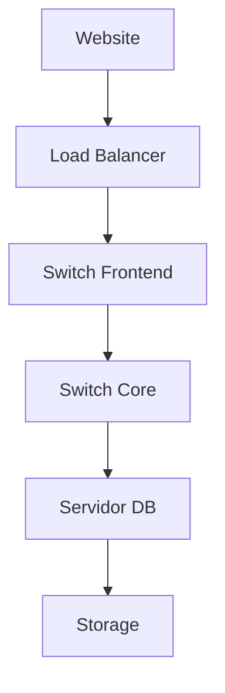

# Histórias Reais: Como o NetBox Resolve as Dores do Dia a Dia

> **"Cada linha desta página representa horas perdidas que poderiam ter sido evitadas"**

---

## 🚨 História 1: O Conflito de IP que Parou a Produção

### O que aconteceu
Quinta-feira, 14h30. O telefone toca. **"Sistema de pagamento fora do ar"**.

Você verifica a aplicação e descobre: **conflito de IP**. Dois servidores tentando usar o mesmo endereço na rede.

### A busca pela verdade
- ❌ **Planilha "oficial"** de IPs: desatualizada (última atualização: 6 meses atrás)
- ❌ **Arquivo no servidor do João**: versão "mais recente", mas com IPs duplicados
- ❌ **Wiki da empresa**: ninguém lembra se está correta
- ❌ **Chat do Slack**: 47 mensagens, ninguém sabe ao certo quem用了 quelIP

### O resultado
- 🔴 **3 horas** para encontrar o conflito
- 🔴 **6 servidores**受影响 (sistema de pagamento, website, API)
- 🔴 **R$ 45.000** de prejuízo (1 hora de downtime)
- 🔴 **Reunião deguerra** para "descobrir" quem fez a alteração

### Como o NetBox teria resolvido

```python
# Com NetBox, você saberia em 30 segundos:
from pynetbox import api

nb = api('http://netbox.example.com', token='SEU_TOKEN')

# Verificar se IP está em uso
ip = nb.ipam.ip_addresses.get(address='192.168.1.100')
if ip:
    print(f"⚠️ IP EM USO:")
    print(f"   Device: {ip.assigned_object}")
    print(f"   Interface: {ip.interface}")
    print(f"   Criado por: {ip.created_by}")
    print(f"   Última alteração: {ip.last_updated}")
```

**Resultado com NetBox:**
- ✅ Conflito detectado **ANTES** de acontecer (lint automático)
- ✅ **Nenhum** downtime
- ✅ **Zero** reunião de guerra
- ✅ Auditoria completa de mudanças

---

## 😤 História 2: O Técnico em Campo Sem Dados

### O que aconteceu
Sábado, 8h da manhã. Chamada de suporte: **switch com falha** em um cliente importante.

O técnico vai até o local:
- ❌ **"Qual switch exatamente?"** - a planilha não tem serial numbers
- ❌ **"Que rack?"** - o desenho do datacenter está em CAD na máquina do manager
- ❌ **"Que porta da VLAN?"** - documentação em um PDF disperso
- ❌ **"Código de falha?"** - não há histórico

### O resultado
- 🔴 **4 horas** no local (deveria ter sido 30 min)
- 🔴 Peça errada trazida (sem knowing do modelo correto)
- 🔴 **Cliente perdendo confiança**
- 🔴 Fim de semana perdido

### Como o NetBox teria resolvido

**App PWA para técnicos (que vamos ensinar a criar):**

```html
<!-- App simples que busca dados do NetBox -->
<div class="tech-app">
  <h3>🔍 Busca Rápida de Equipamento</h3>
  <input id="qr-code" placeholder="Escaneie QR code do switch" />
  <button onclick="buscarEquipamento()">Buscar</button>

  <div id="resultado" style="display:none">
    <h4>{{equipamento.nome}}</h4>
    <p>📍 {{equipamento.site}} / Rack {{equipamento.rack}} - U{{equipamento.unidade}}</p>
    <p>🔌 {{equipamento.modelo}} (S/N: {{equipamento.serial}})</p>
    <p>🔌 Porta {{equipamento.porta}} → VLAN {{equipamento.vlan}}</p>
    <p>⚠️ Histórico: {{equipamento.incidentes}}</p>
  </div>
</div>

<script>
async function buscarEquipamento() {
  const qr = document.getElementById('qr-code').value;
  const netbox = await fetch(`/api/switches/?serial=${qr}`).then(r => r.json());
  // ... mostrar dados instantâneos
}
</script>
```

**Resultado com NetBox:**
- ✅ **2 minutos** para identificar o equipamento
- ✅ Peça correta trazida na primeira vez
- ✅ Histórico completo na palma da mão
- ✅ Cliente feliz

---

## 💸 História 3: O Custo Invisível da Falta de Integração

### O que aconteceu
Reunião de orçamento anual. CFO pergunta: **"Quanto gastamos com infraestrutura?"**

A busca começa:
- ❌ **Excel financeiro**: custos dos equipamentos (R$ 2.3M)
- ❌ **Planilha do TI**: licenças e maintenance (R$ 800K)
- ❌ **Sistema de compra**: notas fiscais (R$ 500K em cabos e acessórios)
- ❌ **Chats do WhatsApp**: "alguém lembra quanto gastamos de consultantia para a migração?"

### O resultado
- 🔴 **3 semanas** para consolidar os dados
- 🔴 **R$ 800K em discrepâncias** (por que aparece R$ 3.1M vs R$ 2.3M?)
- 🔴 **Sem visibilidade** de ROI ou custo por projeto/cliente
- 🔴 **Decisões erradas** por falta de dados

### Como o NetBox + Odoo teriam resolvido

```python
# Integração automática NetBox ↔ Odoo
from pynetbox import api
import xmlrpc.client as xc

# NetBox (dados técnicos)
nb = api('http://netbox.example.com', token='TOKEN')
device = nb.dcim.devices.get(name='switch-core-01')

# Odoo (dados financeiros)
oodo = xc.ServerProxy('http://odoo:8069/xmlrpc/2/common')
uid = odoo.authenticate('db', 'user', 'password', {})
product_id = odoo.execute_kw('db', uid, 'password',
    'product.product', 'search_read',
    [[['default_code', '=', device.asset_tag]]],
    {'fields': ['name', 'standard_price', 'categ_id']}
)

# Relatório automático
print(f"Device: {device.name}")
print(f"Custo: R$ {product_id[0]['standard_price']}")
print(f"Categoria: {product_id[0]['categ_id'][1]}")
print(f"Localização: {device.site}")
```

**Resultado com NetBox + Odoo:**
- ✅ **Relatório em 2 segundos**, não 3 semanas
- ✅ Visão **financeira + técnica** unificada
- ✅ Decisões baseadas em **dados reais**
- ✅ Economia de **R$ 200K/ano** em retrabalho

---

## 📊 História 4: O Problema da Visibilidade

### O que aconteceu
**"Por que o site está lento?"**

Você investiga:
- ❌ **CloudFlare**: mostra request mais lento, mas não o porquê
- ❌ **Servidor web**: CPU normal, memória normal
- ❌ **Banco de dados**: queries lentas, mas qual a causa?
- ❌ **Switch core**: sem alertas no SNMP

**Duas horas depois:** Descobre que a interface do switch estava em **half-duplex**, mas não sabiam porque:
- Não sabiam qual rack estava
- Não sabiam que switches estavam interligados
- Não tinham mapa de dependências

### Como o NetBox resolve



Com NetBox, você vê **instantaneamente**:
- ✅ Dependências completas (serviço → app → host → switch → rack)
- ✅ **Estado atual** de cada componente
- ✅ **Últimas mudanças** que poderiam causar o problema
- ✅ **Impacto** de cada componente para outros serviços

**Tempo para diagnóstico: 2 minutos** (vs 2 horas)

---

## 🎯 A História que Mais Dói: A Que Nunca Contamos

### O verdadeiro custo
Não é o **R$ 45.000** de uma hora de downtime.

Não é o **fins de semana** perdidos dos técnicos.

**O verdadeiro custo é invisível:**

- 🔹 **Opportunity cost**: desenvolvedores que poderiam estar construindo features, mas ficam "apagando incêndio"
- 🔹 **Stress técnico**: equipes desmotivadas por problemas previsíveis
- 🔹 **Perda de confiança**: clientes perdendo fé na competência técnica
- 🔹 **Tech debt**: soluções paliativas que se acumulam

### NetBox muda essa narrativa

| Antes | Com NetBox |
|-------|------------|
| 80% do tempo apagando incêndio | 80% do tempo prevenindo problemas |
| Decisões baseadas em "achismo" | Decisões baseadas em dados |
| Baixa moral da equipe | Time orgulhoso da infraestrutura |
| Clientes insatisfeitos | Clientes confiantes |

---

## 💡 Próximos Passos

Agora que você conhece as dores, vamos à solução:

👉 **[Primeiros Passos com NetBox](../learning/primeiros-passos.md)** - Tutorial hands-on que vai do zero ao primeiro resultado em 30 minutos

👉 **[Casos de Uso Reais](./casos-uso/)** - Exemplos práticos com código para cada cenário

👉 **[PWAs para Time de Campo](./pwas-campo.md)** - Como criar apps que seus técnicos vão AMAR usar

---

> **"A melhor documentação não é a que explica como funciona, é a que mostra como resolve seu problema"**