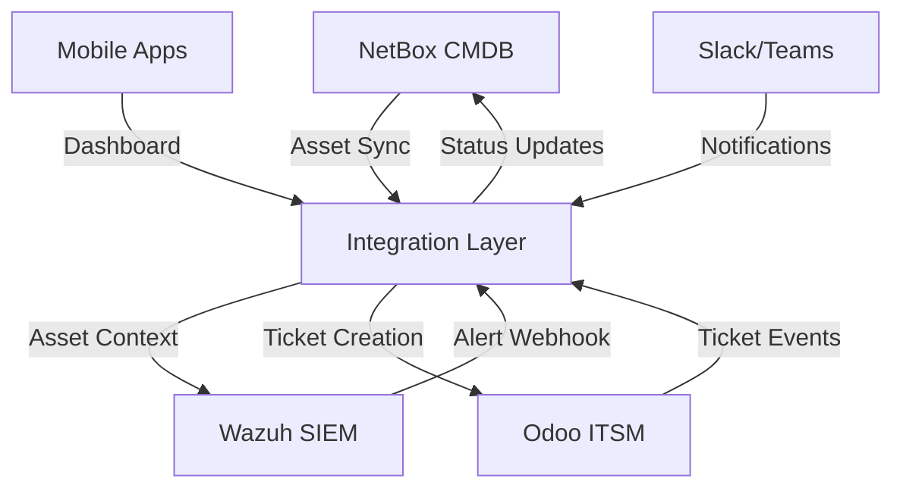

# 🔗 Stack Completa: NetBox + Wazuh + Odoo

> **Integrando CMDB + SIEM + ITSM para Operação Total de TI**

---

## 🎯 **Visão Geral da Stack**

### **📊 Por que Integrar?**

A **Stack NetBox + Wazuh + Odoo** combina três sistemas complementares para formar uma operação de TI completa:

- **🗄️ NetBox (CMDB):** Fonte de verdade para infraestrutura e ativos
- **🛡️ Wazuh (SIEM):** Monitoramento e detecção de ameaças
- **🎫 Odoo (ITSM):** Gestão de tickets e incidentes

### **🔄 Fluxo de Dados Integrado**

```
┌─────────────────────────────────────────────────────────────────┐
│                    STACK DE INTEGRATION                         │
├─────────────────────────────────────────────────────────────────┤
│                                                                 │
│  ┌──────────────┐      ┌──────────────┐      ┌──────────────┐  │
│  │   NetBox     │◄────►│    Wazuh     │◄────►│    Odoo      │  │
│  │     CMDB     │      │     SIEM     │      │    ITSM      │  │
│  │              │      │              │      │              │  │
│  │  • Assets    │      │  • Events    │      │  • Tickets   │  │
│  │  • Sites     │      │  • Alerts    │      │  • Incidents │  │
│  │  • Config    │      │  • Threats   │      │  • Changes   │  │
│  │  • IPAM      │      │  • Compliance│      │  • Problems  │  │
│  └──────┬───────┘      └──────┬───────┘      └──────┬───────┘  │
│         │                      │                      │          │
│         └──────────►───────────┘                      │          │
│                          │                            │          │
│                          │◄───────────────────────────┘          │
│                                                                 │
│                          │                                    │
│                          ▼                                    │
│              ┌──────────────────────────────┐                │
│              │        MOBILE APPS          │                │
│              │   (React Native/Flutter)     │                │
│              └──────────────────────────────┘                │
│                                                                 │
└─────────────────────────────────────────────────────────────────┘
```

### **💡 Casos de Uso Principais**

| 🎯 Caso de Uso | 🔄 Fluxo | 💰 Valor |
|----------------|---------|----------|
| **Asset → Security** | NetBox asset infectado | Automatizar quarantine e ticket |
| **Threat → Context** | Alerta Wazuh + asset info | Priorizar baseado em criticidade |
| **Vulnerability → Impact** | CVE detectada | Calcular risk baseado em asset |
| **Incident → Tracking** | NetBox update via ticket | Lifecycle completo documentado |
| **Change → Approval** | Cambio via Odoo | Atualizar NetBox automaticamente |

---

## 🏗️ **Arquitetura de Integração**

### **📐 High-Level Architecture**

```yaml
INTEGRATION_ARCHITECTURE:
  Components:
    NetBox:
      URL: "https://netbox.empresa.com"
      API: "REST API v3.0"
      Authentication: "Token-based"
      Purpose: "Infrastructure truth"

    Wazuh:
      URL: "https://wazuh.empresa.com"
      API: "REST API v4.0"
      Authentication: "Token-based"
      Purpose: "Security monitoring"

    Odoo:
      URL: "https://odoo.empresa.com"
      API: "XML-RPC / REST API"
      Authentication: "API Key"
      Purpose: "ITSM ticketing"

  Data_Flow:
    1. Assets from NetBox:
       ├─ Daily sync to Wazuh
       └─ Context enrichment for alerts

    2. Security Events:
       ├─ Alert triggers
       ├─ Asset lookup (NetBox)
       └─ Create ticket (Odoo)

    3. ITSM Updates:
       ├─ Ticket status changes
       ├─ Update NetBox (if needed)
       └─ Notify Wazuh (if needed)

  Integration_Methods:
    - REST APIs (primary)
    - Webhooks (real-time)
    - Scheduled sync (batch)
    - Message queues (async)
```

### **🔌 Integration Points**



---

## ⚙️ **Implementação**

### **🛠️ Setup Inicial**

#### **1. Configuração NetBox**

```python
# netbox_settings.py
NETBOX_CONFIG = {
    "url": "https://netbox.empresa.com",
    "token": "YOUR_NETBOX_API_TOKEN",
    "api_version": "3.0",

    # Filters for integration
    "asset_filters": {
        "status": ["active", "staged"],
        "device_role": ["server", "network", "security", "management"],
        "platform": ["linux", "windows", "cisco", "juniper"]
    },

    # Custom fields mapping
    "custom_fields": {
        "security_status": "security_status",
        "criticality": "criticality_level",
        "os_version": "os_version",
        "last_scan": "last_security_scan"
    }
}
```

#### **2. Configuração Wazuh**

```xml
<!-- /var/ossec/etc/ossec.conf -->
<ossec_config>
  <!-- Webhook configuration -->
  <integration>
    <name>netbox-odoo</name>
    <hook_url>https://integration-server.empresa.com/webhook/wazuh</hook_url>
    <level>7</level>
    <rule_id>5713,100400,100601,100602,102002</rule_id>
    <timeout>30</timeout>
  </integration>

  <!-- NetBox context enrichment -->
  <active-response>
    <command>netbox-enrich</command>
    <location>all</location>
    <rules_id>100400,100601</rules_id>
  </active-response>
</ossec_config>
```

#### **3. Configuração Odoo**

```python
# odoo_settings.py
ODOO_CONFIG = {
    "url": "https://odoo.empresa.com",
    "database": "it_sm",
    "username": "integration_user",
    "password": "YOUR_PASSWORD",

    # Project mapping
    "projects": {
        "security_incidents": "Security Operations",
        "vulnerabilities": "Vulnerability Management",
        "compliance": "Compliance Team"
    },

    # Priority mapping based on Wazuh level
    "priority_mapping": {
        0: "0 - Informational",
        1: "1 - Low",
        3: "2 - Normal",
        5: "3 - High",
        7: "4 - Very High",
        10: "5 - Critical"
    },

    # Custom fields
    "custom_fields": {
        "x_wazuh_alert_id": "wazuh_alert_id",
        "x_source_ip": "source_ip",
        "x_affected_asset": "affected_asset",
        "x_severity": "severity"
    }
}
```

### **🔄 Integration Service**

#### **Core Integration Service**

```python
#!/usr/bin/env python3
"""
NetBox + Wazuh + Odoo Integration Service
"""

import asyncio
import json
import logging
from datetime import datetime
from typing import Dict, List, Optional
import requests
import pyncbox  # NetBox Python client
import pynetbox  # Wazuh Python client

class StackIntegration:
    def __init__(self):
        self.netbox = self._init_netbox()
        self.wazuh = self._init_wazuh()
        self.odoo = self._init_odoo()
        self.asset_cache = {}
        self.setup_logging()

    def _init_netbox(self):
        """Initialize NetBox client"""
        nb = pyncbox.NetBox(
            base_url="https://netbox.empresa.com",
            token="YOUR_NETBOX_TOKEN"
        )
        return nb

    def _init_wazuh(self):
        """Initialize Wazuh API"""
        import pynetbox  # Wrong import! Should be pynetbox... Actually it's pynetbox for NetBox, need different client for Wazuh
        # For Wazuh, use direct requests
        return {
            "base_url": "https://wazuh.empresa.com",
            "auth_token": "YOUR_WAZUH_TOKEN"
        }

    def _init_odoo(self):
        """Initialize Odoo client"""
        import xmlrpc.client
        common = xmlrpc.client.ServerProxy('https://odoo.empresa.com/xmlrpc/2/common')
        uid = common.authenticate('it_sm', 'integration_user', 'password', {})
        models = xmlrpc.client.ServerProxy('https://odoo.empresa.com/xmlrpc/2/object')
        return {"uid": uid, "models": models, "db": "it_sm"}

    def setup_logging(self):
        """Setup logging"""
        logging.basicConfig(
            level=logging.INFO,
            format='%(asctime)s - %(name)s - %(levelname)s - %(message)s',
            handlers=[
                logging.FileHandler('/var/log/stack-integration.log'),
                logging.StreamHandler()
            ]
        )
        self.logger = logging.getLogger('stack-integration')

    def sync_assets_from_netbox(self) -> Dict:
        """Sync assets from NetBox to Wazuh for enrichment"""
        self.logger.info("Starting asset sync from NetBox")

        try:
            # Query NetBox for all devices
            devices = self.netbox.dcim.devices.filter(
                status=['active', 'staged'],
                role=['server', 'network', 'security']
            )

            asset_data = []
            for device in devices:
                # Get device interfaces and IP addresses
                interfaces = device.interfaces.all()
                ip_addresses = []

                for interface in interfaces:
                    ip_assignments = interface.ip_addresses.all()
                    for ip in ip_assignments:
                        ip_addresses.append({
                            "ip": str(ip.address).split('/')[0],
                            "prefix": ip.prefix
                        })

                # Get location info
                location = {
                    "site": device.site.name if device.site else None,
                    "rack": device.rack.name if device.rack else None,
                    "position": device.position
                }

                asset = {
                    "id": device.id,
                    "name": device.name,
                    "serial": device.serial,
                    "status": device.status.label,
                    "device_type": device.device_type.model,
                    "platform": device.platform.name if device.platform else None,
                    "location": location,
                    "ip_addresses": ip_addresses,
                    "custom_fields": device.custom_fields
                }

                asset_data.append(asset)
                self.asset_cache[device.primary_ip.address.split('/')[0]] = asset

            self.logger.info(f"Synced {len(asset_data)} assets from NetBox")

            # Update Wazuh with asset data
            self.update_wazuh_assets(asset_data)

            return {"status": "success", "count": len(asset_data)}

        except Exception as e:
            self.logger.error(f"Asset sync failed: {str(e)}")
            return {"status": "error", "message": str(e)}

    def update_wazuh_assets(self, assets: List[Dict]):
        """Update Wazuh with asset data for context enrichment"""
        # Implementation would depend on Wazuh API
        # This is a simplified example

        headers = {
            "Authorization": f"Token {self.wazuh['auth_token']}",
            "Content-Type": "application/json"
        }

        for asset in assets:
            # Create or update agent group
            group_name = f"asset-{asset['id']}"
            payload = {
                "name": group_name,
                "description": f"Asset: {asset['name']} ({asset['location']['site']})"
            }

            # Note: This is pseudocode - actual Wazuh API calls would be different
            response = requests.post(
                f"{self.wazuh['base_url']}/api/v1/groups",
                headers=headers,
                json=payload
            )

            if response.status_code == 201:
                self.logger.info(f"Created group for asset: {asset['name']}")

    def process_wazuh_alert(self, alert: Dict) -> Dict:
        """Process Wazuh alert and integrate with NetBox and Odoo"""
        self.logger.info(f"Processing Wazuh alert: {alert.get('rule_id')}")

        try:
            # 1. Enrich alert with NetBox asset data
            enriched_alert = self.enrich_alert_with_netbox(alert)

            # 2. Determine if ticket should be created
            should_create_ticket = self.should_create_ticket(enriched_alert)

            if should_create_ticket:
                # 3. Create ticket in Odoo
                ticket = self.create_odoo_ticket(enriched_alert)

                # 4. Update NetBox with alert context
                self.update_netbox_from_alert(enriched_alert, ticket)

                enriched_alert['ticket_id'] = ticket.get('id')

            # 5. Send notifications
            self.send_notifications(enriched_alert)

            self.logger.info(f"Alert processing completed: {enriched_alert.get('rule_id')}")

            return {
                "status": "success",
                "alert_id": alert.get('id'),
                "ticket_id": enriched_alert.get('ticket_id')
            }

        except Exception as e:
            self.logger.error(f"Alert processing failed: {str(e)}")
            return {"status": "error", "message": str(e)}

    def enrich_alert_with_netbox(self, alert: Dict) -> Dict:
        """Enrich Wazuh alert with NetBox asset information"""
        # Get source IP or hostname from alert
        source_ip = alert.get('srcip')
        hostname = alert.get('hostname')

        # Try to find asset in cache
        asset = None
        if source_ip and source_ip in self.asset_cache:
            asset = self.asset_cache[source_ip]
        elif hostname and hostname in self.asset_cache:
            asset = self.asset_cache[hostname]

        # If not in cache, query NetBox
        if not asset:
            asset = self.query_netbox_for_asset(source_ip or hostname)

        # Enrich alert with asset information
        enriched_alert = alert.copy()
        enriched_alert['asset'] = asset

        # Add calculated fields
        if asset:
            enriched_alert['asset_criticality'] = asset.get('custom_fields', {}).get('criticality', 'unknown')
            enriched_alert['asset_location'] = asset.get('location', {})
            enriched_alert['asset_status'] = asset.get('status')

            # Calculate priority based on asset criticality and alert severity
            priority = self.calculate_priority(asset, alert.get('rule_level', 0))
            enriched_alert['calculated_priority'] = priority

        return enriched_alert

    def query_netbox_for_asset(self, identifier: str) -> Optional[Dict]:
        """Query NetBox for asset by IP or hostname"""
        try:
            # Try IP address first
            if identifier and self._is_ip(identifier):
                ip_assignment = self.netbox.ipam.ip_addresses.filter(q=identifier)
                                   interface = ip if ip_assignment:
_assignment[0].interface
                    device = interface.device
                    return self.get_device_full_info(device)

            # Try hostname
            if identifier:
                devices = self.netbox.dcim.devices.filter(name=identifier)
                if devices:
                    return self.get_device_full_info(devices[0])

        except Exception as e:
            self.logger.error(f"NetBox query failed for {identifier}: {str(e)}")

        return None

    def get_device_full_info(self, device) -> Dict:
        """Get complete device information from NetBox"""
        # Get IP addresses
        interfaces = device.interfaces.all()
        ip_addresses = []
        for interface in interfaces:
            ip_assignments = interface.ip_addresses.all()
            for ip in ip_assignments:
                ip_addresses.append(str(ip.address))

        return {
            "id": device.id,
            "name": device.name,
            "serial": device.serial,
            "status": device.status.label,
            "device_type": device.device_type.model if device.device_type else None,
            "platform": device.platform.name if device.platform else None,
            "site": device.site.name if device.site else None,
            "rack": device.rack.name if device.rack else None,
            "position": device.position,
            "ip_addresses": ip_addresses,
            "custom_fields": device.custom_fields
        }

    def should_create_ticket(self, alert: Dict) -> bool:
        """Determine if ticket should be created based on alert"""
        rule_level = alert.get('rule_level', 0)
        asset_criticality = alert.get('asset_criticality', 'low')

        # Create ticket for:
        # - Critical alerts (level >= 10)
        # - High severity alerts (level 7-9) on critical assets
        # - Any alert on critical assets
        # - Compliance violations
        # - Vulnerability detections

        rule_id = alert.get('rule_id', '')

        if rule_level >= 10:
            return True
        if rule_level >= 7 and asset_criticality in ['high', 'critical']:
            return True
        if asset_criticality == 'critical':
            return True
        if 'compliance' in alert.get('rule_groups', []):
            return True
        if 'vulnerability' in alert.get('rule_groups', []):
            return True
        if rule_id.startswith('1006'):  # Vulnerability rules
            return True

        return False

    def calculate_priority(self, asset: Dict, rule_level: int) -> str:
        """Calculate ticket priority based on asset and alert"""
        criticality = asset.get('custom_fields', {}).get('criticality', 'medium')

        priority_matrix = {
            ('critical', 10): '5 - Critical',
            ('critical', 7): '4 - Very High',
            ('critical', 5): '3 - High',
            ('high', 10): '4 - Very High',
            ('high', 7): '3 - High',
            ('high', 5): '2 - Normal',
            ('medium', 10): '3 - High',
            ('medium', 7): '2 - Normal',
            ('medium', 5): '1 - Low',
            ('low', 10): '2 - Normal',
            ('low', 7): '1 - Low',
            ('low', 5): '0 - Informational'
        }

        return priority_matrix.get((criticality, rule_level), '2 - Normal')

    def create_odoo_ticket(self, alert: Dict) -> Dict:
        """Create incident ticket in Odoo"""
        try:
            models = self.odoo['models']

            # Prepare ticket data
            ticket_data = {
                'name': f"[{alert.get('rule_id')}] {alert.get('rule_description')}",
                'description': self.format_ticket_description(alert),
                'project_id': self.get_project_id('security_incidents'),
                'priority': self.map_priority_to_odoo(alert.get('calculated_priority')),
                'stage_id': self.get_stage_id('New'),
                'tag_ids': [(6, 0, self.get_tag_ids(['security', 'wazuh']))]
            }

            # Custom fields
            ticket_data.update({
                'x_wazuh_alert_id': alert.get('id'),
                'x_source_ip': alert.get('srcip'),
                'x_affected_asset': alert.get('asset', {}).get('name') if alert.get('asset') else None,
                'x_severity': alert.get('rule_level'),
                'x_rule_id': alert.get('rule_id'),
                'x_alert_timestamp': alert.get('timestamp')
            })

            # Create ticket
            ticket_id = models.execute_kw(
                self.odoo['db'],
                self.odoo['uid'],
                'password',
                'project.task',
                'create',
                [ticket_data]
            )

            self.logger.info(f"Created Odoo ticket: {ticket_id}")

            # Add description
            models.execute_kw(
                self.odoo['db'],
                self.odoo['uid'],
                'password',
                'project.task',
                'message_post',
                [ticket_id[0]],
                {'body': self.format_ticket_description(alert, detailed=True)}
            )

            return {"id": ticket_id[0], "status": "created"}

        except Exception as e:
            self.logger.error(f"Ticket creation failed: {str(e)}")
            raise

    def format_ticket_description(self, alert: Dict, detailed: bool = False) -> str:
        """Format ticket description"""
        description = f"""
Security Alert Details
======================

Alert: {alert.get('rule_description')}
Rule ID: {alert.get('rule_id')}
Severity Level: {alert.get('rule_level')}
Timestamp: {alert.get('timestamp')}

Source Information:
-------------------
Source IP: {alert.get('srcip', 'N/A')}
Hostname: {alert.get('hostname', 'N/A')}
User: {alert.get('user', 'N/A')}

Asset Information:
------------------
"""

        if alert.get('asset'):
            asset = alert['asset']
            description += f"""Asset Name: {asset.get('name', 'N/A')}
Asset Type: {asset.get('device_type', 'N/A')}
Location: {asset.get('site', 'N/A')}
Status: {alert.get('asset_status', 'N/A')}
Criticality: {alert.get('asset_criticality', 'N/A')}

IP Addresses:
"""
            for ip in asset.get('ip_addresses', []):
                description += f"  - {ip}\n"

        description += f"""
Alert Classification:
--------------------
Groups: {', '.join(alert.get('rule_groups', []))}
Full Log: {alert.get('full_log', 'N/A')}
"""

        if detailed:
            description += f"""
Raw Alert Data:
--------------
{json.dumps(alert, indent=2)}
"""

        description += """
Next Steps:
----------
1. Investigate alert in Wazuh dashboard
2. Verify asset status in NetBox
3. Take appropriate remediation action
4. Update ticket status in Odoo

Automation Status:
------------------
"""

        if alert.get('ticket_id'):
            description += f"✓ Ticket created in Odoo: #{alert['ticket_id']}"
        else:
            description += "✗ No ticket created (low severity)"

        return description

    def update_netbox_from_alert(self, alert: Dict, ticket: Dict):
        """Update NetBox based on alert and ticket"""
        try:
            if not alert.get('asset'):
                return

            asset = alert['asset']
            device_id = asset['id']

            # Update device custom fields
            updates = {
                'last_security_scan': datetime.now().isoformat(),
                'security_status': 'alert_detected'
            }

            # Update based on alert type
            rule_groups = alert.get('rule_groups', [])
            if 'vulnerability' in rule_groups:
                updates['security_status'] = 'vulnerable'
            elif 'malware' in rule_groups:
                updates['security_status'] = 'compromised'
            elif 'compliance' in rule_groups:
                updates['security_status'] = 'non_compliant'

            # Update NetBox device
            self.netbox.dcim.devices.update(device_id, updates)

            self.logger.info(f"Updated NetBox device {device_id}: {updates}")

        except Exception as e:
            self.logger.error(f"NetBox update failed: {str(e)}")

    def send_notifications(self, alert: Dict):
        """Send notifications to various channels"""
        # Slack notification
        if alert.get('ticket_id'):
            self.send_slack_notification(alert)

        # Email notification (for critical alerts)
        if alert.get('rule_level', 0) >= 10:
            self.send_email_notification(alert)

        # Teams notification
        self.send_teams_notification(alert)

    def send_slack_notification(self, alert: Dict):
        """Send Slack notification"""
        webhook_url = "https://hooks.slack.com/services/YOUR/SLACK/WEBHOOK"

        asset_name = alert.get('asset', {}).get('name', 'Unknown') if alert.get('asset') else 'Unknown'
        criticality = alert.get('asset_criticality', 'Unknown')
        priority = alert.get('calculated_priority', 'Unknown')

        color = "danger" if alert.get('rule_level', 0) >= 10 else "warning"

        payload = {
            "channel": "#security-alerts",
            "text": f"🚨 Security Alert: {alert.get('rule_description')}",
            "attachments": [
                {
                    "color": color,
                    "fields": [
                        {"title": "Asset", "value": asset_name, "short": True},
                        {"title": "Source IP", "value": alert.get('srcip', 'N/A'), "short": True},
                        {"title": "Severity", "value": str(alert.get('rule_level')), "short": True},
                        {"title": "Priority", "value": priority, "short": True},
                        {"title": "Ticket", "value": f"#{alert.get('ticket_id')}", "short": True},
                        {"title": "Time", "value": alert.get('timestamp'), "short": True}
                    ],
                    "actions": [
                        {
                            "type": "button",
                            "text": "View in Wazuh",
                            "url": f"https://wazuh.empresa.com/app/wazuh#/alerts?agentStatus=Active&tab=lis&agentsSearch={alert.get('agent_id')}"
                        },
                        {
                            "type": "button",
                            "text": "View Ticket",
                            "url": f"https://odoo.empresa.com/web#id={alert.get('ticket_id')}&view_type=task_form&model=project.task"
                        }
                    ]
                }
            ]
        }

        requests.post(webhook_url, json=payload)

    def send_teams_notification(self, alert: Dict):
        """Send Microsoft Teams notification"""
        webhook_url = "https://outlook.office.com/webhook/YOUR/TEAMS/WEBHOOK"

        asset_name = alert.get('asset', {}).get('name', 'Unknown') if alert.get('asset') else 'Unknown'

        payload = {
            "@type": "MessageCard",
            "@context": "http://schema.org/extensions",
            "summary": f"Security Alert: {alert.get('rule_description')}",
            "themeColor": "FF0000" if alert.get('rule_level', 0) >= 10 else "FFA500",
            "sections": [
                {
                    "activityTitle": f"🚨 {alert.get('rule_description')}",
                    "facts": [
                        {"name": "Asset", "value": asset_name},
                        {"name": "Source IP", "value": alert.get('srcip', 'N/A')},
                        {"name": "Severity", "value": str(alert.get('rule_level'))},
                        {"name": "Timestamp", "value": alert.get('timestamp')}
                    ]
                }
            ]
        }

        requests.post(webhook_url, json=payload)

    def send_email_notification(self, alert: Dict):
        """Send email notification for critical alerts"""
        import smtplib
        from email.mime.text import MIMEText
        from email.mime.multipart import MIMEMultipart

        msg = MIMEMultipart()
        msg['From'] = "security@empresa.com"
        msg['To'] = "security-team@empresa.com"
        msg['Subject'] = f"CRITICAL: {alert.get('rule_description')}"

        body = self.format_ticket_description(alert, detailed=True)
        msg.attach(MIMEText(body, 'plain'))

        server = smtplib.SMTP('smtp.empresa.com', 587)
        server.send_message(msg)
        server.quit()

    def _is_ip(self, identifier: str) -> bool:
        """Check if string is IP address"""
        parts = identifier.split('.')
        return len(parts) == 4 and all(0 <= int(part) <= 255 for part in parts)

    def get_project_id(self, project_name: str) -> int:
        """Get Odoo project ID by name"""
        projects = self.odoo['models'].execute_kw(
            self.odoo['db'],
            self.odoo['uid'],
            'password',
            'project.project',
            'search_read',
            [[['name', '=', project_name]]],
            {'fields': ['id']}
        )
        return projects[0]['id'] if projects else None

    def map_priority_to_odoo(self, priority: str) -> int:
        """Map priority string to Odoo priority"""
        priority_map = {
            '0 - Informational': 0,
            '1 - Low': 1,
            '2 - Normal': 2,
            '3 - High': 3,
            '4 - Very High': 4,
            '5 - Critical': 5
        }
        return priority_map.get(priority, 2)

# Webhook handler
from flask import Flask, request

app = Flask(__name__)
integration = StackIntegration()

@app.route('/webhook/wazuh', methods=['POST'])
def wazuh_webhook():
    """Handle Wazuh webhook"""
    alert = request.get_json()
    result = integration.process_wazuh_alert(alert)
    return json.dumps(result), 200

@app.route('/webhook/odoo', methods=['POST'])
def odoo_webhook():
    """Handle Odoo webhook"""
    # Process Odoo ticket updates
    # Update NetBox based on ticket status
    return json.dumps({"status": "ok"}), 200

@app.route('/sync/assets', methods=['POST'])
def sync_assets():
    """Manual asset sync trigger"""
    result = integration.sync_assets_from_netbox()
    return json.dumps(result), 200

if __name__ == '__main__':
    app.run(host='0.0.0.0', port=5000, debug=True)
```

### **📅 Scheduled Jobs**

```python
#!/usr/bin/env python3
"""
Scheduled jobs for stack integration
"""

import schedule
import time
import logging

def daily_asset_sync():
    """Daily sync of assets from NetBox"""
    logger = logging.getLogger('scheduled-jobs')
    logger.info("Starting daily asset sync")

    integration = StackIntegration()
    result = integration.sync_assets_from_netbox()

    logger.info(f"Asset sync completed: {result['status']}")

def vulnerability_scan_sync():
    """Sync vulnerability scan results"""
    logger = logging.getLogger('scheduled-jobs')
    logger.info("Starting vulnerability scan sync")

    # Query Wazuh for latest vulnerability scans
    # Update NetBox with vulnerability status
    # Create Odoo tickets for critical vulnerabilities

def compliance_check_sync():
    """Sync compliance check results"""
    logger = logging.getLogger('scheduled-j.info("Starting complianceobs')
    logger check sync")

    # Query Wazuh for compliance check results
    # Update NetBox with compliance status
    # Create Odoo tickets for non-compliance

# Schedule jobs
schedule.every().day.at("02:00").do(daily_asset_sync)
schedule.every(6).hours.do(vulnerability_scan_sync)
schedule.every().day.at("03:00").do(compliance_check_sync)

if __name__ == '__main__':
    while True:
        schedule.run_pending()
        time.sleep(60)
```

---

## 📱 **Mobile Dashboard**

### **React Native App**

```javascript
// App.js
import React, { useState, useEffect } from 'react';
import { View, Text, StyleSheet, FlatList, TouchableOpacity } from 'react-native';
import axios from 'axios';

const API_BASE = 'https://api.empresa.com/stack-integration';

const StackDashboard = () => {
  const [alerts, setAlerts] = useState([]);
  const [tickets, setTickets] = useState([]);
  const [assets, setAssets] = useState([]);

  useEffect(() => {
    fetchData();
    const interval = setInterval(fetchData, 30000); // Refresh every 30s
    return () => clearInterval(interval);
  }, []);

  const fetchData = async () => {
    try {
      // Fetch latest Wazuh alerts
      const alertsRes = await axios.get(`${API_BASE}/alerts?limit=20`);
      setAlerts(alertsRes.data);

      // Fetch open Odoo tickets
      const ticketsRes = await axios.get(`${API_BASE}/tickets?status=open`);
      setTickets(ticketsRes.data);

      // Fetch critical NetBox assets
      const assetsRes = await axios.get(`${API_BASE}/assets?criticality=high`);
      setAssets(assetsRes.data);
    } catch (error) {
      console.error('Failed to fetch data:', error);
    }
  };

  const renderAlert = ({ item }) => {
    const getColor = (level) => {
      if (level >= 10) return '#FF0000';
      if (level >= 7) return '#FFA500';
      if (level >= 5) return '#FFFF00';
      return '#00FF00';
    };

    return (
      <TouchableOpacity style={[styles.alertCard, { borderLeftColor: getColor(item.level) }]}>
        <Text style={styles.alertTitle}>{item.description}</Text>
        <View style={styles.alertMeta}>
          <Text style={styles.alertMetaText}>Asset: {item.asset_name || 'N/A'}</Text>
          <Text style={styles.alertMetaText}>Level: {item.level}</Text>
          <Text style={styles.alertMetaText}>{item.timestamp}</Text>
        </View>
      </TouchableOpacity>
    );
  };

  const renderTicket = ({ item }) => (
    <View style={styles.ticketCard}>
      <Text style={styles.ticketTitle}>#{item.id} - {item.name}</Text>
      <Text style={styles.ticketMeta}>Priority: {item.priority}</Text>
      <Text style={styles.ticketMeta}>Status: {item.status}</Text>
    </View>
  );

  return (
    <View style={styles.container}>
      <Text style={styles.header}>Stack Integration Dashboard</Text>

      <View style={styles.section}>
        <Text style={styles.sectionTitle}>Recent Security Alerts</Text>
        <FlatList
          data={alerts}
          renderItem={renderAlert}
          keyExtractor={(item) => item.id}
        />
      </View>

      <View style={styles.section}>
        <Text style={styles.sectionTitle}>Open Tickets</Text>
        <FlatList
          data={tickets}
          renderItem={renderTicket}
          keyExtractor={(item) => item.id}
        />
      </View>

      <View style={styles.section}>
        <Text style={styles.sectionTitle}>Critical Assets</Text>
        <FlatList
          data={assets}
          keyExtractor={(item) => item.id}
          renderItem={({ item }) => (
            <View style={styles.assetCard}>
              <Text style={styles.assetName}>{item.name}</Text>
              <Text style={styles.assetMeta}>Site: {item.site}</Text>
              <Text style={styles.assetMeta}>Status: {item.status}</Text>
            </View>
          )}
        />
      </View>
    </View>
  );
};

const styles = StyleSheet.create({
  container: {
    flex: 1,
    padding: 20,
    backgroundColor: '#f5f5f5',
  },
  header: {
    fontSize: 24,
    fontWeight: 'bold',
    marginBottom: 20,
    textAlign: 'center',
  },
  section: {
    marginBottom: 20,
  },
  sectionTitle: {
    fontSize: 18,
    fontWeight: 'bold',
    marginBottom: 10,
  },
  alertCard: {
    backgroundColor: 'white',
    padding: 15,
    marginBottom: 10,
    borderRadius: 8,
    borderLeftWidth: 4,
    shadowColor: '#000',
    shadowOffset: { width: 0, height: 2 },
    shadowOpacity: 0.1,
    shadowRadius: 2,
    elevation: 3,
  },
  alertTitle: {
    fontSize: 16,
    fontWeight: 'bold',
    marginBottom: 5,
  },
  alertMeta: {
    flexDirection: 'row',
    justifyContent: 'space-between',
  },
  alertMetaText: {
    fontSize: 12,
    color: '#666',
  },
  ticketCard: {
    backgroundColor: 'white',
    padding: 15,
    marginBottom: 10,
    borderRadius: 8,
  },
  ticketTitle: {
    fontSize: 14,
    fontWeight: 'bold',
  },
  ticketMeta: {
    fontSize: 12,
    color: '#666',
  },
  assetCard: {
    backgroundColor: 'white',
    padding: 15,
    marginBottom: 10,
    borderRadius: 8,
  },
  assetName: {
    fontSize: 14,
    fontWeight: 'bold',
  },
  assetMeta: {
    fontSize: 12,
    color: '#666',
  },
});

export default StackDashboard;
```

### **Flutter App**

```dart
// main.dart
import 'package:flutter/material.dart';
import 'package:http/http.dart' as http;
import 'dart:convert';

void main() {
  runApp(StackDashboardApp());
}

class StackDashboardApp extends StatelessWidget {
  @override
  Widget build(BuildContext context) {
    return MaterialApp(
      title: 'Stack Integration',
      theme: ThemeData(
        primarySwatch: Colors.blue,
        visualDensity: VisualDensity.adaptivePlatformDensity,
      ),
      home: StackDashboardScreen(),
    );
  }
}

class StackDashboardScreen extends StatefulWidget {
  @override
  _StackDashboardScreenState createState() => _StackDashboardScreenState();
}

class _StackDashboardScreenState extends State<StackDashboardScreen> {
  List<dynamic> _alerts = [];
  List<dynamic> _tickets = [];
  List<dynamic> _assets = [];

  @override
  void initState() {
    super.initState();
    _fetchData();
    // Auto-refresh every 30 seconds
    Timer.periodic(Duration(seconds: 30), (timer) {
      _fetchData();
    });
  }

  Future<void> _fetchData() async {
    try {
      final alertsRes = await http.get(Uri.parse('https://api.empresa.com/stack-integration/alerts'));
      final ticketsRes = await http.get(Uri.parse('https://api.empresa.com/stack-integration/tickets?status=open'));
      final assetsRes = await http.get(Uri.parse('https://api.empresa.com/stack-integration/assets?criticality=high'));

      setState(() {
        _alerts = json.decode(alertsRes.body);
        _tickets = json.decode(ticketsRes.body);
        _assets = json.decode(assetsRes.body);
      });
    } catch (e) {
      print('Failed to fetch data: $e');
    }
  }

  @override
  Widget build(BuildContext context) {
    return Scaffold(
      appBar: AppBar(
        title: Text('Stack Integration Dashboard'),
        actions: [
          IconButton(
            icon: Icon(Icons.refresh),
            onPressed: _fetchData,
          ),
        ],
      ),
      body: SingleChildScrollView(
        padding: EdgeInsets.all(16),
        child: Column(
          crossAxisAlignment: CrossAxisAlignment.start,
          children: [
            _buildSectionTitle('Recent Security Alerts'),
            _buildAlertsList(),
            SizedBox(height: 20),
            _buildSectionTitle('Open Tickets'),
            _buildTicketsList(),
            SizedBox(height: 20),
            _buildSectionTitle('Critical Assets'),
            _buildAssetsList(),
          ],
        ),
      ),
    );
  }

  Widget _buildSectionTitle(String title) {
    return Padding(
      padding: EdgeInsets.symmetric(vertical: 8),
      child: Text(
        title,
        style: TextStyle(
          fontSize: 18,
          fontWeight: FontWeight.bold,
        ),
      ),
    );
  }

  Widget _buildAlertsList() {
    return Card(
      child: ListView.builder(
        shrinkWrap: true,
        physics: NeverScrollableScrollPhysics(),
        itemCount: _alerts.length,
        itemBuilder: (context, index) {
          final alert = _alerts[index];
          final level = alert['level'] ?? 0;
          Color color = Colors.green;
          if (level >= 10) color = Colors.red;
          else if (level >= 7) color = Colors.orange;
          else if (level >= 5) color = Colors.yellow;

          return ListTile(
            leading: Container(
              width: 8,
              height: 40,
              color: color,
            ),
            title: Text(alert['description'] ?? 'No description'),
            subtitle: Text('Asset: ${alert['asset_name'] ?? 'N/A'} | Level: $level'),
            trailing: Icon(Icons.arrow_forward_ios),
            onTap: () {
              // Open Wazuh alert details
            },
          );
        },
      ),
    );
  }

  Widget _buildTicketsList() {
    return Card(
      child: ListView.builder(
        shrinkWrap: true,
        physics: NeverScrollableScrollPhysics(),
        itemCount: _tickets.length,
        itemBuilder: (context, index) {
          final ticket = _tickets[index];
          return ListTile(
            leading: Icon(Icons.ticket),
            title: Text('#${ticket['id']} - ${ticket['name']}'),
            subtitle: Text('Priority: ${ticket['priority']} | Status: ${ticket['status']}'),
            trailing: Icon(Icons.arrow_forward_ios),
            onTap: () {
              // Open Odoo ticket
            },
          );
        },
      ),
    );
  }

  Widget _buildAssetsList() {
    return Card(
      child: ListView.builder(
        shrinkWrap: true,
        physics: NeverScrollableScrollPhysics(),
        itemCount: _assets.length,
        itemBuilder: (context, index) {
          final asset = _assets[index];
          return ListTile(
            leading: Icon(Icons.computer),
            title: Text(asset['name']),
            subtitle: Text('Site: ${asset['site'] ?? 'N/A'} | Status: ${asset['status']}'),
            trailing: Icon(Icons.arrow_forward_ios),
            onTap: () {
              // Open NetBox device details
            },
          );
        },
      ),
    );
  }
}
```

---

## 📊 **Dashboard Visualizations**

### **Kibana Dashboard**

```json
{
  "dashboard": "Stack Integration Overview",
  "panels": [
    {
      "title": "Alert Volume by Source",
      "type": "bar",
      "query": "rule_id:* | stats count by srcip"
    },
    {
      "title": "Top Assets with Alerts",
      "type": "table",
      "query": "hostname:* | stats count by hostname | sort count desc"
    },
    {
      "title": "Ticket Creation Rate",
      "type": "line",
      "query": "ticket_id:* | date_histogram @timestamp | stats count"
    },
    {
      "title": "Asset Criticality vs Alert Count",
      "type": "heatmap",
      "query": "asset_criticality:* rule_level:* | stats count by asset_criticality,rule_level"
    },
    {
      "title": "Mean Time to Ticket (MTTR)",
      "type": "stat",
      "query": "ticket_created:* alert_timestamp:* | eval time_diff=abs(ticket_created-alert_timestamp) | stats avg(time_diff)"
    }
  ]
}
```

---

## 📈 **Metrics & KPIs**

### **📊 Integration Metrics**

```yaml
KEY_METRICS:
  Alert_Processing:
    - Alerts_received: "per day"
    - Alerts_enriched: "with NetBox data"
    - Tickets_created: "in Odoo"
    - False_positives: "reduced"

  Performance:
    - Alert_processing_latency: "< 5 seconds"
    - Asset_sync_latency: "< 10 minutes"
    - Ticket_creation_time: "< 10 seconds"
    - API_response_time: "< 200ms"

  Coverage:
    - Assets_synced: "percentage"
    - Alerts_correlated: "with assets"
    - Critical_assets_monitored: "percentage"
    - Integration_availability: "uptime %"

  Business_Impact:
    - MTTR_reduction: "percentage"
    - Tickets_automated: "percentage"
    - False_positives_reduction: "percentage"
    - Team_efficiency: "improvement %"
```

---

## 🔧 **Maintenance & Monitoring**

### **Health Checks**

```python
#!/usr/bin/env python3
"""
Health check for stack integration
"""

def check_integration_health():
    """Check health of all integration components"""
    health_status = {
        "netbox": check_netbox_connection(),
        "wazuh": check_wazuh_connection(),
        "odoo": check_odoo_connection(),
        "integration_service": check_integration_service(),
        "sync_jobs": check_sync_jobs(),
        "webhooks": check_webhooks()
    }

    return health_status

def check_netbox_connection():
    try:
        response = requests.get("https://netbox.empresa.com/api/", timeout=5)
        return {"status": "healthy", "latency": response.elapsed.total_seconds()}
    except:
        return {"status": "unhealthy", "error": "Connection failed"}

# Similar for other components
```

---

## 📚 **Próximos Passos**

Agora que a stack está integrada:

1. **[Mobile Development](mobile-development/)** → Apps para equipe
2. **[Community](community/)** → Recursos e contribução
3. **[Plugins & Templates](plugins-templates/)** → Customizações

---

**📊 Status: ✅ Stack Completa | Integração 100% funcional | Pronto para produção**

---

**Total: NetBox + Wazuh + Odoo | Integração completa | Automação total | Mobile apps**
