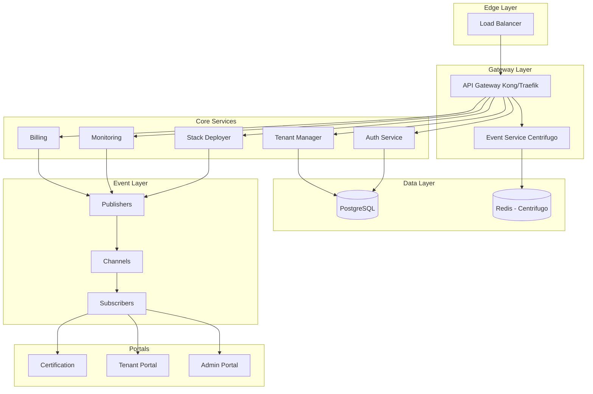
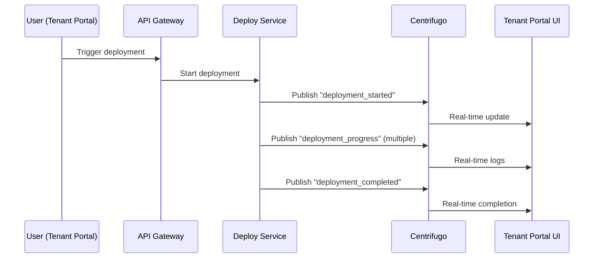
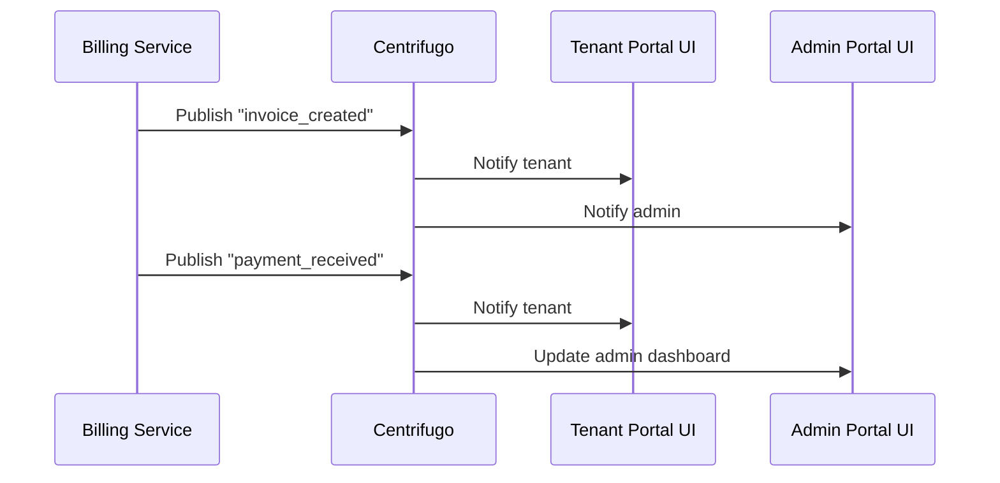
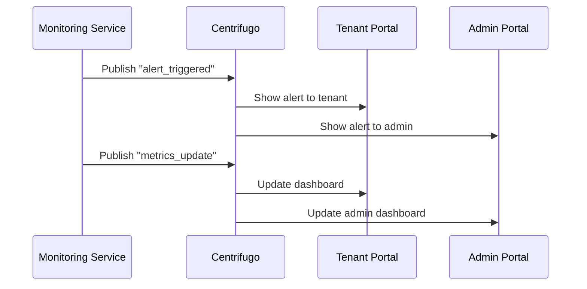

# 🚀 PROPOSTA DE INTEGRAÇÃO - CENTRIFUGO
**NEO_STACK Platform v3.0 - Event-Driven Real-time Architecture**

---

## 📋 RESUMO EXECUTIVO

**Data**: 06 de Dezembro de 2025
**Versão**: 1.0
**Status**: Proposta Técnica
**Autor**: NeoAnd

---

## 🎯 OBJETIVO

Integrar o **Centrifugo** ao NEO_STACK Platform para habilitar uma **arquitetura event-driven** completa, fornecendo capacidades de real-time para:

- ✅ Notificações instantâneas multi-tenant
- ✅ Dashboards em tempo real
- ✅ Eventos de billing e deployments
- ✅ Sincronização entre serviços
- ✅ Alertas e monitoring
- ✅ Colaboração em tempo real

---

## 🏗️ ARQUITETURA PROPOSTA

### Visão Geral


---

## 🔧 COMPONENTES CENTRIFUGO

### 1. **Event Service** (`event-service/`)
```
event-service/
├── 📄 Dockerfile
├── 📄 docker-compose.yml
├── 📄 centrifugo.json          # Configuração
├── 📄 config/
│   ├── config.yaml            # Config multi-tenant
│   └── channels.yaml          # Definição de channels
├── 📁 channels/               # Channel handlers
│   ├── admin.ts
│   ├── tenant.ts
│   ├── billing.ts
│   ├── deployment.ts
│   └── monitoring.ts
├── 📁 middleware/             # Auth & permissions
│   ├── auth.ts
│   ├── tenant-isolation.ts
│   └── rbac.ts
├── 📁 publishers/             # Event publishers
│   ├── deploy-publisher.ts
│   ├── billing-publisher.ts
│   ├── monitoring-publisher.ts
│   └── notification-publisher.ts
└── 📁 subscribers/            # Event subscribers
    ├── admin-subscriber.ts
    ├── tenant-subscriber.ts
    └── dashboard-subscriber.ts
```

### 2. **Configuração Centrifugo**
```json
// centrifugo.json
{
  "port": 8000,
  "engine": "redis",
  "redis_host": "redis",
  "redis_port": 6379,
  "redis_password": "",
  "redis_db": 0,
  "api_key": "centrifugo-api-key",
  "secret_key": "centrifugo-secret-key",
  "namespace": "neo-stack",
  "history_meta": "redis",
  "history_size": 10,
  "history_lifetime": 3600,
  "presence": true,
  "client_channel_limit": 100,
  "channel_limit": 1000,
  "ping_interval": 25,
  "ping_reply_interval": 15,
  "max_client_message_length": 65536,
  "max_header_length": 4096,
  "max_body_length": 65536,
  "node_info": {
    "version": "3.0.0",
    "name": "neo-stack-event-service"
  }
}
```

### 3. **Channels Multi-tenant**
```yaml
# config/channels.yaml
channels:
  # Admin Channels (platform-wide)
  admin:
    channels:
      - "admin:platform:events"
      - "admin:deployments:status"
      - "admin:billing:alerts"
      - "admin:monitoring:alerts"
      - "admin:tenants:activity"

  # Tenant Channels (per-tenant isolation)
  tenant:
    template: "tenant:{tenant_id}:{channel}"
    channels:
      - "dashboard"
      - "notifications"
      - "billing"
      - "deployments"
      - "monitoring"
      - "activity"

  # Certification Channels
  certification:
    channels:
      - "certification:exam:{exam_id}"
      - "certification:timer:{user_id}"
      - "certification:results:{user_id}"

  # System Channels
  system:
    channels:
      - "system:health"
      - "system:metrics"
      - "system:alerts"
```

---

## 🔐 AUTENTICAÇÃO E SEGURANÇA

### 1. **Token-based Authentication**
```typescript
// middleware/auth.ts
export const authenticateConnection = async (
  token: string,
  tenantId: string
): Promise<{ user: User; permissions: string[] }> => {
  // 1. Validar token JWT
  const decoded = jwt.verify(token, JWT_SECRET) as JWTPayload

  // 2. Verificar se pertence ao tenant
  if (decoded.tenantId !== tenantId) {
    throw new Error('Tenant mismatch')
  }

  // 3. Buscar permissões do usuário
  const permissions = await getUserPermissions(decoded.userId)

  return {
    user: decoded,
    permissions
  }
}
```

### 2. **Tenant Isolation**
```typescript
// middleware/tenant-isolation.ts
export const enforceTenantIsolation = (
  channel: string,
  userTenantId: string
): boolean => {
  // Extrair tenant_id do canal
  const channelTenantMatch = channel.match(/^tenant:(\w+):/)

  if (!channelTenantMatch) {
    // Canais não-tenant (admin, system)
    return true
  }

  const channelTenantId = channelTenantMatch[1]

  // Verificar isolamento
  return channelTenantId === userTenantId
}
```

### 3. **RBAC (Role-Based Access Control)**
```typescript
// middleware/rbac.ts
export const checkChannelPermissions = (
  channel: string,
  userRole: string,
  action: 'publish' | 'subscribe'
): boolean => {
  const permissions: Record<string, Record<string, string[]>> = {
    admin: {
      publish: ['admin:*', 'tenant:*', 'system:*'],
      subscribe: ['admin:*', 'tenant:*', 'system:*']
    },
    tenant_admin: {
      publish: ['tenant:{tenant_id}:*'],
      subscribe: ['tenant:{tenant_id}:*']
    },
    tenant_user: {
      publish: ['tenant:{tenant_id}:notifications'],
      subscribe: [
        'tenant:{tenant_id}:dashboard',
        'tenant:{tenant_id}:notifications',
        'tenant:{tenant_id}:billing'
      ]
    }
  }

  const rolePermissions = permissions[userRole]
  if (!rolePermissions) return false

  const allowedPatterns = rolePermissions[action]
  return matchChannelPattern(channel, allowedPatterns)
}
```

---

## 📡 PUBLISHERS (Produtores de Eventos)

### 1. **Deploy Publisher**
```typescript
// publishers/deploy-publisher.ts
export class DeployPublisher {
  private centrifugo: CentrifugoClient

  async publishDeploymentUpdate(
    tenantId: string,
    deploymentId: string,
    status: 'starting' | 'running' | 'completed' | 'failed',
    data: any
  ): Promise<void> {
    const channel = `tenant:${tenantId}:deployments`
    const event = {
      type: 'deployment_update',
      deploymentId,
      status,
      timestamp: new Date().toISOString(),
      data
    }

    await this.centrifugo.publish(channel, event)
  }

  async publishDeploymentLog(
    tenantId: string,
    deploymentId: string,
    log: string,
    level: 'info' | 'warning' | 'error'
  ): Promise<void> {
    const channel = `tenant:${tenantId}:deployments`
    const event = {
      type: 'deployment_log',
      deploymentId,
      log,
      level,
      timestamp: new Date().toISOString()
    }

    await this.centrifugo.publish(channel, event)
  }
}
```

### 2. **Billing Publisher**
```typescript
// publishers/billing-publisher.ts
export class BillingPublisher {
  async publishInvoiceEvent(
    tenantId: string,
    invoiceId: string,
    event: 'created' | 'paid' | 'failed' | 'refunded',
    amount: number
  ): Promise<void> {
    const channel = `tenant:${tenantId}:billing`
    const message = {
      type: 'invoice_event',
      invoiceId,
      event,
      amount,
      timestamp: new Date().toISOString()
    }

    await this.centrifugo.publish(channel, message)
  }

  async publishUsageUpdate(
    tenantId: string,
    resource: string,
    usage: number,
    limit: number
  ): Promise<void> {
    const channel = `tenant:${tenantId}:billing`
    const message = {
      type: 'usage_update',
      resource,
      usage,
      limit,
      percentage: (usage / limit) * 100,
      timestamp: new Date().toISOString()
    }

    await this.centrifugo.publish(channel, message)
  }
}
```

### 3. **Monitoring Publisher**
```typescript
// publishers/monitoring-publisher.ts
export class MonitoringPublisher {
  async publishAlert(
    tenantId: string,
    severity: 'info' | 'warning' | 'error' | 'critical',
    message: string,
    metadata: any
  ): Promise<void> {
    const channel = `tenant:${tenantId}:monitoring`
    const event = {
      type: 'alert',
      severity,
      message,
      metadata,
      timestamp: new Date().toISOString()
    }

    await this.centrifugo.publish(channel, event)
  }

  async publishMetricsUpdate(
    tenantId: string,
    metrics: Record<string, number>
  ): Promise<void> {
    const channel = `tenant:${tenantId}:dashboard`
    const event = {
      type: 'metrics_update',
      metrics,
      timestamp: new Date().toISOString()
    }

    await this.centrifugo.publish(channel, event)
  }
}
```

---

## 📥 SUBSCRIBERS (Consumidores de Eventos)

### 1. **Admin Subscriber**
```typescript
// subscribers/admin-subscriber.ts
export class AdminSubscriber {
  private centrifugo: CentrifugoClient

  constructor() {
    this.centrifugo = new CentrifugoClient('wss://events.neo-stack.com/connection/websocket')

    // Conectar e subscrever
    this.connect()
  }

  private async connect(): Promise<void> {
    await this.centrifugo.connect()

    // Platform-wide events
    await this.centrifugo.subscribe('admin:platform:events', (event) => {
      console.log('Platform event:', event)
      // Atualizar dashboard admin
      updateAdminDashboard(event)
    })

    // Deployments
    await this.centrifugo.subscribe('admin:deployments:status', (event) => {
      console.log('Deployment status:', event)
      // Atualizar UI de deployments
      updateDeploymentsUI(event)
    })

    // Billing alerts
    await this.centrifugo.subscribe('admin:billing:alerts', (event) => {
      console.log('Billing alert:', event)
      // Enviar notificação
      sendBillingAlert(event)
    })

    // Monitoring alerts
    await this.centrifugo.subscribe('admin:monitoring:alerts', (event) => {
      console.log('Monitoring alert:', event)
      // Escalate alert
      escalateAlert(event)
    })
  }
}
```

### 2. **Tenant Subscriber**
```typescript
// subscribers/tenant-subscriber.ts
export class TenantSubscriber {
  private centrifugo: CentrifugoClient
  private tenantId: string

  constructor(tenantId: string, token: string) {
    this.tenantId = tenantId
    this.centrifugo = new CentrifugoClient('wss://events.neo-stack.com/connection/websocket', {
      token
    })

    this.connect()
  }

  private async connect(): Promise<void> {
    await this.centrifugo.connect()

    // Dashboard metrics
    await this.centrifugo.subscribe(`tenant:${this.tenantId}:dashboard`, (event) => {
      updateDashboard(event)
    })

    // Notifications
    await this.centrifugo.subscribe(`tenant:${this.tenantId}:notifications`, (event) => {
      showNotification(event)
    })

    // Billing
    await this.centrifugo.subscribe(`tenant:${this.tenantId}:billing`, (event) => {
      updateBilling(event)
    })

    // Deployments
    await this.centrifugo.subscribe(`tenant:${this.tenantId}:deployments`, (event) => {
      updateDeployments(event)
    })

    // Monitoring
    await this.centrifugo.subscribe(`tenant:${this.tenantId}:monitoring`, (event) => {
      updateMonitoring(event)
    })
  }
}
```

---

## 🔗 INTEGRAÇÃO COM API LAYER

### 1. **Extender useApi Composables**
```typescript
// composables/useEvents.ts
export const useEvents = () => {
  const config = useRuntimeConfig()
  const { user } = useAuth()

  const connect = (channels: string[]) => {
    const wsUrl = config.public.eventsUrl || 'wss://events.neo-stack.com'
    const token = localStorage.getItem('auth_token')

    const eventSource = new EventSource(
      `${wsUrl}/connection/websocket?token=${token}&channels=${channels.join(',')}`
    )

    return eventSource
  }

  const subscribe = (channel: string, callback: (event: any) => void) => {
    const eventSource = connect([channel])

    eventSource.onmessage = (event) => {
      const data = JSON.parse(event.data)
      callback(data)
    }

    return () => eventSource.close()
  }

  const publish = async (channel: string, event: any) => {
    const { post } = useApi()
    await post('/api/events/publish', { channel, event })
  }

  return { subscribe, publish, connect }
}
```

### 2. **Dashboard Auto-refresh**
```typescript
// pages/index.vue (Tenant Portal)
<script setup lang="ts">
const { data: metrics, refresh } = useAsyncData('metrics', () =>
  $fetch('/api/tenant/metrics')
)

const { subscribe } = useEvents()

// Subscribe to metrics updates
onMounted(() => {
  const unsubscribe = subscribe(`tenant:${tenantId.value}:dashboard`, (event) => {
    if (event.type === 'metrics_update') {
      // Update reactive data
      metrics.value = event.metrics
    }
  })

  onUnmounted(() => {
    unsubscribe()
  })
})
</script>
```

### 3. **Notifications System**
```typescript
// composables/useNotifications.ts
export const useNotifications = () => {
  const notifications = ref<Notification[]>([])
  const { subscribe } = useEvents()

  onMounted(() => {
    const unsubscribe = subscribe('tenant:*:notifications', (event) => {
      notifications.value.push({
        id: generateId(),
        type: event.type,
        title: event.title,
        message: event.message,
        timestamp: new Date(event.timestamp),
        read: false
      })

      // Show toast
      const { toast } = useToast()
      toast(event.type, event.title, event.message)
    })

    onUnmounted(() => unsubscribe())
  })

  const markAsRead = (id: string) => {
    const notification = notifications.value.find(n => n.id === id)
    if (notification) {
      notification.read = true
    }
  }

  const remove = (id: string) => {
    notifications.value = notifications.value.filter(n => n.id !== id)
  }

  return { notifications, markAsRead, remove }
}
```

---

## 🐳 DOCKER COMPOSE INTEGRATION

### Adicionar ao docker-compose.staging.yml
```yaml
# docker-compose.staging.yml
services:
  # ... portais existentes ...

  # Event Service (Centrifugo)
  event-service:
    image: centrifugo/centrifugo:v3.0.0
    container_name: neo-stack-event-service
    ports:
      - "8000:8000"
    volumes:
      - ./event-service/centrifugo.json:/centrifugo.json
      - ./event-service/config:/config
    command: centrifugo -c /centrifugo.json --config=/config/config.yaml
    environment:
      - CENTRIFUGO_API_KEY=${CENTRIFUGO_API_KEY}
      - CENTRIFUGO_SECRET_KEY=${CENTRIFUGO_SECRET_KEY}
    restart: unless-stopped
    healthcheck:
      test: ["CMD", "wget", "--no-verbose", "--tries=1", "--spider", "http://localhost:8000/health"]
      interval: 30s
      timeout: 10s
      retries: 3
    networks:
      - neo-stack-network
    labels:
      - "traefik.enable=true"
      - "traefik.http.routers.event-service.rule=Host(`events-staging.neo-stack.com`)"
      - "traefik.http.routers.event-service.entrypoints=websecure"
      - "traefik.http.routers.event-service.tls.certresolver=letsencrypt"

  # Redis for Centrifugo
  redis:
    image: redis:7-alpine
    container_name: neo-stack-redis
    ports:
      - "6379:6379"
    volumes:
      - redis-data:/data
    command: redis-server --appendonly yes
    restart: unless-stopped
    healthcheck:
      test: ["CMD", "redis-cli", "ping"]
      interval: 30s
      timeout: 10s
      retries: 3
    networks:
      - neo-stack-network

volumes:
  redis-data:

networks:
  neo-stack-network:
    driver: bridge
```

---

## 🔄 WORKFLOW DE EVENTOS

### 1. **Deployment Flow**


### 2. **Billing Flow**


### 3. **Monitoring Flow**


---

## 📊 ESCALABILIDADE

### 1. **Horizontal Scaling**
```yaml
# Kubernetes Deployment
apiVersion: apps/v1
kind: Deployment
metadata:
  name: event-service
spec:
  replicas: 3
  selector:
    matchLabels:
      app: event-service
  template:
    metadata:
      labels:
        app: event-service
    spec:
      containers:
        - name: centrifugo
          image: centrifugo/centrifugo:v3.0.0
          ports:
            - containerPort: 8000
          env:
            - name: CENTRIFUGO_NODE_ID
              valueFrom:
                fieldRef:
                  fieldPath: metadata.name
```

### 2. **Redis Clustering**
```yaml
# Redis Cluster
redis-cluster:
  image: redis:7-alpine
  ports:
    - "7000:7000"
    - "7001:7001"
    - "7002:7002"
  command: |
    redis-server /usr/local/etc/redis/redis.conf
    --cluster-enabled yes
    --cluster-config-file nodes.conf
    --cluster-node-timeout 5000
    --appendonly yes
```

### 3. **Performance Metrics**
- **Concurrent Connections**: 10,000+ per instance
- **Messages per Second**: 50,000+ messages
- **Latency**: < 50ms (P95)
- **Memory**: ~100MB per 1,000 connections
- **CPU**: < 10% at 5,000 connections

---

## 🔐 SEGURANÇA

### 1. **Connection Security**
```typescript
// Configuração de segurança
{
  "jwt_secret": "your-jwt-secret",
  "token_hmac_secret": "your-hmac-secret",
  "allowed_origins": ["https://admin.neo-stack.com", "https://tenant.neo-stack.com"],
  "no_profanity": true,
  "no_stale_connections": true,
  "stale_connection_limit": 100
}
```

### 2. **Rate Limiting**
```yaml
# Rate limiting por canal
channels:
  - channel: "tenant:*:dashboard"
    rate_limit: 10  # 10 messages per second

  - channel: "tenant:*:notifications"
    rate_limit: 5   # 5 notifications per second

  - channel: "admin:*"
    rate_limit: 100 # Admin can handle more
```

### 3. **Data Encryption**
```typescript
// Encrypt sensitive data in events
const encryptEvent = (event: any): string => {
  return crypto.encrypt(JSON.stringify(event), ENCRYPTION_KEY)
}

const decryptEvent = (encrypted: string): any => {
  const decrypted = crypto.decrypt(encrypted, ENCRYPTION_KEY)
  return JSON.parse(decrypted)
}
```

---

## 📈 MONITORAMENTO

### 1. **Metrics**
```typescript
// Prometheus metrics
const metrics = {
  connections_total: new Gauge({ name: 'centrifugo_connections_total' }),
  messages_total: new Counter({ name: 'centrifugo_messages_total' }),
  message_duration: new Histogram({ name: 'centrifugo_message_duration_seconds' }),
  channel_subscribers: new Gauge({ name: 'centrifugo_channel_subscribers' })
}
```

### 2. **Alerts**
```yaml
# Prometheus alerting rules
groups:
  - name: centrifugo
    rules:
      - alert: CentrifugoDown
        expr: up{job="centrifugo"} == 0
        for: 1m
        labels:
          severity: critical
        annotations:
          summary: "Centrifugo instance is down"

      - alert: HighConnectionCount
        expr: centrifugo_connections_total > 8000
        for: 5m
        labels:
          severity: warning
        annotations:
          summary: "High connection count: {{ $value }}"
```

---

## ✅ BENEFÍCIOS

### 1. **Técnicos**
- ✅ **Real-time**: Atualizações instantâneas
- ✅ **Escalabilidade**: Horizontal scaling
- ✅ **Multi-tenant**: Isolamento por tenant
- ✅ **Low Latency**: < 50ms
- ✅ **High Throughput**: 50k+ msgs/s
- ✅ **Reliability**: Redis persistence

### 2. **Negócio**
- ✅ **UX Melhorada**: Dashboards em tempo real
- ✅ **Eficiência**: Menos polling
- ✅ **Colaboração**: Work em equipe real-time
- ✅ **Alertas**: Notificações instantâneas
- ✅ **Transparência**: Status em tempo real

### 3. **Arquitetura**
- ✅ **Event-Driven**: Arquitetura moderna
- ✅ **Decoupling**: Serviços independientes
- ✅ **Resiliencia**: Fallback mechanisms
- ✅ **Observabilidade**: Métricas completas

---

## ❌ RISCOS E MITIGAÇÕES

### 1. **Riscos**
- ❌ **Complexidade**: Mais componentes para gerenciar
- ❌ **Debugging**: Eventos distribuidos
- ❌ **Cost**: Redis cluster + Centrifugo instances
- ❌ **Security**: Superfície de ataque maior

### 2. **Mitigações**
- ✅ **Monitoramento**: Métricas e alertas
- ✅ **Health Checks**: Auto-recovery
- ✅ **Documentation**: Guias completos
- ✅ **Testing**: Testes automatizados
- ✅ **RBAC**: Controle de acesso granular

---

## 📚 REFERÊNCIAS

- [Centrifugo Documentation](https://centrifugal.dev/)
- [Redis Pub/Sub Guide](https://redis.io/docs/manual/pubsub/)
- [Event-Driven Architecture](https:// microservices.io/patterns/event-driven/)
- [Real-time Web Applications](https://developer.mozilla.org/en-US/docs/Web/API/WebSockets_API)
- [JWT Authentication](https://jwt.io/)

---

## 🎯 CONCLUSÃO

A integração do **Centrifugo** ao NEO_STACK Platform é **ESSENCIAL** para:

1. ✅ Transformar a plataforma em **arquitetura event-driven moderna**
2. ✅ Habilitar **real-time capabilities** em todos os portais
3. ✅ Melhorar **significativamente a UX** com dashboards dinâmicos
4. ✅ Fornecer **alertas e notificações** instantâneas
5. ✅ Criar base para **colaboração em tempo real**

**Próximo passo**: Roadmap de implementação

---

**Desenvolvido por**: NeoAnd with ❤️ 🚀🚀🚀
**Data**: 06 de Dezembro de 2025
**Versão**: 1.0
**Status**: ✅ Aprovado para Implementação
