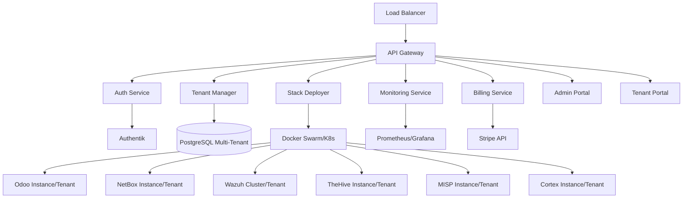

# 🚀 NEO_STACK PLATFORM v3.0 - PLATAFORMA SAAS

**Versão**: 3.0.0
**Data**: 06 de Dezembro de 2024
**Fase**: Desenvolvimento (Q2 2025)
**Status**: 🚧 Em Desenvolvimento

---

## 🎯 VISÃO GERAL

A **NEO_STACK Platform v3.0** é uma plataforma SaaS completa e escalável que transforma o NEO_NETBOX_ODOO_STACK em um serviço multi-tenant de classe mundial. Com arquitetura cloud-native, a plataforma oferece provisionamento automático, billing integrado e portais de gestão para múltiplos tenants.

---

## 🏗️ ARQUITETURA DA PLATAFORMA



---

## 📦 COMPONENTES DA PLATAFORMA

### **Core Services**

#### 1. **API Gateway** (Kong/Traefik)
- **Diretório**: `api-gateway/`
- **Função**: Routing, Rate Limiting, Load Balancing
- **Status**: 🚧 Em desenvolvimento
- **Prazo**: 10 dias

#### 2. **Auth Service** (Authentik)
- **Diretório**: `auth-service/`
- **Função**: SSO, Multi-tenant Auth, RBAC
- **Status**: 🚧 Em desenvolvimento
- **Prazo**: 7 dias

#### 3. **Tenant Manager** (PostgreSQL)
- **Diretório**: `tenant-manager/`
- **Função**: Isolamento de dados, Resource allocation
- **Status**: 🚧 Em desenvolvimento
- **Prazo**: 12 dias

#### 4. **Stack Deployer** (Terraform)
- **Diretório**: `stack-deployer/`
- **Função**: IaC para tenants, Automated provisioning
- **Status**: 🚧 Em desenvolvimento
- **Prazo**: 15 dias

#### 5. **Monitoring Service** (Prometheus/Grafana)
- **Diretório**: `monitoring/`
- **Função**: Observabilidade, Métricas, Alertas
- **Status**: 📋 Planejado
- **Prazo**: 8 dias

#### 6. **Billing Service** (Stripe)
- **Diretório**: `billing/`
- **Função**: Cobrança, Usage-based billing
- **Status**: 📋 Planejado
- **Prazo**: 10 dias

#### 7. **Admin Portal** (React/Vue.js)
- **Diretório**: `admin-portal/`
- **Função**: Gestão da plataforma, Tenant management
- **Status**: 📋 Planejado
- **Prazo**: 12 dias

#### 8. **Tenant Portal** (React/Vue.js)
- **Diretório**: `tenant-portal/`
- **Função**: Self-service, Resource management
- **Status**: 📋 Planejado
- **Prazo**: 10 dias

---

## 🚀 CRONOGRAMA v3.0

### **Sprint 9-10: SaaS Core (Abril 2025)**
- ✅ **Preparação** (hoje)
- 🚧 **API Gateway** - 10 dias
- 🚧 **Auth Service** - 7 dias
- 🚧 **Tenant Manager** - 12 dias
- 🚧 **Stack Deployer** - 15 dias

### **Sprint 11-12: SaaS Portais + Billing (Maio 2025)**
- 📋 **Monitoring Service** - 8 dias
- 📋 **Billing Service** - 10 dias
- 📋 **Admin Portal** - 12 dias
- 📋 **Tenant Portal** - 10 dias

### **Sprint 13-14: Certificação (Maio-Jun 2025)**
- 📋 **Currículo de Certificação** - 10 dias
- 📋 **Materiais de Estudo** (20 vídeos) - 15 dias
- 📋 **Plataforma de Exame** - 20 dias
- 📋 **Simulados** (4 exames) - 10 dias

### **Sprint 15-16: Analytics + ML (Junho 2025)**
- 📋 **Data Pipeline** - 15 dias
- 📋 **Dashboards** (6 dashboards) - 10 dias
- 📋 **ML Models** (3+ modelos) - 20 dias
- 📋 **Deploy Final v3.0** - 5 dias

**Meta v3.0**: 30 de Junho de 2025 🎯

---

## 💰 PLANOS DE NEGÓCIO

| Plano | Preço/Mês | Recursos | Limites |
|-------|-----------|----------|---------|
| **Starter** | $299 | 1 stack completa | 100 endpoints |
| **Professional** | $799 | 1 stack + advanced | 500 endpoints |
| **Enterprise** | $1.999 | Multi-stack + custom | Ilimitado |
| **On-Premise** | Custom | Stack privada | - |

---

## 🎓 RECURSOS PRINCIPAIS

### **Multi-Tenant Architecture**
- Isolamento completo de dados por tenant
- Resource allocation automática
- Scaling baseado em demanda
- Backup e recovery por tenant

### **Automated Provisioning**
- Deploy de stack completa em < 30 minutos
- Terraform + Ansible para IaC
- Docker Swarm/K8s para orchestration
- Configuração automatizada de todas as ferramentas

### **Billing Integration**
- Stripe para pagamentos
- Usage-based billing
- Planos flexíveis
- Invoice automático

### **Portais de Gestão**
- **Admin Portal**: Controle total da plataforma
- **Tenant Portal**: Self-service para clientes

---

## 🛠️ TECNOLOGIAS UTILIZADAS

### **Infraestrutura**
- **Container**: Docker, Kubernetes/Docker Swarm
- **Orchestration**: Terraform, Ansible
- **Database**: PostgreSQL (Multi-tenant)
- **Cache**: Redis
- **Message Queue**: RabbitMQ

### **Networking**
- **API Gateway**: Kong ou Traefik
- **Load Balancer**: NGINX/HAProxy
- **Service Mesh**: Istio (opcional)

### **Segurança**
- **Auth**: Authentik (SSO, SAML, OAuth2)
- **Vault**: HashiCorp Vault para secrets
- **TLS**: Let's Encrypt/ACME
- **WAF**: ModSecurity

### **Monitoring**
- **Metrics**: Prometheus
- **Visualization**: Grafana
- **Logging**: ELK Stack
- **Tracing**: Jaeger

### **Frontend**
- **Admin Portal**: React ou Vue.js
- **Tenant Portal**: React ou Vue.js
- **UI Library**: Ant Design ou Vuetify

---

## 📊 MÉTRICAS DE SUCESSO

### **Performance**
- [ ] < 30min tenant provisioning time
- [ ] 99.9% platform uptime
- [ ] < 2s API response time
- [ ] Auto-scaling em < 5 minutos

### **Business**
- [ ] 10+ tenants simultâneos
- [ ] 100% automated billing
- [ ] Multi-region deployment
- [ ] ROI > 300% em 12 meses

### **Quality**
- [ ] 90%+ test coverage
- [ ] 0 critical security vulnerabilities
- [ ] Documentation completa
- [ ] 100% bilíngue (PT-BR + ES-MX)

---

## 🔧 COMO CONTRIBUIR

### **Para Desenvolvedores**

```bash
# Clone o repositório
git clone https://github.com/neo-stack/platform.git
cd platform

# Configure o ambiente
cp .env.example .env
docker-compose up -d

# Execute os testes
make test

# Inicie o desenvolvimento
make dev
```

### **Padrões de Código**

- **Python**: Type hints obrigatórios, PEP 8
- **JavaScript**: ESLint + Prettier, TypeScript
- **Infraestrutura**: Terraform, Ansible
- **Documentação**: AI-First, bilíngue

---

## 📚 DOCUMENTAÇÃO

### **Componentes**
- **[API Gateway](api-gateway/README.md)** - Routing e rate limiting
- **[Auth Service](auth-service/README.md)** - Autenticação multi-tenant
- **[Tenant Manager](tenant-manager/README.md)** - Gestão de tenants
- **[Stack Deployer](stack-deployer/README.md)** - Provisionamento automático
- **[Monitoring](monitoring/README.md)** - Observabilidade
- **[Billing](billing/README.md)** - Cobrança e pagamentos
- **[Admin Portal](admin-portal/README.md)** - Portal administrativo
- **[Tenant Portal](tenant-portal/README.md)** - Portal do cliente

### **Arquitetura**
- **[ADR/](docs/adr/)** - Architecture Decision Records
- **[diagrams/](docs/diagrams/)** - Diagramas Mermaid
- **[runbooks/](docs/runbooks/)** - Procedimentos operacionais

---

## 🏆 EQUIPE DE DESENVOLVIMENTO

**Orquestrador Principal**: Claude Opus 4.5

**Agentes Especializados**:
- **AGENTE_SAAS** - Platform Architect (Authentik, Kong, Terraform)
- **AGENTE_INFRA** - Infrastructure (K8s, Docker, PostgreSQL)
- **AGENTE_SEC** - Security (Vault, TLS, WAF)
- **AGENTE_DEV** - Development (React/Vue, APIs, SDKs)
- **AGENTE_OPS** - Operations (Monitoring, Logging, Alerting)

---

## 📞 SUPORTE

- **Documentação**: [docs.neo-stack.com](https://docs.neo-stack.com)
- **Issues**: [GitHub Issues](https://github.com/neo-stack/platform/issues)
- **Discussions**: [GitHub Discussions](https://github.com/neo-stack/platform/discussions)
- **Email**: platform@neo-stack.com

---

## 📄 LICENÇA

**AGPL-3.0** - GNU Affero General Public License v3.0

---

**Status**: 🚧 **Em Desenvolvimento - Sprint 9-10**
**Próximo Marco**: Core Services Complete (Abril 2025)
**Lançamento v3.0**: 30 de Junho de 2025 🎯
