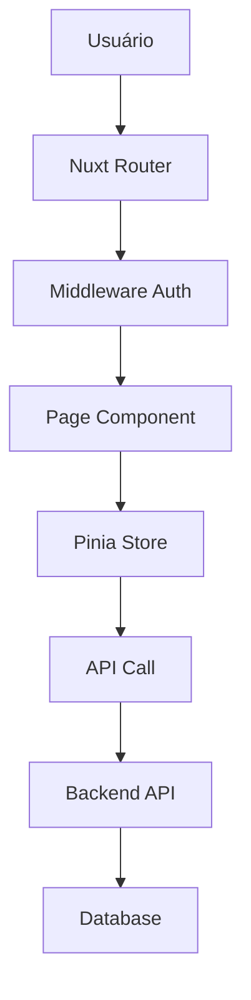

# 🖥️ Admin Portal - NEO_STACK Platform v3.0

## 📋 Índice

1. [Visão Geral](#visão-geral)
2. [Tecnologias](#tecnologias)
3. [Funcionalidades](#funcionalidades)
4. [Instalação](#instalação)
5. [Configuração](#configuração)
6. [Uso](#uso)
7. [Arquitetura](#arquitetura)
8. [API](#api)
9. [Deployment](#deployment)
10. [Contribuição](#contribuição)

---

## 🎯 Visão Geral

O **Admin Portal** é uma interface administrativa completa desenvolvida em Vue 3 + Nuxt 3 + Nuxt UI para o NEO_STACK Platform v3.0. Ele fornece uma interface moderna e intuitiva para administradores gerenciarem tenants, billing, usuários, planos e toda a infraestrutura da plataforma.

### ✨ Características Principais

- **🎨 Interface Moderna**: Desenvolvido com Nuxt UI e Tailwind CSS
- **⚡ Performance**: Renderização server-side com Nuxt 3
- **📱 Responsivo**: Interface adaptável a todos os dispositivos
- **🔐 Seguro**: Autenticação JWT e autorização baseada em roles
- **📊 Dashboards**: Métricas em tempo real com gráficos interativos
- **🌍 Multi-idioma**: Suporte a PT-BR e ES-MX
- **🎯 TypeScript**: Type safety completo
- **📦 State Management**: Pinia para gerenciamento de estado

---

## 🚀 Tecnologias

### Stack Principal

| Tecnologia | Versão | Descrição |
|------------|--------|-----------|
| **Nuxt** | 3.10+ | Framework Vue full-stack |
| **Vue** | 3.4+ | Framework JavaScript reativo |
| **Nuxt UI** | 2.14+ | Biblioteca de componentes |
| **Tailwind CSS** | 3.4+ | Framework CSS utility-first |
| **TypeScript** | 5.3+ | Superset JavaScript tipado |
| **Pinia** | 2.1+ | State management |
| **VueUse** | 10.7+ | Composables utilitários |

### Ferramentas de Desenvolvimento

| Ferramenta | Propósito |
|------------|-----------|
| Vite | Build tool e dev server |
| ESLint | Linting de código |
| Prettier | Formatação de código |
| Vitest | Testes unitários |
| Docker | Containerização |

---

## 🎯 Funcionalidades

### 1. **Dashboard Principal**
- Métricas de receita em tempo real
- Gráficos de crescimento
- Status de subscriptions
- Atividade recente de tenants
- Alertas e notificações

### 2. **Gerenciamento de Tenants**
- Listagem completa de tenants
- Criação e edição de tenants
- Filtros por status, data, nome
- Ações em lote
- Detalhes completos do tenant
- Histórico de atividades

### 3. **Gerenciamento de Billing**
- **Planos**: Criar, editar, excluir planos de assinatura
- **Subscriptions**: Visualizar e gerenciar assinaturas ativas
- **Invoices**: Gerar, visualizar e exportar faturas
- **Pagamentos**: Acompanhar status de pagamentos
- **Coupons**: Gerenciar cupons de desconto
- **Relatórios**: Análise de receita e métricas

### 4. **Gerenciamento de Usuários**
- Listar usuários administrativos
- Criar e editar usuários
- Gerenciar permissões e roles
- Ativação/desativação de contas

### 5. **Configurações**
- Configurações da plataforma
- Integrações com serviços externos
- Configurações de email e notificações
- Parâmetros de billing
- Configurações de segurança

### 6. **Analytics**
- Métricas detalhadas de uso
- Relatórios de receita
- Análise de churn
- Tendências de crescimento
- Exportação de dados

---

## 📦 Instalação

### Pré-requisitos

- Node.js 18+
- npm ou yarn
- Docker (opcional)
- Git

### Instalação Rápida

```bash
# Clone o repositório
git clone https://github.com/your-org/neo_netbox_odoo_stack.git
cd neo_netbox_odoo_stack/platform/admin-portal

# Execute o setup automático
chmod +x scripts/setup.sh
./scripts/setup.sh
```

### Instalação Manual

```bash
# 1. Instalar dependências
npm install

# 2. Configurar variáveis de ambiente
cp .env.example .env
# Editar .env com suas configurações

# 3. Executar em modo desenvolvimento
npm run dev

# 4. Build para produção
npm run build
npm run preview
```

### Instalação com Docker

```bash
# Build e start dos containers
cd docker
docker-compose up -d

# Verificar logs
docker-compose logs -f admin-portal
```

---

## ⚙️ Configuração

### Variáveis de Ambiente

```env
# URLs dos Serviços
API_BASE_URL=http://localhost:8000
AUTH_URL=http://localhost:8080
BILLING_URL=http://localhost:8000
NETBOX_URL=http://localhost:8001
ODOO_URL=http://localhost:8069

# Aplicação
NODE_ENV=production
NUXT_PORT=3002

# Segurança
SESSION_SECRET=your-session-secret-change-me

# Docker
POSTGRES_PASSWORD=secure_password
REDIS_PASSWORD=redis_password
GRAFANA_USER=admin
GRAFANA_PASSWORD=admin_password
```

### Configuração do Nuxt

```typescript
// nuxt.config.ts
export default defineNuxtConfig({
  modules: [
    '@nuxt/ui',
    '@nuxtjs/tailwindcss',
    '@pinia/nuxt',
    '@vueuse/nuxt',
  ],

  runtimeConfig: {
    public: {
      apiBase: process.env.API_BASE_URL,
      authUrl: process.env.AUTH_URL,
      billingUrl: process.env.BILLING_URL,
    }
  },

  // Configurações de build
  build: {
    transpile: ['vueuc'],
  },

  // Configurações de CSS
  css: ['~/assets/css/main.css'],

  // Configurações de app
  app: {
    head: {
      title: 'NEO_STACK Admin Portal',
      meta: [
        { charset: 'utf-8' },
        { name: 'viewport', content: 'width=device-width, initial-scale=1' },
      ],
    },
  },
})
```

### Configuração do Tailwind

```javascript
// tailwind.config.js
module.exports = {
  content: [
    './components/**/*.{js,vue,ts}',
    './layouts/**/*.vue',
    './pages/**/*.vue',
    './plugins/**/*.{js,ts}',
    './app.vue',
  ],
  theme: {
    extend: {
      colors: {
        primary: {
          // Definição da paleta de cores
        },
      },
    },
  },
  plugins: [
    require('@tailwindcss/forms'),
    require('@tailwindcss/typography'),
  ],
}
```

---

## 📖 Uso

### Desenvolvimento

```bash
# Servidor de desenvolvimento
npm run dev

# Executar com hot reload
npm run dev -- --host

# Type checking
npm run type-check

# Linting
npm run lint
npm run lint:fix
```

### Build e Deploy

```bash
# Build para produção
npm run build

# Preview da build
npm run preview

# Gerar site estático (se necessário)
npm run generate
```

### Estrutura do Projeto

```
admin-portal/
├── assets/              # Assets estáticos (CSS, imagens)
│   └── css/
│       └── main.css     # Estilos globais
├── components/          # Componentes Vue reutilizáveis
│   ├── auth/            # Componentes de autenticação
│   ├── dashboard/       # Componentes do dashboard
│   ├── tenants/         # Componentes de tenants
│   ├── billing/         # Componentes de billing
│   ├── users/           # Componentes de usuários
│   └── layout/          # Componentes de layout
├── composables/         # Composables Vue
├── layouts/             # Layouts de página
│   └── default.vue      # Layout principal
├── middleware/          # Middleware de autenticação
├── pages/               # Páginas da aplicação
│   ├── auth/
│   │   └── login.vue    # Página de login
│   ├── index.vue        # Dashboard
│   ├── tenants/
│   │   └── index.vue    # Gestão de tenants
│   └── billing/
│       └── index.vue    # Gestão de billing
├── plugins/             # Plugins Nuxt
├── public/              # Arquivos públicos
├── server/              # API routes (se necessário)
│   └── api/
├── stores/              # Stores Pinia
│   ├── auth.ts          # Store de autenticação
│   ├── tenants.ts       # Store de tenants
│   └── billing.ts       # Store de billing
├── types/               # Definições TypeScript
│   └── index.ts         # Tipos globais
├── utils/               # Utilitários
├── nuxt.config.ts       # Configuração do Nuxt
├── package.json
└── tailwind.config.js   # Configuração do Tailwind
```

---

## 🏗️ Arquitetura

### Fluxo de Dados



### State Management (Pinia)

```typescript
// stores/auth.ts
export const useAuthStore = defineStore('auth', {
  state: (): AuthState => ({
    user: null,
    token: null,
    isAuthenticated: false,
    loading: false,
  }),

  getters: {
    isAdmin: (state) => state.user?.role === 'admin',
  },

  actions: {
    async login(email: string, password: string) {
      // Implementação
    },
  },
})
```

### Componentes UI

```vue
<!-- Exemplo de componente -->
<template>
  <UCard>
    <template #header>
      <h3 class="text-lg font-semibold">{{ title }}</h3>
    </template>

    <div class="space-y-4">
      <UFormGroup label="Email">
        <UInput v-model="email" />
      </UFormGroup>
    </div>

    <template #footer>
      <UButton @click="handleSubmit">Submit</UButton>
    </template>
  </UCard>
</template>
```

---

## 🔌 API

### Endpoints Principais

#### Autenticação

```
POST /api/auth/login
POST /api/auth/logout
GET  /api/auth/me
```

#### Tenants

```
GET    /api/admin/tenants
GET    /api/admin/tenants/:id
POST   /api/admin/tenants
PUT    /api/admin/tenants/:id
DELETE /api/admin/tenants/:id
```

#### Billing

```
GET  /api/admin/billing/stats
GET  /api/admin/billing/plans
POST /api/admin/billing/plans
GET  /api/admin/billing/subscriptions
GET  /api/admin/billing/invoices
POST /api/admin/billing/invoices
```

### Exemplo de Chamada

```typescript
// composables/useApi.ts
export const useApi = () => {
  const config = useRuntimeConfig()

  const get = async <T>(url: string): Promise<T> => {
    return await $fetch<T>(`${config.public.apiBase}${url}`, {
      headers: {
        Authorization: `Bearer ${useAuthStore().token}`,
      },
    })
  }

  return { get }
}
```

---

## 🚀 Deployment

### Docker

```bash
# Build da imagem
docker build -t neo-stack-admin-portal .

# Executar container
docker run -p 3002:3002 neo-stack-admin-portal
```

### Docker Compose

```bash
# Deploy completo
cd docker
docker-compose up -d

# Verificar status
docker-compose ps
```

### Produção

```bash
# Build otimizada
npm run build

# Servir com PM2
pm2 start .output/server/index.mjs --name admin-portal

# Ou usar Nginx para servir arquivos estáticos
```

### Variáveis de Produção

```env
NODE_ENV=production
API_BASE_URL=https://api.platform.local
AUTH_URL=https://auth.platform.local
SESSION_SECRET=production-secret-change-me
```

---

## 🔒 Segurança

### Autenticação

- JWT tokens para autenticação
- Refresh tokens para renovação
- Logout automático em caso de token expirado

### Autorização

- Middleware de autenticação em todas as rotas protegidas
- Verificação de roles (admin/user)
- Guards de rota baseados em permissões

### Proteção CSRF

- Tokens CSRF em formulários
- Validação no backend
- Headers de segurança

### Headers de Segurança

```nginx
# Nginx
add_header X-Frame-Options DENY;
add_header X-Content-Type-Options nosniff;
add_header X-XSS-Protection "1; mode=block";
add_header Strict-Transport-Security "max-age=31536000; includeSubDomains";
```

---

## 🧪 Testes

```bash
# Executar testes unitários
npm run test

# Executar testes com UI
npm run test:ui

# Coverage
npm run test:coverage
```

---

## 📊 Monitoramento

### Health Checks

```
GET /api/health
```

### Métricas

- Tempo de resposta das páginas
- Taxa de erros
- Utilização de memória
- Número de usuários ativos

### Logs

- Logs estruturados em JSON
- Níveis: debug, info, warn, error
- Integração com ELK Stack (opcional)

---

## 🔧 Troubleshooting

### Problemas Comuns

#### 1. Erro de Conexão com API

```bash
# Verificar se a API está rodando
curl http://localhost:8000/health

# Verificar configuração
cat .env | grep API_BASE_URL
```

#### 2. Build Fails

```bash
# Limpar cache
rm -rf .nuxt .output node_modules
npm install
npm run build
```

#### 3. Problemas de Autenticação

```bash
# Verificar token no localStorage
# Limpar dados de autenticação
localStorage.clear()
```

### Logs

```bash
# Logs do Nuxt (desenvolvimento)
npm run dev

# Logs do Docker
docker-compose logs -f admin-portal

# Logs do Nginx
docker-compose logs -f nginx
```

---

## 🤝 Contribuição

### Desenvolvimento

```bash
# Setup ambiente dev
npm install

# Executar em modo desenvolvimento
npm run dev

# Executar testes
npm run test

# Linting
npm run lint
npm run lint:fix

# Type checking
npm run type-check
```

### Convenções

- **Commits**: Use Conventional Commits
- **Branches**: feature/, bugfix/, hotfix/
- **Código**: ESLint + Prettier
- **Types**: TypeScript obrigatório

### Pull Request

1. Fork o repositório
2. Criar branch: `git checkout -b feature/nova-funcionalidade`
3. Commit: `git commit -m "feat: adicionar..."`
4. Push: `git push origin feature/nova-funcionalidade`
5. Abrir PR com descrição detalhada

---

## 📄 Licença

Este projeto está licenciado sob a MIT License - veja o arquivo [LICENSE](LICENSE) para detalhes.

---

## 📞 Suporte

- **Email**: admin-support@platform.local
- **Slack**: #admin-portal
- **Documentação**: http://localhost:3002/docs
- **Issues**: https://github.com/your-org/neo_netbox_odoo_stack/issues

---

## 🙏 Agradecimentos

- Vue.js pela framework reativa
- Nuxt pela solução full-stack
- Nuxt UI pelos componentes
- Tailwind CSS pelo styling
- Pinia pelo state management
- Comunidade open source

---

**Desenvolvido com ❤️ para o NEO_STACK Platform v3.0**
