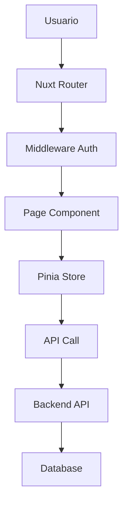

# 🖥️ Admin Portal - NEO_STACK Platform v3.0

## 📋 Índice

1. [Resumen General](#resumen-general)
2. [Tecnologías](#tecnologías)
3. [Funcionalidades](#funcionalidades)
4. [Instalación](#instalación)
5. [Configuración](#configuración)
6. [Uso](#uso)
7. [Arquitectura](#arquitectura)
8. [API](#api)
9. [Deployment](#deployment)
10. [Contribución](#contribución)

---

## 🎯 Resumen General

El **Admin Portal** es una interfaz administrativa completa desarrollada en Vue 3 + Nuxt 3 + Nuxt UI para NEO_STACK Platform v3.0. Proporciona una interfaz moderna e intuitiva para que los administradores gestionen tenants, facturación, usuarios, planes y toda la infraestructura de la plataforma.

### ✨ Características Principales

- **🎨 Interfaz Moderna**: Desarrollado con Nuxt UI y Tailwind CSS
- **⚡ Rendimiento**: Renderizado del lado del servidor con Nuxt 3
- **📱 Responsivo**: Interfaz adaptable a todos los dispositivos
- **🔐 Seguro**: Autenticación JWT y autorización basada en roles
- **📊 Dashboards**: Métricas en tiempo real con gráficos interactivos
- **🌍 Multi-idioma**: Soporte para PT-BR y ES-MX
- **🎯 TypeScript**: Type safety completo
- **📦 State Management**: Pinia para gestión de estado

---

## 🚀 Tecnologías

### Stack Principal

| Tecnología | Versión | Descripción |
|------------|---------|-------------|
| **Nuxt** | 3.10+ | Framework Vue full-stack |
| **Vue** | 3.4+ | Framework JavaScript reactivo |
| **Nuxt UI** | 2.14+ | Biblioteca de componentes |
| **Tailwind CSS** | 3.4+ | Framework CSS utility-first |
| **TypeScript** | 5.3+ | Superset JavaScript tipado |
| **Pinia** | 2.1+ | State management |
| **VueUse** | 10.7+ | Composables utilitarios |

### Herramientas de Desarrollo

| Herramienta | Propósito |
|-------------|-----------|
| Vite | Build tool y dev server |
| ESLint | Linting de código |
| Prettier | Formateo de código |
| Vitest | Tests unitarios |
| Docker | Containerización |

---

## 🎯 Funcionalidades

### 1. **Dashboard Principal**
- Métricas de ingresos en tiempo real
- Gráficos de crecimiento
- Estado de suscripciones
- Actividad reciente de tenants
- Alertas y notificaciones

### 2. **Gestión de Tenants**
- Listado completo de tenants
- Creación y edición de tenants
- Filtros por estado, fecha, nombre
- Acciones en lote
- Detalles completos del tenant
- Historial de actividades

### 3. **Gestión de Facturación**
- **Planes**: Crear, editar, eliminar planes de suscripción
- **Suscripciones**: Ver y gestionar suscripciones activas
- **Facturas**: Generar, ver y exportar facturas
- **Pagos**: Seguimiento del estado de pagos
- **Cupones**: Gestión de cupones de descuento
- **Reportes**: Análisis de ingresos y métricas

### 4. **Gestión de Usuarios**
- Listar usuarios administrativos
- Crear y editar usuarios
- Gestionar permisos y roles
- Activación/desactivación de cuentas

### 5. **Configuraciones**
- Configuraciones de la plataforma
- Integraciones con servicios externos
- Configuraciones de email y notificaciones
- Parámetros de facturación
- Configuraciones de seguridad

### 6. **Analytics**
- Métricas detalladas de uso
- Reportes de ingresos
- Análisis de churn
- Tendencias de crecimiento
- Exportación de datos

---

## 📦 Instalación

### Prerrequisitos

- Node.js 18+
- npm o yarn
- Docker (opcional)
- Git

### Instalación Rápida

```bash
# Clonar el repositorio
git clone https://github.com/your-org/neo_netbox_odoo_stack.git
cd neo_netbox_odoo_stack/platform/admin-portal

# Ejecutar setup automático
chmod +x scripts/setup.sh
./scripts/setup.sh
```

### Instalación Manual

```bash
# 1. Instalar dependencias
npm install

# 2. Configurar variables de entorno
cp .env.example .env
# Editar .env con tus configuraciones

# 3. Ejecutar en modo desarrollo
npm run dev

# 4. Build para producción
npm run build
npm run preview
```

### Instalación con Docker

```bash
# Build y start de los containers
cd docker
docker-compose up -d

# Verificar logs
docker-compose logs -f admin-portal
```

---

## ⚙️ Configuración

### Variables de Entorno

```env
# URLs de los Servicios
API_BASE_URL=http://localhost:8000
AUTH_URL=http://localhost:8080
BILLING_URL=http://localhost:8000
NETBOX_URL=http://localhost:8001
ODOO_URL=http://localhost:8069

# Aplicación
NODE_ENV=production
NUXT_PORT=3002

# Seguridad
SESSION_SECRET=your-session-secret-change-me

# Docker
POSTGRES_PASSWORD=secure_password
REDIS_PASSWORD=redis_password
GRAFANA_USER=admin
GRAFANA_PASSWORD=admin_password
```

### Configuración de Nuxt

```typescript
// nuxt.config.ts
export default defineNuxtConfig({
  modules: [
    '@nuxt/ui',
    '@nuxtjs/tailwindcss',
    '@pinia/nuxt',
    '@vueuse/nuxt',
  ],

  runtimeConfig: {
    public: {
      apiBase: process.env.API_BASE_URL,
      authUrl: process.env.AUTH_URL,
      billingUrl: process.env.BILLING_URL,
    }
  },

  // Configuraciones de build
  build: {
    transpile: ['vueuc'],
  },

  // Configuraciones de CSS
  css: ['~/assets/css/main.css'],

  // Configuraciones de app
  app: {
    head: {
      title: 'NEO_STACK Admin Portal',
      meta: [
        { charset: 'utf-8' },
        { name: 'viewport', content: 'width=device-width, initial-scale=1' },
      ],
    },
  },
})
```

### Configuración de Tailwind

```javascript
// tailwind.config.js
module.exports = {
  content: [
    './components/**/*.{js,vue,ts}',
    './layouts/**/*.vue',
    './pages/**/*.vue',
    './plugins/**/*.{js,ts}',
    './app.vue',
  ],
  theme: {
    extend: {
      colors: {
        primary: {
          // Definición de paleta de colores
        },
      },
    },
  },
  plugins: [
    require('@tailwindcss/forms'),
    require('@tailwindcss/typography'),
  ],
}
```

---

## 📖 Uso

### Desarrollo

```bash
# Servidor de desarrollo
npm run dev

# Ejecutar con hot reload
npm run dev -- --host

# Type checking
npm run type-check

# Linting
npm run lint
npm run lint:fix
```

### Build y Deploy

```bash
# Build para producción
npm run build

# Preview del build
npm run preview

# Generar sitio estático (si es necesario)
npm run generate
```

### Estructura del Proyecto

```
admin-portal/
├── assets/              # Assets estáticos (CSS, imágenes)
│   └── css/
│       └── main.css     # Estilos globales
├── components/          # Componentes Vue reutilizables
│   ├── auth/            # Componentes de autenticación
│   ├── dashboard/       # Componentes del dashboard
│   ├── tenants/         # Componentes de tenants
│   ├── billing/         # Componentes de facturación
│   ├── users/           # Componentes de usuarios
│   └── layout/          # Componentes de layout
├── composables/         # Composables Vue
├── layouts/             # Layouts de página
│   └── default.vue      # Layout principal
├── middleware/          # Middleware de autenticación
├── pages/               # Páginas de la aplicación
│   ├── auth/
│   │   └── login.vue    # Página de login
│   ├── index.vue        # Dashboard
│   ├── tenants/
│   │   └── index.vue    # Gestión de tenants
│   └── billing/
│       └── index.vue    # Gestión de facturación
├── plugins/             # Plugins Nuxt
├── public/              # Archivos públicos
├── server/              # API routes (si es necesario)
│   └── api/
├── stores/              # Stores Pinia
│   ├── auth.ts          # Store de autenticación
│   ├── tenants.ts       # Store de tenants
│   └── billing.ts       # Store de facturación
├── types/               # Definiciones TypeScript
│   └── index.ts         # Tipos globales
├── utils/               # Utilitarios
├── nuxt.config.ts       # Configuración de Nuxt
├── package.json
└── tailwind.config.js   # Configuración de Tailwind
```

---

## 🏗️ Arquitectura

### Flujo de Datos



### State Management (Pinia)

```typescript
// stores/auth.ts
export const useAuthStore = defineStore('auth', {
  state: (): AuthState => ({
    user: null,
    token: null,
    isAuthenticated: false,
    loading: false,
  }),

  getters: {
    isAdmin: (state) => state.user?.role === 'admin',
  },

  actions: {
    async login(email: string, password: string) {
      // Implementación
    },
  },
})
```

### Componentes UI

```vue
<!-- Ejemplo de componente -->
<template>
  <UCard>
    <template #header>
      <h3 class="text-lg font-semibold">{{ title }}</h3>
    </template>

    <div class="space-y-4">
      <UFormGroup label="Email">
        <UInput v-model="email" />
      </UFormGroup>
    </div>

    <template #footer>
      <UButton @click="handleSubmit">Submit</UButton>
    </template>
  </UCard>
</template>
```

---

## 🔌 API

### Endpoints Principales

#### Autenticación

```
POST /api/auth/login
POST /api/auth/logout
GET  /api/auth/me
```

#### Tenants

```
GET    /api/admin/tenants
GET    /api/admin/tenants/:id
POST   /api/admin/tenants
PUT    /api/admin/tenants/:id
DELETE /api/admin/tenants/:id
```

#### Facturación

```
GET  /api/admin/billing/stats
GET  /api/admin/billing/plans
POST /api/admin/billing/plans
GET  /api/admin/billing/subscriptions
GET  /api/admin/billing/invoices
POST /api/admin/billing/invoices
```

### Ejemplo de Llamada

```typescript
// composables/useApi.ts
export const useApi = () => {
  const config = useRuntimeConfig()

  const get = async <T>(url: string): Promise<T> => {
    return await $fetch<T>(`${config.public.apiBase}${url}`, {
      headers: {
        Authorization: `Bearer ${useAuthStore().token}`,
      },
    })
  }

  return { get }
}
```

---

## 🚀 Deployment

### Docker

```bash
# Build de la imagen
docker build -t neo-stack-admin-portal .

# Ejecutar container
docker run -p 3002:3002 neo-stack-admin-portal
```

### Docker Compose

```bash
# Deploy completo
cd docker
docker-compose up -d

# Verificar estado
docker-compose ps
```

### Producción

```bash
# Build optimizada
npm run build

# Servir con PM2
pm2 start .output/server/index.mjs --name admin-portal

# O usar Nginx para servir archivos estáticos
```

### Variables de Producción

```env
NODE_ENV=production
API_BASE_URL=https://api.platform.local
AUTH_URL=https://auth.platform.local
SESSION_SECRET=production-secret-change-me
```

---

## 🔒 Seguridad

### Autenticación

- Tokens JWT para autenticación
- Refresh tokens para renovación
- Logout automático en caso de token expirado

### Autorización

- Middleware de autenticación en todas las rutas protegidas
- Verificación de roles (admin/user)
- Guards de ruta basados en permisos

### Protección CSRF

- Tokens CSRF en formularios
- Validación en backend
- Headers de seguridad

### Headers de Seguridad

```nginx
# Nginx
add_header X-Frame-Options DENY;
add_header X-Content-Type-Options nosniff;
add_header X-XSS-Protection "1; mode=block";
add_header Strict-Transport-Security "max-age=31536000; includeSubDomains";
```

---

## 🧪 Tests

```bash
# Ejecutar tests unitarios
npm run test

# Ejecutar tests con UI
npm run test:ui

# Coverage
npm run test:coverage
```

---

## 📊 Monitoreo

### Health Checks

```
GET /api/health
```

### Métricas

- Tiempo de respuesta de páginas
- Tasa de errores
- Utilización de memoria
- Número de usuarios activos

### Logs

- Logs estructurados en JSON
- Niveles: debug, info, warn, error
- Integración con ELK Stack (opcional)

---

## 🔧 Solución de Problemas

### Problemas Comunes

#### 1. Error de Conexión con API

```bash
# Verificar si la API está corriendo
curl http://localhost:8000/health

# Verificar configuración
cat .env | grep API_BASE_URL
```

#### 2. Build Falla

```bash
# Limpiar cache
rm -rf .nuxt .output node_modules
npm install
npm run build
```

#### 3. Problemas de Autenticación

```bash
# Verificar token en localStorage
# Limpiar datos de autenticación
localStorage.clear()
```

### Logs

```bash
# Logs de Nuxt (desarrollo)
npm run dev

# Logs de Docker
docker-compose logs -f admin-portal

# Logs de Nginx
docker-compose logs -f nginx
```

---

## 🤝 Contribución

### Desarrollo

```bash
# Setup ambiente dev
npm install

# Ejecutar en modo desarrollo
npm run dev

# Ejecutar tests
npm run test

# Linting
npm run lint
npm run lint:fix

# Type checking
npm run type-check
```

### Convenciones

- **Commits**: Use Conventional Commits
- **Branches**: feature/, bugfix/, hotfix/
- **Código**: ESLint + Prettier
- **Types**: TypeScript obligatorio

### Pull Request

1. Fork del repositorio
2. Crear branch: `git checkout -b feature/nueva-funcionalidad`
3. Commit: `git commit -m "feat: agregar..."`
4. Push: `git push origin feature/nueva-funcionalidad`
5. Abrir PR con descripción detallada

---

## 📄 Licencia

Este proyecto está licenciado bajo la MIT License - ver el archivo [LICENSE](LICENSE) para detalles.

---

## 📞 Soporte

- **Email**: admin-support@platform.local
- **Slack**: #admin-portal
- **Documentación**: http://localhost:3002/docs
- **Issues**: https://github.com/your-org/neo_netbox_odoo_stack/issues

---

## 🙏 Agradecimientos

- Vue.js por el framework reactivo
- Nuxt por la solución full-stack
- Nuxt UI por los componentes
- Tailwind CSS por el styling
- Pinia por el state management
- Comunidad open source

---

**Desarrollado con ❤️ para NEO_STACK Platform v3.0**
