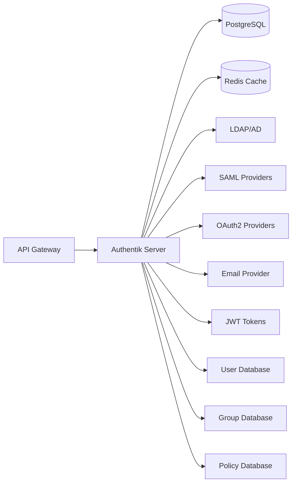

# 🔐 Auth Service (Authentik) - v3.0

**Componente**: Auth Service
**Tecnologia**: Authentik
**Status**: 🚧 Em Desenvolvimento
**Prazo**: 7 dias
**Versão**: 1.0.0

---

## 🎯 VISÃO GERAL

O **Auth Service** baseado em **Authentik** é responsável pela autenticação e autorização multi-tenant da plataforma NEO_STACK v3.0. Oferece SSO, RBAC, e integrações com múltiplos provedores de identidade.

---

## 🏗️ ARQUITETURA



---

## 🚀 FUNCIONALIDADES

### **Core Features**

1. **Multi-Tenant Authentication**
   - Isolamento por tenant
   - Custom branding por tenant
   - Tenant-specific policies

2. **SSO (Single Sign-On)**
   - SAML 2.0
   - OAuth 2.0 / OpenID Connect
   - LDAP / Active Directory
   - SCIM 2.0

3. **RBAC (Role-Based Access Control)**
   - Custom roles
   - Permission inheritance
   - Policy-based access
   - Group management

4. **User Management**
   - Self-registration
   - Password policies
   - MFA (TOTP, WebAuthn)
   - User lifecycle

5. **API Integration**
   - REST API
   - GraphQL API
   - Webhook support
   - Rate limiting

---

## 📦 TECNOLOGIAS

### **Authentik Components**

1. **Core Server**
   - Django-based
   - Python 3.11+
   - PostgreSQL database
   - Redis cache

2. **Workers**
   - Background tasks
   - Email sending
   - LDAP sync
   - SCIM provisioning

3. **Proxy**
   - Reverse proxy
   - SSO injection
   - Header injection

---

## 🛠️ IMPLEMENTAÇÃO

### **Estrutura do Projeto**

```
auth-service/
├── docker/
│   ├── docker-compose.yml
│   └── authentik.yml
├── config/
│   ├── authentik.yml
│   ├── postgresql.conf
│   └── redis.conf
├── tenants/
│   ├── tenant1/
│   │   ├── brand/
│   │   ├── policies/
│   │   └── providers/
│   └── tenant2/
├── scripts/
│   ├── setup.sh
│   ├── create-tenant.sh
│   └── backup.sh
├── api/
│   ├── openapi.yaml
│   └── sdk/
├── tests/
│   ├── unit/
│   ├── integration/
│   └── e2e/
├── docs/
│   ├── api.md
│   ├── configuration.md
│   └── multi-tenant.md
└── README.md
```

### **Docker Compose**

```yaml
version: '3.8'

services:
  postgresql:
    image: postgres:13-alpine
    environment:
      POSTGRES_USER: authentik
      POSTGRES_PASSWORD: authentik
      POSTGRES_DB: authentik
    volumes:
      - postgresql_data:/var/lib/postgresql/data
    healthcheck:
      test: ["CMD-SHELL", "pg_isready -U authentik"]
      interval: 10s
      timeout: 5s
      retries: 5

  redis:
    image: redis:7-alpine
    command: redis-server --appendonly yes --requirepass redis
    volumes:
      - redis_data:/data
    healthcheck:
      test: ["CMD", "redis-cli", "ping"]
      interval: 10s
      timeout: 5s
      retries: 3

  authentik-server:
    image: ghcr.io/goauthentik/server:latest
    environment:
      AUTHENTIK_SECRET_KEY: ${AUTHENTIK_SECRET_KEY}
      AUTHENTIK_DB_USER: authentik
      AUTHENTIK_DB_PASSWORD: authentik
      AUTHENTIK_DB_NAME: authentik
      AUTHENTIK_DB_HOST: postgresql
      AUTHENTIK_REDIS_HOST: redis
      AUTHENTIK_REDIS_PASSWORD: redis
    volumes:
      - authentik_media:/media
      - authentik_custom:/custom
    ports:
      - "9000:9000"  # Server
      - "9443:9443"  # Server SSL
    depends_on:
      postgresql:
        condition: service_healthy
      redis:
        condition: service_healthy
    restart: unless-stopped

  authentik-worker:
    image: ghcr.io/goauthentik/server:latest
    environment:
      AUTHENTIK_SECRET_KEY: ${AUTHENTIK_SECRET_KEY}
      AUTHENTIK_DB_USER: authentik
      AUTHENTIK_DB_PASSWORD: authentik
      AUTHENTIK_DB_NAME: authentik
      AUTHENTIK_DB_HOST: postgresql
      AUTHENTIK_REDIS_HOST: redis
      AUTHENTIK_REDIS_PASSWORD: redis
      AUTHENTIK_WORKERS: 2
    volumes:
      - authentik_media:/media
      - authentik_custom:/custom
    depends_on:
      postgresql:
        condition: service_healthy
      redis:
        condition: service_healthy
    restart: unless-stopped

volumes:
  postgresql_data:
  redis_data:
  authentik_media:
  authentik_custom:
```

---

## 🏢 MULTI-TENANT CONFIGURATION

### **Tenant Isolation**

```yaml
# config/tenants.yml
tenants:
  tenant1:
    domain: tenant1.platform.local
    slug: tenant1
    branding:
      logo: /media/tenant1/logo.png
      primary_color: "#1f77b4"
    policies:
      - name: "Tenant1 Admin Policy"
        expression: "user.attributes.tenant_id == 'tenant1'"
    providers:
      - type: oauth2
        name: "Tenant1 Provider"
        client_id: "tenant1_client"
      - type: saml
        name: "Tenant1 SAML"
        acs_url: "https://tenant1.example.com/acs/"

  tenant2:
    domain: tenant2.platform.local
    slug: tenant2
    branding:
      logo: /media/tenant2/logo.png
      primary_color: "#ff7f0e"
    policies:
      - name: "Tenant2 Admin Policy"
        expression: "user.attributes.tenant_id == 'tenant2'"
```

### **Policy-Based Access Control**

```python
# Tenant Isolation Policy
def tenant_isolation_policy(user, request):
    """Ensure users only access their own tenant resources"""
    tenant_id = request.headers.get('X-Tenant-ID')
    user_tenant_id = user.attributes.get('tenant_id')

    return tenant_id == user_tenant_id

# Admin Access Policy
def admin_access_policy(user, request):
    """Check if user has admin access for tenant"""
    tenant_id = request.headers.get('X-Tenant-ID')
    return (
        'admin' in user.groups
        and user.attributes.get('tenant_id') == tenant_id
    )
```

---

## 🔌 API INTEGRATION

### **OpenAPI Specification**

```yaml
openapi: 3.0.3
info:
  title: NEO_STACK Auth API
  version: 3.0.0
servers:
  - url: https://auth.platform.local/api/v3
    description: Authentik API v3

paths:
  /auth/login/:
    post:
      summary: User login
      requestBody:
        required: true
        content:
          application/json:
            schema:
              type: object
              properties:
                username:
                  type: string
                password:
                  type: string
                tenant_id:
                  type: string
      responses:
        '200':
          description: Login successful
          content:
            application/json:
              schema:
                type: object
                properties:
                  token:
                    type: string
                  user:
                    $ref: '#/components/schemas/User'
                  tenant_id:
                    type: string

  /auth/refresh/:
    post:
      summary: Refresh JWT token
      responses:
        '200':
          description: Token refreshed

  /auth/logout/:
    post:
      summary: User logout
      responses:
        '204':
          description: Logout successful

  /users/me/:
    get:
      summary: Get current user
      security:
        - BearerAuth: []
      responses:
        '200':
          description: User details
          content:
            application/json:
              schema:
                $ref: '#/components/schemas/User'

components:
  securitySchemes:
    BearerAuth:
      type: http
      scheme: bearer
      bearerFormat: JWT

  schemas:
    User:
      type: object
      properties:
        id:
          type: string
        username:
          type: string
        email:
          type: string
        tenant_id:
          type: string
        groups:
          type: array
          items:
            type: string
        attributes:
          type: object
```

### **SDK Python**

```python
from authentik_client import AuthentikClient

class NEOAuthClient:
    def __init__(self, base_url: str, tenant_id: str):
        self.client = AuthentikClient(base_url=base_url)
        self.tenant_id = tenant_id

    def login(self, username: str, password: str) -> dict:
        """Login user and get JWT token"""
        response = self.client.auth.login(
            username=username,
            password=password,
            tenant_id=self.tenant_id
        )
        return response.json()

    def get_current_user(self, token: str) -> dict:
        """Get current user information"""
        headers = {"Authorization": f"Bearer {token}"}
        response = self.client.users.me.get(headers=headers)
        return response.json()

    def check_permission(self, token: str, permission: str) -> bool:
        """Check if user has specific permission"""
        headers = {"Authorization": f"Bearer {token}"}
        response = self.client.policies.check.get(
            params={"permission": permission},
            headers=headers
        )
        return response.json().get("allowed", False)

    def create_user(self, token: str, user_data: dict) -> dict:
        """Create new user (admin only)"""
        headers = {
            "Authorization": f"Bearer {token}",
            "X-Tenant-ID": self.tenant_id
        }
        response = self.client.users.create.post(
            json=user_data,
            headers=headers
        )
        return response.json()
```

---

## 🔐 SECURITY FEATURES

### **Multi-Factor Authentication**

```yaml
# MFA Configuration
policies:
  - name: "Require MFA for Admins"
    type: authenticator_totp
    enforcement: always
    users:
      - group: "admin"
    settings:
      allowed_types:
        - totp
        - webauthn
```

### **Password Policies**

```yaml
# Password Policy
password_policies:
  - name: "Strong Password Policy"
    min_length: 12
    min_score: 3
    require_uppercase: true
    require_lowercase: true
    require_numbers: true
    require_symbols: true
    forbid_passwords:
      - username
      - email
      - tenant_id
```

### **Session Management**

```yaml
# Session Configuration
sessions:
  lifetime: 3600  # 1 hour
  idle: 1800      # 30 minutes
  cookie_secure: true
  cookie_httponly: true
  cookie_samesite: "strict"
```

---

## 📊 MONITORING

### **Metrics**

```python
# Prometheus metrics
from prometheus_client import Counter, Histogram, Gauge

LOGIN_ATTEMPTS = Counter('authentik_login_attempts_total',
                        'Total login attempts',
                        ['tenant_id', 'status'])

LOGIN_DURATION = Histogram('authentik_login_duration_seconds',
                          'Login duration in seconds')

ACTIVE_SESSIONS = Gauge('authentik_active_sessions',
                       'Number of active sessions',
                       ['tenant_id'])

USERS_TOTAL = Gauge('authentik_users_total',
                    'Total number of users',
                    ['tenant_id'])
```

### **Health Checks**

```python
# Health check endpoint
@app.route('/health')
def health():
    return {
        'status': 'healthy',
        'database': check_database(),
        'redis': check_redis(),
        'tenants': get_active_tenants(),
        'version': VERSION
    }
```

---

## 🧪 TESTES

### **Unit Tests**

```python
import pytest
from unittest.mock import Mock
from authentik_client import NEOAuthClient

@pytest.fixture
def auth_client():
    return NEOAuthClient("https://auth.local", "tenant1")

def test_login_success(auth_client):
    """Test successful login"""
    # Mock successful response
    auth_client.client.auth.login.return_value.status_code = 200
    auth_client.client.auth.login.return_value.json.return_value = {
        "token": "jwt_token",
        "user": {"id": "123", "username": "test"},
        "tenant_id": "tenant1"
    }

    result = auth_client.login("test", "password")

    assert result["token"] == "jwt_token"
    assert result["tenant_id"] == "tenant1"

def test_login_invalid_credentials(auth_client):
    """Test login with invalid credentials"""
    auth_client.client.auth.login.return_value.status_code = 401

    with pytest.raises(Exception):
        auth_client.login("test", "wrong_password")

def test_permission_check(auth_client):
    """Test permission checking"""
    auth_client.client.policies.check.get.return_value.json.return_value = {
        "allowed": True
    }

    allowed = auth_client.check_permission("token", "admin:create")

    assert allowed is True
```

### **Integration Tests**

```python
def test_multi_tenant_isolation():
    """Test that tenants are properly isolated"""
    # Create users in different tenants
    user1 = create_user(tenant_id="tenant1", username="user1")
    user2 = create_user(tenant_id="tenant2", username="user2")

    # User1 should not see tenant2 data
    token1 = login("user1", "password")
    response1 = api_client.get("/tenants/tenant2/users", headers={"Authorization": token1})
    assert response1.status_code == 403

    # User2 should not see tenant1 data
    token2 = login("user2", "password")
    response2 = api_client.get("/tenants/tenant1/users", headers={"Authorization": token2})
    assert response2.status_code == 403
```

---

## 🚀 DEPLOYMENT

### **Kubernetes**

```yaml
apiVersion: apps/v1
kind: Deployment
metadata:
  name: authentik-server
spec:
  replicas: 2
  selector:
    matchLabels:
      app: authentik-server
  template:
    metadata:
      labels:
        app: authentik-server
    spec:
      containers:
      - name: authentik
        image: ghcr.io/goauthentik/server:latest
        ports:
        - containerPort: 9000
        env:
        - name: AUTHENTIK_SECRET_KEY
          valueFrom:
            secretKeyRef:
              name: authentik-secrets
              key: secret-key
        - name: AUTHENTIK_DB_HOST
          value: "postgresql-service"
        volumeMounts:
        - name: authentik-data
          mountPath: /media
      volumes:
      - name: authentik-data
        persistentVolumeClaim:
          claimName: authentik-pvc
---
apiVersion: v1
kind: Service
metadata:
  name: authentik-service
spec:
  selector:
    app: authentik-server
  ports:
  - port: 9000
    targetPort: 9000
  type: LoadBalancer
```

---

## 📚 REFERÊNCIAS

- [Authentik Documentation](https://goauthentik.io/docs/)
- [Authentik GitHub](https://github.com/goauthentik/authentik)
- [OAuth 2.0](https://oauth.net/2/)
- [SAML 2.0](https://docs.oasis-open.org/security/saml/v2.0/saml-core-2.0-os.pdf)
- [SCIM 2.0](https://datatracker.ietf.org/doc/html/rfc7644)

---

## ✅ PRÓXIMOS PASSOS

1. ✅ Configuração base do Authentik
2. 🚧 Setup multi-tenant
3. 🚧 Configurar políticas de acesso
4. 🚧 Implementar API SDK
5. 🚧 Configurar LDAP/AD integration
6. 🚧 Setup MFA
7. 🚧 Deploy em Kubernetes
8. 🚧 Testes automatizados

---

**Status**: 🚧 **Em Desenvolvimento - Sprint 9**
**Próximo**: Implementar Tenant Manager (PostgreSQL)
**Prazo**: 7 dias
