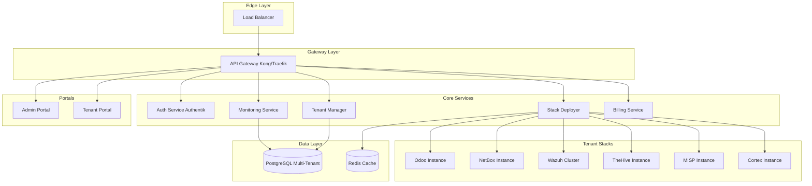

# ADR-0001: Arquitetura da Plataforma SaaS v3.0

**Data**: 06 de Dezembro de 2024
**Status**: Aceito
**Decisor**: Claude Opus 4.5 (Orquestrador)

---

## 📋 Contexto

O NEO_NETBOX_ODOO_STACK v2.1 está 100% completo com 7 integrações entre as ferramentas core. Agora precisamos evoluir para uma plataforma SaaS multi-tenant (v3.0) que permita oferecer o stack como serviço escalável para múltiplos clientes.

## 🎯 Decisão

Adotar uma **arquitetura de microservices** com os seguintes componentes core:

1. **API Gateway** (Kong/Traefik) - Single entry point
2. **Auth Service** (Authentik) - Autenticação multi-tenant
3. **Tenant Manager** (PostgreSQL) - Gestão de tenants
4. **Stack Deployer** (Terraform) - Provisionamento automático
5. **Monitoring Service** (Prometheus/Grafana) - Observabilidade
6. **Billing Service** (Stripe) - Cobrança
7. **Admin Portal** (React/Vue) - Gestão da plataforma
8. **Tenant Portal** (React/Vue) - Self-service

## 🏗️ Arquitetura

## ✅ Vantagens

1. **Escalabilidade**: Cada serviço escala independentemente
2. **Flexibilidade**: Tecnologias otimizadas por função
3. **Resiliência**: Falhas isoladas por serviço
4. **Manutenibilidade**: Equipes podem trabalhar em paralelo
5. **Observabilidade**: Métricas por serviço
6. **Billing Granular**: Cobrança por uso de cada serviço

## ❌ Desvantagens

1. **Complexidade**: Mais serviços para gerenciar
2. **Latência**: Comunicação inter-serviços
3. **Debugging**: Distribuído across múltiplos logs
4. **Consistência**: Eventual consistency em alguns fluxos

## 🔄 Alternativas Consideradas

### Alternativa 1: Monolito Modular
- **Prós**: Simples, menos latência
- **Contras**: Scaling difícil, deployment complexo
- **Decisão**: ❌ Rejeitado - não atende requisitos de escala

### Alternativa 2: Serverless (AWS Lambda)
- **Prós**: Pay-per-use, scaling automático
- **Contras**: Cold starts, vendor lock-in
- **Decisão**: ❌ Rejeitado - requisitos de performance

### Alternativa 3: Service Mesh (Istio)
- **Prós**: Observabilidade avançada, traffic management
- **Contras**: Complexidade extra, overhead
- **Decisão**: ⚠️ Considerado para v3.1 - opcional

## 📊 Métricas de Sucesso

- **Provisioning Time**: < 30 minutos
- **API Latency**: < 2 segundos (P95)
- **Uptime**: 99.9%
- **Multi-tenancy**: 10+ tenants simultâneos

## 🔐 Considerações de Segurança

1. **Isolamento de Dados**: PostgreSQL com schema por tenant
2. **Network Segmentation**: VPCs privadas por tenant
3. **Secrets Management**: HashiCorp Vault
4. **TLS Everywhere**: mTLS para comunicação interna
5. **RBAC**: Roles por tenant e por plataforma

## 📈 Roadmap de Implementação

### Sprint 9-10 (Abril 2025)
- API Gateway (Kong/Traefik)
- Auth Service (Authentik)
- Tenant Manager (PostgreSQL)
- Stack Deployer (Terraform)

### Sprint 11-12 (Maio 2025)
- Monitoring Service
- Billing Service
- Admin Portal
- Tenant Portal

### Sprint 13-16 (Maio-Jun 2025)
- Certificação
- Analytics
- ML Models
- Go-Live

## 📚 Referências

- [Twelve-Factor App](https://12factor.net/)
- [Microservices Patterns](https://microservices.io/)
- [Kubernetes Best Practices](https://kubernetes.io/docs/concepts/cluster-administration/manage-deployment/)
- [PostgreSQL Multi-Tenant Patterns](https://www.postgresql.org/docs/current/ddl-schemas.html)

---

**Próximo passo**: Implementar API Gateway (Sprint 9)
